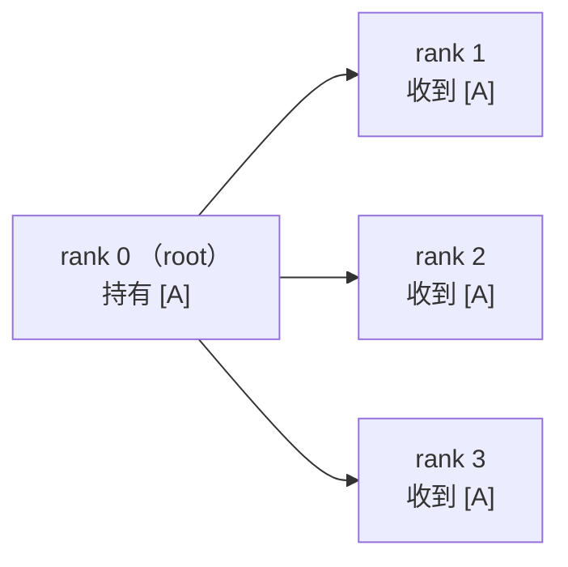
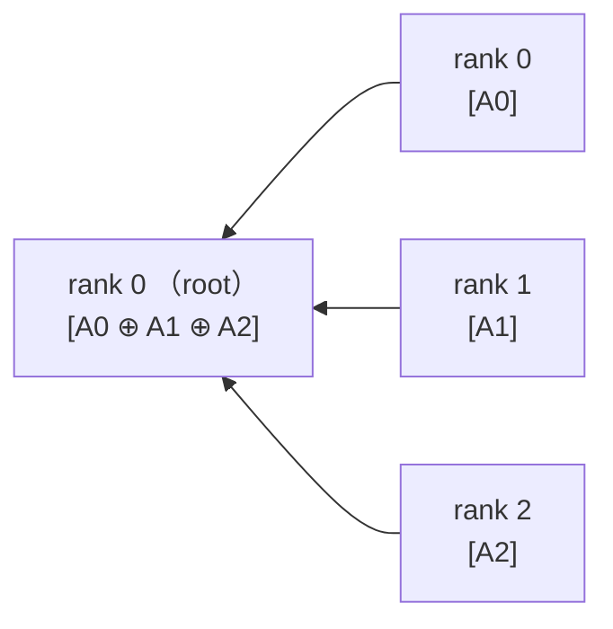
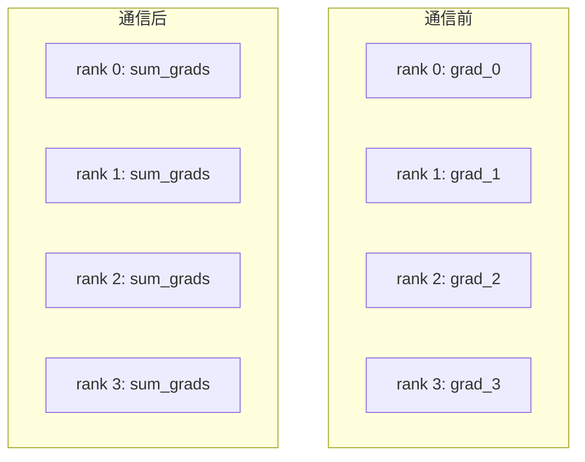
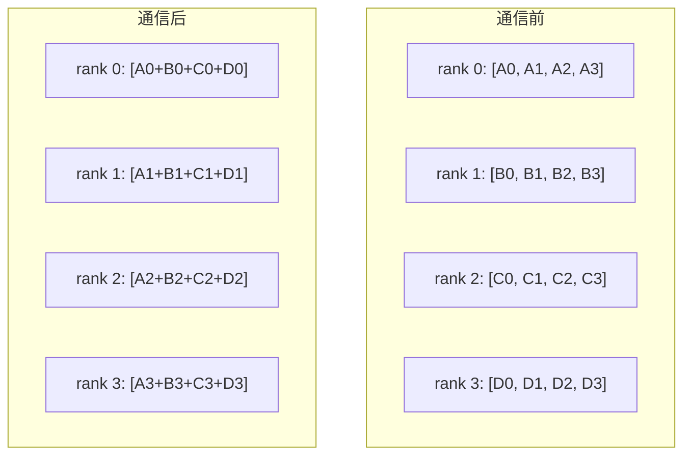
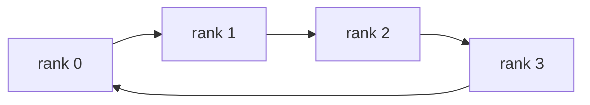
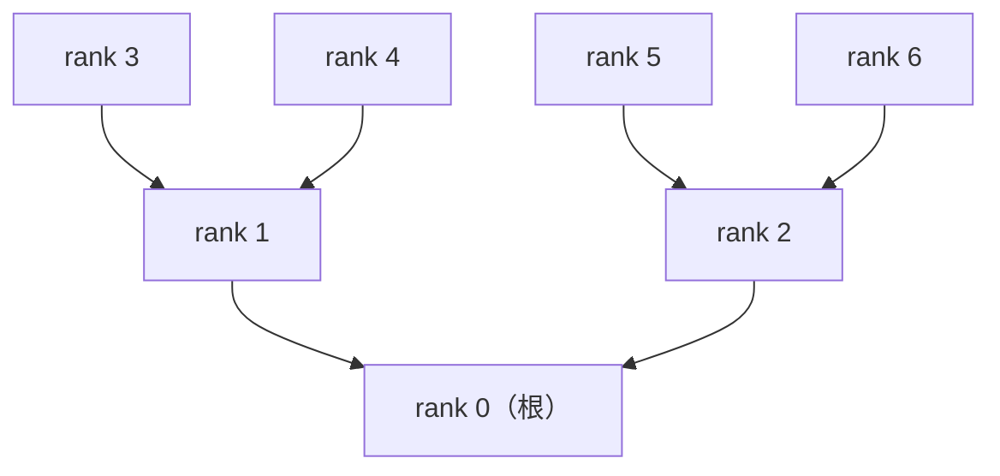
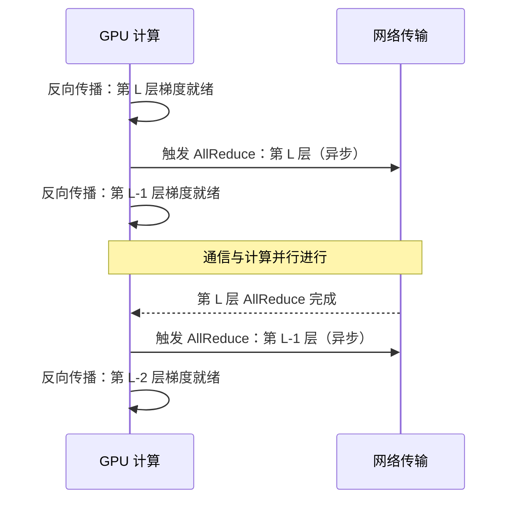

## 📑 目录

- [1. 为什么需要集群通信](#1-为什么需要集群通信)
- [2. 点对点通信：最基础的积木](#2-点对点通信最基础的积木)
- [3. 核心通信原语详解](#3-核心通信原语详解)
- [4. Ring AllReduce：带宽最优的实现](#4-ring-allreduce带宽最优的实现)
- [5. Tree AllReduce：低延迟的另一种思路](#5-tree-allreduce低延迟的另一种思路)
- [6. 通信与计算 Overlap](#6-通信与计算-overlap)
- [7. NCCL 实战](#7-nccl-实战)
- [总结](#-总结)
- [自我检验清单](#-自我检验清单)
- [参考资料](#-参考资料)

---

## 1. 为什么需要集群通信

想象 8 位研究员同时训练同一个大模型：每人手持一块 GPU，独立算出了各自数据上的梯度。现在他们需要把梯度"合并"起来，让每个人都知道全局的平均梯度，才能同步更新模型权重。

这就是分布式训练中最经典的问题——**梯度同步**。如果用最朴素的方式（把梯度逐一发给主 GPU，再广播回去），通信会成为严重瓶颈。**集群通信（Collective Communication）** 正是为解决这类"多方协同"通信问题而生的一套高效原语。

📌 **关键点**：集群通信是分布式训练的"血管系统"——计算再快，通信跟不上也是白搭。理解集群通信原语和算法，是设计高效并行策略的前提。

## 2. 点对点通信：最基础的积木

在集群通信之前，先理解最基础的通信模式：**Send / Recv**——一个进程发送，另一个进程接收。就像两个人打电话，一对一，定向传递。

```python
import torch
import torch.distributed as dist

# 假设已完成 dist.init_process_group(...)
if dist.get_rank() == 0:
    tensor = torch.tensor([1.0, 2.0, 3.0]).cuda()
    dist.send(tensor, dst=1)          # rank 0 发送给 rank 1
else:
    tensor = torch.zeros(3).cuda()
    dist.recv(tensor, src=0)          # rank 1 接收来自 rank 0 的数据
```

点对点通信足够灵活，但当需要"多方同时协作"时，手动逐一调用 Send/Recv 既繁琐又低效——这时候就需要集群通信原语了。

## 3. 核心通信原语详解

### 3.1 Broadcast：一对多广播

像广播电台一样，根节点（root）将同一份数据发送给所有参与者。



**每个非 root 节点的接收量**为 $M$（总数据量），总通信量为 $(N-1) \times M$（$N$ 为节点数）。

**典型场景**：训练开始时从 rank 0 广播初始化后的模型参数，确保所有 GPU 起点一致。

```python
tensor = torch.tensor([1.0, 2.0]).cuda()
dist.broadcast(tensor, src=0)   # rank 0 广播，其余 rank 接收
```

### 3.2 Reduce：多对一归约

每个参与者各有一份数据，通过某种运算（求和、求最大值等）将结果汇聚到根节点。可以把它想象成"投票计数"——每个人报出自己的数值，结果汇总到主席。



**典型场景**：汇总各 GPU 上的 loss 到 rank 0 用于日志记录。

```python
loss = compute_local_loss()
dist.reduce(loss, dst=0, op=dist.ReduceOp.SUM)
# 只有 rank 0 的 loss 变量包含全局求和结果
```

### 3.3 AllReduce：最重要的原语

AllReduce 在语义上等价于 Reduce + Broadcast：所有参与者各有一份数据，归约后**每个参与者都持有完整的归约结果**。



这是分布式数据并行（DDP）中**最常用的通信原语**，用于同步各 GPU 上的梯度。

```python
# 手动同步梯度（DDP 内部会自动完成这一步）
for param in model.parameters():
    dist.all_reduce(param.grad, op=dist.ReduceOp.SUM)
    param.grad /= dist.get_world_size()   # 转为平均梯度
```

### 3.4 AllGather：收集所有人的数据

每个参与者贡献一块数据，最终**所有人都持有所有人贡献的完整集群**。就像聚餐时每人带一道菜，席散后每人都拍了一张全桌的照片。

通信量：每个 rank 发送 $M/N$ 字节，接收 $(N-1) \times M/N$ 字节（最终每人拥有 $M$ 字节）。

**典型场景**：ZeRO-3 前向传播时，从各 rank 收集分片的模型参数，拼成完整权重进行计算。

```python
local_chunk = torch.randn(4).cuda()           # 每 rank 持有 1/4 的参数分片
gathered = [torch.zeros(4).cuda() for _ in range(dist.get_world_size())]
dist.all_gather(gathered, local_chunk)        # 收集后每 rank 持有完整 16 元素
```

### 3.5 ReduceScatter：归约后分片

每个参与者贡献完整数据，归约后**每人只持有归约结果中属于自己的那一份**。可以理解为 AllReduce 的"非对称版"——做了加法，但不把完整结果复制给所有人，而是按索引分配。



💡 **提示**：`AllReduce = ReduceScatter + AllGather`。这一分解是 Ring AllReduce 算法的核心思想，后文会详细展开。

**典型场景**：ZeRO-2/3 中，各 rank 归约梯度后只保留属于自己的那一份，节省显存。

### 3.6 通信量对比一览

| 🔧 原语 | 📤 每 rank 发送量 | 📥 每 rank 接收量 | 💡 典型用途 |
|--------|----------------|----------------|-----------|
| Broadcast | $M$（root）/ 0 | 0（root）/ $M$ | 参数初始化广播 |
| Reduce | $M$ | $M$（root）/ 0 | Loss 汇总 |
| AllReduce | $\approx 2M$ | $\approx 2M$ | DDP 梯度同步 |
| AllGather | $M/N$ | $(N-1)M/N$ | ZeRO-3 参数收集 |
| ReduceScatter | $(N-1)M/N$ | $(N-1)M/N$ | ZeRO 梯度分片 |

> $M$ 为总数据量，$N$ 为参与节点数。AllReduce 的精确推导见下节。

## 4. Ring AllReduce：带宽最优的实现

### 4.1 朴素方案的瓶颈

最直觉的 AllReduce 方案是"中心化归约"：所有 GPU 把梯度发给 rank 0，rank 0 求和后再广播回去。这就像让所有快递都先送到总仓库再分发——节点数一多，rank 0 成为通信瓶颈，其他链路处于空闲，带宽利用率极低。

### 4.2 环形拓扑：让所有链路都忙起来

Ring AllReduce 把所有节点排成一个**逻辑环**，每个节点既向下一个节点发送数据，也从上一个节点接收数据，让所有链路同时工作。



整个过程分两个阶段：

**阶段一：ReduceScatter（归约 + 分片）**

将每个 rank 的数据均分为 $N$ 块，进行 $N-1$ 轮环形传递。每轮中，每个 rank 将一块数据传给下一个 rank，同时接收上一个 rank 传来的数据并与本地对应块累加。经过 $N-1$ 轮，每个 rank 持有完全归约后的 $\frac{1}{N}$ 数据块。

**阶段二：AllGather（全收集）**

再进行 $N-1$ 轮传递，每个 rank 将自己已归约好的那块数据沿环传递出去，最终每个 rank 都拥有完整的归约结果。

### 4.3 通信量推导

每个 rank 在 ReduceScatter 阶段：发送 $N-1$ 次，每次 $M/N$ 字节；接收 $N-1$ 次，每次 $M/N$ 字节。AllGather 阶段同理。

因此每个 rank 的总通信量为：

$$
\text{通信量} = 2 \times (N-1) \times \frac{M}{N} = \frac{2(N-1)}{N} \times M
$$

当 $N$ 较大时，$\frac{N-1}{N} \to 1$，通信量趋近于 $2M$，**与节点数无关**。这意味着 Ring AllReduce 是**带宽最优（bandwidth-optimal）**的，线性扩展性极佳。

⚠️ **注意**：Ring AllReduce 带宽最优，但不是延迟最优。$2(N-1)$ 轮传递意味着延迟随节点数线性增长，在节点数很多但数据量很小的场景中会成为瓶颈。

### 4.4 代码验证

```python
import torch
import torch.distributed as dist

# 4 卡环境下验证 AllReduce
rank = dist.get_rank()
world_size = dist.get_world_size()

# 每个 rank 初始化不同的值
tensor = torch.tensor([float(rank + 1)]).cuda()
print(f"rank {rank} before: {tensor.item()}")

dist.all_reduce(tensor, op=dist.ReduceOp.SUM)
print(f"rank {rank} after : {tensor.item()}")
# 所有 rank 输出相同的值：1+2+3+4 = 10.0
```

## 5. Tree AllReduce：低延迟的另一种思路

Ring AllReduce 延迟是 $O(N)$ 的。Tree AllReduce 以树形拓扑组织通信，将延迟降为 $O(\log N)$，适合数据量小、对延迟敏感的场景（如同步单个标量指标）。



**Reduce 阶段**（叶 → 根）：从叶节点向根节点逐层归约，共 $\lceil \log_2 N \rceil$ 步。
**Broadcast 阶段**（根 → 叶）：从根节点向叶节点逐层广播，同样 $\lceil \log_2 N \rceil$ 步。

| 📊 对比项 | Ring AllReduce | Tree AllReduce |
|---------|--------------|--------------|
| 端到端延迟 | $O(N)$ | $O(\log N)$ |
| 带宽利用率 | 接近 100%（大数据量） | 较低（根节点是瓶颈） |
| 最适场景 | 梯度同步（大张量） | allreduce 标量（loss、step） |

NCCL 内部会根据数据大小自动在 Ring 和 Tree 算法之间切换（也可通过环境变量 `NCCL_ALGO` 强制指定），该决策对上层框架完全透明。

## 6. 通信与计算 Overlap

通信计算 Overlap 是分布式训练性能优化的核心手段。核心思想是：**在 GPU 计算后续层梯度的同时，并行传输已完成的前面层梯度**，从而将通信延迟"藏进"计算时间里。



在 PyTorch DDP 中，这一 Overlap 通过 **bucket 机制**自动实现：模型参数被分组为若干 bucket，一个 bucket 内所有参数的梯度计算完毕后，立即异步触发 AllReduce，而不等整个模型的梯度都就绪。

```python
from torch.nn.parallel import DistributedDataParallel as DDP

model = DDP(
    model,
    device_ids=[local_rank],
    bucket_cap_mb=25,    # 默认 25MB，控制 Overlap 粒度
)
```

💡 **提示**：`bucket_cap_mb` 需要权衡——太大会导致等待时间长（需积累更多梯度才触发），太小会导致通信次数多（每次通信有固定启动开销）。通常 25MB 是较好的起点，可根据模型层大小适当调整。

## 7. NCCL 实战

### 7.1 NCCL 是什么

NCCL（NVIDIA Collective Communications Library，当前版本 **NCCL 2.30.3**）是 NVIDIA 官方提供的集群通信库，专为 GPU 集群上的深度学习训练优化设计。

其核心优势：
- **拓扑感知**：自动检测 NVLink、PCIe、InfiniBand 等拓扑，选择最优传输路径
- **GPU 原生**：通信和计算在单个 CUDA kernel 中完成，与 GPU 计算流紧密配合
- **后端透明**：PyTorch、Horovod 等框架通过统一接口调用 NCCL，用户无需关心底层细节

### 7.2 通过 PyTorch 使用 NCCL

```python
import os
import torch
import torch.distributed as dist

def setup(rank, world_size):
    os.environ["MASTER_ADDR"] = "localhost"
    os.environ["MASTER_PORT"] = "12355"
    dist.init_process_group(
        backend="nccl",       # 指定 NCCL 后端
        rank=rank,
        world_size=world_size,
    )
    torch.cuda.set_device(rank)

def cleanup():
    dist.destroy_process_group()

def run(rank, world_size):
    setup(rank, world_size)

    tensor = torch.ones(1024, 1024).cuda()
    dist.all_reduce(tensor, op=dist.ReduceOp.SUM)
    # 预期结果：tensor 中所有元素变为 world_size
    print(f"Rank {rank}: value = {tensor[0, 0].item()}")

    cleanup()

if __name__ == "__main__":
    world_size = torch.cuda.device_count()
    torch.multiprocessing.spawn(run, args=(world_size,), nprocs=world_size)
```

### 7.3 关键环境变量

NCCL 提供丰富的环境变量，可以在不修改代码的情况下调整通信行为。

**调试与诊断**

| 变量 | 说明 | 常用值 |
|------|------|--------|
| `NCCL_DEBUG` | 调试日志级别 | `VERSION` / `WARN` / `INFO` |
| `NCCL_DEBUG_SUBSYS` | 过滤子系统日志 | `ALL` / `NET` / `INIT` |
| `NCCL_TOPO_DUMP_FILE` | 导出检测到的拓扑为 XML | `/tmp/nccl_topo.xml` |

**算法与协议选择**

| 变量 | 说明 | 可选值 |
|------|------|--------|
| `NCCL_ALGO` | 强制指定通信算法 | `Ring` / `Tree` |
| `NCCL_PROTO` | 强制指定传输协议 | `LL` / `LL128` / `Simple` |

**网络配置**

| 变量 | 说明 | 示例 |
|------|------|------|
| `NCCL_SOCKET_IFNAME` | 指定 TCP/IP 网络接口 | `eth0` / `^lo`（排除回环） |
| `NCCL_IB_HCA` | 指定 InfiniBand 网卡 | `mlx5_0` |
| `NCCL_NET_GDR_LEVEL` | GPUDirect RDMA 拓扑级别 | `0`（禁用）~ `5` |

**常用调试命令**

```bash
# 查看 NCCL 检测到的版本和拓扑信息
NCCL_DEBUG=INFO python train.py

# 强制使用 Ring 算法
NCCL_ALGO=Ring NCCL_DEBUG=INFO python train.py

# InfiniBand 集群上指定网卡并开启 GPUDirect
NCCL_IB_HCA=mlx5_0 NCCL_NET_GDR_LEVEL=2 python train.py
```

### 7.4 使用 nccl-tests 验证通信带宽

[nccl-tests](https://github.com/NVIDIA/nccl-tests) 是 NVIDIA 官方提供的通信性能基准测试工具，可用于验证集群通信带宽是否达到预期。

```bash
# 编译
git clone https://github.com/NVIDIA/nccl-tests
cd nccl-tests && make

# 单机 8 卡 AllReduce 带宽测试（数据量从 8B 到 256MB，步进因子 2）
./build/all_reduce_perf -b 8 -e 256M -f 2 -g 8
```

输出示例（关键列说明）：

```
#  size(B)    count   type    redop    time(us)  algbw(GB/s)  busbw(GB/s)
   8388608    2097152  float   sum      285.4       29.4         51.5
  67108864   16777216  float   sum      1823.0      36.8         64.4
 268435456   67108864  float   sum      5210.0      51.5         90.1
```

💡 **提示**：`busbw`（Bus Bandwidth）才是反映硬件带宽利用率的指标。它已按照算法的传输倍数做了修正——对于 AllReduce，修正因子恰好就是 $\frac{2(N-1)}{N}$。对照硬件理论带宽时应看 `busbw`，而非 `algbw`。

## 📝 总结

集群通信是分布式训练的基础设施，本文从原语到算法再到工具，逐层递进：

1. **通信原语**：Broadcast（一对多）、Reduce（多对一）、AllReduce（多对多，最常用）、AllGather（收集所有）、ReduceScatter（归约后分片），每种原语适用于不同的并行策略场景
2. **Ring AllReduce**：通过环形拓扑让每个节点都参与通信，每 rank 通信量为 $\frac{2(N-1)}{N} \times M$，带宽最优，是 DDP 梯度同步的核心算法
3. **Tree AllReduce**：延迟 $O(\log N)$，适合小数据量场景，NCCL 内部会根据数据大小自动选择
4. **通信计算 Overlap**：通过 DDP 的 bucket 机制，在计算后续层梯度时并行传输已就绪的梯度，有效隐藏通信延迟
5. **NCCL**：NVIDIA 官方集群通信库（当前 v2.30.3），拓扑感知、GPU 原生，通过环境变量可灵活调优，配合 nccl-tests 可验证通信性能

## 🎯 自我检验清单

- 能说出 5 种核心通信原语（Broadcast / Reduce / AllReduce / AllGather / ReduceScatter）各自的语义：谁发、谁收、结果如何分布
- 能用公式 $\frac{2(N-1)}{N} \times M$ 估算 AllReduce 在 8 卡场景下每张卡的通信量，并说明为何这与节点数几乎无关
- 能解释 Ring AllReduce 的两个阶段（ReduceScatter + AllGather）及每阶段 $N-1$ 轮传递的过程
- 能对比 Ring AllReduce 与 Tree AllReduce 在延迟、带宽利用率、适用场景上的差异
- 能解释通信计算 Overlap 的原理，以及 PyTorch DDP 的 bucket 机制如何实现 Overlap
- 能写出使用 NCCL 后端初始化 PyTorch 分布式进程组并调用 AllReduce 的完整代码
- 能用 `NCCL_DEBUG=INFO` 排查 NCCL 初始化问题，用 nccl-tests 测试通信带宽
- 能区分 nccl-tests 输出中 `algbw` 和 `busbw` 的含义，并说明为何 `busbw` 更能代表硬件利用率

## 📚 参考资料

- [NCCL User Guide (v2.30.3)](https://docs.nvidia.com/deeplearning/nccl/user-guide/docs/overview.html)
- [NCCL Collective Operations API](https://docs.nvidia.com/deeplearning/nccl/user-guide/docs/api/colls.html)
- [nccl-tests — NVIDIA Official Communication Benchmark](https://github.com/NVIDIA/nccl-tests)
- [PyTorch Distributed Overview](https://pytorch.org/tutorials/beginner/dist_overview.html)
- [PyTorch torch.distributed API](https://pytorch.org/docs/stable/distributed.html)
