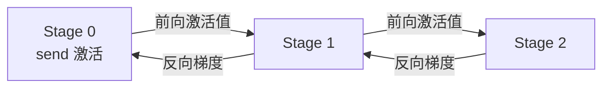

流水线并行（Pipeline Parallelism, PP）是大模型跨机训练的支柱之一：模型大到单机 8 卡都装不下时，把不同的层放到不同机器上，让数据像流水一样逐站经过。想法朴素，但一落地就会撞上 PP 的灵魂问题——**Pipeline Bubble（流水线气泡）**：绝大部分时间里，大部分 GPU 都在等别人算完。本文从 Bubble 的成因讲起，把 **GPipe、1F1B、Interleaved 1F1B** 三代调度策略的设计动机、时间线图、Bubble 比例与显存账本逐一推导清楚，最后落到 Megatron-LM 的工程实现与 Zero-Bubble 等前沿方向。全文以推导和图为主，力求每个公式都能自己算出来。

<!-- more -->

## 📑 目录

- [1. 流水线并行要解决什么问题](#1-流水线并行要解决什么问题)
- [2. 朴素流水线与 Bubble 的诞生](#2-朴素流水线与-bubble-的诞生)
- [3. GPipe：用 micro-batch 填满流水线](#3-gpipe用-micro-batch-填满流水线)
- [4. 1F1B：边算边吐，压低峰值显存](#4-1f1b边算边吐压低峰值显存)
- [5. Interleaved 1F1B：虚拟 Stage 再压 Bubble](#5-interleaved-1f1b虚拟-stage-再压-bubble)
- [6. 工程实现：P2P 通信与负载均衡](#6-工程实现p2p-通信与负载均衡)
- [7. 显存与 Bubble 账本：定量对比](#7-显存与-bubble-账本定量对比)
- [8. 前沿：Zero-Bubble 与 DualPipe](#8-前沿zero-bubble-与-dualpipe)
- [9. 选型决策指南](#9-选型决策指南)
- [总结](#-总结)
- [自我检验清单](#-自我检验清单)
- [参考资料](#-参考资料)

---

## 1. 流水线并行要解决什么问题

先厘清定位：前面几章解决的痛点各不相同——数据并行解决"**跑不完**"（数据太多、训练太慢），张量并行解决单机内"**层太大**"（单层矩阵切多卡），而流水线并行解决的是"**模型太深，单机装不下**"。

打个比方：一家工厂要组装的产品工序太多，一个工位放不下所有设备。流水线并行的做法是把工序拆到 $P$ 个工位上，每个工位只负责自己那一段，产品（数据）依次流过所有工位。映射回模型：

1. 把模型的 $L$ 层切分成 $P$ 段（Stage），每个 Stage 放到一块 GPU（通常是一台机器）上
2. 前向时，激活值从 Stage 0 依次传到 Stage $P-1$；反向时，梯度沿原路传回
3. 每个 Stage 只需存储自己那 $\frac{L}{P}$ 层的参数、梯度和优化器状态

📌 **关键点**：PP 是**层间**切分，天然适合**跨机**扩展——相邻 Stage 之间只传激活值，通信发生在层与层的边界上，频率远低于张量并行（TP 每层都要通信，只能活在 NVLink 单机内）。所以常见的组合是：**机内 TP、机间 PP**。

但 PP 有一个与生俱来的代价。看下面这个最朴素的实现（$P=4$ 个 Stage、1 个 batch）：

```text
时间 →
Stage 0:  F          B
Stage 1:     F          B
Stage 2:        F          B
Stage 3:           F          B
                ↑      ↑
              前向串行  反向串行，其余时间全部空转
```

一个 batch 的前向必须串行经过 4 个 Stage，反向再串行回来。任一时刻只有 1 个 Stage 在干活，**$P-1$ 个 Stage 在空转**——这部分被浪费掉的时间，就是 Pipeline Bubble。怎么把 Bubble 挤掉，是 PP 调度的全部学问。

---

## 2. 朴素流水线与 Bubble 的诞生

先把 Bubble 量化。记单个 Stage 对单个 micro-batch 的前向耗时为 $F$、反向耗时为 $B$（分析时通常近似 $F = B$）。

朴素实现中，$P$ 个 Stage 处理一个 batch 的总耗时是 $P(F+B)$，而每个 Stage 真正在计算的时间只有 $(F+B)$，于是：

$$
\text{Bubble 比例}_{\text{naive}} = \frac{(P-1)(F+B)}{P(F+B)} = \frac{P-1}{P}
$$

$P=8$ 时，$\frac{7}{8}$ 的算力在空转——显然无法接受。

**破局的关键观察**：Bubble 的本质是"同一时刻只有一个数据在流水线上"。如果把一个大 batch（mini-batch）切成 $M$ 个小批次（**micro-batch**），让它们像工厂里的多件产品一样**挨个进入流水线**，那么装满之后，每个时刻就都有 Stage 在忙了。这就是 GPipe 的核心思想。

---

## 3. GPipe：用 micro-batch 填满流水线

### 3.1 执行模式

GPipe 把 mini-batch 切为 $M$ 个 micro-batch，依次注入流水线：**先把所有 micro-batch 的前向做完，再统一做所有反向**（F-F-F-…-B-B-B-…）。以 $P=4$、$M=8$ 为例（示意图，每个格子一个时间单位）：

```text
时间 →
Stage 0: F0 F1 F2 F3 F4 F5 F6 F7 ·  ·  ·  B0 B1 B2 B3 B4 B5 B6 B7
Stage 1: ·  F0 F1 F2 F3 F4 F5 F6 F7 ·  ·  B0 B1 B2 B3 B4 B5 B6 B7
Stage 2: ·  ·  F0 F1 F2 F3 F4 F5 F6 F7 ·  B0 B1 B2 B3 B4 B5 B6 B7
Stage 3: ·  ·  ·  F0 F1 F2 F3 F4 F5 F6 F7 B0 B1 B2 B3 B4 B5 B6 B7
              └── 填充期 ──┘              └── 排空期 ──┘
```

可以看到明显的两段浪费：

- **填充期**：第一个 micro-batch 要走完 $P$ 个 Stage 才能让末尾 Stage 开工，前面的 Stage 各闲 $P-1$ 个前向单位
- **排空期**：最后一个 micro-batch 的反向要走回 $P$ 个 Stage，首端 Stage 在尾部再闲 $P-1$ 个反向单位

### 3.2 Bubble 比例推导

每个 Stage 的空闲总量 = $(P-1)(F+B)$；而整个 batch 的总耗时 = 有效计算 $M(F+B)$ + Bubble $(P-1)(F+B)$ = $(M+P-1)(F+B)$。于是：

$$
\boxed{\text{Bubble 比例} = \frac{(P-1)(F+B)}{(M+P-1)(F+B)} = \frac{P-1}{M+P-1}}
$$

代入数字感受一下（$P=4$）：

| $M$ | Bubble 比例 | 直觉 |
|---|---|---|
| 1（=朴素） | $3/4 = 75\%$ | 退化为朴素 PP |
| 8 | $3/11 \approx 27.3\%$ | 大幅改善 |
| 32 | $3/35 \approx 8.6\%$ | 趋于可接受 |
| $\to\infty$ | $\to 0$ | 极限情况无 Bubble |

🔑 **核心概念**：$M$ 越大 Bubble 越小，但 $M$ 有上限——不是流水线填不满，而是**显存先爆**（见 3.3）。工程上 $M$ 的常见取值为 $M \geq 4P$（Bubble ≤ 20% 左右）。

### 3.3 GPipe 的代价：激活值显存

GPipe 的硬伤藏在它的执行顺序里：**所有前向做完才开始反向**，意味着从第一个 micro-batch 前向完成、到最后一个反向开始之间，**所有 $M$ 个 micro-batch 的激活值都必须活在显存里**。

$$
\text{峰值激活显存}_{\text{GPipe}} = M \times a_{\text{mb}}
$$

其中 $a_{\text{mb}}$ 是单个 micro-batch 经过该 Stage 时产生的激活值。$M=32$ 就要同时存 32 份激活——在大模型上这往往是几十 GB 量级，直接抵消了 PP 省下的显存。

⚠️ **注意**：GPipe 论文用 **re-materialization**（激活重计算，即 Activation Checkpointing）缓解这个问题——反向时重新计算激活而不是存储。但重计算 ≈ 多一次前向，又拉长了总耗时。能否**不改调度就省显存**？这正是 1F1B 的切入点。

---

## 4. 1F1B：边算边吐，压低峰值显存

### 4.1 核心思想

1F1B（One Forward One Backward，又称 PipeDream-Flush）做了一个看似微小、实则关键的改动：**交替执行前向和反向，让激活值尽早释放**。

一个 micro-batch 的激活值，只有在它的反向完成那一刻才能删掉。GPipe 里，$m_0$ 的激活要等"全部前向结束"才被消费；1F1B 的思路是：$m_0$ 的反向一能做就立刻做，它的激活随之释放，显存不再随 $M$ 线性增长。

### 4.2 三个阶段

1F1B 把每个 Stage 的执行划分为三段：

```text
时间 →
Stage 0: F0 F1 F2 F3 B0 F4 B1 F5 B2 F6 B3 F7 B4 B5 B6 B7
Stage 1: ·  F0 F1 F2 B0 F3 B1 F4 B2 F5 B3 F6 B4 F7 B5 B6 B7 ·
Stage 2: ·  ·  F0 F1 B0 F2 B1 F3 B2 F4 B3 F5 B4 F6 B5 F7 B6 B7 ·  ·
Stage 3: ·  ·  ·  F0 B0 F1 B1 F2 B2 F3 B3 F4 B4 F5 B5 F6 B6 F7 B7 ·  ·  ·
              └ Warmup ┘└── Steady（1F1B 稳态）──┘└ Cooldown ┘
```

- **Warmup（填充）**：流水线还没满，只能做前向。越靠近末端的 Stage warmup 越短——末端 Stage 做完 $m_0$ 前向就能立刻反向，几乎直接进入稳态；首端 Stage 要攒 $P-1$ 个前向后才迎来第一次反向。Megatron-LM 中每个 Stage 的 warmup micro-batch 数为 $\min(M,\ P - \text{rank} - 1)$（rank 从 0 起、首端为 0）
- **Steady（稳态）**：严格一次前向接一次反向（1F1B 名字的由来），激活值"边算边吐"
- **Cooldown（排空）**：micro-batch 用尽，只剩反向依次收尾

### 4.3 两个重要结论

**结论一：Bubble 比例与 GPipe 完全相同。**

$$
\text{Bubble 比例}_{\text{1F1B}} = \frac{P-1}{M+P-1}
$$

对比一下 3.1 与本节的两张时间线图：总耗时都是 $(M+P-1)(F+B)$，空闲格子一个没少。1F1B 只是把同样的工作**换了个顺序**——填充期和排空期的 Bubble 一格不动。**1F1B 优化的是显存，不是 Bubble**，这一点极易混淆。

**结论二：峰值激活显存从 $M$ 份降到 $P$ 份。**

稳态时，"已前向完成、反向未开始"的 micro-batch 在整条流水线上最多同时存活 $P$ 个（可以数一下时间线图中任意竖列：每个 Stage 至多积压其 warmup 份额，合计 $\leq P$）。因此：

$$
\text{峰值激活显存}_{\text{1F1B}} = P \times a_{\text{mb}} \ll M \times a_{\text{mb}}
$$

📌 **关键点**：$P=8$、$M=32$ 时，GPipe 要同时存 32 份激活，1F1B 只需 8 份——**同样的 Bubble，4 倍的显存差距**。这就是为什么 1F1B 成为 Megatron-LM 的默认调度。

---

## 5. Interleaved 1F1B：虚拟 Stage 再压 Bubble

### 5.1 核心思想

1F1B 把显存打下来了，Bubble 却一分没动。要压缩 Bubble，回看公式 $\frac{P-1}{M+P-1}$——要么增大 $M$（受显存限制），要么想办法"等效"增大 $M$。

Interleaved 1F1B（交错式，Megatron-LM 论文提出）的做法是：**每个设备不再负责连续的一段层，而是负责多段不相邻的层**。把每个 Stage 再切成 $v$ 个 **虚拟 Stage**（每个虚拟 Stage 有 $\frac{L}{P \cdot v}$ 层），按"轮转"方式分配给设备。例如 $P=2$、$v=2$：设备 0 负责第 1、3 段，设备 1 负责第 2、4 段。

效果相当于：物理设备还是 $P$ 台，但**逻辑流水线加深为 $P \cdot v$ 级**——同一批 micro-batch 要在逻辑流水线上多走 $v$ 圈，等效于把 $M$ 放大了 $v$ 倍：

$$
\boxed{\text{Bubble 比例}_{\text{Interleaved}} = \frac{P-1}{M \cdot v + P - 1}}
$$

### 5.2 代价：通信换 Bubble

天下没有免费的午餐。虚拟 Stage 之间的边界数量是原来的 $v$ 倍，每条边界都意味着一次跨设备激活传输：

| 维度 | 1F1B | Interleaved 1F1B |
|---|---|---|
| Bubble 比例 | $\frac{P-1}{M+P-1}$ | $\frac{P-1}{Mv+P-1}$（缩小约 $v$ 倍） |
| 峰值激活显存 | $P$ 份 | $P$ 份（不变） |
| 通信频率 | $1\times$ | $v\times$ |
| 适用前提 | 通用 | 机间带宽充足（IB/RoCE） |

📌 **关键点**：Interleaved 是典型的"**通信换 Bubble**"策略。跨机带宽够（NVLink 级互联的 SuperPOD 或 IB 集群）时收益明显；带宽吃紧时，增加的通信时间可能反而吃掉省下的 Bubble。

---

## 6. 工程实现：P2P 通信与负载均衡

### 6.1 Stage 间通信是 P2P，不是集合通信

第 2 章的 AllReduce/AllGather 是"大家一起对表"的集合通信；而 PP 相邻 Stage 之间只是简单的"你发我收"——**点对点（P2P）通信**，Megatron-LM 直接用 `send`/`recv`（或 `batch_isend_irecv`）实现：



每个 micro-batch、每个 Stage 边界，前向传一次激活、反向传一次梯度。单次传输量为：

$$
V = b_{\text{micro}} \times s \times h \times \text{dtype 字节数}
$$

代入典型值（$b_{\text{micro}}=1$、$s=4096$、$h=4096$、bf16）：$V = 1 \times 4096 \times 4096 \times 2\,\text{B} = 32\,\text{MB}$。200 Gb/s 的 IB 带宽（约 25 GB/s）下约 1.3 ms，相比每步几十到几百毫秒的 Stage 计算量，占比不大——这正是 PP 适合跨机的原因。但注意 Interleaved 把这笔开销放大了 $v$ 倍。

### 6.2 负载均衡：不是均分层数就行

各层计算量并不均匀，简单按层数均分会让流水线"短板效应"显著（Bubble 跟着最慢的 Stage 走）：

- **Embedding 层**：只有查表，计算量小但参数可能很大，通常放在第一个 Stage
- **Loss 与 LM Head**：在最后端，词表大时计算量不可忽视，通常放在最后一个 Stage
- **首末 Stage 少分 Transformer 层**：工程上常给首尾 Stage 少排 1~2 层，补偿 Embedding/Loss 的额外开销
- **非均匀划分**：Megatron 支持自定义各 Stage 的层数列表，按实测耗时调平

### 6.3 与 Activation Checkpointing 的配合

PP 和重计算是黄金搭档：1F1B 已经把峰值激活压到 $P$ 份，再在 Stage 内部对每层做选择性重计算，可以把 $a_{\text{mb}}$ 本身再压缩一个量级。代价是约 30% 的额外计算——用时间换空间，在跨机长流水线场景几乎总是划算的。

---

## 7. 显存与 Bubble 账本：定量对比

把三种调度放到同一张账本上（$P=8$，设单个 micro-batch 激活为 1 份）：

| 调度 | Bubble 比例 | 峰值激活显存 | 通信频率 | $M=32$ 时 Bubble | $M=32$ 时峰值激活 |
|---|---|---|---|---|---|
| GPipe | $\frac{7}{M+7}$ | $M$ 份 | $1\times$ | $7/39 \approx 17.9\%$ | 32 份 |
| 1F1B | $\frac{7}{M+7}$ | $P=8$ 份 | $1\times$ | $7/39 \approx 17.9\%$ | 8 份 |
| Interleaved（$v=2$） | $\frac{7}{2M+7}$ | $P=8$ 份 | $2\times$ | $7/71 \approx 9.9\%$ | 8 份 |

🔑 **核心概念**：三者的关系一句话说清——GPipe 解决"能不能流水"（$M$ 决定 Bubble）；1F1B 解决"显存扛不扛得住"（峰值 $M \to P$）；Interleaved 解决"Bubble 还能不能再压"（等效 $M \times v$，代价是通信 $\times v$）。

---

## 8. 前沿：Zero-Bubble 与 DualPipe

1F1B 之后，学术界和工业界继续向"零气泡"逼近，代表性工作有两条：

- **Zero-Bubble Pipeline（ZBPP）**：把反向传播拆成两部分——对输入激活的梯度（$B$，要继续向前传）和对权重的梯度（$W$，本地更新用）。$W$ 不阻塞流水线，可以**见缝插针地填进残余 Bubble**，理论上能把 Bubble 压到趋近于 0。DeepSeek-V2 起便有工程落地。
- **DualPipe（DeepSeek-V3）**：双向流水线——两批数据从流水线的两端同时注入，前向反向互相填充对方的空闲段，再配合通信与计算的细粒度重叠，在 8 路 PP 下把 Bubble 压到极低的个位数比例。

💡 **提示**：这些前沿调度的设计原点仍然是本章的账本——先想清楚 Bubble 在哪一段、能不能用不阻塞的工作去填。看懂 GPipe/1F1B 的时间线图，ZBPP 和 DualPipe 的论文就只剩工程细节了。

---

## 9. 选型决策指南

| 场景 | 建议 |
|---|---|
| 模型单机装得下，只想加速 | 不需要 PP，用 DP/FSDP 即可 |
| 单机装不下，机间是 NVLink/NVSwitch | 优先 TP；PP 作为跨节点扩展的补充 |
| 跨机扩展、带宽充足（IB） | PP + 1F1B 起步；追求低 Bubble 上 Interleaved（$v=2$） |
| 显存紧张 | 1F1B + Activation Checkpointing，$M$ 取 $4P$ 左右 |
| 极致吞吐（万卡集群） | Zero-Bubble / DualPipe，配合 3D 混合并行（见第 11 章） |

一个经验公式收尾：**PP 度数 = 模型层数放不下时的"最后手段"**，能 TP 解决的不要上 PP（引入 Bubble 和复杂调度），必须上 PP 时优先 1F1B，带宽富裕再考虑 Interleaved。

---

## ✅ 总结

- PP 把模型的层切到不同设备，是跨机扩展的主力；代价是朴素实现下 $\frac{P-1}{P}$ 的 Pipeline Bubble
- GPipe 用 $M$ 个 micro-batch 填流水线，Bubble 降为 $\frac{P-1}{M+P-1}$，但峰值激活显存为 $M$ 份
- 1F1B 交替前向反向（Warmup-Steady-Cooldown 三段式），Bubble 不变，峰值显存降到 $P$ 份，是 Megatron 默认调度
- Interleaved 1F1B 用 $v$ 个虚拟 Stage 等效放大 $M$，Bubble 再降约 $v$ 倍，代价是通信频率也乘 $v$
- Stage 间是 P2P 通信（单次 $b \times s \times h$），负载均衡要照顾 Embedding/Loss 的首尾 Stage；PP 与重计算天然互补
- 前沿的 Zero-Bubble（拆 $B$/$W$ 梯度填缝）与 DualPipe（双向流水线）把 Bubble 进一步压向 0

---

## 📝 自我检验清单

1. 为什么朴素 PP 的 Bubble 比例是 $\frac{P-1}{P}$？$M$ 个 micro-batch 又是如何把它降到 $\frac{P-1}{M+P-1}$ 的？（能默写推导）
2. 画出 $P=4$、$M=8$ 时 GPipe 和 1F1B 的时间线图，指出两者的 Bubble 格子为什么一样多。
3. 1F1B 的 Warmup / Steady / Cooldown 各阶段在做什么？为什么首端 Stage warmup 最长？
4. 为什么 1F1B 的峰值激活显存是 $P$ 份而不是 $M$ 份？$P=8$、$M=64$ 时两种调度各要存几份？
5. Interleaved 1F1B 中 $v$ 对 Bubble 比例和通信量分别有什么影响？什么场景下不适合用？
6. 为什么 PP 适合跨机而 TP 不适合？单次 P2P 传输的数据量怎么算？

---

## 📚 参考资料

- [GPipe: Efficient Training of Giant Neural Networks using Pipeline Parallelism (arXiv:1811.06965)](https://arxiv.org/abs/1811.06965)
- [PipeDream: Generalized Pipeline Parallelism for DNN Training (arXiv:1806.03377)](https://arxiv.org/abs/1806.03377)
- [Megatron-LM: Training Multi-Billion Parameter Language Models Using Model Parallelism (arXiv:1909.08053)](https://arxiv.org/abs/1909.08053)
- [Efficient Large-Scale Language Model Training on GPU Clusters Using Megatron-LM (arXiv:2104.04473)](https://arxiv.org/abs/2104.04473)（Interleaved 1F1B 出处）
- [Zero Bubble Pipeline Parallelism (arXiv:2401.10241)](https://arxiv.org/abs/2401.10241)
- [DeepSeek-V3 Technical Report (arXiv:2412.19437)](https://arxiv.org/abs/2412.19437)（DualPipe 出处）
