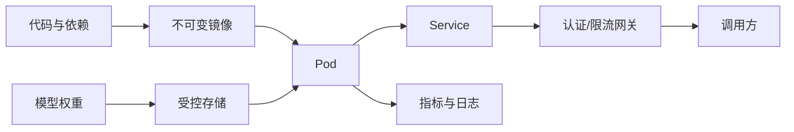
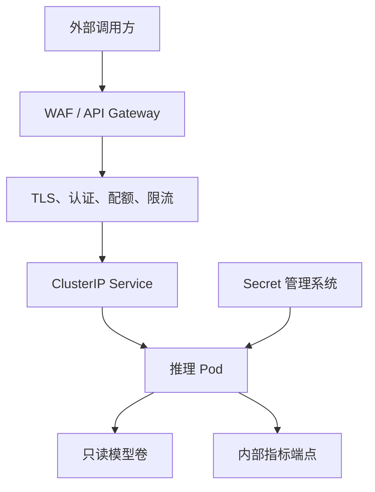

## 📑 目录
- [1. 为什么不能把 Demo 直接上线](#1-为什么不能把-demo-直接上线)
- [2. 构建可复现镜像](#2-构建可复现镜像)
- [3. 先画清安全边界](#3-先画清安全边界)
- [4. Kubernetes 资源模型](#4-kubernetes-资源模型)
- [5. GPU 调度](#5-gpu-调度)
- [6. 三类健康探针](#6-三类健康探针)
- [7. 一份可改造的部署清单](#7-一份可改造的部署清单)
- [8. 发布与回滚](#8-发布与回滚)
- [9. 边界与常见误区](#9-边界与常见误区)
- [总结](#-总结)
- [自我检验清单](#-自我检验清单)
- [官方参考](#-官方参考)
---
## 1. 为什么不能把 Demo 直接上线
在开发机上执行一条 `vllm serve`，像是在自家厨房做出一盘菜。
生产部署更像经营餐厅：要有固定菜谱、食材追溯、消防通道、叫号系统和停电预案。
容器解决“环境一致”，Kubernetes 解决“把容器放到合适机器并维持期望状态”。
它们不会自动解决模型质量、容量不足、鉴权缺失或错误配置。

上线前至少要回答五个问题：
1. 镜像和模型版本能否唯一定位？
2. 进程需要多少 CPU、内存、共享内存和 GPU？
3. 模型加载期间，平台如何判断“还在启动”而不是“已经卡死”？
4. API、模型凭据和 Pod 网络如何隔离？
5. 新版本失败时，如何回到上一版本？
## 2. 构建可复现镜像
### 2.1 固定而不是追随
生产镜像不要使用浮动的 `latest` 标签。
最好同时记录镜像 digest、vLLM 版本、CUDA 运行时、模型 revision 和启动参数。
以下 Dockerfile 是结构示例，版本号需要按你的驱动兼容矩阵选择：
```dockerfile
FROM vllm/vllm-openai:v0.10.0
USER root
RUN groupadd --gid 10001 app \
 && useradd --uid 10001 --gid app --create-home app
USER 10001:10001
WORKDIR /home/app
ENTRYPOINT ["vllm", "serve"]
CMD ["Qwen/Qwen2.5-7B-Instruct", \
     "--host", "0.0.0.0", \
     "--port", "8000"]
```
示例中的版本只用于说明“固定版本”。
不要因为教程写了某个版本就直接采用，部署前应核对官方镜像和发布说明。
构建并记录 digest：
```bash
docker build -t registry.example.com/ai/vllm:qwen25-7b-r1 .
docker push registry.example.com/ai/vllm:qwen25-7b-r1
docker inspect --format='{{index .RepoDigests 0}}' \
  registry.example.com/ai/vllm:qwen25-7b-r1
```
### 2.2 权重放在哪里
常见选择有三种：
- **烘进镜像**：启动快，但镜像巨大，模型授权与更新困难
- **启动时下载**：镜像小，但冷启动依赖网络和模型仓库
- **挂载持久卷或节点缓存**：启动较稳，但需管理缓存一致性
入门阶段可以启动时下载，生产中通常更偏向受控缓存或持久卷。
无论哪种方式，都固定模型 revision，避免同一个模型名对应的内容悄悄变化。
```bash
vllm serve Qwen/Qwen2.5-7B-Instruct \
  --revision "<approved-commit-id>" \
  --served-model-name chat-model
```
### 2.3 镜像安全基线
- 使用非 root 用户运行
- 只安装运行所需依赖
- 扫描操作系统包与 Python 依赖漏洞
- 为基础镜像建立升级节奏
- 不把 Token、证书、私钥写入镜像层
- 对镜像签名，并在集群准入阶段校验
## 3. 先画清安全边界
推理端口能工作，不代表它适合暴露公网。
把推理容器看成“机房里的发动机”，网关才是带门禁的营业厅。

生产安全清单：
- 网关终止 TLS，并校验 API Key、JWT 或工作负载身份
- 不在公网暴露指标端点
- 使用 `NetworkPolicy` 限制入站与出站
- 模型仓库 Token 从 Secret 注入，不写进 Git
- ServiceAccount 采用最小权限，不绑定集群管理员
- 容器根文件系统尽量只读，禁用权限提升
- 对输入长度、输出长度、并发和速率设置配额
- 记录审计元数据，但避免日志泄漏完整提示词和密钥
## 4. Kubernetes 资源模型
### 4.1 requests 与 limits
`requests` 用于调度，`limits` 用于限制。
CPU 可以被限流，内存超限通常会触发 OOM Kill。
GPU 扩展资源一般按整数申请，且请求数与限制数应一致。
```yaml
resources:
  requests:
    cpu: "4"
    memory: 24Gi
    nvidia.com/gpu: "1"
  limits:
    cpu: "8"
    memory: 32Gi
    nvidia.com/gpu: "1"
```
这些数值只是占位符，必须由模型加载峰值和压力测试决定。
不要把“节点有 80 GiB 显存”误写成 Kubernetes 的 `memory`。
`memory` 指主机内存，显存由 GPU 设备及推理引擎参数管理。
### 4.2 别忘了共享内存
多进程、张量并行或某些数据交换路径可能使用 `/dev/shm`。
容器默认共享内存过小会导致难以理解的运行时错误。
```yaml
volumeMounts:
  - name: dshm
    mountPath: /dev/shm
volumes:
  - name: dshm
    emptyDir:
      medium: Memory
      sizeLimit: 8Gi
```
共享内存最终来自节点内存，不能把它当作免费资源。
## 5. GPU 调度
### 5.1 从设备插件开始
Kubernetes 本身不安装 GPU 驱动。
节点需要兼容驱动，集群需要 NVIDIA GPU Operator 或 Device Plugin 暴露 `nvidia.com/gpu`。
先检查资源是否可见：
```bash
kubectl get nodes \
  -o custom-columns=NAME:.metadata.name,GPU:.status.allocatable.nvidia\\.com/gpu
kubectl describe node <gpu-node-name>
```
### 5.2 让 Pod 去正确的节点
用标签描述硬件事实，用亲和性表达调度要求。
```yaml
nodeSelector:
  accelerator: nvidia-l40s
tolerations:
  - key: "nvidia.com/gpu"
    operator: "Exists"
    effect: "NoSchedule"
```
真实标签取决于集群管理方式，不能照抄示例名称。
对于多卡张量并行，单个 Pod 必须在同一节点申请足够 GPU。
普通 Kubernetes 调度器不会自动保证跨节点高速互联质量。
需要跨节点推理时，还要考虑拓扑、RDMA、NCCL 和专用调度能力。
### 5.3 GPU 共享的边界
MIG、时间切片和厂商共享方案可以提高利用率，但隔离语义不同。
延迟敏感的大模型服务不应在未压测前与其他任务共享 GPU。
显存够用也不代表算力、内存带宽或 PCIe 带宽够用。
## 6. 三类健康探针
模型服务的启动像大型舞台搭建：搬设备很久，不等于演出失败。
- **startupProbe**：给模型下载和加载留时间
- **readinessProbe**：决定是否接收流量
- **livenessProbe**：识别已经无法恢复的进程
```yaml
startupProbe:
  httpGet:
    path: /health
    port: http
  periodSeconds: 10
  failureThreshold: 120
readinessProbe:
  httpGet:
    path: /health
    port: http
  periodSeconds: 5
  failureThreshold: 3
livenessProbe:
  httpGet:
    path: /health
    port: http
  periodSeconds: 10
  failureThreshold: 6
```
上述启动窗口是 `10 × 120 = 1200` 秒，只是演示计算。
合理窗口应略高于“慢网络 + 冷缓存”下的实测 P99 启动时间。
探针不要调用昂贵的生成接口，否则健康检查本身会制造负载。
就绪探针失败应先摘流量，存活探针不应因短暂排队就重启进程。
发布终止时设置足够的 `terminationGracePeriodSeconds`，让网关停止送新请求并等待在途请求结束。
## 7. 一份可改造的部署清单
```yaml
apiVersion: v1
kind: ServiceAccount
metadata:
  name: model-runtime
automountServiceAccountToken: false
---
apiVersion: apps/v1
kind: Deployment
metadata:
  name: chat-model
spec:
  replicas: 2
  selector:
    matchLabels: {app: chat-model}
  template:
    metadata:
      labels: {app: chat-model}
    spec:
      serviceAccountName: model-runtime
      terminationGracePeriodSeconds: 120
      containers:
        - name: server
          image: registry.example.com/ai/vllm@sha256:<digest>
          args:
            - Qwen/Qwen2.5-7B-Instruct
            - --served-model-name=chat-model
            - --gpu-memory-utilization=0.90
          ports:
            - {name: http, containerPort: 8000}
          resources:
            requests: {cpu: "4", memory: 24Gi, nvidia.com/gpu: "1"}
            limits: {cpu: "8", memory: 32Gi, nvidia.com/gpu: "1"}
          securityContext:
            runAsNonRoot: true
            allowPrivilegeEscalation: false
            capabilities: {drop: ["ALL"]}
          startupProbe:
            httpGet: {path: /health, port: http}
            periodSeconds: 10
            failureThreshold: 120
          readinessProbe:
            httpGet: {path: /health, port: http}
            periodSeconds: 5
          livenessProbe:
            httpGet: {path: /health, port: http}
            periodSeconds: 10
            failureThreshold: 6
---
apiVersion: v1
kind: Service
metadata:
  name: chat-model
spec:
  type: ClusterIP
  selector: {app: chat-model}
  ports:
    - {name: http, port: 8000, targetPort: http}
```
这份基线清单尚未交给 HPA，因此保留 `replicas: 2`。启用第 10.3 节的 HPA 后，应从声明式 Deployment 删除 `spec.replicas`，并让 GitOps 忽略该字段差异，避免每次同步把 HPA 扩出的副本强制缩回 2。

提交前先做客户端校验：
```bash
kubectl apply --dry-run=client -f deployment.yaml
kubectl diff -f deployment.yaml
kubectl apply -f deployment.yaml
kubectl rollout status deployment/chat-model --timeout=25m
```
## 8. 发布与回滚
大模型冷启动昂贵，滚动发布参数要结合 GPU 余量。
`maxSurge: 1` 意味着发布期间需要额外容纳一个 GPU Pod。
如果集群没有空闲 GPU，新 Pod 无法启动，旧 Pod 又不能退出，发布会卡住。
建议流程：
1. 在预发布环境验证镜像、模型 revision 与接口正确性
2. 用少量流量做金丝雀验证
3. 观察错误率、TTFT、TPOT、队列和 GPU 指标
4. 达标后逐步扩大流量
5. 指标越界时停止发布并回滚
```bash
kubectl rollout history deployment/chat-model
kubectl rollout undo deployment/chat-model
kubectl rollout status deployment/chat-model
```
回滚镜像并不一定回滚模型卷内容，因此模型版本也要不可变。
## 9. 边界与常见误区
- 本节 YAML 是教学骨架，不是完整平台方案
- 健康端点路径可能随引擎版本变化，应查当前版本文档
- Pod 就绪只说明实例可服务，不说明满足业务 SLO
- GPU 利用率低可能是请求少，也可能是 CPU、网络或调度瓶颈
- `replicas: 2` 不自动带来高可用；两个 Pod 可能落在同一节点
- 多可用区会增加网络与模型分发成本
- 权重来源、许可证和数据合规需要单独审核
## 📝 总结
生产部署的核心不是把命令塞进 YAML，而是把版本、资源、健康与安全都变成可声明、可观测、可回滚的约束。
容器提供一致的运行单元，Kubernetes 负责调度和维持副本，网关负责保护入口，监控负责告诉我们约束是否仍然成立。
## ✅ 自我检验清单
- [ ] 我能解释主机内存与 GPU 显存的区别
- [ ] 我固定了镜像 digest 与模型 revision
- [ ] 我没有把仓库 Token 或 API Key 写进镜像和 Git
- [ ] 我为 CPU、内存、共享内存和 GPU 设置了依据明确的资源值
- [ ] 我知道目标 GPU 节点的标签、污点与设备插件状态
- [ ] 我能说明 startup、readiness、liveness 三种探针的不同职责
- [ ] 我的启动窗口来自冷启动实测，而不是复制教程
- [ ] 推理 Service 不是直接面向公网的 LoadBalancer
- [ ] 发布时集群有额外 GPU 余量，且回滚路径已演练
## 📚 官方参考
- [Kubernetes：管理 GPU 资源](https://kubernetes.io/docs/tasks/manage-gpus/scheduling-gpus/)
- [Kubernetes：配置存活、就绪和启动探针](https://kubernetes.io/docs/tasks/configure-pod-container/configure-liveness-readiness-startup-probes/)
- [Kubernetes：为容器管理计算资源](https://kubernetes.io/docs/concepts/configuration/manage-resources-containers/)
- [Kubernetes：Pod 安全标准](https://kubernetes.io/docs/concepts/security/pod-security-standards/)
- [NVIDIA GPU Operator](https://docs.nvidia.com/datacenter/cloud-native/gpu-operator/latest/)
- [vLLM：使用 Docker 部署](https://docs.vllm.ai/en/latest/deployment/docker.html)
- [vLLM：Kubernetes 部署示例](https://docs.vllm.ai/en/latest/deployment/k8s.html)
