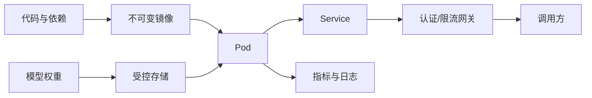
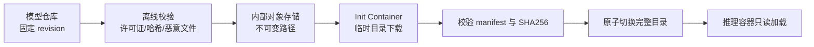
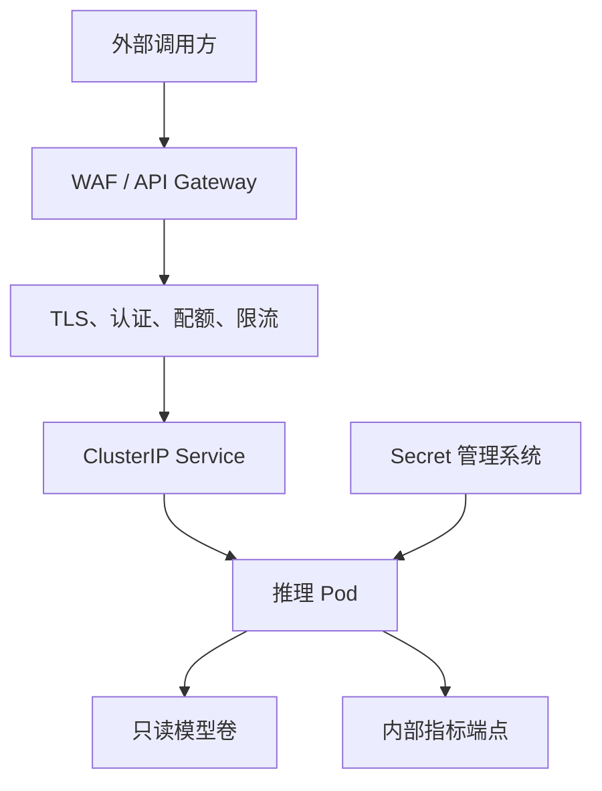

## 📑 目录
- [1. 为什么不能把 Demo 直接上线](#1-为什么不能把-demo-直接上线)
- [2. 构建可复现镜像](#2-构建可复现镜像)
- [3. 先画清安全边界](#3-先画清安全边界)
- [4. Kubernetes 资源模型](#4-kubernetes-资源模型)
- [5. GPU 调度](#5-gpu-调度)
- [6. 三类健康探针](#6-三类健康探针)
- [7. 一份可改造的部署清单](#7-一份可改造的部署清单)
- [8. 发布与回滚](#8-发布与回滚)
- [9. 从 Pending 到 5xx 的故障排查](#9-从-pending-到-5xx-的故障排查)
- [10. 边界与常见误区](#10-边界与常见误区)
- [总结](#-总结)
- [自我检验清单](#-自我检验清单)
- [官方参考](#-官方参考)
---
## 1. 为什么不能把 Demo 直接上线
在开发机上执行一条 `vllm serve`，像是在自家厨房做出一盘菜。
生产部署更像经营餐厅：要有固定菜谱、食材追溯、消防通道、叫号系统和停电预案。
容器解决“环境一致”，Kubernetes 解决“把容器放到合适机器并维持期望状态”。
它们不会自动解决模型质量、容量不足、鉴权缺失或错误配置。

上线前至少要回答五个问题：
1. 镜像和模型版本能否唯一定位？
2. 进程需要多少 CPU、内存、共享内存和 GPU？
3. 模型加载期间，平台如何判断“还在启动”而不是“已经卡死”？
4. API、模型凭据和 Pod 网络如何隔离？
5. 新版本失败时，如何回到上一版本？
## 2. 构建可复现镜像
### 2.1 固定而不是追随
生产镜像不要使用浮动的 `latest` 标签。
最好同时记录镜像 digest、vLLM 版本、CUDA 运行时、模型 revision 和启动参数。
以下 Dockerfile 是结构示例，版本号需要按你的驱动兼容矩阵选择：
```dockerfile
FROM vllm/vllm-openai:v0.10.0
USER root
RUN groupadd --gid 10001 app \
 && useradd --uid 10001 --gid app --create-home app
USER 10001:10001
WORKDIR /home/app
ENTRYPOINT ["vllm", "serve"]
CMD ["Qwen/Qwen2.5-7B-Instruct", \
     "--host", "0.0.0.0", \
     "--port", "8000"]
```
**前提**：基础镜像与节点驱动兼容，镜像中的 vLLM 支持以非 root 用户访问 GPU 和模型目录。**危险点**：直接复制版本号可能引入 CUDA/驱动不兼容；把 Token 放进 `ARG`、`ENV` 或 `RUN` 同样会留在镜像历史中。示例中的版本只用于说明“固定版本”。
不要因为教程写了某个版本就直接采用，部署前应核对官方镜像和发布说明。
构建并记录 digest：
```bash
docker build -t registry.example.com/ai/vllm:qwen25-7b-r1 .
docker push registry.example.com/ai/vllm:qwen25-7b-r1
docker inspect --format='{{index .RepoDigests 0}}' \
  registry.example.com/ai/vllm:qwen25-7b-r1
```
**前提**：已登录私有 Registry，目标仓库开启不可变标签或至少保留 digest。**危险点**：`docker push` 会向远端写入产物并产生费用；不要在共享终端输出 Registry 密码。部署清单应引用最后得到的 `@sha256:...`，而不是可被覆盖的标签。

镜像由只读层叠加而成。把编译器、测试数据、模型权重和运行时都塞进一个层，会放大构建、扫描、分发和回滚成本。生产构建建议：
- 使用多阶段构建，只把运行产物复制到最终镜像；
- 把变化慢的系统依赖放在前层，把变化快的应用代码放在后层；
- 在同一个 `RUN` 中清理包管理器缓存，避免“后层删除、前层仍占空间”；
- 在 CI 生成 SBOM、漏洞报告和签名，把 image digest 写入发布记录；
- 不在容器启动时执行 `pip install`，避免相同镜像产生不同运行环境。

镜像层和模型权重应分开估算。20 GB 运行镜像加 100 GB 模型，若 20 个节点同时冷启动，会形成 Registry、对象存储和节点磁盘的瞬时洪峰：
$$
T_{\text{cold-start}}\approx
T_{\text{image-pull}}+T_{\text{model-transfer}}+T_{\text{load}}+T_{\text{warmup}}
$$
每一段都应独立测量，不能只记录 Pod 从创建到 Ready 的总时长。
### 2.2 权重放在哪里
常见选择有三种：
- **烘进镜像**：启动快，但镜像巨大，模型授权与更新困难
- **启动时下载**：镜像小，但冷启动依赖网络和模型仓库
- **挂载持久卷或节点缓存**：启动较稳，但需管理缓存一致性
入门阶段可以启动时下载，生产中通常更偏向受控缓存或持久卷。
无论哪种方式，都固定模型 revision，避免同一个模型名对应的内容悄悄变化。
```bash
vllm serve Qwen/Qwen2.5-7B-Instruct \
  --revision "<approved-commit-id>" \
  --served-model-name chat-model
```
**前提**：当前引擎支持 `--revision`，运行身份对模型仓库有只读权限。**危险点**：首次执行会下载大量文件；生产 Pod 临时下载会把仓库故障放大为服务不可用。先在预发布验证 revision、Tokenizer 与许可证。

生产中常见的受控分发链路是：

不要边下载边让主容器读取同一目录。先下载到临时目录，校验完成后原子重命名或写入完成标记，否则重启可能把半成品当作完整模型。

四类方案的取舍：
- **对象存储 + Init Container**：易审计，但冷启动依赖网络和对象存储；
- **ReadOnlyMany PVC**：接口简单，但共享存储吞吐和小文件元数据可能成为瓶颈；
- **节点本地缓存**：启动快，但需要缓存控制器、磁盘配额、淘汰和哈希校验；
- **模型 OCI 制品**：版本一致性好，但超大层会给 Registry 和垃圾回收带来压力。

若使用 Init Container，必须设置下载超时、重试上限和校验失败退出码。无限重试会让 Pod 长期停在 `Init`，还可能持续冲击上游。
### 2.3 镜像安全基线
- 使用非 root 用户运行
- 只安装运行所需依赖
- 扫描操作系统包与 Python 依赖漏洞
- 为基础镜像建立升级节奏
- 不把 Token、证书、私钥写入镜像层
- 对镜像签名，并在集群准入阶段校验
扫描不是“一次通过永久安全”。基础镜像、Python wheel 和 CUDA 组件都需要持续重建与回归。除非模型来源受控且自定义代码已审查，不要开启远程代码信任。
## 3. 先画清安全边界
推理端口能工作，不代表它适合暴露公网。
把推理容器看成“机房里的发动机”，网关才是带门禁的营业厅。

生产安全清单：
- 网关终止 TLS，并校验 API Key、JWT 或工作负载身份
- 不在公网暴露指标端点
- 使用 `NetworkPolicy` 限制入站与出站
- 模型仓库 Token 从 Secret 注入，不写进 Git
- ServiceAccount 采用最小权限，不绑定集群管理员
- 容器根文件系统尽量只读，禁用权限提升
- 对输入长度、输出长度、并发和速率设置配额
- 记录审计元数据，但避免日志泄漏完整提示词和密钥
## 4. Kubernetes 资源模型
### 4.1 requests 与 limits
`requests` 用于调度，`limits` 用于限制。
CPU 可以被限流，内存超限通常会触发 OOM Kill。
GPU 扩展资源一般按整数申请，且请求数与限制数应一致。
```yaml
resources:
  requests:
    cpu: "4"
    memory: 24Gi
    nvidia.com/gpu: "1"
  limits:
    cpu: "8"
    memory: 32Gi
    nvidia.com/gpu: "1"
```
**前提**：数值来自目标模型、上下文和并发的实测峰值。**危险点**：CPU limit 过紧会节流 Tokenizer/调度线程，内存 limit 过紧会 OOM；GPU 扩展资源不能按显存 GiB 填写，也不能申请小数，除非平台明确提供 MIG/共享资源名。
这些数值只是占位符，必须由模型加载峰值和压力测试决定。
不要把“节点有 80 GiB 显存”误写成 Kubernetes 的 `memory`。
`memory` 指主机内存，显存由 GPU 设备及推理引擎参数管理。
### 4.2 别忘了共享内存
多进程、张量并行或某些数据交换路径可能使用 `/dev/shm`。
容器默认共享内存过小会导致难以理解的运行时错误。
```yaml
volumeMounts:
  - name: dshm
    mountPath: /dev/shm
volumes:
  - name: dshm
    emptyDir:
      medium: Memory
      sizeLimit: 8Gi
```
**前提**：节点有足够主机内存，应用确实需要大于容器默认值的共享内存。**危险点**：`emptyDir.medium: Memory` 不是免费显存，其占用会计入内存约束；`sizeLimit` 是上限而非预留，节点内存压力仍可能驱逐 Pod。
共享内存最终来自节点内存，不能把它当作免费资源。
多卡通信报 `bus error`、`No space left on device` 或 worker 无故退出时，要同时检查 `/dev/shm`、Pod 主机内存峰值和 NCCL 日志，不要盲目扩大到节点全部内存。
## 5. GPU 调度
### 5.1 从设备插件开始
Kubernetes 本身不安装 GPU 驱动。
节点需要兼容驱动，集群需要 NVIDIA GPU Operator 或 Device Plugin 暴露 `nvidia.com/gpu`。
先检查资源是否可见：
```bash
kubectl get nodes \
  -o custom-columns=NAME:.metadata.name,GPU:.status.allocatable.nvidia\\.com/gpu
kubectl describe node <gpu-node-name>
```
**前提**：操作者有目标集群的只读权限，GPU Operator 或 Device Plugin 已由平台团队安装。**危险点**：不要在业务命名空间自行部署第二套设备插件；重复注册或版本错配可能影响整节点工作负载。`Allocatable` 只证明调度器看见资源，不证明 CUDA 可用。

设备链路应逐层验证：
1. 节点 OS 能看到 GPU 和预期驱动；
2. Device Plugin Pod 在每个 GPU 节点健康；
3. Node 的 `Capacity/Allocatable` 出现扩展资源；
4. 测试 Pod 能获得设备并运行 CUDA；
5. DCGM 能按 GPU UUID 输出遥测；
6. 多卡 Pod 中 NCCL 拓扑和高速互联符合设计。

只看到 `nvidia.com/gpu: 8` 仍可能遇到驱动库挂载失败、XID 错误或设备被健康检查隔离。
### 5.2 让 Pod 去正确的节点
用标签描述硬件事实，用亲和性表达调度要求。
```yaml
nodeSelector:
  accelerator: nvidia-l40s
tolerations:
  - key: "nvidia.com/gpu"
    operator: "Exists"
    effect: "NoSchedule"
```
**前提**：标签和污点由平台团队统一维护。**危险点**：`tolerations` 只允许调度，不保证一定调度到 GPU 节点；错误或过宽的容忍可能把 Pod 送到意外节点。上线前用实际 Node 标签替换示例。
真实标签取决于集群管理方式，不能照抄示例名称。
对于多卡张量并行，单个 Pod 必须在同一节点申请足够 GPU。
普通 Kubernetes 调度器不会自动保证跨节点高速互联质量。
需要跨节点推理时，还要考虑拓扑、RDMA、NCCL 和专用调度能力。

生产多副本还应尽量跨节点：
```yaml
topologySpreadConstraints:
  - maxSkew: 1
    minDomains: 2
    topologyKey: kubernetes.io/hostname
    whenUnsatisfiable: DoNotSchedule
    labelSelector:
      matchLabels:
        app: chat-model
```
**前提**：至少两个可调度 GPU 节点存在该拓扑标签。`minDomains: 2` 与 `DoNotSchedule` 共同保证双副本不能因只有一个合格故障域而挤在同一节点。**危险点**：第二个域资源不足时 Pod 会 Pending；`ScheduleAnyway` 更容易启动，却不能提供同等故障冗余。选择要与可用性目标一致。
### 5.3 GPU 共享的边界
MIG、时间切片和厂商共享方案可以提高利用率，但隔离语义不同。
延迟敏感的大模型服务不应在未压测前与其他任务共享 GPU。
显存够用也不代表算力、内存带宽或 PCIe 带宽够用。
## 6. 三类健康探针
模型服务的启动像大型舞台搭建：搬设备很久，不等于演出失败。
- **startupProbe**：给模型下载和加载留时间
- **readinessProbe**：决定是否接收流量
- **livenessProbe**：识别已经无法恢复的进程
```yaml
startupProbe:
  httpGet:
    path: /health
    port: http
  periodSeconds: 10
  failureThreshold: 120
readinessProbe:
  httpGet:
    path: /health
    port: http
  periodSeconds: 5
  failureThreshold: 3
livenessProbe:
  httpGet:
    path: /health
    port: http
  periodSeconds: 10
  failureThreshold: 6
```
**前提**：`/health` 不执行生成、不依赖慢下游，并能在模型未加载时正确区分进程存活与服务就绪。**危险点**：liveness 太激进会在拥塞时重启健康实例并清空缓存；startup 窗口太大则会延迟发现真正死锁。探针超时和阈值必须由冷启动与故障演练校准。
上述启动窗口是 `10 × 120 = 1200` 秒，只是演示计算。
合理窗口应略高于“慢网络 + 冷缓存”下的实测 P99 启动时间。
探针不要调用昂贵的生成接口，否则健康检查本身会制造负载。
就绪探针失败应先摘流量，存活探针不应因短暂排队就重启进程。
发布终止时设置足够的 `terminationGracePeriodSeconds`，让网关停止送新请求并等待在途请求结束。
## 7. 一份可改造的部署清单
下面清单串起 ServiceAccount、模型分发、GPU、共享内存、安全上下文、三类探针、滚动发布、故障域、PDB、Service 和入站网络策略。

**前提**：
- 命名空间、私有镜像拉取凭据和模型访问 Secret 已由平台安全流程创建；
- `model-sync` 是组织维护的非 root 下载器，支持固定 URI、SHA256 校验、超时和失败退出；
- 节点标签 `accelerator=nvidia-l40s`、GPU 污点和网关/监控命名空间标签真实存在；
- `/health` 是轻量进程健康端点；若引擎没有独立 ready 端点，需要在网关层额外判断模型是否加载完成；
- 单 Pod 单 GPU、模型工作集和 8 GiB `/dev/shm` 已经压测验证。

**危险点**：
- `emptyDir` 模型卷在 Pod 重建后会重新下载；示例用 `ephemeral-storage` request/limit 让调度器计入模型、`/tmp` 和缓存空间，生产也可换成容量明确的只读 PVC 或节点缓存；
- `maxSurge: 1` 在发布时额外需要 1 张 GPU；GPU 配额不足会卡住发布；
- NetworkPolicy 标签写错会切断网关或 Prometheus；先在预发布验证；
- `readOnlyRootFilesystem` 需要为 `/tmp`、缓存和模型路径提供可写卷，并把 `HOME`、`XDG_CACHE_HOME`、`VLLM_CACHE_ROOT` 指向可写位置；
- 示例 URI、digest、哈希、资源值和健康路径全部是占位符，不能原样上线。

```yaml
apiVersion: v1
kind: ServiceAccount
metadata:
  name: model-runtime
automountServiceAccountToken: false
---
apiVersion: apps/v1
kind: Deployment
metadata:
  name: chat-model
  labels:
    app: chat-model
spec:
  replicas: 2
  strategy:
    type: RollingUpdate
    rollingUpdate:
      maxSurge: 1
      maxUnavailable: 0
  minReadySeconds: 30
  progressDeadlineSeconds: 1800
  selector:
    matchLabels:
      app: chat-model
  template:
    metadata:
      labels:
        app: chat-model
        model: chat-model
    spec:
      serviceAccountName: model-runtime
      automountServiceAccountToken: false
      terminationGracePeriodSeconds: 180
      securityContext:
        runAsNonRoot: true
        runAsUser: 10001
        runAsGroup: 10001
        fsGroup: 10001
        seccompProfile:
          type: RuntimeDefault
      nodeSelector:
        accelerator: nvidia-l40s
      tolerations:
        - key: nvidia.com/gpu
          operator: Exists
          effect: NoSchedule
      topologySpreadConstraints:
        - maxSkew: 1
          minDomains: 2
          topologyKey: kubernetes.io/hostname
          whenUnsatisfiable: DoNotSchedule
          labelSelector:
            matchLabels:
              app: chat-model
      initContainers:
        - name: model-sync
          image: registry.example.com/ai/model-sync@sha256:<sync-image-digest>
          args:
            - --source=s3://approved-models/qwen25-7b/<revision>/
            - --destination=/models/chat-model
            - --manifest-sha256=<manifest-sha256>
            - --timeout=15m
          env:
            - name: MODEL_STORAGE_TOKEN
              valueFrom:
                secretKeyRef:
                  name: model-storage-readonly
                  key: token
            - name: HOME
              value: /cache/home
            - name: XDG_CACHE_HOME
              value: /cache/xdg
            - name: VLLM_CACHE_ROOT
              value: /cache/vllm
          resources:
            requests:
              cpu: "2"
              memory: 2Gi
              ephemeral-storage: 160Gi
            limits:
              cpu: "4"
              memory: 4Gi
              ephemeral-storage: 170Gi
          securityContext:
            allowPrivilegeEscalation: false
            readOnlyRootFilesystem: true
            capabilities:
              drop: ["ALL"]
          volumeMounts:
            - name: model
              mountPath: /models
            - name: tmp
              mountPath: /tmp
            - name: cache
              mountPath: /cache
      containers:
        - name: server
          image: registry.example.com/ai/vllm@sha256:<digest>
          args:
            - /models/chat-model
            - --served-model-name=chat-model
            - --gpu-memory-utilization=0.90
          ports:
            - name: http
              containerPort: 8000
          env:
            - name: HOME
              value: /cache/home
            - name: XDG_CACHE_HOME
              value: /cache/xdg
            - name: VLLM_CACHE_ROOT
              value: /cache/vllm
          resources:
            requests:
              cpu: "4"
              memory: 24Gi
              ephemeral-storage: 160Gi
              nvidia.com/gpu: "1"
            limits:
              cpu: "8"
              memory: 32Gi
              ephemeral-storage: 170Gi
              nvidia.com/gpu: "1"
          securityContext:
            runAsNonRoot: true
            allowPrivilegeEscalation: false
            readOnlyRootFilesystem: true
            capabilities:
              drop: ["ALL"]
          lifecycle:
            preStop:
              exec:
                command: ["/bin/sh", "-c", "sleep 15"]
          volumeMounts:
            - name: model
              mountPath: /models
              readOnly: true
            - name: dshm
              mountPath: /dev/shm
            - name: tmp
              mountPath: /tmp
            - name: cache
              mountPath: /cache
          startupProbe:
            httpGet:
              path: /health
              port: http
            periodSeconds: 10
            failureThreshold: 120
            timeoutSeconds: 2
          readinessProbe:
            httpGet:
              path: /health
              port: http
            periodSeconds: 5
            failureThreshold: 3
            timeoutSeconds: 2
          livenessProbe:
            httpGet:
              path: /health
              port: http
            periodSeconds: 10
            failureThreshold: 6
            timeoutSeconds: 2
      volumes:
        - name: model
          emptyDir:
            sizeLimit: 150Gi
        - name: dshm
          emptyDir:
            medium: Memory
            sizeLimit: 8Gi
        - name: tmp
          emptyDir:
            sizeLimit: 4Gi
        - name: cache
          emptyDir:
            sizeLimit: 4Gi
---
apiVersion: v1
kind: Service
metadata:
  name: chat-model
  labels:
    app: chat-model
spec:
  type: ClusterIP
  selector:
    app: chat-model
  ports:
    - name: http
      port: 8000
      targetPort: http
---
apiVersion: policy/v1
kind: PodDisruptionBudget
metadata:
  name: chat-model
spec:
  minAvailable: 1
  selector:
    matchLabels:
      app: chat-model
---
apiVersion: networking.k8s.io/v1
kind: NetworkPolicy
metadata:
  name: chat-model-ingress
spec:
  podSelector:
    matchLabels:
      app: chat-model
  policyTypes: ["Ingress"]
  ingress:
    - from:
        - namespaceSelector:
            matchLabels:
              kubernetes.io/metadata.name: inference-gateway
        - namespaceSelector:
            matchLabels:
              kubernetes.io/metadata.name: monitoring
      ports:
        - protocol: TCP
          port: 8000
```
这份基线清单尚未交给 HPA，因此保留 `replicas: 2`。启用第 10.3 节的 HPA 后，应从声明式 Deployment 删除 `spec.replicas`，并让 GitOps 忽略该字段差异，避免每次同步把 HPA 扩出的副本强制缩回 2。

ServiceAccount 被保留，即使禁用了 Token 自动挂载，也能明确表达运行身份并供策略绑定；不要为了“省一段 YAML”而让 Pod 隐式使用 `default` ServiceAccount。PDB 的 `minAvailable: 1` 只约束通过 Eviction API 发起的自愿中断，不阻止节点突然故障，也不阻止 Deployment/HPA 的正常副本删除。

`preStop` 的 15 秒只是给 EndpointSlice、网关和连接池传播摘流量信号。它不等于真正 drain：长连接网关必须停止向 terminating endpoint 发送新请求，引擎还应等待在途生成到截止时间。若镜像没有 `/bin/sh`，应改用应用自身的 drain API 或专用生命周期二进制。

提交前先做客户端校验：
```bash
kubectl apply --dry-run=client -f deployment.yaml
kubectl diff -f deployment.yaml
kubectl apply -f deployment.yaml
kubectl rollout status deployment/chat-model --timeout=25m
```
**前提**：清单已过 schema/策略校验，当前 context 和 namespace 已双重确认，并有变更审批。**危险点**：`kubectl apply` 和 `rollout undo` 都会修改集群；`diff` 可能显示 Secret 元数据或组织内部信息，不要把输出粘贴到公开渠道。推荐先显式执行 `kubectl config current-context` 和 `kubectl config view --minify`。
## 8. 发布与回滚
大模型冷启动昂贵，滚动发布参数要结合 GPU 余量。
`maxSurge: 1` 意味着发布期间需要额外容纳一个 GPU Pod。
如果集群没有空闲 GPU，新 Pod 无法启动，旧 Pod 又不能退出，发布会卡住。
建议流程：
1. 在预发布环境验证镜像、模型 revision 与接口正确性
2. 用少量流量做金丝雀验证
3. 观察错误率、TTFT、TPOT、队列和 GPU 指标
4. 达标后逐步扩大流量
5. 指标越界时停止发布并回滚
```bash
kubectl rollout history deployment/chat-model
kubectl rollout undo deployment/chat-model
kubectl rollout status deployment/chat-model
```
**前提**：Deployment 仍保留可用 revision，回滚目标的镜像和模型制品未被删除。**危险点**：`rollout undo` 会修改线上工作负载，且只恢复 Deployment 模板，不自动恢复外部模型目录、ConfigMap 或数据库；执行前先确认 revision 和影响范围。
回滚镜像并不一定回滚模型卷内容，因此模型版本也要不可变。

## 9. 从 Pending 到 5xx 的故障排查
排障顺序应从控制面事实走向容器内部，避免一上来重启或改资源。

### 9.1 Pod 一直 Pending
先看调度事件：
```bash
kubectl get pod -l app=chat-model -o wide
kubectl describe pod <pending-pod>
kubectl get resourcequota
```
**前提**：只读访问目标命名空间。**危险点**：输出可能包含节点名、镜像地址和 Secret 名，不要公开传播。重点找 `Insufficient nvidia.com/gpu`、node affinity 不匹配、taint 未容忍、PVC 未绑定或 quota 超限。

判断路径：
1. Node 根本没有 `Allocatable GPU`：查设备插件和驱动；
2. 有 GPU 但已分配完：扩节点、释放容量或降低 surge，不能靠重启调度器；
3. 有空闲 GPU 仍不匹配：比较 nodeSelector、affinity、taint/toleration 和 topology spread；
4. 只有发布新 Pod Pending：检查 `maxSurge` 是否超出 GPU quota；
5. 多卡 Pod Pending：确认单一节点能同时提供所需卡数，集群总空闲卡数没有意义。

### 9.2 卡在 Init 或 ImagePullBackOff
```bash
kubectl describe pod <pod>
kubectl logs <pod> -c model-sync
kubectl get events --sort-by=.lastTimestamp
```
**前提**：日志已脱敏，下载器不会打印 Token。**危险点**：不要用 `kubectl exec` 把长期凭据手工写进容器“救火”；这既不可审计，也会在重建后丢失。检查 Registry 权限、DNS、对象存储、校验和、磁盘容量和下载超时。

`ImagePullBackOff` 的退避会让修复凭据后仍需等待下一次重试。可以删除单个尚未服务的失败 Pod 触发重建，但不要批量删除全部线上 Pod。

### 9.3 容器启动后 CrashLoopBackOff
```bash
kubectl logs <pod> -c server --previous
kubectl get pod <pod> -o jsonpath='{.status.containerStatuses[0].lastState.terminated.reason}'
kubectl describe node <node>
```
**前提**：已确认 Pod 和容器名。**危险点**：日志可能包含模型输入或内部路径，应在受控环境查看。`--previous` 对快速崩溃尤其重要。

常见证据与方向：
- `OOMKilled`：这是主机内存，不是显存；检查模型加载暂存、Tokenizer、`/dev/shm` 和 limit；
- CUDA OOM：检查权重、KV Cache、`gpu-memory-utilization`、并发和其他 GPU 进程；
- `no space left`：区分镜像盘、模型卷、`/tmp` 与 `/dev/shm`；
- NCCL timeout：核对卡数、拓扑、共享内存、网络/RDMA 和所有 rank 日志；
- `permission denied`：核对 UID/GID、`fsGroup`、只读根文件系统和卷权限，不要直接改成 root。

### 9.4 Ready 但请求 503 或延迟高
先确认请求路径的每一跳：
```bash
kubectl get endpointslice -l kubernetes.io/service-name=chat-model
kubectl port-forward service/chat-model 18000:8000
curl -fsS http://127.0.0.1:18000/health
```
**前提**：本机端口空闲，端口转发只用于临时诊断。**危险点**：不要把转发绑定到 `0.0.0.0`，也不要通过它绕过生产网关处理真实敏感请求。若 Service 直连正常而网关失败，检查 NetworkPolicy、EndpointSlice、连接池和网关超时；若直连也慢，转向队列、输入长度、KV Cache 和 GPU 指标。

### 9.5 发布卡住或回滚不恢复
检查 Deployment 条件和新旧 ReplicaSet：
```bash
kubectl rollout status deployment/chat-model --timeout=30s
kubectl describe deployment chat-model
kubectl get rs -l app=chat-model
```
**前提**：只读检查；短 timeout 只是让命令返回，不会终止发布。**危险点**：不要在根因不明时同时修改镜像、资源、探针和发布策略，否则无法判断哪个变化生效。

典型卡点包括：新 Pod 无 GPU、模型下载超时、startupProbe 窗口不足、`minReadySeconds` 尚未满足、PDB 与人工驱逐相互约束。回滚后仍失败时，检查外部模型路径、ConfigMap、Secret、网关路由和缓存是否也发生了变化。

## 10. 边界与常见误区
- 本节 YAML 是教学骨架，不是完整平台方案
- 健康端点路径可能随引擎版本变化，应查当前版本文档
- Pod 就绪只说明实例可服务，不说明满足业务 SLO
- GPU 利用率低可能是请求少，也可能是 CPU、网络或调度瓶颈
- `replicas: 2` 不自动带来高可用；两个 Pod 可能落在同一节点
- 多可用区会增加网络与模型分发成本
- 权重来源、许可证和数据合规需要单独审核
## 📝 总结
生产部署的核心不是把命令塞进 YAML，而是把版本、资源、健康与安全都变成可声明、可观测、可回滚的约束。
容器提供一致的运行单元，Kubernetes 负责调度和维持副本，网关负责保护入口，监控负责告诉我们约束是否仍然成立。
## ✅ 自我检验清单
- [ ] 我能解释主机内存与 GPU 显存的区别
- [ ] 我固定了镜像 digest 与模型 revision
- [ ] 我没有把仓库 Token 或 API Key 写进镜像和 Git
- [ ] 我为 CPU、内存、共享内存和 GPU 设置了依据明确的资源值
- [ ] 我知道目标 GPU 节点的标签、污点与设备插件状态
- [ ] 我能说明 startup、readiness、liveness 三种探针的不同职责
- [ ] 我的启动窗口来自冷启动实测，而不是复制教程
- [ ] 推理 Service 不是直接面向公网的 LoadBalancer
- [ ] 发布时集群有额外 GPU 余量，且回滚路径已演练
## 📚 官方参考
- [Kubernetes：管理 GPU 资源](https://kubernetes.io/docs/tasks/manage-gpus/scheduling-gpus/)
- [Kubernetes：配置存活、就绪和启动探针](https://kubernetes.io/docs/tasks/configure-pod-container/configure-liveness-readiness-startup-probes/)
- [Kubernetes：为容器管理计算资源](https://kubernetes.io/docs/concepts/configuration/manage-resources-containers/)
- [Kubernetes：Pod 安全标准](https://kubernetes.io/docs/concepts/security/pod-security-standards/)
- [NVIDIA GPU Operator](https://docs.nvidia.com/datacenter/cloud-native/gpu-operator/latest/)
- [vLLM：使用 Docker 部署](https://docs.vllm.ai/en/latest/deployment/docker.html)
- [vLLM：Kubernetes 部署示例](https://docs.vllm.ai/en/latest/deployment/k8s.html)
