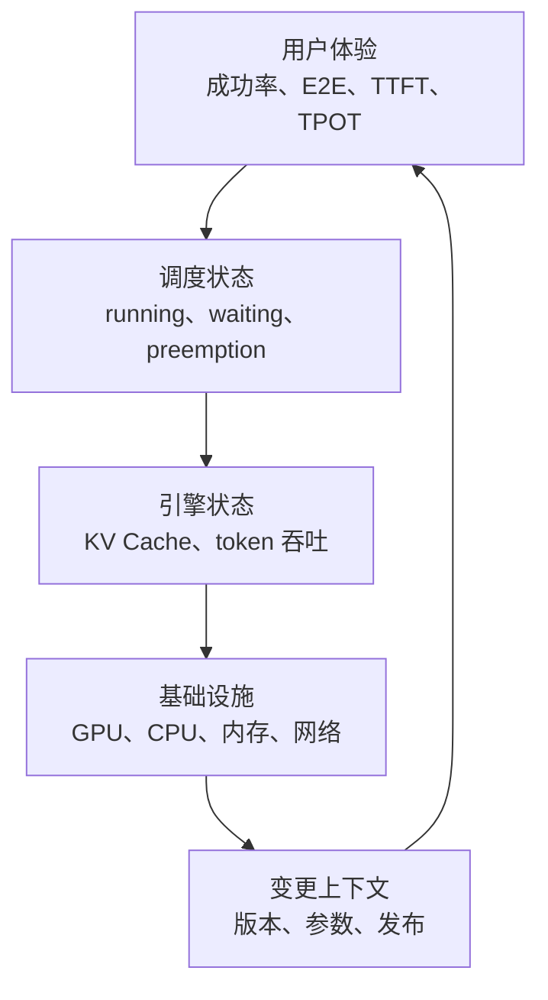
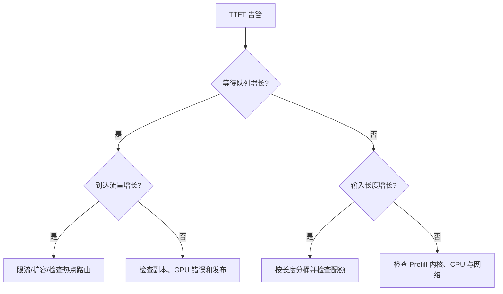

## 📑 目录
- [1. 可观测性不是多画几张图](#1-可观测性不是多画几张图)
- [2. 推理服务的指标分层](#2-推理服务的指标分层)
- [3. 延迟与吞吐公式](#3-延迟与吞吐公式)
- [4. 暴露与采集指标](#4-暴露与采集指标)
- [5. 仪表盘设计](#5-仪表盘设计)
- [6. 日志与追踪](#6-日志与追踪)
- [7. 告警与排障](#7-告警与排障)
- [8. 边界与数据治理](#8-边界与数据治理)
- [总结](#-总结)
- [自我检验清单](#-自我检验清单)
- [官方参考](#-官方参考)
---
## 1. 可观测性不是多画几张图
汽车仪表盘同时显示车速、油量、水温和故障灯。
只看 GPU 利用率，就像只看发动机转速判断整辆车是否安全。
推理服务至少要同时观察用户体验、请求调度、模型执行、基础设施和变更事件。

可观测性的目标是回答三个问题：
1. 用户是否受到影响？
2. 影响发生在哪一层？
3. 哪次变更或哪类负载触发了它？
指标适合看趋势，日志适合看事件细节，追踪适合看一次请求跨组件的路径。
三者缺一时，排障会像只凭体温判断所有疾病。
## 2. 推理服务的指标分层
### 2.1 用户与业务层
优先定义服务级指标：
- 请求成功率与错误码分布
- 端到端延迟 P50、P95、P99
- TTFT（Time to First Token）分位数
- TPOT（Time per Output Token）分位数
- 每分钟输入与输出 token 数
- 主动取消、超时和限流比例
流式接口不能只记录 HTTP 连接建立时间。
连接很快建立，但第一个 token 等了十秒，用户仍然会认为服务很慢。
### 2.2 调度与引擎层
重点关注：
- 正在运行的请求数
- 等待队列长度或等待请求数
- 请求排队时间
- KV Cache 使用率
- KV Cache 命中率（若当前版本提供）
- 抢占与重计算次数
- Prefill 与 Decode token 吞吐
- 每个请求的输入、输出 token 长度分布
队列是生产推理最重要的“压力表”之一。
GPU 利用率接近 100% 可能是健康的高负载；队列持续增长则说明到达速率超过服务速率。
### 2.3 基础设施层
节点和容器至少观察：
- GPU 核心与显存利用率
- GPU 温度、功耗、降频与 XID 错误
- CPU 使用率与限流
- 主机内存、工作集与 OOM Kill
- 网络吞吐、丢包与连接数
- 磁盘、模型下载和容器重启
GPU 指标通常由 NVIDIA DCGM Exporter 暴露。
引擎指标与 GPU 指标必须按 Pod、节点和模型版本关联，否则很难定位单个异常副本。
## 3. 延迟与吞吐公式
### 3.1 拆开端到端延迟
对流式生成请求，可以近似写成：
$$
T_{\text{E2E}}
= T_{\text{queue}}
+ T_{\text{prefill}}
+ (N_{\text{out}}-1)\times T_{\text{POT}}
+ T_{\text{network}}
$$
其中：
- $T_{\text{queue}}$ 是排队时间
- $T_{\text{prefill}}$ 通常主导 TTFT 的计算部分
- $N_{\text{out}}$ 是实际输出 token 数
- $T_{\text{POT}}$ 是相邻输出 token 的平均间隔
TTFT 可近似为：
$$
T_{\text{TTFT}}
\approx T_{\text{queue}} + T_{\text{prefill}} + T_{\text{network-first}}
$$
这解释了为什么 TTFT 变差不一定是模型内核变慢，也可能只是排队变长。
### 3.2 一个手算示例
以下数字是教学假设，不是某型号 GPU 的真实性能：
- 排队：120 ms
- Prefill：180 ms
- 输出：101 token
- TPOT：35 ms
- 其余网络与序列化：50 ms
则：
$$
T_{\text{E2E}}
= 0.12 + 0.18 + (101-1)\times0.035 + 0.05
= 3.85\text{s}
$$
如果只把 Prefill 优化一半，总延迟约减少 90 ms。
如果把排队从 120 ms 降到 20 ms，则减少 100 ms。
公式帮助我们把优化预算花在占比最大的部分。
### 3.3 分位数不能相加
`P99(queue) + P99(prefill)` 通常不等于 `P99(E2E)`。
因为这些 P99 可能来自不同请求。
正确做法是在单请求维度记录阶段耗时，再直接计算端到端分位数。
平均值也会隐藏长尾：99 个请求 100 ms、1 个请求 10 s，平均值看起来仍不算夸张。
## 4. 暴露与采集指标
### 4.1 先看真实指标名
不同 vLLM 版本会增加、删除或重命名指标。
不要从博客复制 PromQL 后就假定它存在，先查询当前实例的 `/metrics`。
```bash
kubectl port-forward service/chat-model 8000:8000
curl -s http://127.0.0.1:8000/metrics > /tmp/vllm-metrics.txt
rg '^vllm:' /tmp/vllm-metrics.txt
```
指标端点只应在受信网络或通过端口转发访问。
不要为了“方便监控”把它开放到公网。
### 4.2 ServiceMonitor 示例
若集群使用 Prometheus Operator，可声明采集对象：
```yaml
apiVersion: monitoring.coreos.com/v1
kind: ServiceMonitor
metadata:
  name: chat-model
spec:
  selector:
    matchLabels:
      app: chat-model
  endpoints:
    - port: metrics
      path: /metrics
      interval: 15s
      scrapeTimeout: 10s
```
对应 Service 需要命名端口：
```yaml
apiVersion: v1
kind: Service
metadata:
  name: chat-model
  labels:
    app: chat-model
spec:
  selector:
    app: chat-model
  ports:
    - name: metrics
      port: 8000
      targetPort: http
```
如果业务与指标共用端口，仍可在网络策略与监控权限上限制访问主体。
### 4.3 标签基数
Prometheus 标签不能无限增加。
不要把 `request_id`、完整 prompt、用户输入或原始 URL 放进指标标签。
这些字段既造成高基数，也可能泄漏敏感数据。
适合做标签的通常是模型、版本、集群、命名空间、状态码类别。
请求级细节应进入受控日志或追踪系统，并设置保留期。
## 5. 仪表盘设计
一张有效的值班首页应从结果到原因逐层展开。
### 5.1 第一排：用户是否受影响
- 请求速率
- 成功率和 4xx/5xx
- TTFT P50/P95/P99
- TPOT P50/P95/P99
- E2E P95/P99
### 5.2 第二排：是否在排队
- waiting 请求数
- running 请求数
- 排队时间分位数
- 输入与输出 token 速率
- 主动取消和超时
### 5.3 第三排：容量与引擎
- KV Cache 使用率
- 抢占/重计算速率
- 每请求 token 长度直方图
- 各副本吞吐和错误率
### 5.4 第四排：基础设施
- 单 GPU 利用率和显存
- CPU、内存、网络
- Pod 重启、未就绪与发布事件
- GPU XID、温度和降频
Grafana 变量建议包含环境、模型、版本、集群和 Pod。
同一图上标注发布时间，可以快速识别“流量变了”还是“版本变了”。
## 6. 日志与追踪
### 6.1 结构化日志
推荐输出 JSON，并约定最小字段：
```json
{
  "timestamp": "2026-04-16T10:00:00Z",
  "request_id": "generated-id",
  "model": "chat-model",
  "status": 200,
  "input_tokens": 512,
  "output_tokens": 128,
  "queue_ms": 42,
  "ttft_ms": 210,
  "e2e_ms": 4250,
  "cancelled": false
}
```
这是字段结构示例，不是实测记录。
不要默认记录 prompt 和生成文本。
确需调试内容时，应有脱敏、授权、采样、访问审计和短保留期。
### 6.2 关联而不泄漏
网关生成 `request_id`，将它传给推理服务并写入日志。
追踪 span 可以覆盖网关、排队、推理和后处理，但不要把密钥和原始内容写入属性。
对高流量服务采用采样，错误和长尾请求可提高采样率。
## 7. 告警与排障
### 7.1 从 SLO 派生告警
告警要面向用户影响，而不是“某个数看起来高”。
推荐分两层：
- **症状告警**：成功率下降、TTFT 或 E2E 超过 SLO
- **原因告警**：队列增长、KV Cache 压力、GPU 错误、Pod 未就绪
示意规则如下，指标名必须替换为当前环境真实名称：
```yaml
groups:
  - name: inference
    rules:
      - alert: InferenceQueueGrowing
        expr: <waiting_requests_metric> > 20
        for: 10m
        labels:
          severity: warning
        annotations:
          summary: "推理等待队列持续高于容量基线"
```
阈值 `20` 和时间 `10m` 都只是占位符。
应通过历史基线、SLO 和扩容耗时共同确定。
### 7.2 一条可执行排障路径

排障时保留时间线：
```bash
kubectl get pods -l app=chat-model -o wide
kubectl get events --sort-by=.lastTimestamp
kubectl logs deployment/chat-model --since=20m
kubectl rollout history deployment/chat-model
```
先确认影响范围，再比较正常副本和异常副本，最后关联变更。
不要一看到延迟升高就重启全部 Pod；重启会清空缓存并制造更长冷启动。
## 8. 边界与数据治理
- 指标证明“发生了什么”，不自动证明因果
- GPU 利用率不是用户体验指标
- 未记录输入/输出长度时，不同时间段的延迟不可直接比较
- 客户端取消可能表现为服务端异常，需要统一口径
- 指标采样间隔过长会漏掉短尖峰，过短会增加成本
- 直方图桶边界必须覆盖真实 SLO 区间
- 日志与追踪可能包含个人数据，应遵循组织合规要求
- 指标名称和健康端点以所用版本官方文档为准
## 📝 总结
推理可观测性要从用户延迟开始，沿排队、引擎和硬件逐层寻找证据。
TTFT、TPOT、E2E、waiting、KV Cache 和 GPU 指标各回答不同问题，不能互相替代。
把版本、参数和发布时间放进同一观察上下文，才能从“看到异常”走到“定位原因”。
## ✅ 自我检验清单
- [ ] 我能区分 TTFT、TPOT 和端到端延迟
- [ ] 我知道排队为什么比单看 GPU 利用率更直接
- [ ] 我不会把不同阶段的 P99 简单相加
- [ ] 我从当前实例确认了真实指标名
- [ ] 我的指标标签没有 request_id、prompt 等高基数字段
- [ ] 仪表盘能按模型、版本、Pod 和环境筛选
- [ ] 告警阈值来自 SLO 或历史基线，而不是教程数字
- [ ] 日志默认不记录敏感提示词
- [ ] 值班手册包含影响确认、变更关联和回滚入口
## 📚 官方参考
- [vLLM：Production Metrics](https://docs.vllm.ai/en/latest/design/metrics.html)
- [Prometheus：Metric and Label Naming](https://prometheus.io/docs/practices/naming/)
- [Prometheus：Histograms and Summaries](https://prometheus.io/docs/practices/histograms/)
- [Prometheus Operator：ServiceMonitor API](https://prometheus-operator.dev/docs/api-reference/api/)
- [OpenTelemetry：Observability Primer](https://opentelemetry.io/docs/concepts/observability-primer/)
- [NVIDIA DCGM Exporter](https://docs.nvidia.com/datacenter/cloud-native/gpu-telemetry/latest/dcgm-exporter.html)
- [Kubernetes：日志架构](https://kubernetes.io/docs/concepts/cluster-administration/logging/)
