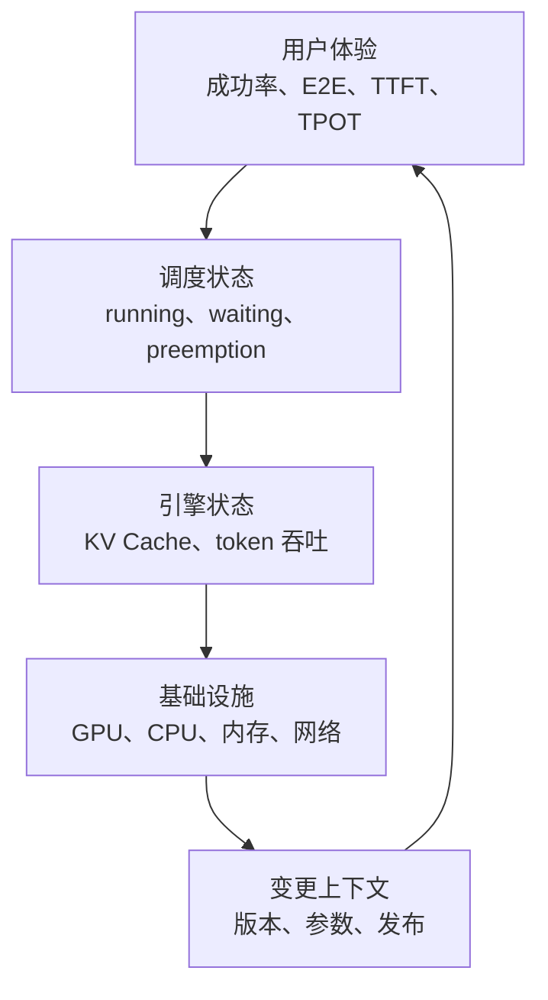
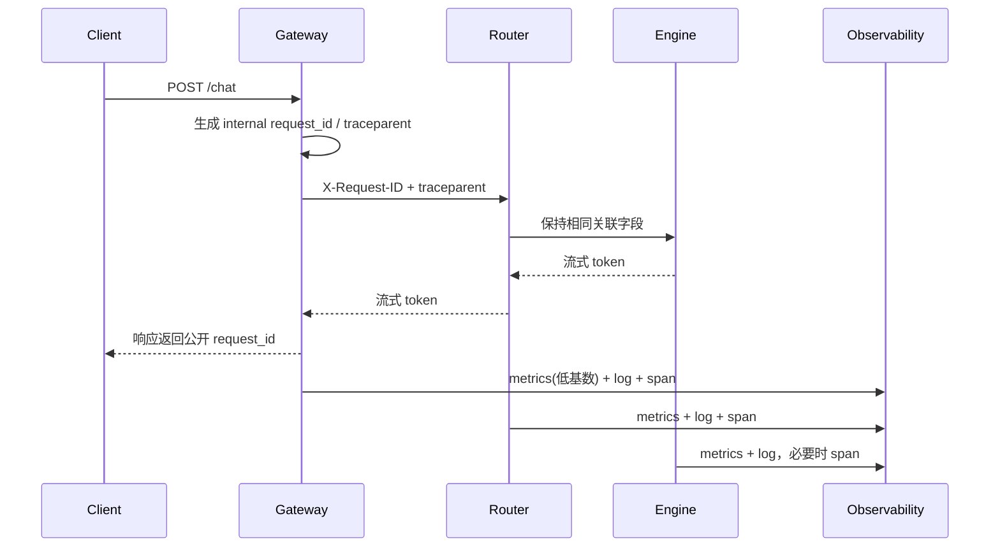
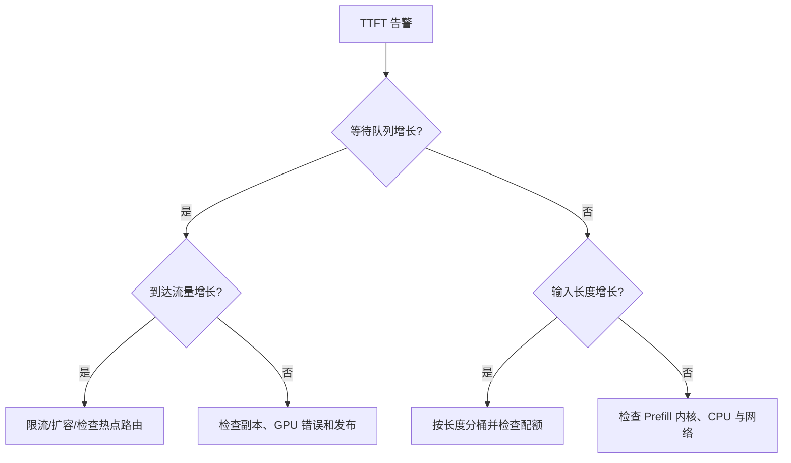

## 📑 目录
- [1. 可观测性不是多画几张图](#1-可观测性不是多画几张图)
- [2. 推理服务的指标分层](#2-推理服务的指标分层)
- [3. 延迟与吞吐公式](#3-延迟与吞吐公式)
- [4. 暴露与采集指标](#4-暴露与采集指标)
- [5. 仪表盘设计](#5-仪表盘设计)
- [6. 日志与追踪](#6-日志与追踪)
- [7. 告警与排障](#7-告警与排障)
- [8. 一次完整排障案例](#8-一次完整排障案例)
- [9. 边界与数据治理](#9-边界与数据治理)
- [总结](#-总结)
- [自我检验清单](#-自我检验清单)
- [官方参考](#-官方参考)
---
## 1. 可观测性不是多画几张图
汽车仪表盘同时显示车速、油量、水温和故障灯。
只看 GPU 利用率，就像只看发动机转速判断整辆车是否安全。
推理服务至少要同时观察用户体验、请求调度、模型执行、基础设施和变更事件。

可观测性的目标是回答三个问题：
1. 用户是否受到影响？
2. 影响发生在哪一层？
3. 哪次变更或哪类负载触发了它？
指标适合看趋势，日志适合看事件细节，追踪适合看一次请求跨组件的路径。
三者缺一时，排障会像只凭体温判断所有疾病。

### 1.1 请求 ID 是贯穿线，不是万能标签
每个外部请求在可信入口生成一个不可猜测的 `request_id`，并通过 `X-Request-ID` 传给鉴权、路由、推理适配层和引擎。若客户端自带同名值，网关应校验格式并生成内部 ID，避免日志注入和跨租户碰撞。

同时使用 W3C Trace Context：
- `traceparent` 负责跨服务追踪上下文；
- `request_id` 方便人和客服检索一次请求；
- 两者都进入结构化日志和 trace span；
- 两者都**不能**成为 Prometheus 标签，否则每个请求都会创建新时序。



网关记录完整端到端时间；Router 记录选路和排队；Engine 记录 Prefill、Decode、Token 和缓存。这样同一个 request ID 能回答：“入口是否限流”“路由到了哪个 Pod”“排队多久”“引擎何时产出首 token”。如果某一层不支持 OpenTelemetry，至少要保证结构化日志保留 ID 和上游耗时。
## 2. 推理服务的指标分层
### 2.1 用户与业务层
优先定义服务级指标：
- 请求成功率与错误码分布
- 端到端延迟 P50、P95、P99
- TTFT（Time to First Token）分位数
- TPOT（Time per Output Token）分位数
- 每分钟输入与输出 token 数
- 主动取消、超时和限流比例
流式接口不能只记录 HTTP 连接建立时间。
连接很快建立，但第一个 token 等了十秒，用户仍然会认为服务很慢。
### 2.2 调度与引擎层
重点关注：
- 正在运行的请求数
- 等待队列长度或等待请求数
- 请求排队时间
- KV Cache 使用率
- KV Cache 命中率（若当前版本提供）
- 抢占与重计算次数
- Prefill 与 Decode token 吞吐
- 每个请求的输入、输出 token 长度分布
队列是生产推理最重要的“压力表”之一。
GPU 利用率接近 100% 可能是健康的高负载；队列持续增长则说明到达速率超过服务速率。
### 2.3 基础设施层
节点和容器至少观察：
- GPU 核心与显存利用率
- GPU 温度、功耗、降频与 XID 错误
- CPU 使用率与限流
- 主机内存、工作集与 OOM Kill
- 网络吞吐、丢包与连接数
- 磁盘、模型下载和容器重启
GPU 指标通常由 NVIDIA DCGM Exporter 暴露。
引擎指标与 GPU 指标必须按 Pod、节点和模型版本关联，否则很难定位单个异常副本。
## 3. 延迟与吞吐公式
### 3.1 拆开端到端延迟
对流式生成请求，可以近似写成：
$$
T_{\text{E2E}}
= T_{\text{queue}}
+ T_{\text{prefill}}
+ (N_{\text{out}}-1)\times T_{\text{POT}}
+ T_{\text{network}}
$$
其中：
- $T_{\text{queue}}$ 是排队时间
- $T_{\text{prefill}}$ 通常主导 TTFT 的计算部分
- $N_{\text{out}}$ 是实际输出 token 数
- $T_{\text{POT}}$ 是相邻输出 token 的平均间隔
TTFT 可近似为：
$$
T_{\text{TTFT}}
\approx T_{\text{queue}} + T_{\text{prefill}} + T_{\text{network-first}}
$$
这解释了为什么 TTFT 变差不一定是模型内核变慢，也可能只是排队变长。
### 3.2 一个手算示例
以下数字是教学假设，不是某型号 GPU 的真实性能：
- 排队：120 ms
- Prefill：180 ms
- 输出：101 token
- TPOT：35 ms
- 其余网络与序列化：50 ms
则：
$$
T_{\text{E2E}}
= 0.12 + 0.18 + (101-1)\times0.035 + 0.05
= 3.85\text{s}
$$
如果只把 Prefill 优化一半，总延迟约减少 90 ms。
如果把排队从 120 ms 降到 20 ms，则减少 100 ms。
公式帮助我们把优化预算花在占比最大的部分。
### 3.3 分位数不能相加
`P99(queue) + P99(prefill)` 通常不等于 `P99(E2E)`。
因为这些 P99 可能来自不同请求。
正确做法是在单请求维度记录阶段耗时，再直接计算端到端分位数。
平均值也会隐藏长尾：99 个请求 100 ms、1 个请求 10 s，平均值看起来仍不算夸张。
## 4. 暴露与采集指标
### 4.1 先看真实指标名
不同 vLLM 版本会增加、删除或重命名指标。
不要从博客复制 PromQL 后就假定它存在，先查询当前实例的 `/metrics`。
```bash
kubectl port-forward service/chat-model 8000:8000
curl -s http://127.0.0.1:8000/metrics > /tmp/vllm-metrics.txt
rg '^vllm:' /tmp/vllm-metrics.txt
```
**前提**：本机 8000 端口空闲，操作者有 `pods/portforward` 权限，实例指标端点是 `/metrics`。**危险点**：端口转发绕过正常网关路径，仅用于只读诊断；不要绑定到 `0.0.0.0`，不要在共享目录长期保存可能包含内部标签的指标快照。
指标端点只应在受信网络或通过端口转发访问。
不要为了“方便监控”把它开放到公网。
### 4.2 ServiceMonitor 示例
若集群使用 Prometheus Operator，可声明采集对象：
```yaml
apiVersion: monitoring.coreos.com/v1
kind: ServiceMonitor
metadata:
  name: chat-model
spec:
  selector:
    matchLabels:
      app: chat-model
  endpoints:
    - port: metrics
      path: /metrics
      interval: 15s
      scrapeTimeout: 10s
```
**前提**：集群安装了 Prometheus Operator CRD，Prometheus 的 selector 会选择该 ServiceMonitor，Service 确有名为 `metrics` 的端口。**危险点**：过短采集周期会增加引擎、网络和时序库开销；跨租户 Prometheus 还需配置认证和 NetworkPolicy。
对应 Service 需要命名端口：
```yaml
apiVersion: v1
kind: Service
metadata:
  name: chat-model
  labels:
    app: chat-model
spec:
  selector:
    app: chat-model
  ports:
    - name: metrics
      port: 8000
      targetPort: http
```
**前提**：业务与指标确实共用 8000 端口。**危险点**：Service 新增端口不会自动保护 `/metrics`；必须由网络策略、网格授权或独立监控 Service 限制访问，不能依赖“别人不知道路径”。
如果业务与指标共用端口，仍可在网络策略与监控权限上限制访问主体。
### 4.3 标签基数
Prometheus 标签不能无限增加。
不要把 `request_id`、完整 prompt、用户输入或原始 URL 放进指标标签。
这些字段既造成高基数，也可能泄漏敏感数据。
适合做标签的通常是模型、版本、集群、命名空间、状态码类别。
请求级细节应进入受控日志或追踪系统，并设置保留期。

### 4.4 先规范化，再写 Dashboard
引擎升级可能改指标名。更稳妥的做法是用 recording rules 把当前版本的原始指标转换为组织内部稳定名称，例如：
```yaml
groups:
  - name: inference-normalized
    interval: 30s
    rules:
      - record: inference:waiting_requests
        expr: max by (cluster, namespace, model_name, pod) (vllm:num_requests_waiting)
      - record: inference:running_requests
        expr: max by (cluster, namespace, model_name, pod) (vllm:num_requests_running)
      - record: inference:ttft_seconds_bucket_rate5m
        expr: sum by (cluster, namespace, model_name, le) (rate(vllm:time_to_first_token_seconds_bucket[5m]))
```
**前提**：已从当前 `/metrics` 验证三个原始指标及标签，PrometheusRule 由 Operator 管理。**危险点**：这里的 vLLM 名称只是常见示例；指标不存在时规则不会产生数据，而不是自动报错。升级前应在预发布执行规则测试。不要把 `request_id` 加入聚合维度。

常用 PromQL 可以按“症状 → 原因”组织。以下查询中的标签必须按实际环境调整。

**入口请求率与 5xx 比例：**
```promql
sum(rate(gateway_requests_total{service="chat-model"}[5m]))

sum(rate(gateway_requests_total{service="chat-model",status_class="5xx"}[5m]))
/
clamp_min(sum(rate(gateway_requests_total{service="chat-model"}[5m])), 1e-9)
```
前提是网关 Counter 统一标注 `service` 与低基数 `status_class`。危险点是低流量下短窗口比例会非常抖，应同时设置最小请求量或使用 burn-rate 窗口。

**TTFT P95：**
```promql
histogram_quantile(
  0.95,
  sum by (le, model_name) (
    rate(vllm:time_to_first_token_seconds_bucket[5m])
  )
)
```
前提是直方图桶覆盖 SLO 附近，且聚合时保留 `le`。危险点是不同模型、版本或请求长度混在一起会产生误导；必要时分模型展示，但不要加入请求级标签。

**每 Pod 等待队列与增长速度：**
```promql
max by (pod, model_name) (vllm:num_requests_waiting)

deriv(
  (sum(vllm:num_requests_waiting{model_name="chat-model"}))[10m:30s]
)
```
`deriv > 0` 表示窗口内队列有增长趋势，不等于所有采样点单调增长。Gauge 不应使用 `rate()`；短窗口 `deriv` 对噪声敏感，要结合绝对队列和 TTFT。

**输出 token 吞吐：**
```promql
sum by (model_name) (
  rate(vllm:generation_tokens_total[5m])
)
```
前提是该 Counter 在当前版本存在。危险点是 token/s 上升可能来自输出变长，不代表请求容量提升；必须和请求率及长度分布一起看。

**GPU 显存与引擎队列关联：**
```promql
max by (node, gpu) (
  DCGM_FI_DEV_FB_USED
)
/
max by (node, gpu) (
  DCGM_FI_DEV_FB_USED + DCGM_FI_DEV_FB_FREE
)
```
DCGM 标签名会随部署变化。显存高不一定异常，关键是是否伴随 KV Cache 压力、抢占、排队和 SLO 失守。

**未就绪副本与重启：**
```promql
sum(kube_deployment_status_replicas_unavailable{deployment="chat-model"})

sum by (pod) (
  increase(kube_pod_container_status_restarts_total{
    container="server",
    pod=~"chat-model-.*"
  }[15m])
)
```
前提是采集 kube-state-metrics。危险点是 `deployment` 名在多命名空间重复，应在生产查询中加 `cluster`、`namespace`。
## 5. 仪表盘设计
### 5.1 一张可值班的 Dashboard
值班首页应从用户结果逐层下钻到拥塞、容量和基础设施。不要把几十张图无序堆在一起；推荐一屏四行，并给每张图写“看什么、异常后去哪”：

1. **SLO 行**：RPS、错误率、TTFT P95/P99、TPOT P95/P99、E2E P99；阈值线直接画 SLO。
2. **拥塞行**：waiting 总量和每 Pod、queue time、running、输入/输出 token/s、取消与 429。
3. **容量行**：KV Cache、抢占/重计算、输入/输出长度分布、每副本 token/s 与错误率、Ready/Desired、副本启动耗时。
4. **基础设施行**：GPU 利用率/显存/XID/温度/降频、CPU throttling、主机内存、网络、容器重启和发布事件。

Dashboard 必须提供：
- `cluster → namespace → model → version → pod` 的逐级筛选；
- 镜像、模型 revision、配置和 HPA 变更注释；
- 从异常 Pod 图跳转到该 Pod 日志；
- 从有 exemplar 的延迟点跳转到 trace；
- 至少 24 小时同比和 7 天基线，避免只看故障瞬间；
- “No data” 显式提示，不能把缺数据绘成 0。

一个常见误区是把 P95 做成所有 Pod 分位数的平均。直方图必须先把 bucket rate 按 `le` 聚合，再做 `histogram_quantile`；“平均 P95”没有清晰统计含义。
## 6. 日志与追踪
### 6.1 结构化日志
推荐输出 JSON，并约定最小字段：
```json
{
  "timestamp": "2026-04-16T10:00:00Z",
  "request_id": "generated-id",
  "trace_id": "otel-trace-id",
  "component": "inference-router",
  "pod": "chat-model-abc",
  "image_digest": "sha256:...",
  "model_revision": "approved-revision",
  "model": "chat-model",
  "status": 200,
  "input_tokens": 512,
  "output_tokens": 128,
  "route_ms": 3,
  "queue_ms": 42,
  "ttft_ms": 210,
  "e2e_ms": 4250,
  "cancelled": false
}
```
这是字段结构示例，不是实测记录。
不要默认记录 prompt 和生成文本。
确需调试内容时，应有脱敏、授权、采样、访问审计和短保留期。
### 6.2 关联而不泄漏
网关生成 `request_id`，将它传给推理服务并写入日志。
追踪 span 可以覆盖网关、排队、推理和后处理，但不要把密钥和原始内容写入属性。
对高流量服务采用采样，错误和长尾请求可提高采样率。

建议的 span 层次：
```text
gateway.request
├── auth.check
├── quota.check
├── router.select_backend
└── inference.request
    ├── scheduler.queue
    ├── model.prefill
    └── model.decode
```
这不是要求每个 token 都创建 span。Decode 可用事件或聚合属性记录 `output_tokens`、`tpot_ms`，否则追踪量会爆炸。

### 6.3 采样仍要保留可关联性
头部采样在请求开始时决定是否记录，成本可控，但可能漏掉后来才变慢的请求。尾部采样可在看到错误、TTFT 或 E2E 后提高保留率，但需要 Collector 缓冲完整 trace，内存和延迟成本更高。

可采用：
- 正常成功请求 0.1%～1% 采样；
- 5xx、429、取消和超时优先保留；
- TTFT/E2E 超阈值请求尾部保留；
- 重大发布窗口临时提高采样，并设置自动恢复时间。

即使 trace 未采样，结构化访问日志仍应有 `request_id`、`trace_id`、版本、Pod、状态和阶段耗时。采样率必须是可观测配置，避免值班人员把“没 trace”误判为“请求没发生”。
## 7. 告警与排障
### 7.1 从 SLO 派生告警
告警要面向用户影响，而不是“某个数看起来高”。
推荐分两层：
- **症状告警**：成功率下降、TTFT 或 E2E 超过 SLO
- **原因告警**：队列增长、KV Cache 压力、GPU 错误、Pod 未就绪
示意规则如下，指标名必须替换为当前环境真实名称：
```yaml
groups:
  - name: inference
    rules:
      - alert: InferenceHighErrorRate
        expr: |
          (
            sum(rate(gateway_requests_total{
              service="chat-model",
              status_class="5xx"
            }[5m]))
            /
            clamp_min(sum(rate(gateway_requests_total{
              service="chat-model"
            }[5m])), 1e-9)
          ) > 0.01
          and
          sum(increase(gateway_requests_total{
            service="chat-model"
          }[5m])) > 100
        for: 10m
        labels:
          severity: page
        annotations:
          summary: "chat-model 5xx 比例持续超过 1%"
      - alert: InferenceQueueGrowing
        expr: |
          sum(inference:waiting_requests{model_name="chat-model"}) > 20
          and
          deriv((sum(inference:waiting_requests{
            model_name="chat-model"
          }))[10m:30s]) > 0
        for: 10m
        labels:
          severity: warning
        annotations:
          summary: "等待队列高于基线且仍在增长"
      - alert: InferenceMetricsAbsent
        expr: |
          absent(inference:running_requests{
            model_name="chat-model"
          })
        for: 5m
        labels:
          severity: warning
        annotations:
          summary: "推理引擎指标缺失"
```
**前提**：规则已用历史数据回放，网关 Counter、规范化指标和标签均存在，Alertmanager 路由及 Runbook 链接已配置。**危险点**：`1%`、`100`、`20` 和时间窗口都是教学占位符；低流量比例告警会误报，因此示例增加了最小请求量。真正的 SLO 告警优先采用多窗口 burn rate，而不是只复制固定阈值。

原因告警不应与症状告警同级呼叫所有人。推荐：
- Page：高错误率、SLO 快速燃烧、服务无可用副本；
- Ticket/Warning：队列趋势、容量逼近、指标缺失、单 Pod 重启；
- 信息事件：发布、HPA 动作、节点维护和模型切换。

高 GPU 利用率本身通常不应 Page；它可能只是系统高效工作。GPU XID、无 Ready 副本或用户 SLO 失守才是明确事件。
应通过历史基线、SLO 和扩容耗时共同确定。
### 7.2 一条可执行排障路径

排障时保留时间线：
```bash
kubectl get pods -l app=chat-model -o wide
kubectl get events --sort-by=.lastTimestamp
kubectl logs deployment/chat-model --since=20m
kubectl rollout history deployment/chat-model
```
**前提**：当前 context/namespace 已确认，日志后端尚未聚合时才直接读 Pod 日志。**危险点**：Deployment 日志可能只覆盖部分 Pod，且包含敏感元数据；不要用无时间范围的全量日志阻塞 API Server。生产排障优先在日志平台按 request ID、Pod 和时间窗检索。
先确认影响范围，再比较正常副本和异常副本，最后关联变更。
不要一看到延迟升高就重启全部 Pod；重启会清空缓存并制造更长冷启动。

## 8. 一次完整排障案例
下面案例数字均为教学假设，但过程可直接转成 Runbook。

### 8.1 告警与影响确认
10:02，`InferenceQueueGrowing` 触发；SLO 面板显示：
- RPS 从 18 升到 21，只增长 17%；
- TTFT P95 从 0.7 s 升到 4.8 s；
- TPOT P95 仍约 42 ms；
- 5xx 没上升，但客户端取消从 0.2% 升到 3%；
- waiting 从 5 持续升到 96。

TTFT 恶化而 TPOT 稳定，首先指向排队/Prefill，而非 Decode 内核全面退化。值班人员记录告警时间和影响模型，不立即重启。

### 8.2 从指标缩小到单个版本
按 `version` 拆分后，新版本 Pod 的每副本输入 token/s 明显高于旧版本，输出 token/s 接近；按输入长度桶查看，P95 从 900 token 升到 7,200 token。发布时间注释显示 09:58 网关发布了新的系统提示词。

这说明“RPS 只涨 17%”掩盖了 Prefill 工作量巨增。队列增长是结果，流量画像变化是候选原因。

### 8.3 用 request ID 串联三层
从 TTFT 长尾 trace exemplar 取得 `request_id=req-7f...`：
```text
gateway log: request_id=req-7f input_tokens=7421 e2e_ms=8120
router log:  request_id=req-7f backend=chat-model-b queue_ms=4310
engine log:  request_id=req-7f prefill_ms=2870 output_tokens=83
trace: auth 2ms → route 3ms → queue 4310ms → prefill 2870ms → decode 3270ms
```
查询前提是三层都保留同一内部 ID，日志访问经过授权。危险点是不要把完整 prompt 粘进事故频道；这里只需要 token 长度、模板版本和耗时。

再抽取 20 个长尾 request ID，均使用 `prompt_template=v43`，而正常请求主要是 `v42`。至此形成可证伪假设：v43 重复拼接了检索上下文，导致输入 token 激增、Prefill 容量下降和队列累积。

### 8.4 缓解、修复与验证
处置顺序：
1. 网关将模板回滚到 v42，并限制最大输入 token；
2. 对超过等待预算的新请求尽早返回 429，防止无限队列；
3. 确认已有热副本有余量后临时扩容，不在 GPU quota 不明时盲目增加 desired replicas；
4. 观察 queue slope 先转负，再等待 TTFT 恢复；
5. 离线复现 v43，修复重复拼接并增加 token 长度门禁。

10:08 回滚；10:10 waiting 达到 112 峰值后下降；10:15 TTFT P95 回到 0.9 s；10:20 解除临时限流。复盘动作包括：
- Dashboard 增加输入 token P50/P95/P99 与模板版本注释；
- 模板发布门禁加入最大 token 增幅；
- 容量模型从纯 QPS 改为输入/输出长度分桶；
- 告警保留“队列绝对值 + 增长斜率 + TTFT”组合。

这个案例说明 metrics 找范围，trace 找阶段，日志找请求和版本；只有三者通过 request ID、trace ID、Pod 和版本关联，才能从“GPU 很忙”走到可验证根因。

## 9. 边界与数据治理
- 指标证明“发生了什么”，不自动证明因果
- GPU 利用率不是用户体验指标
- 未记录输入/输出长度时，不同时间段的延迟不可直接比较
- 客户端取消可能表现为服务端异常，需要统一口径
- 指标采样间隔过长会漏掉短尖峰，过短会增加成本
- 直方图桶边界必须覆盖真实 SLO 区间
- 日志与追踪可能包含个人数据，应遵循组织合规要求
- 指标名称和健康端点以所用版本官方文档为准
## 📝 总结
推理可观测性要从用户延迟开始，沿排队、引擎和硬件逐层寻找证据。
TTFT、TPOT、E2E、waiting、KV Cache 和 GPU 指标各回答不同问题，不能互相替代。
把版本、参数和发布时间放进同一观察上下文，才能从“看到异常”走到“定位原因”。
## ✅ 自我检验清单
- [ ] 我能区分 TTFT、TPOT 和端到端延迟
- [ ] 我知道排队为什么比单看 GPU 利用率更直接
- [ ] 我不会把不同阶段的 P99 简单相加
- [ ] 我从当前实例确认了真实指标名
- [ ] 我的指标标签没有 request_id、prompt 等高基数字段
- [ ] 仪表盘能按模型、版本、Pod 和环境筛选
- [ ] 告警阈值来自 SLO 或历史基线，而不是教程数字
- [ ] 日志默认不记录敏感提示词
- [ ] 值班手册包含影响确认、变更关联和回滚入口
## 📚 官方参考
- [vLLM：Production Metrics](https://docs.vllm.ai/en/latest/design/metrics.html)
- [Prometheus：Metric and Label Naming](https://prometheus.io/docs/practices/naming/)
- [Prometheus：Histograms and Summaries](https://prometheus.io/docs/practices/histograms/)
- [Prometheus Operator：ServiceMonitor API](https://prometheus-operator.dev/docs/api-reference/api/)
- [OpenTelemetry：Observability Primer](https://opentelemetry.io/docs/concepts/observability-primer/)
- [NVIDIA DCGM Exporter](https://docs.nvidia.com/datacenter/cloud-native/gpu-telemetry/latest/dcgm-exporter.html)
- [Kubernetes：日志架构](https://kubernetes.io/docs/concepts/cluster-administration/logging/)
