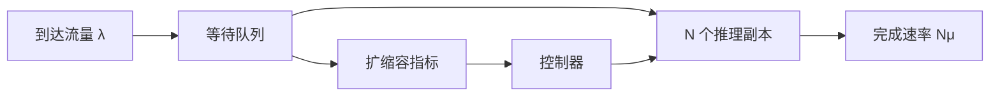
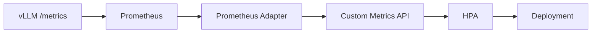
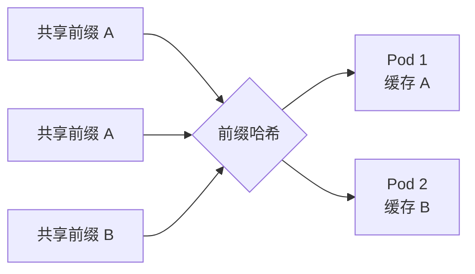

## 📑 目录
- [1. 扩缩容到底在控制什么](#1-扩缩容到底在控制什么)
- [2. 用排队理解容量](#2-用排队理解容量)
- [3. 选择扩缩容指标](#3-选择扩缩容指标)
- [4. 配置 HPA](#4-配置-hpa)
- [5. 冷启动与稳定性](#5-冷启动与稳定性)
- [6. 多副本负载均衡](#6-多副本负载均衡)
- [7. 前缀感知路由](#7-前缀感知路由)
- [8. 故障、安全与边界](#8-故障安全与边界)
- [总结](#-总结)
- [自我检验清单](#-自我检验清单)
- [官方参考](#-官方参考)
---
## 1. 扩缩容到底在控制什么
推理副本像超市收银台。
顾客到来比结账快时，队伍会越来越长；临时多开收银台可以缓解，但新员工就位需要时间。
自动扩缩容控制的是“可用服务能力”，不是让单个 GPU 凭空变快。

扩容要同时满足：
- 集群有可调度 GPU
- 镜像和模型可在预期时间内准备好
- 新副本通过启动与就绪探针
- 网关把它加入负载均衡池
任何一环失败，`replicas` 数字增加都不等于容量增加。
## 2. 用排队理解容量
### 2.1 最小模型
设每个副本平均服务率为 $\mu$ 个请求/秒，副本数为 $N$，到达率为 $\lambda$。
一个必要但不充分的稳定条件是：
$$
\lambda < N\mu
$$
定义粗略利用率：
$$
\rho = \frac{\lambda}{N\mu}
$$
当 $\rho$ 接近 1 时，微小抖动就会导致队列和尾延迟快速上升。
LLM 请求长短差异很大，所以“请求/秒”只是粗粒度近似。
更可靠的容量单位可能是输入 token/s、输出 token/s，或按长度分桶后的请求率。
### 2.2 一个手算例子
以下数据均为假设：
- 峰值到达率 $\lambda = 5$ 请求/s
- 单副本在目标请求分布与 SLO 下，安全服务率 $\mu = 1.4$ 请求/s
- 希望运行利用率不超过 70%
副本数下界为：
$$
N \ge \left\lceil\frac{5}{1.4\times0.7}\right\rceil
= \lceil5.10\rceil = 6
$$
如果只按 $\lceil5/1.4\rceil=4$ 配置，平均吞吐可能勉强够，但没有吸收波动的余量。
实际值必须来自与生产长度分布、并发和采样参数一致的压测。
### 2.3 Little 定律的直觉
稳定系统中：
$$
L = \lambda W
$$
$L$ 是系统内平均请求数，$W$ 是平均停留时间。
若到达率为 4 请求/s，平均排队时间为 0.5 s，则平均有约 2 个请求在等待。
Little 定律描述平均关系，不能代替 P99 延迟分析。
## 3. 选择扩缩容指标
### 3.1 为什么 CPU 常常不够
推理瓶颈通常在 GPU、显存带宽、KV Cache 或调度队列。
CPU 可能只有 30%，用户却已经排队。
仅使用 CPU HPA，像根据收银台照明用电决定是否加开窗口。
### 3.2 指标优先级
可考虑以下信号：
1. **等待队列或排队时间**：最接近拥塞，通常最有价值
2. **运行请求数/副本**：反映并发压力
3. **token 到达率**：比 QPS 更能描述长短差异
4. **KV Cache 使用率**：可作为内存压力保护信号
5. **GPU 利用率**：适合作为辅助信号
6. **QPS**：简单，但必须结合请求长度分布
单个瞬时指标容易抖动。
控制器应使用时间窗口，并对扩容和缩容采用不同速度。
### 3.3 “每副本队列”比总队列更稳
假设总等待请求数为 $Q$，当前就绪副本为 $R$：
$$
q_{\text{per-pod}} = \frac{Q}{\max(R, 1)}
$$
如果目标是每副本最多等待 2 个请求，HPA 可以据此估算期望副本数。
指标管道应只统计就绪且接收流量的副本。
## 4. 配置 HPA
### 4.1 自定义指标链路
典型链路是：

HPA 不会直接查询任意 Prometheus 查询。
需要适配器把查询结果暴露为 Kubernetes 可识别的指标。
### 4.2 HPA 骨架
以下指标名与目标值都是示意：
```yaml
apiVersion: autoscaling/v2
kind: HorizontalPodAutoscaler
metadata:
  name: chat-model
spec:
  scaleTargetRef:
    apiVersion: apps/v1
    kind: Deployment
    name: chat-model
  minReplicas: 2
  maxReplicas: 12
  behavior:
    scaleUp:
      stabilizationWindowSeconds: 30
      policies:
        - type: Pods
          value: 2
          periodSeconds: 60
    scaleDown:
      stabilizationWindowSeconds: 900
      policies:
        - type: Percent
          value: 25
          periodSeconds: 300
  metrics:
    - type: Pods
      pods:
        metric:
          name: inference_waiting_requests
        target:
          type: AverageValue
          averageValue: "2"
```
HPA 接管后，应从 Deployment 的声明式清单删除 `spec.replicas`。否则后续 `kubectl apply` 或 GitOps 同步会把 scale 子资源改回固定值，与 HPA 反复争抢。

检查控制器看到的状态：
```bash
kubectl get hpa chat-model --watch
kubectl describe hpa chat-model
kubectl get --raw \
  "/apis/custom.metrics.k8s.io/v1beta1" | jq .
```
`minReplicas` 应覆盖基本高可用和突发缓冲。
`maxReplicas` 应受 GPU 配额、预算和下游容量约束，而不是写一个无限大的数。
## 5. 冷启动与稳定性
### 5.1 扩容不是即时的
总扩容时间近似为：
$$
T_{\text{scale}}
= T_{\text{detect}}
+ T_{\text{schedule}}
+ T_{\text{image}}
+ T_{\text{model}}
+ T_{\text{ready}}
$$
假设检测 30 s、调度 10 s、镜像 40 s、模型加载 180 s、预热 20 s，总计 280 s。
这些数字仍是假设，应该分别测量。
如果业务尖峰只持续 60 s，事后扩容几乎帮不上忙。
这时需要最小热副本、定时扩容、预测扩容、请求准入或客户端退避。
### 5.2 避免扩缩容振荡
振荡是“刚扩容就缩容，刚缩容又排队”。
常用手段：
- 扩容快、缩容慢
- 使用稳定窗口和冷却时间
- 缩容前观察完整业务周期
- 给队列指标做合理平滑
- 终止前先摘流量并排空请求

PodDisruptionBudget（PDB）适合保护节点维护、集群升级等通过 Eviction API 发起的自愿中断，**不会阻止 HPA 通过 ReplicaSet 缩容删除 Pod**，因此不是抑制 HPA 振荡的手段。振荡要靠 stabilization window、缩容策略和指标平滑控制。

```yaml
apiVersion: policy/v1
kind: PodDisruptionBudget
metadata:
  name: chat-model
spec:
  minAvailable: 1
  selector:
    matchLabels:
      app: chat-model
```
PDB 主要约束自愿中断，不保证节点故障时仍有副本，也不替代 HPA 的缩容策略。
### 5.3 缩容与在途请求
LLM 请求可能持续数十秒甚至更久。
缩容时应：
1. 让 readiness 失败或从网关摘除
2. 停止接收新请求
3. 等待在途请求完成或达到截止时间
4. 再终止进程
如果没有排空机制，扩缩容会直接制造 5xx 和重试风暴。
## 6. 多副本负载均衡
### 6.1 最少连接并不总是最少工作
两个连接的生成长度可能相差百倍。
Round Robin 实现简单，但不理解请求长度、KV Cache 和队列。
常见策略：
- **轮询**：简单、无状态，适合请求较均匀
- **最少连接/最短队列**：更贴近当前负载
- **加权路由**：用于异构 GPU 或金丝雀版本
- **一致性哈希**：维持租户或前缀亲和
- **SLO 感知路由**：按长度、优先级或截止时间分流
网关重试必须有边界。
流式响应已经输出 token 后，不能静默换副本重试而假装是同一次生成。
### 6.2 异构副本
不同 GPU 型号、量化方式或张量并行度的服务率不同。
不能假设所有 Pod 权重相同。
先分别压测，再按安全吞吐设置权重，并在指标中保留硬件和配置标签。
## 7. 前缀感知路由
前缀缓存像图书馆把同一套参考资料留在固定阅览室。
同一系统提示词的请求被送到同一副本，更可能复用已存在的 KV Cache。

收益依赖：
- 前缀足够长且重复率高
- 引擎启用并支持前缀缓存
- 路由哈希稳定
- 副本变更不太频繁
风险也很明确：
- 热门前缀形成热点副本
- 扩缩容改变哈希环，缓存大量失效
- 缓存亲和与最短队列可能冲突
- 跨租户共享要评估隔离与侧信道风险
实用策略是先过滤过载副本，再在候选中选择前缀命中更高者。
缓存命中不能凌驾于 SLO 和租户隔离之上。
## 8. 故障、安全与边界
### 8.1 过载时先保护系统
扩容来不及时，要有背压：
- 网关按租户限流
- 限制输入与最大输出 token
- 设置有界队列
- 超过等待预算时尽早返回 429/503
- 客户端采用带抖动的指数退避
- 区分交互流量与离线批任务优先级
无限队列不会创造容量，只会把拒绝变成长时间超时并消耗内存。
### 8.2 安全边界
- 扩缩容指标端点不应公开
- 自定义指标适配器使用最小 RBAC
- 不以用户可控标签直接生成 Prometheus 高基数标签
- 限流键必须防伪造，并避免把原始密钥写日志
- 多租户路由需防止一个租户占满全部队列
### 8.3 技术边界
- HPA 只增加 Pod，不自动增加节点 GPU
- Cluster Autoscaler 或节点自动供给的冷启动通常更长
- 指标有延迟，控制动作永远落后于瞬时流量
- QPS 相同但 token 分布不同，容量可能完全不同
- 缓存亲和提高命中率，也可能破坏负载均衡
- 多副本提高可用性，但不能替代跨故障域规划
## 📝 总结
自动扩缩容是一个带延迟的反馈控制系统。
排队指标告诉我们供需是否失衡，HPA 调整副本，负载均衡决定请求如何使用这些副本。
真正可靠的方案还必须包含冷启动测量、过载保护、优雅排空、GPU 上限和安全隔离。
## ✅ 自我检验清单
- [ ] 我能用 $\lambda < N\mu$ 解释最小稳定条件
- [ ] 我的单副本服务率来自目标工作负载压测
- [ ] 我知道 CPU 指标为什么可能漏掉 GPU 拥塞
- [ ] 自定义指标链路已经端到端验证
- [ ] `minReplicas`、`maxReplicas` 和稳定窗口有明确依据
- [ ] 我测量了检测、调度、镜像、模型加载和预热耗时
- [ ] 缩容前会停止新流量并排空在途请求
- [ ] 网关有有界队列、限流和安全重试策略
- [ ] 前缀亲和不会绕过租户隔离和过载保护
## 📚 官方参考
- [Kubernetes：Horizontal Pod Autoscaling](https://kubernetes.io/docs/tasks/run-application/horizontal-pod-autoscale/)
- [Kubernetes：HPA 行为配置](https://kubernetes.io/docs/tasks/run-application/horizontal-pod-autoscale/#configurable-scaling-behavior)
- [Kubernetes：PodDisruptionBudget](https://kubernetes.io/docs/tasks/run-application/configure-pdb/)
- [Prometheus Adapter](https://github.com/kubernetes-sigs/prometheus-adapter)
- [Kubernetes：EndpointSlice](https://kubernetes.io/docs/concepts/services-networking/endpoint-slices/)
- [vLLM Production Stack：Autoscaling](https://docs.vllm.ai/projects/production-stack/en/latest/use_cases/autoscaling.html)
- [vLLM Production Stack：Request Routing](https://docs.vllm.ai/projects/production-stack/en/latest/use_cases/request_routing.html)
