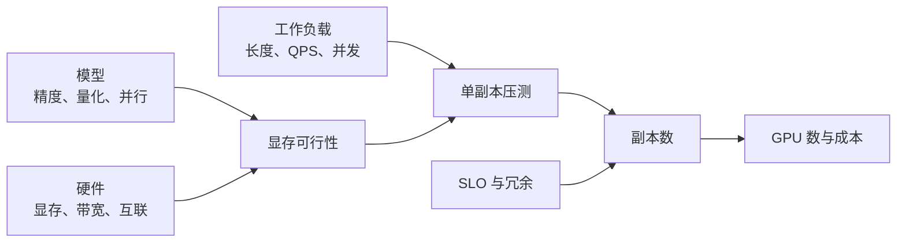

## 📑 目录
- [1. 容量规划在规划什么](#1-容量规划在规划什么)
- [2. 明确输入而不是猜数字](#2-明确输入而不是猜数字)
- [3. 先算单副本能否放下](#3-先算单副本能否放下)
- [4. 再算单副本服务能力](#4-再算单副本服务能力)
- [5. 从峰值反推副本数](#5-从峰值反推副本数)
- [6. 加上可用性与扩容余量](#6-加上可用性与扩容余量)
- [7. 成本与敏感性分析](#7-成本与敏感性分析)
- [8. 验证、复盘与边界](#8-验证复盘与边界)
- [总结](#-总结)
- [自我检验清单](#-自我检验清单)
- [官方参考](#-官方参考)
---
## 1. 容量规划在规划什么
搬家前要先知道家具尺寸、电梯尺寸、每天要搬多少箱，以及电梯坏一部时怎么办。
模型参数量对应家具，GPU 显存对应电梯空间，流量对应箱子，可用性目标对应故障预案。
容量规划不是预测一个永远正确的 GPU 数字，而是建立“输入变化时结果如何变化”的模型。

最后的计划至少包含：
- 每个副本需要几张什么规格的 GPU
- 在目标 SLO 下，每副本安全吞吐是多少
- 正常峰值、突发和单节点故障分别需要多少副本
- 扩容需要多久，预留容量能撑多久
- 哪些输入是实测，哪些是假设
## 2. 明确输入而不是猜数字
### 2.1 工作负载画像
不要只记录“峰值 QPS”。
至少收集：
- 输入 token 长度 P50/P95/P99
- 输出 token 长度 P50/P95/P99
- 请求到达的时间序列和突发系数
- 流式与非流式比例
- 相同前缀比例与缓存命中机会
- 采样参数、最大上下文和最大输出
- 租户、优先级与超时预算
一个 8k 输入、1k 输出请求，与 100 输入、20 输出请求不能算作同一单位工作。
### 2.2 SLO 和可用性
示例 SLO：
- 成功率不低于 99.9%
- TTFT P95 不高于 800 ms
- TPOT P95 不高于 50 ms
- E2E P99 不高于 10 s
这些只是格式示例。
真实阈值由产品体验、模型用途和预算共同确定。
明确统计窗口、是否排除客户端取消、哪些错误计入成功率。
### 2.3 输入台账
建议将容量表分为三类：
| 字段 | 值 | 来源 |
|---|---:|---|
| 峰值到达率 | 待测 | 生产日志 |
| 长度分布 | 待测 | Token 化后的请求样本 |
| 单副本安全吞吐 | 待测 | 固定版本压测 |
| GPU 单价 | 待询价 | 采购或云账单 |
| 冗余目标 | 待确认 | SRE/业务评审 |
`待测` 比编造一个看似精确的数字更专业。
## 3. 先算单副本能否放下
### 3.1 权重显存
模型权重的粗略下界：
$$
M_{\text{weights}}
\approx P \times \frac{b}{8}
$$
$P$ 是参数量，$b$ 是每参数位数。
以 7B 模型为例：
- FP16/BF16：$7\times10^9\times2 \approx 14$ GB
- INT8：约 7 GB
- INT4：约 3.5 GB
这是十进制粗算，未包含量化 scale、元数据、对齐、运行时缓冲和框架开销。
实际占用必须加载模型后测量。
### 3.2 KV Cache
对常见多头注意力的粗略估算：
$$
M_{\text{KV/token}}
= 2 \times L \times H_{kv} \times D \times B
$$
其中：
- $2$ 表示 Key 和 Value
- $L$ 是层数
- $H_{kv}$ 是 KV Head 数
- $D$ 是每个 Head 维度
- $B$ 是每元素字节数
假设 $L=32$、$H_{kv}=8$、$D=128$、BF16 为 2 字节：
$$
M_{\text{KV/token}}
=2\times32\times8\times128\times2
=131072\text{ bytes}
\approx128\text{ KiB}
$$
若同时驻留 50,000 token，理论 KV 数据约：
$$
50000\times128\text{ KiB}\approx6.10\text{ GiB}
$$
这个示例仅展示算法。
模型结构、KV 数据类型、块管理和运行时实现都会改变实际值。
### 3.3 显存预算式
可写成：
$$
M_{\text{GPU}}
\ge M_{\text{weights}}
+ M_{\text{KV}}
+ M_{\text{workspace}}
+ M_{\text{runtime}}
+ M_{\text{headroom}}
$$
不要让理论总和刚好等于物理显存。
CUDA Graph、通信缓冲、临时张量和显存碎片都需要空间。
如果单卡放不下，可以依次评估：
1. 降低最大上下文或并发 token
2. 使用经过质量验证的量化
3. 使用更大显存 GPU
4. 采用张量并行
5. 换更小模型或路由到分层模型
张量并行降低单卡权重压力，但增加 GPU 数和通信成本。
### 3.4 主机资源也要算
CPU 内存需容纳进程、Tokenizer、模型加载暂存、共享内存和缓存。
磁盘与网络决定模型分发速度。
容量表中应同时记录：
- Pod CPU request/limit
- Pod 内存 request/limit
- `/dev/shm`
- 本地缓存或 PVC 容量
- 冷启动下载带宽
## 4. 再算单副本服务能力
### 4.1 “最大吞吐”不是“安全吞吐”
压测可能在 120 请求/min 时达到最高吞吐，但 TTFT 已经超过 SLO。
容量规划应使用满足全部 SLO 的最大负载点：
$$
\mu_{\text{safe}}
= \max\{\lambda \mid
\text{TTFT, TPOT, E2E, error rate 均达标}\}
$$
### 4.2 压测矩阵
至少改变以下维度：
- 并发数或到达率
- 输入/输出长度分桶
- 冷缓存与热缓存
- 固定前缀与随机前缀
- 流式与非流式
- 正常采样参数和最大输出
每个测试记录镜像 digest、模型 revision、GPU、引擎参数和时间。
先预热，再测量，保存原始结果而非只抄最终均值。
```bash
vllm bench serve \
  --backend vllm \
  --base-url http://127.0.0.1:8000 \
  --model chat-model \
  --dataset-name random \
  --num-prompts 1000 \
  --request-rate 4
```
命令参数以所用 vLLM 版本帮助信息为准：
```bash
vllm bench serve --help
```
### 4.3 长度归一化
如果业务长度差异大，可分别估计输入和输出 token 需求：
$$
R_{\text{in}} = \lambda \times E[N_{\text{in}}]
$$
$$
R_{\text{out}} = \lambda \times E[N_{\text{out}}]
$$
再与压测得到的 Prefill 和 Decode 能力比较。
不能简单把输入 token/s 与输出 token/s 相加，因为两个阶段的计算模式不同。
## 5. 从峰值反推副本数
### 5.1 基础公式
设：
- 峰值请求率为 $\lambda_{\text{peak}}$
- 单副本安全服务率为 $\mu_{\text{safe}}$
- 目标运行余量系数为 $u$，例如 0.7
则流量所需副本数：
$$
N_{\text{traffic}}
=\left\lceil
\frac{\lambda_{\text{peak}}}
{\mu_{\text{safe}}\times u}
\right\rceil
$$
### 5.2 完整手算
以下均为教学假设：
- 峰值 8 请求/s
- 单副本在目标长度分布下，SLO 内安全服务率 1.8 请求/s
- 目标利用余量 $u=0.75$
- 每副本使用 2 张 GPU
先算流量副本：
$$
N_{\text{traffic}}
=\left\lceil\frac{8}{1.8\times0.75}\right\rceil
=\lceil5.93\rceil
=6
$$
正常峰值需要 GPU：
$$
G_{\text{normal}} = 6\times2=12
$$
若希望损失一个双卡副本后仍承载峰值，则至少增加一个副本：
$$
N_{\text{N+1}}=6+1=7
$$
对应 14 张 GPU。
如果故障域是一台拥有 8 张 GPU 的节点，“多一个副本”并不等于能容忍整节点故障。
必须按最大故障域重新计算并设置 Pod 反亲和或拓扑分布。
### 5.3 突发缓冲
假设扩容总耗时 4 分钟，突发期间超出当前处理能力 2 请求/s。
积累队列约为：
$$
Q_{\text{burst}}=2\times4\times60=480\text{ requests}
$$
如果请求超时预算只有 10 秒，这个队列显然不可接受。
应增加热副本、提前扩容、限流，或把非交互任务移出高峰。
## 6. 加上可用性与扩容余量
容量的最终结果通常取多个约束的最大值：
$$
N_{\text{final}}
=\max(
N_{\text{traffic}},
N_{\text{HA}},
N_{\text{burst}},
N_{\text{maintenance}}
)
$$
需要讨论：
- 单 Pod 故障
- 单 GPU 或整节点故障
- 一个可用区故障
- 驱动升级和节点维护
- 新版本滚动发布所需 surge
- 节点自动供给失败或配额用尽
`replicas: 2` 只有落在不同故障域，才可能抵御单节点故障。
使用拓扑分布约束时，还要决定资源不足时是宁可 Pending，还是允许同节点部署。
## 7. 成本与敏感性分析
### 7.1 成本公式
按小时粗算：
$$
C_{\text{hour}}
= G\times C_{\text{gpu}}
+ N\times C_{\text{cpu/mem}}
+ C_{\text{storage}}
+ C_{\text{network}}
+ C_{\text{observability}}
$$
GPU 往往是主项，但不是唯一成本。
公网输出、跨区流量、模型存储和指标保留也可能显著。
### 7.2 示例而非报价
假设 14 张 GPU，每张每小时内部核算价为 10 个“成本单位”：
$$
C_{\text{GPU/day}}=14\times10\times24=3360
$$
这里刻意使用“成本单位”，因为真实价格随供应商、地区、合约和时间变化。
请用采购报价或实际账单替换。
### 7.3 敏感性表
比单点数字更有用的是场景分析：
| 场景 | 峰值 QPS | 单副本安全 QPS | 余量 | 副本数 |
|---|---:|---:|---:|---:|
| 假设 A | 6 | 1.8 | 75% | 5 |
| 假设 B | 8 | 1.8 | 75% | 6 |
| 假设 C | 8 | 1.4 | 70% | 9 |
全部标注“假设”，避免读者把它们误认为实测结论。
敏感性分析能说明最值得优化的是流量峰值、单副本能力，还是冗余策略。
## 8. 验证、复盘与边界
### 8.1 上线前容量演练
1. 用脱敏且代表真实分布的数据压测
2. 逐级提高到达率，找到首个 SLO 失守点
3. 验证队列告警早于用户 SLO 告警
4. 删除一个 Pod，确认 N+1 假设
5. 执行一次扩容并测量完整耗时
6. 做滚动发布，确认 GPU surge 资源
7. 保存命令、原始数据与图表
### 8.2 每次变化都重算
以下变化会使旧容量结论失效：
- 模型或量化格式变化
- vLLM、CUDA、驱动或内核版本变化
- 最大上下文和输出上限变化
- 请求长度与缓存命中率变化
- GPU 型号、并行度或路由策略变化
- SLO、可用性或价格变化
### 8.3 边界
- 公式提供一阶估算，不替代压力测试
- 平均服务率不能保证尾延迟
- 合成数据不能证明生产流量表现
- 理论显存估算不能替代实际加载
- 云端 GPU 配额可能比预算更早成为瓶颈
- 节点扩容速度可能远慢于 Pod 扩容
- 极端故障与灾备需要独立业务连续性设计
## 📝 总结
容量规划的顺序是：先确认单副本放得下，再测满足 SLO 的安全吞吐，最后叠加峰值、故障、突发、发布和维护余量。
所有公式都依赖输入质量。
将假设、实测和来源分开记录，才能让容量数字可复查、可更新、可用于预算决策。
## ✅ 自我检验清单
- [ ] 我有输入/输出长度分布，而不只有 QPS
- [ ] 我能手算权重与 KV Cache 的数量级
- [ ] 我为运行时缓冲与显存碎片保留余量
- [ ] 单副本安全吞吐满足 TTFT、TPOT、E2E 和错误率目标
- [ ] 压测数据与生产请求分布、版本和参数一致
- [ ] 我按最大故障域而不是只按单 Pod 做冗余
- [ ] 我测过扩容总耗时与突发期间的队列增长
- [ ] 成本使用真实报价，并包含网络、存储和可观测性
- [ ] 结果表明确区分假设、待测与实测
## 📚 官方参考
- [vLLM：Benchmark CLI](https://docs.vllm.ai/en/latest/cli/bench/serve.html)
- [vLLM：GPU Memory Utilization](https://docs.vllm.ai/en/latest/configuration/engine_args.html)
- [Kubernetes：资源管理](https://kubernetes.io/docs/concepts/configuration/manage-resources-containers/)
- [Kubernetes：拓扑分布约束](https://kubernetes.io/docs/concepts/scheduling-eviction/topology-spread-constraints/)
- [Kubernetes：节点自动伸缩](https://kubernetes.io/docs/concepts/cluster-administration/node-autoscaling/)
- [NVIDIA：DCGM Documentation](https://docs.nvidia.com/datacenter/dcgm/latest/)
- [Google SRE Book：Handling Overload](https://sre.google/sre-book/handling-overload/)
