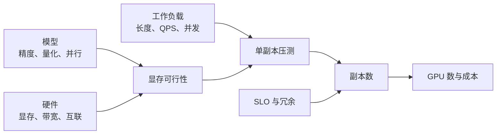

## 📑 目录
- [1. 容量规划在规划什么](#1-容量规划在规划什么)
- [2. 明确输入而不是猜数字](#2-明确输入而不是猜数字)
- [3. 先算单副本能否放下](#3-先算单副本能否放下)
- [4. 再算单副本服务能力](#4-再算单副本服务能力)
- [5. 从峰值反推副本数](#5-从峰值反推副本数)
- [6. 加上可用性与扩容余量](#6-加上可用性与扩容余量)
- [7. 完整数值案例](#7-完整数值案例)
- [8. GPU 配额与成本](#8-gpu-配额与成本)
- [9. 验证、复盘与边界](#9-验证复盘与边界)
- [总结](#-总结)
- [自我检验清单](#-自我检验清单)
- [官方参考](#-官方参考)
---
## 1. 容量规划在规划什么
搬家前要先知道家具尺寸、电梯尺寸、每天要搬多少箱，以及电梯坏一部时怎么办。
模型参数量对应家具，GPU 显存对应电梯空间，流量对应箱子，可用性目标对应故障预案。
容量规划不是预测一个永远正确的 GPU 数字，而是建立“输入变化时结果如何变化”的模型。

最后的计划至少包含：
- 每个副本需要几张什么规格的 GPU
- 在目标 SLO 下，每副本安全吞吐是多少
- 正常峰值、突发和单节点故障分别需要多少副本
- 扩容需要多久，预留容量能撑多久
- 哪些输入是实测，哪些是假设
## 2. 明确输入而不是猜数字
### 2.1 工作负载画像
不要只记录“峰值 QPS”。
至少收集：
- 输入 token 长度 P50/P95/P99
- 输出 token 长度 P50/P95/P99
- 请求到达的时间序列和突发系数
- 流式与非流式比例
- 相同前缀比例与缓存命中机会
- 采样参数、最大上下文和最大输出
- 租户、优先级与超时预算
一个 8k 输入、1k 输出请求，与 100 输入、20 输出请求不能算作同一单位工作。
### 2.2 SLO 和可用性
示例 SLO：
- 成功率不低于 99.9%
- TTFT P95 不高于 800 ms
- TPOT P95 不高于 50 ms
- E2E P99 不高于 10 s
这些只是格式示例。
真实阈值由产品体验、模型用途和预算共同确定。
明确统计窗口、是否排除客户端取消、哪些错误计入成功率。
### 2.3 输入台账
建议将容量表分为三类：
| 字段 | 值 | 来源 |
|---|---:|---|
| 峰值到达率 | 待测 | 生产日志 |
| 长度分布 | 待测 | Token 化后的请求样本 |
| 单副本安全吞吐 | 待测 | 固定版本压测 |
| GPU 单价 | 待询价 | 采购或云账单 |
| 冗余目标 | 待确认 | SRE/业务评审 |
`待测` 比编造一个看似精确的数字更专业。

容量输入还要带统计口径。例如“峰值 8 QPS”至少注明：
- 1 分钟、5 分钟还是 1 小时窗口；
- 单区域还是全球；
- 请求到达还是成功完成；
- 是否包含重试、取消和离线任务；
- 是历史实测、业务预测还是营销活动上限。

窗口越长，越会抹平短突发；窗口越短，对采样误差越敏感。在线服务通常同时保留分钟峰值用于副本容量、秒级 burst 用于队列/限流设计。
## 3. 先算单副本能否放下
### 3.1 权重显存
模型权重的粗略下界：
$$
M_{\text{weights}}
\approx P \times \frac{b}{8}
$$
$P$ 是参数量，$b$ 是每参数位数。
以 7B 模型为例：
- FP16/BF16：$7\times10^9\times2 \approx 14$ GB
- INT8：约 7 GB
- INT4：约 3.5 GB
这是十进制粗算，未包含量化 scale、元数据、对齐、运行时缓冲和框架开销。
实际占用必须加载模型后测量。
### 3.2 KV Cache
对常见多头注意力的粗略估算：
$$
M_{\text{KV/token}}
= 2 \times L \times H_{kv} \times D \times B
$$
其中：
- $2$ 表示 Key 和 Value
- $L$ 是层数
- $H_{kv}$ 是 KV Head 数
- $D$ 是每个 Head 维度
- $B$ 是每元素字节数
假设 $L=32$、$H_{kv}=8$、$D=128$、BF16 为 2 字节：
$$
M_{\text{KV/token}}
=2\times32\times8\times128\times2
=131072\text{ bytes}
\approx128\text{ KiB}
$$
若同时驻留 50,000 token，理论 KV 数据约：
$$
50000\times128\text{ KiB}\approx6.10\text{ GiB}
$$
这个示例仅展示算法。
模型结构、KV 数据类型、块管理和运行时实现都会改变实际值。
### 3.3 显存预算式
可写成：
$$
M_{\text{GPU}}
\ge M_{\text{weights}}
+ M_{\text{KV}}
+ M_{\text{workspace}}
+ M_{\text{runtime}}
+ M_{\text{headroom}}
$$
不要让理论总和刚好等于物理显存。
CUDA Graph、通信缓冲、临时张量和显存碎片都需要空间。
如果单卡放不下，可以依次评估：
1. 降低最大上下文或并发 token
2. 使用经过质量验证的量化
3. 使用更大显存 GPU
4. 采用张量并行
5. 换更小模型或路由到分层模型
张量并行降低单卡权重压力，但增加 GPU 数和通信成本。
### 3.4 主机资源也要算
CPU 内存需容纳进程、Tokenizer、模型加载暂存、共享内存和缓存。
磁盘与网络决定模型分发速度。
容量表中应同时记录：
- Pod CPU request/limit
- Pod 内存 request/limit
- `/dev/shm`
- 本地缓存或 PVC 容量
- 冷启动下载带宽
## 4. 再算单副本服务能力
### 4.1 “最大吞吐”不是“安全吞吐”
压测可能在 120 请求/min 时达到最高吞吐，但 TTFT 已经超过 SLO。
容量规划应使用满足全部 SLO 的最大负载点：
$$
\mu_{\text{safe}}
= \max\{\lambda \mid
\text{TTFT, TPOT, E2E, error rate 均达标}\}
$$
### 4.2 压测矩阵
至少改变以下维度：
- 并发数或到达率
- 输入/输出长度分桶
- 冷缓存与热缓存
- 固定前缀与随机前缀
- 流式与非流式
- 正常采样参数和最大输出
每个测试记录镜像 digest、模型 revision、GPU、引擎参数和时间。
先预热，再测量，保存原始结果而非只抄最终均值。
```bash
vllm bench serve \
  --backend vllm \
  --base-url http://127.0.0.1:8000 \
  --model chat-model \
  --dataset-name random \
  --num-prompts 1000 \
  --request-rate 4
```
**前提**：压测客户端与服务网络稳定，模型名、数据集、Tokenizer、输出上限和请求率模式与当前 vLLM 版本一致；服务已预热且指标正在采集。**危险点**：这是会制造真实推理负载的命令，只能指向隔离压测环境；误指生产会造成排队和成本。随机数据不能代表生产长度或缓存命中。
命令参数以所用 vLLM 版本帮助信息为准：
```bash
vllm bench serve --help
```
**前提**：已安装与服务版本对应的 vLLM CLI。**危险点**：帮助信息本身只读，但不同版本参数和默认值会变化，不能拿新客户端参数推断旧服务行为。

### 4.3 画出单副本压测曲线
容量不是一个“最大 QPS”点，而是一条随着 offered load 变化的曲线。使用开放到达模型逐级增加请求率，每档至少稳定运行足够长时间，记录达成率、队列、TTFT、TPOT、E2E、错误和 token/s。

以下是教学数据，假设单副本使用 2 张 GPU、固定生产长度分布，SLO 为 TTFT P95 ≤ 0.8 s、TPOT P95 ≤ 50 ms、错误率 ≤ 0.1%：

| 提供负载 req/s | 实际完成 req/s | waiting P95 | TTFT P95 | TPOT P95 | 错误率 | 判定 |
|---:|---:|---:|---:|---:|---:|---|
| 0.5 | 0.50 | 0 | 0.28 s | 31 ms | 0% | 通过 |
| 0.9 | 0.90 | 1 | 0.39 s | 33 ms | 0% | 通过 |
| 1.2 | 1.20 | 2 | 0.56 s | 37 ms | 0% | 通过 |
| 1.4 | 1.40 | 4 | 0.74 s | 43 ms | 0.05% | 通过边界 |
| 1.6 | 1.58 | 11 | 1.18 s | 49 ms | 0.2% | TTFT/错误失守 |
| 1.8 | 1.61 | 29 | 2.70 s | 61 ms | 1.4% | 饱和 |

这条曲线的关键不是 1.61 req/s 的最高完成吞吐，而是 1.4 req/s 的最后达标点：
$$
\mu_{\text{SLO}}=1.4\ \text{req/s/replica}
$$
1.4 到 1.6 之间出现“膝点”：吞吐几乎不再增加，队列和 TTFT 快速恶化。生产目标应位于膝点左侧。

压测每档还要验证客户端确实发出了目标速率。若客户端 CPU 或连接数不足，`offered=1.8` 实际只发 1.4，就不能证明服务容量。封闭并发压测会因响应变慢自动降低到达率，适合测并发行为，但容易隐藏过载；容量曲线优先采用开放请求率，并同时设置安全终止条件。

### 4.4 长度归一化
如果业务长度差异大，可分别估计输入和输出 token 需求：
$$
R_{\text{in}} = \lambda \times E[N_{\text{in}}]
$$
$$
R_{\text{out}} = \lambda \times E[N_{\text{out}}]
$$
再与压测得到的 Prefill 和 Decode 能力比较。
不能简单把输入 token/s 与输出 token/s 相加，因为两个阶段的计算模式不同。

### 4.5 用 Little 定律交叉检查并发
假设某压测点实际完成率为 1.2 req/s，平均 E2E 为 5 s：
$$
L=\lambda W=1.2\times5=6
$$
系统内平均约 6 个请求。若引擎报告 running + waiting 长期只有 1，应检查网关等待、网络发送、取消请求或指标定义。

Little 定律不是容量公式，它只在长期稳定、边界定义一致时成立。不要把 P99 延迟代入平均到达率，也不要在队列持续增长的非稳态区间强行使用。
## 5. 从峰值反推副本数
### 5.1 基础公式
设：
- 峰值请求率为 $\lambda_{\text{peak}}$
- 单副本安全服务率为 $\mu_{\text{safe}}$
- 目标运行余量系数为 $u$，例如 0.7
则流量所需副本数：
$$
N_{\text{traffic}}
=\left\lceil
\frac{\lambda_{\text{peak}}}
{\mu_{\text{safe}}\times u}
\right\rceil
$$
### 5.2 完整手算
以下均为教学假设：
- 峰值 8 请求/s
- 单副本在目标长度分布下，SLO 内安全服务率 1.8 请求/s
- 目标利用余量 $u=0.75$
- 每副本使用 2 张 GPU
先算流量副本：
$$
N_{\text{traffic}}
=\left\lceil\frac{8}{1.8\times0.75}\right\rceil
=\lceil5.93\rceil
=6
$$
正常峰值需要 GPU：
$$
G_{\text{normal}} = 6\times2=12
$$
若希望损失一个双卡副本后仍承载峰值，则至少增加一个副本：
$$
N_{\text{N+1}}=6+1=7
$$
对应 14 张 GPU。
如果故障域是一台拥有 8 张 GPU 的节点，“多一个副本”并不等于能容忍整节点故障。
必须按最大故障域重新计算并设置 Pod 反亲和或拓扑分布。
### 5.3 突发缓冲
假设扩容总耗时 4 分钟，突发期间超出当前处理能力 2 请求/s。
积累队列约为：
$$
Q_{\text{burst}}=2\times4\times60=480\text{ requests}
$$
如果请求超时预算只有 10 秒，这个队列显然不可接受。
应增加热副本、提前扩容、限流，或把非交互任务移出高峰。
## 6. 加上可用性与扩容余量
容量的最终结果通常取多个约束的最大值：
$$
N_{\text{final}}
=\max(
N_{\text{traffic}},
N_{\text{HA}},
N_{\text{burst}},
N_{\text{maintenance}}
)
$$
需要讨论：
- 单 Pod 故障
- 单 GPU 或整节点故障
- 一个可用区故障
- 驱动升级和节点维护
- 新版本滚动发布所需 surge
- 节点自动供给失败或配额用尽
`replicas: 2` 只有落在不同故障域，才可能抵御单节点故障。
使用拓扑分布约束时，还要决定资源不足时是宁可 Pending，还是允许同节点部署。

### 6.1 滚动发布也占容量
Deployment 使用 `maxSurge=S` 时，发布期间最大 Pod 数近似为：
$$
N_{\text{rollout,max}}=N_{\text{desired}}+S
$$
若每副本使用 $g$ 张 GPU：
$$
G_{\text{rollout}}=(N_{\text{desired}}+S)\times g
$$
`maxUnavailable: 0` 保持旧副本直到新副本 Ready，但要求真实的额外 GPU。没有 surge GPU 时，新 Pod Pending、旧 Pod 不退出，发布会停滞。把 `maxSurge` 改成 0 能降低瞬时资源，却会先下线旧副本并减少服务能力；这是可用性与容量的明确交换。

HPA 与发布同时发生时，以当时的 desired replicas 计算 surge，而不是日常 `minReplicas`。容量评审要覆盖“峰值流量 + HPA 已扩到上限 + 发布”的组合，或规定高峰冻结发布。

### 6.2 把配额作为硬约束
至少检查四层上限：
1. Pod 的 GPU request；
2. namespace `ResourceQuota`；
3. GPU 节点池可分配设备；
4. 云账号/区域 GPU quota 与库存。

它们的最小值才是实际可用上限。可写成：
$$
G_{\text{usable}}
=\min(
G_{\text{namespace-quota}},
G_{\text{nodepool}},
G_{\text{cloud-quota}},
G_{\text{inventory}}
)-G_{\text{other-reserved}}
$$
预算允许 32 张 GPU，不代表云区域有库存；Node 显示 32 张，也不代表 namespace quota 允许申请。

## 7. 完整数值案例
下面从压测曲线一直算到 GPU quota。所有数字都是教学假设，用于展示推导顺序。

### 7.1 已知条件
模型与副本：
- 每副本张量并行 TP=2，即 $g=2$ 张 GPU；
- 单副本权重、KV Cache、workspace 实测可放下；
- 第 4.3 节曲线给出 $\mu_{\text{SLO}}=1.4$ req/s；
- 为吸收长度和到达抖动，运营负载系数 $u=0.75$。

流量与 SLO：
- 未来季度 1 分钟峰值 $\lambda_{\text{peak}}=8.4$ req/s；
- 秒级活动突发最高 11 req/s，持续 90 s；
- 峰值平均 E2E 估计 7.5 s；
- 要容忍单 Pod 和单 GPU 节点故障；
- 不在本案例内承诺整个可用区故障。

平台条件：
- 每台节点有 8 张 GPU；
- 计划 4 台 GPU 节点，共 32 张物理 GPU；
- Deployment `maxSurge: 1`、`maxUnavailable: 0`；
- HPA 计划 `minReplicas=12`、`maxReplicas=14`；
- namespace GPU quota 拟设 30，云区域 quota 为 32；
- 同 namespace 其他保留工作负载占 0 张 GPU。

### 7.2 从单副本曲线得到运营能力
虽然 1.4 req/s 仍满足 SLO，日常按 75% 使用：
$$
\mu_{\text{operational}}
=1.4\times0.75
=1.05\ \text{req/s/replica}
$$
这 25% 不是“凭感觉浪费”，而是为长度漂移、硬件波动、缓存变化和测量误差留余量。若已有严格的 P99 置信区间和独立冗余，也可以重新评审 $u$，但不能默默删掉。

### 7.3 峰值流量副本
$$
N_{\text{traffic}}
=\left\lceil
\frac{8.4}{1.05}
\right\rceil
=8
$$
仅承载预测峰值需要 8 个副本、16 张 GPU。

用 Little 定律检查系统内并发：
$$
L_{\text{peak}}
=8.4\times7.5
=63\ \text{requests}
$$
平均每副本约 $63/8=7.875$ 个系统内请求。压测必须证明 8 个副本在相同长度分布下能承受该 running + waiting 数量，且不是只满足吞吐而违反 TTFT。

### 7.4 加入节点故障
若只部署 8 副本并平均放在两台 8-GPU 节点上，每节点可放 4 副本；损失一台节点会直接失去 4 副本，只剩 4，显然不足。

本方案使用 4 台节点，并把 12 个副本尽量均匀为每节点 3 个。单节点故障瞬间剩：
$$
N_{\text{after-node-failure}}=12-3=9
$$
而峰值需求是 8，所以仍有：
$$
9\times1.05=9.45\ \text{req/s}
$$
可覆盖 8.4 req/s 峰值。选择：
$$
N_{\text{desired}}=12,\qquad
G_{\text{normal}}=12\times2=24
$$
这里的 12 同时提供节点故障冗余和更低日常利用率。拓扑调度必须限制每节点最多约 3 个副本；如果调度器把 4 个副本放到同一节点，故障假设就被破坏。

### 7.5 检查 90 秒突发
正常 12 副本运营能力：
$$
12\times1.05=12.6\ \text{req/s}
$$
高于 11 req/s，理论上无需等待 HPA 扩容。若突发恰逢单节点故障，9 个剩余副本只能提供 9.45 req/s，90 秒积压近似：
$$
Q_{\text{burst,failure}}
=(11-9.45)\times90
\approx140\ \text{requests}
$$
若等待预算 10 秒，这个队列不可接受。因此“节点故障 + 活动突发”不在当前全量 SLO 保证内，必须选择一种策略：
- 再增加热副本；
- 活动前临时扩容；
- 为低优先级请求返回 429/降级；
- 跨区域溢出；
- 明确把该联合事件列为降级目标。

容量文档必须写清不保证什么，不能用正常场景余量暗示所有复合故障都可承受。

### 7.6 加入发布 surge
发布期间最大副本：
$$
N_{\text{rollout,max}}=12+1=13
$$
GPU 瞬时需求：
$$
G_{\text{rollout}}=13\times2=26
$$
四台节点共 32 张 GPU，正常部署用 24 张，物理上能容纳 1 个 surge 副本。namespace quota 30 覆盖日常发布的 26 张需求，但 quota 还必须校验 HPA 上限。

还不能就此把 quota 定成 26。HPA 若已扩到 `maxReplicas=14` 时发起滚动发布，瞬时上限是：
$$
G_{\text{quota-required}}
=(14+1)\times2
=30
$$
因此 namespace GPU quota 应至少为 30，而不是只按日常 12 副本计算。四节点和区域各有 32 张上限，仍可容纳该组合；剩余 2 张 GPU 不能承载另一个双卡副本，只是碎片/应急余量。

但是节点故障时只剩 24 张物理 GPU，现有 9 个副本占 18 张；控制器重建 3 个丢失副本后占满 24 张，无法再容纳 2-GPU surge。结论是：**节点故障恢复期间冻结滚动发布**。如果业务要求故障中仍可发布，需要第 5 台节点或降低每节点故障损失，并重新计算配额。

### 7.7 最终容量合同
本案例最终记录：
- Deployment 正常目标：12 副本；
- HPA：`minReplicas=12`，`maxReplicas=14`；
- 每副本：2 GPU，因此正常 24 GPU；
- 日常 12 副本发布：13 副本、26 GPU；
- HPA 上限 14 副本发布：15 副本、30 GPU；
- namespace quota：30 GPU；
- 节点池：4 × 8 = 32 GPU；
- 云区域 quota：32 GPU；
- 单节点故障后：9 个热副本，覆盖 8.4 req/s 峰值；
- 单节点故障叠加 11 req/s 活动突发：进入限流/降级；
- 故障恢复期间：冻结发布；
- 可用区故障：不在本容量合同范围。

这比“需要 24 张 GPU”更完整，因为它说明了副本、放置、surge、配额和不保证场景。

## 8. GPU 配额与成本
### 8.1 成本公式
按小时粗算：
$$
C_{\text{hour}}
= G\times C_{\text{gpu}}
+ N\times C_{\text{cpu/mem}}
+ C_{\text{storage}}
+ C_{\text{network}}
+ C_{\text{observability}}
$$
GPU 往往是主项，但不是唯一成本。
公网输出、跨区流量、模型存储和指标保留也可能显著。
### 8.2 示例而非报价
假设 14 张 GPU，每张每小时内部核算价为 10 个“成本单位”：
$$
C_{\text{GPU/day}}=14\times10\times24=3360
$$
这里刻意使用“成本单位”，因为真实价格随供应商、地区、合约和时间变化。
请用采购报价或实际账单替换。
### 8.3 敏感性表
比单点数字更有用的是场景分析：
| 场景 | 峰值 QPS | 单副本安全 QPS | 余量 | 副本数 |
|---|---:|---:|---:|---:|
| 假设 A | 6 | 1.8 | 75% | 5 |
| 假设 B | 8 | 1.8 | 75% | 6 |
| 假设 C | 8 | 1.4 | 70% | 9 |
全部标注“假设”，避免读者把它们误认为实测结论。
敏感性分析能说明最值得优化的是流量峰值、单副本能力，还是冗余策略。
## 9. 验证、复盘与边界
### 9.1 上线前容量演练
1. 用脱敏且代表真实分布的数据压测
2. 逐级提高到达率，找到首个 SLO 失守点
3. 验证队列告警早于用户 SLO 告警
4. 删除一个 Pod，确认 N+1 假设
5. 执行一次扩容并测量完整耗时
6. 做滚动发布，确认 GPU surge 资源
7. 保存命令、原始数据与图表
### 9.2 每次变化都重算
以下变化会使旧容量结论失效：
- 模型或量化格式变化
- vLLM、CUDA、驱动或内核版本变化
- 最大上下文和输出上限变化
- 请求长度与缓存命中率变化
- GPU 型号、并行度或路由策略变化
- SLO、可用性或价格变化
### 9.3 边界
- 公式提供一阶估算，不替代压力测试
- 平均服务率不能保证尾延迟
- 合成数据不能证明生产流量表现
- 理论显存估算不能替代实际加载
- 云端 GPU 配额可能比预算更早成为瓶颈
- 节点扩容速度可能远慢于 Pod 扩容
- 极端故障与灾备需要独立业务连续性设计
## 📝 总结
容量规划的顺序是：先确认单副本放得下，再测满足 SLO 的安全吞吐，最后叠加峰值、故障、突发、发布和维护余量。
所有公式都依赖输入质量。
将假设、实测和来源分开记录，才能让容量数字可复查、可更新、可用于预算决策。
## ✅ 自我检验清单
- [ ] 我有输入/输出长度分布，而不只有 QPS
- [ ] 我能手算权重与 KV Cache 的数量级
- [ ] 我为运行时缓冲与显存碎片保留余量
- [ ] 单副本安全吞吐满足 TTFT、TPOT、E2E 和错误率目标
- [ ] 压测数据与生产请求分布、版本和参数一致
- [ ] 我按最大故障域而不是只按单 Pod 做冗余
- [ ] 我测过扩容总耗时与突发期间的队列增长
- [ ] 成本使用真实报价，并包含网络、存储和可观测性
- [ ] 结果表明确区分假设、待测与实测
## 📚 官方参考
- [vLLM：Benchmark CLI](https://docs.vllm.ai/en/latest/cli/bench/serve.html)
- [vLLM：GPU Memory Utilization](https://docs.vllm.ai/en/latest/configuration/engine_args.html)
- [Kubernetes：资源管理](https://kubernetes.io/docs/concepts/configuration/manage-resources-containers/)
- [Kubernetes：拓扑分布约束](https://kubernetes.io/docs/concepts/scheduling-eviction/topology-spread-constraints/)
- [Kubernetes：节点自动伸缩](https://kubernetes.io/docs/concepts/cluster-administration/node-autoscaling/)
- [NVIDIA：DCGM Documentation](https://docs.nvidia.com/datacenter/dcgm/latest/)
- [Google SRE Book：Handling Overload](https://sre.google/sre-book/handling-overload/)
