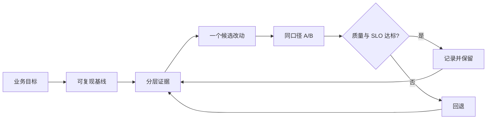
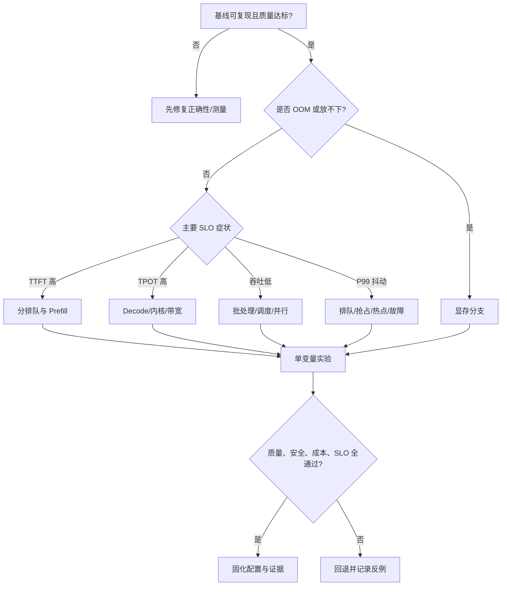
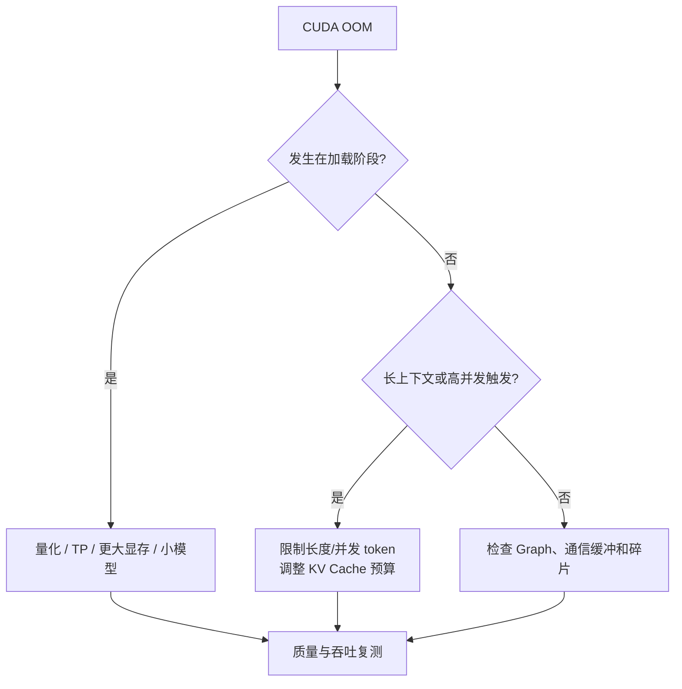
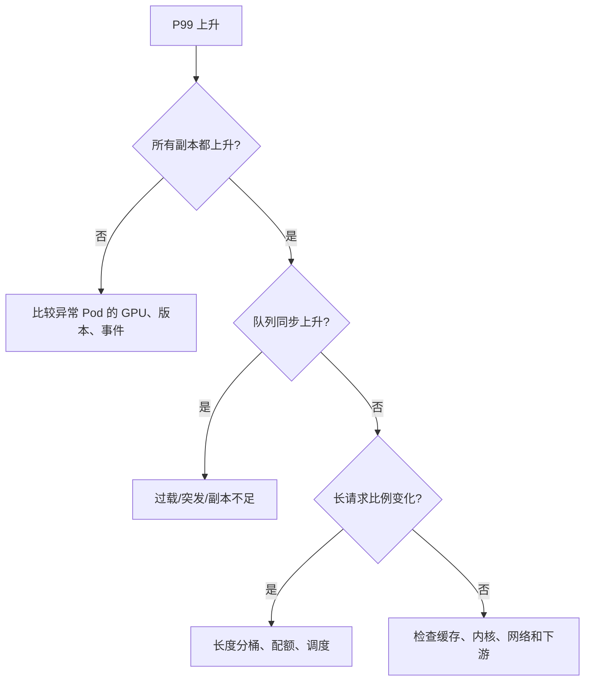

## 📑 目录
- [1. 决策树不是参数速查表](#1-决策树不是参数速查表)
- [2. 进入决策树前的四张卡](#2-进入决策树前的四张卡)
- [3. 总决策树](#3-总决策树)
- [4. OOM 与显存分支](#4-oom-与显存分支)
- [5. TTFT 分支](#5-ttft-分支)
- [6. TPOT 与吞吐分支](#6-tpot-与吞吐分支)
- [7. 尾延迟与稳定性分支](#7-尾延迟与稳定性分支)
- [8. 可执行实验循环](#8-可执行实验循环)
- [9. 边界与停止条件](#9-边界与停止条件)
- [总结](#-总结)
- [自我检验清单](#-自我检验清单)
- [官方参考](#-官方参考)
---
## 1. 决策树不是参数速查表
推理优化像看病，不是看到“发烧”就永远开同一种药。
TTFT 高可能来自长输入、排队、冷缓存、CPU Tokenize、网络或 Prefill 内核。
如果没有证据就调参数，偶然变快也无法解释，更无法在下次版本升级时复现。
本节的原则是：
> 先固定正确性和测量口径，再定位主导瓶颈；一次改变一个主要变量，用原始数据决定保留或回退。

决策树给的是“下一步最值得验证什么”，不是保证收益的处方。
## 2. 进入决策树前的四张卡
### 2.1 正确性卡
任何性能优化都必须先通过：
- 模型版本与 Chat Template 固定
- 代表性样本的输出质量达标
- 停止条件、最大输出和采样参数一致
- 流式与非流式语义符合 API 契约
- 错误率、截断率和空输出没有恶化
量化或投机解码若改变了业务质量，不能只凭吞吐提升宣称成功。
### 2.2 工作负载卡
记录：
- 输入/输出 token 长度分布
- 到达率、并发与突发
- 相同前缀比例
- 模型、精度、并行度和硬件
- 在线交互或离线批处理
没有工作负载画像，“快 20%”没有可迁移意义。
### 2.3 SLO 卡
至少写明：
- TTFT P95/P99
- TPOT P95/P99
- 端到端延迟
- 成功率和超时
- 单位成本或 GPU 上限
吞吐最大化与交互延迟最小化经常冲突。
必须先决定哪个目标优先。
### 2.4 基线卡
```yaml
experiment_id: exp-YYYYMMDD-001
model_revision: "<commit-or-version>"
image_digest: "sha256:<digest>"
hardware: "<gpu-model-and-count>"
engine_args: ["<exact-arg-list>"]
dataset: "<name-or-snapshot-id>"
traffic:
  request_rate: "<measured-or-configured>"
  input_tokens: {p50: null, p95: null, p99: null}
  output_tokens: {p50: null, p95: null, p99: null}
slo:
  ttft_p95_ms: "<target>"
  tpot_p95_ms: "<target>"
  error_rate: "<target>"
```
`null` 表示尚未测量，禁止用估计值冒充实测。
## 3. 总决策树

执行顺序建议是：
1. 正确性与安全
2. OOM 和无法启动
3. 用户主 SLO
4. 稳态吞吐
5. 尾延迟
6. 单位成本
这不是说尾延迟不重要，而是 OOM 时服务根本不存在。
如果业务 SLO 把 P99 放在首位，就应把它提升为主目标。
## 4. OOM 与显存分支
### 4.1 先识别 OOM 在哪里
- 容器主机内存 OOM
- CUDA OOM
- 模型加载阶段 OOM
- 长请求或高并发下 KV Cache OOM
- 通信或 CUDA Graph 捕获阶段 OOM
主机内存和显存不是同一种资源。
先查看事件、容器退出原因和引擎日志，再决定动作。
```bash
kubectl describe pod <pod-name>
kubectl logs <pod-name> --previous
kubectl get pod <pod-name> \
  -o jsonpath='{.status.containerStatuses[*].lastState}'
```
### 4.2 显存手算
粗略预算：
$$
M_{\text{total}}
= M_{\text{weights}}
+ M_{\text{KV}}
+ M_{\text{runtime}}
+ M_{\text{headroom}}
$$
例如 14 GB 权重、8 GB KV、3 GB 运行时、3 GB 余量，共约 28 GB。
这些数字必须替换为实际模型测量。
### 4.3 决策顺序

候选动作与代价：
| 动作 | 主要收益 | 主要代价 |
|---|---|---|
| 降低最大上下文 | 减少最坏 KV 压力 | 长请求被拒绝或截断 |
| 降低并发 token | 减少峰值显存 | 吞吐可能下降 |
| 权重量化 | 权重更小、可能更快 | 质量与内核兼容风险 |
| KV Cache 低精度 | 增加可驻留 token | 质量与硬件支持需验证 |
| 张量并行 | 分摊权重 | 多卡成本与通信开销 |
| 更小模型 | 大幅降低资源 | 能力可能下降 |
不要先把 `gpu-memory-utilization` 拉到极限。
没有余量时，一次上下文尖峰或运行时缓冲就可能导致 OOM。
## 5. TTFT 分支
TTFT 近似为：
$$
T_{\text{TTFT}}
\approx T_{\text{queue}}
+ T_{\text{tokenize}}
+ T_{\text{prefill}}
+ T_{\text{network}}
$$
### 5.1 先看是否排队
若 waiting 请求、排队时间和 TTFT 同时上升：
- 扩容或增加热副本
- 限流并设置有界队列
- 调整批处理预算，避免大 Prefill 长时间占用
- 按优先级或输入长度分流
- 检查某个前缀或租户是否形成热点
这时换 Attention Kernel 可能不是最有效动作。
### 5.2 不排队时看输入
若队列稳定但 TTFT 随输入长度明显上升，Prefill 是首要嫌疑。
可验证：
- Chunked Prefill
- Prefix Caching
- 更高效 Attention/GEMM 内核
- Prompt 压缩或固定前缀复用
- Prefill/Decode 解耦
Prefix Cache 只对重复前缀有帮助。
随机输入压测看不到收益，全部相同前缀又会夸大收益。
### 5.3 冷启动与首次请求
若只有发布后的前几次请求慢：
- 检查模型加载和内核编译
- 在 readiness 之前完成最小预热
- 区分冷缓存与热缓存测试
- 不把首次请求混入稳态分位数却不做标记
预热请求不得携带真实用户敏感内容。
## 6. TPOT 与吞吐分支
### 6.1 TPOT 高
TPOT 主要反映 Decode 阶段逐 token 生成速度。
先确认：
- GPU 是否因温度或功耗降频
- 并行通信是否成为瓶颈
- 批大小是否过小
- KV Cache 访问和 Attention 内核是否适配
- 量化内核是否真的支持目标硬件
候选动作：
- 使用受支持的 FlashAttention 或优化 Attention 后端
- 调整 Continuous Batching 参数
- 验证权重或 KV Cache 量化
- 验证投机解码
- 优化张量并行规模与互联拓扑
投机解码收益取决于草稿接受率和验证开销。
不能因为理论上少跑主模型步骤，就假定 TPOT 一定下降。
### 6.2 吞吐低但延迟尚可
若 GPU 空闲且无队列：
- 压测到达率可能不够
- 客户端并发或连接池可能成为瓶颈
- Tokenize/Detokenize 可能受 CPU 限制
- 请求过短，调度开销占比高
若 GPU 忙且队列增长：
- 调整最大序列数和批 token 预算
- 增加副本
- 检查请求长度离群值
- 评估量化、更快硬件或并行策略
### 6.3 一个收益门槛
假设基线安全吞吐为 1000 output token/s，候选为 1120。
吞吐提升：
$$
\Delta=\frac{1120-1000}{1000}=12\%
$$
只有当重复实验置信区间、质量、P99 与错误率都达标，12% 才是可接受结论。
若数据来自单次短跑，应写“观察到 12%，尚未确认稳定收益”。
## 7. 尾延迟与稳定性分支
平均值正常但 P99 失控，优先检查：
- 到达流量微突发
- 超长输入/输出请求
- KV Cache 抢占和重计算
- 前缀路由热点
- 个别 GPU 降频或错误
- Pod 发布、重启和模型冷启动
- 客户端重试放大

可选方案包括：
- 对交互与离线请求分优先级
- 对输入/输出长度设置业务上限
- 用 SLO 感知调度减少大请求阻塞
- P/D 解耦隔离 Prefill 抖动
- 增加最小副本和故障域冗余
P/D 解耦增加网络、运维和容量匹配复杂度。
只有证据显示阶段干扰是主因时才值得引入。
## 8. 可执行实验循环
### 8.1 一次只验证一个主假设
```yaml
hypothesis: "等待队列是 TTFT P95 超标的主因"
evidence_before:
  waiting_requests: "<measured>"
  queue_p95_ms: "<measured>"
  ttft_p95_ms: "<measured>"
change:
  variable: "replicas"
  baseline: 2
  candidate: 3
fixed:
  - model_revision
  - image_digest
  - dataset_snapshot
  - request_rate
  - sampling_params
acceptance:
  quality: "no regression on approved suite"
  ttft_p95_ms: "<= target"
  error_rate: "<= target"
result: null
raw_artifacts: []
```
### 8.2 运行骨架
```bash
mkdir -p "artifacts/${EXPERIMENT_ID}"
vllm bench serve \
  --base-url "${BASE_URL}" \
  --model "${MODEL_NAME}" \
  --dataset-name random \
  --num-prompts "${NUM_PROMPTS}" \
  --request-rate "${REQUEST_RATE}" \
  | tee "artifacts/${EXPERIMENT_ID}/benchmark.log"
kubectl get deployment chat-model -o yaml \
  > "artifacts/${EXPERIMENT_ID}/deployment.yaml"
```
测试参数必须通过环境变量或实验清单固定。
原始日志、聚合脚本和最终结论应一起保存。
### 8.3 判定模板
- 假设：一句可被证伪的话
- 基线：至少多次重复
- 候选：只改变一个主要变量
- 正确性门：先判断输出质量
- 性能门：再判断 SLO 与吞吐
- 成本门：最后计算单位成本
- 结论：保留、回退或证据不足
“证据不足”是有效结论。
它比补一个漂亮数字更能保护后续决策。
## 9. 边界与停止条件
停止继续调优的条件：
- 已满足 SLO、容量和成本目标
- 预期收益低于验证与维护成本
- 质量、安全或稳定性风险不可接受
- 当前瓶颈在外部依赖而非推理引擎
- 缺少代表性数据，继续实验只会优化错误目标
决策树的边界：
- 不同引擎和版本的参数名会变化
- 合成数据不能代表全部生产流量
- 单一 GPU 结果不能外推到异构集群
- 平均提升不能证明 P99 提升
- 同一优化在不同模型结构上可能方向相反
## 📝 总结
可执行决策树从四张卡开始：正确性、工作负载、SLO 和基线。
之后按 OOM、TTFT、TPOT、吞吐与尾延迟选择最小候选动作，并通过控制变量实验决定保留或回退。
优化的终点不是参数最多，而是在可解释证据下满足目标。
## ✅ 自我检验清单
- [ ] 我的性能实验先通过正确性门
- [ ] 我记录了真实长度分布与到达模式
- [ ] 我能把 TTFT 拆成排队、Prefill 和网络
- [ ] OOM 分支区分主机内存与 GPU 显存
- [ ] 我不会把 Prefix Cache 用于完全随机前缀后宣称无效
- [ ] 每次实验只有一个主要变量
- [ ] 原始数据、版本、命令和参数可追溯
- [ ] 未测字段写 `null` 或“待测”
- [ ] 我知道何时停止调优
## 📚 官方参考
- [vLLM：Benchmark CLI](https://docs.vllm.ai/en/latest/cli/bench.html)
- [vLLM：Engine Arguments](https://docs.vllm.ai/en/latest/configuration/engine_args.html)
- [vLLM：Automatic Prefix Caching](https://docs.vllm.ai/en/latest/design/prefix_caching.html)
- [vLLM：Speculative Decoding](https://docs.vllm.ai/en/latest/features/spec_decode.html)
- [vLLM：Optimization and Tuning](https://docs.vllm.ai/en/latest/configuration/optimization.html)
- [Kubernetes：Resource Management](https://kubernetes.io/docs/concepts/configuration/manage-resources-containers/)
- [MLCommons Inference](https://mlcommons.org/benchmarks/inference-datacenter/)
