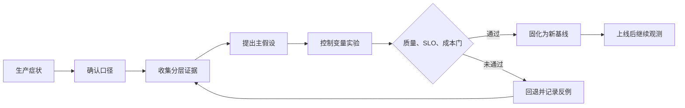
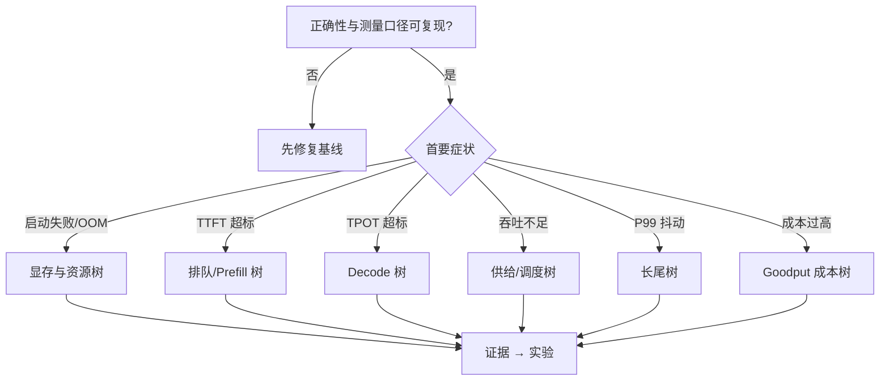
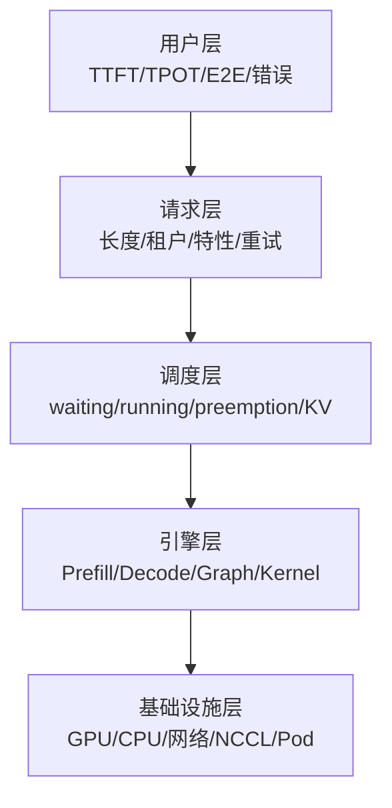
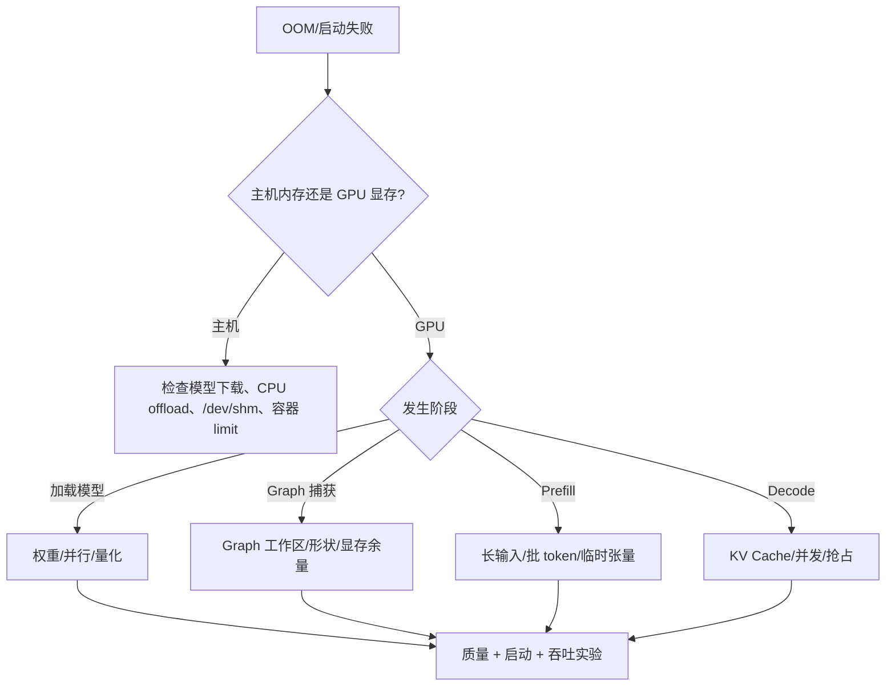
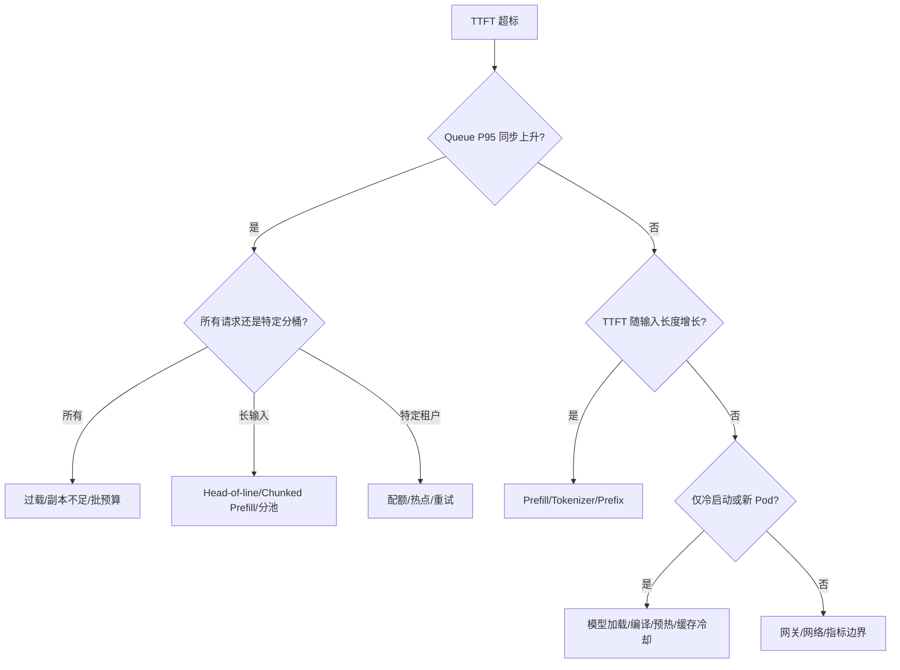
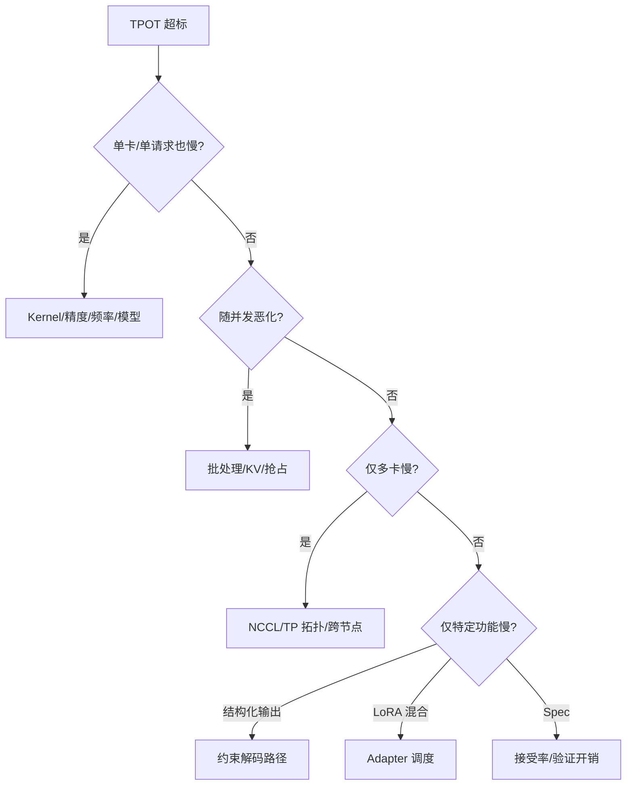
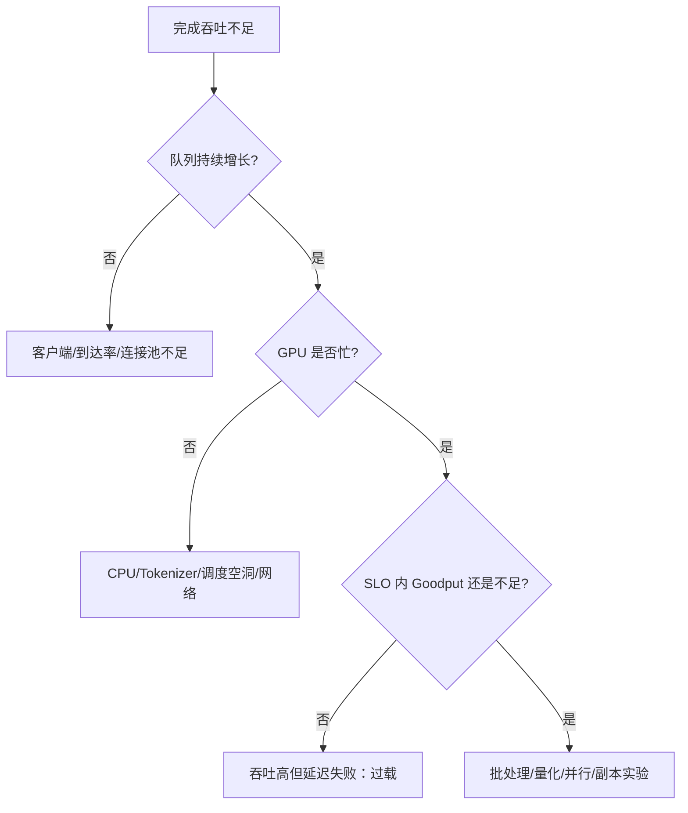
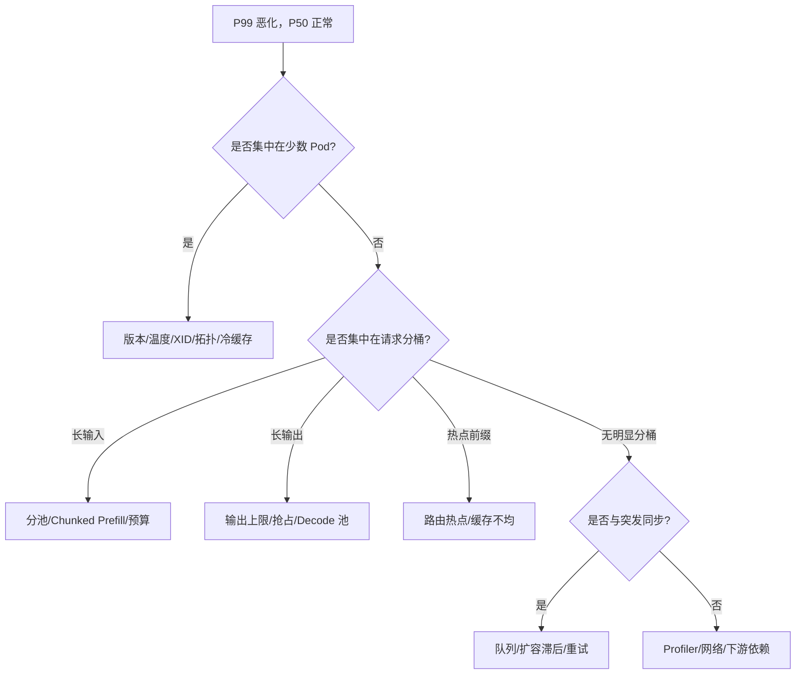
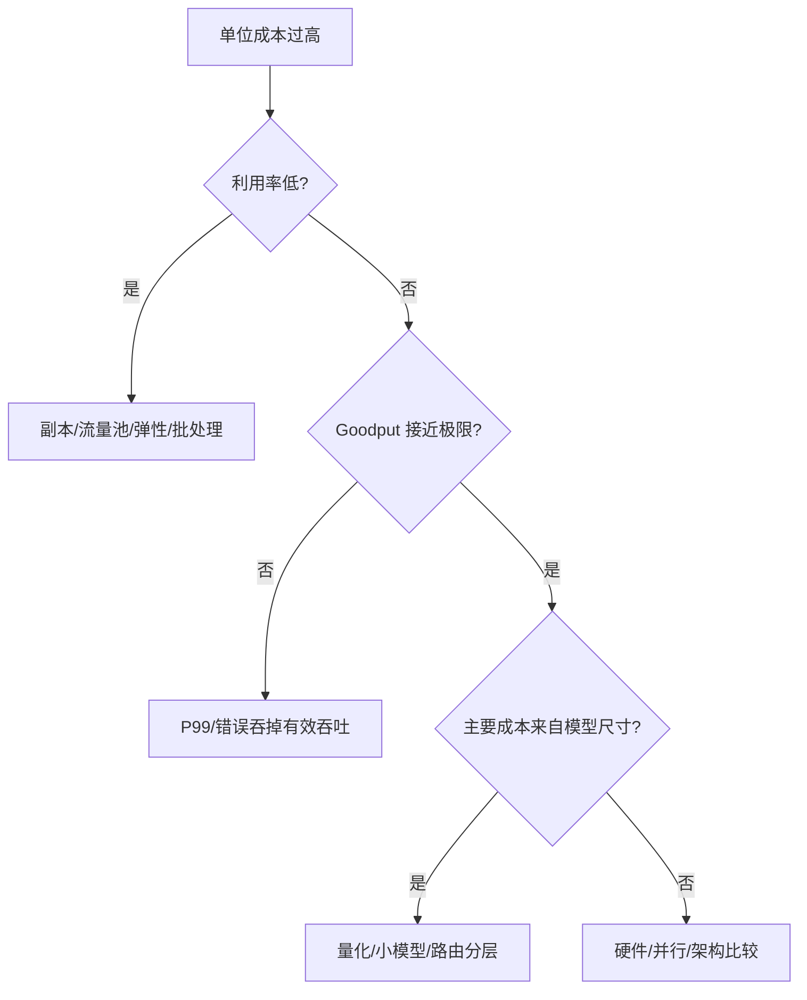

## 📑 目录

- [1. 这棵树解决什么问题](#1-这棵树解决什么问题)
- [2. 决策前先封住三个漏洞](#2-决策前先封住三个漏洞)
- [3. 第一层：从业务症状进入](#3-第一层从业务症状进入)
- [4. 第二层：建立分层证据链](#4-第二层建立分层证据链)
- [5. OOM：先问哪一块显存不够](#5-oom先问哪一块显存不够)
- [6. TTFT：先分排队与计算](#6-ttft先分排队与计算)
- [7. TPOT：先分计算、带宽与通信](#7-tpot先分计算带宽与通信)
- [8. 吞吐：先确认谁没有被喂饱](#8-吞吐先确认谁没有被喂饱)
- [9. P99：沿异常请求与异常副本追踪](#9-p99沿异常请求与异常副本追踪)
- [10. 成本：不能脱离 SLO 单独优化](#10-成本不能脱离-slo-单独优化)
- [11. 案例一：7B 客服 TTFT 突然超标](#11-案例一7b-客服-ttft-突然超标)
- [12. 案例二：70B 服务加卡却没有变快](#12-案例二70b-服务加卡却没有变快)
- [13. 案例三：缓存命中上升但 P99 恶化](#13-案例三缓存命中上升但-p99-恶化)
- [14. 把叶子节点变成可执行实验](#14-把叶子节点变成可执行实验)
- [15. 何时停止继续优化](#15-何时停止继续优化)
- [总结](#-总结)
- [自我检验清单](#-自我检验清单)
- [官方参考](#-官方参考)

---

## 1. 这棵树解决什么问题

前十章已经分别回答了很多“局部问题”：

- 第 1 章解释 Prefill、Decode、KV Cache 与延迟从何而来；
- 第 2 章解释 PagedAttention、Continuous Batching、Prefix Cache 与调度；
- 第 3 章把这些概念落到 vLLM 的请求流、Scheduler、Worker 与参数；
- 第 4～7 章分别给出量化、投机解码、分布式推理与 P/D 解耦；
- 第 8 章把结构化输出、Tool Calling、Multi-LoRA 与 VLM 纳入服务约束；
- 第 9 章建立指标、压测、Profiler 与性能回归的方法；
- 第 10 章把容器、Kubernetes、可观测性、扩缩容和容量规划接到生产。

本节不再重复这些原理。

它要解决的是值班台前更常见的问题：

> 用户只告诉你“变慢了”“放不下”“成本太高”，你如何从症状走到证据，再走到一个可证伪的实验？

决策树不是参数速查表。

同一个 TTFT P95 超标，可能来自：

- 网关重试；
- 请求排队；
- Tokenizer CPU 饱和；
- 长输入 Prefill；
- Prefix Cache 冷却；
- GPU 降频；
- 发布中的冷副本；
- P/D 架构中的 KV 传输。

如果直接把 `max_num_batched_tokens` 调大，偶然变快也无法解释。

本节统一使用三段式：

```text
症状（用户看见什么）
  → 证据（哪一层发生了什么）
    → 实验（只改变什么来证伪）
```

完整闭环是：



这里的叶子节点不是“开启某功能”，而是“运行某个实验”。

## 2. 决策前先封住三个漏洞

### 2.1 漏洞一：正确性尚未固定

性能对比之前必须固定：

- 模型 revision；
- Tokenizer revision；
- Chat Template；
- Sampling 参数；
- 最大输入与最大输出；
- Stop 条件；
- Structured Output Schema；
- Tool Choice 与 Reasoning Parser；
- LoRA Adapter；
- 多模态预处理版本。

第 8 章中的生产特性会改变请求成本。

例如 JSON Schema 约束可能改变 Decode 路径。

如果基线关闭结构化输出、候选开启结构化输出，TPOT 差异不能归因于引擎参数。

正确性门至少覆盖：

- 业务任务集；
- Schema 合法率；
- Tool Calling 参数正确率；
- 截断率；
- 空输出率；
- 拒答与安全策略；
- 流式响应语义。

质量未通过时，性能数字没有上线意义。

### 2.2 漏洞二：工作负载被平均值掩盖

只记录平均输入长度会隐藏长尾。

工作负载卡应包含：

```yaml
workload:
  snapshot: "<immutable-id>"
  source_type: "anonymized-production | synthetic"
  tokenizer_revision: "<revision>"
  arrival:
    pattern: "poisson | trace-replay | closed-loop"
    rps_p50: null
    rps_p95: null
    burst_window_seconds: null
  input_tokens:
    p50: null
    p95: null
    p99: null
  output_tokens:
    p50: null
    p95: null
    p99: null
  prefix:
    reusable_ratio: null
    security_domain_count: null
  features:
    streaming_ratio: null
    structured_output_ratio: null
    tool_call_ratio: null
    lora_mix: {}
```

所有 `null` 都表示未测。

没有生产 Trace 时，可以使用合成负载验证流程。

但必须写“合成工作负载”，不能把结果称为生产容量。

### 2.3 漏洞三：SLO 与成本目标互相打架

先写优先级：

```yaml
gates:
  quality: "<hard gate>"
  availability: "<hard gate>"
  ttft_p95_ms: "<hard gate>"
  tpot_p95_ms: "<hard gate>"
  e2e_p99_ms: "<hard gate>"
objective:
  maximize: "goodput"
  secondary: "cost_per_1m_output_tokens"
```

Goodput 是在 SLO 内完成的有效工作量。

峰值吞吐高但大量请求超时，不是更好的方案。

对于离线任务，优先级可以反过来：

- 截止时间是硬门；
- 吞吐与成本是主目标；
- TTFT 不再是核心目标。

决策树必须由业务目标选择入口。

## 3. 第一层：从业务症状进入

### 3.1 总入口



不要一次选择多个首要症状。

可以同时记录所有指标，但第一次实验只能回答一个主要问题。

推荐优先顺序：

1. 正确性与安全；
2. 服务是否能启动；
3. 用户主 SLO；
4. 错误率与稳定性；
5. Goodput；
6. 单位成本。

若业务合同明确把 P99 放在第一位，则 P99 就是主入口。

### 3.2 把模糊语言改写为可测症状

“服务很慢”不可执行。

可执行的改写是：

> 在工作负载快照 W、版本 V、到达率 R 下，TTFT P95 超过目标；TPOT P95 仍在目标内。

“GPU 不够用”不可执行。

可执行的改写是：

> 70B BF16 在 TP=4 时模型加载阶段 CUDA OOM，Pod 尚未 Ready。

“吞吐上不去”不可执行。

可执行的改写是：

> 到达率继续增加时，完成率停滞、waiting 队列单调增长，GPU 利用率稳定在某区间。

清晰症状已经排除了一部分错误分支。

## 4. 第二层：建立分层证据链

### 4.1 五层证据

从外到内收集：



用户层回答“影响是什么”。

请求层回答“哪些请求受影响”。

调度层回答“工作如何排队与被抢占”。

引擎层回答“时间花在哪个阶段”。

基础设施层回答“硬件与部署是否限制引擎”。

只看 GPU 利用率会跳过前三层。

### 4.2 相关性不是因果

看到 TTFT 与 GPU 利用率同时上升，只能提出假设。

还要检查：

- waiting 队列是否先上升；
- 输入长度是否变化；
- 是否集中在某版本或 Pod；
- 是否出现重试放大；
- 是否与扩缩容或发布时间重合；
- 稳态复现时能否控制到达率。

因果要靠对照实验进一步验证。

### 4.3 最小证据包

实验记录统一使用 [11.4 的权威实验模板](./11.4-模块总结与持续学习.md#93-实验模板)，本节不再定义另一份 schema。诊断场景只需在该模板的 `results.raw_artifacts` 中追加：时间窗口与时区、发布 revision、用户/请求/调度/GPU 指标、引擎日志、Kubernetes Event、已知混杂因素；需要 Trace 时再加入 profiler 产物。

Profiler 不必每次先开。

先用低开销指标缩小范围，再针对候选分支采集 Trace。

## 5. OOM：先问哪一块显存不够

### 5.1 OOM 决策树



先用第 1、2 章的显存模型列账：

$$
M_{\text{total}}
=M_{\text{weights}}
+M_{\text{KV}}
+M_{\text{runtime}}
+M_{\text{graph}}
+M_{\text{headroom}}
$$

### 5.2 加载阶段 OOM

证据：

- OOM 出现在权重加载或模型初始化；
- 尚无请求进入；
- KV Cache 尚未成为主要增长项；
- 调低并发预算仍无法启动。

候选实验按侵入性排序：

1. 核对是否误用了更高精度或错误模型；
2. 在相同卡数上验证受支持的权重量化；
3. 增加 TP，检查模型层可切分性与拓扑；
4. 选择更大显存硬件；
5. 重新评估模型尺寸。

量化实验必须调用第 4 章的质量门。

TP 实验必须调用第 6 章的 NCCL 与拓扑检查。

不能只以“终于放得下”作为成功。

### 5.3 运行时 KV OOM

证据：

- 低并发能稳定运行；
- 并发或上下文长度上升后 OOM；
- KV Cache 使用率接近安全边界；
- 抢占、重计算或拒绝先于 OOM 增加。

候选实验：

- 限制最大上下文；
- 限制同时驻留 token；
- 调低批 token 预算；
- 验证 KV Cache 量化；
- 增加副本分摊并发；
- 对长请求分池；
- 在有证据时评估 P/D 解耦。

控制变量：

- 输入/输出长度分桶固定；
- 到达 Trace 固定；
- 权重格式固定；
- Graph 配置固定；
- 每次只改一个容量旋钮。

### 5.4 Graph 捕获 OOM

证据：

- Eager 模式可运行；
- 启用 Graph 或捕获某批形状时 OOM；
- OOM 与请求总量关系弱；
- 日志指向捕获或工作区分配。

实验：

1. 保持模型、批预算与流量不变；
2. 仅切换 Eager/Graph；
3. 记录峰值显存、TTFT、TPOT 与吞吐；
4. 若 Graph 收益不足以覆盖余量风险，则回退；
5. 若保留，重新计算 KV 容量和 Headroom。

这条分支把第 3 章的引擎执行模式接到第 10 章的生产余量。

## 6. TTFT：先分排队与计算

### 6.1 TTFT 分解

$$
T_{\text{TTFT}}
\approx
T_{\text{gateway}}
+T_{\text{queue}}
+T_{\text{tokenize}}
+T_{\text{prefill}}
+T_{\text{first decode}}
+T_{\text{network}}
$$

### 6.2 多层树



### 6.3 排队分支

证据组合：

- waiting 请求上升；
- queue time 与 TTFT 同方向；
- TPOT 可能保持正常；
- 降低到达率后 TTFT 恢复；
- GPU 已达到当前配置的安全工作点。

第一候选不一定是“加 GPU”。

先问：

- 是否由重试风暴放大；
- 是否有超长请求阻塞；
- 是否把离线任务混入在线队列；
- 是否有副本未 Ready；
- 是否因 Prefix-aware 路由形成热点；
- 当前批 token 预算是否偏向吞吐。

对应实验：

- 固定流量，增加一个热副本；
- 固定副本，隔离长输入；
- 固定其他项，仅启用 Chunked Prefill；
- 固定总流量，关闭客户端重试；
- 固定缓存策略，改为最短队列路由。

每个实验只能选其一。

### 6.4 Prefill 分支

证据：

- queue time 稳定；
- TTFT 与输入 token 显著相关；
- Prefill 时间占比上升；
- TPOT 不随输入长度同幅恶化。

候选：

- Prefix Cache：前缀确实重复时；
- Chunked Prefill：长输入干扰 Decode 时；
- 更合适的 Attention 后端：硬件与形状支持时；
- Prompt 压缩：业务允许时；
- P/D 解耦：Prefill 与 Decode 干扰已被证实时。

Prefix Cache 实验至少包含三组：

1. 随机前缀下界；
2. 真实重复率主组；
3. 全相同前缀上界。

只测试全相同前缀，会夸大收益。

### 6.5 Tokenizer 与网关分支

证据：

- GPU Prefill 时间正常；
- 服务端记录的引擎队列正常；
- 客户端 TTFT 仍高；
- CPU 饱和或网关排队明显。

这时不要继续调 GPU。

实验可验证：

- Tokenizer 线程与 CPU request；
- 网关 Buffering；
- 流式首包是否被代理聚合；
- TLS、连接池与跨区网络；
- 请求体解析与审计中间件。

决策树允许叶子落在推理引擎之外。

## 7. TPOT：先分计算、带宽与通信

### 7.1 Decode 树



### 7.2 单请求也慢

证据：

- 无排队；
- 批大小很小；
- 单请求 TPOT 仍超标；
- GPU 时钟、功耗或 Kernel Trace 异常。

候选实验：

- 固定精度，比较 Eager 与 Graph；
- 固定执行模式，比较受支持 Attention 后端；
- 固定模型与硬件，比较 BF16 与某量化格式；
- 检查降频、功耗上限和 GPU 错误；
- 用 Profiler 确认 Kernel Gap。

量化不能默认更快。

如果内核先反量化，或形状不匹配目标硬件，TPOT 可能恶化。

### 7.3 并发后才慢

证据：

- 单请求正常；
- 并发增加后 TPOT 与抢占上升；
- KV Cache 接近上限；
- 批次步进或序列数达到预算。

候选：

- 扫描最大序列数；
- 扫描批 token 预算；
- 降低过长输出上限；
- 隔离离线长输出；
- 增加副本；
- 验证 KV Cache 量化。

每档都同时记录 Goodput 与 P99。

### 7.4 多卡通信分支

证据：

- 单卡或较小 TP 正常；
- TP 增加后 TPOT 不降反升；
- NCCL 时间占比增加；
- 跨 NUMA、PCIe Root 或节点。

实验矩阵：

```text
同模型、同精度、同负载
  TP=1（若放得下）
  TP=2（同高速互联域）
  TP=4（同节点）
  TP=4（跨节点，仅在必要时）
```

这不是追求完整扫描。

目的是定位通信收益拐点。

## 8. 吞吐：先确认谁没有被喂饱

### 8.1 吞吐树



### 8.2 GPU 空闲且无队列

先检查压测器。

常见错误：

- Closed-loop 并发太小；
- 客户端连接池太小；
- 请求生成速度不足；
- 数据加载成为瓶颈；
- 压测器与服务共享 CPU；
- 服务端限流提前生效。

这时“GPU 利用率低”不是服务优化证据。

### 8.3 GPU 空闲但有队列

可能是：

- Tokenizer CPU 饱和；
- Scheduler 受 Python 或锁限制；
- 某些请求等待外部多模态预处理；
- 跨节点网络阻塞；
- KV Cache 无可分配块；
- 批预算或公平策略过于保守。

先用第 3、9 章的时间线确认空洞位置。

再选择一个实验。

### 8.4 GPU 忙且 Goodput 不足

候选次序：

1. 在 SLO 内扫描 Continuous Batching；
2. 验证硬件支持的量化；
3. 对重复前缀验证 Prefix Cache；
4. 对适合的输出分布验证 Spec Decode；
5. 比较单副本并行度与多副本；
6. 最后再考虑更复杂 P/D 架构。

复杂度不是最后一步的唯一原因。

更重要的是，前面每步都可能已经满足目标。

## 9. P99：沿异常请求与异常副本追踪

### 9.1 长尾树



### 9.2 比较异常 Pod

至少比较：

- 镜像 digest；
- 模型 revision；
- GPU 型号与时钟；
- 节点与 NUMA 拓扑；
- Pod 启动时间；
- Prefix Cache 热度；
- KV 使用率；
- XID 与 Kubernetes Event；
- 请求分配比例。

如果只有新 Pod 慢，先处理预热与流量接入。

不要把问题归因于整个模型。

### 9.3 比较异常请求

为请求增加低基数标签或离线 Join：

- 输入长度桶；
- 输出长度桶；
- 功能类型；
- 租户安全域；
- 模型/Adapter；
- 缓存命中状态；
- 版本与 Pod。

不要把原始 Prompt 放进指标标签。

这会泄漏数据并造成高基数。

### 9.4 尾延迟实验

尾延迟实验需要 Trace Replay 或可复现突发。

均匀 RPS 会抹平生产微突发。

候选实验示例：

> 固定副本、总请求数与长度 Trace，只把 30 秒内的突发形状从生产回放改为均匀到达，判断 P99 是否由排队突发主导。

这不是上线配置。

它是诊断实验。

## 10. 成本：不能脱离 SLO 单独优化

### 10.1 用 Goodput 计算

简单成本口径：

$$
C_{\text{request}}
=
\frac{C_{\text{GPU/hour}}\times N_{\text{GPU}}}
{3600\times Q_{\text{good request/s}}}
$$

也可以按有效输出 token 计算。

分母必须是通过质量和 SLO 的请求或 token。

### 10.2 成本决策树



减少 GPU 但让可用性失去 N+1 余量，不是等价方案。

成本实验同时固定：

- 故障容忍目标；
- 发布 Surge；
- 最小热副本；
- SLO；
- 质量门。

## 11. 案例一：7B 客服 TTFT 突然超标

### 11.1 症状

以下数字全部是教学假设，不是实测：

```yaml
scenario: "7B 客服"
data_status: "assumption"
before:
  ttft_p95_ms: 650
  tpot_p95_ms: 32
after:
  ttft_p95_ms: 1800
  tpot_p95_ms: 34
slo:
  ttft_p95_ms: 900
```

直觉可能说“GPU 变慢了”。

但 TPOT 基本不变，先进入 TTFT 树。

### 11.2 证据

检查发现：

- waiting 与 queue time 同步上升；
- 输入长度分布没有明显变化；
- 两个旧 Pod 正常；
- 一个新 Pod 已 Ready，但收到流量后 TTFT 很高；
- 新 Pod 的 Prefix Cache 尚冷；
- 发布恰好发生在异常窗口。

主假设：

> 新 Pod 在缓存与内核尚未预热时被立即加入等权流量，拖高 TTFT P95。

### 11.3 排除替代解释

排除：

- TPOT 未变，不先归因 Decode；
- 输入长度未变，不先归因 Prompt 变长；
- 所有 Pod GPU 无降频，不先换硬件；
- 错误率未显示重试风暴。

### 11.4 实验

固定：

- 同一镜像与模型；
- 同一请求 Trace；
- 三个副本；
- 同一批预算；
- 同一路由策略。

只改变：

- 候选组在流量接入前执行无敏感数据的最小预热；
- 基线组 Ready 后立即等权接流量。

记录：

- Pod age；
- 每 Pod TTFT；
- queue time；
- Cache 命中；
- 预热到可接流量时间；
- 总体 P95/P99。

若候选通过，则固化“预热完成”门。

若仍失败，再回到排队树验证副本容量。

## 12. 案例二：70B 服务加卡却没有变快

### 12.1 症状

教学假设：

```yaml
scenario: "70B BF16"
data_status: "assumption"
baseline: {tp: 4, topology: "single-node"}
candidate: {tp: 8, topology: "two-node"}
observation: "TPOT 未下降，P99 上升"
```

“卡更多”不等于“每 token 更快”。

### 12.2 证据

- 权重在 TP=4 已经放得下；
- TP=8 跨节点；
- Profiler 中集合通信占比增加；
- 网络有效带宽低于单机高速互联；
- 单请求和高并发都出现相同方向。

主假设：

> 增加 TP 带来的每卡计算下降，被跨节点集合通信和同步抵消。

### 12.3 实验

建立三组：

1. TP=4，同节点；
2. TP=8，同节点，若硬件允许；
3. TP=8，跨节点。

固定：

- 模型、精度与 revision；
- Graph 模式；
- 输入/输出长度；
- 到达模式；
- NCCL 环境变量；
- GPU 型号。

记录：

- TPOT；
- Goodput；
- NCCL 时间；
- GPU 空洞；
- 每请求成本；
- 故障面与可调度性。

如果 TP=4 已满足容量，优先保留简单拓扑。

如果必须跨节点才能放下，则目标从“加速”改为“可承载”，并重新设定 SLO。

## 13. 案例三：缓存命中上升但 P99 恶化

### 13.1 症状

启用 Prefix-aware 路由后：

- 总体缓存命中上升；
- P50 TTFT 下降；
- P99 TTFT 上升；
- 某些副本 waiting 队列持续偏高。

### 13.2 证据链

请求层：

- 少数大租户共享相同系统前缀。

路由层：

- 一致性哈希把这些请求集中到同一副本集合。

调度层：

- 热点副本队列增长；
- 其他副本仍有余量。

引擎层：

- 命中确实减少 Prefill；
- 但减少的计算不足以抵消排队。

### 13.3 主假设

> 路由把缓存局部性放在负载均衡之前，产生热点，导致 P99 恶化。

### 13.4 实验

比较：

1. 最短队列路由；
2. 纯 Prefix-aware 路由；
3. 先过滤过载副本、再做 Prefix-aware 的混合路由。

固定真实前缀 Trace 与副本数。

同时看：

- 命中率；
- 每 Pod 队列离散度；
- TTFT P50/P95/P99；
- Goodput；
- 租户公平性。

结论可能是命中率略降、P99 显著改善。

这说明局部指标不能替代业务 SLO。

## 14. 把叶子节点变成可执行实验

### 14.1 引用权威实验模板

叶子节点一律落到 [11.4 的权威实验模板](./11.4-模块总结与持续学习.md#93-实验模板)。决策树只增加三个诊断字段，不复制整份 schema：

- `symptom`：可测症状；
- `evidence_for`：支持当前假设的证据；
- `alternative_explanations`：尚未排除的替代解释。

把它们放入实验目录的 `question.yaml`，其余环境、workload、控制变量、门禁、结果与结论字段沿用 11.4。

### 14.2 最小 2×2 证伪

当怀疑“长输入 + 大批预算”发生交互时：

| Run | 输入分布 | 批预算 | 用途 |
|---|---|---|---|
| 00 | 短 | 小 | 基线 |
| 10 | 长 | 小 | 输入主效应 |
| 01 | 短 | 大 | 批预算主效应 |
| 11 | 长 | 大 | 交互 |

这里输入分布是实验因素，不是生产配置。

不要在同一 Run 中再改量化格式。

### 14.3 重复、预热与顺序

至少处理三类偏差：

- 预热偏差：冷启动与稳态分开；
- 时间偏差：基线和候选交错运行；
- 邻居偏差：记录节点上的其他负载。

推荐顺序：

```text
B1 → C1 → C2 → B2 → B3 → C3
```

而不是先跑完全部基线再跑候选。

### 14.4 结论只有四种

- `keep`：所有硬门通过，证据支持上线；
- `rollback`：任一硬门失败；
- `inconclusive`：方向不稳定或样本不足；
- `invalid`：控制变量被破坏。

“证据不足”不是失败。

伪造确定性才是失败。

## 15. 何时停止继续优化

满足以下任一条件应停止当前分支：

- 已达到质量、安全、SLO、容量与成本目标；
- 新增优化只改善非目标指标；
- 预期收益低于验证与维护成本；
- 复杂度破坏可回滚性；
- 当前瓶颈在网关、客户端或外部依赖；
- 缺少代表性工作负载；
- 实验无法隔离主要变量；
- 硬件或版本不支持候选内核；
- 需要先修复观测盲区。

停止不是永久放弃。

它表示当前证据不足以支持继续增加系统复杂度。

## 📝 总结

第 11 章的决策树不把量化、缓存、投机解码、并行或 P/D 解耦当成答案。

它把前十章变成一条诊断链：

1. 用第 1～3 章建立阶段、显存与调度语言；
2. 用第 8 章固定真实服务语义；
3. 用第 9 章形成证据；
4. 从第 4～7 章选择最小候选；
5. 用第 10 章验证生产容量、发布与回滚。

每个叶子最终都落到一个可证伪实验。

## ✅ 自我检验清单

- [ ] 我把“很慢”改写成了具体分位数与负载条件
- [ ] 我先固定模型、Tokenizer、模板与生产特性
- [ ] 我能区分用户、请求、调度、引擎和基础设施证据
- [ ] OOM 分支区分加载、Graph、Prefill 与 Decode
- [ ] TTFT 分支先比较 Queue 与 Prefill
- [ ] TPOT 分支检查 Kernel、KV 与通信
- [ ] 吞吐使用 SLO 内 Goodput，而不是峰值 token/s
- [ ] P99 会按异常 Pod、异常请求和突发分解
- [ ] 每个叶子对应一个主要变量实验
- [ ] 未测数字保持 `null`
- [ ] 我会记录替代解释与反例
- [ ] 我知道满足目标后应停止增加复杂度

## 📚 官方参考

- [vLLM：Optimization and Tuning](https://docs.vllm.ai/en/latest/configuration/optimization.html)
- [vLLM：Engine Arguments](https://docs.vllm.ai/en/latest/configuration/engine_args.html)
- [vLLM：Automatic Prefix Caching](https://docs.vllm.ai/en/latest/design/prefix_caching.html)
- [vLLM：Speculative Decoding](https://docs.vllm.ai/en/latest/features/spec_decode.html)
- [vLLM：Parallelism and Scaling](https://docs.vllm.ai/en/latest/serving/parallelism_scaling.html)
- [vLLM：Benchmark CLI](https://docs.vllm.ai/en/latest/cli/bench.html)
- [Kubernetes：Resource Management](https://kubernetes.io/docs/concepts/configuration/manage-resources-containers/)
- [Google SRE：Monitoring Distributed Systems](https://sre.google/sre-book/monitoring-distributed-systems/)
- [NIST：Engineering Statistics Handbook](https://www.itl.nist.gov/div898/handbook/)
