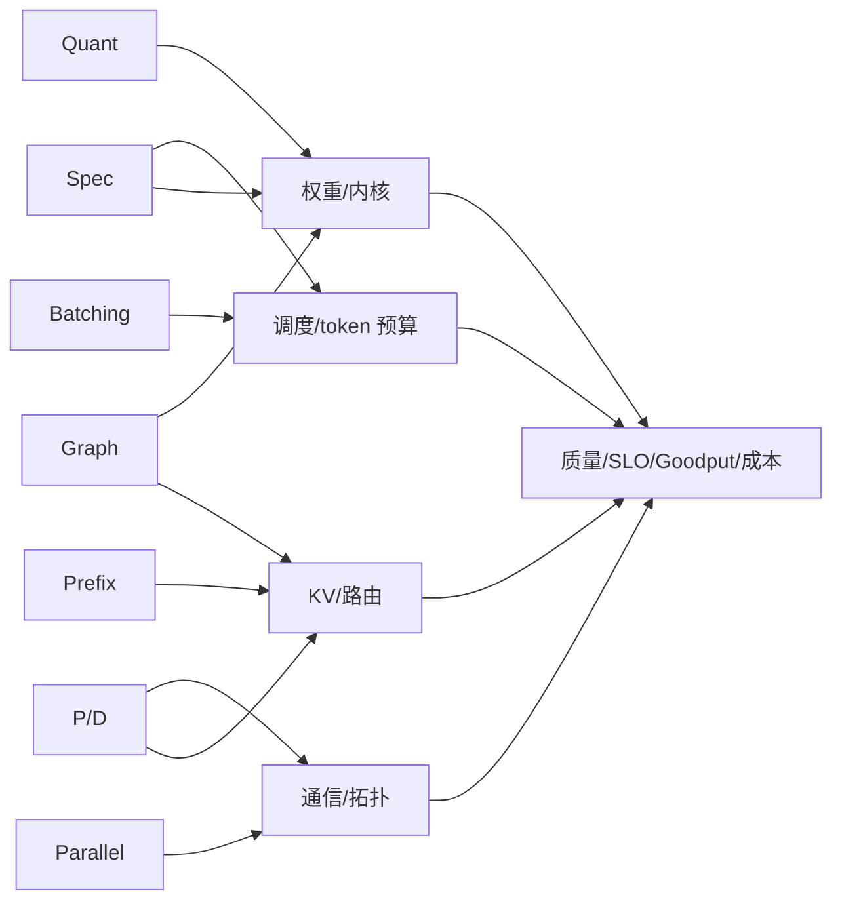
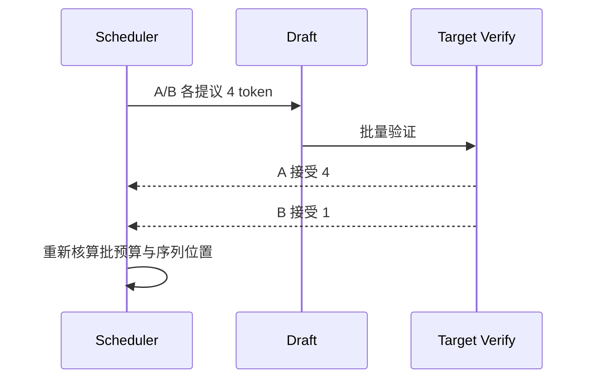
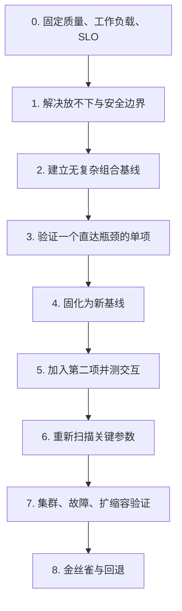

## 📑 目录

- [1. 优化不是积木，而是共享资源的竞争者](#1-优化不是积木而是共享资源的竞争者)
- [2. 先建立七类优化的资源账本](#2-先建立七类优化的资源账本)
- [3. 总交互矩阵](#3-总交互矩阵)
- [4. 量化的六组关键交互](#4-量化的六组关键交互)
- [5. Continuous Batching 的五组关键交互](#5-continuous-batching-的五组关键交互)
- [6. Prefix Cache 的四组关键交互](#6-prefix-cache-的四组关键交互)
- [7. Spec Decode 的三组关键交互](#7-spec-decode-的三组关键交互)
- [8. 并行、P/D 与 Graph 的架构交互](#8-并行pd-与-graph-的架构交互)
- [9. 完整控制变量实验](#9-完整控制变量实验)
- [10. 如何解释非加性收益](#10-如何解释非加性收益)
- [11. 推荐叠加顺序](#11-推荐叠加顺序)
- [12. 组合上线与回退](#12-组合上线与回退)
- [13. 适用边界](#13-适用边界)
- [总结](#-总结)
- [自我检验清单](#-自我检验清单)
- [官方参考](#-官方参考)

---

## 1. 优化不是积木，而是共享资源的竞争者

第 4～7 章分别介绍了量化、投机解码、分布式推理和 P/D 解耦。

第 2、3 章还介绍了 Continuous Batching、Prefix Cache 和 CUDA Graph。

单独学习时，每项技术都有清晰收益路径。

组合后，它们会同时改变：

- 权重显存；
- KV Cache 容量；
- 临时工作区；
- Kernel 形状；
- 每步 token 数；
- 调度公平性；
- 通信；
- 请求路由；
- 冷启动；
- 回滚单元。

因此不能把单项收益相加。

假设 A 单独让吞吐提升 20%，B 单独提升 15%。

即使完全独立，乘法结果也是：

$$
(1+20\%)\times(1+15\%)-1=38\%
$$

但真实系统中的 A 与 B 很少独立。

若二者都优化同一个显存带宽瓶颈，B 的增量可能接近零。

若 B 释放的显存被 A 的工作区占满，组合甚至可能回退。

本节不再重复各项技术的原理。

我们只问三个组合问题：

1. 它节省了什么？
2. 它新消耗了什么？
3. 它改变了谁的最优参数？



## 2. 先建立七类优化的资源账本

### 2.1 单项账本

| 优化 | 主要目标 | 主要节省 | 主要新增消耗 | 必测信号 |
|---|---|---|---|---|
| 量化 | 放得下、降低带宽与成本 | 权重显存，部分计算/带宽 | 校准、格式、特殊 Kernel、质量风险 | 质量、显存、Kernel、TPOT |
| Continuous Batching | 提高利用率与吞吐 | GPU 空洞 | 排队、KV 驻留、调度复杂度 | Batch、Queue、P99、Goodput |
| Prefix Cache | 跳过重复 Prefill | Prefill FLOPs | KV 容量、哈希、路由局部性 | 命中、TTFT、热点、驱逐 |
| Spec Decode | 减少目标模型 Decode 步数 | 目标模型串行步数 | Draft 显存/计算、验证、拒绝 | 接受率、验证耗时、TPOT |
| Parallel | 承载大模型或扩展容量 | 单卡权重/计算压力 | 通信、同步、故障面 | NCCL、拓扑、TPOT、成本 |
| P/D 解耦 | 隔离阶段、独立扩缩 | 阶段互相干扰 | KV 传输、双池容量、路由 | 传输、队列、配比、Goodput |
| CUDA Graph | 降低 Launch/CPU 开销 | Kernel 间空洞 | 捕获显存、形状约束、预热 | Graph 命中、显存、TPOT、启动 |

### 2.2 四个硬门

任何组合先过：

1. **质量门**：输出语义、结构化输出、工具调用与安全无回归；
2. **资源门**：峰值显存、主机内存、共享内存和网络有余量；
3. **SLO 门**：TTFT、TPOT、E2E、错误率和 P99 达标；
4. **运维门**：能观测、能发布、能回退。

吞吐提升不覆盖质量失败。

平均延迟提升不覆盖 P99 失败。

### 2.3 组合前的记录卡

组合实验统一填写 [11.4 的权威实验模板](./11.4-模块总结与持续学习.md#93-实验模板)。本节只增加组合特有字段：优化项名称、目标瓶颈、预期节省、引入成本、被改变的默认值、模型/硬件/引擎兼容状态，以及镜像/模型/配置/拓扑中的最小回退单元。

如果 `target_bottleneck` 写不出来，先不要叠加。

## 3. 总交互矩阵

### 3.1 阅读方法

符号不是兼容性承诺：

- `+`：常见互补路径；
- `±`：依赖工作负载、硬件或参数；
- `!`：高风险交互，必须专项实验；
- `—`：同一技术。

| A \ B | 量化 | 批处理 | Prefix | Spec | Parallel | P/D | Graph |
|---|---:|---:|---:|---:|---:|---:|---:|
| 量化 | — | `±` 显存换批量 | `+` 权重让位 KV | `!` Draft/Verify 内核 | `!` 切分与格式 | `!` KV/硬件格式 | `!` 捕获内核与显存 |
| 批处理 |  | — | `±` 成本估计变化 | `!` 不规则步进 | `±` 计算与通信批量 | `!` 双池调度 | `±` Shape 命中 |
| Prefix |  |  | — | `±` Prefill/Decode 重心 | `±` KV 分片与路由 | `!` 缓存位置与传输 | `!` KV 与捕获争显存 |
| Spec |  |  |  | — | `!` Draft/Target 拓扑 | `!` Decode 池与 KV | `!` 验证 Shape |
| Parallel |  |  |  |  | — | `!` 两侧并行度 | `±` 每 Rank 捕获 |
| P/D |  |  |  |  |  | — | `!` 两池独立捕获 |
| Graph |  |  |  |  |  |  | — |

这个矩阵的用途是生成实验问题。

例如“量化 + 批处理”不等于默认正收益。

它应该被改写为：

> 量化释放的显存是否在不破坏 TTFT P95 的前提下，允许提高批 token 预算并增加 Goodput？

### 3.2 冲突分类

七类优化的冲突主要落在五种机制：

| 冲突机制 | 典型组合 | 观察信号 |
|---|---|---|
| 显存争用 | Prefix + Graph、Spec + Batch | KV 驱逐、OOM、并发下降 |
| Kernel 不兼容 | Quant + Graph、Quant + Spec | 回退 Eager、反量化、Shape Miss |
| 调度不规则 | Batch + Spec、Batch + Prefix | 批次离散、P99、公平性 |
| 通信放大 | Parallel + P/D、Parallel + Spec | NCCL、KV Transfer、同步空洞 |
| 运维耦合 | P/D + Quant、Graph + 发布 | 冷启动、格式兼容、回滚复杂度 |

## 4. 量化的六组关键交互

### 4.1 量化 × Continuous Batching

互补路径：

- 权重显存下降；
- 可把释放的显存用于更多 KV；
- 并发序列或批 token 预算可能提高；
- Goodput 可能增加。

冲突路径：

- 量化 Kernel 在大 Batch Shape 下未必高效；
- 批量提高增加排队；
- 更大 KV 驻留可能挤压 Graph 工作区；
- 质量门仍然独立存在。

错误实验：

> BF16 小批量与 INT4 大批量直接比较。

这个实验同时改变精度和批预算。

正确拆分：

| Run | 精度 | 批预算 | 回答的问题 |
|---|---|---|---|
| 00 | BF16 | small | 基线 |
| 10 | Quant | small | 量化主效应 |
| 01 | BF16 | large | 批量主效应 |
| 11 | Quant | large | 组合与交互 |

固定：

- 相同模型 revision；
- 相同工作负载 Trace；
- 相同 GPU 与副本；
- 相同 Graph 配置；
- 相同 KV 精度；
- 相同到达率扫描。

### 4.2 量化 × Prefix Cache

互补：

- 权重显存下降，为 KV Cache 留出空间；
- 命中后减少 Prefill；
- 长系统提示业务可能同时受益。

冲突：

- 权重量化不等于 KV 量化；
- 增加 KV 空间会延长缓存寿命，也会改变驱逐曲线；
- 总显存占用可能看起来没有下降；
- 缓存收益掩盖量化 Kernel 的真实速度。

控制变量实验分两阶段：

1. 缓存关闭，比较 BF16 与 Quant；
2. 固定已选择精度，扫描真实重复率；
3. 最后做 2×2 组合确认。

若第一阶段没有速度收益，但组合收益来自更大 KV，应把结论写成：

> 量化通过释放权重显存提高了缓存容量。

不要写成：

> 量化 Kernel 让模型更快。

### 4.3 量化 × Spec Decode

这是高风险组合。

Spec Decode 至少有：

- Draft 模型前向；
- 候选 token；
- Target 批量验证；
- 拒绝与回退路径。

量化可能影响：

- Draft 速度；
- Target Verify Kernel；
- Draft 与 Target 分布差异；
- 接受率；
- 两个模型的显存布局；
- Graph 捕获形状。

控制矩阵应区分 Draft 与 Target：

| Run | Target | Draft | Spec | 用途 |
|---|---|---|---|---|
| 00 | BF16 | none | off | 目标基线 |
| 10 | Quant | none | off | Target 量化 |
| 01 | BF16 | fixed | on | Spec 单项 |
| 11 | Quant | fixed | on | 组合 |

必须记录：

- Draft tokens/request；
- Acceptance rate；
- Draft time；
- Verify time；
- Rejection overhead；
- TPOT；
- 峰值显存；
- 任务级质量。

如果更换了 Draft 精度，应开新的因子。

### 4.4 量化 × Parallel

量化可能让 70B 从 TP=8 缩到 TP=4。

但这同时改变：

- 权重格式；
- GPU 数；
- 通信拓扑；
- 每卡矩阵形状；
- 副本可调度性；
- 故障概率；
- 成本。

因此至少比较：

1. BF16 + TP=8；
2. Quant + TP=8；
3. Quant + TP=4。

第 1 与第 2 回答量化主效应。

第 2 与第 3 回答并行度缩减效应。

第 1 与第 3 只回答端到端方案差异，不能归因于单一技术。

还要验证：

- 打包格式能否按 TP 切分；
- 每 Rank 对齐要求；
- 通信是否被计算加速后放大为新瓶颈；
- 滚动发布是否有足够同拓扑 GPU。

### 4.5 量化 × P/D 解耦

P/D 两侧不一定需要同一精度。

可能的设计：

- Prefill 使用高吞吐硬件与 BF16；
- Decode 使用量化权重降低带宽；
- KV Cache 使用独立精度；
- 两侧使用不同并行度。

危险在于“格式”不只指权重。

跨侧接口还包含：

- KV Tensor dtype；
- Layout；
- Block 大小；
- 层分片方式；
- Connector 协议；
- 版本兼容性。

先验证一个兼容的 BF16 P/D 基线。

再只量化 Decode 权重。

不要同时修改 KV 精度和 Connector。

### 4.6 量化 × CUDA Graph

冲突来源：

- 量化 Kernel 可能不支持捕获；
- 动态 Workspace 破坏稳定地址；
- Shape 覆盖与批量分布不匹配；
- Graph 额外显存吃掉量化释放的空间；
- 未捕获路径回退后收益不稳定。

实验必须记录：

- Graph capture 是否成功；
- Graph replay 命中比例；
- Eager fallback 比例；
- 捕获前后峰值显存；
- 冷启动时间；
- 按 Batch Shape 的 TPOT。

不能只看稳态平均 TPOT。

## 5. Continuous Batching 的五组关键交互

### 5.1 Batching × Prefix Cache

Prefix 命中改变请求的真实 Prefill 工作量。

原始输入都是 4K token 的两个请求：

- 请求 A 命中 3.5K；
- 请求 B 完全未命中。

调度器若只看原始长度，可能误判成本。

可能结果：

- 平均 TTFT 降低；
- 批预算利用更灵活；
- 热前缀请求被持续偏爱；
- 冷请求公平性恶化；
- 缓存热点副本排队。

实验分桶：

```yaml
prefix_groups:
  cold: {reuse_ratio: 0}
  realistic: {reuse_ratio: "<trace-derived>"}
  hot: {reuse_ratio: 1}
batch_budgets: ["small", "medium", "large"]
```

每格记录：

- TTFT P50/P95/P99；
- 每租户等待；
- Cache 命中与驱逐；
- Goodput；
- 每 Pod 队列。

### 5.2 Batching × Spec Decode

Continuous Batching 每步动态加入和移出请求。

Spec Decode 每个请求一次提出多个 token。

不同请求接受长度不同：



冲突表现：

- Batch Shape 更不规则；
- 接受率分布拉宽；
- 大草稿长度占用 token 预算；
- 高并发下 Target 已被充分利用，Spec 增量变小；
- Draft 占用显存减少 KV 并发。

至少扫描两个轴：

| 组 | Batch Budget | Draft Length |
|---|---|---|
| B0 | baseline | off |
| B1 | baseline | short |
| B2 | baseline | long |
| B3 | constrained | short |
| B4 | expanded | short |

不要把“草稿越长”当成单调收益。

### 5.3 Batching × Parallel

更大批次可以提高每 Rank 计算效率。

也可能：

- 增大集合通信消息；
- 让同步等待更明显；
- 增加每 Rank KV；
- 在 PP 中改变 Micro-batch 与气泡；
- 让单副本吞吐提高但故障域更集中。

控制变量：

- 先固定 TP 扫 Batch；
- 再固定最佳安全 Batch 扫 TP；
- 最后验证组合附近的局部网格。

不要同时从 TP=2 小批跳到 TP=8 大批。

### 5.4 Batching × P/D 解耦

P/D 解耦后不再只有一个 Batch。

Prefill 池关注：

- 输入 token；
- Chunk 大小；
- KV 生成；
- 传输并发。

Decode 池关注：

- 活跃序列；
- 每步 token；
- KV 接收；
- 输出长度。

两侧局部最优可能不匹配。

如果 Prefill 产出速度高于 Decode 消费：

- Transfer Queue 增长；
- KV 占用上升；
- TTFT 或 TPOT 长尾增加；
- 上游继续扩容反而无益。

因此 HPA 也不能只看一个池的 GPU 利用率。

### 5.5 Batching × Graph

Graph 喜欢稳定、可复用的 Shape。

Continuous Batching 天生动态。

引擎通常通过捕获一组常见 Shape 折中。

冲突点：

- Batch 分布太散，Graph 命中低；
- 捕获 Shape 越多，占用显存与启动时间越多；
- 未覆盖 Shape 回退 Eager；
- 为追求命中而 Padding 可能增加无效计算。

实验：

1. 从真实 Trace 提取 Batch Shape 直方图；
2. 选择覆盖常见区间的捕获集合；
3. 比较 Eager、少量 Shape、多量 Shape；
4. 同时测启动时间、显存、命中和 TPOT；
5. 选择总收益，而非最高命中率。

## 6. Prefix Cache 的四组关键交互

### 6.1 Prefix × Spec Decode

两者优化不同阶段：

- Prefix Cache 主要减少 Prefill；
- Spec Decode 主要减少 Decode 串行步数。

看起来互补，但请求分布决定重心。

长输入、短输出：

- Prefix 可能主导；
- Spec 固定开销可能不值得。

短输入、长输出：

- Spec 可能主导；
- Prefix 命中价值有限。

控制矩阵必须按输入/输出长度分桶。

不能用一个平均 workload 覆盖两种业务。

### 6.2 Prefix × Parallel

并行后 KV 可能按 Head、Layer 或 Rank 分布。

要检查：

- Cache Block 如何分片；
- 命中是否要求所有 Rank 一致；
- Prefix-aware 路由是否以副本而非 Rank 为单位；
- TP 副本故障是否使整份缓存失效；
- 跨节点访问是否引入额外通信。

多副本 DP 往往让缓存局部性与负载均衡冲突。

路由优先级建议：

1. 排除未就绪副本；
2. 排除过载副本；
3. 保持租户安全域；
4. 再考虑 Prefix 命中；
5. 用队列长度打破平局。

### 6.3 Prefix × P/D

必须明确缓存在哪里：

- Prefill 侧缓存完整 Prefix KV；
- Decode 侧缓存可复用 KV；
- 两侧都有缓存；
- 上层外部 KV Cache。

每种设计都改变：

- 命中路径；
- KV 传输；
- 失效协议；
- 容量；
- 安全边界。

如果每次命中仍要传输大量 KV，节省的 Prefill 时间可能被网络抵消。

手算：

$$
T_{\text{hit}}
\approx
T_{\text{lookup}}
+T_{\text{KV transfer}}
+T_{\text{queue}}
$$

它必须与重新 Prefill 的路径比较。

### 6.4 Prefix × Graph

Prefix 命中后剩余 Prefill 长度动态变化。

这会改变 Shape 分布。

同时：

- Cache KV 占用显存；
- Graph 捕获也占显存；
- 两者争夺同一 Headroom；
- 命中提升后 Decode 占比上升，Graph 收益位置变化。

实验需要分别报告冷、真实、热三组。

## 7. Spec Decode 的三组关键交互

### 7.1 Spec × Parallel

架构问题：

- Draft 是否单卡；
- Target 是否 TP；
- Draft 与 Target 是否共享节点；
- 验证 token 如何进入各 Rank；
- Draft 是否挤占 Target GPU；
- 跨节点通信是否放大验证成本。

如果 Draft 单独占一张 GPU，成本分母必须包含它。

如果 Draft 与 Target 共享 GPU，必须记录资源竞争。

两种方案不能混为一个“Spec on”。

### 7.2 Spec × P/D

Spec 主要服务 Decode。

P/D 解耦后可以把 Draft 放在 Decode 池。

但要回答：

- KV 从 Prefill 侧到达后何时开始 Draft；
- Draft 与 Target 是否使用同一 KV 表示；
- 拒绝后如何更新 Decode 状态；
- Decode 池扩缩容是否带走 Draft；
- 接受率指标如何按 Decode 副本归因。

若业务输出很短，KV 传输和 Draft 初始化可能吞掉收益。

### 7.3 Spec × Graph

验证 Shape 取决于：

- Draft Length；
- 活跃请求数；
- 每请求接受长度；
- 结构化输出约束；
- 拒绝路径。

Graph 覆盖不足时可能频繁回退 Eager。

控制变量：

1. 先在 Eager 模式验证 Spec 是否有净收益；
2. 再固定 Spec 参数验证 Graph；
3. 最后小范围扫描 Draft Length；
4. 不在同一轮更换 Draft 模型。

## 8. 并行、P/D 与 Graph 的架构交互

### 8.1 Parallel × P/D

P/D 允许两侧不同并行度：

```yaml
prefill_pool:
  replicas: null
  tensor_parallel_size: null
  pipeline_parallel_size: null
decode_pool:
  replicas: null
  tensor_parallel_size: null
  pipeline_parallel_size: null
```

总 GPU 不是简单的单池副本数：

$$
G_{\text{total}}
=
R_P(TP_P\times PP_P)
+
R_D(TP_D\times PP_D)
+
G_{\text{headroom}}
$$

还要加：

- 发布 Surge；
- N+1 故障余量；
- Draft GPU；
- 路由与 Connector 资源。

主要冲突：

- Prefill 与 Decode 产消不匹配；
- 两侧拓扑需求不同；
- KV Transfer 跨 NUMA 或节点；
- 一侧扩容后另一侧成为瓶颈；
- 故障时请求状态更复杂。

### 8.2 Parallel × Graph

每个 Rank 都可能需要捕获与工作区。

关注：

- 捕获是否在所有 Rank 同步成功；
- 某 Rank OOM 是否导致整个副本失败；
- Graph Shape 是否与 TP 切分后的局部 Shape 匹配；
- 冷启动时间是否被最慢 Rank 决定；
- 滚动发布期间是否有同拓扑空闲卡。

Graph 不能弥补低效跨节点 TP。

它优化的是 Launch 路径，不是网络物理限制。

### 8.3 P/D × Graph

两池工作负载 Shape 不同。

Prefill 池可能需要：

- 多输入长度；
- Chunk Shape；
- 大矩阵。

Decode 池可能需要：

- 多活跃序列数；
- 小步高频；
- Spec Verify Shape。

应分别设计捕获集合。

把混合服务的 Graph 参数原样复制到两池，不是合理基线。

## 9. 完整控制变量实验

### 9.1 场景

假设 7B 在线服务出现：

- TTFT 刚好达标；
- TPOT 有余量；
- Goodput 不足；
- 前缀重复率较高；
- 显存余量有限。

候选是：

- 权重量化 Q；
- 增大批预算 B；
- Prefix Cache C。

所有数字仍待测。

### 9.2 第一阶段：验证单项

| Run | Q | B | C | 问题 |
|---|---:|---:|---:|---|
| 000 | off | base | off | 基线 |
| 100 | on | base | off | 量化主效应 |
| 010 | off | high | off | 批量主效应 |
| 001 | off | base | on | 缓存主效应 |

先淘汰：

- 质量失败的量化；
- TTFT 失败的大批量；
- 真实重复率无收益的缓存。

### 9.3 第二阶段：验证二阶交互

| Run | Q | B | C | 问题 |
|---|---:|---:|---:|---|
| 110 | on | high | off | 量化释放显存是否支持批量 |
| 101 | on | base | on | 量化是否扩大缓存容量 |
| 011 | off | high | on | 缓存是否改变批调度 |

只有单项通过后才运行。

### 9.4 第三阶段：三项组合

`111` 不是必跑。

只有业务目标仍未满足且二阶交互可解释时才运行。

三项组合后，需要重新扫描附近参数：

- 批预算可能需要从 `high` 回调；
- Cache 容量可能挤压 Graph；
- 量化后的最优并发可能变化。

### 9.5 固定项

把固定项写入 [11.4 权威模板](./11.4-模块总结与持续学习.md#93-实验模板) 的 `controls.fixed`：模型/Tokenizer revision、镜像 digest、workload/arrival/prefix trace、采样参数、GPU 型号与拓扑、副本数、Graph 模式和 KV dtype。

若量化必须更换镜像，应明确把“镜像实现差异”列为混杂因素。

### 9.6 指标

每个 Run 必须同时记录：

- 任务级质量；
- Schema/Tool 合法率；
- TTFT P50/P95/P99；
- TPOT P50/P95/P99；
- E2E P99；
- 请求与 token Goodput；
- 错误、超时、OOM；
- 峰值权重/KV/总显存；
- Cache 命中与驱逐；
- Batch Shape；
- GPU 与 CPU；
- 单位成本。

## 10. 如何解释非加性收益

### 10.1 二因子交互项

对越大越好的指标 $Y$：

$$
I_{AB}
=
(Y_{11}-Y_{00})
-
(Y_{10}-Y_{00})
-
(Y_{01}-Y_{00})
$$

$I_{AB}<0$ 表示组合增量小于两个单项增量之和。

它不自动等于“冲突”。

可能解释：

- 两项优化同一瓶颈；
- 指标接近上限；
- 第二项改变了工作负载；
- 资源被重新分配；
- 测量噪声；
- 参数没有重新寻优。

### 10.2 用时间分解归因

例如 Spec + Quant 收益不佳：

$$
T_{\text{spec}}
=T_{\text{draft}}
+T_{\text{verify}}
+T_{\text{reject}}
+T_{\text{schedule}}
$$

逐项比较，而不是只看 E2E。

### 10.3 用资源分解归因

例如 Quant + Prefix 后总显存不降：

```text
权重显存下降
  → KV 可用空间上升
  → 缓存保留更久
  → 总占用重新接近预算
```

这可能是预期行为。

关键是 Goodput 与 SLO 是否改善。

### 10.4 结论写法

合格：

> 在固定工作负载与硬件下，量化单项通过质量门；与 Prefix Cache 组合后，总显存峰值没有下降，但可驻留 KV 增加。组合收益主要来自缓存容量，而非已证明的量化 Kernel 加速。

不合格：

> 量化和缓存可以叠加，所以一定更快。

## 11. 推荐叠加顺序

### 11.1 顺序不是技术排名



### 11.2 一般建议

1. 先解决 OOM；
2. 再满足主 SLO；
3. 再提高 SLO 内 Goodput；
4. 再压低单位成本；
5. 最后引入需要双池或复杂路由的架构。

若 P/D 解耦正是满足 TTFT 的必要手段，它会提前。

决策仍然由证据决定。

### 11.3 何时不再叠加

- 当前方案已经满足目标；
- 新技术改善的是非瓶颈；
- 组合回滚需要同时升级多个状态ful组件；
- 测试矩阵超出团队维护能力；
- 观测无法区分各路径；
- 版本仍处于实验性且缺少生产验证；
- 新增成本大于节省。

## 12. 组合上线与回退

### 12.1 把组合视为一个版本集合

上线制品至少绑定：

```yaml
release_bundle:
  image_digest: "sha256:<digest>"
  model_revision: "<revision>"
  tokenizer_revision: "<revision>"
  quant_format: "<format-or-none>"
  engine_args: []
  graph_profile: "<id>"
  routing_policy: "<id>"
  cache_compat_version: "<id>"
  connector_version: "<id-or-none>"
  workload_validation: "<artifact-uri>"
```

只回退镜像可能不够。

量化模型、路由、Cache 与 Connector 都可能需要一起回退。

### 12.2 金丝雀指标

新旧版本同时区分：

- 质量抽检；
- 错误与超时；
- TTFT/TPOT/P99；
- Queue；
- Cache；
- Spec 接受率；
- Graph 回退；
- NCCL/KV Transfer；
- GPU 显存；
- Goodput 与成本。

指标标签要低基数。

版本标识应可稳定 Join 到部署清单。

### 12.3 回退门

任一硬门触发回退：

- 业务质量低于阈值；
- Schema 或 Tool 合法率下降；
- OOM、错误、超时增加；
- TTFT/TPOT/E2E 超 SLO；
- P99 恶化超过预算；
- Cache 隔离或安全边界失败；
- Graph 大量回退；
- P/D Connector 不兼容；
- 冷启动超过发布预算；
- 监控不能解释新路径。

### 12.4 回退演练

上线前演练：

1. 回退镜像；
2. 回退模型与量化格式；
3. 回退引擎参数；
4. 回退路由权重；
5. 清理或隔离不兼容缓存；
6. 回退 Connector；
7. 验证旧版本恢复 SLO；
8. 保留失败请求与原始产物。

## 13. 适用边界

- 兼容性随引擎版本变化；
- 同名量化格式可能有不同 Kernel；
- 不同 GPU 架构的最佳组合不同；
- 合成前缀不能代表生产命中分布；
- Spec 接受率依赖模型与任务；
- TP 的通信边界依赖真实拓扑；
- P/D 收益依赖 KV 大小与网络；
- Graph 收益依赖 Shape 分布；
- 单项最佳不等于组合最佳；
- 组合最佳也不等于可运维最佳；
- 本文矩阵是提问框架，不是支持列表。

## 📝 总结

优化组合真正困难的地方不是“功能能否同时打开”，而是它们是否争夺同一显存、调度、Kernel、通信与运维预算。

本节把前十章的技术放进一张交互矩阵，并把每个冲突改写成控制变量实验。

叠加原则只有三条：

1. 每项优化必须直达已证实瓶颈；
2. 每增加一项，都要重测质量、SLO、Goodput 与资源；
3. 组合必须作为完整发布单元可观测、可回退。

## ✅ 自我检验清单

- [ ] 我能说清每项优化节省和新增的资源
- [ ] 我不会把七项功能的收益直接相加
- [ ] 量化与批处理使用 2×2 实验分离主效应
- [ ] 量化与并行区分格式变化和 GPU 数变化
- [ ] Prefix 实验包含冷、真实与热三组
- [ ] Spec 实验记录 Draft、Verify、Reject 与接受率
- [ ] P/D 实验分别观测 Prefill、Transfer 与 Decode
- [ ] Graph 实验记录捕获、回退、显存和冷启动
- [ ] 我会解释非加性收益，而不是只报总数
- [ ] 三项组合只在二阶交互可解释后进行
- [ ] 发布包绑定镜像、模型、参数、路由和缓存协议
- [ ] 回退演练覆盖所有兼容状态

## 📚 官方参考

- [vLLM：Quantization](https://docs.vllm.ai/en/latest/features/quantization/)
- [vLLM：Automatic Prefix Caching](https://docs.vllm.ai/en/latest/design/prefix_caching.html)
- [vLLM：Speculative Decoding](https://docs.vllm.ai/en/latest/features/spec_decode.html)
- [vLLM：Parallelism and Scaling](https://docs.vllm.ai/en/latest/serving/parallelism_scaling.html)
- [vLLM：Disaggregated Prefilling](https://docs.vllm.ai/en/latest/features/disagg_prefill.html)
- [vLLM：Optimization and Tuning](https://docs.vllm.ai/en/latest/configuration/optimization.html)
- [PyTorch：CUDA Graphs](https://pytorch.org/docs/stable/notes/cuda.html#cuda-graphs)
- [Kubernetes：Topology Aware Routing](https://kubernetes.io/docs/concepts/services-networking/topology-aware-routing/)
- [NIST：Engineering Statistics Handbook](https://www.itl.nist.gov/div898/handbook/)
