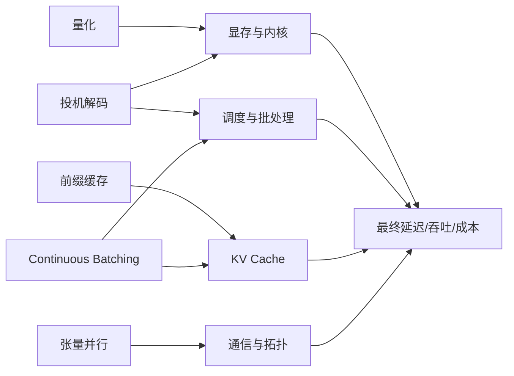
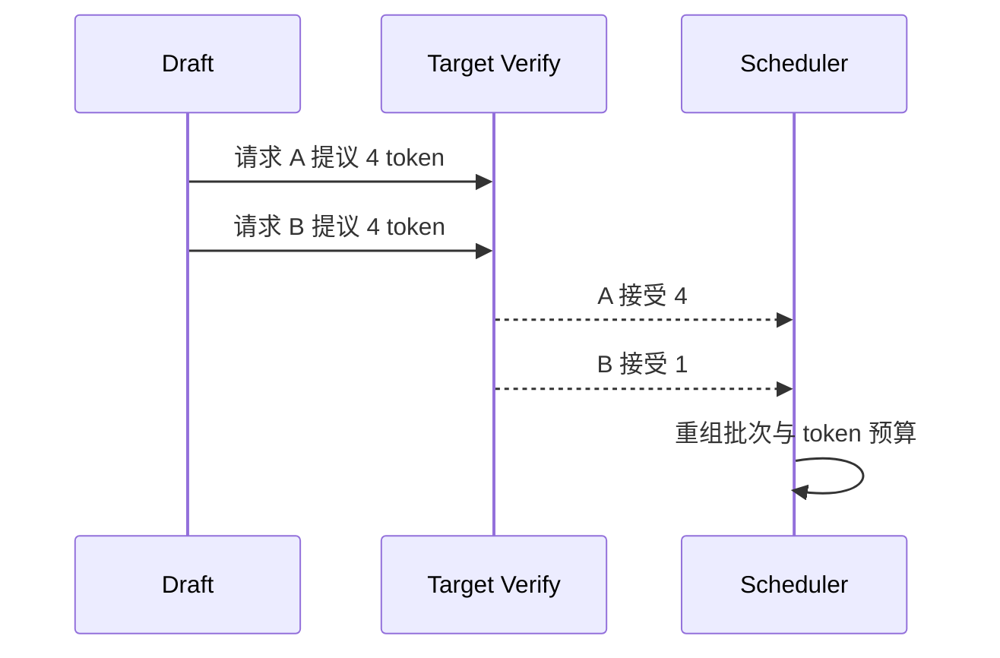
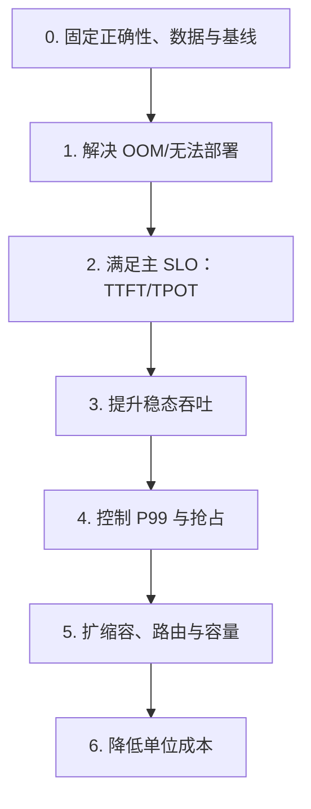

## 📑 目录
- [1. 为什么一加一可能小于二](#1-为什么一加一可能小于二)
- [2. 先用四个维度看组合](#2-先用四个维度看组合)
- [3. 量化与其他优化](#3-量化与其他优化)
- [4. 投机解码与批处理](#4-投机解码与批处理)
- [5. 缓存、调度与路由](#5-缓存调度与路由)
- [6. 并行与部署拓扑](#6-并行与部署拓扑)
- [7. 推荐叠加顺序](#7-推荐叠加顺序)
- [8. 组合实验与回退](#8-组合实验与回退)
- [9. 边界](#9-边界)
- [总结](#-总结)
- [自我检验清单](#-自我检验清单)
- [官方参考](#-官方参考)
---
## 1. 为什么一加一可能小于二
给赛车同时换轮胎、发动机和变速箱，不代表圈速等于三个单项收益相加。
轮胎抓地不足会限制发动机，新变速箱也可能让最佳换挡区间改变。
推理优化同样共享显存、计算、带宽、调度和请求分布。
假设优化 A 单独提升 20%，B 单独提升 15%。
即使完全独立，组合后的理论乘法收益也是：
$$
(1+20\%)\times(1+15\%)-1=38\%
$$
不是简单相加的 35%，更不代表真实系统一定达到 38%。
若 A 和 B 都优化同一瓶颈，第二个优化可能几乎没有增量收益。

组合前先写清：每项优化作用在哪个瓶颈，又消耗什么资源。
## 2. 先用四个维度看组合
### 2.1 正确性
会不会改变：
- 数值精度
- 输出分布
- 停止条件
- 最大上下文
- 结构化输出约束
量化和投机解码尤其需要质量回归。
### 2.2 资源
会不会改变：
- 权重显存
- KV Cache 容量
- 临时工作区
- CPU 和主机内存
- GPU 数与互联带宽
释放的权重显存可能被更大 KV Cache 使用，因此显存下降不一定表现为总占用下降。
### 2.3 调度
会不会改变：
- 每步 token 预算
- Prefill 与 Decode 的竞争
- 批次组成
- 抢占和重计算
- 排队和公平性
吞吐提升但 P99 恶化，常常是调度目标发生了偏移。
### 2.4 运维
会不会增加：
- 镜像与模型格式数量
- 冷启动时间
- GPU 拓扑要求
- 指标和告警维度
- 回滚复杂度
一个理论上更快、但无法稳定发布和回滚的组合，不是生产最优解。
## 3. 量化与其他优化
### 3.1 量化 + 张量并行
量化减少权重显存，可能让模型从 4 卡缩到 2 卡。
这既减少硬件，也改变通信量和每卡计算形态。
需要分别比较：
1. BF16 + 4 卡 TP
2. 量化 + 4 卡 TP
3. 量化 + 2 卡 TP
不能只比较第 1 和第 3，然后把全部收益归因于量化内核。
边界：
- 量化格式是否支持目标 GPU
- 是否有高效内核，而不是先反量化再计算
- TP 切分是否满足打包和对齐要求
- 质量是否通过任务级评测
### 3.2 量化 + 投机解码
投机解码包含草稿生成和目标模型验证。
组合收益近似受以下因素影响：
$$
S \approx
\frac{T_{\text{baseline}}}
{T_{\text{draft}} + T_{\text{verify}} + T_{\text{reject}}}
$$
量化若加速目标验证，可能提升收益。
量化若缺少批量验证内核，或降低草稿接受率，收益可能下降。
必须记录：
- 草稿 token 数
- 接受率
- 草稿耗时
- 验证耗时
- 拒绝后的额外开销
- 最终质量与 TPOT
### 3.3 量化 + 大批处理
量化释放显存后，可以增加并发或 KV Cache。
但大批处理会提高排队时间，甚至让 TTFT 越过 SLO。
推荐先固定 SLO，逐级增加批 token 预算，找到安全边界。
不要只报告吞吐峰值。
## 4. 投机解码与批处理
### 4.1 为什么存在冲突
Continuous Batching 希望把不同请求动态拼入批次。
投机解码会让每个请求一次提出并验证多个候选 token。
不同请求的接受长度不一，批次步进可能变得不规则。

投机长度越大，不一定越快。
若接受率低，草稿和验证工作大部分被浪费。
### 4.2 实验矩阵
建议最小矩阵：
| 组合 | Continuous Batching | Spec Decode |
|---|---|---|
| 基线 | 开 | 关 |
| A | 开 | 小草稿长度 |
| B | 开 | 大草稿长度 |
| C | 受控批大小 | 小草稿长度 |
每格都记录 TTFT、TPOT、吞吐、P99、接受率和 GPU 显存。
请求长度和到达模式必须相同。
### 4.3 何时可能不适合
- 目标模型很小，本身已经很快
- 草稿模型与目标分布差异大
- 高并发下批处理已充分利用 GPU
- 请求输出很短，固定开销占比高
- 结构化输出限制导致接受率低
- 草稿模型额外占用显存挤压 KV Cache
## 5. 缓存、调度与路由
### 5.1 Prefix Cache + Continuous Batching
前缀缓存减少重复 Prefill，批处理共享 GPU 步进。
两者可以互补，但缓存命中会改变每个请求的实际计算量。
调度器若仍按原始输入长度估算成本，可能产生公平性偏差。
实验需区分：
- 完全随机前缀
- 真实重复率
- 全部相同前缀
只测试全部相同前缀，会给出过度乐观上限。
### 5.2 Prefix-aware 路由 + 自动扩缩容
一致性哈希能提高命中率，但扩缩容改变副本集合。
新副本加入时：
- 哈希键重新分布
- 热缓存迁移或失效
- 新副本冷启动
- 短期 TTFT 可能上升
缩容时还要避免把热点前缀集中到少数副本。
路由优先级建议：
1. 排除未就绪和过载副本
2. 维护租户与安全边界
3. 在候选副本中考虑前缀命中
4. 最后用队列或权重打破平局
### 5.3 缓存 + 多租户
共享前缀缓存可能带来隔离和侧信道风险。
不要仅以“内容哈希相同”就跨信任域共享。
可把租户或安全域纳入缓存键，代价是命中率下降。
安全边界优先于性能收益。
## 6. 并行与部署拓扑
### 6.1 TP + 多副本
总 GPU 数：
$$
G = N_{\text{replica}}\times TP
$$
例如 4 个副本、每副本 TP=2，共需 8 张 GPU。
如果每节点只有 4 张 GPU，滚动发布 `maxSurge: 1` 还需要额外 2 张可同节点调度的 GPU。
容量“总数够”不代表拓扑上可放置。
### 6.2 TP + PP
TP 依赖高频集合通信，PP 在阶段之间传递激活。
组合可以承载更大模型，也增加气泡、通信和故障面。
优先在高速互联域内做 TP，跨节点前先测 NCCL 与真实模型性能。
不要把单机 NVLink 结果外推到跨机普通以太网。
### 6.3 P/D 解耦 + 量化/缓存
Prefill 和 Decode 可以使用不同硬件与并行度。
但 KV 传输协议、格式和带宽成为新约束。
如果 Prefill 侧使用一种 KV 精度，Decode 侧必须兼容。
前缀缓存放在哪一侧、如何失效，也需要重新设计。
引入前应手算：
$$
T_{\text{transfer}}
\approx \frac{M_{\text{KV}}}{BW_{\text{effective}}}
+ T_{\text{serialization}}
$$
若传输时间吃掉阶段隔离收益，架构只会更复杂。
## 7. 推荐叠加顺序
一个适合入门者的顺序：

更具体地：
1. 先设置长度、并发和资源安全边界
2. 再验证单项：量化、缓存、批处理或内核
3. 保留确有收益的单项作为新基线
4. 每次只增加一个新优化
5. 重新扫描关键参数，而不是沿用旧最优值
6. 最后做多副本、故障和发布测试
组合后旧参数可能不再最优。
例如量化释放显存后，原来的批 token 预算就可能过于保守。
## 8. 组合实验与回退
### 8.1 因子实验
以量化 A、投机解码 B 为例：
| Run | A | B | 用途 |
|---|---|---|---|
| 00 | 关 | 关 | 基线 |
| 10 | 开 | 关 | A 单项 |
| 01 | 关 | 开 | B 单项 |
| 11 | 开 | 开 | 组合 |
若指标 $Y$ 越大越好，交互项可粗略写成：
$$
I = (Y_{11}-Y_{00})
- (Y_{10}-Y_{00})
- (Y_{01}-Y_{00})
$$
$I<0$ 表示组合收益小于两个单项增量之和。
这只是描述交互，不自动说明原因。
### 8.2 不伪造数据的记录
```yaml
runs:
  baseline:
    config: {quantization: false, speculative: false}
    raw_result: null
  quant_only:
    config: {quantization: "<format>", speculative: false}
    raw_result: null
  spec_only:
    config: {quantization: false, speculative: true}
    raw_result: null
  combined:
    config: {quantization: "<format>", speculative: true}
    raw_result: null
notes:
  - "null means not measured"
  - "do not fill from vendor marketing numbers"
```
### 8.3 回退条件
上线前写清自动或人工回退门：
- 质量评测跌破阈值
- 错误率、超时或 OOM 增加
- TTFT/TPOT/P99 超过 SLO
- GPU 成本/请求恶化
- 新配置无法在预期时间内启动
- 监控无法区分新旧版本
回退必须同时恢复镜像、模型格式、参数、路由权重和兼容配置。
只回退 Deployment 镜像，可能留下不兼容的缓存或模型卷。
## 9. 边界
- 优化兼容性随 vLLM 和硬件版本变化
- 一些功能可能仍是实验性，需查当前文档
- 单项最佳不等于组合最佳
- 合成数据不会覆盖真实前缀和长度分布
- 吞吐提高不代表单位成本一定下降
- 更少 GPU 不代表更高可用性
- 组合越多，升级测试矩阵越大
- 安全与正确性不应成为性能交换项
## 📝 总结
优化组合要同时看正确性、资源、调度和运维四个维度。
量化、投机解码、批处理、缓存、路由和并行会通过共享瓶颈发生交互，因此必须用单项与组合的对照矩阵验证。
最稳妥的叠加方式，是把每个已验证单项变成新基线，并保留明确回退门。
## ✅ 自我检验清单
- [ ] 我知道每个优化节省什么、消耗什么
- [ ] 量化组合先通过任务级质量评测
- [ ] 投机解码记录接受率和验证开销
- [ ] 缓存实验使用真实前缀重复率
- [ ] 自动扩缩容测试包含缓存重分布阶段
- [ ] 并行方案检查 GPU 数与物理拓扑
- [ ] 我做了基线、两个单项和组合四组实验
- [ ] 未测结果保留为 `null`
- [ ] 回退覆盖镜像、模型、参数、路由和缓存兼容性
## 📚 官方参考
- [vLLM：Quantization](https://docs.vllm.ai/en/latest/features/quantization/)
- [vLLM：Speculative Decoding](https://docs.vllm.ai/en/latest/features/spec_decode.html)
- [vLLM：Automatic Prefix Caching](https://docs.vllm.ai/en/latest/design/prefix_caching.html)
- [vLLM：Parallelism and Scaling](https://docs.vllm.ai/en/latest/serving/parallelism_scaling.html)
- [vLLM：Disaggregated Prefilling](https://docs.vllm.ai/en/latest/features/disagg_prefill.html)
- [Kubernetes：Topology Aware Routing](https://kubernetes.io/docs/concepts/services-networking/topology-aware-routing/)
- [NIST：Engineering Statistics Handbook](https://www.itl.nist.gov/div898/handbook/)
