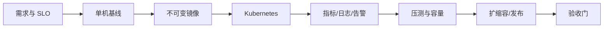
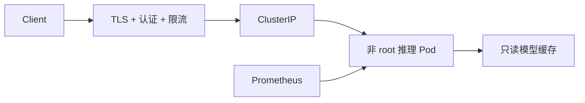

## 1. 实战目标与边界
本节把一个 OpenAI 兼容的 vLLM 服务从需求表送到 Kubernetes。 它像一次飞行前检查：不是展示飞机能点火，而是确认航线、燃油、仪表、备降和黑匣子都准备好。

示例选择一个 7B 级指令模型和单 GPU 副本，只为降低理解门槛。模型名、镜像版本、GPU、容量数字和 SLO 都是可替换输入，不是生产推荐或性能承诺。本节不覆盖云账号与集群创建、企业身份接入、许可证审批，也不提供某型号 GPU 的真实跑分。
## 2. 第一步：定义需求
### 2.1 需求清单
```yaml
service: chat-model
model: {id: "Qwen/Qwen2.5-7B-Instruct", revision: "<approved-commit-id>",
  served_name: "chat-model"}
traffic:
  peak_rps: null
  input_tokens: {p50: null, p95: null, p99: null}
  output_tokens: {p50: null, p95: null, p99: null}
  streaming_ratio: null
slo: {availability: "<target>", ttft_p95_ms: "<target>",
  tpot_p95_ms: "<target>", e2e_p99_ms: "<target>"}
limits: {max_input_tokens: "<approved-limit>",
  max_output_tokens: "<approved-limit>"}
security: {exposure: "internal-gateway-only",
  auth: "<api-key-jwt-or-workload-identity>"}
```
所有 `null` 都表示需要测量。 如果暂时只有估计值，另加 `assumption: true`，不要填进实测字段。
### 2.2 请求分布
从经过授权和脱敏的生产样本计算 token 长度。没有生产数据时，可用合成数据验证管道，但结论必须标记为“合成工作负载”。分别保存数据快照标识、Tokenizer revision、长度直方图、前缀重复率和到达时间序列。
Tokenizer 变化会改变 token 数，所以也属于实验版本。
### 2.3 成功门
上线验收门示例：
1. 正确性评测通过
2. 安全扫描和权限审查通过
3. 目标负载下 SLO 通过
4. 删除一个副本后服务仍符合降级目标
5. 告警可触发，回滚已演练
6. 容量输入和原始数据可追溯
## 3. 第二步：建立单机基线
### 3.1 固定运行环境
```bash
export MODEL_ID="Qwen/Qwen2.5-7B-Instruct"
export MODEL_REVISION="<approved-commit-id>"
export SERVED_NAME="chat-model"
export IMAGE="vllm/vllm-openai:<pinned-version>"
docker pull "${IMAGE}"
docker inspect "${IMAGE}" --format='{{index .RepoDigests 0}}'
```
先确认宿主机驱动、CUDA 兼容性和 GPU 可见性：
```bash
nvidia-smi
docker run --rm --gpus all "${IMAGE}" nvidia-smi
```
### 3.2 启动服务
```bash
docker run --rm --gpus all \
  --shm-size=8g -p 127.0.0.1:8000:8000 -e HF_TOKEN \
  "${IMAGE}" "${MODEL_ID}" --revision "${MODEL_REVISION}" \
  --served-model-name "${SERVED_NAME}" \
  --gpu-memory-utilization 0.90
```
只绑定 `127.0.0.1`，避免无鉴权端口暴露到外网。 Token 从环境或 Secret 管理系统提供，不写入命令历史、Dockerfile 和 Git。 `0.90` 是实验起点，不是通用最优值。
### 3.3 冒烟测试
```bash
curl -sS http://127.0.0.1:8000/v1/chat/completions \
  -H 'Content-Type: application/json' \
  -d '{"model":"chat-model","messages":[{"role":"user",
  "content":"只回答：ready"}],"max_tokens":8,"temperature":0}' | jq .
```
检查 HTTP 状态与 JSON Schema、模型名与停止原因、流式断开行为、超长输入拒绝，以及非法鉴权是否在网关被拒绝。
### 3.4 保存基线
将服务日志、`nvidia-smi -q`、指标快照、镜像 digest、模型 revision 和完整参数保存到同一实验目录。
## 4. 第三步：打包与安全
### 4.1 最小 Dockerfile
```dockerfile
FROM vllm/vllm-openai:<pinned-version>
USER root
RUN groupadd -g 10001 app \
 && useradd -m -u 10001 -g 10001 app
USER 10001:10001
ENTRYPOINT ["vllm", "serve"]
```
构建、扫描并推送：
```bash
docker build -t registry.example.com/ai/chat-model:r1 .
trivy image registry.example.com/ai/chat-model:r1
docker push registry.example.com/ai/chat-model:r1
docker inspect registry.example.com/ai/chat-model:r1 \
  --format='{{index .RepoDigests 0}}'
```
扫描工具只是示例，采用组织批准的供应链流程。
### 4.2 安全边界

上线前落实：
- 入口只能经过网关
- 推理 Service 使用 ClusterIP
- 指标端点只允许监控命名空间访问
- NetworkPolicy 默认拒绝，再按需放行
- ServiceAccount 不授予无关 API 权限
- API Key 与模型 Token 分开管理和轮换
- 日志不默认保留 prompt 与生成文本
## 5. 第四步：部署到 Kubernetes
### 5.1 Deployment
```yaml
apiVersion: v1
kind: ServiceAccount
metadata: {name: chat-model}
automountServiceAccountToken: false
---
apiVersion: apps/v1
kind: Deployment
metadata: {name: chat-model, labels: {app: chat-model}}
spec:
  replicas: 2
  strategy: {rollingUpdate: {maxSurge: 1, maxUnavailable: 0}}
  selector: {matchLabels: {app: chat-model}}
  template:
    metadata: {labels: {app: chat-model}}
    spec:
      serviceAccountName: chat-model
      terminationGracePeriodSeconds: 120
      nodeSelector: {accelerator: "<cluster-gpu-label>"}
      containers:
        - name: server
          image: registry.example.com/ai/chat-model@sha256:<digest>
          args:
            - Qwen/Qwen2.5-7B-Instruct
            - --revision=<approved-commit-id>
            - --served-model-name=chat-model
            - --gpu-memory-utilization=0.90
          ports: [{name: http, containerPort: 8000}]
          resources:
            requests: {cpu: "4", memory: 24Gi, nvidia.com/gpu: "1"}
            limits: {cpu: "8", memory: 32Gi, nvidia.com/gpu: "1"}
          securityContext:
            runAsNonRoot: true
            allowPrivilegeEscalation: false
            capabilities: {drop: ["ALL"]}
          startupProbe:
            httpGet: {path: /health, port: http}
            periodSeconds: 10
            failureThreshold: 120
          readinessProbe:
            httpGet: {path: /health, port: http}
            periodSeconds: 5
            failureThreshold: 3
          livenessProbe:
            httpGet: {path: /health, port: http}
            periodSeconds: 10
            failureThreshold: 6
          volumeMounts: [{name: dshm, mountPath: /dev/shm}]
      volumes:
        - name: dshm
          emptyDir: {medium: Memory, sizeLimit: 8Gi}
```
资源值、节点标签和探针窗口都是待测占位值。 启动窗口为 $10\times120=1200$ 秒，应高于冷缓存 P99 启动时间。这里的 `replicas: 2` 只用于尚未启用 HPA 的基线部署。
### 5.2 Service
```yaml
apiVersion: v1
kind: Service
metadata: {name: chat-model, labels: {app: chat-model}}
spec:
  type: ClusterIP
  selector: {app: chat-model}
  ports: [{name: http, port: 8000, targetPort: http}]
```
校验和发布：
```bash
kubectl apply --dry-run=client -f k8s/
kubectl diff -f k8s/
kubectl apply -f k8s/
kubectl rollout status deployment/chat-model --timeout=25m
kubectl get pods -l app=chat-model -o wide
```
确认两个副本尽量分布在不同节点或故障域。
## 6. 第五步：接入指标与告警
### 6.1 必要指标
用户层：
- 成功率、错误码
- TTFT、TPOT、E2E 分位数
- 输入/输出 token 数
服务层：
- running 与 waiting 请求
- 排队时间
- KV Cache 使用率
- 抢占与重计算
基础设施层：
- GPU 利用率、显存、XID
- CPU、内存、网络
- Pod 重启和未就绪
### 6.2 采集骨架
```yaml
apiVersion: monitoring.coreos.com/v1
kind: ServiceMonitor
metadata: {name: chat-model}
spec:
  selector: {matchLabels: {app: chat-model}}
  endpoints: [{port: http, path: /metrics, interval: 15s}]
```
先查看当前版本真实指标名：
```bash
kubectl port-forward service/chat-model 8000:8000
curl -s http://127.0.0.1:8000/metrics \
  > artifacts/metrics-current.txt
```
告警至少覆盖 SLO、队列持续增长、Pod 不可用和 GPU 错误。 阈值应来自需求和基线，不复制教程示例。
## 7. 第六步：压测与容量手算
### 7.1 压测
```bash
export EXPERIMENT_ID="serve-$(date +%Y%m%d-%H%M%S)"
mkdir -p "artifacts/${EXPERIMENT_ID}"
vllm bench serve \
  --backend vllm --base-url http://127.0.0.1:8000 \
  --model chat-model --dataset-name random \
  --num-prompts 1000 --request-rate 4 \
  | tee "artifacts/${EXPERIMENT_ID}/result.log"
```
随机数据只验证流程。 容量结论应使用获批的代表性请求分布，并分别测试冷/热缓存与长度分桶。
### 7.2 手算
假设压测得到：
- 单副本在全部 SLO 内安全处理 1.5 请求/s
- 业务峰值 6 请求/s
- 目标利用余量 70%
- 每副本 1 张 GPU
这些数字全部是示例。 副本数：
$$
N=\left\lceil\frac{6}{1.5\times0.7}\right\rceil
=\lceil5.72\rceil=6
$$
若要求容忍一个副本故障：
$$
N_{\text{final}}=6+1=7
$$
因此示例需求为 7 个单 GPU 副本。 还要验证节点故障域、发布 surge 和 GPU 配额，而不是只看总卡数。
### 7.3 排队验证
在每档到达率下记录：
- 到达率与完成率
- waiting 队列
- TTFT/TPOT/E2E
- 错误和取消
- GPU 与 KV Cache
当到达率继续上升、完成率不再增长且队列持续增长时，已越过安全容量。
## 8. 第七步：扩缩容与发布
### 8.1 HPA
```yaml
apiVersion: autoscaling/v2
kind: HorizontalPodAutoscaler
metadata: {name: chat-model}
spec:
  scaleTargetRef: {apiVersion: apps/v1, kind: Deployment, name: chat-model}
  minReplicas: 2
  maxReplicas: 10
  behavior: {scaleDown: {stabilizationWindowSeconds: 900}}
  metrics:
    - type: Pods
      pods:
        metric: {name: inference_waiting_requests}
        target: {type: AverageValue, averageValue: "2"}
```
自定义指标名、2、10 和 900 都是占位值。验证指标 API、GPU 配额和模型冷启动后再启用。HPA 接管后，从 Deployment 清单删除 `spec.replicas`，并配置 GitOps 忽略该字段，避免声明式同步把副本数重置为 2。
### 8.2 发布门
金丝雀发布顺序：
1. 新版本先部署一个隔离副本
2. 执行正确性和冒烟测试
3. 导入少量真实形态的授权流量
4. 对比错误率、TTFT、TPOT、队列和 GPU
5. 达标后逐步增加权重
6. 任一硬门失败立即回退
```bash
kubectl rollout history deployment/chat-model
kubectl rollout undo deployment/chat-model
kubectl rollout status deployment/chat-model
```
发布需要额外 GPU。 如果没有 surge 资源，可采用单独金丝雀 Deployment，再由网关调权。
### 8.3 过载保护
- 按租户认证和限流
- 设置有界队列
- 限制最大输入/输出 token
- 超过等待预算时快速返回 429/503
- 客户端使用带抖动退避
- 离线批任务不与交互流量争抢同一队列
扩容慢于流量突发时，过载保护是必需功能。
## 9. 第八步：验收与复盘
### 9.1 验收演练
- 删除一个 Pod，观察流量和 SLO
- 模拟一个副本 readiness 失败
- 触发队列告警并确认值班通知
- 执行扩容，测量从检测到就绪的时间
- 执行回滚，确认模型与配置同时恢复
- 检查日志中没有密钥和完整敏感输入
### 9.2 结果模板
```yaml
experiment_id: "<id>"
status: "not-run"
baseline: {artifact_uri: null}
candidate: {artifact_uri: null}
measurements:
  quality: null
  ttft_p95_ms: null
  tpot_p95_ms: null
  e2e_p99_ms: null
  error_rate: null
  safe_rps_per_replica: null
capacity: {peak_rps_source: null, calculated_replicas: null}
decision: "pending"
reviewers: []
```
没有执行时保持 `not-run` 和 `null`。 不要为了让文档看起来完整而填入虚构结果。
### 9.3 边界
- 示例 YAML 缺少组织特定的网关、Secret 和 NetworkPolicy
- 健康端点与指标名以当前引擎版本为准
- 合成压测不能替代生产分布
- 单可用区部署不等于灾备
- HPA 不会自动创造 GPU 节点
- 本节不构成模型许可证或安全合规结论
## 📝 总结
端到端上线把模块四的原理、引擎、优化、评测与运维连成一个闭环。 真正的交付物不是一份 YAML，而是可复现基线、受保护入口、资源与探针、观测证据、容量手算、扩缩容策略和可演练回退。 所有示例数值都必须由你的工作负载实测替换。
## ✅ 自我检验清单
- [ ] 需求表区分假设、待测和实测
- [ ] 镜像 digest、模型 revision 和 Tokenizer 可追溯
- [ ] 服务只经认证、TLS 和限流网关暴露
- [ ] Pod 使用非 root、最小权限和明确资源
- [ ] 三类探针职责与窗口有实测依据
- [ ] GPU 标签、拓扑、配额和发布 surge 已验证
- [ ] 仪表盘包含延迟、排队、KV Cache 和 GPU
- [ ] 容量使用单副本安全吞吐而非极限吞吐
- [ ] 扩缩容、故障和回滚都已演练
## 📚 官方参考
- [vLLM：OpenAI-Compatible Server](https://docs.vllm.ai/en/latest/serving/openai_compatible_server.html)
- [vLLM：Docker Deployment](https://docs.vllm.ai/en/latest/deployment/docker.html)
- [vLLM：Kubernetes Deployment](https://docs.vllm.ai/en/latest/deployment/k8s.html)
- [vLLM：Benchmark CLI](https://docs.vllm.ai/en/latest/cli/bench/serve.html)
- [Kubernetes：Deployments](https://kubernetes.io/docs/concepts/workloads/controllers/deployment/)
- [Kubernetes：Probes](https://kubernetes.io/docs/tasks/configure-pod-container/configure-liveness-readiness-startup-probes/)
- [Kubernetes：Horizontal Pod Autoscaling](https://kubernetes.io/docs/tasks/run-application/horizontal-pod-autoscale/)
- [Kubernetes：Security Checklist](https://kubernetes.io/docs/concepts/security/security-checklist/)
