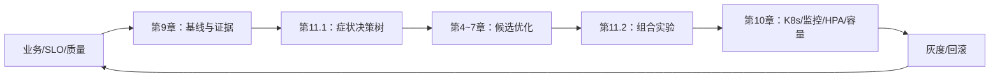
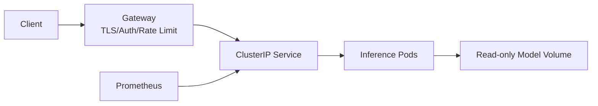

## 📑 目录

- [1. 实战边界：所有数据均为假设](#1-实战边界所有数据均为假设)
- [2. 业务场景：7B 主服务与 70B 升级路径](#2-业务场景7b-主服务与-70b-升级路径)
- [3. 从 SLO、质量与硬件开始](#3-从-slo质量与硬件开始)
- [4. 建立可复现基线](#4-建立可复现基线)
- [5. 用证据完成优化选型](#5-用证据完成优化选型)
- [6. 形成不可变发布包](#6-形成不可变发布包)
- [7. Kubernetes 基线部署](#7-kubernetes-基线部署)
- [8. 接入监控与告警](#8-接入监控与告警)
- [9. 设计 HPA 与过载保护](#9-设计-hpa-与过载保护)
- [10. 从单副本实验推导容量](#10-从单副本实验推导容量)
- [11. 70B 的并行与拓扑分支](#11-70b-的并行与拓扑分支)
- [12. 灰度、验收与回滚](#12-灰度验收与回滚)
- [13. 故障演练与持续校准](#13-故障演练与持续校准)
- [14. 端到端交付清单](#14-端到端交付清单)
- [总结](#-总结)
- [自我检验清单](#-自我检验清单)
- [官方参考](#-官方参考)

---

## 1. 实战边界：所有数据均为假设

本节设计一套完整但未执行的生产案例。

案例中的：

- 模型；
- SLO；
- 流量；
- Token 长度；
- GPU；
- 吞吐；
- 延迟；
- 副本数；
- 告警阈值；
- HPA 阈值；
- 成本；
- 发布比例；

都属于**教学假设**。

它们不是作者实测，不是硬件承诺，也不是生产推荐。

凡是数值示例，都应带有以下状态之一：

```yaml
data_status:
  assumption: "仅用于架构与手算"
  measured: "有原始产物才可使用"
  external_reference: "必须绑定来源、版本与日期"
  unknown: "保持 null"
```

本文统一把假设值放在 `assumptions` 下。

真实结果一律保留为 `null`。

下文 YAML 都是案例输入、部署对象或某个结果视图，不是新的实验 schema；真实项目统一写入 [11.4 的权威实验模板](./11.4-模块总结与持续学习.md#93-实验模板)。

```yaml
assumptions:
  peak_rps: 12
measurements:
  peak_rps: null
```

本案例不是再讲一遍前十章。

它把前十章作为工程工具调用：



## 2. 业务场景：7B 主服务与 70B 升级路径

### 2.1 产品背景

假设企业内部要上线一个客服助手。

请求先经过：

- TLS 网关；
- 身份认证；
- 租户限流；
- Prompt 安全检查；
- 模型服务；
- 输出安全检查。

服务有两条模型路径：

1. **7B 主路径**：处理大多数 FAQ 与流程问答；
2. **70B 升级路径**：处理少量复杂推理请求。

路由策略属于产品系统。

本节只讨论两个推理池。

### 2.2 7B 假设画像

```yaml
scenario_7b:
  data_status: "assumption"
  model:
    id: "Qwen/Qwen2.5-7B-Instruct"
    revision: "<approved-immutable-revision>"
    served_name: "support-7b"
  workload:
    peak_rps: 12
    burst_rps_30s: 18
    input_tokens: {p50: 900, p95: 3500, p99: 7000}
    output_tokens: {p50: 180, p95: 600, p99: 1000}
    reusable_prefix_ratio: 0.55
    streaming_ratio: 0.90
    tool_call_ratio: 0.15
  slo:
    availability: "99.9%"
    ttft_p95_ms: 900
    tpot_p95_ms: 45
    e2e_p99_ms: 30000
    error_rate_max: "0.5%"
  quality:
    task_suite: "support-eval-v3"
    schema_validity_min: "99.9%"
    tool_argument_accuracy_min: "<business-approved-threshold>"
```

这些值只帮助展示决策。

真实项目必须从获批且脱敏的 Trace 重新计算。

### 2.3 70B 假设画像

```yaml
scenario_70b:
  data_status: "assumption"
  model:
    id: "<approved-70b-instruct-model>"
    revision: "<approved-immutable-revision>"
    served_name: "support-70b"
  workload:
    peak_rps: 1.2
    burst_rps_30s: 2.0
    input_tokens: {p50: 2500, p95: 9000, p99: 16000}
    output_tokens: {p50: 500, p95: 1800, p99: 3000}
    reusable_prefix_ratio: 0.35
    streaming_ratio: 0.95
  slo:
    availability: "99.5%"
    ttft_p95_ms: 2500
    tpot_p95_ms: 80
    e2e_p99_ms: 120000
    error_rate_max: "1%"
```

70B 路径流量低，但上下文与输出更长。

它不应直接复制 7B 的 Batch、HPA 或超时。

### 2.4 业务路由边界

模型路由必须可解释：

- 哪些请求允许进入 70B；
- 70B 过载时是回落 7B、排队还是拒绝；
- 回落是否满足质量要求；
- 用户是否看到模型能力降级；
- 两条路径是否使用相同工具与 Schema；
- 成本预算由谁负责。

路由失败不能被算作推理服务的正常成功。

## 3. 从 SLO、质量与硬件开始

### 3.1 先定义硬门

```yaml
release_gates:
  quality:
    suite: "support-eval-v3"
    result: null
  safety:
    prompt_logging_disabled: true
    gateway_auth_required: true
    result: null
  performance:
    ttft_p95_ms: null
    tpot_p95_ms: null
    e2e_p99_ms: null
    error_rate: null
  resilience:
    n_plus_one_passed: null
    rollback_drill_passed: null
  decision: "pending"
```

先过质量，再谈性能。

原因不是形式主义。

量化、采样、结构化输出、Tool Calling 与模型版本都可能改变行为。

### 3.2 硬件候选不是结论

为 7B 假设两个候选：

```yaml
hardware_candidates_7b:
  - id: "gpu-class-a"
    memory_gib: "<inventory-value>"
    topology: "single-gpu-replica"
  - id: "gpu-class-b"
    memory_gib: "<inventory-value>"
    topology: "single-gpu-replica"
```

为 70B 假设：

```yaml
hardware_candidates_70b:
  - id: "node-class-x"
    gpus_per_node: 8
    intra_node_interconnect: "<verified-topology>"
  - id: "node-class-y"
    gpus_per_node: 4
    inter_node_network: "<verified-bandwidth>"
```

型号名称在真实项目中填写。

这里不编造某型号跑分。

### 3.3 显存预估只用于排除明显不可行方案

使用第 1、4、6 章的账本：

$$
M_{\text{replica}}
=M_{\text{weights}}
+M_{\text{KV}}
+M_{\text{runtime}}
+M_{\text{graph}}
+M_{\text{headroom}}
$$

7B 先比较：

- BF16 单卡是否可承载；
- 量化后是否释放有意义的 KV 空间；
- 长上下文下 KV 是否成为主项。

70B 先比较：

- BF16 所需 TP；
- 量化后可能的 TP；
- 是否能留在单节点高速互联域；
- 发布 Surge 是否还能调度。

估算不能替代启动与压测。

### 3.4 GPU 之外的资源

还要预算：

- Tokenizer CPU；
- 容器主机内存；
- `/dev/shm`；
- 模型下载或本地缓存；
- 网关连接；
- 指标抓取；
- P/D Connector 网络；
- 日志与审计；
- 节点临时磁盘。

GPU 数足够不等于 Pod 可调度。

## 4. 建立可复现基线

### 4.1 冻结版本

```bash
export MODEL_ID="Qwen/Qwen2.5-7B-Instruct"
export MODEL_REVISION="<approved-immutable-revision>"
export TOKENIZER_REVISION="${MODEL_REVISION}"
export SERVED_NAME="support-7b"
export IMAGE="vllm/vllm-openai:<pinned-version>"
export OUT="artifacts/baseline-7b"

mkdir -p "${OUT}"
docker pull "${IMAGE}"
docker inspect "${IMAGE}" --format='{{index .RepoDigests 0}}' \
  | tee "${OUT}/image-digest.txt"
```

若组织禁止运行时联网下载模型，应先进入批准的模型制品流程。

### 4.2 验证宿主机

```bash
nvidia-smi -q > "${OUT}/nvidia-smi.txt"
docker run --rm --gpus all "${IMAGE}" nvidia-smi \
  > "${OUT}/container-nvidia-smi.txt"
```

同时记录：

- 驱动；
- CUDA；
- GPU 型号；
- PCIe/NVLink 拓扑；
- 功耗模式；
- MIG；
- 邻居负载。

### 4.3 启动无复杂优化基线

```bash
docker run --rm --gpus all \
  --shm-size=8g \
  -p 127.0.0.1:8000:8000 \
  -e HF_TOKEN \
  "${IMAGE}" \
  "${MODEL_ID}" \
  --revision "${MODEL_REVISION}" \
  --served-model-name "${SERVED_NAME}" \
  --gpu-memory-utilization 0.85
```

`0.85` 是教学起点，不是建议最优值。

只绑定 `127.0.0.1`，避免未认证端口暴露。

Token 来自安全的环境注入或 Secret 系统。

不要写入 Dockerfile、Git 或命令示例的明文。

### 4.4 冒烟测试

```bash
curl -sS http://127.0.0.1:8000/v1/chat/completions \
  -H 'Content-Type: application/json' \
  -d '{
    "model": "support-7b",
    "messages": [{"role": "user", "content": "只回答：ready"}],
    "max_tokens": 8,
    "temperature": 0
  }' | jq .
```

冒烟不只看 `200`：

- 模型名；
- JSON Schema；
- Finish Reason；
- 流式首包；
- 客户端取消；
- 超长输入拒绝；
- 超长输出上限；
- Tool Calling；
- 非法请求；
- 网关鉴权。

### 4.5 质量基线

```yaml
quality_run:
  suite_snapshot: "support-eval-v3"
  model_revision: "<fixed>"
  tokenizer_revision: "<fixed>"
  chat_template_digest: "<fixed>"
  sampling:
    temperature: "<fixed>"
    top_p: "<fixed>"
    seed_policy: "<fixed>"
  raw_artifact_uri: null
  result: null
```

若是非确定采样，应定义重复次数与容忍方式。

不能仅比较单条输出文本。

### 4.6 性能基线

压测至少包含：

1. 单请求；
2. 长度分桶；
3. 到达率阶梯；
4. 生产 Trace Replay；
5. 冷/热缓存；
6. 30 秒突发；
7. 稳态长跑。

随机数据只验证管道：

```bash
vllm bench serve \
  --backend vllm \
  --base-url http://127.0.0.1:8000 \
  --model support-7b \
  --dataset-name random \
  --num-prompts 1000 \
  --request-rate 4 \
  | tee "${OUT}/synthetic-smoke.log"
```

这条命令的结果不得写入生产容量。

### 4.7 基线结果模板

```yaml
baseline_7b:
  status: "not-run"
  environment_artifact: null
  quality_artifact: null
  workload_artifact: null
  measurements:
    safe_rps_per_replica: null
    ttft_p95_ms: null
    tpot_p95_ms: null
    e2e_p99_ms: null
    request_goodput: null
    output_token_goodput: null
    gpu_memory_peak_gib: null
    kv_cache_peak_ratio: null
    error_rate: null
```

## 5. 用证据完成优化选型

### 5.1 假设的基线症状

为演示决策，假设观察到：

```yaml
teaching_observation_7b:
  data_status: "assumption"
  symptom:
    ttft_p95: "fails under burst"
    tpot_p95: "passes"
    steady_state_goodput: "below capacity target"
  evidence:
    queue: "rises during long-prompt bursts"
    prefill: "correlates with input length"
    prefix_reuse: "material"
    decode: "not primary bottleneck"
```

这不是实测结果。

它只是为了调用 11.1 的决策树。

### 5.2 候选排序

根据症状：

1. 先验证 Chunked Prefill；
2. 再验证真实前缀下 Prefix Cache；
3. 再扫描 SLO 内批 token 预算；
4. 若显存限制并发，再验证量化；
5. 暂不引入 Spec Decode；
6. 暂不引入 P/D 解耦。

为什么不先 Spec：

- 当前 TPOT 通过；
- 主要问题在 Queue 与 Prefill；
- Spec 不直达主瓶颈。

为什么不先 P/D：

- 复杂度高；
- 先验证简单方案能否满足目标；
- 只有阶段干扰证据充分时才升级架构。

### 5.3 单变量实验 A：Chunked Prefill

```yaml
experiment_a:
  hypothesis: "长 Prefill 阻塞是突发 TTFT 超标的主因"
  primary_variable: "chunked_prefill"
  baseline: "off"
  candidate: "on with one fixed chunk policy"
  fixed:
    - model_revision
    - precision
    - prefix_cache
    - batch_budget
    - graph_mode
    - workload_trace
  measure:
    - ttft_by_input_bucket
    - tpot
    - queue_time
    - goodput
    - preemption
  result: null
```

候选可能降低长请求对 Decode 的干扰。

也可能增加调度开销。

必须测。

### 5.4 单变量实验 B：Prefix Cache

固定 A 的保留结果。

三组前缀：

- 冷缓存/随机前缀；
- 真实重复率；
- 全相同前缀上限。

记录：

- 命中率；
- 驱逐；
- KV 占用；
- TTFT；
- 每 Pod 热点；
- 租户边界；
- Goodput。

如果真实组无收益，则不因上限组漂亮而上线。

### 5.5 单变量实验 C：批预算

固定 Chunked Prefill 与 Cache 选择。

扫描：

```yaml
batch_budget_scan:
  values: ["small", "medium", "large"]
  actual_values: null
  stop_if:
    - "ttft_p95 fails"
    - "e2e_p99 fails"
    - "oom or preemption rises"
```

目标不是最大吞吐。

目标是 SLO 内最大 Goodput。

### 5.6 条件实验 D：量化

只有以下任一成立才进入：

- 权重显存挤压 KV；
- BF16 单卡不可行；
- 成本目标仍未达到；
- 目标硬件有已验证高效 Kernel。

量化实验先单项，再与 Cache/Batch 做 2×2。

质量门失败立即停止。

### 5.7 选型记录

```yaml
selected_configuration_7b:
  data_status: "pending-measurement"
  chunked_prefill:
    selected: null
    evidence: null
  prefix_cache:
    selected: null
    evidence: null
  batch_budget:
    selected_value: null
    evidence: null
  quantization:
    selected_format: null
    quality_evidence: null
  speculative_decoding:
    selected: false
    reason: "not a current bottleneck hypothesis"
  pd_disaggregation:
    selected: false
    reason: "defer until simpler path is disproven"
```

## 6. 形成不可变发布包

### 6.1 发布包清单

```yaml
release_bundle:
  name: "support-7b-r1"
  image: "registry.example.com/ai/support-7b@sha256:<digest>"
  model:
    id: "Qwen/Qwen2.5-7B-Instruct"
    revision: "<approved-immutable-revision>"
  tokenizer_revision: "<approved-immutable-revision>"
  chat_template_digest: "<digest>"
  engine_args_file: "config/engine-7b-r1.yaml"
  quality_artifact: "<uri>"
  benchmark_artifact: "<uri>"
  sbom: "<uri>"
  signature: "<uri>"
```

### 6.2 最小 Dockerfile

```dockerfile
FROM vllm/vllm-openai:<pinned-version>

USER root
RUN groupadd --gid 10001 app \
 && useradd --uid 10001 --gid 10001 --create-home app

USER 10001:10001
ENTRYPOINT ["vllm", "serve"]
```

基础镜像是否支持非 root、模型缓存目录权限与设备访问，要在目标集群验证。

### 6.3 构建、扫描、签名

```bash
docker build -t registry.example.com/ai/support-7b:r1 .
trivy image registry.example.com/ai/support-7b:r1
docker push registry.example.com/ai/support-7b:r1
docker inspect registry.example.com/ai/support-7b:r1 \
  --format='{{index .RepoDigests 0}}'
```

工具名只是示例。

采用组织批准的供应链流程。

### 6.4 Secret 边界

模型 Token、API Key 与网关凭据分开管理。

推理 Pod 如果从本地只读制品加载模型，可能不需要外部模型 Token。

不要给 Pod 多余 Kubernetes API 权限。

## 7. Kubernetes 基线部署

### 7.1 安全与流量边界



要求：

- 外部流量只能经过网关；
- Service 使用 ClusterIP；
- 指标端点仅监控域可访问；
- NetworkPolicy 默认拒绝；
- Pod 非 root；
- 文件系统与能力最小化；
- Prompt 不默认写日志。

### 7.2 ServiceAccount 修正后的写法

```yaml
apiVersion: v1
kind: ServiceAccount
metadata:
  name: support-7b
  namespace: inference
automountServiceAccountToken: false
```

这不是把 `automountServiceAccountToken` 写到 Deployment。

它属于 ServiceAccount 或 Pod Spec。

这里在 ServiceAccount 上关闭自动挂载。

如果未来 Sidecar 确实需要 Kubernetes API：

1. 单独审查权限；
2. 创建最小 Role；
3. 创建 RoleBinding；
4. 仅挂载所需受众的短期 Token；
5. 不直接授予 `cluster-admin`。

### 7.3 7B Deployment 基线

```yaml
apiVersion: apps/v1
kind: Deployment
metadata:
  name: support-7b
  namespace: inference
  labels:
    app.kubernetes.io/name: support-7b
    app.kubernetes.io/version: r1
spec:
  replicas: 2
  strategy:
    type: RollingUpdate
    rollingUpdate:
      maxSurge: 1
      maxUnavailable: 0
  selector:
    matchLabels:
      app.kubernetes.io/name: support-7b
  template:
    metadata:
      labels:
        app.kubernetes.io/name: support-7b
        app.kubernetes.io/version: r1
    spec:
      serviceAccountName: support-7b
      automountServiceAccountToken: false
      terminationGracePeriodSeconds: 180
      nodeSelector:
        accelerator: "<verified-cluster-gpu-label>"
      topologySpreadConstraints:
        - maxSkew: 1
          topologyKey: topology.kubernetes.io/zone
          whenUnsatisfiable: ScheduleAnyway
          labelSelector:
            matchLabels:
              app.kubernetes.io/name: support-7b
      containers:
        - name: server
          image: registry.example.com/ai/support-7b@sha256:<digest>
          args:
            - Qwen/Qwen2.5-7B-Instruct
            - --revision=<approved-immutable-revision>
            - --served-model-name=support-7b
            - --gpu-memory-utilization=<measured-safe-value>
          ports:
            - name: http
              containerPort: 8000
          resources:
            requests:
              cpu: "4"
              memory: 24Gi
              nvidia.com/gpu: "1"
            limits:
              cpu: "8"
              memory: 32Gi
              nvidia.com/gpu: "1"
          securityContext:
            runAsNonRoot: true
            allowPrivilegeEscalation: false
            capabilities:
              drop: ["ALL"]
          startupProbe:
            httpGet:
              path: /health
              port: http
            periodSeconds: 10
            failureThreshold: 120
          readinessProbe:
            httpGet:
              path: /health
              port: http
            periodSeconds: 5
            failureThreshold: 3
          livenessProbe:
            httpGet:
              path: /health
              port: http
            periodSeconds: 10
            failureThreshold: 6
          volumeMounts:
            - name: dshm
              mountPath: /dev/shm
      volumes:
        - name: dshm
          emptyDir:
            medium: Memory
            sizeLimit: 8Gi
```

所有资源、标签、参数和探针窗口均为待测占位。

`replicas: 2` 仅属于尚未启用 HPA 的基线。

### 7.4 探针职责

Startup Probe：

- 允许模型加载与编译；
- 未成功前抑制 Liveness；
- 窗口高于冷启动 P99。

Readiness Probe：

- 决定是否接流量；
- 应反映服务是否能处理请求；
- 预热策略若独立，应避免冷副本过早等权接流量。

Liveness Probe：

- 检测无法自愈的卡死；
- 不能因短暂过载频繁重启模型；
- 阈值要比 Readiness 更谨慎。

### 7.5 Service

```yaml
apiVersion: v1
kind: Service
metadata:
  name: support-7b
  namespace: inference
  labels:
    app.kubernetes.io/name: support-7b
spec:
  type: ClusterIP
  selector:
    app.kubernetes.io/name: support-7b
  ports:
    - name: http
      port: 8000
      targetPort: http
```

### 7.6 发布前校验

```bash
kubectl apply --dry-run=server -f k8s/
kubectl diff -f k8s/
kubectl apply -f k8s/
kubectl rollout status deployment/support-7b \
  -n inference \
  --timeout=25m
kubectl get pods -n inference \
  -l app.kubernetes.io/name=support-7b \
  -o wide
```

还要检查：

- GPU Device Plugin；
- 节点标签；
- GPU 配额；
- 故障域；
- 镜像拉取；
- 模型卷；
- NetworkPolicy；
- Gateway Backend 健康。

## 8. 接入监控与告警

### 8.1 三层指标

用户层：

- 成功率；
- 错误码；
- TTFT；
- TPOT；
- E2E；
- 取消；
- 降级到 7B/70B 的比例。

调度与引擎层：

- Running；
- Waiting；
- Queue Time；
- Batch Token；
- KV 使用率；
- Cache 命中/驱逐；
- Preemption/Recompute；
- Prefix 分桶；
- Spec Acceptance，若启用；
- Graph Replay/Fallback，若可用。

基础设施层：

- GPU 利用率；
- 显存；
- 功耗与时钟；
- XID；
- CPU；
- 内存；
- 网络；
- Pod 重启；
- Pending；
- Ready；
- 节点状态。

### 8.2 指标语义先于查询

不同 vLLM 版本指标名会变化。

先保存当前端点：

```bash
kubectl port-forward \
  -n inference \
  service/support-7b \
  8000:8000

curl -sS http://127.0.0.1:8000/metrics \
  > artifacts/support-7b-metrics.txt
```

对每个指标记录：

- 名称；
- 类型；
- 单位；
- Label；
- 重启行为；
- 是否按 Pod；
- 是否包含失败请求。

### 8.3 ServiceMonitor

```yaml
apiVersion: monitoring.coreos.com/v1
kind: ServiceMonitor
metadata:
  name: support-7b
  namespace: inference
spec:
  selector:
    matchLabels:
      app.kubernetes.io/name: support-7b
  endpoints:
    - port: http
      path: /metrics
      interval: 15s
```

具体 CRD、命名空间选择与认证由集群监控方案决定。

### 8.4 Dashboard 叙事顺序

第一行：用户是否受影响

- 请求率；
- 成功率；
- TTFT/TPOT/E2E；
- 7B/70B 路由比例。

第二行：是否在排队

- Waiting；
- Queue Time；
- Running；
- Batch。

第三行：显存与缓存

- KV；
- Prefix 命中；
- Preemption；
- OOM。

第四行：基础设施

- GPU；
- CPU；
- 网络；
- Pod/Node。

Dashboard 应让值班者沿 11.1 的决策树阅读。

### 8.5 告警

硬告警：

- SLO Burn Rate；
- 错误/超时；
- 无 Ready 副本；
- GPU XID；
- 持续 OOM。

预警：

- Waiting 持续增长；
- KV 接近安全边界；
- Pending GPU Pod；
- HPA 达到上限；
- 冷启动时间增长；
- Prefix 热点不均；
- 70B 队列接近降级门。

阈值必须来自 SLO 与基线。

不要复制本案例假设数值。

## 9. 设计 HPA 与过载保护

### 9.1 为什么不只看 GPU 利用率

GPU 利用率高可能表示：

- 健康高吞吐；
- 长 Prefill；
- 过载；
- 低效 Kernel；
- 通信等待；
- 无法满足 P99。

在线服务更适合使用：

- Waiting；
- Queue Time；
- SLO Goodput；
- 组合指标。

### 9.2 自定义指标链路

需要明确：

```text
vLLM /metrics
  → Prometheus
    → Adapter / External Metrics
      → Kubernetes Custom Metrics API
        → HPA
```

HPA 引用的名字不是随便写一个 Prometheus 指标名就会生效。

必须先验证：

```bash
kubectl get --raw \
  /apis/custom.metrics.k8s.io/v1beta1 \
  | jq .
```

### 9.3 HPA 修正后的清单

```yaml
apiVersion: autoscaling/v2
kind: HorizontalPodAutoscaler
metadata:
  name: support-7b
  namespace: inference
spec:
  scaleTargetRef:
    apiVersion: apps/v1
    kind: Deployment
    name: support-7b
  minReplicas: 3
  maxReplicas: 12
  behavior:
    scaleUp:
      stabilizationWindowSeconds: 0
      policies:
        - type: Pods
          value: 2
          periodSeconds: 60
    scaleDown:
      stabilizationWindowSeconds: 900
      policies:
        - type: Percent
          value: 25
          periodSeconds: 300
  metrics:
    - type: Pods
      pods:
        metric:
          name: inference_waiting_requests
        target:
          type: AverageValue
          averageValue: "2"
```

`3`、`12`、`2`、`60`、`900` 与 `25%` 全是假设占位值。

真实值要由容量与冷启动实验确定。

### 9.4 HPA 与 Deployment 的所有权修正

HPA 接管后：

- 从声明式 Deployment 删除 `spec.replicas`；
- GitOps 不再持续写回固定副本；
- 若工具显示该字段差异，配置忽略；
- `minReplicas` 成为稳态下限；
- 发布流程额外处理 Surge。

否则会发生：

```text
HPA 扩到 6
  → GitOps 重新 apply replicas: 2
    → Deployment 缩回 2
      → HPA 再扩容
```

这不是 HPA 抖动，而是两个控制器争夺同一字段。

### 9.5 冷启动决定 HPA 上限

假设流量 30 秒内突增，但新 Pod 需要数分钟 Ready。

HPA 无法追上突发。

因此必须同时有：

- 最小热副本；
- 预测性扩容，若业务周期明确；
- GPU 节点容量；
- 有界队列；
- 快速拒绝；
- 客户端抖动退避；
- 7B/70B 降级规则。

### 9.6 过载保护

网关执行：

- 每租户并发限制；
- Token Budget；
- 最大输入；
- 最大输出；
- 请求截止时间；
- 有界队列；
- 超预算返回 429/503；
- 重试次数上限；
- 离线流量隔离。

模型服务不能用无限排队“保持零错误”。

无限排队只会把错误变成超时与资源耗尽。

### 9.7 缩容排空

缩容前要：

- 停止接收新请求；
- 等待流式请求完成或达到宽限；
- 从 Prefix-aware 路由移除；
- 观察连接与 Active Request；
- 到期后终止；
- 避免缓存重分布造成瞬时热点。

`terminationGracePeriodSeconds` 要根据真实最长请求与业务截止时间确定。

## 10. 从单副本实验推导容量

### 10.1 找安全吞吐，不找极限吞吐

单副本压测逐档提高到达率。

每档记录：

- 到达率；
- 完成率；
- Goodput；
- Waiting；
- TTFT；
- TPOT；
- E2E；
- Error；
- KV；
- GPU；
- 稳态时长。

安全吞吐是所有硬门仍通过的最高稳定档。

### 10.2 7B 假设手算

以下全部是假设：

```yaml
capacity_assumptions_7b:
  peak_rps: 12
  safe_rps_per_replica: 2.4
  target_load_factor: 0.70
  failure_reserve_replicas: 1
  release_surge_replicas: 1
  gpu_per_replica: 1
```

稳态副本：

$$
N_{\text{steady}}
=
\left\lceil
\frac{12}
{2.4\times0.70}
\right\rceil
=
\lceil7.15\rceil
=8
$$

加入 N+1：

$$
N_{\text{serving}}=8+1=9
$$

发布时还需要一个 Surge：

$$
G_{\text{release}}=(9+1)\times1=10
$$

这不表示生产一定需要 10 张 GPU。

它表示在这些假设下，容量计划必须为发布峰值检查 10 个单 GPU Slot。

### 10.3 突发容量

如果 30 秒突发达到 18 RPS：

- 新 Pod 是否能在 30 秒内 Ready；
- 热副本能否吸收；
- 队列预算允许多少等待；
- 超过后何时拒绝；
- 是否需要预扩容。

不能把 18 RPS 直接代入稳态公式而忽略持续时间。

### 10.4 节点与故障域

假设每节点 4 张 GPU。

10 个 Slot 至少跨 3 个节点。

但还要检查：

- 单节点故障后剩余容量；
- Zone 故障目标；
- Pod Spread；
- 节点升级；
- DaemonSet 占用；
- GPU 碎片；
- 其他模型共享；
- 配额。

### 10.5 成本

```yaml
cost_inputs:
  gpu_hourly_cost: null
  request_goodput: null
  output_token_goodput: null
  reserved_capacity_ratio: null
```

单位请求成本：

$$
C_{\text{request}}
=
\frac{C_{\text{GPU/hour}}\times G}
{3600\times Q_{\text{good request/s}}}
$$

分母必须是通过 SLO 的 Goodput。

### 10.6 容量结果模板

```yaml
capacity_result_7b:
  status: "not-run"
  workload_snapshot: null
  safe_rps_per_replica: null
  steady_replicas: null
  failure_reserve: null
  release_surge: null
  total_gpu_slots: null
  node_topology_check: null
  quota_check: null
  cost_per_request: null
  approved_by: null
```

## 11. 70B 的并行与拓扑分支

### 11.1 70B 不是把 7B 的 GPU 乘十

70B 会改变：

- 权重承载；
- TP/PP；
- 通信；
- 单副本 GPU 数；
- 可调度性；
- 发布 Surge；
- 冷启动；
- 故障半径；
- 成本。

### 11.2 候选矩阵

教学候选：

| 方案 | 精度 | TP | 拓扑 | 状态 |
|---|---|---:|---|---|
| A | BF16 | 8 | 单节点 | 待测 |
| B | Quant | 8 | 单节点 | 待测 |
| C | Quant | 4 | 单节点 | 待测 |
| D | BF16 | 8 | 跨节点 | 仅必要时 |

实验顺序：

1. 先确认能否加载；
2. 再过质量门；
3. 再测单请求；
4. 再测并发；
5. 再测拓扑；
6. 最后算副本容量。

### 11.3 TP 证据

记录：

- 每 Rank 显存；
- NCCL 时间；
- GPU 空洞；
- TPOT；
- Goodput；
- 网络有效带宽；
- 节点放置；
- Rank 失败行为。

如果 TP=4 量化方案质量通过且满足 SLO，它可能比 BF16 TP=8 更易部署。

但不能预设。

### 11.4 70B Deployment 关键差异

```yaml
spec:
  template:
    metadata:
      labels:
        app.kubernetes.io/name: support-70b
    spec:
      serviceAccountName: support-70b
      automountServiceAccountToken: false
      containers:
        - name: server
          args:
            - <approved-70b-model>
            - --tensor-parallel-size=<measured-choice>
          resources:
            requests:
              nvidia.com/gpu: "<tp-size>"
            limits:
              nvidia.com/gpu: "<tp-size>"
```

真实清单还需要：

- 保证一个 Pod 的多张 GPU 落在同一节点；
- 节点亲和；
- 机型标签；
- 拓扑约束；
- 可能的 RDMA/NCCL 配置；
- 更长 Startup Probe；
- 更大主机内存；
- 更严格 Surge 计划。

### 11.5 70B 容量假设

```yaml
capacity_assumptions_70b:
  data_status: "assumption"
  peak_rps: 1.2
  safe_rps_per_replica: 0.35
  target_load_factor: 0.65
  tensor_parallel_size: 4
  failure_reserve_replicas: 1
```

稳态：

$$
N
=
\left\lceil
\frac{1.2}
{0.35\times0.65}
\right\rceil
=
\lceil5.28\rceil
=6
$$

加 N+1 是 7 个副本。

若 TP=4：

$$
G_{\text{serving}}=7\times4=28
$$

发布再加一个副本：

$$
G_{\text{release}}=32
$$

这个假设结果非常昂贵。

它会触发业务决策：

- 是否限制 70B 流量；
- 是否增加排队预算；
- 是否允许降级到 7B；
- 是否采用批处理离线路径；
- 是否重新评估模型；
- 是否量化；
- 是否共享池。

容量手算的价值就是提前暴露这种经济边界。

### 11.6 是否进入 P/D 解耦

只有当证据显示：

- 长 Prefill 持续干扰 Decode；
- 混合服务难以同时满足 TTFT/TPOT；
- 两侧容量形态明显不同；
- KV Transfer 可接受；
- 团队能维护双池与 Connector；

才进入 P/D 实验。

P/D 候选必须测：

- Prefill Queue；
- Decode Queue；
- Transfer Time；
- KV Bytes；
- 两池配比；
- 故障；
- 回退。

## 12. 灰度、验收与回滚

### 12.1 为什么使用独立 Canary Deployment

GPU 服务常缺少 RollingUpdate Surge。

独立 Canary 更容易：

- 精确控制 GPU 数；
- 区分指标；
- 绑定不同镜像与模型；
- 由网关调权；
- 一键切回稳定 Service。

### 12.2 灰度对象

```text
support-7b-stable Deployment
support-7b-canary Deployment
support-7b-stable Service
support-7b-canary Service
Gateway weighted routing
```

Canary 不应与 Stable 共用无法区分的版本标签。

### 12.3 灰度阶段

阶段 0：离线门

- 镜像扫描；
- 模型与许可证审批；
- 质量评测；
- 合成冒烟；
- 代表性压测。

阶段 1：影子或复制流量

- 不向用户返回候选输出；
- 注意敏感数据授权；
- 比较兼容性；
- 不把影子流量计入用户成功。

阶段 2：内部用户

- 明确用户群；
- 验证 Tool/Schema；
- 检查日志与追踪。

阶段 3：小比例真实流量

- 假设从 1% 起；
- 比较相同请求分桶；
- 观察至少覆盖预期流量周期。

阶段 4：逐步扩大

- 5%；
- 25%；
- 50%；
- 100%。

比例只是示例，不是固定建议。

### 12.4 比较方式

新旧版本按以下维度分层：

- 输入长度；
- 输出长度；
- 租户；
- Tool/Schema；
- Cache 命中；
- Pod；
- GPU；
- 时间窗口。

只比较整体均值会受到流量组合偏差。

### 12.5 硬回退门

立即回退：

- 质量评测失败；
- Tool 参数错误增加；
- Schema 合法率下降；
- 安全策略失败；
- 错误、超时、OOM 超阈值；
- TTFT/TPOT/E2E 超 SLO；
- P99 持续恶化；
- GPU XID；
- HPA/指标不可用；
- 日志出现敏感内容；
- 新版本无法稳定 Ready。

### 12.6 回退范围

回退包包括：

- 镜像 digest；
- 模型 revision；
- Tokenizer；
- Chat Template；
- 量化格式；
- Engine Args；
- 路由权重；
- Cache Compatibility；
- P/D Connector；
- HPA 指标规则；
- Dashboard 与告警版本。

不能只执行：

```bash
kubectl rollout undo deployment/support-7b
```

这条命令只能回退 Deployment 历史。

如果路由、模型卷或 HPA 规则独立发布，它不会自动恢复。

### 12.7 独立 Canary 回退

优先操作：

1. 网关把 Canary 权重设为 0；
2. 确认新请求全部进入 Stable；
3. 排空 Canary；
4. 保留日志与产物；
5. 缩容 Canary；
6. 恢复相关配置；
7. 验证 Stable SLO；
8. 创建复盘记录。

### 12.8 验收门

```yaml
acceptance:
  quality_passed: null
  security_passed: null
  slo_passed: null
  capacity_passed: null
  n_plus_one_passed: null
  scale_up_drill_passed: null
  rollback_drill_passed: null
  monitoring_complete: null
  decision: "pending"
```

## 13. 故障演练与持续校准

### 13.1 Pod 故障

演练：

```bash
kubectl delete pod \
  -n inference \
  -l app.kubernetes.io/name=support-7b \
  --field-selector=status.phase=Running
```

真实演练应精确选择一个 Pod，避免批量删除。

观察：

- 流量摘除；
- Waiting；
- SLO；
- Replacement Pending；
- GPU 调度；
- Ready 时间；
- Cache 冷却。

### 13.2 节点故障

验证：

- 同节点副本数；
- Zone Spread；
- 剩余容量；
- GPU 节点补充时间；
- HPA 是否只创建 Pending Pod；
- 过载保护是否生效。

### 13.3 指标故障

如果 Custom Metrics API 不可用：

- HPA 如何行为；
- 是否保持最近副本；
- 告警是否触发；
- 值班是否能手动扩容；
- GitOps 是否会覆盖；
- 过载保护是否独立存在。

### 13.4 70B Rank 故障

一个 Rank 失败通常使整个 TP 副本不可用。

演练关注：

- Pod 是否整体退出；
- 流量是否快速摘除；
- NCCL 超时；
- Replacement 是否能获得整组 GPU；
- 剩余副本是否满足降级目标；
- 请求是否重复执行。

### 13.5 容量校准周期

触发复测：

- 模型升级；
- Tokenizer 或 Chat Template 变化；
- 引擎升级；
- GPU/驱动升级；
- 量化格式变化；
- 流量长度变化；
- Prefix 重复率变化；
- Tool/VLM 比例变化；
- HPA 指标变化；
- SLO 变化。

每个容量结论有“保质期”。

### 13.6 结果记录

```yaml
production_validation:
  release: "support-7b-r1"
  status: "not-run"
  measured_at: null
  workload_snapshot: null
  artifacts: []
  gates:
    quality: null
    ttft: null
    tpot: null
    e2e: null
    error_rate: null
    capacity: null
    resilience: null
  decision: "pending"
  expires_when:
    - "model changes"
    - "engine changes"
    - "hardware changes"
    - "workload distribution changes"
```

## 14. 端到端交付清单

前文已给出每一步的操作和门禁，这里只定义交付物与责任边界，避免把相同操作再列一次。实验数据统一落到 [11.4 的权威实验模板](./11.4-模块总结与持续学习.md#93-实验模板)。

### 14.1 业务与模型负责人

- **需求契约**：7B/70B 路由语义、SLO 优先级、质量集、最大 Token、超时与输入/输出分布。
- **质量结论**：基线、候选和 Canary 使用同一质量快照；所有假设、引用、实测和未知有明确状态。
- **验收签字**：质量、Schema/Tool 与安全任一硬门失败时，有权阻断发布。

### 14.2 性能与推理负责人

- **实验包**：不可变模型/Tokenizer/镜像/拓扑、真实 workload snapshot、原始产物和按 11.1/11.2 得出的选型结论。
- **容量结论**：单副本安全 Goodput、N+1/Surge、70B TP 拓扑、冷启动和失效条件。
- **可解释性**：采用与不采用的优化都有瓶颈证据、控制变量结果和回退单位。

### 14.3 平台与 SRE

- **运行清单**：Kubernetes 安全边界、GPU/CPU/内存与故障域、探针、网关、观测、HPA 所有权和过载保护。
- **资源承诺**：GPU 配额、节点 Slot、最小热容量以及升级期间的剩余容量。
- **演练证据**：Pod/节点/指标链路故障和缩容排空的恢复时间、告警与用户影响。

### 14.4 发布与事故负责人

- **不可变发布包**：镜像、模型、参数、路由、Schema 与兼容状态能够作为整体升级和回退。
- **灰度决定**：Canary 指标能按版本和请求分桶，决定记录引用原始实验产物。
- **值班手册**：明确停止放量、回退、降级和升级人工处置的触发条件与负责人。

## 📝 总结

这个案例没有提供任何伪装成实测的性能数字。

它提供的是一条可替换的工程链：

```text
SLO/质量/硬件
  → 可复现基线
    → 症状与证据
      → 单项和组合选型
        → 不可变发布包
          → Kubernetes
            → 监控与 HPA
              → 容量
                → 灰度与回滚
```

7B 与 70B 的差别也不只是模型大小。

70B 会把并行、拓扑、调度、故障半径和发布容量变成一等约束。

真正的生产交付物不是一份 YAML，而是能解释、能复现、能扩缩、能回退的证据闭环。

## ✅ 自我检验清单

- [ ] 我能区分教学假设、外部引用、实测与未知
- [ ] 我能从 SLO 症状推导候选优化，而不是从功能列表反推
- [ ] 我能解释 7B 横向扩副本与 70B 多 GPU 拓扑的不同故障半径
- [ ] 我知道业务/模型、推理性能、平台 SRE、发布事故四方分别交付什么
- [ ] 我能指出谁拥有质量阻断、容量承诺、灰度和回退决定
- [ ] 我能用 11.4 的同一实验记录追溯上线结论及其失效条件

## 📚 官方参考

- [vLLM：OpenAI-Compatible Server](https://docs.vllm.ai/en/latest/serving/openai_compatible_server.html)
- [vLLM：Docker Deployment](https://docs.vllm.ai/en/latest/deployment/docker.html)
- [vLLM：Kubernetes Deployment](https://docs.vllm.ai/en/latest/deployment/k8s.html)
- [vLLM：Benchmark CLI](https://docs.vllm.ai/en/latest/cli/bench/serve.html)
- [vLLM：Parallelism and Scaling](https://docs.vllm.ai/en/latest/serving/parallelism_scaling.html)
- [Kubernetes：Deployments](https://kubernetes.io/docs/concepts/workloads/controllers/deployment/)
- [Kubernetes：Service Accounts](https://kubernetes.io/docs/concepts/security/service-accounts/)
- [Kubernetes：Probes](https://kubernetes.io/docs/tasks/configure-pod-container/configure-liveness-readiness-startup-probes/)
- [Kubernetes：Horizontal Pod Autoscaling](https://kubernetes.io/docs/tasks/run-application/horizontal-pod-autoscale/)
- [Kubernetes：Pod Topology Spread Constraints](https://kubernetes.io/docs/concepts/scheduling-eviction/topology-spread-constraints/)
- [Kubernetes：Security Checklist](https://kubernetes.io/docs/concepts/security/security-checklist/)
- [Prometheus：Alerting Practices](https://prometheus.io/docs/practices/alerting/)
- [Google SRE：Handling Overload](https://sre.google/sre-book/handling-overload/)
