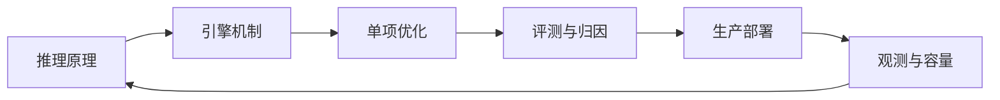
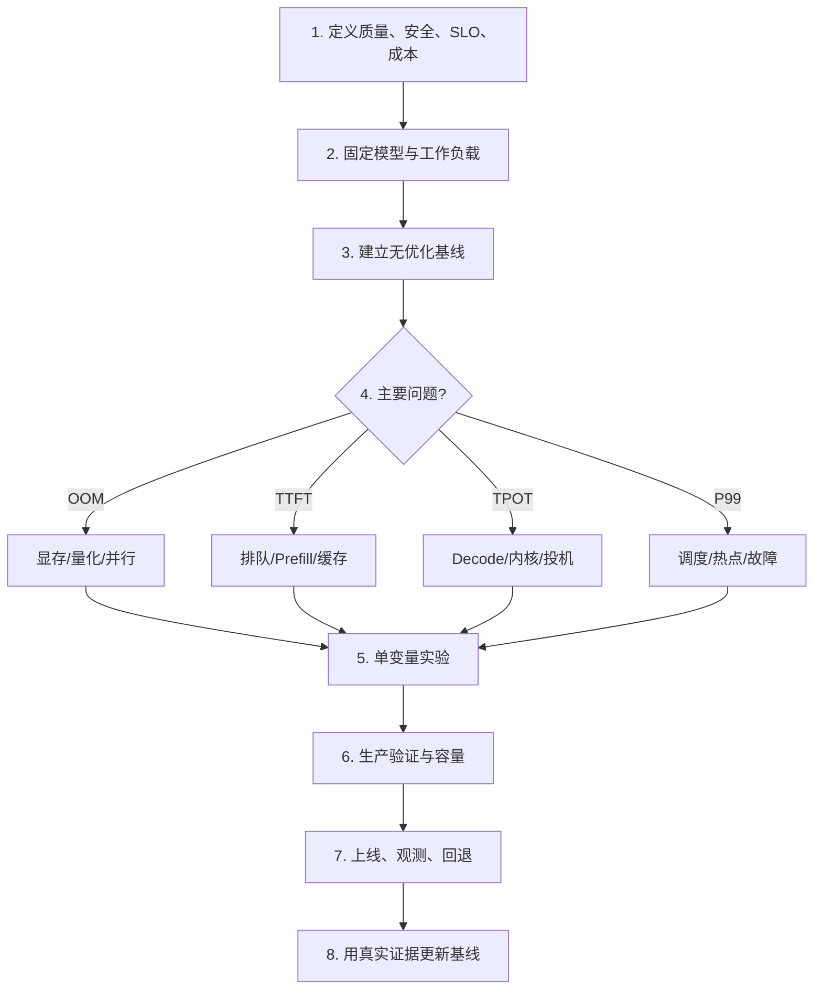

## 📑 目录
- [1. 从会跑到会负责](#1-从会跑到会负责)
- [2. 模块四知识地图](#2-模块四知识地图)
- [3. 一条可执行的工作流](#3-一条可执行的工作流)
- [4. 核心权衡回顾](#4-核心权衡回顾)
- [5. 不伪造数据的实验模板](#5-不伪造数据的实验模板)
- [6. 三阶段持续学习路线](#6-三阶段持续学习路线)
- [7. 如何跟踪快速变化的生态](#7-如何跟踪快速变化的生态)
- [8. 最终边界与责任](#8-最终边界与责任)
- [总结](#-总结)
- [自我检验清单](#-自我检验清单)
- [官方参考](#-官方参考)
---
## 1. 从会跑到会负责
模块四从一个问题开始：模型已经训练好，怎样让它稳定、快速、经济地回答请求？ 到这里，答案不再是一条启动命令，而是一套可解释、可测量、可回滚的系统。 学习推理优化像学习城市交通：
- 模型计算是道路
- KV Cache 是停车空间
- 调度器是红绿灯
- Continuous Batching 是动态拼车
- 多副本与路由是路网
- 监控和容量规划是交通指挥中心
只拓宽一段道路，拥堵可能转移到下一个路口。 因此收官时最重要的能力，是识别系统瓶颈并用证据做取舍。

## 2. 模块四知识地图
### 2.1 推理基础：知道时间和显存花在哪里
首先区分两个阶段：
- **Prefill**：并行处理输入 token，影响 TTFT
- **Decode**：逐步生成输出 token，影响 TPOT
端到端时间可近似为：
$$
T_{\text{E2E}}
\approx T_{\text{queue}}
+ T_{\text{prefill}}
+ (N_{\text{out}}-1)T_{\text{POT}}
+ T_{\text{other}}
$$
KV Cache 用显存换取不重复计算历史 token。 上下文越长、并发越高，KV Cache 压力越大。 这为后续 PagedAttention、Prefix Cache、量化和容量规划提供共同语言。
### 2.2 引擎核心：把有限 GPU 分给变化的请求
PagedAttention 像操作系统分页：
- 固定大小 Block
- 按需分配
- 减少碎片
- 支持共享前缀
Continuous Batching 不等整批请求结束，而是在调度 step 中动态加入和移出请求。 调度器需要在 Prefill、Decode、等待、公平性和 token 预算之间权衡。 理解 Waiting/Running、抢占和重计算，才能解释队列与尾延迟。
### 2.3 vLLM：从抽象落到真实系统
模块以 vLLM 为实例主线，关注：
- OpenAI 兼容服务入口
- EngineCore 与 Scheduler
- KVCacheManager
- Worker 与 ModelRunner
- V1 引擎的进程和调度设计
- 关键参数如何改变资源与调度
框架不是目标本身。 版本会变化，真正可迁移的是对数据流、内存和调度的理解。
### 2.4 单项优化：每个“更快”都有前提
量化：
- 减少权重显存
- 可能提升带宽受限计算
- 需要质量和硬件内核验证
投机解码：
- 用草稿模型提出候选
- 目标模型批量验证
- 收益依赖接受率与验证开销
分布式推理：
- TP、PP、DP/多副本服务不同约束
- 通信拓扑可能吞掉计算收益
P/D 解耦：
- 隔离 Prefill 与 Decode 资源
- 增加 KV 传输和运维复杂度
生产级服务特性：
- Structured Outputs、Tool Calling 与 Reasoning Parser
- Multi-LoRA 多租户服务
- VLM 多模态输入与 Encoder Cache
- 采样、Logprobs 与解码算法
### 2.5 Benchmark：没有同口径就没有结论
性能结论必须绑定：
- 模型与 Tokenizer revision
- 镜像、引擎、CUDA、驱动
- GPU 与拓扑
- 输入/输出长度分布
- 到达模式与并发
- 采样参数与缓存状态
- 原始结果和聚合方法
TTFT、TPOT、吞吐、P99、错误率与质量应一起看。 只报告峰值 token/s 不能证明在线体验更好。
### 2.6 生产运维：让优化持续成立
第 10 章补齐：
- 容器与不可变版本
- CPU、内存、共享内存和 GPU 资源
- startup/readiness/liveness 探针
- 认证、TLS、限流、最小权限和网络隔离
- 延迟、排队、KV Cache 和 GPU 指标
- 排队驱动扩缩容与多副本路由
- 从单副本压测反推容量
生产系统不是一次性考试，而是持续变化的反馈循环。

### 2.7 SGLang：用第二套引擎验证可迁移能力
第 12 章不是再背一份参数表，而是把前面的坐标系迁移到 SGLang：
- 沿 SRT 请求流理解调度、Model Worker 与 Tokenizer
- 用 RadixAttention 与 HiCache 重新审视前缀复用
- 理解 CPU/GPU overlap、结构化生成与 Agent/VLM 能力
- 用相同模型、硬件、请求分布和 SLO 与 vLLM 做公平对比

能在两套引擎之间迁移诊断方法，才说明你掌握的是 AI Infra 原理，而不只是某个 CLI。

## 3. 一条可执行的工作流
面对新模型或新业务时，按以下顺序行动：

### 3.1 第一个小时
- 写下模型、硬件、请求分布和目标
- 跑通正确性冒烟
- 保存完整版本与启动参数
- 确认指标端点和 GPU 指标
### 3.2 第一天
- 建立可重复基线
- 按长度与并发扫描
- 找到 SLO 首次失守的负载点
- 选择一个最可能的瓶颈假设
### 3.3 第一个迭代
- 只改变一个主要变量
- 同时做质量、性能和资源评测
- 保留原始数据
- 达标则固化为新基线，不达标则回退
### 3.4 上线前
- 容器安全和供应链检查
- 资源、探针和 GPU 调度验证
- 故障域、副本、排队和扩缩容验算
- 告警、排空、发布和回滚演练
## 4. 核心权衡回顾
### 4.1 延迟与吞吐
更大的批次通常提高 GPU 利用率和吞吐，但可能增加排队和 TTFT。 目标不是最大批次，而是 SLO 内的最大安全吞吐。
### 4.2 显存与质量
更低位量化释放显存，也可能改变输出质量或依赖特定内核。 质量评测是硬门，不是性能实验后的附注。
### 4.3 单卡与多卡
张量并行让大模型放得下，也增加通信、GPU 成本和故障概率。 若量化后单卡可承载，应重新比较单卡多副本与多卡副本。
### 4.4 缓存与公平
前缀缓存和亲和路由提高命中率，却可能形成热点或跨租户风险。 过载保护和安全域优先于缓存收益。
### 4.5 弹性与冷启动
缩到零节省空闲成本，但模型加载可能远超交互业务等待预算。 最小热副本是成本与体验之间的显式选择。
### 4.6 复杂度与收益
P/D 解耦、投机解码、多种量化格式和复杂路由都增加测试矩阵。 若简单方案已满足 SLO，新增复杂度可能没有经济价值。 一个可维护的 90 分方案，经常优于难以回滚的 95 分方案。
## 5. 不伪造数据的实验模板
### 5.1 实验原则
数据字段只有四种合法状态：
- **实测值**：有原始产物和命令
- **外部引用值**：有来源 URL、版本和日期
- **假设值**：明确标记，仅用于手算
- **未测值**：写 `null`、`TBD` 或“未测”
绝不能把厂商宣传、别人的 GPU 结果或单次观察写成自己的稳定实测。
### 5.2 完整模板
```yaml
experiment:
  id: "exp-YYYYMMDD-NNN"
  owner: "<name>"
  status: "planned" # planned/running/completed/invalid
  question: "<one answerable question>"
  hypothesis: "<one falsifiable sentence>"
environment:
  model_id: "<model>"
  model_revision: "<immutable-revision>"
  tokenizer_revision: "<immutable-revision>"
  image_digest: "sha256:<digest>"
  engine_version: "<version>"
  cuda_driver: "<versions>"
  hardware: "<gpu-model-count-topology>"
  engine_args: []
workload:
  source: "<snapshot-or-generator>"
  source_type: "synthetic" # synthetic/anonymized-production
  prompt_count: null
  request_rate: null
  concurrency: null
  input_tokens: {p50: null, p95: null, p99: null}
  output_tokens: {p50: null, p95: null, p99: null}
  prefix_reuse_ratio: null
  sampling_params: {}
controls:
  fixed: []
  changed:
    name: "<single-primary-variable>"
    baseline: null
    candidate: null
acceptance:
  quality_gate: "<suite-and-threshold>"
  ttft_p95_ms: null
  tpot_p95_ms: null
  e2e_p99_ms: null
  error_rate_max: null
  cost_per_unit_max: null
results:
  repetitions: 0
  baseline_raw_uri: null
  candidate_raw_uri: null
  quality: null
  ttft_p95_ms: null
  tpot_p95_ms: null
  e2e_p99_ms: null
  throughput: null
  error_rate: null
  gpu_memory_peak: null
  confidence_interval: null
decision:
  outcome: "pending" # keep/rollback/inconclusive/pending
  reasoning: null
  reviewer: null
  timestamp: null
```
### 5.3 配套运行骨架
```bash
set -euo pipefail
EXPERIMENT_ID="${EXPERIMENT_ID:?required}"
OUT="artifacts/${EXPERIMENT_ID}"
mkdir -p "${OUT}"
vllm bench serve \
  --base-url "${BASE_URL:?required}" \
  --model "${MODEL_NAME:?required}" \
  --dataset-name "${DATASET_NAME:?required}" \
  --num-prompts "${NUM_PROMPTS:?required}" \
  --request-rate "${REQUEST_RATE:?required}" \
  | tee "${OUT}/benchmark.log"
nvidia-smi -q > "${OUT}/nvidia-smi.txt"
kubectl get deployment chat-model -o yaml \
  > "${OUT}/deployment.yaml"
```
命令退出不等于实验有效。 还要检查预热、请求失败、样本数、运行时长和系统是否受到其他负载干扰。
### 5.4 结论写法
好的结论：
> 在给定版本、硬件与工作负载下，候选配置的三次重复均通过质量门；TTFT P95 的差值和原始结果见产物链接。其他模型与流量尚未验证。
证据不足时：
> 本次仅完成一次短跑，观察到吞吐上升，但 P99 波动较大；结论为 inconclusive，不上线。
不合格结论：
> 开启这个参数一定能提升 30%。
## 6. 三阶段持续学习路线
### 6.1 阶段一：能解释
目标：
- 能解释 Prefill、Decode、KV Cache
- 能区分 TTFT、TPOT、E2E 和吞吐
- 能读懂 PagedAttention 与 Continuous Batching
- 能手算权重、KV Cache 和副本数量级
练习：
1. 画一次请求的生命周期
2. 用两个输入长度比较 TTFT
3. 改变并发并观察 waiting 队列
4. 记录完整实验环境
### 6.2 阶段二：能诊断
目标：
- 从指标判断排队、显存、内核或网络瓶颈
- 使用 profiler 和时间线验证假设
- 做单变量 A/B 和质量回归
- 识别优化组合的交互
练习：
1. 人为制造队列并触发告警
2. 比较随机与共享前缀
3. 比较两档批 token 预算
4. 删除一个副本并观察恢复
### 6.3 阶段三：能负责
目标：
- 定义 SLO 与过载策略
- 规划故障域、GPU、副本和容量
- 设计安全入口、监控和回滚
- 为升级和新模型维护验证矩阵
练习：
1. 做一次金丝雀与回滚演练
2. 计算节点故障下容量
3. 测量完整扩容时间
4. 为一次版本升级写决策记录
## 7. 如何跟踪快速变化的生态
### 7.1 信息源优先级
建议顺序：
1. 官方文档与版本说明
2. 仓库代码、Issue、PR 与设计文档
3. 原论文和作者实现
4. 可复现的独立 Benchmark
5. 博客、演讲和社交媒体线索
后两类适合发现问题，不适合直接作为生产结论。

完成本章后，可以把 [第 12 章：深入 SGLang](/AIInfraGuide/inference/模块四-推理优化/第12章-深入sglang/第12章-深入sglang) 当作一次完整迁移练习：沿用本章的 SLO、压测与上线方法，用另一套推理引擎重新验证相同 workload，而不是只比较功能清单。

### 7.2 每次升级问五个问题
- 参数或默认值是否变化？
- 指标名与语义是否变化？
- 模型与量化格式是否兼容？
- 性能是否在自己的工作负载上回归？
- 安全公告和依赖漏洞是否已处理？
### 7.3 建立内部知识库
每个结论绑定：
- 适用版本
- 适用模型
- 适用硬件
- 工作负载
- 原始产物
- 负责人和复查日期
给结论设置“保质期”。 当版本、模型、硬件或流量变化时，自动标记需要复测。
## 8. 最终边界与责任
推理优化不能替代：
- 模型能力和数据质量
- 产品对错误输出的防护
- 安全、隐私与许可证审查
- 灾备和业务连续性计划
- 人工审批与组织责任划分
性能数字也有边界：
- 合成数据是模型，不是现实
- 平均值不是尾延迟
- GPU 利用率不是用户体验
- 单机结果不是集群结果
- 厂商数据不是自己的实测
- “当前最快”会随版本快速过期
工程师的责任不是永远给出一个数字。 当证据不足时，明确说“尚未测量”同样是专业判断。
## 📝 总结
模块四把推理原理、引擎机制、单项优化、性能评测和生产运维连接成闭环。 面对任何新技术，都可以回到同一流程：定义目标，固定基线，定位瓶颈，单变量验证，容量与安全验收，上线后持续观测。 持续学习的核心不是追逐参数，而是维护一套不会伪造数据、能够复现和推翻自己的实验方法。
## ✅ 自我检验清单
- [ ] 我能画出模块四从原理到生产的知识链
- [ ] 我能解释 Prefill、Decode、KV Cache 与排队的关系
- [ ] 我知道量化、缓存、投机解码和并行各自的边界
- [ ] 我能从 SLO 和单副本压测手算副本与 GPU
- [ ] 我的部署覆盖安全、资源、探针、GPU 调度和指标
- [ ] 实验模板明确区分实测、引用、假设和未测
- [ ] 每项结论绑定版本、硬件、工作负载和原始产物
- [ ] 我能接受并记录“证据不足”
- [ ] 我为升级、回滚和持续复测建立了流程
## 📚 官方参考
- [vLLM Documentation](https://docs.vllm.ai/)
- [vLLM GitHub Releases](https://github.com/vllm-project/vllm/releases)
- [Kubernetes Documentation](https://kubernetes.io/docs/)
- [NVIDIA Nsight Systems](https://docs.nvidia.com/nsight-systems/)
- [PyTorch Profiler](https://pytorch.org/docs/stable/profiler.html)
- [Prometheus Best Practices](https://prometheus.io/docs/practices/)
- [MLCommons Inference](https://mlcommons.org/benchmarks/inference-datacenter/)
- [Google Site Reliability Engineering](https://sre.google/books/)
- [Papers with Code](https://paperswithcode.com/task/language-modelling)
