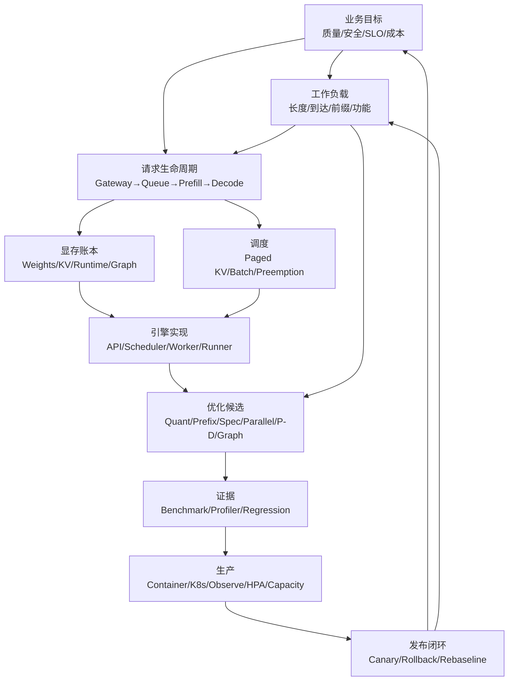
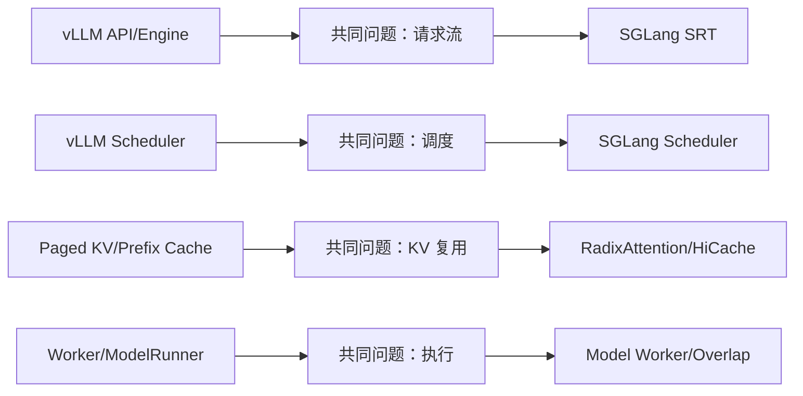

## 📑 目录

- [1. 收官不是复述，而是迁移](#1-收官不是复述而是迁移)
- [2. 模块四知识图](#2-模块四知识图)
- [3. 沿一条请求穿过知识图](#3-沿一条请求穿过知识图)
- [4. 沿一次事故反向穿过知识图](#4-沿一次事故反向穿过知识图)
- [5. 综合练习一：从 TTFT 事故到实验](#5-综合练习一从-ttft-事故到实验)
- [6. 综合练习二：70B 方案评审](#6-综合练习二70b-方案评审)
- [7. 综合练习三：从 vLLM 迁移到 SGLang](#7-综合练习三从-vllm-迁移到-sglang)
- [8. 评分标准：检验迁移而非背诵](#8-评分标准检验迁移而非背诵)
- [9. 建立持续有效的实验资产](#9-建立持续有效的实验资产)
- [10. 明确过渡到第12章 SGLang](#10-明确过渡到第12章-sglang)
- [11. 工程责任与边界](#11-工程责任与边界)
- [总结](#-总结)
- [最终自我检验](#-最终自我检验)
- [官方参考](#-官方参考)

---

## 1. 收官不是复述，而是迁移

如果学完模块四，只能回答：

- PagedAttention 是什么；
- 某个量化参数怎么写；
- vLLM 怎么启动；
- HPA YAML 怎么抄；

那么知识仍然停留在“局部记忆”。

生产问题不会按章节出现。

它通常长这样：

> 新版本上线后，P50 变好、P99 变差，GPU 利用率更高，缓存命中也更高。到底该保留还是回退？

这个问题同时调用：

- 第 1 章的 Prefill/Decode；
- 第 2 章的 KV Cache 与调度；
- 第 3 章的 vLLM 请求流；
- 第 9 章的分位数与归因；
- 第 10 章的发布、监控与回退；
- 第 11.1 的症状决策树；
- 第 11.2 的交互矩阵。

因此，本节不按“第 1 章讲了什么”逐条总结。

它用一张知识图和三个综合练习检验三种迁移：

1. **跨层迁移**：从用户 SLO 走到 Kernel、调度与集群；
2. **跨规模迁移**：从 7B 单卡走到 70B 多卡；
3. **跨框架迁移**：从 vLLM 走到 SGLang。

真正掌握的标志不是记住答案。

而是面对新模型、新硬件、新引擎时，仍能构造证据链。

## 2. 模块四知识图

### 2.1 全图



这不是章节目录。

它描述生产决策的依赖关系。

### 2.2 四条主链

#### 延迟链

```text
到达模式
  → 排队
    → Prefill
      → 首 token
        → Decode steps
          → 用户 E2E
```

对应指标：

- Queue Time；
- TTFT；
- TPOT；
- E2E；
- P50/P95/P99。

#### 显存链

```text
模型精度
  → 权重显存
上下文 × 并发
  → KV 显存
Graph/Kernel
  → Runtime 工作区
三者之和
  → 可驻留请求与 OOM 边界
```

对应决策：

- 量化；
- KV 精度；
- 批预算；
- 最大上下文；
- TP；
- Graph；
- Headroom。

#### 调度链

```text
请求长度与优先级
  → Waiting/Running
    → Batch 组成
      → KV 分配
        → Preemption/Recompute
          → Goodput 与尾延迟
```

对应决策：

- Continuous Batching；
- Chunked Prefill；
- Prefix Cache；
- 长短请求分池；
- 过载保护；
- P/D 解耦。

#### 生产链

```text
单副本安全吞吐
  → 副本数
    → GPU/节点/故障域
      → HPA 与热容量
        → 灰度与 Surge
          → 回滚与再基线
```

对应决策：

- N+1；
- `minReplicas`；
- GPU 节点池；
- Custom Metrics；
- Canary；
- 容量保质期。

### 2.3 图中的反馈边

知识图不是单向流水线。

生产会反向改变前面的假设：

- 新业务让输入 P95 变长；
- 新 Tool Schema 改变 Decode；
- 新模型改变 KV 大小；
- 新硬件改变量化 Kernel；
- 新引擎版本改变调度默认值；
- HPA 扩容改变 Prefix Cache 局部性；
- 灰度流量改变版本间样本分布。

因此基线不是永久真理。

它是带适用条件的证据快照。

## 3. 沿一条请求穿过知识图

### 3.1 入口：业务语义

假设用户发送一个带 Tool Calling 的长输入请求。

在进入 GPU 前，系统已经决定：

- 模型；
- Chat Template；
- 工具 Schema；
- Sampling；
- 最大输出；
- 截止时间；
- 租户；
- 路由池。

这些都属于性能实验的固定条件。

如果候选版本更改 Tool Parser，不能只比较 TPOT。

### 3.2 网关到队列

网关可能：

- 认证；
- 限流；
- 重试；
- Buffer 流式响应；
- 路由到某副本。

用户看到的 TTFT 包含这段。

引擎内部 TTFT 不一定包含。

因此第 9 章要求明确计时边界。

### 3.3 Tokenize 与 Prefix

请求被 Tokenize 后，输入长度才进入资源模型。

若命中 Prefix：

- 一部分 Prefill 被跳过；
- KV 直接复用；
- 缓存占用与路由局部性发生作用。

若未命中：

- 完整 Prefill；
- 可能被 Chunk；
- 可能与 Decode 竞争批预算。

这一步连接第 1、2、3 章与 Prefix 实验。

### 3.4 Prefill

Prefill 主要受：

- 输入长度；
- Attention Kernel；
- Batch Shape；
- 量化；
- TP；
- Graph/Eager；
- GPU；
- 队列；

影响。

它通常主导长输入 TTFT，但不是唯一来源。

若 P/D 解耦，还会产生 KV Transfer。

### 3.5 Decode

Decode 逐步生成：

- 每步读取权重与 KV；
- Scheduler 动态组批；
- 结构化输出约束下一 token；
- Spec Decode 可能 Draft/Verify；
- Multi-LoRA 可能改变 Adapter 路径。

TPOT 是观察 Decode 的入口。

但队列、网络和客户端消费也可能影响用户体验。

### 3.6 流式返回

首 token 到达网关后：

- 代理可能 Buffer；
- 客户端可能慢读；
- 连接可能断开；
- 取消信号可能返回服务；
- E2E 继续累计。

因此“GPU TPOT 正常”不能证明用户流式体验正常。

### 3.7 请求结束后的系统状态

请求结束后：

- KV Block 释放或缓存；
- 指标更新；
- 日志采样；
- 路由权重继续作用；
- HPA 观察聚合指标；
- 容量模型得到新样本。

一条请求同时是业务结果和下一轮系统证据。

## 4. 沿一次事故反向穿过知识图

### 4.1 事故描述

> 12:00 新版本到 25%，12:08 TTFT P99 告警，P50 更好，错误率正常。

不要立刻关闭 Prefix Cache，也不要立刻扩容。

### 4.2 从用户层回溯

第一步问：

- 是 TTFT 还是 TPOT；
- P95 是否也变坏；
- 哪些租户；
- 哪些输入长度；
- 新旧版本样本是否可比；
- 是否只有某可用区。

### 4.3 到请求与路由层

检查：

- Canary 是否分到更多长请求；
- Prefix-aware 路由是否形成热点；
- 是否有重试；
- 新版本是否仅在新节点；
- Cache 是冷还是热。

### 4.4 到调度层

检查：

- Waiting；
- Queue Time；
- Running；
- Batch Shape；
- KV；
- Preemption；
- 每 Pod 差异。

### 4.5 到引擎与基础设施

检查：

- Prefill/Decode；
- Graph 命中；
- Kernel；
- NCCL；
- GPU 时钟；
- XID；
- CPU；
- 网络。

### 4.6 回到发布决策

如果硬门失败，先把 Canary 权重归零。

诊断可以继续，但不能让用户持续承担实验风险。

回退后用相同 Trace 构造控制变量实验。

这就是知识图的闭环。

## 5. 综合练习一：从 TTFT 事故到实验

### 5.1 题目

以下数据全部是教学假设。

某 7B 在线客服服务有 4 个单 GPU 副本。

业务 SLO：

```yaml
slo:
  ttft_p95_ms: 900
  tpot_p95_ms: 45
  error_rate_max: "0.5%"
```

发布后 20 分钟窗口：

```yaml
observations:
  ttft:
    p50_ms: {before: 420, after: 360}
    p95_ms: {before: 780, after: 980}
    p99_ms: {before: 1200, after: 2600}
  tpot_p95_ms: {before: 38, after: 39}
  error_rate: {before: "0.2%", after: "0.2%"}
  prefix_hit_ratio: {before: "25%", after: "62%"}
  waiting_requests:
    pod_a: 1
    pod_b: 2
    pod_c: 1
    pod_d: 17
  routing: "prefix-aware"
```

新版本只改了：

- 开启 Prefix-aware 路由；
- 保留原有 Prefix Cache；
- 其他引擎参数声明为不变。

### 5.2 任务

请提交：

1. 一个不超过 30 字的症状定义；
2. 一条主假设；
3. 至少两条替代解释；
4. 需要补采集的证据；
5. 一个控制变量实验；
6. 上线或回退决定；
7. 若保留 Prefix-aware，新的路由优先级；
8. 需要新增的告警。

### 5.3 不合格答案

- “缓存有问题，关掉缓存”；
- “GPU 不够，加卡”；
- “P50 变好，所以保留”；
- “P99 变差，所以 Prefix Cache 无效”。

这些答案都跳过证据链。

### 5.4 参考推理

症状：

> Prefix-aware 路由后 TTFT P99 超标，且排队集中于单 Pod。

主假设：

> 路由优先缓存局部性，导致热点 Pod 排队；Prefill 节省不足以抵消 Queue。

替代解释：

- Pod D 的 GPU 降频或错误；
- Pod D 是冷启动的新版本；
- Pod D 收到更多长输入；
- 指标聚合或路由标签错误。

补证据：

- 每 Pod 输入长度；
- 每 Pod Queue Time；
- 每 Pod Cache 命中；
- Pod age；
- GPU 时钟/XID；
- 版本 digest；
- 请求分配比例。

实验：

```yaml
experiment:
  fixed:
    - four_replicas
    - workload_trace
    - engine_config
    - prefix_cache
  variants:
    - shortest_queue
    - pure_prefix_aware
    - overload_filtered_then_prefix_aware
  metrics:
    - ttft_p50_p95_p99
    - per_pod_queue
    - prefix_hit_ratio
    - request_goodput
    - tenant_fairness
```

发布决定：

- 当前 P99 硬门失败，Canary 权重归零；
- 不是永久否决 Prefix-aware；
- 实验通过后再灰度。

路由优先级：

1. Ready；
2. 不过载；
3. 租户安全域；
4. Prefix 局部性；
5. 队列打破平局。

### 5.5 本题调用的知识

- 第 2 章：Prefix Cache 与调度；
- 第 3 章：请求如何进入 Scheduler；
- 第 9 章：P50/P99 与分桶；
- 第 10 章：路由、告警、灰度；
- 第 11.1：症状→证据→实验；
- 第 11.2：Prefix × Batching/路由交互。

## 6. 综合练习二：70B 方案评审

### 6.1 题目

一个团队准备上线 70B 服务。

以下均为假设：

```yaml
requirements:
  peak_rps: 1.5
  ttft_p95_ms: 2500
  tpot_p95_ms: 80
  n_plus_one: true
  max_input_tokens: 16000
hardware:
  node:
    gpu_count: 8
    interconnect: "high-speed intra-node"
  cluster:
    free_nodes_normal: 4
    free_nodes_during_upgrade: 3
candidates:
  a: {precision: BF16, tp: 8, safe_rps: 0.40}
  b: {precision: INT4, tp: 4, safe_rps: 0.32}
```

`safe_rps` 也只是题目假设。

团队提议：

> 方案 A 单副本吞吐更高，所以选 A；Deployment 设 4 副本，`maxSurge: 1`。

### 6.2 任务

请完成：

1. 容量手算；
2. GPU 与节点 Slot 手算；
3. N+1 与 Surge 检查；
4. 量化质量门；
5. TP 拓扑风险；
6. 成本比较需要的缺失输入；
7. 发布策略建议；
8. 最终决策状态。

### 6.3 先找提案中的漏洞

漏洞一：

只比较单副本吞吐，没有按峰值和安全系数计算。

漏洞二：

没有把 TP 乘进 GPU。

漏洞三：

没有验证 N+1。

漏洞四：

`maxSurge: 1` 对 TP=8 意味着额外一个完整 8-GPU 节点。

漏洞五：

INT4 尚未过质量门。

漏洞六：

没有给成本、冷启动、故障半径与节点可用性。

### 6.4 参考容量

假设目标负载因子为 0.70。

方案 A：

$$
N_A
=
\left\lceil
\frac{1.5}
{0.40\times0.70}
\right\rceil
=
\lceil5.36\rceil
=6
$$

加 N+1：

$$
N_{A,\text{serving}}=7
$$

GPU：

$$
G_A=7\times8=56
$$

Surge：

$$
G_{A,\text{release}}=64
$$

需要 8 个完整 8-GPU 节点。

题目集群只有 4 个正常空闲节点。

方案 A 在给定假设下不可调度。

方案 B：

$$
N_B
=
\left\lceil
\frac{1.5}
{0.32\times0.70}
\right\rceil
=
\lceil6.70\rceil
=7
$$

加 N+1：

$$
N_{B,\text{serving}}=8
$$

GPU：

$$
G_B=8\times4=32
$$

Surge：

$$
G_{B,\text{release}}=36
$$

若每个 8-GPU 节点能放两个 TP=4 副本，稳态需要 4 个节点。

Surge 需要第 5 个节点的 4 张空闲 GPU，除非采用非 Surge 发布。

集群升级期间只有 3 个空闲节点，仍不满足。

### 6.5 参考决策

不能直接选择 B。

先决条件：

- INT4 质量门通过；
- TP=4 在真实拓扑下满足 TTFT/TPOT；
- 同节点放置可靠；
- 4 节点容量与业务共享关系明确；
- 发布采用独立 Canary 或预留额外节点；
- 集群升级窗口有降级方案；
- 成本输入完整。

最终状态应是：

```yaml
decision:
  outcome: "inconclusive"
  blockers:
    - "candidate B quality not measured"
    - "release capacity unavailable"
    - "cost inputs missing"
```

而不是为了完成评审强行选一个。

### 6.6 成本缺失输入

- 每 GPU 小时成本；
- 节点保留成本；
- 实际 Goodput；
- 冷启动；
- 闲置比例；
- 故障下容量；
- 发布预留；
- 量化制品维护成本；
- 质量回归成本；
- 70B 降级到 7B 的业务代价。

### 6.7 本题调用的知识

- 第 4 章：量化质量与 Kernel；
- 第 6 章：TP 与拓扑；
- 第 9 章：安全吞吐；
- 第 10 章：容量与发布；
- 第 11.2：量化 × Parallel；
- 第 11.3：70B 的完整交付链。

## 7. 综合练习三：从 vLLM 迁移到 SGLang

### 7.1 题目

团队已有一个通过验收的 vLLM 7B 基线。

下一步要评估 SGLang。

业务方只问：

> SGLang 会不会更快？

你的任务不是找一张公开榜单。

而是把现有证据体系迁移到第二套引擎。

### 7.2 已知基线

```yaml
vllm_baseline:
  model_revision: "<fixed>"
  tokenizer_revision: "<fixed>"
  hardware: "<fixed>"
  workload_snapshot: "support-trace-v3"
  quality_suite: "support-eval-v3"
  slo:
    ttft_p95_ms: 900
    tpot_p95_ms: 45
  engine_specific:
    prefix_cache: true
    chunked_prefill: true
    batch_budget: "<measured-choice>"
```

### 7.3 任务

请提交：

1. 哪些条件必须跨引擎固定；
2. 哪些概念可以映射；
3. 哪些参数不能直接映射；
4. 冷/热缓存实验；
5. 调度与 Prefix 的观测方案；
6. 公平的质量与性能门；
7. 生产发布与回退方案；
8. 结论模板。

### 7.4 跨引擎固定项

必须固定：

- 模型 revision；
- Tokenizer；
- Chat Template；
- Sampling；
- Tool/Schema；
- 输入/输出限制；
- 工作负载 Trace；
- 前缀分布；
- 到达模式；
- GPU 与拓扑；
- 驱动/CUDA 可比边界；
- 计时定义；
- 质量门；
- SLO。

### 7.5 概念映射

不是参数一一对应，而是问题一一对应：

| 诊断问题 | vLLM 观察对象 | SGLang 观察对象 |
|---|---|---|
| 请求在哪排队 | Scheduler/Waiting | SRT 调度路径与队列 |
| Prefix 如何复用 | Prefix Cache/KV Blocks | RadixAttention/Radix Tree |
| KV 如何管理 | KVCacheManager | SGLang KV/HiCache 路径 |
| Worker 如何执行 | Worker/ModelRunner | Model Worker/执行路径 |
| 调度是否有空洞 | Profiler/Batch | CPU-GPU overlap/Batch |
| 结构化输出成本 | Guided Decoding 路径 | Structured Generation 路径 |

具体类名与指标以第 12 章和当前版本源码为准。

### 7.6 不能直接映射的内容

不能假设：

- 同名参数语义相同；
- 相同 Batch Budget 数值等价；
- Prefix Cache 与 RadixAttention 是同一实现；
- 默认调度策略相同；
- 指标名相同；
- Graph 捕获范围相同；
- 结构化输出后端相同；
- 冷启动步骤相同。

如果强行把 vLLM 参数值复制到 SGLang，比较的是“错误配置下的引擎”，不是公平能力。

### 7.7 两阶段比较

阶段一：各自合理配置

- 两边都满足质量与 API 语义；
- 两边分别寻找 SLO 内安全工作点；
- 不要求引擎参数数值相同；
- 要求硬件与 workload 相同。

阶段二：机制实验

- 冷 Prefix；
- 真实 Prefix；
- 热 Prefix；
- 短/长输入；
- 低/高并发；
- 结构化输出开/关；
- 冷启动/稳态。

### 7.8 结论模板

```yaml
engine_comparison:
  status: "not-run"
  fixed:
    model_revision: "<fixed>"
    tokenizer_revision: "<fixed>"
    hardware: "<fixed>"
    workload_snapshot: "<fixed>"
    quality_suite: "<fixed>"
  vllm:
    version: "<fixed>"
    config_artifact: null
    result_artifact: null
  sglang:
    version: "<fixed>"
    config_artifact: null
    result_artifact: null
  results:
    quality: null
    ttft_by_bucket: null
    tpot_by_bucket: null
    e2e_p99: null
    goodput: null
    prefix_behavior: null
    gpu_memory: null
    cold_start: null
    cost: null
  decision: "pending"
```

合格结论：

> 在固定模型、硬件和 support-trace-v3 下，两套引擎均通过质量门；SGLang 在高前缀复用分桶的结果见原始产物，随机前缀分桶未观察到同方向收益。结论仅适用于当前版本与流量。

不合格结论：

> SGLang 架构更先进，所以一定比 vLLM 快。

### 7.9 本题调用的知识

这个练习调用了整个模块：

- 用第 1 章固定 Prefill/Decode 语言；
- 用第 2 章理解 KV 与调度问题；
- 用第 3 章建立 vLLM 基线；
- 用第 4～8 章固定优化与服务特性；
- 用第 9 章保证 Benchmark 公平；
- 用第 10 章比较生产可运维性；
- 用第 11 章完成选择与回退；
- 用第 12 章学习 SGLang 的真实实现。

## 8. 评分标准：检验迁移而非背诵

### 8.1 总分 100

| 维度 | 分值 | 判断标准 |
|---|---:|---|
| 问题定义 | 10 | 症状绑定版本、负载和分位数 |
| 正确性与安全 | 15 | 质量门先于性能，生产语义固定 |
| 证据链 | 20 | 用户→请求→调度→引擎→基础设施 |
| 控制变量 | 20 | 单一主要变量，固定项完整 |
| 资源与容量 | 15 | 显存、GPU、拓扑、N+1、Surge |
| 生产闭环 | 10 | 监控、过载、灰度、回退 |
| 边界表达 | 10 | 假设/实测分离，接受证据不足 |

### 8.2 及格不等于答案相同

综合题可能有多个合理方案。

评分看：

- 推理链是否可审计；
- 假设是否可证伪；
- 替代解释是否被考虑；
- 风险是否可回退；
- 数据状态是否诚实。

不同团队可能选择不同 SLO 或成本目标。

只要前提明确、证据充分，结论可以不同。

### 8.3 常见扣分

- 只看 GPU 利用率；
- 只报告平均延迟；
- 把峰值吞吐当容量；
- 不固定工作负载；
- 同时改模型、精度与并行度；
- 忽略 Tool/Schema；
- 把假设写成实测；
- 忽略 Prefix 热点；
- 忽略 HPA 冷启动；
- 忽略多卡发布 Surge；
- 没有回退门；
- 使用公开榜单替代自有实验。

### 8.4 优秀答案的特征

优秀答案会主动写：

- “当前无法判断”；
- “需要补采集这个指标”；
- “这个对比同时改变了两个变量”；
- “该方案满足吞吐但不满足 P99”；
- “这项优化不直达当前瓶颈”；
- “先回退保护用户，再离线诊断”；
- “这个结论只适用于当前版本与 Trace”。

## 9. 建立持续有效的实验资产

### 9.1 资产不是一份结果截图

一次实验至少形成：

```text
experiment/
├── question.yaml
├── environment.yaml
├── workload.yaml
├── baseline-config.yaml
├── candidate-config.yaml
├── raw/
├── analysis/
├── quality/
├── decision.md
└── expiry.yaml
```

目录只是示意。

关键是原始数据、配置与结论绑定。

### 9.2 数据状态

只有四种合法状态：

- `measured`：有原始产物；
- `external_reference`：有来源、版本和日期；
- `assumption`：仅用于推导；
- `unknown`：`null` 或 TBD。

不允许从 `assumption` 静默升级为 `measured`。

### 9.3 实验模板

这是第 11 章唯一的权威实验 schema。11.1 的诊断字段、11.2 的组合字段和 11.3 的发布验收都扩展或引用此模板，不再各自复制一份结构。

```yaml
schema_version: "module4-experiment/v1"
experiment:
  id: "exp-YYYYMMDD-NNN"
  owner: "<name>"
  status: "planned"
  question: "<one answerable question>"
  hypothesis: "<one falsifiable sentence>"
environment:
  model_revision: "<immutable>"
  tokenizer_revision: "<immutable>"
  image_digest: "sha256:<digest>"
  engine_version: "<version>"
  hardware_topology: "<description>"
workload:
  snapshot: "<id>"
  source_type: "<synthetic|anonymized-production>"
  arrival_trace: "<id>"
  prefix_trace: "<id>"
controls:
  fixed: []
  primary_variable:
    name: "<one>"
    baseline: null
    candidate: null
gates:
  quality: "<threshold>"
  safety: "<threshold>"
  ttft_p95_ms: null
  tpot_p95_ms: null
  e2e_p99_ms: null
  error_rate_max: null
results:
  repetitions: 0
  raw_artifacts: []
  metrics: null
decision:
  outcome: "pending"
  reasoning: null
  applicable_to: []
  expires_when: []
```

### 9.4 结论保质期

自动或人工触发过期：

- 模型改变；
- Tokenizer 改变；
- 引擎大版本改变；
- 默认参数改变；
- GPU 或驱动改变；
- 输入/输出分布改变；
- Prefix 重复率改变；
- Tool/VLM 比例改变；
- SLO 改变；
- 集群拓扑改变。

“去年测过”不是当前证据。

### 9.5 回归门

为每次升级保留：

- 正确性冒烟；
- 质量套件；
- 固定长度分桶；
- 代表性 Trace；
- 冷/热 Prefix；
- 低/高并发；
- OOM 边界；
- 冷启动；
- Canary；
- 回滚演练。

不需要每次穷举所有参数。

需要覆盖最可能破坏的合同。

### 9.6 信息源优先级

学习新技术时：

1. 官方文档与 Release Notes；
2. 仓库源码、设计文档、Issue 与 PR；
3. 原论文与作者实现；
4. 可复现独立 Benchmark；
5. 博客、演讲与社交媒体。

后两类适合产生假设。

不适合直接成为生产结论。

## 10. 明确过渡到第12章 SGLang

### 10.1 为什么下一章不是“另一个工具教程”

如果第 12 章只学习 SGLang 的启动命令，前面的知识没有真正迁移。

下一章应带着五个固定问题阅读：

1. 请求如何从 API 进入调度器？
2. KV Cache 如何组织、命中与淘汰？
3. Prefill 与 Decode 如何被调度？
4. CPU 与 GPU 如何重叠？
5. 生产特性如何影响质量与性能？

### 10.2 概念桥



箭头表示问题映射，不表示实现等价。

### 10.3 带入第12章的实验包

开始 SGLang 前准备：

```yaml
migration_pack:
  model_revision: "<fixed>"
  tokenizer_revision: "<fixed>"
  chat_template: "<fixed>"
  quality_suite: "<fixed>"
  workload_snapshot: "<fixed>"
  arrival_trace: "<fixed>"
  prefix_trace: "<fixed>"
  hardware_topology: "<fixed>"
  slo: "<fixed>"
  vllm_baseline_artifact: "<uri>"
  experiment_template: "<uri>"
```

这让第 12 章从第一节起就能做公平迁移。

### 10.4 第12章阅读路线

学习 [第 12 章：深入 SGLang](/AIInfraGuide/inference/模块四-推理优化/第12章-深入sglang/第12章-深入sglang) 时：

#### 12.1 快速入门

目标不是“跑起来”。

要验证：

- API 语义；
- 模型与模板；
- 指标；
- 基线制品。

#### 12.2 整体架构

把 SRT 请求流映射到：

- Queue；
- Scheduler；
- Model Worker；
- Tokenizer；
- Response。

#### 12.3 RadixAttention 与 HiCache

用综合练习三的三种 Prefix 负载：

- 随机；
- 真实；
- 全相同。

观察命中、TTFT、容量与热点。

#### 12.4 调度与 CPU-GPU 重叠

用第 9 章的方法寻找：

- CPU 空洞；
- GPU 空洞；
- Batch 变化；
- 调度开销；
- P99。

#### 12.5 结构化生成与 Agent

重新运行：

- Schema 合法率；
- Tool Calling；
- 质量门；
- TPOT；
- 错误路径。

#### 12.6 生产调优与框架对比

最后才回答：

> 在我们的模型、硬件、Trace 与 SLO 下，哪套方案更适合？

### 10.5 迁移成功标准

迁移成功不是 SGLang 数字更高。

而是你能：

- 解释数字来自哪条路径；
- 找到不同引擎的等价问题；
- 接受参数不可直接映射；
- 用相同质量与 SLO 门；
- 保留各自合理配置；
- 给出适用边界；
- 设计生产回退。

如果 SGLang 在当前负载没有优势，实验仍然成功。

因为它回答了问题。

## 11. 工程责任与边界

### 11.1 推理优化不能替代什么

不能替代：

- 模型能力；
- 数据质量；
- 产品错误防护；
- 安全与隐私审查；
- 模型许可证；
- 灾备；
- 业务连续性；
- 人工审批；
- 组织责任。

### 11.2 性能数字不能证明什么

- 合成数据不能证明生产容量；
- 平均值不能证明尾延迟；
- GPU 利用率不能证明用户体验；
- 单机不能证明集群；
- 单版本不能证明长期；
- 厂商数据不能证明自有负载；
- 功能兼容不能证明组合收益；
- “当前最快”不能证明下一版本仍最快。

### 11.3 复杂度预算

每增加一项优化，都增加：

- 测试组合；
- 指标；
- 故障模式；
- 发布步骤；
- 回退状态；
- 值班知识。

复杂度也要像 GPU 一样预算。

如果简单方案满足 SLO 与成本，复杂方案需要证明增量价值。

### 11.4 对不确定性的表达

专业结论可以是：

- 尚未测量；
- 样本不足；
- 当前版本不支持；
- 只在某分桶有效；
- 质量门失败；
- 生产条件不可复现；
- 需要先补观测；
- 当前不值得上线。

工程师不需要永远给出一个漂亮数字。

需要给出可审计的判断。

## 📝 总结

模块四最终形成的不是十一组知识点，而是一张可以反复穿行的图：

```text
业务目标
  ↔ 工作负载
    ↔ 请求阶段
      ↔ 显存与调度
        ↔ 引擎实现
          ↔ 优化候选
            ↔ Benchmark 证据
              ↔ Kubernetes 生产闭环
```

三个综合练习分别检验：

- 从缓存命中与 P99 冲突中定位热点；
- 从 70B 单副本数据推导 TP、容量和发布边界；
- 把 vLLM 的诊断方法迁移到 SGLang。

如果你能在没有现成参数答案时完成这三件事，就已经从“会运行引擎”走向“能为推理系统负责”。

## ✅ 最终自我检验

- [ ] 我能从用户 SLO 追踪到请求、调度、引擎与基础设施
- [ ] 我能沿显存链解释权重、KV、Graph 与 Headroom
- [ ] 我能沿调度链解释 Batch、Prefix、抢占与 P99
- [ ] 我不会把峰值吞吐直接用于容量
- [ ] 我能计算 TP 副本、N+1 与发布 Surge
- [ ] 我会先固定 Tool/Schema 等生产语义
- [ ] 我能为一次事故提出主假设与替代解释
- [ ] 我能设计一个只改变主要变量的实验
- [ ] 我能把假设、引用、实测与未知分开
- [ ] 我能在硬门失败时先保护用户并回退
- [ ] 我能把 vLLM 概念映射为 SGLang 中的诊断问题
- [ ] 我不会强行把两个引擎参数一一对应
- [ ] 我接受“证据不足”作为合法结论
- [ ] 我为每个性能结论设置适用边界与保质期

## 📚 官方参考

- [vLLM Documentation](https://docs.vllm.ai/)
- [vLLM GitHub Releases](https://github.com/vllm-project/vllm/releases)
- [SGLang Documentation](https://docs.sglang.ai/)
- [SGLang GitHub](https://github.com/sgl-project/sglang)
- [Kubernetes Documentation](https://kubernetes.io/docs/)
- [NVIDIA Nsight Systems](https://docs.nvidia.com/nsight-systems/)
- [PyTorch Profiler](https://pytorch.org/docs/stable/profiler.html)
- [Prometheus Best Practices](https://prometheus.io/docs/practices/)
- [MLCommons Inference](https://mlcommons.org/benchmarks/inference-datacenter/)
- [Google Site Reliability Engineering](https://sre.google/books/)
- [NIST Engineering Statistics Handbook](https://www.itl.nist.gov/div898/handbook/)
