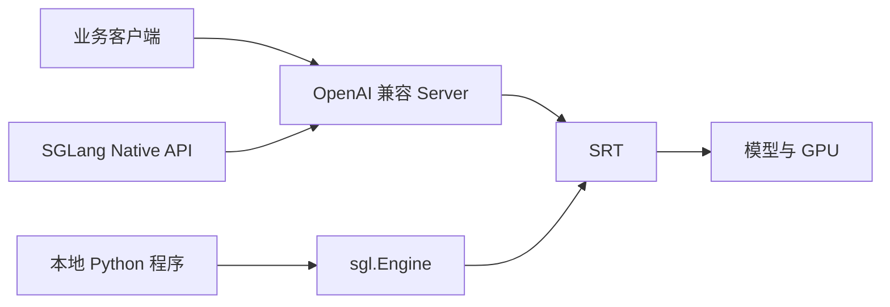

## 📑 目录
- [1. 先建立心智模型](#1-先建立心智模型)
- [2. 版本与环境准备](#2-版本与环境准备)
- [3. 启动第一个服务](#3-启动第一个服务)
- [4. 调用 OpenAI 兼容 API](#4-调用-openai-兼容-api)
- [5. 使用离线 Engine](#5-使用离线-engine)
- [6. 从能跑到可信](#6-从能跑到可信)
- [7. 常用参数](#7-常用参数)
- [8. 常见故障](#8-常见故障)
- [9. Trade-off](#9-trade-off)
- [总结](#总结)
- [自我检验](#自我检验)
- [参考资料](#参考资料)
---

## 1. 先建立心智模型
第一次用 SGLang，可以把它想成三种入口。



### 1.1 OpenAI 兼容 Server
像开一家有标准窗口的餐厅。任意支持 OpenAI 协议的客户端，都可通过 HTTP 提交请求。适合：
- 在线业务；多语言客户端；独立扩缩容；网关、鉴权和监控。

### 1.2 Native API
它仍经过服务端，但可暴露 SGLang 自有参数。适合验证某些尚未映射到 OpenAI 字段的能力。

### 1.3 `sgl.Engine`
像把厨房直接嵌进 Python 进程。不需要 HTTP Server，少了一层网络与序列化。适合：
- 离线批推理；数据生成；自定义上层服务；测最大引擎吞吐。
它不天然具备成熟网关的隔离与治理能力。

## 2. 版本与环境准备

### 2.1 固定版本
本节固定：

```text
SGLang: v0.5.17
发布日期: 2026-08-08
核验日期: 2026-08-12
```

不要在生产镜像中只写：

```bash
pip install "sglang[all]"
```

这会让未来构建拿到不同依赖组合。教程示例使用：

```bash
python -m venv .venv
source .venv/bin/activate
python -m pip install --upgrade pip
python -m pip install "sglang[all]==0.5.17"
```

`sglang[all]` 不包含第 12.6 节使用的独立 Router 和 Mooncake 传输后端。只有继续做多副本路由或 P/D 解耦时，再按对应版本矩阵安装：

```bash
python -m pip install "sglang-router==0.3.2"
python -m pip install mooncake-transfer-engine
```

第二条命令还应在生产镜像的锁文件中固定解析出的确切版本；不使用 Mooncake 的单机入门环境无需安装它。

实际 GPU wheel、PyTorch、CUDA 与硬件后端应按 v0.5.17 安装文档选择。release 说明中，v0.5.17 使用 PyTorch 2.11.0，CUDA 基础镜像为 13.0.1。这不是说宿主机必须手工安装完全相同的 toolkit。容器运行时主要要求宿主驱动满足兼容条件。

### 2.2 先检查硬件
NVIDIA 环境可运行：

```bash
nvidia-smi
python - <<'PY'
import torch
print("torch:", torch.__version__)
print("cuda available:", torch.cuda.is_available())
print("cuda runtime:", torch.version.cuda)
if torch.cuda.is_available():
    print("gpu:", torch.cuda.get_device_name(0))
PY
```

再确认 SGLang 版本：

```bash
python - <<'PY'
import importlib.metadata
print(importlib.metadata.version("sglang"))
PY
```

期待输出包含：

```text
0.5.17
```

### 2.3 模型与许可
本节用小模型演示：

```text
Qwen/Qwen2.5-7B-Instruct
```

模型是否可下载、能否商用、是否需要 Hugging Face token，由模型仓库许可决定。框架开源许可不能替代模型许可。

### 2.4 显存粗算
先做最简手算。7B 模型若用 BF16 权重：
$$
7\times 10^9 \times 2\text{ Bytes}\approx 14\text{ GB}
$$
这只算权重，还没算：
- KV Cache；CUDA Graph；临时激活；通信缓冲；框架运行时。
因此“显卡有 16 GB”不等于 7B BF16 一定能稳定服务。显存不足时，可以选择更小模型、量化 checkpoint 或多卡 TP。

## 3. 启动第一个服务

### 3.1 最小命令

```bash
python -m sglang.launch_server \
  --model-path Qwen/Qwen2.5-7B-Instruct \
  --host 0.0.0.0 \
  --port 30000
```

等待日志显示服务就绪。首次启动可能需要：不要把模型下载时间算入 steady-state TTFT。
- 下载模型；加载权重；分配 KV Cache；选择 attention backend；捕获 CUDA Graph。

### 3.2 健康检查
先查看模型列表：

```bash
curl -s http://127.0.0.1:30000/v1/models
```

再发一个确定性请求：

```bash
curl http://127.0.0.1:30000/v1/chat/completions \
  -H "Content-Type: application/json" \
  -d '{
    "model": "Qwen/Qwen2.5-7B-Instruct",
    "messages": [
      {"role": "user", "content": "只回答：SGLang 已启动"}
    ],
    "temperature": 0,
    "max_tokens": 16
  }'
```

为什么先用 `temperature=0`？不是为了证明完全位级确定。而是减少随机采样干扰，方便排查请求链路。

### 3.3 监听地址的风险
`--host 0.0.0.0`允许其他主机访问端口。本地实验可以改为：

```bash
--host 127.0.0.1
```

公网部署必须增加：推理服务端口不应裸露到互联网。
- TLS；身份认证；限流；请求体上限；审计；网络隔离。

## 4. 调用 OpenAI 兼容 API

### 4.1 Python 客户端

```bash
python -m pip install openai
```

```python
from openai import OpenAI
client = OpenAI(
    base_url="http://127.0.0.1:30000/v1",
    api_key="EMPTY",
)
response = client.chat.completions.create(
    model="Qwen/Qwen2.5-7B-Instruct",
    messages=[
        {"role": "system", "content": "你是 AI Infra 助手。"},
        {"role": "user", "content": "用一句话解释 KV Cache。"},
    ],
    temperature=0,
    max_tokens=64,
)
print(response.choices[0].message.content)
```

本地示例中的 `EMPTY`只是客户端要求非空字符串。它不是认证方案。

### 4.2 流式返回

```python
stream = client.chat.completions.create(
    model="Qwen/Qwen2.5-7B-Instruct",
    messages=[{"role": "user", "content": "解释连续批处理。"}],
    temperature=0,
    max_tokens=128,
    stream=True,
)
for chunk in stream:
    delta = chunk.choices[0].delta.content
    if delta:
        print(delta, end="", flush=True)
```

流式返回不会减少模型生成 token 的计算量。它改善的是用户感知：首个可见 token 到达后，用户可以边等边读。

### 4.3 Chat Template
Chat 请求并不是直接把JSON `messages` 喂给模型。服务端会根据 tokenizer应用 Chat Template。如果模型仓库缺模板，或模板与模型训练格式不符，服务可能能返回，但质量明显异常。必要时显式设置：

```bash
--chat-template /path/to/template.jinja
```

模型存在多个模板时，v0.5.17 还提供：

```bash
--hf-chat-template-name tool_use
```

模板必须和模型约定匹配。

### 4.4 SGLang 扩展参数
OpenAI 客户端可通过`extra_body` 传扩展字段。例如后续结构化输出会用到：

```python
response = client.chat.completions.create(
    model="Qwen/Qwen2.5-7B-Instruct",
    messages=[{"role": "user", "content": "给出服务信息。"}],
    extra_body={
        "json_schema": {
            "type": "object",
            "properties": {
                "name": {"type": "string"},
                "ready": {"type": "boolean"},
            },
            "required": ["name", "ready"],
        }
    },
)
```

客户端类型定义未必认识所有扩展字段，因此不要把客户端报错直接归因于服务端。

## 5. 使用离线 Engine

### 5.1 同步批量生成

```python
import sglang as sgl
engine = sgl.Engine(
    model_path="Qwen/Qwen2.5-7B-Instruct",
)
prompts = [
    "KV Cache 是什么？",
    "Continuous Batching 是什么？",
]
sampling_params = {
    "temperature": 0,
    "max_new_tokens": 64,
}
outputs = engine.generate(prompts, sampling_params)
for prompt, output in zip(prompts, outputs):
    print("PROMPT:", prompt)
    print("OUTPUT:", output["text"])
engine.shutdown()
```

官方离线 Engine API支持同步、异步、流式与非流式模式。

### 5.2 Engine 的生命周期
创建 Engine 很重。它需要加载模型并初始化运行时。反例：

```python
# 伪代码：不要每个请求都创建一次 Engine
def handle(prompt):
    engine = sgl.Engine(model_path=MODEL)
    return engine.generate([prompt], PARAMS)
```

正确思路：

```python
# 伪代码：进程启动时创建，持续复用
engine = create_engine_once()
def handle(prompt):
    return engine.generate([prompt], PARAMS)
```

进程退出前调用 `shutdown()`，有助于清理子进程与资源。

### 5.3 Server 还是 Engine

| 维度 | OpenAI Server | `sgl.Engine` |
|---|---|---|
| 调用方式 | HTTP | Python 进程内 |
| 网络开销 | 有 | 无 HTTP 开销 |
| 语言 | 多语言 | 主要是 Python |
| 服务治理 | 易接网关 | 需自行实现 |
| 离线批处理 | 可用 | 更直接 |
| 性能测试 | 端到端 | 引擎上限 |

两者共用 SRT 核心能力，但测出的数字回答不同问题。

## 6. 从能跑到可信

### 6.1 做一次冷启动与热启动区分
冷启动包含：热路径 benchmark应先 warm up。
- 模型下载；权重加载；Kernel JIT；CUDA Graph 捕获；缓存尚未预热。

### 6.2 检查 token 数
同一个“句子”，不同 tokenizer可能产生不同 token 数。比较框架时，应记录实际输入与输出 token，不能只记录字符长度。

### 6.3 检查停止条件
确认：
- `max_tokens` 是否生效；EOS 是否正确；stop string 是否截断；流式与非流式文本是否一致；Chat Template 是否重复添加角色标记。

### 6.4 检查正确性
至少准备三类样例：

```text
短输入 + 短输出
长输入 + 短输出
短输入 + 长输出
```

如果启用量化，再加入业务质量集。服务返回 HTTP 200只能证明接口成功，不能证明模型质量正确。

## 7. 常用参数

### 7.1 显存静态比例

```bash
--mem-fraction-static 0.80
```

它影响模型运行时用于权重与 KV 等静态区域的规划。调高可能容纳更多 KV，也可能更容易 OOM。不要机械照抄某台机器的值。

### 7.2 张量并行

```bash
--tp-size 2
```

有些命令也接受 `--tp` 别名；本文优先写完整参数名。TP 可以让模型跨卡，但每层会增加 collective 通信。

### 7.3 上下文长度

```bash
--context-length 8192
```

上下文上限越大，潜在 KV 空间压力越高。模型声明支持长上下文，不代表你的显存和 SLO适合直接开放最大值。

### 7.4 调度策略
v0.5.17 的 server arguments提供 `--schedule-policy`。默认值以该版本参数文档为准，不要根据旧博客猜测。前缀密集 workload可评估缓存感知策略，但要同时观察公平性。

### 7.5 缓存报告
可启用：

```bash
--enable-cache-report
```

OpenAI usage 中可返回缓存 token 相关信息。它有助于验证：优化是否真的命中缓存，而不是仅凭吞吐变化猜测。

## 8. 常见故障

### 8.1 启动时 OOM
排查顺序：
1. 是否有其他进程占显存；2. 模型精度与权重大小；3. `mem-fraction-static`；4. context length；5. CUDA Graph 占用；6. TP 是否正确。

### 8.2 模型名不一致
请求中的 `model`应与服务暴露的模型标识匹配。先查：

```bash
curl -s http://127.0.0.1:30000/v1/models
```

### 8.3 输出乱码或角色错位
优先检查：又送入 Chat API。
- tokenizer 是否匹配；Chat Template；模型是否为 Instruct；是否把已模板化文本。

### 8.4 首次请求特别慢
可能来自：先预热再测，同时保留冷启动指标。
- lazy compilation；CUDA Graph；缓存冷启动；模型文件仍在读取；DNS 或代理。

### 8.5 组合参数不兼容
量化、attention backend、spec decode、DP attention、PD 解耦之间存在版本边界。遇到报错时，先缩减到最小命令，再逐个加回参数。

## 9. Trade-off

| 选择 | 收益 | 代价 |
|---|---|---|
| OpenAI Server | 生态兼容 | HTTP 与服务治理成本 |
| Engine | 简洁、少网络层 | 自行处理隔离和并发入口 |
| 大 context | 接受长请求 | KV 压力与尾延迟 |
| 高显存比例 | 更多缓存容量 | OOM 安全余量变小 |
| TP | 模型跨卡 | 通信开销 |
| 量化 | 降显存、可能加速 | 精度与 Kernel 约束 |
| 流式 | 改善感知延迟 | 客户端处理更复杂 |

入门阶段最重要的原则：先用最小配置建立基线，再一次改变一个变量。

## 总结
本节跑通了三条路径：

```text
OpenAI Server
OpenAI Python Client
离线 sgl.Engine
```

真正可信的 quickstart不止是看到一段文本。还要固定版本、验证模板、记录 token、区分冷暖路径，并理解每个入口测量的系统边界。下一节将沿着一次请求，拆开 SRT 内部组件。

## 自我检验
- [ ] 我能解释 Server、Native API 与 Engine 的区别
- [ ] 我安装的是明确的 0.5.17
- [ ] 我会检查 GPU、PyTorch 与 SGLang 版本
- [ ] 我知道 BF16 权重粗算不含 KV Cache
- [ ] 我能启动 OpenAI 兼容服务
- [ ] 我能用 curl 和 Python 各发一次请求
- [ ] 我知道 Chat Template 错误会影响质量
- [ ] 我不会每个请求重新创建 Engine
- [ ] 我会区分冷启动与热路径
- [ ] 我不会把 HTTP 200 当作质量验收

## 参考资料
1. [SGLang v0.5.17 Release](https://github.com/sgl-project/sglang/releases/tag/v0.5.17)；2. [SGLang Installation](https://docs.sglang.ai/get_started/install.html)；3. [OpenAI APIs - Completions](https://docs.sglang.ai/basic_usage/openai_api_completions.html)；4. [Offline Engine API](https://docs.sglang.ai/basic_usage/offline_engine_api.html)；5. [Server Arguments](https://docs.sglang.ai/advanced_features/server_arguments.html)；6. [SGLang v0.5.17 Source](https://github.com/sgl-project/sglang/tree/v0.5.17/python/sglang/srt)。
> 命令核验于 2026-08-12。
> 硬件与依赖组合请以 v0.5.17 安装矩阵为准。
