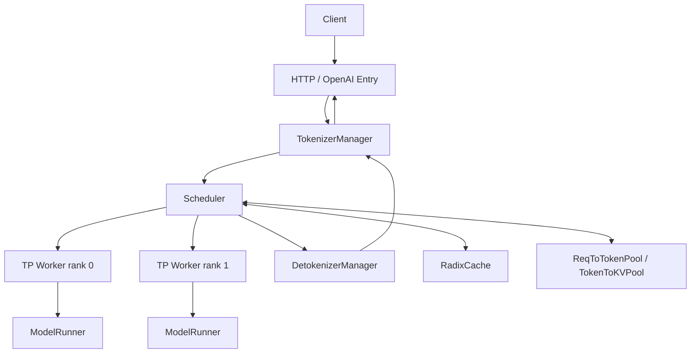
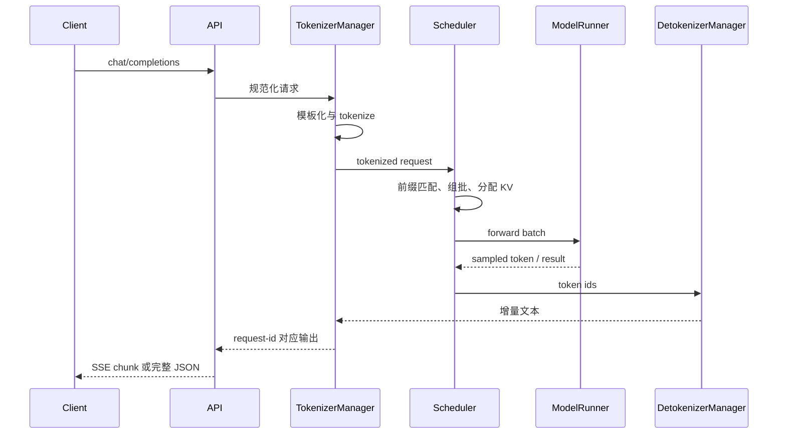
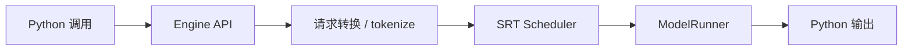

## 📑 目录
- [1. 一座分工明确的工厂](#1-一座分工明确的工厂)
- [2. 进程与组件全景](#2-进程与组件全景)
- [3. 请求入口](#3-请求入口)
- [4. TokenizerManager](#4-tokenizermanager)
- [5. Scheduler](#5-scheduler)
- [6. TP Worker 与 ModelRunner](#6-tp-worker-与-modelrunner)
- [7. DetokenizerManager](#7-detokenizermanager)
- [8. 完整时序](#8-完整时序)
- [9. Engine 路径](#9-engine-路径)
- [10. 源码阅读路线](#10-源码阅读路线)
- [11. Trade-off](#11-trade-off)
- [总结](#总结)
- [自我检验](#自我检验)
- [参考资料](#参考资料)
---

## 1. 一座分工明确的工厂
先说白话：一个请求不是“交给模型，然后等答案”这么简单。它更像一张生产订单，要经过接单、翻译、排产、领料、加工、质检和发货。

| 工厂角色 | SRT 组件 | 主要工作 |
|---|---|---|
| 前台 | HTTP/OpenAI 入口 | 校验协议、建立流 |
| 翻译员 | TokenizerManager | 模板化、分词、请求登记 |
| 生产主管 | Scheduler | 排队、组批、分配 KV |
| 车间 | TpModelWorker | 组织各 rank 执行 |
| 机床控制器 | ModelRunner | 准备 tensor、运行 forward |
| 包装员 | DetokenizerManager | token 转文本、增量输出 |

术语上，这些组件共同构成 SGLang Runtime，也就是 SRT。理解架构时最重要的不是背类名，而是跟踪三种东西：
1. 请求消息如何流动；2. KV 和 batch 状态由谁持有；3. CPU 与 GPU 的边界在哪里。

## 2. 进程与组件全景

### 2.1 逻辑结构



图中箭头表达逻辑消息流，不保证每个部署模式都使用完全相同的进程拓扑。SRT 会根据 TP、DP、PD 解耦、Rust 前端等参数改变启动方式。

### 2.2 为什么要拆开
如果分词、调度、GPU forward 和反分词全塞进一个同步循环，CPU 工作会直接阻塞下一次 GPU 提交。拆分以后，可以让不同阶段并行推进：

```text
请求 A：GPU 正在 decode
请求 B：CPU 正在 tokenize
请求 C：正在流式 detokenize
请求 D：正在排队等待 KV slot
```

收益是流水化，代价是进程通信、消息类型和生命周期管理更复杂。

### 2.3 v0.5.17 的 Rust 前端边界
v0.5.17 release 加入“初始 Rust frontend 支持”，覆盖从网络 ingress 到 tokenized request 交给 GPU scheduler 之前的前半段。这说明前端正在演进，但不应据此断言 Python `TokenizerManager` 路径已经消失。本节使用成熟 Python SRT 主线讲概念；部署 Rust server 时，应再对照该版本 release 和启动选项。

## 3. 请求入口

### 3.1 OpenAI 请求先被转换
客户端发送：

```json
{
  "model": "Qwen/Qwen2.5-7B-Instruct",
  "messages": [
    {"role": "user", "content": "解释 RadixAttention"}
  ],
  "temperature": 0,
  "max_tokens": 128
}
```

入口层需要完成协议工作：
- 校验字段；选择 Chat Template；转换 sampling parameters；生成 request id；建立流式或非流式响应；处理取消和断连。
模型只认识 token id，不认识 OpenAI 的 `messages` 数组。因此入口必须先把业务协议转换为 SRT 内部请求。

### 3.2 Chat Template 的位置
白话上，Chat Template 是“把对话表格排版成模型训练时见过的剧本格式”。例如概念性结果可能是：

```text
<|im_start|>user
解释 RadixAttention<|im_end|>
<|im_start|>assistant
```

不同模型格式不同，这段仅用于说明，不应手工套给所有模型。模板错误通常不会触发 CUDA 异常，却会造成角色错位、工具调用失败或输出质量下降。

### 3.3 请求取消
流式客户端可能中途断开。生产系统必须让取消信号沿请求 id 回到运行时，否则 GPU 还会继续生成无人消费的 token。取消并非瞬间清除一切：调度器需要在安全点移除请求并释放相关引用。

## 4. TokenizerManager

### 4.1 它做什么
`TokenizerManager` 位于文本世界与 token 世界的边界。在 v0.5.17 源码中，主文件位于：

```text
python/sglang/srt/managers/tokenizer_manager.py
```

它的职责可概括为：
- 应用模板或处理已经提供的 token；执行 tokenize；检查长度与输入合法性；创建内部请求消息；向 scheduler 提交请求；收集输出并关联原始调用；管理流式迭代与取消。

### 4.2 为什么不能忽略分词
假设字符串长度相同：

```text
"hello world"
"你好，世界"
```

它们的 token 数不一定相同。调度器预算按 token 计算，而不是按字符计算。因此线上限流最好同时考虑：
- 请求字节数；输入 token；最大输出 token；多模态资源大小。

### 4.3 输入已经是 token
Native API 或内部调用可直接传 token ids，绕过重复 tokenize。这可以减少 CPU 工作，但调用方必须保证：错误 token 不一定立刻报错，可能只是生成异常文本。
- tokenizer 版本一致；special token 处理一致；token id 在词表范围内；Chat Template 已正确应用。

### 4.4 消息不是 Python 函数调用
组件之间通常通过定义明确的消息结构通信。可把它理解为：

```python
# 伪代码：用于理解，不是可直接导入的 v0.5.17 API
tokenized = TokenizedGenerateRequest(
    request_id=req_id,
    input_ids=input_ids,
    sampling_params=params,
    stream=True,
)
send_to_scheduler(tokenized)
```

消息边界使组件能独立运行，也要求字段演进保持兼容。

## 5. Scheduler

### 5.1 核心位置
调度主线位于：

```text
python/sglang/srt/managers/scheduler.py
```

周边还包括：

```text
managers/schedule_batch.py
managers/schedule_policy.py
mem_cache/
```

具体文件会随版本重构，所以阅读时必须固定 tag。

### 5.2 Scheduler 是状态中心
它不只决定“下一个请求是谁”。它还需要协调：这就是为什么调度器常是推理引擎最难读的部分。
- waiting 与 running 请求；Prefill、Extend、Decode；prefix cache 命中；KV token slot 分配；batch token budget；chunked prefill；请求完成和回收；分布式 worker 的一致执行。

### 5.3 两类内存映射
白话上，SRT 要回答两个问题：源码中可看到请求到 token、token 到 KV 的内存池抽象。逻辑关系可写成：
1. 某个请求的第 i 个 token 放在哪个 KV slot？；2. 某个 KV slot 的真实 K/V 张量在哪里？。
$$
\text{request position}\rightarrow \text{token slot}\rightarrow \text{KV tensor address}
$$
把这两层分开，才能让请求逻辑序列与物理显存布局解耦。

### 5.4 一个调度轮次
概念伪代码如下：

```python
# 伪代码：省略大量异常、分布式与 spec decode 分支
while alive:
    recv_new_requests()
    update_finished_requests()
    match_prefixes_in_radix_cache()
    batch = select_prefill_or_decode_batch()
    allocate_kv_slots(batch)
    result = model_worker.forward_batch(batch)
    process_sampled_tokens(result)
    send_output_or_requeue()
```

真实 v0.5.17 的 overlap 路径会让部分步骤跨轮重叠，不能逐行等同于上面伪代码。

### 5.5 Prefill、Extend 与 Decode
Prefill 是第一次处理一段 prompt。如果命中部分前缀缓存，只计算未命中的后缀，这通常称为 extend。Decode 则通常每个活跃序列推进一个新 token。手算示例：

```text
prompt 长度             = 1000
RadixCache 命中         = 700
本轮需要 extend 的 token = 300
```

忽略其他开销时，避免了 700 个 prompt token 的重复 prefill。但这不等于端到端延迟必然按 70% 下降，因为还存在查找、排队、采样和网络时间。

## 6. TP Worker 与 ModelRunner

### 6.1 TpModelWorker
Tensor Parallelism 把模型张量切到多个 rank。`TpModelWorker` 负责 worker 侧的模型执行组织，ModelRunner 则更接近具体 tensor 与 Kernel。可以类比：

```text
Scheduler      = 总调度
TpModelWorker  = 车间班组长
ModelRunner    = 机床控制器
```

### 6.2 ModelRunner
源码主线位于：

```text
python/sglang/srt/model_executor/model_runner.py
```

它需要处理：
- 模型加载；batch tensor 准备；attention backend；forward mode；CUDA Graph；logits 与采样相关输出；TP collective；多种模型架构分支。
这是性能优化高度集中的位置，也是最不适合从头逐行阅读的位置。

### 6.3 CUDA Graph
普通 CUDA launch 每轮都由 CPU 发起许多 Kernel。CUDA Graph 像预先录好一套固定舞步，满足形状约束时直接 replay。收益是降低 launch overhead，代价包括：
- 需要预留 graph buffer；batch shape 需要落入捕获范围；动态控制流更难；首次 capture 增加启动时间。
因此小并发 decode 常更受益，复杂 Prefill 路径则要看具体 graph 能力。

### 6.4 TP 通信手算
假设线性层按输出维度切到 2 个 rank，每张卡算一半结果。后续层若需要完整张量，就要执行 all-gather 或等价 collective。粗略时间下界可写为：
$$
T_{\text{step}} \approx T_{\text{compute}} + T_{\text{collective}} + T_{\text{host}}
$$
TP 增大时单卡计算减少，但 collective 不会自动消失。这解释了“更多卡”不保证线性加速。

## 7. DetokenizerManager

### 7.1 为什么单独反分词
模型每步输出 token id。客户端想看到 UTF-8 文本。若 scheduler 同步执行复杂 detokenize 和 stop string 检查，可能延迟下一次 GPU 提交。因此 SRT 把输出处理放到专门组件。主要源码位于：

```text
python/sglang/srt/managers/detokenizer_manager.py
```

### 7.2 增量解码不是简单拼接
某些 tokenizer 的一个字符可能跨多个 token。UTF-8 字节、空格规则和 special token 也需要处理。概念上不能简单写：

```python
text += tokenizer.decode([new_token])
```

真实实现需要维护增量状态，避免重复文本和乱码。

### 7.3 停止条件
完成原因可能包括：“停止”同时涉及文本和 token 语义，所以输出处理与 scheduler 要交换状态。
- 生成 EOS；达到最大新 token；命中 stop token；命中 stop string；请求被取消；发生错误。

## 8. 完整时序



### 8.1 TTFT 分解
可把首 token 延迟粗分为：
$$
TTFT =T_{queue}+T_{template}+T_{tokenize}+T_{prefix}+T_{prefill}+T_{sample}+T_{network}
$$
真实阶段可能重叠，所以这是分析模型，不是 profiler 的严格可加和事件。若长 prompt 的 `T_prefill` 占主导，RadixCache 命中可能很重要。若排队占主导，应先检查容量和调度，而不是继续优化 Kernel。

### 8.2 TPOT 分解
每个输出 token 的时间大致受以下因素影响：

```text
decode forward
TP/EP 通信
CPU 调度
采样
detokenize
流式发送
```

Overlap Scheduler 的目标，就是尽量把部分 CPU 工作藏在 GPU 执行期间。

## 9. Engine 路径
`sgl.Engine` 没有 HTTP 请求入口，但不会绕过 Scheduler 与 ModelRunner。逻辑上：



因此 Engine benchmark 去掉的是 HTTP 与网关开销，不是去掉动态调度。官方 `bench_offline_throughput` 会直接实例化 Engine；它回答“引擎在进程内的吞吐上限”，不等于真实在线 SLO。

## 10. 源码阅读路线

### 10.1 第一遍：只找边界
按这个顺序：

```text
launch_server / entrypoint
  → tokenizer_manager.py
  → scheduler.py
  → tp_worker.py
  → model_runner.py
  → detokenizer_manager.py
```

第一遍只回答“谁调用谁、消息是什么”。

### 10.2 第二遍：跟一个请求
选择一个最小非流式文本请求，搜索 request id 和内部消息类型。记录状态：

```text
文本
→ input_ids
→ waiting request
→ running batch
→ KV slot
→ output token
→ 文本
```

### 10.3 第三遍：打开一个优化
例如只研究 Radix Cache：

```text
请求何时 match_prefix
命中的 indices 存在哪里
何时增加引用
何时写回与淘汰
```

不要同时追 TP、spec decode、VLM 和 PD 分支。

### 10.4 用日志和 profiler 验证
源码推断要和运行证据互相校验。官方提供 server benchmark、offline benchmark、one-batch 工具，以及 profiler 控制接口。阅读代码得到假设，benchmark 与 timeline 用来证伪。

## 11. Trade-off

| 架构选择 | 收益 | 代价 |
|---|---|---|
| 组件进程化 | CPU 阶段可并行 | IPC 与故障处理 |
| Tokenize 前移 | Scheduler 接收统一 token | 前端 CPU 压力 |
| 动态 Scheduler | 高利用率 | 状态机复杂 |
| KV 两级映射 | 灵活分页和共享 | 元数据维护 |
| CUDA Graph | 降低 launch overhead | 显存、形状约束 |
| TP Worker | 模型跨卡 | collective 开销 |
| 独立 Detokenizer | 不阻塞核心循环 | 增量状态复杂 |
| Rust 前端 | 降低前端瓶颈潜力 | v0.5.17 尚属初始支持 |

架构没有免费午餐。每次拆分都用复杂度换并行，每次缓存都用内存换计算，每次分布式都用通信换容量。

## 总结
SRT 的请求主线可以压缩成一句话：

```text
入口把业务请求变成 token，
Scheduler 把 token 变成可执行 batch，
ModelRunner 把 batch 变成新 token，
Detokenizer 再把 token 变回文本。
```

RadixCache 和内存池围绕 Scheduler 维护状态，TP Worker 围绕 ModelRunner 执行分布式计算。下一节将深入这条链路中最有 SGLang 辨识度的部分：RadixAttention 与 HiCache。

## 自我检验
- [ ] 我能说出请求经过的五个核心组件
- [ ] 我知道 Chat Template 不在 GPU 上执行
- [ ] 我能解释 TokenizerManager 的职责
- [ ] 我知道 Scheduler 不只是 FIFO 队列
- [ ] 我能画出请求位置到 KV 地址的两级映射
- [ ] 我能区分 Prefill、Extend 与 Decode
- [ ] 我知道 ModelRunner 是 Kernel 集中的位置
- [ ] 我能说明为什么 Detokenizer 独立
- [ ] 我知道 Engine 仍使用 SRT Scheduler
- [ ] 我不会把 Rust 前端初始支持描述成全面替代

## 参考资料
1. [SGLang v0.5.17 源码：SRT](https://github.com/sgl-project/sglang/tree/v0.5.17/python/sglang/srt)；2. [TokenizerManager v0.5.17](https://github.com/sgl-project/sglang/blob/v0.5.17/python/sglang/srt/managers/tokenizer_manager.py)；3. [Scheduler v0.5.17](https://github.com/sgl-project/sglang/blob/v0.5.17/python/sglang/srt/managers/scheduler.py)；4. [ModelRunner v0.5.17](https://github.com/sgl-project/sglang/blob/v0.5.17/python/sglang/srt/model_executor/model_runner.py)；5. [DetokenizerManager v0.5.17](https://github.com/sgl-project/sglang/blob/v0.5.17/python/sglang/srt/managers/detokenizer_manager.py)；6. [SGLang v0.5.17 Release](https://github.com/sgl-project/sglang/releases/tag/v0.5.17)；7. [Benchmark and Profiling](https://docs.sglang.ai/developer_guide/benchmark_and_profiling.html)。
> 源码路径固定到 v0.5.17；后续重构后请从消息类型与职责重新定位，不要只按文件名寻找。
