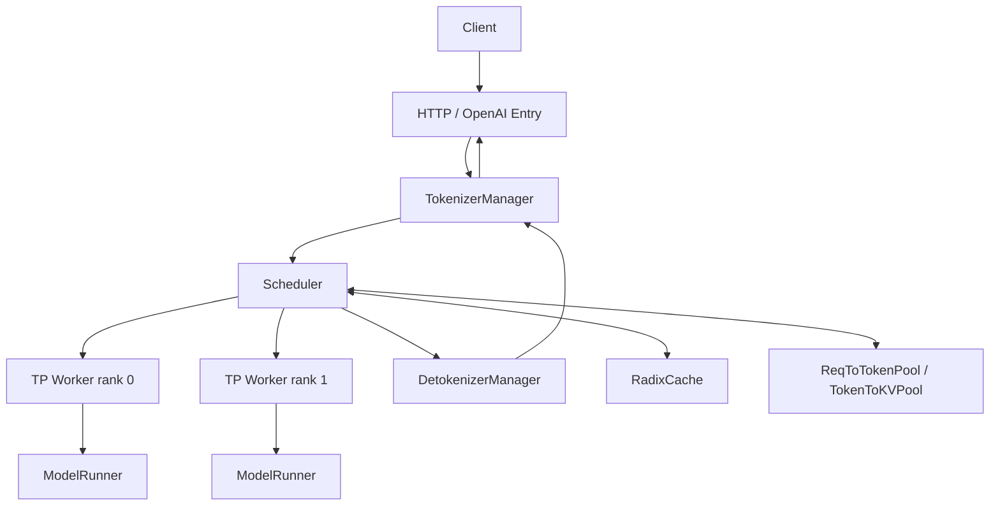
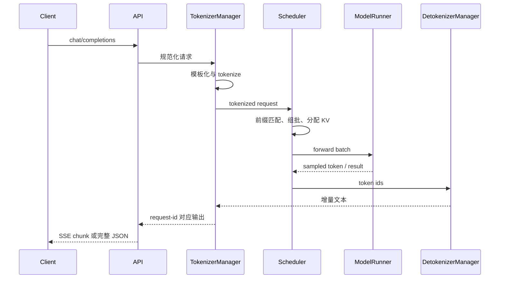
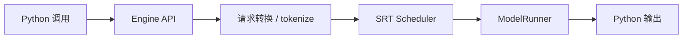
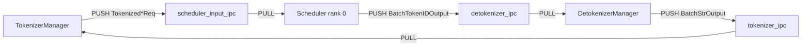

## 📑 目录
- [1. 一座分工明确的工厂](#1-一座分工明确的工厂)
- [2. 进程与组件全景](#2-进程与组件全景)
- [3. 请求入口](#3-请求入口)
- [4. TokenizerManager](#4-tokenizermanager)
- [5. Scheduler](#5-scheduler)
- [6. TP Worker 与 ModelRunner](#6-tp-worker-与-modelrunner)
- [7. DetokenizerManager](#7-detokenizermanager)
- [8. 完整时序](#8-完整时序)
- [9. Engine 路径](#9-engine-路径)
- [10. 源码阅读路线](#10-源码阅读路线)
- [11. 单请求源码追踪实验](#11-单请求源码追踪实验)
- [12. Trade-off](#12-trade-off)
- [总结](#总结)
- [自我检验](#自我检验)
- [参考资料](#参考资料)
---

## 1. 一座分工明确的工厂
先说白话：一个请求不是“交给模型，然后等答案”这么简单。它更像一张生产订单，要经过接单、翻译、排产、领料、加工、质检和发货。

| 工厂角色 | SRT 组件 | 主要工作 |
|---|---|---|
| 前台 | HTTP/OpenAI 入口 | 校验协议、建立流 |
| 翻译员 | TokenizerManager | 模板化、分词、请求登记 |
| 生产主管 | Scheduler | 排队、组批、分配 KV |
| 车间 | TpModelWorker | 组织各 rank 执行 |
| 机床控制器 | ModelRunner | 准备 tensor、运行 forward |
| 包装员 | DetokenizerManager | token 转文本、增量输出 |

术语上，这些组件共同构成 SGLang Runtime，也就是 SRT。理解架构时最重要的不是背类名，而是跟踪三种东西：
1. 请求消息如何流动；2. KV 和 batch 状态由谁持有；3. CPU 与 GPU 的边界在哪里。

## 2. 进程与组件全景

### 2.1 逻辑结构



图中箭头表达逻辑消息流，不保证每个部署模式都使用完全相同的进程拓扑。SRT 会根据 TP、DP、PD 解耦、Rust 前端等参数改变启动方式。

### 2.2 为什么要拆开
如果分词、调度、GPU forward 和反分词全塞进一个同步循环，CPU 工作会直接阻塞下一次 GPU 提交。拆分以后，可以让不同阶段并行推进：

```text
请求 A：GPU 正在 decode
请求 B：CPU 正在 tokenize
请求 C：正在流式 detokenize
请求 D：正在排队等待 KV slot
```

收益是流水化，代价是进程通信、消息类型和生命周期管理更复杂。

### 2.3 v0.5.17 的 Rust 前端边界
v0.5.17 release 加入“初始 Rust frontend 支持”，覆盖从网络 ingress 到 tokenized request 交给 GPU scheduler 之前的前半段。这说明前端正在演进，但不应据此断言 Python `TokenizerManager` 路径已经消失。本节使用成熟 Python SRT 主线讲概念；部署 Rust server 时，应再对照该版本 release 和启动选项。

## 3. 请求入口

### 3.1 OpenAI 请求先被转换
客户端发送：

```json
{
  "model": "Qwen/Qwen2.5-7B-Instruct",
  "messages": [
    {"role": "user", "content": "解释 RadixAttention"}
  ],
  "temperature": 0,
  "max_tokens": 128
}
```

入口层需要完成协议工作：
- 校验字段；选择 Chat Template；转换 sampling parameters；生成 request id；建立流式或非流式响应；处理取消和断连。
模型只认识 token id，不认识 OpenAI 的 `messages` 数组。因此入口必须先把业务协议转换为 SRT 内部请求。

### 3.2 Chat Template 的位置
白话上，Chat Template 是“把对话表格排版成模型训练时见过的剧本格式”。例如概念性结果可能是：

```text
<|im_start|>user
解释 RadixAttention<|im_end|>
<|im_start|>assistant
```

不同模型格式不同，这段仅用于说明，不应手工套给所有模型。模板错误通常不会触发 CUDA 异常，却会造成角色错位、工具调用失败或输出质量下降。

### 3.3 请求取消
流式客户端可能中途断开。生产系统必须让取消信号沿请求 id 回到运行时，否则 GPU 还会继续生成无人消费的 token。取消并非瞬间清除一切：调度器需要在安全点移除请求并释放相关引用。

## 4. TokenizerManager

### 4.1 它做什么
`TokenizerManager` 位于文本世界与 token 世界的边界。在 v0.5.17 源码中，主文件位于：

```text
python/sglang/srt/managers/tokenizer_manager.py
```

它的职责可概括为：
- 应用模板或处理已经提供的 token；执行 tokenize；检查长度与输入合法性；创建内部请求消息；向 scheduler 提交请求；收集输出并关联原始调用；管理流式迭代与取消。

### 4.2 为什么不能忽略分词
假设字符串长度相同：

```text
"hello world"
"你好，世界"
```

它们的 token 数不一定相同。调度器预算按 token 计算，而不是按字符计算。因此线上限流最好同时考虑：
- 请求字节数；输入 token；最大输出 token；多模态资源大小。

### 4.3 输入已经是 token
Native API 或内部调用可直接传 token ids，绕过重复 tokenize。这可以减少 CPU 工作，但调用方必须保证：错误 token 不一定立刻报错，可能只是生成异常文本。
- tokenizer 版本一致；special token 处理一致；token id 在词表范围内；Chat Template 已正确应用。

### 4.4 消息不是 Python 函数调用
组件之间通常通过定义明确的消息结构通信。可把它理解为：

```python
# 伪代码：用于理解，不是可直接导入的 v0.5.17 API
tokenized = TokenizedGenerateRequest(
    request_id=req_id,
    input_ids=input_ids,
    sampling_params=params,
    stream=True,
)
send_to_scheduler(tokenized)
```

消息边界使组件能独立运行，也要求字段演进保持兼容。

## 5. Scheduler

### 5.1 核心位置
调度主线位于：

```text
python/sglang/srt/managers/scheduler.py
```

周边还包括：

```text
managers/schedule_batch.py
managers/schedule_policy.py
mem_cache/
```

具体文件会随版本重构，所以阅读时必须固定 tag。

### 5.2 Scheduler 是状态中心
它不只决定“下一个请求是谁”。它还需要协调：这就是为什么调度器常是推理引擎最难读的部分。
- waiting 与 running 请求；Prefill、Extend、Decode；prefix cache 命中；KV token slot 分配；batch token budget；chunked prefill；请求完成和回收；分布式 worker 的一致执行。

### 5.3 两类内存映射
白话上，SRT 要回答两个问题：源码中可看到请求到 token、token 到 KV 的内存池抽象。逻辑关系可写成：
1. 某个请求的第 i 个 token 放在哪个 KV slot？；2. 某个 KV slot 的真实 K/V 张量在哪里？。
$$
\text{request position}\rightarrow \text{token slot}\rightarrow \text{KV tensor address}
$$
把这两层分开，才能让请求逻辑序列与物理显存布局解耦。

### 5.4 一个调度轮次
概念伪代码如下：

```python
# 伪代码：省略大量异常、分布式与 spec decode 分支
while alive:
    recv_new_requests()
    update_finished_requests()
    match_prefixes_in_radix_cache()
    batch = select_prefill_or_decode_batch()
    allocate_kv_slots(batch)
    result = model_worker.forward_batch(batch)
    process_sampled_tokens(result)
    send_output_or_requeue()
```

真实 v0.5.17 的 overlap 路径会让部分步骤跨轮重叠，不能逐行等同于上面伪代码。

### 5.5 Prefill、Extend 与 Decode
Prefill 是第一次处理一段 prompt。如果命中部分前缀缓存，只计算未命中的后缀，这通常称为 extend。Decode 则通常每个活跃序列推进一个新 token。手算示例：

```text
prompt 长度             = 1000
RadixCache 命中         = 700
本轮需要 extend 的 token = 300
```

忽略其他开销时，避免了 700 个 prompt token 的重复 prefill。但这不等于端到端延迟必然按 70% 下降，因为还存在查找、排队、采样和网络时间。

## 6. TP Worker 与 ModelRunner

### 6.1 TpModelWorker
Tensor Parallelism 把模型张量切到多个 rank。`TpModelWorker` 负责 worker 侧的模型执行组织，ModelRunner 则更接近具体 tensor 与 Kernel。可以类比：

```text
Scheduler      = 总调度
TpModelWorker  = 车间班组长
ModelRunner    = 机床控制器
```

### 6.2 ModelRunner
源码主线位于：

```text
python/sglang/srt/model_executor/model_runner.py
```

它需要处理：
- 模型加载；batch tensor 准备；attention backend；forward mode；CUDA Graph；logits 与采样相关输出；TP collective；多种模型架构分支。
这是性能优化高度集中的位置，也是最不适合从头逐行阅读的位置。

### 6.3 CUDA Graph
普通 CUDA launch 每轮都由 CPU 发起许多 Kernel。CUDA Graph 像预先录好一套固定舞步，满足形状约束时直接 replay。收益是降低 launch overhead，代价包括：
- 需要预留 graph buffer；batch shape 需要落入捕获范围；动态控制流更难；首次 capture 增加启动时间。
因此小并发 decode 常更受益，复杂 Prefill 路径则要看具体 graph 能力。

### 6.4 TP 通信手算
假设线性层按输出维度切到 2 个 rank，每张卡算一半结果。后续层若需要完整张量，就要执行 all-gather 或等价 collective。粗略时间下界可写为：
$$
T_{\text{step}} \approx T_{\text{compute}} + T_{\text{collective}} + T_{\text{host}}
$$
TP 增大时单卡计算减少，但 collective 不会自动消失。这解释了“更多卡”不保证线性加速。

## 7. DetokenizerManager

### 7.1 为什么单独反分词
模型每步输出 token id。客户端想看到 UTF-8 文本。若 scheduler 同步执行复杂 detokenize 和 stop string 检查，可能延迟下一次 GPU 提交。因此 SRT 把输出处理放到专门组件。主要源码位于：

```text
python/sglang/srt/managers/detokenizer_manager.py
```

### 7.2 增量解码不是简单拼接
某些 tokenizer 的一个字符可能跨多个 token。UTF-8 字节、空格规则和 special token 也需要处理。概念上不能简单写：

```python
text += tokenizer.decode([new_token])
```

真实实现需要维护增量状态，避免重复文本和乱码。

### 7.3 停止条件
完成原因可能包括：“停止”同时涉及文本和 token 语义，所以输出处理与 scheduler 要交换状态。
- 生成 EOS；达到最大新 token；命中 stop token；命中 stop string；请求被取消；发生错误。

## 8. 完整时序



### 8.1 TTFT 分解
可把首 token 延迟粗分为：
$$
TTFT =T_{queue}+T_{template}+T_{tokenize}+T_{prefix}+T_{prefill}+T_{sample}+T_{network}
$$
真实阶段可能重叠，所以这是分析模型，不是 profiler 的严格可加和事件。若长 prompt 的 `T_prefill` 占主导，RadixCache 命中可能很重要。若排队占主导，应先检查容量和调度，而不是继续优化 Kernel。

### 8.2 TPOT 分解
每个输出 token 的时间大致受以下因素影响：

```text
decode forward
TP/EP 通信
CPU 调度
采样
detokenize
流式发送
```

Overlap Scheduler 的目标，就是尽量把部分 CPU 工作藏在 GPU 执行期间。

## 9. Engine 路径
`sgl.Engine` 没有 HTTP 请求入口，但不会绕过 Scheduler 与 ModelRunner。逻辑上：



因此 Engine benchmark 去掉的是 HTTP 与网关开销，不是去掉动态调度。官方 `bench_offline_throughput` 会直接实例化 Engine；它回答“引擎在进程内的吞吐上限”，不等于真实在线 SLO。

## 10. 源码阅读路线

### 10.1 第一遍：只找边界
按这个顺序：

```text
launch_server / entrypoint
  → tokenizer_manager.py
  → scheduler.py
  → tp_worker.py
  → model_runner.py
  → detokenizer_manager.py
```

第一遍只回答“谁调用谁、消息是什么”。

### 10.2 第二遍：跟一个请求
选择一个最小非流式文本请求，搜索 request id 和内部消息类型。记录状态：

```text
文本
→ input_ids
→ waiting request
→ running batch
→ KV slot
→ output token
→ 文本
```

### 10.3 第三遍：打开一个优化
例如只研究 Radix Cache：

```text
请求何时 match_prefix
命中的 indices 存在哪里
何时增加引用
何时写回与淘汰
```

不要同时追 TP、spec decode、VLM 和 PD 分支。

### 10.4 用日志和 profiler 验证
源码推断要和运行证据互相校验。官方提供 server benchmark、offline benchmark、one-batch 工具，以及 profiler 控制接口。阅读代码得到假设，benchmark 与 timeline 用来证伪。

## 11. 单请求源码追踪实验

这一节不再用“接单—加工”类比，而是固定 v0.5.17 tag，把一次生成请求拆成四条可验证的主线：

```text
控制流：HTTP → TokenizerManager → Scheduler → TpModelWorker → ModelRunner
数据流：messages → token ids → Req → ScheduleBatch → ForwardBatch → token ids
状态流：rid_to_state → waiting_queue → running_batch → finished
输出流：BatchTokenIDOutput → BatchStrOutput → SSE/JSON
```

### 11.1 先认清进程与 rank

单 GPU、Python tokenizer 的典型逻辑进程是：

```text
HTTP/API + TokenizerManager
Scheduler rank 0 + TpModelWorker + ModelRunner
DetokenizerManager
```

TP>1 时，每个 TP rank 都要执行一致的模型控制流；只有 rank 0 直接承接前后端 IPC。v0.5.17 的 `SchedulerIpcChannels.create` 明确区分：

```text
rank 0:
  PULL  scheduler_input_ipc_name
  PUSH  tokenizer_ipc_name
  PUSH  detokenizer_ipc_name

non-rank-0:
  不直接收 TokenizerManager 请求
  不直接向前端/Detokenizer 发结果
```

DP、PP、Rust frontend、multi-tokenizer 和 Ray 会改变物理进程图，所以“一个类一个进程”不是通用定律。阅读时应先打印启动配置中的：

```text
tp_size / dp_size / pp_size
tokenizer_worker_num
skip_tokenizer_init
disable_overlap_schedule
disaggregation_mode
```

否则会把没有启用的路径误认为实际热路径。

### 11.2 IPC 不是共享 Python 对象

Python 主线通过 ZeroMQ 传输类型化消息。关键 socket 方向如下：



对应源码：

```text
python/sglang/srt/managers/tokenizer_manager.py
python/sglang/srt/managers/scheduler_components/ipc_channels.py
python/sglang/srt/managers/detokenizer_manager.py
python/sglang/srt/managers/io_struct.py
```

`TokenizerManager.init_ipc_channels` 创建异步 PULL/PUSH socket；Scheduler rank 0 创建相反方向的 socket；DetokenizerManager 使用同步事件循环。消息跨进程后不是同一个对象引用，因此：

- 后续对发送方对象的修改不会自动出现在接收方；
- tensor、multimodal 数据和自定义字段要遵守序列化约定；
- 消息字段变更必须同时考虑发送端、接收端和多版本部署；
- IPC 队列会形成背压与内存占用，不能当作零成本函数调用。

### 11.3 从 OpenAI 对象到 `GenerateReqInput`

入口主线位于：

```text
python/sglang/srt/entrypoints/openai/serving_chat.py
python/sglang/srt/entrypoints/openai/protocol.py
python/sglang/srt/managers/io_struct.py
```

OpenAI `messages` 仍是协议对象。入口完成模板、tool/reasoning 配置与采样字段转换后，进入通用的 `GenerateReqInput`。在 v0.5.17 中它的重要字段包括：

```text
rid / session_id
text 或 input_ids
sampling_params
stream
image/video/audio 等多模态字段
LoRA、cache namespace 与返回 logprob 选项
```

`rid` 是跨组件关联的主键。它不是“日志里可有可无的一串 UUID”，而是：

```text
前端等待哪个结果
取消哪个请求
流式 chunk 属于哪个调用
Scheduler 中哪个 Req 完成
Detokenizer 维护哪份增量状态
```

生产日志应记录 rid，但不应直接记录敏感 prompt。

### 11.4 `TokenizerManager` 的真实状态

源码中的 `ReqState` 至少持有：

```text
out_list          已到达的输出
finished          是否结束
event             唤醒等待 coroutine
obj               原始 GenerateReqInput/EmbeddingReqInput
time_stats        API 侧阶段时间
abort_requested   是否已请求取消
lifecycle_id      防止旧生命周期误通知新请求
dispatched        是否已送入 scheduler
```

管理器用 `rid_to_state: Dict[str, ReqState]` 将异步 HTTP coroutine 和 IPC 返回绑定起来。并行采样还维护逻辑 rid 与 child rid 的映射。由此可推导两个故障：

1. 结果到达但状态已删除：日志会看到“Received output ... state was deleted”；
2. 客户端断开但未派发取消：Scheduler 继续做无消费者计算。

分词后构造的真实消息类型是：

```text
TokenizedGenerateReqInput
BatchTokenizedGenerateReqInput
TokenizedEmbeddingReqInput
BatchTokenizedEmbeddingReqInput
```

`TokenizedGenerateReqInput` 的核心字段不是教程常见的三个参数，而包括：

```text
input_text
input_ids: array[int]
input_embeds
mm_inputs
token_type_ids
sampling_params: SamplingParams
return_logprob / top_logprobs_num
stream / rid
LoRA、session、bootstrap、custom logit processor 等扩展
```

数组使用紧凑 `array("q")`，多模态与某些字段还经过 pickle/shared-memory 包装。`_send_one_request` 在 dispatch 前设置 time stats、包装共享内存特征和 pickle 字段，再通过 PUSH socket 发给 Scheduler。

### 11.5 Scheduler 如何把消息变成 `Req`

调度器接收 `TokenizedGenerateReqInput` 后，创建运行时 `Req`。主类位于：

```text
python/sglang/srt/managers/schedule_batch.py
```

一个 `Req` 同时跨越逻辑、缓存、调度与输出状态。阅读时按领域分组，不要按 500 多行字段顺序死记：

**身份与原始输入**

```text
rid
origin_input_text
origin_input_ids
origin_input_ids_unpadded
output_ids
sampling_params
```

**内存与缓存**

```text
req_pool_idx
prefix_indices
last_node / last_host_node / best_match_node
cache_protected_len
kv_allocated_len
host_hit_length
cached_tokens_device / host / storage
```

**调度与完成**

```text
is_retracted
finished_reason
finished_len
extend_range
priority
grammar / grammar_key / grammar_wait_ct
```

**流式反分词**

```text
read_offset
surr_offset
surr_and_decode_ids
decoded_text
```

为什么需要 `cache_protected_len` 而不只看 `len(prefix_indices)`？page size>1 时，末尾可能有未进入 Radix Tree 的 partial page，但其 KV index 暂时仍在请求映射中。回收逻辑若把“匹配前缀长度”和“已受树保护的长度”混为一谈，会泄漏或 double free。

### 11.6 前缀匹配发生在 admission 前

`Req.init_next_round_input` 组织下一轮 fill ids，并调用 prefix cache。v0.5.17 还限制最大匹配通常不超过输入长度减一：

$$
H_{\max}\le P-1
$$

原因是至少保留一个位置用于计算下一 token/logprob 等语义；返回 logprob 时还可能由 `logprob_start_len` 进一步限制。于是一个 1000-token prompt 即使树中已有完整 1000 token，也不应机械期待本轮 `cached_tokens=1000`。

匹配结果回填：

```text
prefix_indices        L1/GPU 命中的 KV slots
last_node             最后一个 device 节点
last_host_node        L2 命中边界
best_match_node       综合层次后的最佳边界
host_hit_length       需要 load-back 的 token 数
```

然后 batch builder 才能计算真正 extend 长度：

$$
E=P-H_{device}-H_{restored}
$$

### 11.7 Waiting、Running 与 `NextBatchPlan`

v0.5.17 的正常循环不是简单返回一个 list，而是：

```python
# 对照源码结构的简化表示
plan = get_next_batch_to_run(
    running_batch=self.running_batch,
    last_batch=self.last_batch,
)
self.running_batch = plan.running_batch
batch = plan.batch_to_run
```

`NextBatchPlan` 分开表达“下轮持续持有的 running 状态”和“这次真正送 forward 的 batch”。这是理解 chunked prefill、mixed batch、retraction 和 overlap 的关键。

`ScheduleBatch` 则是本轮 CPU 侧执行计划，包含：

```text
reqs
forward_mode
input_ids 或 pinned prefill_input_ids_cpu
req_pool_indices
seq_lens / extend_lens
sampling_info
spec_info
multimodal_inputs
grammar 状态
cache/HiCache 传输状态
```

`Req` 是跨轮生命周期对象；`ScheduleBatch` 是某一轮对一组 Req 的视图。把两者混淆，会误以为每个 decode token 都重新创建完整请求。

### 11.8 两级内存映射做一次手算

假设请求 `r7` 获得：

```text
req_pool_idx = 7
逻辑位置     = [0, 1, 2, 3, 4]
物理 KV slot = [40, 41, 90, 91, 92]
```

则 `ReqToTokenPool.req_to_token[7, :5]` 保存第二行映射。`TokenToKVPool` 再把 slot 40、41、90... 解释为每层 K/V buffer 中的物理位置。

若前两个 token 来自 RadixCache，后 3 个新分配：

```text
prefix_indices = [40, 41]
extend slots    = [90, 91, 92]
```

ForwardBatch 的 attention metadata 可以用一套间接索引同时访问离散物理页，不需要把整个序列 KV 搬成连续块。请求结束时：

- `[40, 41]` 的所有权属于受引用的树节点；
- 新路径插入树后，重复的 slot 需要释放；
- 未插入或未对齐尾部也要释放；
- req_pool_idx 自身归还请求池。

这解释了缓存 bug 为什么常表现为“跑很久才 OOM”，而不是立即报错。

### 11.9 `ScheduleBatch → ForwardBatch`

`TpModelWorker.forward_batch_generation` 调用：

```text
ForwardBatch.init_new(batch, model_runner, ...)
```

`ForwardBatch` 位于：

```text
python/sglang/srt/model_executor/forward_batch_info.py
```

它把调度语义转成模型执行语义，例如：

```text
forward mode
GPU input_ids
positions
sequence lengths
attention backend metadata
KV pool 引用
sampling info
speculative/multimodal 信息
```

随后 `ModelRunner.forward` 在 eager、CUDA Graph 或模型专用 runner/backend 中执行。`ModelRunnerOutput` 至少承载 logits 输出、是否走 graph，以及可选专家分布等信息。普通 generation 还要经过 sampler 得到 `next_token_ids`。

一次 decode 的数据形状可粗略写成：

```text
input_ids: [batch_size]                 # 每序列一个新 token
positions: [batch_size]
seq_lens:  [batch_size]
KV:        分页池中的历史序列
logits:    [batch_size, vocab] 或优化后的需要部分
```

Prefill 则通常有 `sum(extend_lens)` 个输入 token，二者不能只用 batch_size 比较计算量。

### 11.10 TP rank 间一致性

TP 中各 rank 持有分片权重，但调度决策必须一致。rank 0 接到请求后，需要把执行所需控制信息广播或通过并行组协调，使所有 rank 以相同 batch 顺序进入 collective。任一 rank：

```text
batch size 不一致
调用 collective 顺序不同
提前异常退出
使用了不同 shape
```

都可能导致 NCCL hang，而不是干净 Python exception。因此排查多卡卡死时必须收集所有 rank 日志，并设置分布式 watchdog；只看 rank 0 最后一行往往误判为 GPU kernel hang。

### 11.11 输出消息的两阶段转换

Scheduler 输出的核心类型是 `BatchTokenIDOutput`。关键字段包括：

```text
finished_reasons
decoded_texts
decode_ids
read_offsets
output_ids（skip tokenizer init 时）
skip_special_tokens
spaces_between_special_tokens
no_stop_trim
prompt/completion/cached token 与 timing 元数据
```

DetokenizerManager 为每个 rid 保存 `DecodeStatus`：

```text
decoded_text
decode_ids
surr_offset
read_offset
sent_offset
```

增量 decode 使用“surrounding text 与 read text 的差”处理 tokenizer 边界：

$$
\Delta text=decode(ids_{surr:now})-decode(ids_{surr:read})
$$

这里的减号是字符串公共前缀意义，不是数值相减。若新文本以替换字符 `�` 结尾，说明 UTF-8/token 边界可能尚未完整，应等待更多 token，避免把乱码永久发给客户端。

Detokenizer 生成 `BatchStrOutput`，TokenizerManager 再按 rid 找回 `ReqState`，累积或增量发送给 OpenAI 层。`skip_tokenizer_init` 时 Scheduler 可直接把 token id 送回 tokenizer 侧，输出语义变为调用方自己负责 decode。

### 11.12 流式、非流式与取消的状态差异

非流式：

```text
多个 BatchStrOutput 到达
→ TokenizerManager 累积
→ finished_reason 非空
→ 一次返回完整 JSON
```

流式：

```text
每次可打印增量到达
→ event 唤醒 coroutine
→ 发送 SSE delta
→ 最后一块携带 finish reason/usage
```

客户端取消：

```text
HTTP coroutine 感知断连
→ 标记 abort_requested
→ AbortReq(rid) 送 Scheduler
→ 从 waiting/running 安全移除
→ 释放 request/KV 引用
→ 迟到结果必须能被识别并丢弃
```

取消和正常 EOS 不能走完全相同的业务统计：前者通常是 499/客户端取消，后者是成功完成。

### 11.13 用 request id 做源码实验

启动：

```bash
python -m sglang.launch_server \
  --model-path Qwen/Qwen2.5-7B-Instruct \
  --host 127.0.0.1 \
  --port 30000 \
  --log-level info \
  --log-requests \
  --enable-metrics
```

参数名必须先由 0.5.17 `--help` 核对。实验发送三类请求：

```text
A：非流式、短输入、max_tokens=4
B：流式、max_tokens=128，收到第 5 个 token 后取消
C：与 A 共享长前缀，验证 cached token
```

为每个请求记录：

```text
客户端 request id
到达与首/末 chunk 时间
prompt/completion/cached token
finish reason
取消后的 running/KV 回落时间
```

如果 OpenAI client 不允许直接指定 rid，可在反向代理添加 correlation id，并在服务端日志映射到实际 rid。不要把 correlation id 当成 SRT rid 本身。

### 11.14 失败注入与归因

**Tokenizer 慢：**发送超长文本或压力测试多请求，观察 API CPU 高但 GPU 有气泡。若输入已经是可信 token ids，对照绕过 tokenize 路径可确认 CPU 分词占比。

**Scheduler 堵塞：**限制 KV 容量并发长请求，观察 waiting 增长、GPU 仍有工作。此时不是 HTTP ingress 慢。

**Detokenizer 压力：**大量短 step 的流式请求，比较 batch decode 开关，观察 detokenizer CPU 与 token 发送间隔。不要用关闭 decode 后的 token-id 模式冒充真实文本服务。

**TP rank 故障：**在隔离环境终止一个 worker rank，确认 watchdog 能让整个副本 fail-fast，编排器摘流，而不是其余 rank 永久等待 collective。

**状态容量：**Detokenizer 的状态表默认有容量上限，源码通过 `SGLANG_DETOKENIZER_MAX_STATES` 控制。高并发下若旧状态被逐出，会报 `Decode status not found`。调大上限前先确认客户端取消、完成状态是否正常删除，否则只是掩盖泄漏。

### 11.15 阶段指标与守恒检查

建议建立阶段时间：

```text
t_ingress
t_tokenize_begin/end
t_scheduler_enqueue
t_first_forward_begin/end
t_first_detokenize
t_first_chunk
t_finish
```

于是：

$$
T_{queue}=t_{first\_forward\_begin}-t_{scheduler\_enqueue}
$$

$$
T_{model,first}=t_{first\_forward\_end}-t_{first\_forward\_begin}
$$

$$
TTFT_{client}=t_{first\_chunk}-t_{ingress}
$$

时间来自不同进程时必须保证同一主机单调时钟或做时钟同步，不能把 wall clock 漂移当成负延迟。

还应做 token 与状态守恒：

```text
进入 Scheduler 的 rid
= 完成 + 取消 + 仍 waiting + 仍 running + 明确失败

已分配 request slots
= running/chunked/受控暂存请求持有的 slots

物理 KV slots
= free + protected cache + evictable cache + active request 独占
```

守恒长期不闭合，通常比“显存每天涨一点”更早暴露生命周期 bug。

### 11.16 v0.5.17 源码断点清单

按一次请求设置日志或调试断点：

```text
entrypoints/openai/serving_chat.py
  OpenAI request → GenerateReqInput

managers/tokenizer_manager.py
  _tokenize_one_request
  _send_one_request / _send_batch_request
  event loop receiving BatchStrOutput

managers/scheduler_components/request_receiver.py
  receive tokenized messages

managers/scheduler.py
  process_input_requests
  get_next_batch_to_run
  run_batch
  process_batch_result

managers/schedule_batch.py
  Req.init_next_round_input
  ScheduleBatch construction and memory allocation

managers/tp_worker.py
  forward_batch_generation

model_executor/forward_batch_info.py
  ForwardBatch.init_new

model_executor/model_runner.py
  forward

managers/detokenizer_manager.py
  handle_batch_token_id_out
  incremental decode
```

调试生产大小模型时不要用 Python debugger 停住单个 TP rank：其他 rank 可能在 collective 中超时。更安全的是用最小单卡模型、结构化日志和 profiler 逐层验证。

## 12. Trade-off

| 架构选择 | 收益 | 代价 |
|---|---|---|
| 组件进程化 | CPU 阶段可并行 | IPC 与故障处理 |
| Tokenize 前移 | Scheduler 接收统一 token | 前端 CPU 压力 |
| 动态 Scheduler | 高利用率 | 状态机复杂 |
| KV 两级映射 | 灵活分页和共享 | 元数据维护 |
| CUDA Graph | 降低 launch overhead | 显存、形状约束 |
| TP Worker | 模型跨卡 | collective 开销 |
| 独立 Detokenizer | 不阻塞核心循环 | 增量状态复杂 |
| Rust 前端 | 降低前端瓶颈潜力 | v0.5.17 尚属初始支持 |

架构没有免费午餐。每次拆分都用复杂度换并行，每次缓存都用内存换计算，每次分布式都用通信换容量。

## 总结
SRT 的请求主线可以压缩成一句话：

```text
入口把业务请求变成 token，
Scheduler 把 token 变成可执行 batch，
ModelRunner 把 batch 变成新 token，
Detokenizer 再把 token 变回文本。
```

RadixCache 和内存池围绕 Scheduler 维护状态，TP Worker 围绕 ModelRunner 执行分布式计算。下一节将深入这条链路中最有 SGLang 辨识度的部分：RadixAttention 与 HiCache。

## 自我检验
- [ ] 我能说出请求经过的五个核心组件
- [ ] 我知道 Chat Template 不在 GPU 上执行
- [ ] 我能解释 TokenizerManager 的职责
- [ ] 我知道 Scheduler 不只是 FIFO 队列
- [ ] 我能画出请求位置到 KV 地址的两级映射
- [ ] 我能区分 Prefill、Extend 与 Decode
- [ ] 我知道 ModelRunner 是 Kernel 集中的位置
- [ ] 我能说明为什么 Detokenizer 独立
- [ ] 我知道 Engine 仍使用 SRT Scheduler
- [ ] 我不会把 Rust 前端初始支持描述成全面替代

## 参考资料
1. [SGLang v0.5.17 源码：SRT](https://github.com/sgl-project/sglang/tree/v0.5.17/python/sglang/srt)；2. [TokenizerManager v0.5.17](https://github.com/sgl-project/sglang/blob/v0.5.17/python/sglang/srt/managers/tokenizer_manager.py)；3. [Scheduler v0.5.17](https://github.com/sgl-project/sglang/blob/v0.5.17/python/sglang/srt/managers/scheduler.py)；4. [ModelRunner v0.5.17](https://github.com/sgl-project/sglang/blob/v0.5.17/python/sglang/srt/model_executor/model_runner.py)；5. [DetokenizerManager v0.5.17](https://github.com/sgl-project/sglang/blob/v0.5.17/python/sglang/srt/managers/detokenizer_manager.py)；6. [SGLang v0.5.17 Release](https://github.com/sgl-project/sglang/releases/tag/v0.5.17)；7. [Benchmark and Profiling](https://docs.sglang.ai/developer_guide/benchmark_and_profiling.html)。
> 源码路径固定到 v0.5.17；后续重构后请从消息类型与职责重新定位，不要只按文件名寻找。
