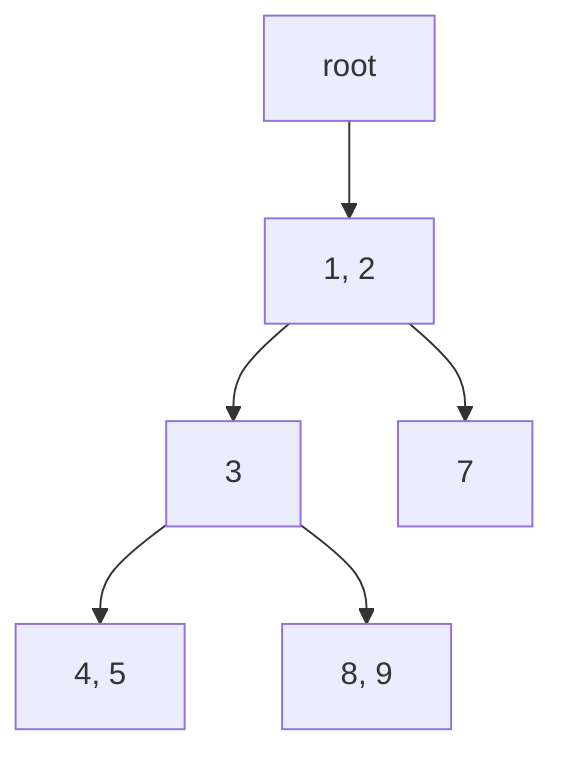
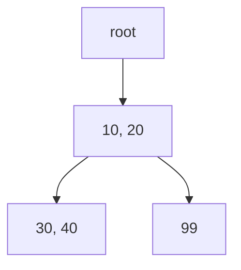
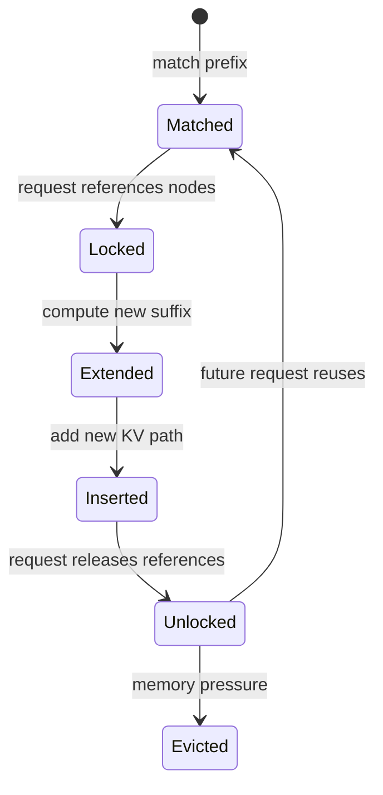
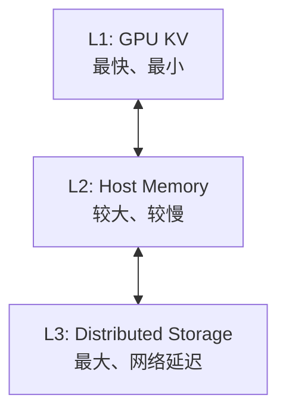

## 📑 目录
- [1. 为什么 KV 可以复用](#1-为什么-kv-可以复用)
- [2. RadixAttention 的核心](#2-radixattention-的核心)
- [3. 一次前缀匹配](#3-一次前缀匹配)
- [4. 插入、引用与释放](#4-插入引用与释放)
- [5. 淘汰策略](#5-淘汰策略)
- [6. 缓存感知调度](#6-缓存感知调度)
- [7. HiCache](#7-hicache)
- [8. 容量与收益手算](#8-容量与收益手算)
- [9. 观测与调优](#9-观测与调优)
- [10. 源码级树操作与 HiCache 数据流](#10-源码级树操作与-hicache-数据流)
- [11. Trade-off](#11-trade-off)
- [总结](#总结)
- [自我检验](#自我检验)
- [参考资料](#参考资料)
---

## 1. 为什么 KV 可以复用
先说白话：如果十位学生都读同一本教科书的前 100 页，老师没必要为每个人重新做十次同样的读书笔记。LLM 的“读书笔记”就是前缀 token 对应的 Key 和 Value，也就是 KV Cache。对于确定的模型权重和相同 token 前缀，前缀位置产生的 KV 可以被后续请求复用。

### 1.1 因果 Attention 的前缀性质
因果模型中，第 $i$ 个位置只能看见不晚于自己的 token：
$$
\text{Attention}(Q_i,K_{\le i},V_{\le i})
$$
假设两个请求共享前缀：
```text
请求 A = [system prompt] + 问题 A
请求 B = [system prompt] + 问题 B
```
在分叉之前，每个位置看到的历史完全相同，所以对应 KV 相同。分叉以后，历史不同，KV 不能继续共享。

### 1.2 复用的前提
“文本看起来一样”还不够，至少应保证：空格、模板、special token 的差异都可能让 token 前缀提前分叉。
- 同一个模型与权重版本；同一个 tokenizer；完全相同的 token ids；一致的位置编码语义；一致的多模态预处理结果；缓存布局和并行配置兼容。

## 2. RadixAttention 的核心

### 2.1 白话解释
普通 prefix cache 像把每份笔记装进独立文件夹。RadixAttention 像把所有笔记做成“共享目录树”：相同章节只存一份，走到分叉处才分成不同枝条。

### 2.2 Radix Tree
Radix Tree 是压缩前缀树。普通 Trie 的一条边常代表一个元素；Radix Tree 的一条边可以代表一段 token 序列。示例：
```text
请求 A: [1, 2, 3, 4, 5]
请求 B: [1, 2, 3, 8, 9]
请求 C: [1, 2, 7]
```

共同前缀 `[1, 2]` 只存一次。节点或边的元数据把 token 序列映射到物理 KV slot。

### 2.3 RadixAttention 不等于 Attention Kernel
名字里有 Attention，但核心创新是运行时 KV Cache 管理和复用策略。它与 paged KV layout、continuous batching、具体 attention backend 可以协同工作。不要把它理解为某个替代 FlashAttention 的单一矩阵 Kernel。

### 2.4 源码位置
v0.5.17 的缓存实现主线位于：
```text
python/sglang/srt/mem_cache/
```
阅读时重点寻找：文件会演进，固定 tag 比记住文件名更重要。
- RadixCache；prefix matching；insert；lock/ref counter；evict；token-to-KV pool；HiCache 相关组件。

## 3. 一次前缀匹配

### 3.1 示例
缓存树已有：
```text
[101, 20, 30, 40, 50]
[101, 20, 30, 60]
```
新请求：
```text
[101, 20, 30, 40, 99, 100]
```
最长可复用前缀：
```text
[101, 20, 30, 40]
```
命中 4 个 token，剩余 2 个 token 需要 extend。

### 3.2 手算
设：
```text
输入长度 P = 6000
缓存命中 H = 4500
未命中 U = P - H = 1500
```
则：
$$
U = 6000 - 4500 = 1500
$$
命中率按 token 计算：
$$
r = \frac{H}{P} = \frac{4500}{6000}=75\%
$$
这表示可跳过 4500 个前缀 token 的重复 prefill。它不表示 TTFT 必然降低 75%。更合理的分析式是：
$$
TTFT_{\text{hit}}\approx T_{queue}+T_{lookup}+T_{prefill}(U)+T_{other}
$$
而冷缓存：
$$
TTFT_{\text{miss}}\approx T_{queue}+T_{prefill}(P)+T_{other}
$$
只有当 prefill 占主导时，token 命中率才更接近实际收益方向。

### 3.3 Prefix key 是 token
缓存树比较 token id，不比较原始字符串。下面两段视觉上相近：
```text
"System: You are helpful."
"System:  You are helpful."
```
多一个空格就可能产生不同 token 序列。Agent 服务应规范 system prompt、工具定义排序和 JSON 序列化，减少无意义分叉。

### 3.4 匹配结果
概念伪代码：
```python
# 伪代码
prefix_indices, last_node = radix_cache.match_prefix(input_ids)
uncached_ids = input_ids[len(prefix_indices):]
request.prefix_indices = prefix_indices
request.last_node = last_node
```
真实实现还要处理 page size、分裂节点、并发引用和多模态 key。

## 4. 插入、引用与释放

### 4.1 何时插入
请求完成或生成过程中，已经计算出的 token KV 可以进入 Radix Tree。原始论文强调，不只缓存 prompt，也可保留生成结果，从而支持多轮和树状生成复用。例如：
```text
第 1 轮：system + user1 + assistant1
第 2 轮：system + user1 + assistant1 + user2
```
第二轮可以复用整个历史前缀，而不仅是 system prompt。

### 4.2 节点分裂
已有边：
```text
[10, 20, 30, 40]
```
新 key：
```text
[10, 20, 99]
```
插入后需要在 `[10, 20]` 处分裂：

压缩边减少树节点，但插入逻辑比普通哈希表复杂。

### 4.3 为什么需要引用
某个 running request 正在使用一段 KV 时，这段缓存不能被淘汰。可以把引用计数想成图书馆的“已借出”标记。
```text
引用数 > 0：正在使用，不能回收
引用数 = 0：可成为淘汰候选
```
如果只看 LRU 时间而不看引用，可能释放 GPU 即将读取的 KV。

### 4.4 生命周期
简化流程：


### 4.5 会话引用
v0.5.17 release 新增 opt-in 的 session-reference-aware Unified Radix Cache。请求可携带稳定 `session_id`，让淘汰知道活跃会话仍引用哪些前缀；会话结束后通过 `/close_session` 释放引用。启用参数：
```bash
--enable-session-radix-cache
```
这是面向 Agent 与 RL rollout 的新增能力，不应当作所有部署默认开启。若业务忘记关闭会话，引用可能持续占用缓存，因此要设计超时和清理策略。

## 5. 淘汰策略
GPU 显存有限，Radix Tree 不可能无限增长。

### 5.1 叶子优先
原始 RadixAttention 设计采用递归淘汰叶节点。为什么从叶子开始？内部节点往往是多个后缀共享的前缀；先删内部节点会让整个子树失去依据。叶节点通常代表更具体、复用范围更小的后缀。

### 5.2 LRU
Least Recently Used：优先淘汰最久未访问的可回收叶子。适合“最近用过的前缀更可能再次使用”的时间局部性。优点是直观、开销可控；缺点是一次扫描型流量可能冲掉热点。

### 5.3 LFU
Least Frequently Used：偏向保留累计访问频繁的前缀。它能保护长期热点，但旧热点可能因为历史计数过高而长期占位。

### 5.4 SLRU
Segmented LRU 将缓存分段，让新条目先接受“试用”，多次命中后再进入保护区。它试图同时利用最近性与频率信息，代价是状态和参数更多。

### 5.5 Priority
Priority 策略允许将业务优先级纳入淘汰。例如昂贵的超长 system prompt 可以比短临时前缀更值得保留。但业务优先级若设置失控，会导致普通请求几乎没有缓存空间。

### 5.6 v0.5.17 参数
该版本 server arguments 提供：
```bash
--radix-eviction-policy lru
```
文档列出的选项包括：
```text
lru
lfu
slru
priority
```
默认值与可用组合应以 v0.5.17 参数文档为准。

### 5.7 如何选择
先采集 workload：
```text
前缀长度分布
复用间隔
访问频率
租户数
缓存驻留时间
逐出后重算成本
```
没有 workload 数据时，复杂策略不一定胜过 LRU。

## 6. 缓存感知调度

### 6.1 为什么调度影响命中
假设等待队列有：
```text
A1：前缀 A
B1：前缀 B
A2：前缀 A
```
如果顺序是 A1、B1、A2，A 的 KV 可能在 A2 前因压力被逐出。如果把 A1、A2 靠近执行，更容易复用。

### 6.2 Longest Prefix Match
原始论文讨论按最长共享前缀优先，使访问顺序近似 Radix Tree 的 DFS。在论文给定的离线条件下，DFS 顺序可达到最优命中率。这个结论有条件：在线流量持续到达，不能直接套用“全局最优”。
- 离线已知请求集合；缓存容量满足论文定理条件；目标是缓存命中。

### 6.3 公平性
只追求最长前缀可能让冷门请求饥饿。因此生产调度要平衡：
$$
\text{目标} =\alpha \cdot \text{cache locality}+\beta \cdot \text{fairness}+\gamma \cdot \text{SLO}
$$
这不是 SGLang 的真实打分公式，而是帮助思考的多目标模型。缓存命中高但 P99 排队失控，不是成功优化。

## 7. HiCache

### 7.1 为什么只有 GPU 不够
RadixAttention 的 L1 缓存在 GPU，速度快但容量贵。长上下文和多轮对话会迅速占满 GPU KV。HiCache 把 CPU 和外部存储也纳入层次：

这像 CPU 的多级缓存：热数据留近处，冷数据移远处。

### 7.2 三层含义
| 层级 | 介质 | 典型特点 |
|---|---|---|
| L1 | GPU 显存 | 可直接被计算读取，容量最紧 |
| L2 | CPU 内存 | 容量更大，需要 H2D/D2H |
| L3 | 分布式存储 | 可跨实例共享，受网络影响 |
v0.5.17 官方文档列出的 L3 生态包括 Mooncake、3FS、NIXL、AIBrix KVCache 等集成方向。具体 backend 是否适合目标平台，必须查对应版本文档与依赖。

### 7.3 基本参数
官方 best practices 给出的核心开关包括：
```bash
python -m sglang.launch_server \
  --model-path YOUR_MODEL \
  --enable-hierarchical-cache \
  --page-size 64 \
  --hicache-size 100 \
  --hicache-io-backend kernel \
  --hicache-write-policy write_through
```
`--hicache-size 100` 表示主机缓存大小配置，单位和精确定义应以 v0.5.17 参数帮助为准。也可用 `--hicache-ratio` 按 GPU 缓存比例规划；显式 size 会覆盖比例的行为要按官方文档核对。

### 7.4 写策略
Write-through 会在写 L1 时同步或按设计推进到下层，恢复命中更稳，但增加传输。Write-back 倾向先留在近端，批量或淘汰时再写远端，写路径轻，但故障和一致性更复杂。选型要看：
- 多轮请求是否很快回来；D2H 带宽是否紧张；L3 是否跨实例复用；数据丢失后是否只需重算；PD 解耦的 KV 流向。

### 7.5 与 PD 解耦
官方文档给出两类思路：第二种更完整，但数据流和带宽压力更大。HiCache 不是“打开后所有请求更快”，L2/L3 miss 或搬运也会增加开销。
1. 只在 Prefill 节点启用 HiCache；2. Prefill 使用 HiCache，Decode 异步回写，支持多轮复用。

## 8. 容量与收益手算

### 8.1 KV 大小公式
对标准 MHA/GQA，可用粗略公式估算每 token KV：
$$
B_{\text{token}}=2 \times L \times H_{kv} \times D \times b
$$
其中：
- 2 表示 K 和 V；$L$ 是层数；$H_{kv}$ 是 KV head 数；$D$ 是 head dimension；$b$ 是每元素字节数。

### 8.2 示例
假设：
```text
L = 32
H_kv = 8
D = 128
BF16: b = 2 Bytes
```
则：
$$
B_{\text{token}}=2\times32\times8\times128\times2=131072\text{ Bytes}=128\text{ KiB}
$$
一个 8192-token 序列约为：
$$
8192\times128\text{ KiB}=1\text{ GiB}
$$
这是教学估算，不含 page 元数据、对齐和特殊 attention 架构差异。MLA、混合线性 attention、KV 量化会改变公式。

### 8.3 共享节省
10 个请求共享 4000-token system prompt。不共享时，按上例：
$$
10\times4000\times128\text{ KiB}\approx4.88\text{ GiB}
$$
共享一份时：
$$
1\times4000\times128\text{ KiB}\approx0.49\text{ GiB}
$$
理论上少存约 4.39 GiB 的重复前缀 KV。真实显存变化受分页、并行分片、缓存保留和 allocator 影响。

### 8.4 L2 搬运是否划算
设从 CPU 恢复 KV 时间为：
$$
T_{load}=\frac{B_{KV}}{BW_{H2D}}+T_{setup}
$$
若重新 prefill 时间 $T_{recompute}$ 大于 $T_{load}$，恢复可能划算。如果前缀很短或链路拥塞，重算可能反而更快。HiCache 本质是在计算、容量和 I/O 之间做选择。

## 9. 观测与调优

### 9.1 先确认真的命中
启用：
```bash
--enable-cache-report
```
再观察 OpenAI usage 中的 cached token 信息。不要只看第二次请求变快就断言是 RadixCache；也可能是 Kernel warmup 或文件缓存。

### 9.2 构造 A/B 请求
```text
A：固定 4000-token 前缀 + 问题 1
B：同一前缀 + 问题 2
C：不同前缀 + 问题 3
```
先 A 预热，再交替 B/C，比较：
- cached token；TTFT；GPU prefill 工作；队列时间；缓存淘汰。

### 9.3 规范化前缀
Agent 场景建议：一个位于开头的动态 request id，可能让后面几千 token 全部无法共享。
- system prompt 版本化；工具列表稳定排序；JSON 使用确定性序列化；不把时间戳放在长前缀开头；用户特有字段尽量后置；明确 session 生命周期。

### 9.4 何时关闭 Radix Cache
调试确定性、定位缓存 bug 或 workload 几乎无复用时，可以评估：
```bash
--disable-radix-cache
```
官方 FAQ 也指出，关闭 Radix Cache 并单请求运行可提高结果可重复性；v0.5.17 另有 deterministic inference 相关能力。关闭缓存通常会放弃可复用前缀收益，不能只为“配置简单”长期关闭。

## 10. 源码级树操作与 HiCache 数据流

本节固定到 v0.5.17 的 Python RadixCache 主线：

```text
python/sglang/srt/mem_cache/radix_cache.py
python/sglang/srt/mem_cache/hiradix_cache.py
python/sglang/srt/mem_cache/memory_pool.py
python/sglang/srt/mem_cache/allocator/
python/sglang/srt/mem_cache/cache_init_params.py
```

该版本还存在 C++ Radix Tree、Unified Radix Cache、SWA/Mamba 等实现。下面的字段与逐步手算对应经典 `RadixCache`；启用 unified memory 或特殊模型后应沿实际构造类型重新追踪，不能把 Python 类的每个字段强套到所有 backend。

### 10.1 `RadixKey` 不只是 token tuple

v0.5.17 的 key 包含：

```text
token_ids
extra_key
is_bigram
```

`extra_key` 用于隔离逻辑 namespace，例如 LoRA/adapter、cache salt 或不能共享状态的上下文。即使 token 完全相同：

```text
K1 = (extra_key="tenant-A", [1,2,3])
K2 = (extra_key="tenant-B", [1,2,3])
```

也必须视为不同缓存路径。否则会发生跨 adapter 读取错误 KV，这不是命中率问题，而是正确性与隔离问题。

EAGLE 等路径可能使用 bigram view；常规读者先理解 token key 即可，但调试 speculative cache 长度时必须注意 key 元素数可能是原始 token 数减一。

### 10.2 `TreeNode` 字段逐项解释

经典节点在 v0.5.17 中包含：

```text
children: 子边首个 page key → TreeNode
parent: 父节点
key: 从 parent 到当前节点的压缩 token 段
value: 与 key 等长的 device KV slot indices
lock_ref: 设备侧路径引用计数
last_access_time: eviction 最近性
creation_time: 创建时间
hit_count: 访问频率策略输入
host_ref_counter: L2/L3 I/O 对 host 数据的保护
host_value: host KV slot indices
write_through_pending_id: 异步 write-through 追踪
hash_value: 每页内容哈希，供外部存储索引
priority: priority eviction 的业务权重
id: 单调节点 id
```

必须保持的局部不变量：

$$
len(node.key)=len(node.value)
$$

若存在完整 L2 backup：

$$
len(node.host\_value)=len(node.key)
$$

page size>1 时：

$$
len(node.key)\bmod page\_size=0
$$

根节点是特殊哨兵：

```text
key = []
value = []
host_value = []
lock_ref = 1
priority = 极小值
```

根永不按普通叶子淘汰。把根的 lock_ref 纳入“受保护 token 数”会产生错误统计。

### 10.3 树状态记号

后续手算用：

```text
N{id}: key | value | lock_ref | last_access
```

其中 `value` 用物理 KV slot 表示。例如：

```text
N1: [10,20] | [100,101] | 0 | t1
```

表示从父节点到 N1 的边有两个 token，对应 slot 100、101。完整前缀必须沿 parent 链拼接 key：

```text
root → [10,20] → [30,40]
```

叶节点的 `key=[30,40]` 不代表其完整 key 只有两个 token，而是完整 `[10,20,30,40]`。

### 10.4 从空树插入 A

设 `page_size=1`，请求 A：

```text
tokens A = [10,20,30,40]
slots  A = [100,101,102,103]
```

插入前：

```text
root
```

没有以 `10` 开头的 child，创建叶子：

```text
root
└─ N1: [10,20,30,40] | [100,101,102,103] | 0
```

`insert` 返回的 `prefix_len=0`，含义是新 key 与已有树重复的长度为 0。它不是“插入了 0 token”；恰恰表示所有 4 个 token 都成为新缓存。

此时：

```text
total_size       = 4
evictable_size   = 4
protected_size   = 0
evictable_leaves = {N1}
```

### 10.5 插入 B 触发 split

请求 B：

```text
tokens B = [10,20,50]
slots  B = [200,201,202]
```

查到 child N1，公共长度：

$$
LCP([10,20,30,40],[10,20,50])=2
$$

`_split_node` 产生新中间节点 N2。N2 继承原节点的 priority、hit count 和 lock ref；key/value 都在 split 点切开：

```text
root
└─ N2: [10,20] | [100,101] | 0
   ├─ N1: [30,40] | [102,103] | 0
   └─ N3: [50]    | [202]     | 0
```

B 的前两个新计算 slot `[200,201]` 与已有 `[100,101]` 重复。`insert` 返回 `prefix_len=2`，请求收尾逻辑会释放重复 slot 200、201，只让树持有 202。

这一步体现“逻辑 token 相同”和“物理 slot 相同”是两件事：

```text
计算时 B 前缀可能暂存在 200/201
树中权威共享副本仍是 100/101
插入后重复物理副本必须回收
```

### 10.6 插入 C 复用整条内部路径

请求 C：

```text
tokens C = [10,20,30,40,60]
slots  C = [300,301,302,303,304]
```

匹配过程：

```text
root → N2，命中 2
N2   → N1，命中 2
N1 无 child 60
```

插入后：

```text
root
└─ N2: [10,20] | [100,101]
   ├─ N1: [30,40] | [102,103]
   │  └─ N4: [60] | [304]
   └─ N3: [50] | [202]
```

返回 `prefix_len=4`，重复的 `[300..303]` 被释放。完整树只保存 6 个物理 token slot：

```text
[100,101,102,103,202,304]
```

而三个独立序列总长度是：

$$
4+3+5=12
$$

该例共享节省 6 个 slot。

### 10.7 `match_prefix` 也可能修改树

现在查询 D：

```text
D = [10,20,30,99]
```

先走 N2 命中 2，再进入 N1。N1 的 key `[30,40]` 只命中 `[30]`，匹配结束点位于压缩边内部。实现会 split：

```text
root
└─ N2: [10,20] | [100,101]
   ├─ N5: [30] | [102]
   │  └─ N1: [40] | [103]
   │     └─ N4: [60] | [304]
   └─ N3: [50] | [202]
```

返回：

```text
device_indices = [100,101,102]
last_node      = N5
```

重要结论：`match_prefix` 在逻辑上是查询，但为暴露精确边界可能做结构性 split。若并发线程可以同时读写同一树，不能把它当无锁只读操作。

### 10.8 page size 改变可见前缀

设 `page_size=4`，树已有 12-token 前缀。新请求匹配 10 token。`RadixKey.page_aligned` 执行：

$$
H_{aligned}=\left\lfloor\frac{10}{4}\right\rfloor\times4=8
$$

只有前 8 token 能成为树级命中。剩余 2 token 可能已有请求局部 KV，但不能作为完整 page 挂入 Radix Tree。

又设请求总长 18：

$$
P_{aligned}=\left\lfloor\frac{18}{4}\right\rfloor\times4=16
$$

插入树最多到 16；尾部 2 token 要由请求生命周期单独回收。v0.5.17 因此在 `Req` 中区分：

```text
prefix_indices
cache_protected_len
kv_allocated_len
```

不能只用一个“cached length”处理 ownership。

page size 的权衡：

- 小页：匹配粒度细、内部碎片少、树和 allocator 元数据更多；
- 大页：传输与索引更规整、metadata 少，但命中向下取整、短分支浪费增加；
- HiCache 的 L2/L3 哈希与搬运也以页为基本粒度，修改 page size 会同时改变计算缓存和 I/O。

### 10.9 lock ref 是整条祖先路径

请求 D 使用 N5 作为 `last_node`。`inc_lock_ref(N5)` 不是只加 N5，而是沿父链直到根：

```text
N5: 0 → 1
N2: 0 → 1
root: 保持特殊状态
```

于是：

```text
protected_size += len(N5.key)+len(N2.key)=1+2=3
evictable_size -= 3
```

第二个请求也引用 N5：

```text
N5: 1 → 2
N2: 1 → 2
```

protected size 不再增加，因为节点从 1 到 2 仍是 protected；只有 `0→1` 攠变 evictable/protected 分类。

第一个请求释放：

```text
2 → 1
```

仍不可淘汰。第二个释放：

```text
1 → 0
```

才把对应 token 数放回 evictable。由此得到计数不变量：

$$
total\_size=protected\_size+evictable\_size
$$

若长期不成立，要检查 split 时 lock 继承、取消路径或 double decrement。

### 10.10 leaf eviction 逐步手算

沿用当前树，假设所有 lock 都是 0，LRU 时间：

```text
N3 [50] 最旧
N4 [60] 次旧
N1 [40] 较新
N5 [30] 更新
N2 [10,20] 最新
```

要回收 2 token：

1. heap 从 `evictable_leaves={N3,N4}` 选最旧 N3；
2. 释放 N3.value `[202]`，删除 N3，已回收 1；
3. N3 的 parent N2 仍有 child N5，不能成为叶；
4. 选 N4，释放 `[304]`，删除 N4，累计 2；
5. N4 parent N1 变成无 child 且 lock_ref=0，压入 heap，但目标已满足。

树变为：

```text
root
└─ N2 [10,20]
   └─ N5 [30]
      └─ N1 [40]
```

若继续回收，N1 可被删；随后 N5 成叶，再删 N5；最后 N2 成叶。算法由叶向根收缩，不会留下引用已删除父前缀的孤儿。

注意一次节点 value 可能比目标剩余量大。要求“再释放 1 token”时，叶 key 长 64 token，实际可能回收 64。容量规划要允许 page/node 粒度的过量回收。

### 10.11 `cache_unfinished_req` 的所有权转移

Chunked Prefill 中，请求尚未完成也会把已计算段插入树：

```text
ReqToTokenPool 中读取当前 fill_ids 对应 slots
→ page align
→ insert
→ 释放与既有树重复的请求私有 slots
→ 重新 match 得到树的权威 indices
→ 回写 req_to_token 映射
→ old last_node dec_lock_ref
→ new last_node inc_lock_ref
→ 更新 prefix_indices / cache_protected_len
```

这不是“复制一份 KV 到树”。树节点保存的是 slot index；核心动作是所有权与映射切换。处理错误会出现：

```text
重复 slot 未 free → 显存泄漏
树持有 slot 被 free → use-after-free/错误输出
旧节点未 unlock → cache 永远不可淘汰
新节点未 lock → running request 的 KV 被淘汰
partial page 当作完整页 → 越界或错误命中
```

### 10.12 Scheduler 并发与缓存安全

经典主线中树变更集中在 Scheduler 线程，这是重要简化：GPU 异步执行，不代表多个 Python 线程可以任意修改 Radix Tree。HiCache 引入后台 I/O 后，需要额外 tracking：

```text
ongoing_write_through
ongoing_load_back
ongoing_prefetch
ongoing_backup
work_list
```

后台线程/进程完成 I/O 后通过控制队列返回，Scheduler 在确定点应用 ack、release 与节点变更。不要让存储 callback 直接无锁改树。

TP 下各 rank 的 host pool 分配与控制队列也要保持 lockstep。某一 rank host allocation 成功、另一 rank 失败而决策不一致，会导致后续 collective 或 KV layout 分叉。

### 10.13 HiCache L1/L2 命中路径

L1 命中：

```text
Radix tree match
→ node.value 存在
→ 返回 device_indices
→ 直接成为 Req.prefix_indices
→ 只 extend 未命中后缀
```

L2 命中但 L1 已逐出：

```text
树/层次元数据匹配 host prefix
→ node.host_value 指向 host pool
→ Scheduler 为 L1 分配 device slots
→ CacheController 发起 H2D
→ 记录 ongoing_load_back
→ 等必要完成事件
→ node.value/请求映射切到恢复后的 device slots
→ forward 读取 L1
```

GPU attention 不能直接把普通 host DRAM 当作等价 L1 KV 使用。L2 命中的收益条件是：

$$
T_{lookup}+T_{alloc}+T_{H2D}+T_{sync}<T_{recompute}
$$

若 32 MiB 前缀、有效 H2D 24 GiB/s、setup 0.1 ms：

$$
T_{H2D}\approx\frac{32}{24\times1024}s+0.1ms\approx1.40ms
$$

若同前缀重算仅 0.8 ms，恢复反而更慢；若重算 10 ms，L2 很有价值。

### 10.14 write-through 的节点不变量

`HiRadixCache.write_backup` 把 `node.value` 对应 KV 写入 host pool，成功后设置：

```text
node.host_value
node.write_through_pending_id
ongoing_write_through[node.id]
```

write-through 模式要求备份形成从 root 开始的连续前缀：若父节点尚未 backup，非根 child 不能先成为孤立 host backup。否则 L1 miss 后即使 L2 有后缀，也无法恢复其所依赖的前缀。

异步写未完成时还要保护 node：

```text
device lock_ref 防止 D2H 读取过程中 L1 被释放
host_ref_counter 防止 storage 写过程中 L2 被释放
pending id 将 ack 对应到正确节点
```

节点在 pending 期间被 split 时，追踪项必须从旧 node 替换成新节点集合。否则 ack 回来只释放旧对象，新的 split 节点可能永久锁定。

### 10.15 write-back 路径

write-back 倾向在 L1 eviction 时才备份：

```text
选择 device leaf
→ 为 L2 分配 host pages
→ D2H copy
→ 等完成
→ node.host_value 生效
→ 释放 node.value 对应 L1 slots
→ 保留树节点为 host-only
```

它减少从未被逐出的热节点写流量，但淘汰路径变长。内存压力突发时，大量 D2H 可能阻塞新请求 admission。生产上要监控：

```text
D2H bytes/s 与队列深度
eviction latency
host pool available pages
write-back failure/fallback
因等待备份造成的 TTFT
```

### 10.16 L3 storage prefetch

L3 常以每页 hash 作为内容键。逻辑流程：

```text
计算请求前缀 page hashes
→ 查询 storage 命中页数
→ 命中结果回 Scheduler
→ 只为实际命中长度分配 host pages
→ L3 → L2 读
→ L2 → L1 load-back
→ forward
```

v0.5.17 的 `HiRadixCache` 追踪每请求 storage loaded token，并在 host allocation 不足时尝试缩短到 page-aligned 前缀；若短于 prefetch threshold 则撤销 prefetch，回退重算。这个回退很关键：层次缓存失败应降级为计算 miss，而不是让请求永久挂起。

总恢复时间：

$$
T_{L3hit}=T_{hash}+T_{query}+T_{L3\to L2}+T_{L2\to L1}+T_{sync}
$$

设 512 MiB KV：

```text
L3→L2 有效 20 GiB/s = 25 ms
L2→L1 有效 24 GiB/s = 20.8 ms
查询与 setup          = 2 ms
```

串行约：

$$
47.8ms
$$

若流水化分块，steady-state 可接近较慢一级而非简单求和，但首块和尾块、队列与 page bookkeeping 仍存在。只有重新 Prefill 明显大于这个成本才有净收益。

### 10.17 Mooncake 的边界

Mooncake 可以作为 PD 传输或外部 KV 存储生态的一部分，但它不是 `sglang[all]` 内置。第 12.6 节固定：

```bash
python -m pip install "sglang-router==0.3.2"
python -m pip install mooncake-transfer-engine
```

使用前必须核对 SGLang v0.5.17 的：

```text
Mooncake connector 参数
RDMA/NIC/NUMA 拓扑
容器 memlock 与设备权限
数据格式、page size 和 TP layout
故障时回退与超时
```

“L3 配了 Mooncake”不等于跨副本自动共享正确 KV；模型 revision、tokenizer、parallel layout、KV dtype、namespace 与 hash schema 都必须兼容。

### 10.18 缓存实验矩阵

构造四组长度都为 4096 的请求：

```text
A：固定 3072-token 前缀 + 随机 1024
B：与 A 完全相同前缀
C：第 1 token 就不同，其余文本类似
D：同 token 前缀但 extra_key/LoRA 不同
```

顺序：

```text
1. flush 后发 A
2. 发 B，验证 L1 hit
3. 制造 L1 压力但保留 L2，再发 B，验证 L2 hit
4. 发 C，验证近似 miss
5. 发 D，验证 namespace 隔离
```

每个请求记录：

```text
cached_tokens_device
cached_tokens_host
cached_tokens_storage
uncached/extend tokens
TTFT
H2D/D2H/storage bytes
evicted tokens
tree protected/evictable size
host/device pool available slots
```

检查近似守恒：

$$
P=H_{device}+H_{host}+H_{storage}+E
$$

实际计数可能因“保留最后一个 token 计算”、page alignment 和 overlapping source 去重略有边界差异，报告必须说明定义。

### 10.19 缓存失败注入

**L2 容量不足：**减小 HiCache host pool，构造大前缀。期待出现 host eviction 或 prefetch 缩短/撤销，请求仍可通过 recompute 完成。

**L3 超时：**在测试环境给 storage backend 注入延迟。验证 prefetch timeout 后降级，不让 Scheduler 无限等待。

**请求取消：**L3 查询或 H2D 正在进行时取消。确认：

```text
ongoing_prefetch/load_back 项被清理
预分配 host/device pages 归还
host_ref_counter/lock_ref 归零
迟到 ack 不会复活已取消请求
```

**split during write-through：**并发插入共享一半前缀的请求，让 pending node split。完成后检查所有新节点 pending id 与引用均能释放。

**跨 namespace 污染：**相同 token、不同 LoRA/cache salt。若出现 cached token 共享，立即按正确性事故处理。

### 10.20 什么时候命中率会骗人

两个 workload 都是 80% token hit：

```text
Workload X：每请求 100 token，命中 80
Workload Y：每请求 10000 token，命中 8000
```

Y 避免的 Prefill FLOPs 远高于 X。更合理的缓存价值指标是：

$$
SavedCompute=\sum_i \left(C_{prefill}(P_i)-C_{prefill}(P_i-H_i)\right)
$$

再减去层次 I/O：

$$
NetBenefit=SavedCompute-T_{lookup}-T_{transfer}-T_{contention}
$$

生产仪表盘至少同时展示：

```text
request hit rate
token hit rate
device/host/storage hit token
避免的 prefill token/s
cache lookup/load latency
eviction/recompute rate
P99 TTFT goodput
```

## 11. Trade-off
| 机制 | 收益 | 代价 |
|---|---|---|
| Radix Tree | 任意树状前缀共享 | 树操作与元数据 |
| 缓存生成结果 | 多轮复用 | 占用更多 KV |
| LRU | 简单、利用时间局部性 | 扫描流量污染 |
| LFU | 保护长期热点 | 旧热点滞留 |
| SLRU | 兼顾新旧 | 参数更多 |
| Priority | 体现业务价值 | 可能挤压普通租户 |
| 缓存感知调度 | 提高 locality | 公平性风险 |
| HiCache L2 | 扩大容量 | PCIe/NVLink I/O |
| HiCache L3 | 跨实例与大容量 | 网络、存储与一致性 |
| session 引用 | 保护活跃 Agent 前缀 | 必须正确 close |

## 总结
RadixAttention 做了三件事：
```text
用 Radix Tree 表达共享前缀
用引用与淘汰安全管理 KV
用缓存感知顺序提高复用机会
```
HiCache 再把同一思想从 GPU 扩展到 CPU 与分布式存储。判断收益时，不要只看命中率；还要看命中的 token 数、避免的 prefill、KV 搬运、排队和尾延迟。

## 自我检验
- [ ] 我能解释相同前缀 KV 为什么可复用
- [ ] 我知道 Radix Tree 的边可包含多个 token
- [ ] 我不会把 RadixAttention 当作单一 Attention Kernel
- [ ] 我能手算命中 token 与未命中 token
- [ ] 我知道运行中节点不能被淘汰
- [ ] 我能比较 LRU、LFU、SLRU 和 priority
- [ ] 我知道缓存感知调度可能造成饥饿
- [ ] 我能说出 HiCache 的 L1/L2/L3
- [ ] 我会比较恢复 KV 与重新 prefill 的成本
- [ ] 我知道 session cache 需要关闭会话

## 参考资料
1. [SGLang 论文，NeurIPS 2024](https://arxiv.org/abs/2312.07104)；2. [Fast and Expressive LLM Inference with RadixAttention](https://lmsys.org/blog/2024-01-17-sglang/)；3. [SGLang v0.5.17 mem_cache 源码](https://github.com/sgl-project/sglang/tree/v0.5.17/python/sglang/srt/mem_cache)；4. [HiCache Design](https://docs.sglang.ai/advanced_features/hicache_design.html)；5. [HiCache Best Practices](https://docs.sglang.ai/advanced_features/hicache_best_practices.html)；6. [Server Arguments: radix eviction policy](https://docs.sglang.ai/advanced_features/server_arguments.html)；7. [SGLang v0.5.17 Release](https://github.com/sgl-project/sglang/releases/tag/v0.5.17)；8. [SGLang FAQ](https://docs.sglang.ai/references/faq.html)。
> 性能收益与 KV 容量均依赖模型结构、精度、并行方式和 workload；文中手算用于建立量纲，不替代实测。
