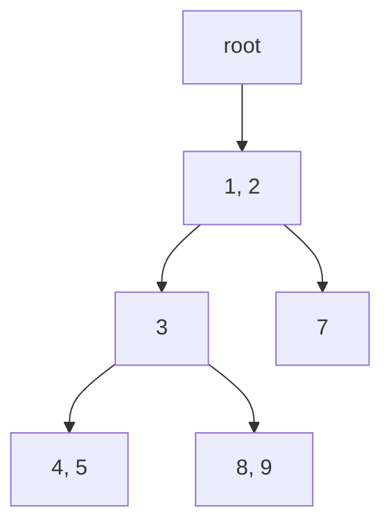
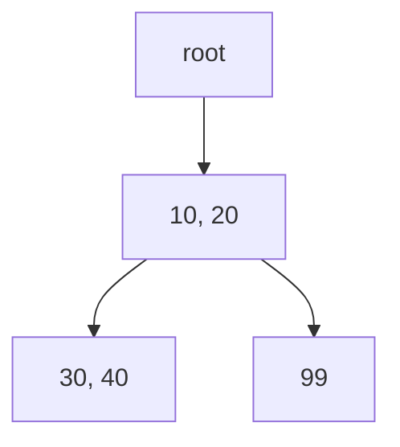
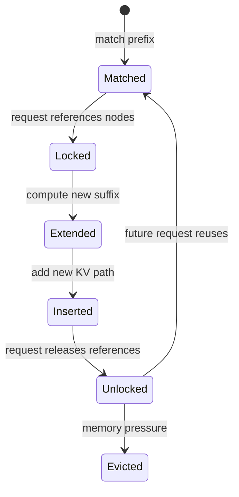
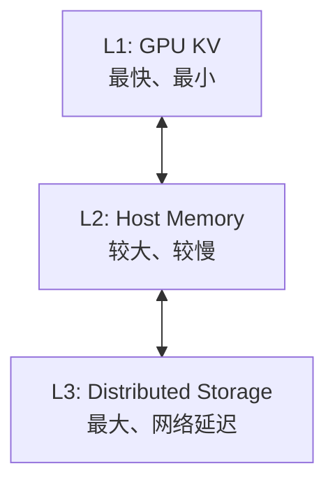

## 📑 目录
- [1. 为什么 KV 可以复用](#1-为什么-kv-可以复用)
- [2. RadixAttention 的核心](#2-radixattention-的核心)
- [3. 一次前缀匹配](#3-一次前缀匹配)
- [4. 插入、引用与释放](#4-插入引用与释放)
- [5. 淘汰策略](#5-淘汰策略)
- [6. 缓存感知调度](#6-缓存感知调度)
- [7. HiCache](#7-hicache)
- [8. 容量与收益手算](#8-容量与收益手算)
- [9. 观测与调优](#9-观测与调优)
- [10. Trade-off](#10-trade-off)
- [总结](#总结)
- [自我检验](#自我检验)
- [参考资料](#参考资料)
---

## 1. 为什么 KV 可以复用
先说白话：如果十位学生都读同一本教科书的前 100 页，老师没必要为每个人重新做十次同样的读书笔记。LLM 的“读书笔记”就是前缀 token 对应的 Key 和 Value，也就是 KV Cache。对于确定的模型权重和相同 token 前缀，前缀位置产生的 KV 可以被后续请求复用。

### 1.1 因果 Attention 的前缀性质
因果模型中，第 $i$ 个位置只能看见不晚于自己的 token：
$$
\text{Attention}(Q_i,K_{\le i},V_{\le i})
$$
假设两个请求共享前缀：
```text
请求 A = [system prompt] + 问题 A
请求 B = [system prompt] + 问题 B
```
在分叉之前，每个位置看到的历史完全相同，所以对应 KV 相同。分叉以后，历史不同，KV 不能继续共享。

### 1.2 复用的前提
“文本看起来一样”还不够，至少应保证：空格、模板、special token 的差异都可能让 token 前缀提前分叉。
- 同一个模型与权重版本；同一个 tokenizer；完全相同的 token ids；一致的位置编码语义；一致的多模态预处理结果；缓存布局和并行配置兼容。

## 2. RadixAttention 的核心

### 2.1 白话解释
普通 prefix cache 像把每份笔记装进独立文件夹。RadixAttention 像把所有笔记做成“共享目录树”：相同章节只存一份，走到分叉处才分成不同枝条。

### 2.2 Radix Tree
Radix Tree 是压缩前缀树。普通 Trie 的一条边常代表一个元素；Radix Tree 的一条边可以代表一段 token 序列。示例：
```text
请求 A: [1, 2, 3, 4, 5]
请求 B: [1, 2, 3, 8, 9]
请求 C: [1, 2, 7]
```

共同前缀 `[1, 2]` 只存一次。节点或边的元数据把 token 序列映射到物理 KV slot。

### 2.3 RadixAttention 不等于 Attention Kernel
名字里有 Attention，但核心创新是运行时 KV Cache 管理和复用策略。它与 paged KV layout、continuous batching、具体 attention backend 可以协同工作。不要把它理解为某个替代 FlashAttention 的单一矩阵 Kernel。

### 2.4 源码位置
v0.5.17 的缓存实现主线位于：
```text
python/sglang/srt/mem_cache/
```
阅读时重点寻找：文件会演进，固定 tag 比记住文件名更重要。
- RadixCache；prefix matching；insert；lock/ref counter；evict；token-to-KV pool；HiCache 相关组件。

## 3. 一次前缀匹配

### 3.1 示例
缓存树已有：
```text
[101, 20, 30, 40, 50]
[101, 20, 30, 60]
```
新请求：
```text
[101, 20, 30, 40, 99, 100]
```
最长可复用前缀：
```text
[101, 20, 30, 40]
```
命中 4 个 token，剩余 2 个 token 需要 extend。

### 3.2 手算
设：
```text
输入长度 P = 6000
缓存命中 H = 4500
未命中 U = P - H = 1500
```
则：
$$
U = 6000 - 4500 = 1500
$$
命中率按 token 计算：
$$
r = \frac{H}{P} = \frac{4500}{6000}=75\%
$$
这表示可跳过 4500 个前缀 token 的重复 prefill。它不表示 TTFT 必然降低 75%。更合理的分析式是：
$$
TTFT_{\text{hit}}\approx T_{queue}+T_{lookup}+T_{prefill}(U)+T_{other}
$$
而冷缓存：
$$
TTFT_{\text{miss}}\approx T_{queue}+T_{prefill}(P)+T_{other}
$$
只有当 prefill 占主导时，token 命中率才更接近实际收益方向。

### 3.3 Prefix key 是 token
缓存树比较 token id，不比较原始字符串。下面两段视觉上相近：
```text
"System: You are helpful."
"System:  You are helpful."
```
多一个空格就可能产生不同 token 序列。Agent 服务应规范 system prompt、工具定义排序和 JSON 序列化，减少无意义分叉。

### 3.4 匹配结果
概念伪代码：
```python
# 伪代码
prefix_indices, last_node = radix_cache.match_prefix(input_ids)
uncached_ids = input_ids[len(prefix_indices):]
request.prefix_indices = prefix_indices
request.last_node = last_node
```
真实实现还要处理 page size、分裂节点、并发引用和多模态 key。

## 4. 插入、引用与释放

### 4.1 何时插入
请求完成或生成过程中，已经计算出的 token KV 可以进入 Radix Tree。原始论文强调，不只缓存 prompt，也可保留生成结果，从而支持多轮和树状生成复用。例如：
```text
第 1 轮：system + user1 + assistant1
第 2 轮：system + user1 + assistant1 + user2
```
第二轮可以复用整个历史前缀，而不仅是 system prompt。

### 4.2 节点分裂
已有边：
```text
[10, 20, 30, 40]
```
新 key：
```text
[10, 20, 99]
```
插入后需要在 `[10, 20]` 处分裂：

压缩边减少树节点，但插入逻辑比普通哈希表复杂。

### 4.3 为什么需要引用
某个 running request 正在使用一段 KV 时，这段缓存不能被淘汰。可以把引用计数想成图书馆的“已借出”标记。
```text
引用数 > 0：正在使用，不能回收
引用数 = 0：可成为淘汰候选
```
如果只看 LRU 时间而不看引用，可能释放 GPU 即将读取的 KV。

### 4.4 生命周期
简化流程：


### 4.5 会话引用
v0.5.17 release 新增 opt-in 的 session-reference-aware Unified Radix Cache。请求可携带稳定 `session_id`，让淘汰知道活跃会话仍引用哪些前缀；会话结束后通过 `/close_session` 释放引用。启用参数：
```bash
--enable-session-radix-cache
```
这是面向 Agent 与 RL rollout 的新增能力，不应当作所有部署默认开启。若业务忘记关闭会话，引用可能持续占用缓存，因此要设计超时和清理策略。

## 5. 淘汰策略
GPU 显存有限，Radix Tree 不可能无限增长。

### 5.1 叶子优先
原始 RadixAttention 设计采用递归淘汰叶节点。为什么从叶子开始？内部节点往往是多个后缀共享的前缀；先删内部节点会让整个子树失去依据。叶节点通常代表更具体、复用范围更小的后缀。

### 5.2 LRU
Least Recently Used：优先淘汰最久未访问的可回收叶子。适合“最近用过的前缀更可能再次使用”的时间局部性。优点是直观、开销可控；缺点是一次扫描型流量可能冲掉热点。

### 5.3 LFU
Least Frequently Used：偏向保留累计访问频繁的前缀。它能保护长期热点，但旧热点可能因为历史计数过高而长期占位。

### 5.4 SLRU
Segmented LRU 将缓存分段，让新条目先接受“试用”，多次命中后再进入保护区。它试图同时利用最近性与频率信息，代价是状态和参数更多。

### 5.5 Priority
Priority 策略允许将业务优先级纳入淘汰。例如昂贵的超长 system prompt 可以比短临时前缀更值得保留。但业务优先级若设置失控，会导致普通请求几乎没有缓存空间。

### 5.6 v0.5.17 参数
该版本 server arguments 提供：
```bash
--radix-eviction-policy lru
```
文档列出的选项包括：
```text
lru
lfu
slru
priority
```
默认值与可用组合应以 v0.5.17 参数文档为准。

### 5.7 如何选择
先采集 workload：
```text
前缀长度分布
复用间隔
访问频率
租户数
缓存驻留时间
逐出后重算成本
```
没有 workload 数据时，复杂策略不一定胜过 LRU。

## 6. 缓存感知调度

### 6.1 为什么调度影响命中
假设等待队列有：
```text
A1：前缀 A
B1：前缀 B
A2：前缀 A
```
如果顺序是 A1、B1、A2，A 的 KV 可能在 A2 前因压力被逐出。如果把 A1、A2 靠近执行，更容易复用。

### 6.2 Longest Prefix Match
原始论文讨论按最长共享前缀优先，使访问顺序近似 Radix Tree 的 DFS。在论文给定的离线条件下，DFS 顺序可达到最优命中率。这个结论有条件：在线流量持续到达，不能直接套用“全局最优”。
- 离线已知请求集合；缓存容量满足论文定理条件；目标是缓存命中。

### 6.3 公平性
只追求最长前缀可能让冷门请求饥饿。因此生产调度要平衡：
$$
\text{目标} =\alpha \cdot \text{cache locality}+\beta \cdot \text{fairness}+\gamma \cdot \text{SLO}
$$
这不是 SGLang 的真实打分公式，而是帮助思考的多目标模型。缓存命中高但 P99 排队失控，不是成功优化。

## 7. HiCache

### 7.1 为什么只有 GPU 不够
RadixAttention 的 L1 缓存在 GPU，速度快但容量贵。长上下文和多轮对话会迅速占满 GPU KV。HiCache 把 CPU 和外部存储也纳入层次：

这像 CPU 的多级缓存：热数据留近处，冷数据移远处。

### 7.2 三层含义
| 层级 | 介质 | 典型特点 |
|---|---|---|
| L1 | GPU 显存 | 可直接被计算读取，容量最紧 |
| L2 | CPU 内存 | 容量更大，需要 H2D/D2H |
| L3 | 分布式存储 | 可跨实例共享，受网络影响 |
v0.5.17 官方文档列出的 L3 生态包括 Mooncake、3FS、NIXL、AIBrix KVCache 等集成方向。具体 backend 是否适合目标平台，必须查对应版本文档与依赖。

### 7.3 基本参数
官方 best practices 给出的核心开关包括：
```bash
python -m sglang.launch_server \
  --model-path YOUR_MODEL \
  --enable-hierarchical-cache \
  --page-size 64 \
  --hicache-size 100 \
  --hicache-io-backend kernel \
  --hicache-write-policy write_through
```
`--hicache-size 100` 表示主机缓存大小配置，单位和精确定义应以 v0.5.17 参数帮助为准。也可用 `--hicache-ratio` 按 GPU 缓存比例规划；显式 size 会覆盖比例的行为要按官方文档核对。

### 7.4 写策略
Write-through 会在写 L1 时同步或按设计推进到下层，恢复命中更稳，但增加传输。Write-back 倾向先留在近端，批量或淘汰时再写远端，写路径轻，但故障和一致性更复杂。选型要看：
- 多轮请求是否很快回来；D2H 带宽是否紧张；L3 是否跨实例复用；数据丢失后是否只需重算；PD 解耦的 KV 流向。

### 7.5 与 PD 解耦
官方文档给出两类思路：第二种更完整，但数据流和带宽压力更大。HiCache 不是“打开后所有请求更快”，L2/L3 miss 或搬运也会增加开销。
1. 只在 Prefill 节点启用 HiCache；2. Prefill 使用 HiCache，Decode 异步回写，支持多轮复用。

## 8. 容量与收益手算

### 8.1 KV 大小公式
对标准 MHA/GQA，可用粗略公式估算每 token KV：
$$
B_{\text{token}}=2 \times L \times H_{kv} \times D \times b
$$
其中：
- 2 表示 K 和 V；$L$ 是层数；$H_{kv}$ 是 KV head 数；$D$ 是 head dimension；$b$ 是每元素字节数。

### 8.2 示例
假设：
```text
L = 32
H_kv = 8
D = 128
BF16: b = 2 Bytes
```
则：
$$
B_{\text{token}}=2\times32\times8\times128\times2=131072\text{ Bytes}=128\text{ KiB}
$$
一个 8192-token 序列约为：
$$
8192\times128\text{ KiB}=1\text{ GiB}
$$
这是教学估算，不含 page 元数据、对齐和特殊 attention 架构差异。MLA、混合线性 attention、KV 量化会改变公式。

### 8.3 共享节省
10 个请求共享 4000-token system prompt。不共享时，按上例：
$$
10\times4000\times128\text{ KiB}\approx4.88\text{ GiB}
$$
共享一份时：
$$
1\times4000\times128\text{ KiB}\approx0.49\text{ GiB}
$$
理论上少存约 4.39 GiB 的重复前缀 KV。真实显存变化受分页、并行分片、缓存保留和 allocator 影响。

### 8.4 L2 搬运是否划算
设从 CPU 恢复 KV 时间为：
$$
T_{load}=\frac{B_{KV}}{BW_{H2D}}+T_{setup}
$$
若重新 prefill 时间 $T_{recompute}$ 大于 $T_{load}$，恢复可能划算。如果前缀很短或链路拥塞，重算可能反而更快。HiCache 本质是在计算、容量和 I/O 之间做选择。

## 9. 观测与调优

### 9.1 先确认真的命中
启用：
```bash
--enable-cache-report
```
再观察 OpenAI usage 中的 cached token 信息。不要只看第二次请求变快就断言是 RadixCache；也可能是 Kernel warmup 或文件缓存。

### 9.2 构造 A/B 请求
```text
A：固定 4000-token 前缀 + 问题 1
B：同一前缀 + 问题 2
C：不同前缀 + 问题 3
```
先 A 预热，再交替 B/C，比较：
- cached token；TTFT；GPU prefill 工作；队列时间；缓存淘汰。

### 9.3 规范化前缀
Agent 场景建议：一个位于开头的动态 request id，可能让后面几千 token 全部无法共享。
- system prompt 版本化；工具列表稳定排序；JSON 使用确定性序列化；不把时间戳放在长前缀开头；用户特有字段尽量后置；明确 session 生命周期。

### 9.4 何时关闭 Radix Cache
调试确定性、定位缓存 bug 或 workload 几乎无复用时，可以评估：
```bash
--disable-radix-cache
```
官方 FAQ 也指出，关闭 Radix Cache 并单请求运行可提高结果可重复性；v0.5.17 另有 deterministic inference 相关能力。关闭缓存通常会放弃可复用前缀收益，不能只为“配置简单”长期关闭。

## 10. Trade-off
| 机制 | 收益 | 代价 |
|---|---|---|
| Radix Tree | 任意树状前缀共享 | 树操作与元数据 |
| 缓存生成结果 | 多轮复用 | 占用更多 KV |
| LRU | 简单、利用时间局部性 | 扫描流量污染 |
| LFU | 保护长期热点 | 旧热点滞留 |
| SLRU | 兼顾新旧 | 参数更多 |
| Priority | 体现业务价值 | 可能挤压普通租户 |
| 缓存感知调度 | 提高 locality | 公平性风险 |
| HiCache L2 | 扩大容量 | PCIe/NVLink I/O |
| HiCache L3 | 跨实例与大容量 | 网络、存储与一致性 |
| session 引用 | 保护活跃 Agent 前缀 | 必须正确 close |

## 总结
RadixAttention 做了三件事：
```text
用 Radix Tree 表达共享前缀
用引用与淘汰安全管理 KV
用缓存感知顺序提高复用机会
```
HiCache 再把同一思想从 GPU 扩展到 CPU 与分布式存储。判断收益时，不要只看命中率；还要看命中的 token 数、避免的 prefill、KV 搬运、排队和尾延迟。

## 自我检验
- [ ] 我能解释相同前缀 KV 为什么可复用
- [ ] 我知道 Radix Tree 的边可包含多个 token
- [ ] 我不会把 RadixAttention 当作单一 Attention Kernel
- [ ] 我能手算命中 token 与未命中 token
- [ ] 我知道运行中节点不能被淘汰
- [ ] 我能比较 LRU、LFU、SLRU 和 priority
- [ ] 我知道缓存感知调度可能造成饥饿
- [ ] 我能说出 HiCache 的 L1/L2/L3
- [ ] 我会比较恢复 KV 与重新 prefill 的成本
- [ ] 我知道 session cache 需要关闭会话

## 参考资料
1. [SGLang 论文，NeurIPS 2024](https://arxiv.org/abs/2312.07104)；2. [Fast and Expressive LLM Inference with RadixAttention](https://lmsys.org/blog/2024-01-17-sglang/)；3. [SGLang v0.5.17 mem_cache 源码](https://github.com/sgl-project/sglang/tree/v0.5.17/python/sglang/srt/mem_cache)；4. [HiCache Design](https://docs.sglang.ai/advanced_features/hicache_design.html)；5. [HiCache Best Practices](https://docs.sglang.ai/advanced_features/hicache_best_practices.html)；6. [Server Arguments: radix eviction policy](https://docs.sglang.ai/advanced_features/server_arguments.html)；7. [SGLang v0.5.17 Release](https://github.com/sgl-project/sglang/releases/tag/v0.5.17)；8. [SGLang FAQ](https://docs.sglang.ai/references/faq.html)。
> 性能收益与 KV 容量均依赖模型结构、精度、并行方式和 workload；文中手算用于建立量纲，不替代实测。
