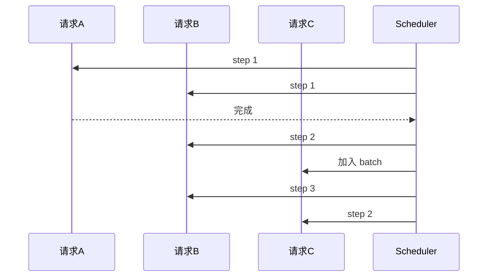
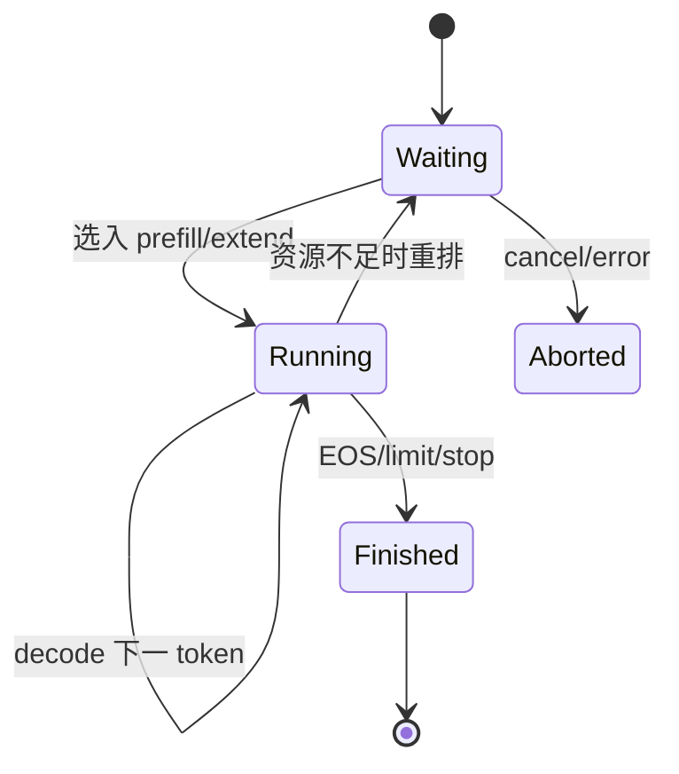

## 📑 目录
- [1. 为什么 GPU 会等 CPU](#1-为什么-gpu-会等-cpu)
- [2. Continuous Batching](#2-continuous-batching)
- [3. 调度状态与预算](#3-调度状态与预算)
- [4. Prefill、Decode 与 Chunking](#4-prefilldecode-与-chunking)
- [5. 普通调度循环](#5-普通调度循环)
- [6. Overlap Scheduler](#6-overlap-scheduler)
- [7. 源码主线](#7-源码主线)
- [8. 手算与时间线](#8-手算与时间线)
- [9. 调优与观测](#9-调优与观测)
- [10. v0.5.17 调度迭代与 FutureMap](#10-v0517-调度迭代与-futuremap)
- [11. Trade-off](#11-trade-off)
- [总结](#总结)
- [自我检验](#自我检验)
- [参考资料](#参考资料)
---

## 1. 为什么 GPU 会等 CPU
先说白话：GPU 像速度极快的烤箱，CPU 调度器像负责装盘、核单和准备下一盘的员工。如果烤一盘只需 2 ms，员工却花 1 ms 才准备好下一盘，烤箱会有三分之一时间无事可做。

### 1.1 CPU 每轮并不轻松
调度器可能需要：这些工作单项不一定很慢，但 decode 每步都重复，累积后可能进入关键路径。
- 接收新请求；维护 waiting/running 状态；做 Radix 前缀匹配；检查停止条件；分配和释放 KV slot；选择 Prefill 或 Decode；构造 batch 元数据；发起分布式控制；处理采样结果；把输出发给 Detokenizer。

### 1.2 短 GPU step 更敏感
设一轮 GPU 时间为 $T_g$，CPU 串行时间为 $T_c$。无重叠时：
$$
T_{\text{iter}}=T_g+T_c
$$
GPU 利用时间比例粗略为：
$$
U=\frac{T_g}{T_g+T_c}
$$
若 $T_g=2$ ms、$T_c=1$ ms：
$$
U=\frac{2}{3}\approx66.7\%
$$
这里只说明量纲，不是某款 GPU 的 SGLang 实测。

### 1.3 “Zero-Overhead” 的准确理解
它不是 CPU 工作耗时变成 0。它表示目标是把 CPU 调度工作隐藏在 GPU 执行窗口后，使 CPU 不再增加 steady-state 关键路径。若重叠充分：
$$
T_{\text{iter}}\approx\max(T_g,T_c)
$$
但同步依赖、首尾排空、异常分支仍会产生可见开销。

## 2. Continuous Batching

### 2.1 静态批处理的问题
静态 batch 像一桌人必须一起离席。
```text
请求 A：生成 10 token
请求 B：生成 100 token
```
A 很快完成，但其位置可能一直空到 B 完成，下一批才能进入。

### 2.2 连续批处理
Continuous Batching 允许每个调度 step 重新审视 batch。

已完成请求退出，waiting 请求可在后续轮次加入。收益是减少空槽和排队；代价是每轮都要做动态状态管理。

### 2.3 Iteration-level scheduling
术语上，这叫迭代级调度。Decode 通常每轮为每个活跃序列生成一个或少量候选 token。调度粒度越细，适应性越强，CPU 调度频率也越高。

### 2.4 吞吐与延迟
增大运行 batch 往往提高吞吐，但单个请求可能面对：所以 continuous batching 是机制，不是自动满足 SLO 的策略。
- 更长排队；更大 attention batch；更复杂的资源竞争；更高尾延迟。

## 3. 调度状态与预算

### 3.1 Waiting 与 Running
简化状态机：

真实 v0.5.17 还要处理 chunked request、speculative decoding、PD 模式和分布式状态。

### 3.2 Token budget
调度器不能只限制请求数，因为一个请求可能是 10 token，也可能是 100K token。更合理的是按本轮处理 token 数预算。设本轮预算 $B=4096$：
```text
请求 A 未缓存后缀：2500
请求 B 未缓存后缀：1200
Decode batch：200
```
总计：
$$
2500+1200+200=3900\le4096
$$
理论上可放入同一预算，但还必须满足 KV 空间、模型后端和调度规则。

### 3.3 请求数预算
`max_running_requests` 限制同时运行的序列规模。请求数与 token budget 是两个不同维度：
```text
很多短请求：请求数先成为瓶颈
少量长请求：token/KV 先成为瓶颈
```
只调一个参数无法覆盖所有 workload。

### 3.4 KV 可用空间
调度前必须确认：
$$
\text{required KV slots}\le \text{free slots}+\text{evictable slots}
$$
若不足，调度器可能：内存管理与调度不是两个孤立模块。
- 淘汰未引用 cache；减小本轮 Prefill；延后请求；在特定机制下回收或重排。

## 4. Prefill、Decode 与 Chunking

### 4.1 两种不同工作负载
Prefill 一次处理很多 prompt token，通常更偏计算密集。Decode 每序列每步处理很少 token，却要读取不断增长的 KV，通常更偏内存带宽。把它们混在一起会产生干扰，但完全分离又要引入 PD 架构和 KV 传输。

### 4.2 Chunked Prefill
一个 100K-token prompt 如果整段进入一次 Prefill，可能长期占用计算资源，阻塞正在 Decode 的请求。Chunked Prefill 把它切成多个 chunk：
```text
100K = 8K + 8K + ... + 最后一段
```
每轮只处理一块，让 Decode 请求获得插入机会。

### 4.3 手算调度轮数
设未缓存输入 $U=20000$ token，chunk 上限 $C=4096$。最少 chunk 数：
$$
N=\left\lceil\frac{U}{C}\right\rceil=\left\lceil4.8828\right\rceil=5
$$
前四块各 4096，最后一块：
$$
20000-4\times4096=3616
$$
实际轮数还取决于每轮是否与其他请求共享预算。

### 4.4 Chunk 的 trade-off
- chunk 大：Prefill Kernel 更饱满、管理次数少，但 Decode 可能等待更久。
- chunk 小：更容易穿插 Decode、改善尾部响应机会，但 launch 和调度开销增加。
不存在对所有输入长度最优的固定 chunk。

### 4.5 Prefill 优先还是 Decode 优先
偏向 Prefill 可以更快让新请求拿到首 token。偏向 Decode 可以保护在途请求的 TPOT。本质是 TTFT 与 TPOT 的权衡。生产系统应根据 SLO，而不是只根据总 token/s，确定策略。

## 5. 普通调度循环

### 5.1 串行依赖
普通循环可以抽象为：
```python
# 伪代码
while True:
    batch = schedule()
    result = run_gpu(batch)      # 等待本轮结果
    process_result(result)
```
时间线：
```text
CPU: [schedule A]........[process A][schedule B]........
GPU: ............[run A].........................[run B]
```
点号处可能是某一侧等待。

### 5.2 为什么要等结果
下一轮决策依赖本轮输出：
- 哪些请求生成 EOS；哪些触发 stop；新 token 是什么；哪些请求完成；哪些 KV slot 可以释放；speculative token 接受了多少。
这就是重叠的真正难点：不是开两个线程就能消除数据依赖。

### 5.3 延迟检查
一种解决思路是把部分结果处理延后一个阶段。GPU 执行 batch A 时，CPU 先准备 batch B；等到必要同步点，再消费 A 的结果。这需要确保 B 的计划不会错误依赖尚未确认的 A 状态。

## 6. Overlap Scheduler

### 6.1 双缓冲类比
像餐厅准备两套托盘：
```text
烤箱处理托盘 A
员工准备托盘 B
下一拍交换
```
一套在 GPU，一套在 CPU。

### 6.2 理想时间线
```text
时间 →  0      1      2      3      4
CPU    sched A | sched B | sched C | sched D
GPU            | run A   | run B   | run C
```
预热阶段仍要先准备 A，结束阶段仍要排空最后结果。长稳态流量中，首尾成本被更多 iteration 摊薄。

### 6.3 依赖如何处理
- 可重叠：接收新请求、某些 prefix matching、预分配下一批元数据、流式输出和与当前结果无关的队列维护。
- 必须等待：读取当前采样 token、确认 EOS/stop、speculative accept、按真实完成状态释放资源和某些 collective。
实现需要 CUDA event、stream 和明确的 batch 对应关系。

### 6.4 “结果晚一拍”
概念伪代码：
```python
# 伪代码：只表达 overlap 思想
prev_future = None
while alive:
    if prev_future is not None:
        maybe_process_ready_part(prev_future)
    next_batch = schedule_next_safely()
    current_future = launch_gpu_async(next_batch)
    if prev_future is not None:
        finish_processing(prev_future)
    prev_future = current_future
```
真实源码对 Prefill、Decode、spec decode、grammar 等路径有专门处理。

### 6.5 为什么复杂特性会破坏重叠
Structured Output 需要根据 grammar 状态计算合法 token mask。Speculative Decoding 需要 draft、verify、accept。多模态 Prefill 可能有动态输入。这些 CPU 或 GPU 前后处理若落在关键路径，就会形成新的“host seam”。v0.5.17 release 特别提到降低 hybrid-linear MTP decode 在 spec-v2 overlap 下的 host seam overhead，说明优化是持续演进的，不是一次完成。

## 7. 源码主线

### 7.1 固定 tag
从这里开始：
```text
python/sglang/srt/managers/scheduler.py
```
使用：
```text
https://github.com/sgl-project/sglang/blob/v0.5.17/...
```
不要用 main 分支行号解释 v0.5.17。

### 7.2 先找两个 event loop
在 `Scheduler` 中搜索普通与 overlap 事件循环相关方法。不同小版本的方法名可能演进，核心差异应这样识别：
```text
普通路径：调度 → 执行 → 处理结果
重叠路径：提交当前批次，同时处理前一批次与准备后续工作
```

### 7.3 再找 batch result
搜索：
```text
process_batch_result
process_batch_result_prefill
process_batch_result_decode
```
关注：
- sampled token 何时可见；finished reason 何时更新；output 何时发送；batch 何时变成下一轮 running batch；KV 何时回收。

### 7.4 找调度入口
继续搜索：
```text
get_next_batch_to_run
get_new_batch_prefill
update_running_batch
```
方法名以 v0.5.17 实际源码为准。阅读时将每个方法归类：
```text
收请求
选请求
分配内存
发 GPU
处理结果
回收状态
```

### 7.5 ScheduleBatch
`schedule_batch.py` 中的数据结构承载本轮执行所需状态。重点看：不要把它当普通 Python list；它是 CPU 调度状态到 GPU tensor 的桥。
- 请求列表；forward mode；input ids；sequence lengths；prefix/extend 信息；sampling 信息；KV 映射；spec 信息。

### 7.6 SchedulePolicy
`schedule_policy.py` 负责 waiting queue 的顺序策略。缓存感知策略会利用 RadixCache prefix match 信息。策略排序与 batch packing 是两个层次：
```text
policy：谁更应该先
batch builder：在预算里实际放谁
```

### 7.7 CUDA 同步点
源码中看到 `.cpu()`、event wait、stream synchronize 或结果 materialize 时，要问：
```text
这一步是否迫使 CPU 等 GPU？
是否位于每个 decode step？
能否延后？
是否只在 debug 路径？
```
性能问题常藏在一次看似很小的同步里。

## 8. 手算与时间线

### 8.1 无重叠
假设稳定 decode：
```text
CPU schedule/process = 0.8 ms
GPU forward          = 2.4 ms
轮数                 = 100
```
无重叠理想总时间：
$$
100\times(0.8+2.4)=320\text{ ms}
$$

### 8.2 理想重叠
忽略首尾后：
$$
100\times\max(0.8,2.4)=240\text{ ms}
$$
理论时间比：
$$
\frac{320}{240}=1.33
$$
这是合成示例，不是官方 benchmark。真实系统还包括网络、采样、通信和形状变化，因此不能用 1.33× 宣称 SGLang 实际提升。

### 8.3 CPU 反而更慢
若：
```text
CPU = 3 ms
GPU = 2 ms
```
重叠后 steady-state 仍约 3 ms 一轮。此时 GPU 仍可能等 CPU，只是等待从 3 ms 降到约 1 ms。“已启用 overlap”不代表 CPU 瓶颈不存在。

### 8.4 批越大越好吗
增大 batch 可能让 GPU 时间从 2 ms 增至 6 ms，CPU 0.8 ms 更容易被隐藏。但请求 TPOT、排队和显存可能恶化。优化目标不是让 overlap 图好看，而是满足业务 SLO 下最大化 goodput。

## 9. 调优与观测

### 9.1 先分解指标
至少记录：只有 token/s 无法判断交互体验。
- TTFT；TPOT；ITL 分布；request throughput；output token throughput；waiting queue；running requests；KV 使用率；GPU 利用率；CPU 核利用率。

### 9.2 用 Nsight Systems 看气泡
时间线上关注：
```text
GPU Kernel 之间是否有规律空洞
空洞前 CPU 在做什么
是否出现同步 API
NCCL 是否在关键路径
不同 CUDA stream 是否真正重叠
```
官方 benchmark/profiling 文档提供 server profiler 控制与 NVTX 路径。

### 9.3 控制变量
比较调度参数时固定：
```text
模型 checkpoint
精度与量化
attention backend
输入/输出 token 分布
并发与到达率
随机种子或输出长度控制
硬件频率和卡拓扑
```
否则 batch 组成变化会掩盖调度差异。

### 9.4 前缀缓存干扰
同一请求重复压测会逐渐命中 RadixCache。若目标是测冷 Prefill，应使用不同前缀或显式控制缓存。若目标是测实际 Agent workload，就应保留真实复用比例。

### 9.5 看尾延迟
Chunked Prefill 和调度策略常改变 P95/P99，而均值变化不明显。生产门禁应使用 SLO：
```text
P99 TTFT <= 目标
P99 TPOT <= 目标
错误率 <= 目标
满足条件下最大吞吐
```
这比单独追求峰值 token/s 更可靠。

## 10. v0.5.17 调度迭代与 FutureMap

这一节固定到以下源码：

```text
python/sglang/srt/managers/scheduler.py
python/sglang/srt/managers/schedule_batch.py
python/sglang/srt/managers/overlap_utils.py
python/sglang/srt/managers/scheduler_components/batch_result_processor.py
python/sglang/srt/managers/scheduler_components/request_receiver.py
python/sglang/srt/managers/scheduler_components/output_streamer.py
python/sglang/srt/model_executor/forward_batch_info.py
python/sglang/srt/managers/tp_worker.py
```

v0.5.17 已将不少职责拆到 `scheduler_components/`。只读 `scheduler.py` 会看到调用，但看不到完整内存回收、输出与 metrics 细节。

### 10.1 Scheduler 持有的跨轮状态

最关键的三个对象：

```text
waiting_queue：尚未 admission 的 Req
running_batch：已持有运行资源、下一轮可能继续的 Req
last_batch：上一轮实际 forward 的 ScheduleBatch
```

另外还有：

```text
cur_batch_for_debug
chunked_req / mixed batch 状态
grammar queue
result_queue（overlap）
future_map
batch_record_buf（overlap 双缓冲）
tree_cache 与内存池
```

`last_batch` 不等于 `running_batch`：

- last batch 是“刚发到 GPU 的那一拍”；
- running batch 是“当前生命周期仍活跃、供下一拍计划使用的请求集合”；
- Prefill 完成、请求 finish、retract 或 mixed batch 后两者成员可能不同。

### 10.2 一个 admission 的预算方程

对候选请求 $i$：

```text
P_i：原输入 token
H_i：L1/L2 恢复后的可用前缀
E_i=P_i-H_i：需要 extend
D：本轮 decode token 数
B：本轮 token budget
F：可用 KV slots
```

基本预算：

$$
\sum_i E_i+D\le B
$$

内存预算还要考虑生成预留、page alignment 和 speculative verify：

$$
KV_{new}+KV_{reserve}+KV_{spec}\le F+KV_{evictable}
$$

例如：

```text
B = 4096
候选 A：P=3000, H=2000, E=1000
候选 B：P=3500, H=0, chunk cap=2048
running decode = 128
```

若先放 A 和 128 decode，剩余：

$$
4096-1000-128=2968
$$

B 可放 B 的 2048-token chunk。但若 free KV 只有 2500，A、B chunk、decode 的长期 reserve 合计超过容量，batch builder 仍必须缩减或淘汰，不能仅凭 token budget admission。

### 10.3 `NextBatchPlan` 的意义

v0.5.17 正常与 overlap 循环都调用：

```python
plan = self.get_next_batch_to_run(
    running_batch=self.running_batch,
    last_batch=self.last_batch,
)
self.running_batch = plan.running_batch
batch = plan.batch_to_run
```

`NextBatchPlan` 把状态更新与执行对象绑定为一个计划。它避免调用者分别修改 running、prefill 和 mixed 状态后留下半更新。审查调度 bug 时检查：

```text
plan 生成时使用的是哪一拍 last_batch 结果？
running_batch 是否已排除完成请求？
batch_to_run 是否持有正确 req_pool_idx 和 KV slots？
空 batch 时是否正确进入 idle？
```

### 10.4 正常事件循环逐行语义

v0.5.17 `event_loop_normal` 的主序是：

```text
1. request_receiver.recv_requests()
2. process_input_requests()
3. get_next_batch_to_run(running_batch, last_batch)
4. run_batch(batch)
5. process_batch_result(batch, result)
6. last_batch = batch
```

第 4 步必须等到结果可供第 5 步 CPU 读取。普通路径的关键路径：

$$
T_{normal}=T_{recv}+T_{schedule}+T_{forward}+T_{result}
$$

如果 `run_batch` 只是异步 launch，`process_batch_result` 中读取 sampled ids 的操作仍会触发同步；不能仅凭 Python 函数很快返回就宣称已经 overlap。

### 10.5 Overlap 事件循环逐行语义

`event_loop_overlap` 建立：

```text
result_queue: deque[(ScheduleBatch, GenerationBatchResult)]
```

每轮大意：

```text
收新请求
→ 用当前 running/last 构造 next plan
→ 判断当前 batch 是否必须禁用 overlap
→ 必要时先 process queue 中上一结果
→ run_batch 当前 batch
→ 应用共享 buffer 的 WAR barrier
→ 把 batch.copy() 与 result 入 result_queue
→ process 上一批
→ 更新 last_batch
```

为什么入队的是 `batch.copy()`？原 `ScheduleBatch` 的 Python 字段可能在后续组批中复用/修改，而结果处理必须看到与 GPU launch 对应的那一拍快照。浅/深复制范围若不正确，会出现 token 写给错误请求这种严重问题。

稳态时间近似：

$$
T_{overlap}\approx\max(T_{schedule+result},T_{forward})
$$

但 result queue 引入一拍延迟：

```text
GPU 第 k 拍产出 token_k
CPU 在第 k+1 拍附近消费 token_k
token_k 作为下一输入由 FutureMap 提供
```

### 10.6 为什么“future token”能打破 CPU 依赖

普通 decode：

```text
GPU sample token_k
→ D2H
→ CPU 读 token_k
→ 构造下一拍 input_ids
→ H2D
→ GPU forward token_{k+1}
```

这在每 token 引入 GPU→CPU→GPU 往返。v0.5.17 的 `FutureMap` 使用按 `req_pool_idx` 索引的 device buffer：

```text
output_tokens_buf[req_pool_idx]
new_seq_lens_buf[req_pool_idx]
speculative extras buffers
```

GPU 侧将本拍 sampled token scatter 到该请求的固定槽。下一拍 `resolve_forward_inputs` 直接 gather：

```python
batch.input_ids = future_map.output_tokens_buf[batch.req_pool_indices]
```

于是 next input 不必先 materialize 到 CPU。这里的 future 不是 Python `concurrent.futures.Future`，而是“值现在未完成，但已知道未来从哪个 device slot 取”的映射。

### 10.7 为什么按 req_pool_idx 而不是 batch position

Continuous batching 每拍顺序会变：

```text
step k:   batch positions [A, B, C]
step k+1: batch positions [C, D, A]
```

如果 future buffer 按 batch position，位置 0 的 token 会从 A 错配给 C。`req_pool_idx` 在请求持有 request slot 期间稳定，因此：

```text
output_tokens_buf[A.req_pool_idx] = token_A
output_tokens_buf[C.req_pool_idx] = token_C
```

下一拍无论 batch 重排，都按新 `req_pool_indices` gather 正确 token。

槽复用还需要 generation/version 防 ABA：旧异步结果不能写入已被新请求复用的同一个 idx。v0.5.17 的 request pool 存在 `req_generation`，spec confidence relay 也携带 generation 检查。审查异步 bug 时应同时检查 idx 和 generation。

### 10.8 Prefill 与 Decode 输入的不同来源

`resolve_forward_inputs` 区分：

**Prefill**

```text
prefill_input_ids_cpu
→ pinned CPU staging
→ non_blocking H2D
→ batch.input_ids
```

**Decode**

```text
batch.req_pool_indices
→ gather FutureMap.output_tokens_buf
→ batch.input_ids
```

Mixed batch 时，Prefill GPU tensor 与 running decode gather 结果拼接。若 profile 中看到每步完整 input_ids 从 pageable CPU 同步拷贝，说明没有走预期热路径或 staging 配置失效。

### 10.9 publish/resolve 的因果关系

FutureMap 生命周期：

```text
Forward/Sampler publish:
  sampled token → output_tokens_buf
  accept 后长度 → new_seq_lens_buf
  spec extras → topk/hidden/draft buffers
  record publish_ready event（需要时）

Next iteration resolve:
  input ids 从 output_tokens_buf gather
  spec seq lens 等待 event 后读取
  spec extras 按 future_indices gather
```

必须保证：

$$
publish(k)\prec resolve(k+1)
$$

如果缺 event/stream dependency，CPU 可能已经构造下一批，但 GPU gather 读到旧 token；这种 race 可能只在高负载出现，表现为偶发错误输出而非 crash。

### 10.10 CUDA stream 与 event

v0.5.17 至少区分：

```text
schedule_stream：调度侧 GPU metadata/copy
forward_stream：模型 forward
copy_stream：额外 copy/relay
FutureMap 私有 D2H stream（特定 CPU mirror）
```

CUDA stream 内有序，跨 stream 默认无序。正确关系必须由 event/wait 建立：

```text
forward 写 token
→ publish_ready.record(forward_stream)
→ copy/schedule stream wait_event
→ gather/copy
```

错误地调用全局 `torch.cuda.synchronize()`虽然“修好 race”，却把所有 stream 并行压平。性能优化应使用最窄的依赖事件。

### 10.11 WAR barrier 防什么

WAR 是 Write After Read。Scheduler 准备下一批时可能重写共享 request/KV metadata；上一 forward stream 还在读取同一 buffer：

```text
forward(k): read shared buffer X
schedule(k+1): write X
```

若没有 barrier，下一拍写覆盖上一拍尚未消费的数据。v0.5.17 在 launch 后应用 `_apply_war_barrier`，让 schedule 侧的下一次写等待 forward 读完成。这里保护的是内存别名，不是 sampled token 本身。

判断是否需要 barrier 的方法：

```text
两个阶段是否访问同一物理 storage？
前者是否读，后者是否写？
异步 kernel 是否在 Python 返回后仍读取？
buffer 是否由 CUDA Graph 固定复用？
```

### 10.12 哪些 batch 会禁用 overlap

不是所有分支都能安全晚一拍。典型同步边界包括：

```text
需要立刻知道上一结果才能分配的状态转换
某些 Prefill/Decode 模式切换
资源紧张，需要先 finish/free 才能 admission
复杂 speculative accept/grammar barrier
管理操作、flush、weight update
空闲排空与关闭
未审计 backend/shape
```

v0.5.17 通过 `is_disable_overlap_for_batch` 决定，并在边界先 `pop_and_process()`。因此“默认没有 `--disable-overlap-schedule`”不等于每个 iteration 都重叠；应统计实际 fallback 比例。

### 10.13 Grammar 为什么会形成 barrier

结构化输出每个请求有 grammar state。采样 token 后必须推进状态，下一拍 mask 必须基于新状态：

$$
state_{k+1}=\delta(state_k,token_k)
$$

$$
mask_{k+1}=M(state_{k+1})
$$

若 grammar 状态机更新在 CPU，而 token 还只在 GPU future buffer，就存在 host seam。可选优化包括：

```text
GPU grammar mask/状态推进
异步编译并缓存 grammar
将 barrier 限制在 constrained 请求
分组 grammar batch
对可预测状态预计算
```

不能为了 overlap 跳过状态推进；那会生成语法非法 token。

### 10.14 Speculative decoding 的额外 future

Spec V2 不只传一个 sampled token，还可能 relay：

```text
bonus_tokens
topk_p / topk_index
hidden_states
draft_probs
dsa_topk_indices
accept 后 new_seq_lens
confidence
```

`FutureMap` 根据算法按需分配，避免非 spec 路径承担所有 buffer。CPU mirror 也由 attention backend、TBO/ngram 等需求决定。性能分析必须区分：

```text
target forward
draft/verify
future scatter/gather
必要 D2H
accept 处理
grammar/spec barrier
```

只测 target kernel 时间解释不了 spec-v2 的 TPOT。

### 10.15 双缓冲手算

设每轮：

```text
recv + schedule = 0.35 ms
result process  = 0.25 ms
GPU forward     = 1.80 ms
WAR/event       = 0.05 ms
```

普通路径约：

$$
T_n=0.35+0.25+1.80+0.05=2.45ms
$$

理想 overlap：

$$
T_o=\max(0.35+0.25,1.80)+0.05=1.85ms
$$

速度比：

$$
\frac{2.45}{1.85}=1.324
$$

若 20% iteration 因 grammar/内存边界 fallback 到正常路径：

$$
\bar T=0.8\times1.85+0.2\times2.45=1.97ms
$$

实际提升：

$$
\frac{2.45}{1.97}=1.244
$$

所以必须报告 overlap eligible ratio 和 fallback reason，而不只报告开关状态。

### 10.16 排队模型解释 SLO 拐点

设平均服务率 $\mu$，到达率 $\lambda$。即使单步优化让 $\mu$ 提高，接近饱和时排队会非线性放大。用简化 M/M/1 只作直觉：

$$
E[T_{queue}]=\frac{\rho}{\mu-\lambda},\quad \rho=\frac{\lambda}{\mu}
$$

若 $\mu=10$ req/s：

```text
λ=5  → ρ=0.5
λ=9  → ρ=0.9
λ=9.8→ ρ=0.98
```

最后一点少量流量增加就会导致 queue 急剧增长。真实 continuous batching 不是 M/M/1，但结论仍成立：调度优化应画 request-rate 扫描曲线，不能只测饱和 token/s。

### 10.17 CPU profile 实验

准备两组服务：

```text
A：默认 overlap
B：--disable-overlap-schedule
```

其他参数、缓存和负载完全相同。使用固定：

```text
模型 revision
输入 128 / 输出 512
无共享随机前缀
temperature=0
max concurrency = 1, 8, 32, 128
```

采集三类证据：

1. **Python/CPU profile**

```text
get_next_batch_to_run
ScheduleBatch preparation
process_batch_result
grammar update
detokenizer 与 IPC
```

2. **Nsight Systems**

```text
CUDA kernel gap
schedule/forward/copy streams
event wait
memcpy H2D/D2H
NCCL collective
CUDA Graph replay
```

3. **服务指标**

```text
TTFT/TPOT/ITL
waiting/running
token throughput
overlap fallback
CPU utilization by process
GPU utilization
```

CPU profiler本身会扰动短 iteration，必须做：

```text
无 profiler 正式 benchmark
短窗口 profiler 定位
两者 workload 对齐
```

不要把开启 profiler 后的绝对 TPOT 当作容量结果。

### 10.18 Timeline 判读

理想：

```text
CPU: |sched B/result A|sched C/result B|sched D/result C|
GPU: |----forward A----|----forward B----|----forward C----|
```

常见坏图形：

**每步 GPU 后固定空洞**

```text
GPU forward → D2H sampled token → CPU → H2D → next forward
```

检查 FutureMap 是否使用、是否出现 `.cpu()` 或全局 synchronize。

**GPU 连续但 P99 TTFT 高**

设备很忙，可能新 Prefill 被 Decode 持续挤压。检查 waiting age、chunk policy 和 Prefill/Decode 目标。

**copy stream 与 forward 不重叠**

可能使用同一 stream、event 依赖过宽、PCIe 饱和或 copy 实际是 pageable memory 同步拷贝。

**NCCL 后气泡**

检查 TP collective、rank skew 和 CPU 发起顺序。Overlap Scheduler 不能隐藏必须完成的 collective。

### 10.19 失败注入

**注入慢 CPU：**在隔离分支给 result processing 加固定 1 ms sleep。预期 overlap 在 GPU>CPU 时部分隐藏；CPU 超过 GPU 后 kernel gap 出现。测试后恢复代码。

**强制同步：**临时在实验代码热路径加入 `torch.cuda.synchronize()`，观察 timeline 气泡，验证 profiler 能定位同步。不要提交此改动。

**Grammar 混合：**50% 无约束、50% 每请求不同 schema，比较：

```text
grammar compile queue
fallback ratio
TPOT
CPU profile
```

**长 Prefill 干扰：**稳定 Decode 流中注入一个 64K prompt，分别改变 chunk size，观察 Decode ITL P99 与新请求 TTFT。

**取消风暴：**大量流式请求在 5 token 后取消，确认 finished/free 处理不会让 result queue、request slots 或 KV 增长。

### 10.20 Zero-overhead 的验收条件

“CPU 开销被隐藏”至少应满足：

```text
steady-state GPU kernel gap 接近设备/collective必要间隔
schedule+result CPU 时间 < GPU forward 窗口的大多数 iteration
没有逐 token全局同步
FutureMap publish/resolve 无错误和 stale token
fallback 比例可解释
开启 overlap 后 TPOT 改善且 P99 不恶化
取消、grammar、spec、内存压力下状态守恒
```

如果 CPU 利用率仍很高但 GPU 无气泡，不矛盾：CPU 工作没有消失，只是与 GPU 并行。若 GPU 无气泡但用户 SLO 差，应继续检查排队、batch 策略、网络和 Detokenizer，不应把“zero-overhead”当作端到端完成证明。

## 11. Trade-off
| 机制 | 收益 | 代价 |
|---|---|---|
| Continuous Batching | 动态填充 GPU | 高频 CPU 调度 |
| 大 batch | 高吞吐 | 排队、TPOT、显存 |
| Token budget | 比请求数精确 | 仍需估计 KV 与 shape |
| Chunked Prefill | 避免长 Prefill 独占 | 更多轮次和 launch |
| Decode 优先 | 保护在途 TPOT | 新请求 TTFT 可能上升 |
| Prefill 优先 | 新请求更快开始 | Decode 抖动 |
| Overlap | 隐藏 host 工作 | 状态机和同步复杂 |
| CUDA Graph | 降 launch overhead | shape 与显存约束 |
| Cache-aware policy | 提高命中 | 公平性风险 |

## 总结
SGLang 调度主线可以概括为：
```text
Continuous Batching 决定每轮重新组批；
Token/KV budget 决定能放多少；
Chunked Prefill 决定长输入怎样切；
Overlap Scheduler 决定 CPU 工作怎样藏到 GPU 后面。
```
“Zero-overhead”应理解为减少关键路径开销，而不是删除 CPU 工作。阅读源码时，围绕 event loop、batch result、batch builder 和同步点建立时间线，就能避免陷入分支细节。

## 自我检验
- [ ] 我能解释静态批处理的空槽问题
- [ ] 我知道 continuous batching 是迭代级调度
- [ ] 我能区分请求数预算与 token budget
- [ ] 我会手算 chunk 数
- [ ] 我知道 Prefill 与 Decode 的 SLO 冲突
- [ ] 我能写出无重叠与理想重叠公式
- [ ] 我不会把 zero-overhead 理解成 CPU 零耗时
- [ ] 我知道下一批可能依赖当前结果
- [ ] 我会在源码中寻找同步点
- [ ] 我会用尾延迟和 goodput 验收

## 参考资料
1. [SGLang v0.5.17 Scheduler 源码](https://github.com/sgl-project/sglang/blob/v0.5.17/python/sglang/srt/managers/scheduler.py)；2. [SGLang v0.5.17 ScheduleBatch 源码](https://github.com/sgl-project/sglang/blob/v0.5.17/python/sglang/srt/managers/schedule_batch.py)；3. [SGLang v0.5.17 SchedulePolicy 源码](https://github.com/sgl-project/sglang/blob/v0.5.17/python/sglang/srt/managers/schedule_policy.py)；4. [SGLang v0.5.17 Release](https://github.com/sgl-project/sglang/releases/tag/v0.5.17)；5. [SGLang 2025 课程演讲：Zero-overhead CPU Scheduling](https://llmsystem.github.io/llmsystem2025spring/assets/files/llmsys-25-sglang-72edc5043338f59db34d47e5b96ac870.pdf)；6. [SGLang Benchmark and Profiling](https://docs.sglang.ai/developer_guide/benchmark_and_profiling.html)；7. [SGLang 论文](https://arxiv.org/abs/2312.07104)。
> 文中 0.8 ms、2.4 ms 等均为教学手算输入，不是官方性能数据；实际结论必须来自目标硬件上的 profiler 与 benchmark。
