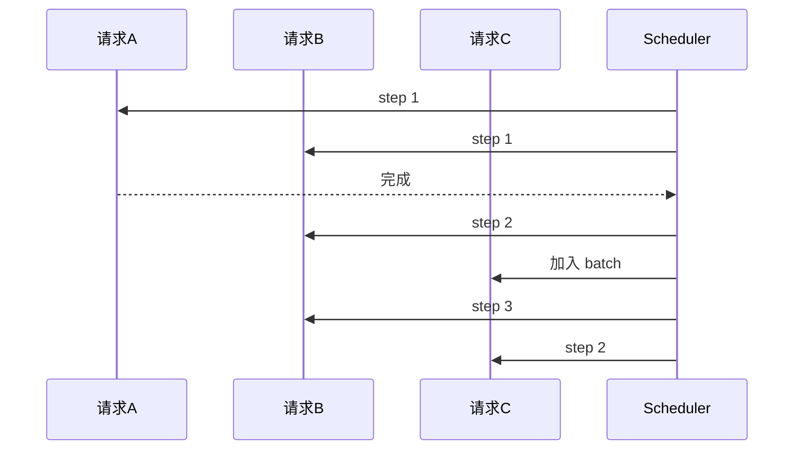
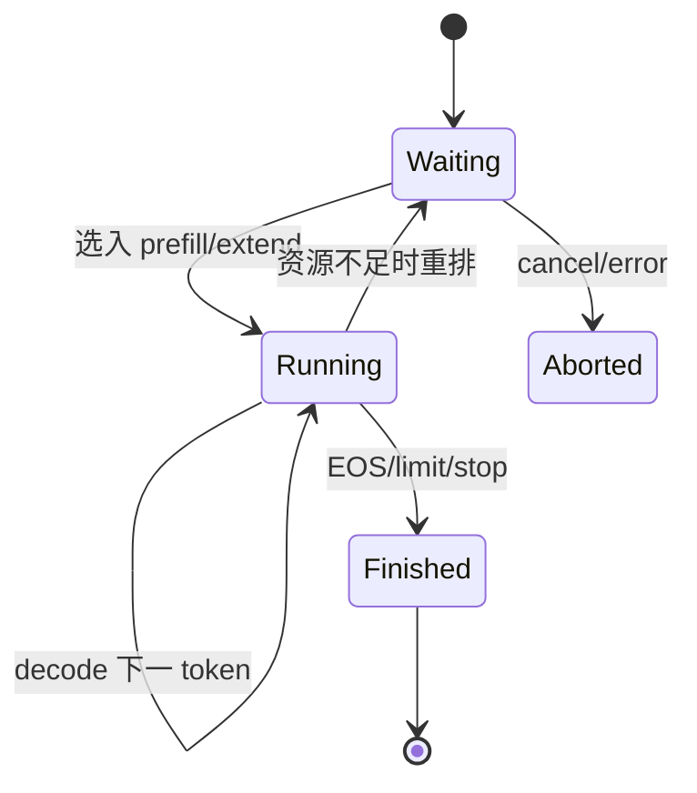

## 📑 目录
- [1. 为什么 GPU 会等 CPU](#1-为什么-gpu-会等-cpu)
- [2. Continuous Batching](#2-continuous-batching)
- [3. 调度状态与预算](#3-调度状态与预算)
- [4. Prefill、Decode 与 Chunking](#4-prefilldecode-与-chunking)
- [5. 普通调度循环](#5-普通调度循环)
- [6. Overlap Scheduler](#6-overlap-scheduler)
- [7. 源码主线](#7-源码主线)
- [8. 手算与时间线](#8-手算与时间线)
- [9. 调优与观测](#9-调优与观测)
- [10. Trade-off](#10-trade-off)
- [总结](#总结)
- [自我检验](#自我检验)
- [参考资料](#参考资料)
---

## 1. 为什么 GPU 会等 CPU
先说白话：GPU 像速度极快的烤箱，CPU 调度器像负责装盘、核单和准备下一盘的员工。如果烤一盘只需 2 ms，员工却花 1 ms 才准备好下一盘，烤箱会有三分之一时间无事可做。

### 1.1 CPU 每轮并不轻松
调度器可能需要：这些工作单项不一定很慢，但 decode 每步都重复，累积后可能进入关键路径。
- 接收新请求；维护 waiting/running 状态；做 Radix 前缀匹配；检查停止条件；分配和释放 KV slot；选择 Prefill 或 Decode；构造 batch 元数据；发起分布式控制；处理采样结果；把输出发给 Detokenizer。

### 1.2 短 GPU step 更敏感
设一轮 GPU 时间为 $T_g$，CPU 串行时间为 $T_c$。无重叠时：
$$
T_{\text{iter}}=T_g+T_c
$$
GPU 利用时间比例粗略为：
$$
U=\frac{T_g}{T_g+T_c}
$$
若 $T_g=2$ ms、$T_c=1$ ms：
$$
U=\frac{2}{3}\approx66.7\%
$$
这里只说明量纲，不是某款 GPU 的 SGLang 实测。

### 1.3 “Zero-Overhead” 的准确理解
它不是 CPU 工作耗时变成 0。它表示目标是把 CPU 调度工作隐藏在 GPU 执行窗口后，使 CPU 不再增加 steady-state 关键路径。若重叠充分：
$$
T_{\text{iter}}\approx\max(T_g,T_c)
$$
但同步依赖、首尾排空、异常分支仍会产生可见开销。

## 2. Continuous Batching

### 2.1 静态批处理的问题
静态 batch 像一桌人必须一起离席。
```text
请求 A：生成 10 token
请求 B：生成 100 token
```
A 很快完成，但其位置可能一直空到 B 完成，下一批才能进入。

### 2.2 连续批处理
Continuous Batching 允许每个调度 step 重新审视 batch。

已完成请求退出，waiting 请求可在后续轮次加入。收益是减少空槽和排队；代价是每轮都要做动态状态管理。

### 2.3 Iteration-level scheduling
术语上，这叫迭代级调度。Decode 通常每轮为每个活跃序列生成一个或少量候选 token。调度粒度越细，适应性越强，CPU 调度频率也越高。

### 2.4 吞吐与延迟
增大运行 batch 往往提高吞吐，但单个请求可能面对：所以 continuous batching 是机制，不是自动满足 SLO 的策略。
- 更长排队；更大 attention batch；更复杂的资源竞争；更高尾延迟。

## 3. 调度状态与预算

### 3.1 Waiting 与 Running
简化状态机：

真实 v0.5.17 还要处理 chunked request、speculative decoding、PD 模式和分布式状态。

### 3.2 Token budget
调度器不能只限制请求数，因为一个请求可能是 10 token，也可能是 100K token。更合理的是按本轮处理 token 数预算。设本轮预算 $B=4096$：
```text
请求 A 未缓存后缀：2500
请求 B 未缓存后缀：1200
Decode batch：200
```
总计：
$$
2500+1200+200=3900\le4096
$$
理论上可放入同一预算，但还必须满足 KV 空间、模型后端和调度规则。

### 3.3 请求数预算
`max_running_requests` 限制同时运行的序列规模。请求数与 token budget 是两个不同维度：
```text
很多短请求：请求数先成为瓶颈
少量长请求：token/KV 先成为瓶颈
```
只调一个参数无法覆盖所有 workload。

### 3.4 KV 可用空间
调度前必须确认：
$$
\text{required KV slots}\le \text{free slots}+\text{evictable slots}
$$
若不足，调度器可能：内存管理与调度不是两个孤立模块。
- 淘汰未引用 cache；减小本轮 Prefill；延后请求；在特定机制下回收或重排。

## 4. Prefill、Decode 与 Chunking

### 4.1 两种不同工作负载
Prefill 一次处理很多 prompt token，通常更偏计算密集。Decode 每序列每步处理很少 token，却要读取不断增长的 KV，通常更偏内存带宽。把它们混在一起会产生干扰，但完全分离又要引入 PD 架构和 KV 传输。

### 4.2 Chunked Prefill
一个 100K-token prompt 如果整段进入一次 Prefill，可能长期占用计算资源，阻塞正在 Decode 的请求。Chunked Prefill 把它切成多个 chunk：
```text
100K = 8K + 8K + ... + 最后一段
```
每轮只处理一块，让 Decode 请求获得插入机会。

### 4.3 手算调度轮数
设未缓存输入 $U=20000$ token，chunk 上限 $C=4096$。最少 chunk 数：
$$
N=\left\lceil\frac{U}{C}\right\rceil=\left\lceil4.8828\right\rceil=5
$$
前四块各 4096，最后一块：
$$
20000-4\times4096=3616
$$
实际轮数还取决于每轮是否与其他请求共享预算。

### 4.4 Chunk 的 trade-off
- chunk 大：Prefill Kernel 更饱满、管理次数少，但 Decode 可能等待更久。
- chunk 小：更容易穿插 Decode、改善尾部响应机会，但 launch 和调度开销增加。
不存在对所有输入长度最优的固定 chunk。

### 4.5 Prefill 优先还是 Decode 优先
偏向 Prefill 可以更快让新请求拿到首 token。偏向 Decode 可以保护在途请求的 TPOT。本质是 TTFT 与 TPOT 的权衡。生产系统应根据 SLO，而不是只根据总 token/s，确定策略。

## 5. 普通调度循环

### 5.1 串行依赖
普通循环可以抽象为：
```python
# 伪代码
while True:
    batch = schedule()
    result = run_gpu(batch)      # 等待本轮结果
    process_result(result)
```
时间线：
```text
CPU: [schedule A]........[process A][schedule B]........
GPU: ............[run A].........................[run B]
```
点号处可能是某一侧等待。

### 5.2 为什么要等结果
下一轮决策依赖本轮输出：
- 哪些请求生成 EOS；哪些触发 stop；新 token 是什么；哪些请求完成；哪些 KV slot 可以释放；speculative token 接受了多少。
这就是重叠的真正难点：不是开两个线程就能消除数据依赖。

### 5.3 延迟检查
一种解决思路是把部分结果处理延后一个阶段。GPU 执行 batch A 时，CPU 先准备 batch B；等到必要同步点，再消费 A 的结果。这需要确保 B 的计划不会错误依赖尚未确认的 A 状态。

## 6. Overlap Scheduler

### 6.1 双缓冲类比
像餐厅准备两套托盘：
```text
烤箱处理托盘 A
员工准备托盘 B
下一拍交换
```
一套在 GPU，一套在 CPU。

### 6.2 理想时间线
```text
时间 →  0      1      2      3      4
CPU    sched A | sched B | sched C | sched D
GPU            | run A   | run B   | run C
```
预热阶段仍要先准备 A，结束阶段仍要排空最后结果。长稳态流量中，首尾成本被更多 iteration 摊薄。

### 6.3 依赖如何处理
- 可重叠：接收新请求、某些 prefix matching、预分配下一批元数据、流式输出和与当前结果无关的队列维护。
- 必须等待：读取当前采样 token、确认 EOS/stop、speculative accept、按真实完成状态释放资源和某些 collective。
实现需要 CUDA event、stream 和明确的 batch 对应关系。

### 6.4 “结果晚一拍”
概念伪代码：
```python
# 伪代码：只表达 overlap 思想
prev_future = None
while alive:
    if prev_future is not None:
        maybe_process_ready_part(prev_future)
    next_batch = schedule_next_safely()
    current_future = launch_gpu_async(next_batch)
    if prev_future is not None:
        finish_processing(prev_future)
    prev_future = current_future
```
真实源码对 Prefill、Decode、spec decode、grammar 等路径有专门处理。

### 6.5 为什么复杂特性会破坏重叠
Structured Output 需要根据 grammar 状态计算合法 token mask。Speculative Decoding 需要 draft、verify、accept。多模态 Prefill 可能有动态输入。这些 CPU 或 GPU 前后处理若落在关键路径，就会形成新的“host seam”。v0.5.17 release 特别提到降低 hybrid-linear MTP decode 在 spec-v2 overlap 下的 host seam overhead，说明优化是持续演进的，不是一次完成。

## 7. 源码主线

### 7.1 固定 tag
从这里开始：
```text
python/sglang/srt/managers/scheduler.py
```
使用：
```text
https://github.com/sgl-project/sglang/blob/v0.5.17/...
```
不要用 main 分支行号解释 v0.5.17。

### 7.2 先找两个 event loop
在 `Scheduler` 中搜索普通与 overlap 事件循环相关方法。不同小版本的方法名可能演进，核心差异应这样识别：
```text
普通路径：调度 → 执行 → 处理结果
重叠路径：提交当前批次，同时处理前一批次与准备后续工作
```

### 7.3 再找 batch result
搜索：
```text
process_batch_result
process_batch_result_prefill
process_batch_result_decode
```
关注：
- sampled token 何时可见；finished reason 何时更新；output 何时发送；batch 何时变成下一轮 running batch；KV 何时回收。

### 7.4 找调度入口
继续搜索：
```text
get_next_batch_to_run
get_new_batch_prefill
update_running_batch
```
方法名以 v0.5.17 实际源码为准。阅读时将每个方法归类：
```text
收请求
选请求
分配内存
发 GPU
处理结果
回收状态
```

### 7.5 ScheduleBatch
`schedule_batch.py` 中的数据结构承载本轮执行所需状态。重点看：不要把它当普通 Python list；它是 CPU 调度状态到 GPU tensor 的桥。
- 请求列表；forward mode；input ids；sequence lengths；prefix/extend 信息；sampling 信息；KV 映射；spec 信息。

### 7.6 SchedulePolicy
`schedule_policy.py` 负责 waiting queue 的顺序策略。缓存感知策略会利用 RadixCache prefix match 信息。策略排序与 batch packing 是两个层次：
```text
policy：谁更应该先
batch builder：在预算里实际放谁
```

### 7.7 CUDA 同步点
源码中看到 `.cpu()`、event wait、stream synchronize 或结果 materialize 时，要问：
```text
这一步是否迫使 CPU 等 GPU？
是否位于每个 decode step？
能否延后？
是否只在 debug 路径？
```
性能问题常藏在一次看似很小的同步里。

## 8. 手算与时间线

### 8.1 无重叠
假设稳定 decode：
```text
CPU schedule/process = 0.8 ms
GPU forward          = 2.4 ms
轮数                 = 100
```
无重叠理想总时间：
$$
100\times(0.8+2.4)=320\text{ ms}
$$

### 8.2 理想重叠
忽略首尾后：
$$
100\times\max(0.8,2.4)=240\text{ ms}
$$
理论时间比：
$$
\frac{320}{240}=1.33
$$
这是合成示例，不是官方 benchmark。真实系统还包括网络、采样、通信和形状变化，因此不能用 1.33× 宣称 SGLang 实际提升。

### 8.3 CPU 反而更慢
若：
```text
CPU = 3 ms
GPU = 2 ms
```
重叠后 steady-state 仍约 3 ms 一轮。此时 GPU 仍可能等 CPU，只是等待从 3 ms 降到约 1 ms。“已启用 overlap”不代表 CPU 瓶颈不存在。

### 8.4 批越大越好吗
增大 batch 可能让 GPU 时间从 2 ms 增至 6 ms，CPU 0.8 ms 更容易被隐藏。但请求 TPOT、排队和显存可能恶化。优化目标不是让 overlap 图好看，而是满足业务 SLO 下最大化 goodput。

## 9. 调优与观测

### 9.1 先分解指标
至少记录：只有 token/s 无法判断交互体验。
- TTFT；TPOT；ITL 分布；request throughput；output token throughput；waiting queue；running requests；KV 使用率；GPU 利用率；CPU 核利用率。

### 9.2 用 Nsight Systems 看气泡
时间线上关注：
```text
GPU Kernel 之间是否有规律空洞
空洞前 CPU 在做什么
是否出现同步 API
NCCL 是否在关键路径
不同 CUDA stream 是否真正重叠
```
官方 benchmark/profiling 文档提供 server profiler 控制与 NVTX 路径。

### 9.3 控制变量
比较调度参数时固定：
```text
模型 checkpoint
精度与量化
attention backend
输入/输出 token 分布
并发与到达率
随机种子或输出长度控制
硬件频率和卡拓扑
```
否则 batch 组成变化会掩盖调度差异。

### 9.4 前缀缓存干扰
同一请求重复压测会逐渐命中 RadixCache。若目标是测冷 Prefill，应使用不同前缀或显式控制缓存。若目标是测实际 Agent workload，就应保留真实复用比例。

### 9.5 看尾延迟
Chunked Prefill 和调度策略常改变 P95/P99，而均值变化不明显。生产门禁应使用 SLO：
```text
P99 TTFT <= 目标
P99 TPOT <= 目标
错误率 <= 目标
满足条件下最大吞吐
```
这比单独追求峰值 token/s 更可靠。

## 10. Trade-off
| 机制 | 收益 | 代价 |
|---|---|---|
| Continuous Batching | 动态填充 GPU | 高频 CPU 调度 |
| 大 batch | 高吞吐 | 排队、TPOT、显存 |
| Token budget | 比请求数精确 | 仍需估计 KV 与 shape |
| Chunked Prefill | 避免长 Prefill 独占 | 更多轮次和 launch |
| Decode 优先 | 保护在途 TPOT | 新请求 TTFT 可能上升 |
| Prefill 优先 | 新请求更快开始 | Decode 抖动 |
| Overlap | 隐藏 host 工作 | 状态机和同步复杂 |
| CUDA Graph | 降 launch overhead | shape 与显存约束 |
| Cache-aware policy | 提高命中 | 公平性风险 |

## 总结
SGLang 调度主线可以概括为：
```text
Continuous Batching 决定每轮重新组批；
Token/KV budget 决定能放多少；
Chunked Prefill 决定长输入怎样切；
Overlap Scheduler 决定 CPU 工作怎样藏到 GPU 后面。
```
“Zero-overhead”应理解为减少关键路径开销，而不是删除 CPU 工作。阅读源码时，围绕 event loop、batch result、batch builder 和同步点建立时间线，就能避免陷入分支细节。

## 自我检验
- [ ] 我能解释静态批处理的空槽问题
- [ ] 我知道 continuous batching 是迭代级调度
- [ ] 我能区分请求数预算与 token budget
- [ ] 我会手算 chunk 数
- [ ] 我知道 Prefill 与 Decode 的 SLO 冲突
- [ ] 我能写出无重叠与理想重叠公式
- [ ] 我不会把 zero-overhead 理解成 CPU 零耗时
- [ ] 我知道下一批可能依赖当前结果
- [ ] 我会在源码中寻找同步点
- [ ] 我会用尾延迟和 goodput 验收

## 参考资料
1. [SGLang v0.5.17 Scheduler 源码](https://github.com/sgl-project/sglang/blob/v0.5.17/python/sglang/srt/managers/scheduler.py)；2. [SGLang v0.5.17 ScheduleBatch 源码](https://github.com/sgl-project/sglang/blob/v0.5.17/python/sglang/srt/managers/schedule_batch.py)；3. [SGLang v0.5.17 SchedulePolicy 源码](https://github.com/sgl-project/sglang/blob/v0.5.17/python/sglang/srt/managers/schedule_policy.py)；4. [SGLang v0.5.17 Release](https://github.com/sgl-project/sglang/releases/tag/v0.5.17)；5. [SGLang 2025 课程演讲：Zero-overhead CPU Scheduling](https://llmsystem.github.io/llmsystem2025spring/assets/files/llmsys-25-sglang-72edc5043338f59db34d47e5b96ac870.pdf)；6. [SGLang Benchmark and Profiling](https://docs.sglang.ai/developer_guide/benchmark_and_profiling.html)；7. [SGLang 论文](https://arxiv.org/abs/2312.07104)。
> 文中 0.8 ms、2.4 ms 等均为教学手算输入，不是官方性能数据；实际结论必须来自目标硬件上的 profiler 与 benchmark。
