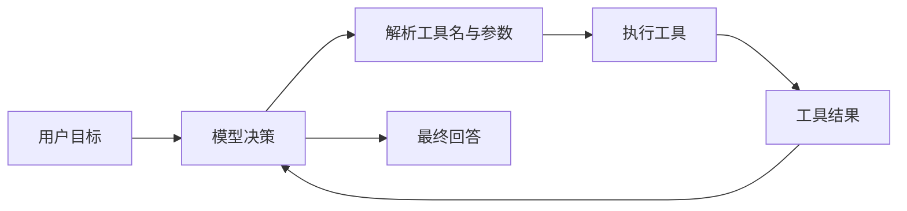
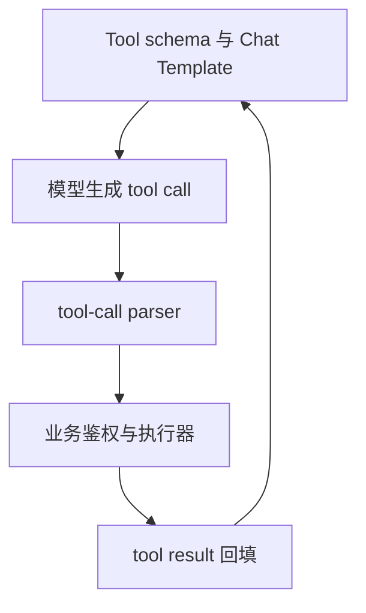
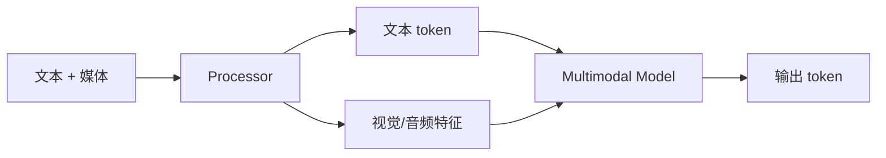

## 📑 目录
- [1. 为什么自然语言不够](#1-为什么自然语言不够)
- [2. 结构化输出原理](#2-结构化输出原理)
- [3. JSON Schema、Regex 与 EBNF](#3-json-schemaregex-与-ebnf)
- [4. Grammar Backend](#4-grammar-backend)
- [5. SGLang Frontend Language](#5-sglang-frontend-language)
- [6. Tool Calling](#6-tool-calling)
- [7. Agent 边界](#7-agent-边界)
- [8. VLM 与多模态](#8-vlm-与多模态)
- [9. 性能与安全](#9-性能与安全)
- [10. Trade-off](#10-trade-off)
- [总结](#总结)
- [自我检验](#自我检验)
- [参考资料](#参考资料)
---

## 1. 为什么自然语言不够
先说白话：让模型“尽量输出 JSON”，像口头提醒快递员按表格填写；结构化生成则像只给他能填合法字符的表单。普通提示词：
```text
请只输出 JSON，不要解释。
```
模型仍可能输出：
```text
好的，结果如下：
{"status": "ok",}
```
它有前导文本和尾逗号，严格 JSON parser 会失败。
### 1.1 Agent 更依赖结构
Agent 循环通常是：

若工具参数不可解析，循环会在“模型到程序”的边界断裂。结构化输出的目标不是让答案更聪明，而是让输出满足机器可消费的语法。
### 1.2 三个层次
需要区分：
1. **提示约束**：文本告诉模型要遵守格式；2. **解码约束**：每一步屏蔽会导致非法语法的 token；3. **业务校验**：检查范围、权限和语义。
解码约束保证语法，不保证业务真实。合法的 `{"amount": 999999999}` 仍可能违反业务上限。

## 2. 结构化输出原理
### 2.1 Token mask
模型每步输出词表上的 logits：
$$
\mathbf{z}\in\mathbb{R}^{|V|}
$$
Grammar 根据当前状态计算合法 token 集合 $A_t$。约束后：
$$
z'_i=\begin{cases}z_i,& i\in A_t\\-\infty,& i\notin A_t\end{cases}
$$
随后再进行 softmax 与采样。白话上，非法按钮被临时禁用，模型只能从仍可能完成合法结构的 token 中选择。
### 2.2 不是字符级那么简单
Tokenizer 的一个 token 可能包含：Grammar backend 需要把字符语法映射到 token 词表。这也是为什么高效 structured decoding 需要专门编译、缓存和 mask Kernel。
- 一个字符；多个字符；字符的一部分；空格与标点组合；UTF-8 字节片段。
### 2.3 状态机
生成 JSON 对象时，状态可能经历：
```text
等待 {
→ 等待属性名
→ 等待 :
→ 等待属性值
→ 等待 , 或 }
→ 完成
```
每生成一个 token，grammar state 都要推进。若 batch 中每个请求 schema 不同，它们的状态和合法 token 集也不同。
### 2.4 语法保证的边界
- 可以保证：JSON 可解析、字段类型符合 schema、Regex 或 EBNF 语法合法。
- 通常不能保证：URL 真实、商品 id 存在、日期满足业务规则、工具调用已授权或内容没有幻觉。
因此服务端仍必须二次校验。

## 3. JSON Schema、Regex 与 EBNF
v0.5.17 官方文档支持三类约束；每个请求只能指定其中一种：`json_schema`、`regex` 或 `ebnf`。
### 3.1 JSON Schema
适合对象、数组和类型化字段。
```python
from pydantic import BaseModel, Field
class ServiceCheck(BaseModel):
    service: str
    ready: bool
    gpu_count: int = Field(ge=0, le=1024)
schema = ServiceCheck.model_json_schema()
```
通过 OpenAI 客户端发送：
```python
from openai import OpenAI
client = OpenAI(
    base_url="http://127.0.0.1:30000/v1",
    api_key="EMPTY",
)
response = client.chat.completions.create(
    model="Qwen/Qwen2.5-7B-Instruct",
    messages=[{
        "role": "user",
        "content": "返回服务名、是否就绪和 GPU 数量。",
    }],
    temperature=0,
    response_format={
        "type": "json_schema",
        "json_schema": {
            "name": "ServiceCheck",
            "schema": schema,
            "strict": True,
        },
    },
)
data = ServiceCheck.model_validate_json(
    response.choices[0].message.content
)
print(data)
```
即使 grammar 已约束，也建议用 Pydantic 再验证，形成清晰的信任边界。
### 3.2 直接 JSON Schema
```json
{
  "type": "object",
  "properties": {
    "name": {"type": "string"},
    "status": {"enum": ["ready", "busy", "down"]}
  },
  "required": ["name", "status"],
  "additionalProperties": false
}
```
`additionalProperties: false` 可减少模型生成未定义字段。Schema 越复杂，编译和解码状态也可能越复杂。
### 3.3 Regex
适合短而平坦的格式。例如版本号：
```python
extra_body={
    "regex": r"v[0-9]+\.[0-9]+\.[0-9]+"
}
```
Regex 擅长字符串形状，不擅长表达深层嵌套对象。
### 3.4 EBNF
EBNF 适合自定义语言或协议：
```ebnf
root ::= action " " target
action ::= "START" | "STOP" | "RESTART"
target ::= "api" | "worker" | "router"
```
请求可使用：
```python
extra_body={"ebnf": grammar_text}
```
官方文档指出 XGrammar 当前使用 GGML BNF 格式相关约定；实际语法细节应查对应 backend 文档。
### 3.5 选型
| 需求 | 建议 |
|---|---|
| API 对象 | JSON Schema |
| 固定编码、版本、短标签 | Regex |
| DSL、SQL 子集、命令语法 | EBNF |
| 工具参数 | JSON Schema / Tool schema |
不要为了“更强大”把简单枚举写成复杂 EBNF。

## 4. Grammar Backend
### 4.1 v0.5.17 支持范围
官方 structured outputs 文档列出：
| Backend | JSON Schema | Regex | EBNF |
|---|---|---|---|
| XGrammar | 支持 | 支持 | 支持 |
| Outlines | 支持 | 支持 | 文档未列为支持 |
| llguidance | 支持 | 支持 | 支持 |
XGrammar 是默认 backend，官方文档建议优先评估它的性能与功能。这不等于任意 schema 在任意 backend 上行为完全相同。
### 4.2 启动参数
默认 XGrammar：
```bash
python -m sglang.launch_server \
  --model-path Qwen/Qwen2.5-7B-Instruct \
  --grammar-backend xgrammar
```
切换 Outlines：
```bash
--grammar-backend outlines
```
切换 llguidance：
```bash
--grammar-backend llguidance
```
离线 Engine：
```python
import sglang as sgl
engine = sgl.Engine(
    model_path="Qwen/Qwen2.5-7B-Instruct",
    grammar_backend="xgrammar",
)
```
### 4.3 编译与缓存
Schema 需要编译成可推进的 grammar 表示。如果每个请求都生成一个内容相同但字符串顺序不同的 schema，可能降低编译缓存复用。生产建议：
- schema 版本化；canonical serialization；服务启动时预热常用 schema；监控 grammar compile latency；限制外部用户提交任意超大 schema。
### 4.4 约束会不会降低质量
约束缩小搜索空间，能消除非法格式，但模型仍需理解任务。官方文档建议在 prompt 中明确说明目标格式。“有 grammar 就不写格式提示”可能导致模型在合法空间里选择语义很差的值。
### 4.5 与 Speculative Decoding
推测解码的 draft token 也必须满足 grammar，verify/accept 状态还要与语法状态一致。v0.5.17 release 列出 DSPARK、DFLASH 和 STANDALONE 相关 grammar 支持与 overlap 优化。这说明组合能力按算法逐步落地；不要假定所有 speculative algorithm 与 grammar 无条件兼容。

## 5. SGLang Frontend Language
### 5.1 它解决什么
Frontend Language 是嵌入 Python 的结构化生成语言。它让开发者用程序表达：它与 SRT 的关系类似“工作流描述”与“执行引擎”。
- 角色化 prompt；多轮生成；分支与循环；并行 generation；batching；constrained decoding；多模态 prompt。
### 5.2 基础示例
```python
import sglang as sgl
from sglang import assistant, function, gen, system, user
@function
def infra_qa(s, question):
    s += system("你是 AI Infra 助手。")
    s += user(question)
    s += assistant(gen("answer", max_tokens=128))
```
连接本地运行时：
```python
from sglang.lang.backend.runtime_endpoint import RuntimeEndpoint
sgl.set_default_backend(
    RuntimeEndpoint("http://127.0.0.1:30000")
)
state = infra_qa.run(
    question="什么是 RadixAttention？"
)
print(state["answer"])
```
Frontend API 可能随版本演进，运行前应对照 v0.5.17 对应教程与导出符号。
### 5.3 并行与 fork
多个互不依赖的候选可以并行生成。概念示例：
```python
# 伪代码：展示 fork 思想
branches = state.fork(3)
for i, branch in enumerate(branches):
    branch += gen(f"candidate_{i}")
branches.join()
```
并行能提高吞吐或降低工作流总时长，但会同时增加 running sequences 和 KV 使用。
### 5.4 `run_batch`
同一 SGLang function 可对多个输入批量执行。
```python
arguments = [
    {"question": "什么是 TP？"},
    {"question": "什么是 DP？"},
    {"question": "什么是 EP？"},
]
states = infra_qa.run_batch(arguments)
```
批量表达只是提交层；SRT 仍会根据 continuous batching 动态调度。
### 5.5 原生 Python 控制流
Frontend Language 允许在函数中使用 Python 控制流。这很灵活，但也意味着：它是编程接口，不是安全沙箱。
- 程序可能执行任意 Python；重试要处理副作用；并行分支需考虑一致性；不能把不可信用户代码直接运行在服务端。

## 6. Tool Calling
### 6.1 工具调用的四层
完整工具调用不是“模型输出一段 JSON”这么简单。

SGLang 主要覆盖服务、模板、解析和结构化生成；业务权限仍由上层负责。
### 6.2 启动 parser
示例模型需要匹配对应 parser：
```bash
python -m sglang.launch_server \
  --model-path YOUR_TOOL_MODEL \
  --tool-call-parser qwen \
  --reasoning-parser qwen3
```
这里只展示参数形式。parser 名必须与具体模型和 v0.5.17 文档对应，不能仅凭厂商名称猜。v0.5.17 server arguments 列出多个 tool-call parser 和 reasoning parser；名单会随 release 变化。
### 6.3 OpenAI Tools 请求
```python
tools = [{
    "type": "function",
    "function": {
        "name": "get_gpu_status",
        "description": "查询指定集群的 GPU 状态",
        "parameters": {
            "type": "object",
            "properties": {
                "cluster": {"type": "string"}
            },
            "required": ["cluster"],
            "additionalProperties": False,
        },
    },
}]
response = client.chat.completions.create(
    model="YOUR_TOOL_MODEL",
    messages=[{
        "role": "user",
        "content": "检查 training-a 集群 GPU。",
    }],
    tools=tools,
    tool_choice="auto",
)
```
得到 tool call 后，上层应先校验名称、参数和权限，再调用真实系统。
### 6.4 不要让模型直接执行
错误做法：
```python
# 伪代码：危险
eval(model_generated_arguments)
```
正确边界：
```python
# 伪代码
args = Schema.validate_json(tool_call.arguments)
authorize(user, tool_name, args)
result = TOOL_REGISTRY[tool_name](**args)
audit(user, tool_name, args, result)
```
还应设置超时、并发上限、幂等键和结果大小限制。
### 6.5 Reasoning parser
Reasoning 模型可能把思考内容与最终回答放在特殊标记中。`--reasoning-parser` 将模型特定格式映射到 API 字段。解析能力不等于应该向所有客户端暴露完整 reasoning 内容；产品与安全策略需单独决定。
### 6.6 Tool server
v0.5.17 参数包含 `--tool-server`，可配置 demo 或外部工具服务 URL。这是便利集成，不应绕过网络隔离、认证和最小权限。生产前要确认工具服务故障时的重试、超时和副作用语义。

## 7. Agent 边界
### 7.1 SGLang 提供什么
它提供：
- 高性能模型推理；前缀缓存；结构化输出；工具调用解析；Frontend Language；多轮与并行生成基础；OpenAI 兼容接口。
### 7.2 它不自动提供什么
完整 Agent 平台还需要：
- 用户身份与权限；长期记忆数据库；工具注册与密钥管理；sandbox；工作流持久化；人工审批；预算与配额；tracing 与审计；失败补偿。
因此：
$$
\text{Agent System}\ne \text{Inference Engine}
$$
SGLang 是强大的执行底座，但不是所有业务控制面。
### 7.3 前缀缓存对 Agent 的价值
Agent 常共享：
- 长 system prompt；工具 schema；few-shot 示例；多轮历史；policy 文本。
RadixAttention 与 session radix cache 能减少重复 Prefill。但动态字段如果放在前缀开头，会破坏共享。
### 7.4 会话关闭
启用 session radix cache 后，业务应在会话结束时调用 `/close_session`。同时处理：Agent 的“会话结束”必须成为可观测事件。
- 客户端异常断开；session 超时；worker 重启；重复 close；跨副本路由。

## 8. VLM 与多模态
### 8.1 输入不仅是 token
VLM 请求可能包含文本、图片、视频或音频。典型 OpenAI 风格消息：
```python
messages = [{
    "role": "user",
    "content": [
        {
            "type": "text",
            "text": "描述这张架构图。",
        },
        {
            "type": "image_url",
            "image_url": {
                "url": "https://example.com/diagram.png"
            },
        },
    ],
}]
```
具体字段支持取决于目标模型、processor 和 v0.5.17 endpoint 文档。
### 8.2 多模态请求流

媒体预处理可能发生在 CPU，也可能有 GPU encoder。因此 VLM TTFT 不应只归因于语言模型 Prefill。
### 8.3 缓存 key
同一张图的 URL 不一定永远返回同一内容。多模态缓存必须基于稳定内容标识、处理配置和模型版本，而不是盲信 URL 字符串。图片 resize、crop、帧采样变化都会影响输入特征。
### 8.4 资源安全
远程媒体 URL 会引入：生产应使用 allowlist、大小上限、超时、内容类型校验和隔离下载服务。
- SSRF；超大文件；解压炸弹；慢速下载；恶意格式；隐私泄露。
### 8.5 v0.5.17 边界
v0.5.17 release 包含 Kimi K3 多模态支持和 MiniMax-H3 diffusion/video 能力。这些是模型专用支持，不意味着任意 VLM 或视频模型自动可用。先查 model support/cookbook，再复制启动配置。

## 9. 性能与安全
### 9.1 Grammar 开销怎么测
至少比较：
```text
无约束
固定 JSON Schema
每请求不同 Schema
短输出
长输出
不同 batch size
```
记录：格式成功率从“经常失败”提升到“语法保证”，本身也是生产收益，不能只看 token/s。
- grammar compile time；TTFT；TPOT；output token/s；CPU 使用；schema cache hit；格式成功率。
### 9.2 Tool benchmark
Agent 端到端延迟：
$$
T_{\text{agent}}=\sum T_{\text{LLM}}+\sum T_{\text{tool}}+T_{\text{orchestration}}
$$
只优化 LLM 不能掩盖一个 10 秒工具 API。应分别 trace 推理、解析、授权、工具和回填。
### 9.3 Prompt injection
结构化输出不能防止 prompt injection。攻击者仍可能诱导模型选择一个“语法合法但权限过高”的工具调用。防线必须在模型之外：
- 工具 allowlist；参数级授权；最小权限凭据；高风险操作人工确认；结果脱敏；全链路审计。
### 9.4 Schema DoS
若允许用户提交任意 grammar，攻击者可能提交极其复杂的 schema，消耗编译时间和内存。应限制：
- schema 字节数；嵌套深度；正则复杂度；可用关键字；编译超时；缓存总量。

## 10. Trade-off
| 能力 | 收益 | 代价 |
|---|---|---|
| JSON Schema | 类型化 API 输出 | 编译与 mask 开销 |
| Regex | 简单格式高效 | 不适合复杂嵌套 |
| EBNF | 可表达 DSL | 调试成本高 |
| Grammar cache | 降重复编译 | 占 CPU 内存 |
| Frontend Language | 工作流表达简洁 | Python 运行与版本耦合 |
| 并行 fork | 缩短独立分支总时长 | KV 与并发增长 |
| Tool parser | 适配模型格式 | 模型专用、需正确配置 |
| Reasoning parser | 分离思考与答案 | 隐私和产品策略 |
| VLM | 处理丰富输入 | 预处理、显存与安全面扩大 |
| session cache | 多轮前缀复用 | 生命周期管理 |

## 总结
结构化生成负责“输出在语法上可被程序接住”，工具执行层负责“这个动作是否允许且安全”。Frontend Language 用 Python 表达多轮、分支、并行和约束，SRT 负责高效执行；二者不能和完整 Agent 控制面画等号。VLM 把同一请求流扩展到媒体输入，同时也带来 processor、缓存 key 和资源安全的新边界。

## 自我检验
- [ ] 我能区分提示约束、解码约束和业务校验
- [ ] 我能解释 grammar token mask
- [ ] 我知道每个请求只能选一种主要约束参数
- [ ] 我能选择 JSON Schema、Regex 或 EBNF
- [ ] 我知道 XGrammar 是 v0.5.17 默认 backend
- [ ] 我能说明 Frontend Language 与 SRT 的区别
- [ ] 我不会直接执行模型生成的参数
- [ ] 我知道 tool parser 必须匹配模型
- [ ] 我能说出完整 Agent 平台还缺哪些控制面
- [ ] 我会防护远程多模态资源

## 参考资料
1. [SGLang Structured Outputs](https://docs.sglang.ai/advanced_features/structured_outputs.html)；2. [SGLang Frontend Language Tutorial](https://docs.sglang.ai/references/frontend/frontend_tutorial.html)；3. [OpenAI APIs - Completions](https://docs.sglang.ai/basic_usage/openai_api_completions.html)；4. [SGLang Tool Parser 文档索引](https://docs.sglang.ai/advanced_features/server_arguments.html)；5. [SGLang Model Support](https://docs.sglang.io/docs/supported-models/generative_models)；6. [SGLang v0.5.17 Release](https://github.com/sgl-project/sglang/releases/tag/v0.5.17)；7. [SGLang 论文](https://arxiv.org/abs/2312.07104)；8. [XGrammar](https://xgrammar.mlc.ai/)。
> 功能与 parser 名称固定到 v0.5.17；模型 cookbook 是验证工具调用和 VLM 组合的第一入口。
