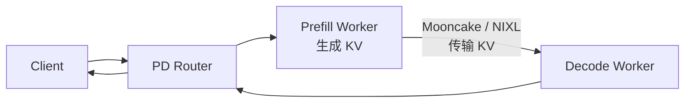

## 📑 目录
- [1. 先定义生产目标](#1-先定义生产目标)；[2. TP、DP 与 EP](#2-tpdp-与-ep)；[3. 量化](#3-量化)；[4. Speculative Decoding](#4-speculative-decoding)；[5. PD Disaggregation](#5-pd-disaggregation)；[6. Model Gateway 与 Router](#6-model-gateway-与-router)；[7. Benchmark 方法](#7-benchmark-方法)；[8. 与 vLLM 公平对比](#8-与-vllm-公平对比)；[9. 上线清单](#9-上线清单)；[10. Trade-off 与选型](#10-trade-off-与选型)；[总结](#总结)；[自我检验](#自我检验)；[参考资料](#参考资料)。
---

## 1. 先定义生产目标
先说白话：调优不是把所有“加速”开关打开，而是在显存、通信、精度和 SLO 之间做预算。同一配置不可能同时保证：
- 最低单请求延迟；最高离线吞吐；最大上下文；最低成本；最强格式约束；最稳 P99。
### 1.1 四个核心指标
**TTFT**：请求到首 token。**TPOT**：首 token 后，每个输出 token 的平均时间。**ITL**：相邻流式 token 的间隔，应关注分布而非只看均值。**Throughput**：请求/秒或 token/秒，必须注明输入还是输出 token。
### 1.2 Goodput
吞吐高但请求违反 SLO，没有业务价值。可定义：
$$
\text{Goodput}=\frac{\#\text{满足全部 SLO 的请求}}{\text{时间}}
$$
例如 SLO：
```text
P99 TTFT <= 2 s；P99 TPOT <= 50 ms；错误率 <= 0.1%
```
数值只是格式示例，不是通用推荐。
### 1.3 先建立基线
第一版只使用：
```text
单副本；目标精度 checkpoint；无 speculative decoding；无 PD 解耦；默认 RadixCache；最小必要并行
```
记录正确性、显存和延迟，再逐项加入优化。

## 2. TP、DP 与 EP
### 2.1 Tensor Parallelism
TP 像把一张超宽的计算表横向分给多张 GPU。启动示例：
```bash
python -m sglang.launch_server \
  --model-path YOUR_MODEL \
  --tp-size 4 \
  --port 30000
```
主要目的：
- 单卡放不下模型；利用多卡共同完成每层计算；在高带宽互联上提高单副本算力。
代价是每层或多个层间的 collective 通信。
### 2.2 TP 显存手算
假设权重 80 GB，TP=4。忽略复制参数和缓冲区时：
$$
\frac{80}{4}=20\text{ GB/GPU}
$$
真实每卡显存还包含：
- 未分片权重；KV Cache 分片；CUDA Graph；NCCL buffer；激活与 workspace；allocator 碎片。
因此不能用 20 GB 直接判断 24 GB 卡一定够。
### 2.3 TP 扩展效率
定义：
$$
E_{TP}(n)=\frac{S(n)}{n}
$$
若 4 卡相对 1 卡加速 3 倍：
$$
E_{TP}(4)=\frac{3}{4}=75\%
$$
这里只演示公式。模型单卡放不下时无法得到真实 1 卡基线，可使用较小模型或理论通信分析，但要标明方法变化。
### 2.4 Data Parallelism
DP 像开多套独立厨房，每套接不同请求。启动参数主线：
```bash
--dp-size 4
```
DP 更适合：
- 模型单副本已经能放下；请求量大；需要副本隔离；希望近似横向扩展吞吐。
代价是每个副本都需要权重和自己的 KV Cache。
### 2.5 DP Attention
SGLang 对部分模型和配置支持 DP attention，使 attention 请求按 DP 分开，而 MoE 等部分可采用不同并行组合。相关开关：
```bash
--enable-dp-attention
```
它不是“所有层完全不通信”，也不是所有模型都支持。必须根据模型 cookbook、MoE backend 和 v0.5.17 兼容矩阵验证。
### 2.6 Expert Parallelism
EP 用于 MoE，把不同专家放到不同 rank。类比商场：每个专柜负责部分专家，token 根据 router 结果被送到对应专柜。参数主线：
```bash
--ep-size 8
```
还需选择 MoE all-to-all/backend，例如具体配置中的 DeepEP 等。EP 的关键成本是 token dispatch、all-to-all、负载不均和专家热点。
### 2.7 TP、DP、EP 组合
若总 GPU 数为 $N$，常见逻辑关系为：
$$
N \approx TP\times DP
$$
EP 可能嵌入 DP/TP 维度，具体拓扑取决于模型与实现，不能简单再乘一次。一个 32 卡 MoE 配置可能把 attention 与 expert 使用不同并行维度。因此要画 rank topology，而不是只保存一串参数。
### 2.8 选型顺序
```text
模型放不下？
  是 → 先 TP 或模型量化
  否 → 单副本基线
流量需要扩展？
  是 → DP / 多副本 Router
模型是大 MoE？
  是 → 评估 EP、DP attention 和 A2A backend
```
尽量让高频 collective 留在 NVLink/NVSwitch 域内。

## 3. 量化
### 3.1 量化是什么
白话上，把原本用大刻度尺记录的权重，换成更短的刻度表示。
- 可能减少：权重显存、内存带宽、模型加载 I/O 和某些 Kernel 的计算成本。
- 但会增加：舍入误差、scale 元数据、backend 约束与校准验收成本。
### 3.2 v0.5.17 能力边界
server arguments 的 `--quantization` 列出 AWQ、GPTQ、FP8、Marlin、GGUF、ModelOpt、NVFP4、W8A8 等多种方法。“参数列表存在”不等于目标 GPU、模型层和 Kernel 都有高性能支持。优先使用官方 model cookbook 已验证的 checkpoint 与命令。
### 3.3 离线 checkpoint
```bash
python -m sglang.launch_server \
  --model-path YOUR_AWQ_MODEL \
  --quantization awq
```
若 checkpoint 配置已声明量化方法，框架可能自动识别；是否仍需显式参数应查对应模型文档。
### 3.4 在线量化
v0.5.17 文档包括 `nvfp4_online` 等加载时转换路径。示例形式：
```bash
--quantization nvfp4_online
```
官方说明该路径只支持特定 MoE runner backend，并对源精度、硬件和激活 scale 有要求。在线转换节省预处理流程，但会增加启动工作，并不自动生成可跨环境复用的量化 checkpoint。
### 3.5 KV Cache 量化
```bash
--kv-cache-dtype fp8_e4m3
```
KV 量化与权重量化是两个独立维度。官方参数提醒：FP8 KV 通常应提供 scaling factor 文件；若 scale 默认 1.0，可能造成精度问题。不要只验证模型能启动，要验证长上下文和多轮质量。
### 3.6 精度验收
至少包含：
```text
任务质量集
长上下文集
结构化输出成功率
工具调用参数正确率
困惑度或模型基准（适用时）
线上 shadow traffic
```
再比较：量化“更小”不保证“更快”，因为反量化与 Kernel 支持可能成为瓶颈。
- 权重显存；KV 容量；TTFT；TPOT；吞吐；功耗。

## 4. Speculative Decoding
### 4.1 核心类比
一个速度快的实习生先草拟多个 token，正式模型一次检查；被接受的 token 可一次推进多步。术语：
```text
draft / proposer：提出候选
target：目标模型
verify：一次验证候选
accept：接受正确分布下的候选
```
### 4.2 理想收益
设每轮平均接受长度为 $a$，验证轮成本为 $T_v$，额外 draft 成本为 $T_d$。粗略每 token 时间：
$$
T_{\text{token}}\approx\frac{T_v+T_d}{a}
$$
若接受率低，$a$ 接近 1，draft 成本可能得不偿失。
### 4.3 v0.5.17 支持
官方文档与 release 覆盖 EAGLE、MTP、NGRAM、DFLASH、DSPARK 等路径，Spec V2 已成为相关新主线。不同算法需要不同模型：不能只把算法名替换到任意模型命令。
- NGRAM 利用已出现 token 模式；EAGLE/standalone 需要 draft model 或特定结构；MTP 使用模型内多 token prediction 能力；模型专用算法依赖对应实现。
### 4.4 EAGLE 风格参数
示例形式：
```bash
python -m sglang.launch_server \
  --model-path TARGET_MODEL \
  --speculative-algorithm EAGLE \
  --speculative-draft-model-path DRAFT_MODEL \
  --speculative-num-steps 3 \
  --speculative-eagle-topk 1 \
  --speculative-num-draft-tokens 4
```
这些值接近文档示例默认思路，不是所有模型的最优配置。
### 4.5 组合边界
官方 speculative 文档明确提示，Standalone speculative decoding 当前不支持 `--enable-dp-attention`。v0.5.17 release 又列出 grammar 与不同 spec 路径的新增支持。这说明兼容性是具体算法级别的，生产配置必须跑组合测试。
### 4.6 验收
记录：只看 target forward 次数不足以判断收益。
- 平均接受长度；接受率分布；draft 时间；verify 时间；TPOT；batch size；额外显存；输出分布正确性。

## 5. PD Disaggregation
### 5.1 为什么拆
Prefill 像一次性备大菜，偏计算密集。Decode 像持续小火出餐，偏内存带宽和低延迟。统一实例需要同时为两种负载折中。PD 解耦将它们放在不同 worker：

### 5.2 最小示例
下面的控制面和默认 Mooncake 数据面不是 `sglang[all]` 自带依赖。先在与 v0.5.17 匹配的环境安装并锁定：

```bash
python -m pip install "sglang-router==0.3.2"
python -m pip install mooncake-transfer-engine
```

若改用 NIXL，应按官方文档改装对应传输依赖和参数，不能只替换架构图上的名字。

Prefill：
```bash
python -m sglang.launch_server \
  --model-path meta-llama/Llama-3.1-8B-Instruct \
  --disaggregation-mode prefill \
  --port 30000 \
  --disaggregation-ib-device mlx5_roce0
```
Decode：
```bash
python -m sglang.launch_server \
  --model-path meta-llama/Llama-3.1-8B-Instruct \
  --disaggregation-mode decode \
  --port 30001 \
  --base-gpu-id 1 \
  --disaggregation-ib-device mlx5_roce0
```
Router：
```bash
python -m sglang_router.launch_router \
  --pd-disaggregation \
  --prefill http://127.0.0.1:30000 \
  --decode http://127.0.0.1:30001 \
  --host 0.0.0.0 \
  --port 8000
```
命令来自官方 PD 文档主线；真实多节点必须配置正确网卡、地址和 transfer backend。
### 5.3 Transfer backend
v0.5.17 官方 PD 文档列出 Mooncake 与 NIXL。选择取决于：
- GPU direct/RDMA 能力；NIC 与 NUMA 拓扑；容器权限；UCX 或 backend 依赖；跨节点带宽；故障恢复。
### 5.4 KV 传输手算
若单请求需要传 4 GiB KV，链路有效带宽 100 GiB/s：
$$
T_{\text{transfer, ideal}}=\frac{4}{100}=0.04\text{ s}=40\text{ ms}
$$
真实还有注册、分片、同步、拥塞和 tail latency，时间会更高。若 Prefill 仅节省 20 ms，却增加 40 ms KV 传输，解耦对该请求未必划算。
### 5.5 异构 TP
Prefill 与 Decode 可使用不同 TP/DP 形态，但 KV layout 可能不同。官方文档给出 GPU staging buffer，用 gather → RDMA → scatter 处理不同 TP 布局。文档报告在其高并发、异构 TP 测试中，相对默认逐 token slice 可达 2–5× transfer throughput，并接近同构 TP baseline 的约 5% 范围。这个数字只适用于文档给出的 Mooncake、异构 TP 与测试条件，不是端到端服务提升。
### 5.6 PD 的收益边界
- 适合：P/D 资源比例明显不同、长 prompt、大集群独立扩缩、高速网络和成熟控制面。
- 不适合：单机小模型、KV 大但网络慢、流量低、无法承受额外拓扑或缺少状态恢复设计。

## 6. Model Gateway 与 Router
### 6.1 为什么不是普通 round-robin
多个副本各自持有不同 RadixCache。若同一长前缀随机打到不同副本，缓存被重复计算和复制。Cache-aware routing 尝试把请求送到更可能已有该前缀的 worker。
### 6.2 启动
```bash
python -m sglang_router.launch_router \
  --worker-urls \
    http://worker1:8000 \
    http://worker2:8000 \
  --policy cache_aware \
  --host 0.0.0.0 \
  --port 30000
```
v0.5.17 文档将 Router 演进为 SGLang Model Gateway，并提供 Rust binary 与 Python 启动入口。
### 6.3 路由策略
官方文档列出：
| 策略 | 思路 |
|---|---|
| random | 均匀随机 |
| round_robin | 轮询 |
| power_of_two | 两个候选中选负载较轻 |
| cache_aware | 缓存 locality 与负载平衡 |
| bucket | 按动态负载桶选择 |
Cache-aware 在文档中是默认策略，但部署时仍应显式记录策略，避免升级后默认变化。
### 6.4 两个目标冲突
假设 worker A 命中 90% 前缀但队列很长，worker B 冷缓存但空闲。路由器要比较：
$$
T_A=T_{\text{queue,A}}+T_{\text{cached compute}}
$$
$$
T_B=T_{\text{queue,B}}+T_{\text{full prefill}}
$$
最高命中 worker 不一定最快。
### 6.5 可靠性
Model Gateway 文档还覆盖：有状态流式请求不能随意在生成中途重试到另一 worker。重试策略必须区分“尚未开始”和“已产生副作用/已流式输出”。
- 健康检查；重试与 jitter；circuit breaker；rate limiting；load monitor；PD 路由。

## 7. Benchmark 方法
### 7.1 四个层级
官方 benchmark 文档区分：
| 工具层级 | 是否 HTTP | 是否 Scheduler | 回答的问题 |
|---|---:|---:|---|
| `bench_serving` | 是 | 是 | 在线端到端 SLO |
| `bench_one_batch_server` | 是 | 是 | 固定并发服务测试 |
| `bench_offline_throughput` | 否 | 是 | Engine 最大吞吐 |
| `bench_one_batch` | 否 | 否 | ModelRunner/Kernel |
不同层级数字不能直接横比。
### 7.2 在线命令模板
先启动服务，再按 v0.5.17 CLI help 调整参数：
```bash
python -m sglang.bench_serving \
  --backend sglang \
  --host 127.0.0.1 \
  --port 30000 \
  --dataset-name random \
  --random-input-len 1024 \
  --random-output-len 256 \
  --num-prompts 1000
```
CLI 名称和选项以安装的 0.5.17 `--help` 为准；不要把其他版本命令静默混用。
### 7.3 到达过程
离线一次性提交回答“饱和吞吐”。在线 Poisson 或固定 request rate 更接近服务流量。要扫描：
```text
低负载
SLO 拐点
接近饱和
过载
```
只测一个极高并发无法得到容量曲线。
### 7.4 样本数
官方文档建议固定并发测试中 `num-prompts` 可取约 `5 × max-concurrency` 以进入较稳定区间。这是一条起点，不保证足以估计很低概率的 P99.9。尾延迟需要更多样本、重复运行和置信区间。
### 7.5 数据集
至少覆盖：
```text
短输入 / 短输出；长输入 / 短输出
短输入 / 长输出
真实长度分布
共享前缀 workload
无共享冷前缀 workload
结构化输出
多模态（若上线）
```
随机 token 测试利于控制长度，但不代表真实 tokenizer、EOS 和缓存行为。
### 7.6 预热与稳态
流程：
```text
加载模型
等待 health ready
发送 warmup
等待温度/频率稳定
控制 RadixCache 状态
正式测量
重复至少多轮
报告中位数与波动
```
同时保存服务启动命令、镜像 digest、驱动和 GPU topology。

## 8. 与 vLLM 公平对比
### 8.1 先说结论
不能脱离模型、版本、硬件和 workload 宣称“SGLang 永远快于 vLLM”或相反。两者都快速演进，并共享或实现相似的连续批处理、paged KV、prefix caching、quantization 与 distributed serving 能力。公平比较的目标是回答“在我的约束下哪个更合适”。
### 8.2 必须固定的变量
| 变量 | 要求 |
|---|---|
| 模型 | 同一 repo、revision、tokenizer |
| 精度 | 同 checkpoint、同 KV dtype |
| 硬件 | 同 GPU、卡数、拓扑、时钟策略 |
| API | 同一请求语义与 Chat Template |
| 长度 | 实际 token 长度一致 |
| 输出 | 控制 EOS 或使用可比长度 |
| 并行 | 同 TP/DP 资源预算 |
| 显存 | 尽量同等安全余量 |
| 优化 | 明确 prefix/spec/graph 是否开启 |
| 客户端 | 同一负载发生器与网络路径 |
### 8.3 Chat Template 陷阱
同一 `messages` 经不同模板可能得到不同 token 数。应保存模板化后的 token ids，或至少记录每个请求的实际 `prompt_tokens`。否则比较的是模板，不只是引擎。
### 8.4 显存比例陷阱
给一个框架 95% 显存，另一个只给 80%，前者可能容纳更大 batch，但 OOM 风险也更高。应比较：
```text
相同显存安全余量
相同最大上下文
相同并发目标
无 OOM 的稳定运行
```
### 8.5 Prefix Cache 场景
至少分两组：**冷前缀**：每个请求前缀不同，测通用 serving。**热前缀**：按真实 Agent 复用比例，测 RadixAttention/Prefix Cache。重复同一 prompt 1000 次只代表极端热缓存。同时记录 cached token，而不是只记录 TTFT。
### 8.6 Speculative Decoding
若 SGLang 开启 EAGLE/MTP，而 vLLM 未开启对应能力，就不是引擎基础对比。可以做两张结果：
```text
基础配置对比
各自最佳已验证配置对比
```
第二张必须标出不同优化。
### 8.7 指标报告
建议报告：
```text
request throughput
input token/s
output token/s
TTFT P50/P95/P99
TPOT P50/P95/P99
ITL P99
错误率
GPU 显存峰值
功耗（可选）
格式/质量成功率
```
不要只发布一个峰值 token/s。
### 8.8 统计波动
每个点至少重复多次，报告：
$$
\bar{x},\quad s,\quad [\min,\max]
$$
若差异小于 run-to-run 波动，就不能得出稳定胜负。
### 8.9 功能适配
性能之外还要比较：最快但缺少关键能力的框架，可能不是总成本最低的选择。
- 目标模型 day-0 支持；结构化输出；Tool Calling parser；多模态；LoRA；可观测性；Kubernetes 与网关集成；团队熟悉度；升级与回滚成本。

## 9. 上线清单
### 9.1 镜像
- 固定 SGLang 0.5.17；固定模型 revision；保存镜像 digest；记录 CUDA、PyTorch、FlashInfer 等依赖；禁止启动时静默升级。
### 9.2 正确性
- 基线质量集通过；量化质量通过；长上下文通过；structured output 通过；tool parser 与模板通过；流式停止条件通过。
### 9.3 容量
- 峰值与持续负载；P99 SLO；OOM 安全余量；冷启动；worker 故障；Router 过载；PD 传输拥塞。
### 9.4 可观测性
不要记录原始敏感 prompt，除非有明确合规方案。
- 请求 id；模型与版本；prompt/output token；cached token；waiting/running；TTFT/TPOT/ITL；finish reason；GPU/CPU/网络；错误分类。
### 9.5 回滚
准备：
```text
旧镜像
旧模型 revision
兼容的 Router
配置 schema 版本
逐流量回切
缓存失效预期
```
升级后缓存冷启动会暂时改变 TTFT，回归窗口要考虑这一点。

## 10. Trade-off 与选型
| 选择 | 主要收益 | 主要代价 |
|---|---|---|
| 更大 TP | 放下模型、单副本算力 | 通信与故障域 |
| 更大 DP | 横向吞吐 | 权重复制、缓存分散 |
| EP | 扩展 MoE | A2A 与负载不均 |
| 权重量化 | 降显存/带宽 | 精度与 Kernel 约束 |
| KV 量化 | 增加 token 容量 | 长上下文精度风险 |
| Spec decode | 降 TPOT 潜力 | draft 显存与兼容性 |
| PD 解耦 | 独立扩展 P/D | KV 网络与运维复杂度 |
| Cache-aware Router | 提高前缀 locality | 负载平衡冲突 |
| SGLang | Radix/结构化/模型优化强 | 快速演进、需锁版本 |
| vLLM | 广泛生态与通用 serving | 特定 workload 需实测 |
### 10.1 什么时候优先评估 SGLang
- Agent/多轮共享前缀明显；强依赖结构化输出；目标模型有 SGLang 官方 cookbook 深度优化；需要 DP attention、EP 或 PD 组合；团队愿意按 release 验证快速演进能力。
### 10.2 什么时候也应重点评估 vLLM
- 现有平台已经围绕 vLLM 建设；目标功能在 vLLM 上更成熟；团队更熟悉其监控与故障模式；真实 workload benchmark 满足 SLO；迁移收益不足以覆盖运维成本。
框架选型不是品牌投票，而是带约束的工程实验。

## 总结
生产调优顺序建议：
```text
固定版本与正确性
→ 建立单副本基线
→ 选择最小必要 TP
→ 按流量扩 DP/Router
→ MoE 再评估 EP/DP attention
→ 分别验证量化与 spec decode
→ 长 Prefill 大集群再评估 PD
→ 用 SLO goodput 做最终选择
```
与 vLLM 对比时，固定模型、token、精度、资源和客户端，并把“基础配置”和“各自最佳配置”分开报告。任何性能倍数都必须附测试条件；没有来源和条件的数字宁可不写。

## 自我检验
- 我能解释 TP、DP、EP 分别切什么；我不会用权重除以 TP 代替完整显存规划；我知道权重量化与 KV 量化是两件事；我会用质量集验收量化；我能解释 speculative acceptance 对收益的影响；我知道 PD 增加 KV 传输；我能说明 cache-aware 路由与负载均衡的冲突；我知道四层 benchmark 工具回答不同问题；我能列出与 vLLM 公平对比的控制变量；我会以 goodput 而非单一 token/s 选型。

## 参考资料
1. [SGLang v0.5.17 Release](https://github.com/sgl-project/sglang/releases/tag/v0.5.17)；2. [SGLang Server Arguments](https://docs.sglang.ai/advanced_features/server_arguments.html)；3. [SGLang Quantization](https://docs.sglang.ai/advanced_features/quantization.html)；4. [SGLang Speculative Decoding](https://docs.sglang.ai/advanced_features/speculative_decoding.html)；5. [SGLang PD Disaggregation](https://docs.sglang.ai/advanced_features/pd_disaggregation.html)；6. [SGLang Model Gateway](https://docs.sglang.ai/advanced_features/sgl_model_gateway.html)；7. [SGLang Benchmark and Profiling](https://docs.sglang.ai/developer_guide/benchmark_and_profiling.html)；8. [vLLM 官方文档](https://docs.vllm.ai/)；9. [SGLang 论文](https://arxiv.org/abs/2312.07104)。
> 本文性能数字仅引用官方文档在明确条件下的报告；教学手算均已标注，不能作为采购或容量承诺。
