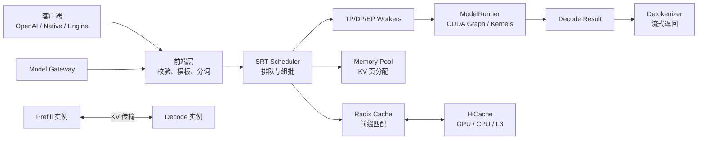

## 📑 本章导航

- [1. 为什么单独讲 SGLang](#1-为什么单独讲-sglang)
- [2. 版本边界](#2-版本边界)
- [3. 一张图看懂本章](#3-一张图看懂本章)
- [4. 六个核心问题](#4-六个核心问题)
- [5. 学习路线](#5-学习路线)
- [6. 贯穿全章的案例](#6-贯穿全章的案例)
- [7. 阅读源码的方法](#7-阅读源码的方法)
- [8. 性能结论怎么读](#8-性能结论怎么读)
- [9. 本章术语地图](#9-本章术语地图)
- [10. 小节索引](#10-小节索引)
- [总结](#总结)
- [自我检验清单](#自我检验清单)
- [参考资料](#参考资料)

---

## 1. 为什么单独讲 SGLang

先说白话。把大模型部署成服务，像经营一间不断插单的厨房。模型是炉灶，GPU 显存是操作台，KV Cache 是备好的半成品，调度器则是总厨。只让炉灶更快还不够。

如果总厨排单慢、半成品找不到、前厅传单阻塞，昂贵的 GPU 仍会空等。SGLang 的重点，正是把这些环节一起优化。

它不只是一个 CUDA Kernel 集合，也不只是 OpenAI API 外壳。它同时包含：

- 面向生产服务的 SGLang Runtime；
- 自动复用 KV Cache 的 RadixAttention；
- 连续批处理与重叠调度；
- 结构化生成和工具调用接口；
- 多 GPU、多节点和 PD 解耦能力；
- 面向模型特性的高性能 Kernel。

术语上，本章把后端运行时简称为 **SRT**，即 SGLang Runtime。需要特别区分：早期论文里的 “SGLang”，首先是一门结构化生成语言；

今天工程语境里的 “SGLang”，通常也指完整推理框架与 SRT。两种含义都存在，不能把 Frontend Language和服务引擎混成一个组件。

## 2. 版本边界

本章以 **SGLang v0.5.17** 为准。该版本发布于 2026-08-08。资料核验截止日期为 2026-08-12。因此：

- 命令按 v0.5.17 文档与参数解释；
- 源码路径按 `v0.5.17` tag 理解；
- 论文用于解释设计动机；
- release 用于说明新能力与已知边界；
- 未进入 v0.5.17 的 main 分支特性不算稳定能力。

v0.5.17 的 release还包含初始 Rust 前端支持。“初始支持”不等于Python 前端已经全面废弃。

本章主线仍以成熟的Python SRT 请求流解释架构，并把 Rust ingress标为版本新增边界。

同理，量化、推测解码、模型专用 Kernel都依赖硬件、模型和后端。看到一个参数，不代表所有模型都能组合使用。

> 版本原则：先查目标模型 cookbook，
> 再查 v0.5.17 server arguments，
> 最后用小规模正确性测试确认。

## 3. 一张图看懂本章



这张图可以分成三条线。第一条是**请求线**：请求进入、分词、排队、执行、反分词、返回。第二条是**状态线**：

请求状态、KV Cache、Radix Tree、显存页之间如何对应。第三条是**扩展线**：

单卡不够时，如何用 TP、DP、EP、Router 和 PD 解耦扩展。六篇正文分别沿着这三条线展开。

## 4. 六个核心问题

### 4.1 怎样最快跑起来

12.1 回答：

- 怎样安装固定版本；
- 怎样启动 OpenAI 兼容服务；
- 怎样直接使用 `sgl.Engine`；
- 怎样检查服务确实在工作；
- 怎样避免把“能返回”误判为“部署正确”。

### 4.2 一个请求经过哪些进程

12.2 回答：

- HTTP 请求在哪里被校验；
- Chat Template 在哪里应用；
- Tokenizer Manager 做什么；
- Scheduler 如何接收 tokenized request；
- ModelRunner 与 Detokenizer 如何配合；
- TP worker 如何共同完成一次 forward。

### 4.3 为什么共享前缀会更快

12.3 回答：

- KV Cache 为什么可以复用；
- Radix Tree 保存的究竟是什么；
- 前缀匹配、插入和引用计数如何协作；
- LRU/LFU/SLRU/priority 如何取舍；
- HiCache 为什么要扩展到 CPU 和外部存储。

### 4.4 CPU 调度为何会拖慢 GPU

12.4 回答：

- Continuous Batching 如何动态组批；
- Prefill 与 Decode 如何共存；
- CPU 每轮到底在忙什么；
- Overlap Scheduler 如何把 CPU 工作藏到 GPU 后面；
- 为什么“零开销”是目标描述，
  不是数学意义上的零耗时。

### 4.5 SGLang 与 Agent 有何关系

12.5 回答：

- JSON Schema、Regex、EBNF 如何约束输出；
- Grammar backend 如何影响合法 token；
- Frontend Language 解决什么问题；
- Tool Calling 由哪些层共同完成；
- 多模态输入怎样进入同一请求流；
- 引擎为何不等于完整 Agent 平台。

### 4.6 如何上生产并公平比较

12.6 回答：

- TP、DP、EP 分别切什么；
- 量化与精度如何验收；
- Speculative Decoding 何时有收益；
- PD 解耦如何改变扩缩容；
- Router 为什么要感知缓存；
- 怎样与 vLLM 做可复现、公平的 benchmark。

## 5. 学习路线

### 5.1 第一次接触推理引擎

建议按顺序阅读：

```text
12.1 → 12.2 → 12.3 → 12.4 → 12.5 → 12.6
```

不要一上来就抄生产参数。先理解请求流，再理解参数控制的组件。

### 5.2 已经使用过 vLLM

可以采用对照路线：

```text
12.2 请求流
  ↓
12.3 RadixAttention
  ↓
12.4 overlap scheduler
  ↓
12.6 公平对比
```

重点不是寻找“PagedAttention 对应哪个类”。两套系统概念相似，代码边界和默认策略却不完全相同。

### 5.3 正在做 Agent 服务

优先阅读：

```text
12.3 会话前缀复用
  ↓
12.5 结构化输出与工具
  ↓
12.6 Router 与容量规划
```

Agent 往往有长 system prompt、多轮历史和重复工具描述。它既需要输出可解析，也更容易从前缀缓存受益。

## 6. 贯穿全章的案例

本章使用一个简化场景。假设我们部署：

```text
模型：Qwen/Qwen2.5-7B-Instruct
接口：OpenAI Chat Completions
业务：AI Infra 问答助手
负载：共享 system prompt，多轮对话
目标：兼顾 TTFT、TPOT 和吞吐
```

选择小模型只是为了让入门者能复现实验。它不代表生产推荐型号。随着章节推进，我们会逐步加入：

- 多请求并发；
- 共享前缀；
- JSON 结构化输出；
- 工具定义；
- 多 GPU；
- Router；
- benchmark 门禁。

每次只改变少数变量，避免一次叠加所有优化。

## 7. 阅读源码的方法

源码阅读像看城市交通图。不要从每条小路开始背。先找主干道：

```text
请求入口
  → TokenizerManager
  → Scheduler
  → TpModelWorker / ModelRunner
  → DetokenizerManager
  → 响应出口
```

在 v0.5.17 tag 中，核心代码主要位于：

```text
python/sglang/srt/
├── entrypoints/
├── managers/
├── mem_cache/
├── model_executor/
├── layers/
└── server_args.py
```

阅读时记录四件事：

1. 输入消息类型是什么；
2. 谁持有可变状态；
3. 进程或线程边界在哪里；
4. 哪一步会触发 GPU 工作。

本章源码伪代码都会明确标注“伪代码”。真实命令则以v0.5.17 官方接口为准。

## 8. 性能结论怎么读

任何“快多少”的结论，至少需要六个坐标：

```text
模型与精度
硬件与卡数
输入/输出长度
请求到达模式
并发或请求率
统计指标与分位数
```

缺少这些条件，倍数通常无法迁移。原始 SGLang 论文报告在其测试任务上最高可达 5×。

这个数字来自特定版本、模型与结构化程序，不是 v0.5.17 对所有服务的承诺。

v0.5.17 release 中的DWDP、模型加载等数字，也只在 release 给出的硬件和 workload 下成立。

本章引用性能数字时，会保留条件或直接链接来源。没有可核实数据时，只讨论方向，不编造百分比。

## 9. 本章术语地图

| 白话 | 术语 | 主要解决的问题 |
|---|---|---|
| 动态拼桌 | Continuous Batching | 减少等待，提高利用率 |
| 半成品目录 | Radix Tree | 找到可复用前缀 KV |
| GPU 缓存层 | L1 KV Cache | 最快的 KV 复用 |
| CPU/外存缓存层 | HiCache L2/L3 | 扩大缓存容量 |
| 边算边排下一单 | Overlap Scheduling | 隐藏 CPU 调度开销 |
| 多炉灶切一口锅 | Tensor Parallelism | 单卡放不下模型 |
| 多套厨房接客 | Data Parallelism | 扩大副本吞吐 |
| 专家分柜台 | Expert Parallelism | 扩展 MoE 专家 |
| 先备菜后出餐分店 | PD Disaggregation | 分离 Prefill/Decode |
| 按缓存选后端 | Cache-aware Routing | 提高前缀命中 |

术语相同也可能实现不同。例如 “page”、“block” 和 “token slot”在不同框架中粒度未必相同。

比较时应看数据结构与 Kernel，不要只看名字。

## 10. 小节索引

### [12.1 SGLang 快速入门](/AIInfraGuide/inference/模块四-推理优化/第12章-深入sglang/121-sglang快速入门)

从固定版本安装开始，完成 Server、OpenAI API和离线 Engine 三条路径。

### [12.2 SGLang 整体架构](/AIInfraGuide/inference/模块四-推理优化/第12章-深入sglang/122-sglang整体架构)

沿着 SRT 消息流，理解入口、调度、执行与输出。

### [12.3 RadixAttention 与层次化缓存](/AIInfraGuide/inference/模块四-推理优化/第12章-深入sglang/123-radixattention与层次化缓存)

用手算和树图解释前缀复用、淘汰与 HiCache。

### [12.4 调度器与 CPU-GPU 重叠](/AIInfraGuide/inference/模块四-推理优化/第12章-深入sglang/124-调度器与cpu-gpu重叠)

从一次 scheduler iteration 出发，读懂 continuous batching和 overlap 主线。

### [12.5 结构化生成与 Agent 能力](/AIInfraGuide/inference/模块四-推理优化/第12章-深入sglang/125-结构化生成与agent能力)

连接 Grammar、Frontend Language、Tool Calling、Agent 与 VLM。

### [12.6 生产部署调优与框架对比](/AIInfraGuide/inference/模块四-推理优化/第12章-深入sglang/126-生产部署调优与框架对比)

覆盖并行、量化、推测解码、PD 解耦、Router 和公平 benchmark。

## 总结

SGLang 的核心价值不是某一个孤立优化。它把请求表达、缓存复用、动态调度、模型执行和集群路由放进同一套推理系统中。学习本章时，请始终追问三个问题：

1. 这个状态由谁维护？
2. 这一步在 CPU 还是 GPU？
3. 优化换来了什么代价？

抓住这三点，参数再多也不会失去主线。

## 自我检验清单

- [ ] 我能区分 SGLang、SRT 与 Frontend Language
- [ ] 我知道本章固定到 v0.5.17
- [ ] 我能画出请求从入口到返回的主链路
- [ ] 我知道 RadixAttention 复用的是 KV Cache
- [ ] 我不会把“零开销”理解成 CPU 不做工作
- [ ] 我知道 Engine 与 OpenAI Server 的边界
- [ ] 我能说明 TP、DP、EP 各自解决什么
- [ ] 我知道 PD 解耦需要额外 KV 传输
- [ ] 我会用 TTFT、TPOT、ITL 和吞吐共同评估
- [ ] 我不会脱离测试条件引用性能倍数

## 参考资料

1. [SGLang v0.5.17 Release Notes](https://github.com/sgl-project/sglang/releases/tag/v0.5.17)
2. [SGLang 官方文档](https://docs.sglang.ai/)
3. [SGLang GitHub，v0.5.17](https://github.com/sgl-project/sglang/tree/v0.5.17)
4. [SGLang: Efficient Execution of Structured Language Model Programs，NeurIPS 2024](https://arxiv.org/abs/2312.07104)
5. [Fast and Expressive LLM Inference with RadixAttention](https://lmsys.org/blog/2024-01-17-sglang/)
6. [SGLang Benchmark and Profiling](https://docs.sglang.ai/developer_guide/benchmark_and_profiling.html)

> 最后核验：本文内容截至 2026-08-12；
> 后续版本请以对应 release、文档和 tag 为准。
