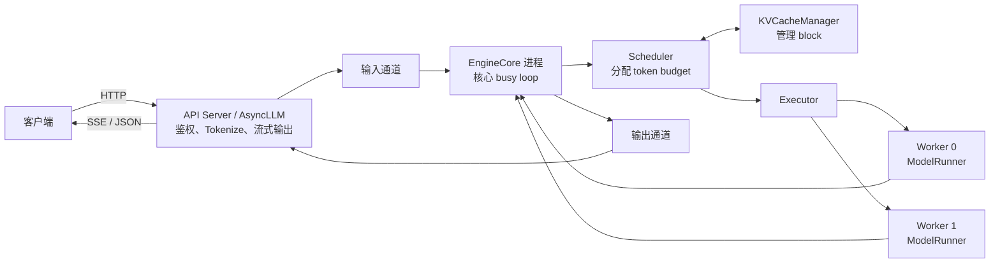
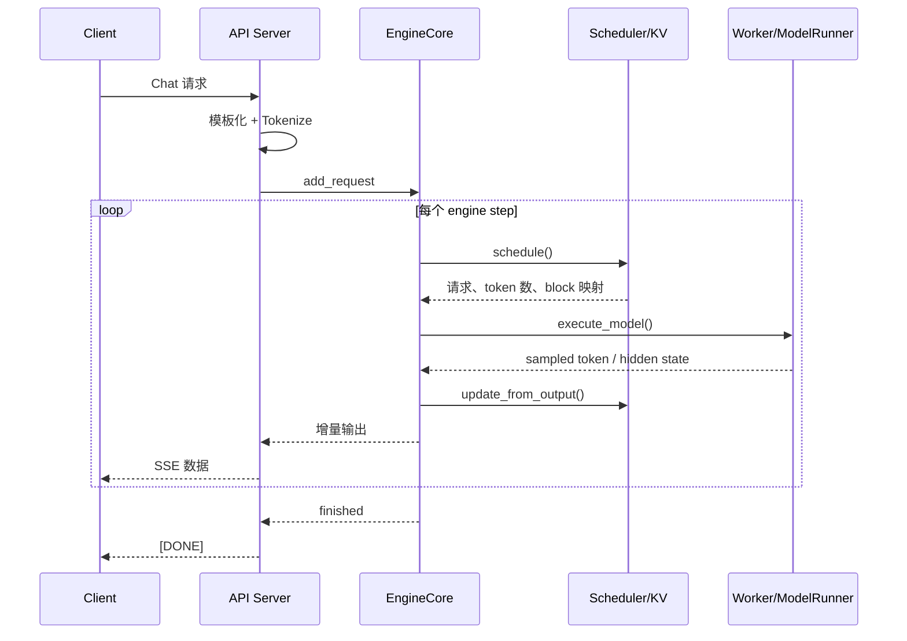
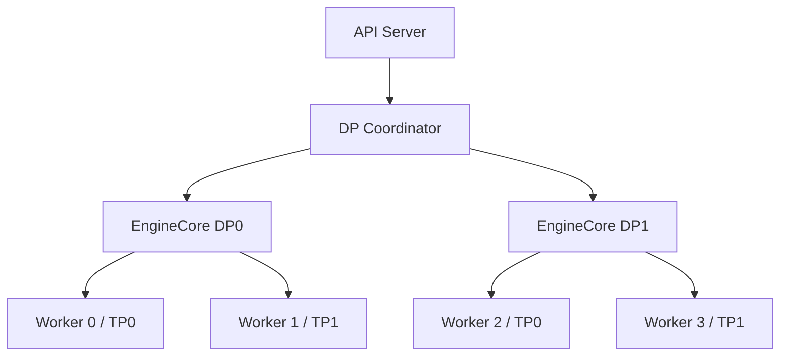

## 📑 目录

- [1. 先看问题：为什么不能直接 model.generate](#1-先看问题为什么不能直接-modelgenerate)
- [2. 用餐厅理解 vLLM](#2-用餐厅理解-vllm)
- [3. V1 的进程与组件](#3-v1-的进程与组件)
- [4. 一次请求的完整旅程](#4-一次请求的完整旅程)
- [5. EngineCore 的一步](#5-enginecore-的一步)
- [6. 数据如何跨进程流动](#6-数据如何跨进程流动)
- [7. 多卡时组件如何展开](#7-多卡时组件如何展开)
- [8. 架构带来的 trade-off](#8-架构带来的-trade-off)
- [9. 排障时从哪一层看](#9-排障时从哪一层看)
- [总结](#-总结)
- [自检清单](#-自检清单)
- [参考资料](#-参考资料)

---

## 1. 先看问题：为什么不能直接 `model.generate`

在笔记本里跑一个模型，代码可能只有三步：

```python
inputs = tokenizer("你好", return_tensors="pt").to("cuda")
outputs = model.generate(**inputs, max_new_tokens=64)
print(tokenizer.decode(outputs[0]))
```

这段代码能生成文本，却不是一个合格的在线推理服务。 线上同时来了三个请求：

- A 的 Prompt 有 100 个 token，要生成 200 个 token
- B 的 Prompt 有 4,000 个 token，只生成 20 个 token
- C 在 A 生成到一半时才到达

如果按“凑齐一批、整批跑完”处理，C 必须等 A 和 B 全部结束。 如果每个请求各起一个模型副本，模型权重和 KV Cache 又会迅速吃光显存。 推理引擎真正要解决的是：

1. 请求何时进入 GPU
2. 每一步给谁算多少 token
3. KV Cache 放在哪里、何时回收
4. 多张 GPU 如何协作
5. 结果如何流式返回且不堵住核心循环

vLLM 的“快”不是某一个 Kernel 单独完成的，而是这些组件协同的结果。

## 2. 用餐厅理解 vLLM

先不用术语，把在线推理服务想成一家餐厅：

| 餐厅角色 | vLLM 组件 | 主要职责 |
|---------|-----------|---------|
| 前台 | API Server / `AsyncLLM` | 接收请求、校验参数、流式返回 |
| 后厨主管 | `EngineCore` | 驱动循环，协调调度和执行 |
| 排单员 | `Scheduler` | 决定本轮做哪些请求、各做多少 token |
| 储物管理员 | `KVCacheManager` | 分配、复用、释放 KV Cache block |
| 炉灶工位 | `Worker` | 控制一张加速卡并执行命令 |
| 厨师 | `ModelRunner` | 准备张量、运行模型、采样 token |

这个类比有一个关键点：**前台不亲自炒菜**。 Tokenize、HTTP 编解码和客户端断开处理属于服务层工作。 调度、KV Cache 和模型执行属于引擎核心工作。 把它们拆开，CPU 处理请求的同时，GPU 才能继续算上一轮。 对应术语叫作**控制面与执行面解耦**。

## 3. V1 的进程与组件

本文以 vLLM v0.27.1 的 V1 架构为边界。 类名和文件路径会随版本演进，但下面的职责边界比具体调用栈更稳定。



### 3.1 入口层：`LLM` 与 `AsyncLLM`

离线批处理常从 `vllm.LLM` 进入。 在线服务常由 `vllm serve` 启动 API Server，再通过异步入口与核心通信。 两种入口面对的用户不同：

- `LLM`：调用者愿意等待一批结果，接口更像普通 Python 函数
- `AsyncLLM`：请求随时到达、随时取消，输出需要逐步异步消费

它们最终都要把请求转换成引擎可理解的内部表示。

### 3.2 `EngineCore`：不做所有事，只负责让循环前进

`EngineCore` 持有 Scheduler，并协调模型执行。

可以把核心循环压缩成三步：

```python
# 教学伪代码：表达职责，不可直接运行
while service_is_alive:
    ingest_new_requests()
    scheduler_output = scheduler.schedule()
    model_output = executor.execute_model(scheduler_output)
    finished_or_streaming = scheduler.update_from_output(model_output)
    publish(finished_or_streaming)
```

真实实现还要处理取消、错误、结构化输出、推测解码和多模态输入。 但读源码时先抓住 `schedule → execute → update`，不容易迷路。

### 3.3 `Scheduler`：分配的不是“请求数”，而是 token

V1 的调度决策核心可以写成：

$$
\sum_{i=1}^{n} t_i \le B
$$

其中：

- $t_i$：本轮分给请求 $i$ 的 token 数
- $B$：本轮 token budget，受 `max_num_batched_tokens` 等配置限制

长 Prompt 可以只拿到一部分预算，这就是 chunked prefill。 Decode 请求通常只需要少量新 token，也能和 Prompt 计算进入同一轮。 第 3.4 节会逐行拆解这部分。

### 3.4 `KVCacheManager`：管理地址，不计算 Attention

每个请求已计算 token 的 Key/Value 要保留，后续 Decode 才不用重算历史。

`KVCacheManager` 负责：

- 查找可复用的前缀 block
- 为新 token 分配 slot
- 维护 block 引用关系
- 请求结束时释放 block
- 空间不足时配合调度器回收或抢占

它不负责执行 Attention Kernel。 真正读取这些 block 并计算 Attention 的是 Worker 内的模型执行路径。

### 3.5 `Worker` 与 `ModelRunner`

官方架构说明中，一个 Worker 通常控制一个加速器设备。

`Worker` 更像设备级外壳，负责设备初始化和分布式协作。

`ModelRunner` 负责更贴近一次 forward 的工作：

- 加载模型权重
- 维护持久化 batch 状态
- 准备输入张量
- 选择或捕获 CUDA Graph
- 调用模型 forward
- 采样下一批 token

v0.27.1 文档还描述了 Model Runner V2。 它仍存在功能完整性和测试覆盖边界，不能把“V1 引擎”与“Model Runner V2”混为一谈。

## 4. 一次请求的完整旅程

下面以在线 Chat Completions 为例。

### 4.1 接收与预处理

客户端发送：

```bash
curl http://localhost:8000/v1/chat/completions \
  -H "Content-Type: application/json" \
  -d '{
    "model": "Qwen/Qwen2.5-7B-Instruct",
    "messages": [{"role": "user", "content": "解释 KV Cache"}],
    "max_tokens": 64,
    "stream": true
  }'
```

API Server 先校验请求，再应用 Chat Template 和 Tokenizer。 此时“解释 KV Cache”不会只变成这几个汉字对应的 token。 模型模板还可能加入角色标记、起止符和 generation prompt。 因此容量规划应看**实际 token 数**，不能只看字符数。

### 4.2 入队与首次调度

请求进入 waiting 队列后，Scheduler 检查：

1. 是否命中已计算的前缀 block
2. 剩余 token budget 有多少
3. KV Cache 是否有足够 slot
4. 本轮能处理 Prompt 的多少 token

假设 Prompt 实际为 1,000 token，本轮预算只剩 256。 那么首次只处理 256 token，而不是拒绝整个请求。

### 4.3 执行与返回



第一个输出 token 到达客户端的时间叫 TTFT。 后续输出 token 之间的间隔叫 ITL。 端到端耗时可近似拆成：

$$
T_{\text{E2E}}
=T_{\text{queue}}+T_{\text{prefill}}+T_{\text{decode}}+T_{\text{network}}
$$

架构不同层分别影响不同项，不能只盯 GPU Kernel。

## 5. `EngineCore` 的一步

做一个手算。 当前有三个请求：

| 请求 | 已计算 token | 目标位置 | 尚需计算 |
|------|--------------|----------|----------|
| A | 1,000 | 1,001 | 1 |
| B | 500 | 501 | 1 |
| C | 0 | 700 | 700 |

若本轮 token budget $B=256$，简化分配可以是：

1. A 分 1 token，预算剩 255
2. B 分 1 token，预算剩 254
3. C 分 254 token，Prompt 被切块

于是：

$$
t_A+t_B+t_C=1+1+254=256
$$

A、B 的 Decode 没被 700-token 的 Prefill 整体挡住。 这正是统一 token 调度和 chunked prefill 组合的直觉。 真实调度还受优先级、结构化输出、编码器输入和 KV 可用量约束。

## 6. 数据如何跨进程流动

进程隔离能避免 API 层工作阻塞核心循环，但通信不是免费的。 输入侧通常传递请求元数据、token IDs 和采样参数。 执行侧不应每步重复传整份历史状态。 V1 通过持久化 batch 等设计减少每步 CPU 准备和数据搬运。 理解这一点有助于解释两个现象：

- GPU 利用率低，不一定是 Kernel 慢，也可能是 CPU 准备跟不上
- 增加 API 进程，不一定提高单个 EngineCore 的吞吐

可观察的边界应包括：

```text
HTTP 排队 → Tokenize → EngineCore 排队 → Scheduler
→ Worker 输入准备 → GPU 执行 → Detokenize → 网络发送
```

## 7. 多卡时组件如何展开

以张量并行 `TP=2`、数据并行 `DP=2` 为例。 总 Worker 数通常是：

$$
N_{\text{worker}}=TP\times DP=2\times2=4
$$

每个 DP rank 有自己的 EngineCore 与一组 TP Workers。 数据并行协调层负责把请求分到不同 DP rank。



张量并行降低单卡权重占用，但每层会引入卡间通信。 数据并行增加独立副本，吞吐扩展更直接，但每个副本都要放一份权重。 “卡越多越快”并不成立，通信拓扑和请求规模必须一起评估。

## 8. 架构带来的 trade-off

### 8.1 多进程隔离

收益：CPU 工作可与 GPU 计算重叠，故障边界更清楚。 代价：需要 IPC、共享内存和更充分的 CPU 资源。

### 8.2 Continuous Batching

收益：请求完成后立刻补入新请求，提高 GPU 利用率。 代价：batch 形状持续变化，性能与复现性分析更复杂。

### 8.3 分页 KV Cache

收益：按 block 分配、复用和回收，减少连续大块预留。 代价：Attention Kernel 必须理解非连续物理 block。

### 8.4 统一 token 预算

收益：Prefill、Decode、推测 token 能用同一套模型表达。 代价：参数间存在耦合，错误预算可能伤害 TTFT 或 ITL。

## 9. 排障时从哪一层看

遇到问题先归层，不要一上来改十个参数。

| 现象 | 优先检查 |
|------|----------|
| 请求返回 4xx | API 参数、Chat Template、模型名 |
| TTFT 高但 GPU 不忙 | 排队、Tokenize、CPU、Prefill |
| ITL 抖动 | 调度预算、长 Prompt、通信、抢占 |
| 启动 OOM | 权重、KV 预算、CUDA Graph、并行方式 |
| 运行中频繁重计算 | KV Cache 容量、并发、长上下文 |
| 多卡扩展差 | NCCL、拓扑、TP 粒度、负载均衡 |

真实服务可先查看：

```bash
curl -s http://localhost:8000/health
curl -s http://localhost:8000/metrics
```

指标名会随版本演进，接入监控前应以当前版本的 `/metrics` 输出为准。

## 📝 总结

vLLM V1 可以理解为一条分层流水线：

1. API 层负责协议与输入输出
2. EngineCore 让核心循环持续前进
3. Scheduler 按 token budget 做每轮决策
4. KVCacheManager 管理可复用的显存 block
5. Worker 与 ModelRunner 把计划变成设备上的模型执行

读源码时先找职责边界，再跟一次请求的数据流，比从某个大文件逐行硬啃有效。

## 🎯 自检清单

- [ ] 能解释为什么 `model.generate` 不等于在线推理引擎
- [ ] 能说出 API Server、EngineCore、Scheduler 的职责边界
- [ ] 能说明 KVCacheManager 不负责 Attention 计算
- [ ] 能画出一次请求从 HTTP 到流式 token 的路径
- [ ] 能用 token budget 手算一次简化调度
- [ ] 能区分 Worker 与 ModelRunner
- [ ] 能解释 TP=2、DP=2 时为什么通常有 4 个 Worker
- [ ] 能把 TTFT 或 ITL 问题定位到可能的架构层
- [ ] 知道 Model Runner V2 不等同于整个 V1 引擎

## 📚 参考资料

- [vLLM 官方文档：Architecture Overview](https://docs.vllm.ai/en/latest/design/arch_overview/)
- [vLLM 官方文档：vLLM V1](https://docs.vllm.ai/en/latest/usage/v1_guide/)
- [vLLM 官方文档：Scheduler 源码 API](https://docs.vllm.ai/en/latest/api/vllm/v1/core/sched/scheduler/)
- [vLLM 官方文档：Model Runner V2 Design](https://docs.vllm.ai/en/latest/design/model_runner_v2/)
- [vLLM v0.27.1 Release](https://github.com/vllm-project/vllm/releases/tag/v0.27.1)
- [Efficient Memory Management for Large Language Model Serving with PagedAttention](https://arxiv.org/abs/2309.06180)
