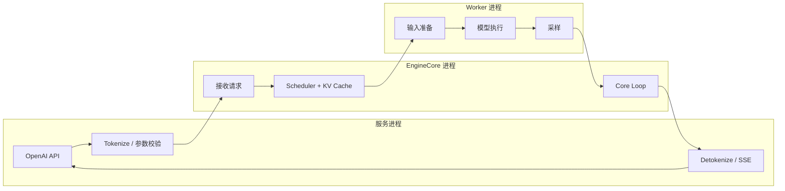

## 📑 目录

- [1. 问题场景：功能越多，主循环越难改](#1-问题场景功能越多主循环越难改)
- [2. V1 不是简单的 V0 加速版](#2-v1-不是简单的-v0-加速版)
- [3. 改进一：进程解耦](#3-改进一进程解耦)
- [4. 改进二：统一 token 调度](#4-改进二统一-token-调度)
- [5. 改进三：Prefix Cache 默认开启](#5-改进三prefix-cache-默认开启)
- [6. 改进四：Persistent Batch](#6-改进四persistent-batch)
- [7. 改进五：异步调度与 Model Runner V2](#7-改进五异步调度与-model-runner-v2)
- [8. 手算一个 V1 step](#8-手算一个-v1-step)
- [9. V1 的边界与 trade-off](#9-v1-的边界与-trade-off)
- [10. 如何确认自己运行的是哪套行为](#10-如何确认自己运行的是哪套行为)
- [总结](#-总结)
- [自检清单](#-自检清单)
- [参考资料](#-参考资料)

---

## 1. 问题场景：功能越多，主循环越难改

想象你写了一个快递分拣程序。 最初只有普通件和一个传送带，逻辑很简单：

```text
取一批包裹 → 分拣 → 发走 → 取下一批
```

后来陆续加入加急件、超大件、同地址合箱、退货和跨仓转运。 如果每加一种功能就在主循环里加一个 `if/else`，最终会发生两件事：

1. 同一个概念在多条分支里重复表达
2. 修一条路径时，很容易破坏另一条路径

vLLM V0 需要同时支持 Prefill、Decode、Prefix Cache、LoRA、推测解码等能力。 这些能力若各有独立的调度表达，组合复杂度会快速上升。 V1 的核心目标不是“把变量名改漂亮”，而是重新定义共同抽象。

## 2. V1 不是简单的 V0 加速版

本文以 vLLM v0.27.1 和 2026-08-12 的官方文档为边界。 V1 已是当前主线架构，但一些内部组件仍在演进。 不要用单一百分比概括 V1 比 V0 快多少。 性能取决于：

- 模型结构和量化格式
- GPU 与互联
- Prompt/Output 长度分布
- 并发和到达率
- Prefix Cache 命中率
- Attention backend 与编译配置

本节关注可以从官方设计和源码验证的**机制变化**。

| 维度 | V0 常见思路 | V1 核心思路 |
|------|-------------|-------------|
| 调度表达 | Prefill/Decode 路径区分较强 | 统一为“尚需计算的 token” |
| 核心边界 | 更多工作耦合在引擎路径 | API 与 EngineCore 多进程解耦 |
| 抢占 | 历史上存在 swap/recompute 选择 | 默认使用 recompute |
| Prefix Cache | 可选优化 | 默认开启 |
| batch 更新 | 易重复准备完整状态 | 维护持久状态并传增量 |
| CPU/GPU 重叠 | 受同步路径限制 | 持续增强异步调度 |

这些不是互相独立的补丁。 统一调度让 Prefix Cache、chunked prefill 和推测 token 能共享同一个预算模型。 进程解耦和持久 batch 则减少 CPU 成为 GPU 的“断粮点”。

## 3. 改进一：进程解耦

### 3.1 先白话：前台不要占用后厨对讲机

如果前台每解析一句顾客备注，都让后厨暂停工作等待确认，炉灶会频繁空转。 HTTP、Tokenize、Detokenize 和断连处理的耗时并不稳定。 V1 把核心引擎放在独立 EngineCore 进程中，让服务层通过通信通道传递请求和结果。



术语上，这是把**前端服务数据路径**与**引擎核心控制循环**隔离。 收益是 CPU 工作更容易和设备执行重叠。 代价是多了 IPC、序列化、共享内存与进程生命周期管理。

### 3.2 CPU 资源仍然重要

多进程不等于 CPU 工作消失。 如果 Tokenizer 很慢、CPU 核数不足或容器共享内存过小，GPU 仍可能等输入。 因此看到 GPU 利用率锯齿时，应同时观察：

- EngineCore 是否持续有可调度请求
- API 进程 CPU 是否打满
- Tokenize 队列是否堆积
- Worker 输入准备是否形成同步点

## 4. 改进二：统一 token 调度

### 4.1 从“你是什么阶段”改为“你还差多少”

传统表达先给请求贴标签：

- 这是 Prefill 请求
- 这是 Decode 请求

V1 Scheduler 更关心两个量：

- `num_computed_tokens`：已经算到哪里
- `num_tokens_with_spec`：当前希望追到哪里

简化后的待计算量为：

$$
n_{\text{new}}
=n_{\text{tokens-with-spec}}-n_{\text{computed}}
$$

源码还会考虑 output placeholder、模型长度、预算和其他功能约束。 但这条差值是理解统一调度的入口。

### 4.2 为什么一个差值能覆盖多种情况

普通 Decode：

$$
n_{\text{tokens-with-spec}}=n_{\text{computed}}+1
$$

所以本轮通常需要 1 token。 长 Prompt：

$$
n_{\text{new}}=4096
$$

若只剩 512 预算，就分配 512，形成 chunked prefill。 推测解码： 目标位置还包含候选 token，因此 `n_new` 可以大于 1。 Prefix Cache 命中： 命中的 block 会推进已计算位置，需要真正执行的新 token 随之减少。 统一表达避免为每种组合另写一套主调度器。

### 4.3 教学伪代码

```python
# 教学伪代码：省略多模态、结构化输出和并行细节
token_budget = max_num_batched_tokens

for request in running_requests:
    wanted = request.num_tokens_with_spec - request.num_computed_tokens
    wanted = min(wanted, request.remaining_model_len)
    scheduled = min(wanted, token_budget)

    if kv_cache.can_allocate(request, scheduled):
        plan[request.id] = scheduled
        token_budget -= scheduled
    else:
        preempt_until_slots_available()

for request in waiting_requests:
    cached = kv_cache.find_cached_blocks(request.prompt_token_ids)
    request.num_computed_tokens = cached.num_tokens
    admit_if_budget_and_cache_allow(request)
```

真实源码顺序和分支比这复杂。 这段伪代码只用于建立“差值、预算、block”三个关键概念。

## 5. 改进三：Prefix Cache 默认开启

### 5.1 先白话：做过的公共题干不要重做

许多请求拥有相同开头：

```text
[固定 system prompt] + [固定工具说明] + [每次不同的问题]
```

如果公共前缀有 2,000 token，100 个请求各算一遍，就做了大量重复 Prefill。 Automatic Prefix Caching（APC）把已计算的完整 KV block 按前缀内容建立索引。 新请求命中时可以复用这些 block。 在 v0.27.1 的 `CacheConfig` 中，`enable_prefix_caching` 默认为 `True`。 旧版本或特殊后端可能不同，排障时应检查实际启动配置。

### 5.2 “零开销”应该如何理解

官方材料常强调 V1 的 zero-overhead prefix caching。 它不意味着哈希查找、元数据和显存占用在物理上都是 0。 更准确的理解是：

- 缓存 block 与普通 KV block 使用统一池
- 未命中时，不需要额外复制整份 KV
- 可缓存 block 能在需要空间时按策略被回收

Prefix Cache 只减少重复 Prefill，不会复用不同后缀的 Decode 结果。 它也不改变模型数学输出；浮点 Kernel 路径和动态 batch 仍可能带来微小数值差异。

### 5.3 只有完整 block 才容易复用

假设 block size 为 16 token。 两个请求共同前缀为 70 token。 可直接按完整 block 命中的数量是：

$$
\left\lfloor \frac{70}{16}\right\rfloor=4
$$

对应 64 token。 最后 6 token 所在 block 还没形成相同的完整边界，通常需要重新计算。 这说明 block size 会影响匹配粒度，但不能只为命中粒度盲目改小。 Kernel 支持、元数据和分配效率也要一起考虑。

## 6. 改进四：Persistent Batch

### 6.1 为什么每步重建 batch 很浪费

Decode 每一步通常只新增少量 token。 如果 batch 有 200 个请求，而本步只加入 1 个新请求、结束 2 个请求，重传全部状态很浪费。 Persistent Batch 的直觉是：

```text
GPU/Worker 侧保留上一步状态
+ 本步新增请求
- 本步完成请求
+ 本步位置和 token 增量
= 本步输入
```

可以把传输量粗略写成：

$$
C_{\text{full}}\propto N
$$

$$
C_{\text{diff}}\propto N_{\text{add}}+N_{\text{remove}}+N_{\text{change}}
$$

当 $N=200$，而增删请求只有 3 个时，差异非常直观。 这不表示模型输入张量完全无需更新。 它表示 CPU 端无需把所有请求的逻辑状态当作全新 batch 重建。

### 6.2 trade-off

持久状态减少重复工作，却提高状态一致性的要求。 如果 Scheduler 认为某请求在 slot 5，而 ModelRunner 认为它在 slot 8，错误会很隐蔽。 因此源码中会看到 request ID 到 batch index 的映射、增删和压紧逻辑。 读这部分时要持续问：

1. 谁拥有权威状态
2. 本步传的是全量还是 diff
3. 请求结束后 slot 何时可复用

## 7. 改进五：异步调度与 Model Runner V2

理想流水线是：

```mermaid
gantt
    title CPU 与 GPU 重叠（示意，不代表固定耗时）
    dateFormat X
    axisFormat %L
    section GPU
    执行 Step N     :g1, 0, 4
    执行 Step N+1   :g2, 4, 8
    section CPU
    准备 Step N+1   :c1, 0, 3
    准备 Step N+2   :c2, 4, 7
```



GPU 执行 Step N 时，CPU 准备 Step N+1。 如果中间出现必须把 GPU 结果同步回 CPU 的操作，流水线会产生气泡。 Model Runner V2 的设计目标包括：

- 从设计起点支持异步调度
- 区分持久状态张量与单步输入
- 减少 CUDA stream 上的 CPU 同步点
- 把功能拆到更模块化的文件
- 让 CUDA Graph 管理更显式

⚠️ **版本边界**：v0.27.1 官方设计文档仍明确提示 Model Runner V2 尚未功能完备、未经过同等严格测试，且仍有开放设计问题。 因此：

- V1 是主线引擎架构
- Model Runner V2 是 V1 内继续演进的执行组件
- 二者不能作为同义词

## 8. 手算一个 V1 step

设：

- `max_num_batched_tokens = 512`
- KV Cache 还有 40 个 block
- `block_size = 16`

三个请求状态如下：

| 请求 | 已计算 | 当前目标 | 前缀命中 | 本轮需求 |
|------|--------|----------|----------|----------|
| A | 1,024 | 1,025 | 不适用 | 1 |
| B | 0 | 300 | 128 | 172 |
| C | 0 | 1,000 | 0 | 1,000 |

先把 A 和 B 放入计划：

$$
B_{\text{left}}=512-1-172=339
$$

C 本轮最多拿 339 token。 总计划为：

$$
1+172+339=512
$$

粗略估算新增 block：

$$
\left\lceil\frac{1}{16}\right\rceil
+\left\lceil\frac{172}{16}\right\rceil
+\left\lceil\frac{339}{16}\right\rceil
=1+11+22=34
$$

34 小于剩余 40，看起来可行。 但真实分配会考虑已有部分 block、共享 block、预留 slot 和后端布局。 这个手算适合建立容量直觉，不可替代 `KVCacheManager.allocate_slots()`。

## 9. V1 的边界与 trade-off

### 9.1 架构更统一，不等于所有模型路径相同

Decoder-only、Encoder-Decoder、多模态、Mamba 和混合 Attention 的缓存形态并不完全一样。 统一 Scheduler 仍需调用模型与后端相关逻辑。

### 9.2 默认开启，不等于永远有收益

Prefix Cache 在重复前缀多时收益明显。 如果每个 Prompt 都不同，命中率低，主要价值就不是省 Prefill。

### 9.3 Chunked Prefill 是平衡，不是免费午餐

切块可以减少长 Prompt 对 Decode 的阻塞。 但切得过小可能增加调度轮次和 Kernel 启动开销。

### 9.4 Recompute 用计算换存储

V1 抢占默认使用 recompute。 它省去 CPU swap 路径，却会重做被释放的 token 计算。 频繁发生时，首先应解决 KV 容量或过载，而不是把重计算当正常稳态。

### 9.5 内部 API 不承诺长期稳定

`vllm.v1.*` 下的源码非常适合学习，但不是面向业务代码的稳定公共 API。

生产集成优先使用 `vllm serve`、OpenAI 兼容 API 和公开 Python 接口。

## 10. 如何确认自己运行的是哪套行为

先记录版本：

```bash
python -c "import vllm; print(vllm.__version__)"
vllm serve --help
```

再保存最终启动命令和服务日志。 不要只凭博客参数判断，因为默认值可能跨版本变化。 一个最小验证流程：

```bash
vllm serve Qwen/Qwen2.5-7B-Instruct \
  --host 127.0.0.1 \
  --port 8000

curl -s http://127.0.0.1:8000/metrics > metrics.txt
```

检查 Prefix Cache 时，应观察当前版本暴露的 query/hit counter，而不是只看开关。 指标语义和名称以运行版本的 Metrics 文档与 `/metrics` 输出为准。

## 📝 总结

V1 最值得掌握的不是“更快”三个字，而是五个设计动作：

1. 用 EngineCore 进程隔离服务层与核心循环
2. 用 token 差值统一 Prefill、Decode 与推测 token
3. 用统一 KV block 池支撑默认 Prefix Cache
4. 用 Persistent Batch 减少每步全量状态准备
5. 用异步调度继续压缩 CPU/GPU 流水线气泡

这些机制相互配合，才构成 V1 的整体设计。

## 🎯 自检清单

- [ ] 能解释 V1 为什么不是单纯的 V0 性能补丁
- [ ] 能写出 `目标 token - 已计算 token` 的调度差值
- [ ] 能说明一个统一表达如何覆盖 Prefill 与 Decode
- [ ] 能正确解释“zero-overhead prefix caching”的边界
- [ ] 能按 block size 手算可复用的完整前缀 token
- [ ] 能说明 Persistent Batch 为什么传增量更省 CPU
- [ ] 能画出 Step N GPU 与 Step N+1 CPU 的重叠
- [ ] 能区分 V1 引擎和 Model Runner V2
- [ ] 知道抢占重计算频繁意味着容量或负载问题
- [ ] 不会把未经本机测试的统一性能倍数写进结论

## 📚 参考资料

- [vLLM 官方文档：vLLM V1](https://docs.vllm.ai/en/latest/usage/v1_guide/)
- [vLLM 官方文档：Architecture Overview](https://docs.vllm.ai/en/latest/design/arch_overview/)
- [vLLM 官方文档：Automatic Prefix Caching](https://docs.vllm.ai/en/latest/design/prefix_caching/)
- [vLLM 官方文档：Optimization and Tuning](https://docs.vllm.ai/en/latest/configuration/optimization/)
- [vLLM 官方文档：Model Runner V2 Design](https://docs.vllm.ai/en/latest/design/model_runner_v2/)
- [vLLM Scheduler 源码 API](https://docs.vllm.ai/en/latest/api/vllm/v1/core/sched/scheduler/)
- [vLLM v0.27.1 Release](https://github.com/vllm-project/vllm/releases/tag/v0.27.1)
- [PagedAttention 论文](https://arxiv.org/abs/2309.06180)
