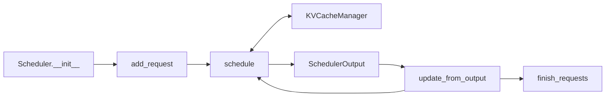
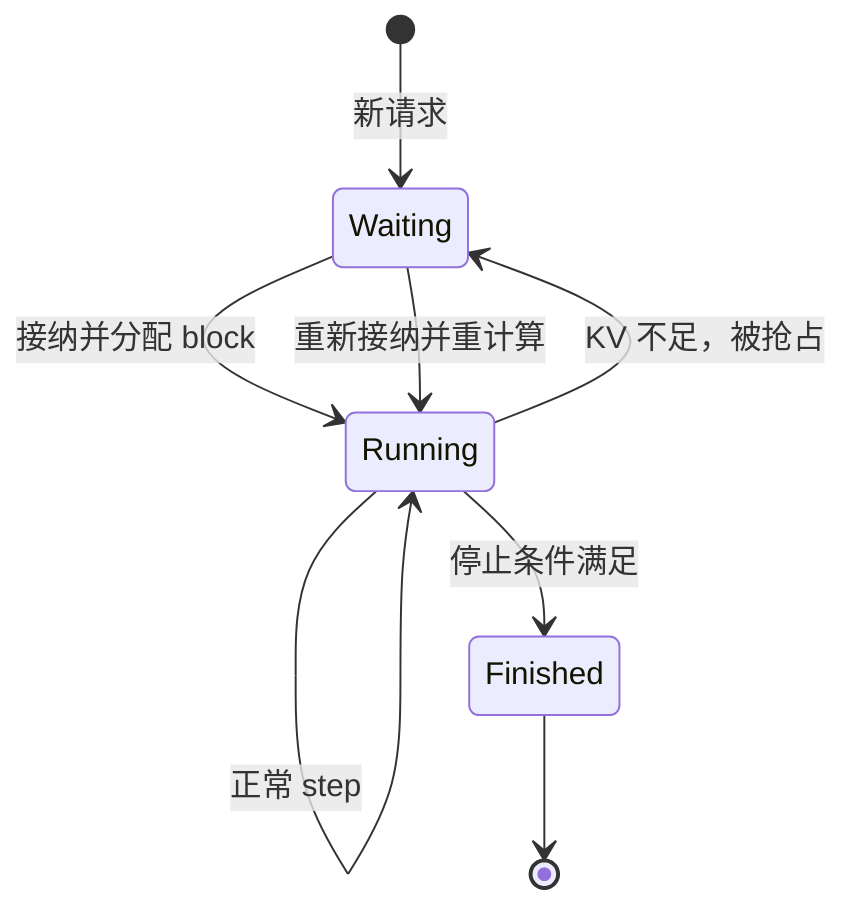

## 📑 目录
- [1. 为什么 Scheduler 最值得先读](#1-为什么-scheduler-最值得先读)
- [2. 先准备一张源码地图](#2-先准备一张源码地图)
- [3. 核心状态：running 与 waiting](#3-核心状态running-与-waiting)
- [4. schedule() 的主流程](#4-schedule-的主流程)
- [5. 第一段：调度 running 请求](#5-第一段调度-running-请求)
- [6. 第二段：必要时抢占](#6-第二段必要时抢占)
- [7. 第三段：接纳 waiting 请求](#7-第三段接纳-waiting-请求)
- [8. KVCacheManager 如何配合](#8-kvcachemanager-如何配合)
- [9. SchedulerOutput 里有什么](#9-scheduleroutput-里有什么)
- [10. 模型执行后如何更新](#10-模型执行后如何更新)
- [11. 手算与断点观察](#11-手算与断点观察)
- [12. 源码阅读的版本边界](#12-源码阅读的版本边界)
- [总结](#-总结)
- [自检清单](#-自检清单)
- [参考资料](#-参考资料)
---
## 1. 为什么 Scheduler 最值得先读
线上推理出现下面的问题时，根因常常不在模型 forward：
- 长 Prompt 一来，正在对话的用户突然卡顿
- 显存看似够用，却频繁出现请求重计算
- 并发提高后吞吐不再增长，P99 延迟却快速恶化
- Prefix Cache 有命中，但 TTFT 改善不明显
这些现象都与“这一轮让谁进入 GPU”有关。 Scheduler 就是 vLLM 的排班表。 先用超市收银台类比：
- `waiting`：还没分到收银台的顾客
- `running`：已经在结账、下轮还要继续的顾客
- token budget：本轮收银员能扫的商品总数
- KV block：每位顾客占用的购物筐
- preemption：购物筐不够，先让某位顾客退出并稍后重来
读懂这张排班表，再看 Worker 和 Kernel 会容易很多。
## 2. 先准备一张源码地图
本文以 vLLM v0.27.1 为边界。 核心实现位于：

```text
vllm/v1/core/sched/scheduler.py
```

关联概念还分布在：

```text
vllm/v1/core/sched/interface.py
vllm/v1/core/kv_cache_manager.py
vllm/v1/request.py
vllm/v1/core/sched/output.py
```

路径可能在后续版本移动。 最稳妥的定位方式是从已安装包查询：

```bash
python - <<'PY'
import inspect
from vllm.v1.core.sched.scheduler import Scheduler

print(inspect.getfile(Scheduler))
print(inspect.signature(Scheduler.schedule))
PY
```

如果你的版本没有这个导入路径，应以对应 tag 的源码为准，不要硬套本文路径。 建议按下面顺序阅读：



不要一开始就追进 Attention Kernel。 Scheduler 只产出计划，Worker 才执行计划。
## 3. 核心状态：`running` 与 `waiting`
### 3.1 `running`
`running` 保存已被引擎接纳、仍需继续处理的请求。
“running”不等于此刻正在 GPU 上执行。 它更接近：
> 已拥有执行状态，并有资格参与下一轮调度。
请求可能因为本轮预算不足而没被选中，但仍处于 running 生命周期。
### 3.2 `waiting`
`waiting` 保存尚未接纳或被抢占后等待恢复的请求。
调度策略可以是 FCFS，也可以按 priority。 priority 模式仍会使用到达时间处理同优先级请求的顺序。 这意味着“优先级高”不是无限资源：
- token budget 仍有限
- KV Cache 仍有限
- 当前不可满足的请求仍可能等待
### 3.3 请求上的关键计数
阅读 `Request` 时重点找：
- Prompt token IDs
- Output token IDs
- `num_computed_tokens`
- `num_tokens_with_spec`
- 状态与停止条件
- 多模态或 encoder 输入
统一调度的基本差值是：
$$
n_{\text{need}}
=n_{\text{tokens-with-spec}}
+n_{\text{output-placeholders}}
-n_{\text{computed}}
$$
不同版本可能调整字段，公式应以对应源码为准。
## 4. `schedule()` 的主流程
先看一份教学伪代码：

```python
# 教学伪代码：只还原阅读顺序，不可替代真实实现
def schedule():
    token_budget = max_num_batched_tokens
    scheduled = {}

    # 1. 先考虑已运行请求
    for request in running:
        n = compute_needed_tokens(request)
        n = clamp_by_model_len_and_budget(n, token_budget)
        blocks = kv_cache_manager.allocate_slots(request, n)

        if blocks is None:
            preempt_some_request()
            retry_allocation()

        if n > 0:
            scheduled[request.id] = n
            token_budget -= n

    # 2. 再接纳等待请求
    while waiting and token_budget > 0:
        request = waiting.peek()
        cached = kv_cache_manager.get_computed_blocks(request)
        n = compute_admission_tokens(request, cached, token_budget)
        blocks = kv_cache_manager.allocate_slots(request, n, cached)

        if blocks is None:
            break

        waiting.pop()
        running.append(request)
        scheduled[request.id] = n
        token_budget -= n

    return build_scheduler_output(scheduled)
```

真实 `schedule()` 还处理：
- speculative decoding
- structured output
- encoder / multimodal budget
- KV connector 与远端 KV
- pipeline parallel
- LoRA
- async scheduling
- finished request ID
第一遍只看主干，第二遍再按你的业务功能追分支。
## 5. 第一段：调度 `running` 请求
为什么先看 running？ 因为这些请求已经占用 KV Cache，并且用户通常正在等待下一个 token。 V1 开启 chunked prefill 时，官方调优文档说明调度会优先处理 Decode，再用剩余预算处理 Prefill。 在统一表达里，Scheduler 不需要给所有请求永久贴上阶段标签。 它通过待计算 token 数与请求状态决定本轮工作。 简化的限制顺序可以理解为：
$$
n_i=\min(
n_{\text{need}},
n_{\text{model-remain}},
n_{\text{long-prefill-cap}},
B_{\text{remain}}
)
$$
其中不是每个限制都对每个请求生效。 阅读源码时逐个记录每次 `min()` 的业务原因。 这比只看最后的 `num_new_tokens` 更有价值。
### 5.1 budget 为什么按 token 而不是请求
两个请求的成本差别很大：
- Decode 请求本轮可能只算 1 token
- Chunked Prefill 请求本轮可能算 2,048 token
若只限制请求数，就无法表达本轮计算量。 token budget 也不是精确的 FLOPs 预算。 不同模型、Prefill/Decode 和稀疏结构的每 token 成本仍不同。 它是一个简单、可组合、足够实用的调度近似。
## 6. 第二段：必要时抢占
### 6.1 为什么有 token budget 还会失败
token budget 管的是本轮计划量。 KV Cache 管的是所有活跃请求的历史状态。 即使本轮只想算 1 token，当前 block 已满时也可能需要新 block。 若没有空闲 block，`allocate_slots()` 会失败。
### 6.2 V1 默认使用 recompute
vLLM V1 的默认抢占方式是 RECOMPUTE。 直觉是：
1. 选择一个受害请求
2. 释放它占用的 KV block
3. 把它放回等待状态
4. 以后重新计算已被释放的上下文



V1 不再依赖 GPU↔CPU KV Cache swapping 来处理普通抢占。 重计算通常比旧架构的 swap 路径简单，但它仍然消耗算力。 频繁抢占说明服务处于不健康的容量状态。
### 6.3 抢占的 trade-off
抢占可以让系统继续前进，避免一个请求永久占住资源。 代价包括：
- 被抢占请求延迟上升
- 已完成的 Prefill 可能重算
- 有效吞吐下降
- 尾延迟更难预测
调优优先级通常是减少抢占，而不是优化抢占本身。
## 7. 第三段：接纳 `waiting` 请求
等待请求不能只看队首就直接放入 running。 Scheduler 还要做两件关键事：
1. 查询 Prefix Cache 命中
2. 为未命中和新增部分分配 KV slot
简化流程：

```text
peek waiting
  ↓
get_computed_blocks()
  ↓
计算本轮新 token 数
  ↓
allocate_slots()
  ↓
成功：waiting → running
失败：保留 waiting，本轮停止或看策略分支
```

### 7.1 为什么不能先 pop 再分配
资源分配可能失败。 如果先移出 waiting，再发现 KV 不足，就需要复杂的回滚。 “先检查与分配，成功后改变队列归属”更容易维护状态一致性。 真实源码会因调度策略和特殊功能采用更细致的数据结构操作。
### 7.2 Prefix Cache 命中不是直接完成请求
命中只代表某些 Prompt block 已计算。 Scheduler 仍需：
- 为未命中的 Prompt 后缀分配 slot
- 处理至少一个需要执行的位置边界
- 继续为后续输出 token 分配空间
因此命中率高不保证零 TTFT。
## 8. `KVCacheManager` 如何配合
把 KV Cache 看成固定大小的停车位组。 Scheduler 决定“哪辆车本轮前进多少”。
`KVCacheManager` 决定“对应状态停在哪些 block”。
官方 Prefix Caching 设计给出的新请求主流程包括：
1. `get_computed_blocks()` 查找已计算前缀
2. `allocate_slots()` 计算所需新 block
3. 增加命中 block 的引用，避免被误回收
4. 从 free queue 分配新 block
5. 必要时淘汰 free queue 中旧的缓存映射
注意一个容易误解的点：
> “在 free queue 中”不一定表示 block 内容立刻被清零。
某个 block 可以没有活跃引用，但仍保留可命中的缓存内容。 当它被重新分配时，旧缓存映射才会被淘汰。 这让 Prefix Cache 和普通空闲池共享容量。
### 8.1 block 数手算
请求还要写入 33 token，block size 为 16。 如果当前最后一个 block 还有 5 个空 slot：
$$
n_{\text{remain}}=33-5=28
$$
$$
n_{\text{new-blocks}}
=\left\lceil\frac{28}{16}\right\rceil=2
$$
只用 `ceil(33/16)=3` 会高估，因为忽略了已有 block 的剩余 slot。 源码里的 slot 分配正是在处理这些边界。
## 9. `SchedulerOutput` 里有什么
Scheduler 不直接调用某个请求的 `model.forward()`。 它构造一份面向执行器的计划，概念上包括：
- 新接纳请求
- 恢复请求
- 已运行请求
- 每个请求本轮 token 数
- 新分配 block 信息
- 被抢占或完成的请求
- speculative token 信息
- encoder 输入计划
Persistent Batch 场景下，这份输出更像**状态 diff**。 Worker 已保留的请求状态无需每步完整重传。 读 `SchedulerOutput` 时可画两列：

| 类别 | 含义 |
|------|------|
| full state | Worker 尚不知道的新请求信息 |
| delta | 已知请求本轮变化 |

这样能理解为什么字段被拆成多组列表和映射。
## 10. 模型执行后如何更新
`schedule()` 只回答“打算算什么”。
模型执行后，Scheduler 还要消费结果。 概念流程是：

```python
# 教学伪代码
model_output = executor.execute_model(scheduler_output)

for request_id, sampled_tokens in model_output.items():
    request = requests[request_id]
    request.append_output(sampled_tokens)
    request.num_computed_tokens += scheduled_tokens[request_id]

    if hit_eos(request) or hit_length_limit(request) or request.aborted:
        free_kv_blocks(request)
        mark_finished(request)
```

推测解码时，提交 token 数与候选 token 数可能不同。 结构化输出还可能约束可接受 token。 所以不能假设“调度了几个 token，就一定向用户返回几个 token”。
## 11. 手算与断点观察
设本轮：
- budget = 128
- running A：需要 1 token
- running B：需要 1 token
- waiting C：Prompt 400 token，其中缓存命中 96 token
先处理 A、B：
$$
B_{\text{left}}=128-1-1=126
$$
C 未计算部分为：
$$
400-96=304
$$
本轮最多给 C 126 token。 最终计划：

```text
A: 1
B: 1
C: 126
总计: 128
```

C 仍有：
$$
304-126=178
$$

个 Prompt token 等待后续 step。 调试开发环境时，可临时打印源码位置和方法体：

```bash
python - <<'PY'
import inspect
from vllm.v1.core.sched.scheduler import Scheduler

print(inspect.getsource(Scheduler.schedule))
PY
```

生产环境不建议直接修改 site-packages 打日志。 更安全的做法是固定版本，在独立复现实验中加断点或使用官方指标。

## 12. 源码阅读的版本边界

### 12.1 不把内部字段当公共 API

`Scheduler`、`Request`、`KVCacheManager` 都可能在小版本中重构。

业务代码不要依赖私有字段和内部队列。

### 12.2 阅读对应 tag

本地安装 v0.27.1，就打开 `v0.27.1` tag。 不要同时拿 `latest` 文档、旧博客和本地包三套代码对照字段名。

### 12.3 先验证默认值

例如 Prefix Cache、`gpu_memory_utilization` 和调度参数默认值都曾演进。 应通过当前版本配置文档、`--help` 和启动日志交叉确认。

### 12.4 不从伪代码推导生产保证

本文伪代码省略了许多分支，只用于建立阅读骨架。 吞吐、公平性和尾延迟结论必须用真实工作负载验证。

## 📝 总结

一次 `schedule()` 可以抓住四个动作：

1. 在 running 请求中按剩余需求分配 token budget
2. KV slot 不足时选择请求抢占并释放 block
3. 为 waiting 请求查前缀、分配 slot，再接纳
4. 构造 SchedulerOutput，让 Worker 执行增量计划

模型返回后，Scheduler 再更新 token、停止状态与 KV 生命周期。 掌握这条闭环，就能继续追特殊功能分支。

## 🎯 自检清单

- [ ] 能定位本地安装包中的 `Scheduler` 源文件
- [ ] 能解释 running 不等于“此刻正在 GPU 上执行”
- [ ] 能写出待计算 token 的基本差值
- [ ] 能说明 token budget 与 KV Cache 容量不是同一件事
- [ ] 能画出 waiting、running、finished 和抢占转换
- [ ] 能解释 V1 为什么默认使用 recompute
- [ ] 能按已有 block 剩余 slot 手算新增 block 数
- [ ] 能说明 Prefix Cache 命中后仍可能需要执行
- [ ] 能区分 SchedulerOutput 的全量状态与增量状态
- [ ] 会使用对应版本 tag，而不是混读不同版本源码

## 📚 参考资料

- [vLLM v0.27.1 Scheduler 源码](https://github.com/vllm-project/vllm/blob/v0.27.1/vllm/v1/core/sched/scheduler.py)
- [vLLM Scheduler API 文档](https://docs.vllm.ai/en/latest/api/vllm/v1/core/sched/scheduler/)
- [vLLM V1 Guide](https://docs.vllm.ai/en/latest/usage/v1_guide/)
- [vLLM Optimization and Tuning](https://docs.vllm.ai/en/latest/configuration/optimization/)
- [vLLM Automatic Prefix Caching Design](https://docs.vllm.ai/en/latest/design/prefix_caching/)
- [vLLM Architecture Overview](https://docs.vllm.ai/en/latest/design/arch_overview/)
- [PagedAttention 论文](https://arxiv.org/abs/2309.06180)
