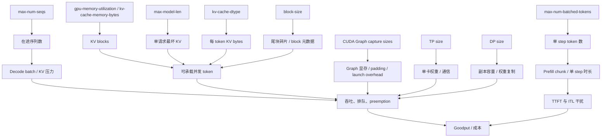

## 目录

- [1. 真实问题：参数不是独立旋钮](#1-真实问题参数不是独立旋钮)
- [2. 白话直觉：三份预算](#2-白话直觉三份预算)
- [3. 固定版本与指标定义](#3-固定版本与指标定义)
- [4. 参数因果图](#4-参数因果图)
- [5. 先算显存与 KV 容量](#5-先算显存与-kv-容量)
- [6. gpu-memory-utilization 与 kv-cache-memory-bytes](#6-gpu-memory-utilization-与-kv-cache-memory-bytes)
- [7. max-model-len：产品边界](#7-max-model-len产品边界)
- [8. max-num-seqs：在途序列上限](#8-max-num-seqs在途序列上限)
- [9. max-num-batched-tokens：每轮计算预算](#9-max-num-batched-tokens每轮计算预算)
- [10. block-size 与 prefix-match-unit](#10-block-size-与-prefix-match-unit)
- [11. KV dtype：容量换数值风险](#11-kv-dtype容量换数值风险)
- [12. compile 与 CUDA Graph](#12-compile-与-cuda-graph)
- [13. TP、PP 与 DP 的因果关系](#13-tppp-与-dp-的因果关系)
- [14. 基线工作负载设计](#14-基线工作负载设计)
- [15. 单变量实验矩阵](#15-单变量实验矩阵)
- [16. 二阶交互实验](#16-二阶交互实验)
- [17. 从结果到配置的决策方法](#17-从结果到配置的决策方法)
- [18. 失败模式与排障](#18-失败模式与排障)
- [19. trade-off](#19-trade-off)
- [20. 自检](#20-自检)
- [参考资料](#参考资料)

---

## 1. 真实问题：参数不是独立旋钮

“把 `max-num-seqs` 从 128 调到 256，吞吐会更高吗？”

不一定。它同时改变：

```text
可在途请求数
→ Decode batch 可能增大
→ KV 占用增大
→ CUDA Graph shape / padding 变化
→ preemption 风险增大
→ queue time 可能下降或反而因过载上升
```

如果 KV 已经紧张，提高并发可能让有效吞吐下降：

```text
更多请求接纳
→ 更多抢占
→ 重算更多 Prompt
→ GPU 做了更多用户看不到的 token
→ P99 延迟与 goodput 变差
```

调参的单位不是“参数”，而是**因果假设**。

## 2. 白话直觉：三份预算

### 显存预算

```text
权重
+ KV Cache
+ CUDA Graph / 编译 buffer
+ activation / workspace
+ 通信与 CUDA context
≤ 可用显存
```

### 调度预算

```text
本轮序列数 ≤ max_num_seqs
本轮 token 总数 ≤ max_num_batched_tokens
历史 KV block ≤ KV 容量
```

### 延迟预算

```text
TTFT SLO
ITL / TPOT SLO
E2E deadline
```

显存预算允许，不代表延迟预算允许；总吞吐提高，也不代表 goodput 提高。

## 3. 固定版本与指标定义

源码与默认值固定到 vLLM `v0.27.1`。

直接查看：

```text
vllm/config/cache.py
  CacheConfig

vllm/config/scheduler.py
  SchedulerConfig

vllm/config/compilation.py
  CompilationConfig

vllm/config/vllm.py
  VllmConfig 的最终解析与覆盖
```

v0.27.1 dataclass 级默认值包括：

```text
gpu_memory_utilization = 0.92
CacheConfig.DEFAULT_BLOCK_SIZE = 16
enable_prefix_caching = True
SchedulerConfig.DEFAULT_MAX_NUM_BATCHED_TOKENS = 2048
SchedulerConfig.DEFAULT_MAX_NUM_SEQS = 128
enable_chunked_prefill = True
```

但平台、模型、EngineArgs 和 post-init 可能覆盖。生产事实应以**启动日志中的 resolved config** 为准。

### 3.1 延迟

$$
TTFT=T_{\text{queue}}+T_{\text{prefill}}+T_{\text{first-sample}}+T_{\text{network}}
$$

$$
TPOT=\frac{T_{\text{e2e}}-TTFT}{N_{\text{output}}-1}
$$

ITL 是每个相邻流式 token 间隔，TPOT 是请求级平均，不能混用。

### 3.2 goodput

设 SLO：

```text
TTFT ≤ 800 ms
TPOT ≤ 50 ms
E2E ≤ 15 s
```

goodput：

$$
G=\frac{\#\{\text{成功且同时满足全部 SLO 的请求}\}}{T}
$$

系统可以有很高 tokens/s，却因 P99 超时而 goodput 很低。

## 4. 参数因果图



使用方法：每次改参数前，从节点沿箭头写出预期变化与反指标。

例如增大 `max-num-batched-tokens`：

```text
假设：长 Prefill 每轮 chunk 更大 → TTFT 下降
风险：step 变长 → Decode ITL P99 上升
反指标：ITL、preemption、GPU memory、吞吐
```

## 5. 先算显存与 KV 容量

### 5.1 权重

$$
M_{\text{weight}}
\approx N_{\text{param}}\times bytes_{\text{weight}}
$$

7B BF16：

$$
7\times10^9\times2
=14\times10^9\text{ bytes}
\approx13.0\text{ GiB}
$$

这里 GB 与 GiB 不同：

$$
14\text{ GB}/2^{30}\approx13.0\text{ GiB}
$$

实际还含未量化层、scale、embedding tie 方式等。

### 5.2 普通 GQA KV/token

$$
M_{\text{KV/token}}
=2\times L\times H_{kv}\times D_{head}\times S
$$

例：

```text
L=32
Hkv=8
Dhead=128
BF16 S=2 bytes
```

$$
2\times32\times8\times128\times2
=131072\text{ bytes}
=128\text{ KiB/token}
$$

8 GiB KV 可放理论 token：

$$
\frac{8\times2^{30}}{128\times2^{10}}
=65536\text{ tokens}
$$

若平均每个在途请求占 2,048 token：

$$
65536/2048=32\text{ requests}
$$

这还没扣除 block 尾部、lookahead、hybrid group、对齐和保留量。

### 5.3 为什么启动日志更可靠

v0.27.1 在 EngineCore 初始化中：

```text
profile available memory
→ get_kv_cache_configs()
→ generate_scheduler_kv_cache_config()
→ 计算 kv_cache_size_tokens / max_concurrency
→ initialize_from_config()
→ compile_or_warm_up_model()
```

混合 Attention、MLA、Mamba、滑窗模型不能用普通 GQA 公式直接当最终容量。

## 6. `gpu-memory-utilization` 与 `kv-cache-memory-bytes`

### 6.1 `gpu-memory-utilization`

v0.27.1 默认 0.92，含义是当前实例模型执行器的显存预算比例。不是：

```text
KV Cache 占总显存 92%
```

近似：

$$
M_{\text{executor-budget}}
=M_{\text{GPU}}\times u
$$

KV 是 profile 后的剩余：

$$
M_{\text{KV}}
\approx M_{\text{budget}}
-M_{\text{weight}}
-M_{\text{peak-runtime}}
-M_{\text{graph}}
$$

调低 `u` 通常减少 KV 容量。权重本身装不下时，它不会创造空间。

### 6.2 `kv-cache-memory-bytes`

v0.27.1 `CacheConfig` 支持显式 KV 字节预算。非空时忽略 `gpu_memory_utilization` 对 KV 大小的推导，适合：

- 多实例精确切分；
- A/B 实验固定 KV 容量；
- 避免不同 profile 使实验容量漂移。

代价是错误值更容易 OOM，且仍需给权重、Graph、workspace 留空间。

### 6.3 数字例子

80 GiB GPU，`u=0.92`：

$$
80\times0.92=73.6\text{ GiB}
$$

若权重 60 GiB、profile 峰值与 Graph 8 GiB：

$$
KV\approx73.6-60-8=5.6\text{ GiB}
$$

把 `u` 降到 0.85：

$$
68-60-8=0\text{ GiB}
$$

启动可能因 KV 容量不足失败，而不是更安全。

## 7. `max-model-len`：产品边界

约束：

$$
N_{\text{prompt}}+N_{\text{output}}
\le max\_model\_len
$$

它首先是 API 能力边界，其次才是调优参数。

若业务 P99 总长度 6K，产品承诺 8K，却按模型 RoPE 声明的 128K 直接上线：

- 单请求最坏 KV 容量巨大；
- 启动可行性和并发估算更保守；
- 极少数异常长请求可能占住大量 KV；
- SLO 与准入边界不清晰。

设置：

```bash
vllm serve MODEL --max-model-len 8192
```

并不能保证 8K×`max_num_seqs` 全部同时驻留；真实上限仍由 KV token 容量决定。

## 8. `max-num-seqs`：在途序列上限

它限制单轮可处理/持有的序列规模，不等于：

```text
HTTP 连接数
队列长度
每秒请求数
```

增大可能：

```text
减少 API/EngineCore 排队
增大 Decode batch
提高吞吐
增加 KV 占用
增加 persistent batch 与采样 metadata
扩大 Graph shape
提高 preemption 风险
```

### 8.1 容量上界

理论 KV tokens 65,536，平均活跃长度 1,500：

$$
\lfloor65536/1500\rfloor=43
$$

把 `max_num_seqs` 设 128 不会让 128 个平均 1,500-token 请求健康驻留。它只允许 Scheduler 尝试更高并发，随后可能抢占。

### 8.2 什么时候降低

如果：

```text
kv usage 高
num_preemptions 持续增长
P99 ITL 恶化
吞吐不再上升
```

降低 `max_num_seqs` 可能通过减少重算提高 goodput。

## 9. `max-num-batched-tokens`：每轮计算预算

约束：

$$
\sum_i n_i\le B
$$

### 9.1 小 budget

长 Prefill 被切成更多轮：

```text
优点：单轮 GPU 占用较短，Decode ITL 更容易稳定
代价：更多调度、launch、输入准备，长 Prompt TTFT 可能变差
```

### 9.2 大 budget

```text
优点：Prefill chunk 更大，矩阵计算利用率可能更高
代价：单 step 更长，混合负载下 Decode 被阻塞更久
```

### 9.3 手算

`B=2048`，128 个 Decode 每个 1 token：

$$
B_{\text{prefill}}=2048-128=1920
$$

6,000-token Prompt 至少需：

$$
\lceil6000/1920\rceil=4\text{ rounds}
$$

`B=8192` 时可在一轮完成 Prompt，但该轮 Prefill 计算时间更长。TTFT 可能下降，其他请求 ITL 可能上升。

### 9.4 不等于实际 FLOPs

一个 Decode token 要读取长历史 KV；一个 Prefill token 可以享受更高矩阵并行度。相同 token 数的 wall time 不同。budget 是可组合近似，不是硬实时调度单位。

## 10. `block-size` 与 `prefix-match-unit`

v0.27.1 默认物理 block size 为 16 token，但 Attention backend 可能限制可选值。

### 10.1 尾部碎片

序列长度 37：

```text
B=16 → ceil(37/16)=3 blocks，48 slots，浪费 11
B=32 → ceil(37/32)=2 blocks，64 slots，浪费 27
```

对很多短序列，大 block 尾部浪费更明显。

### 10.2 元数据

8,192-token 序列：

```text
B=16 → 512 block IDs
B=32 → 256 block IDs
```

小 block 降低碎片，却增加 block table、hash、分配元数据。

### 10.3 `prefix-match-unit`

v0.27.1 引入更细的匹配边界概念：

```text
prefix_match_unit = hash_block_size
```

它可小于某些 hybrid 模型的物理 KV block，只控制哈希匹配粒度，不改变状态实际存储频率。所有 cache group 的 block size 必须可被它整除。

不要为了 cache hit 盲调物理 block。先确认 backend、hybrid group 与 hash 对齐支持。

## 11. KV dtype：容量换数值风险

BF16/FP16 每元素 2 bytes，FP8 约 1 byte。理论：

$$
M_{\text{KV,FP8}}\approx0.5M_{\text{KV,BF16}}
$$

前例 8 GiB 可容纳 65,536 BF16 KV tokens，FP8 理论约 131,072。

但实际还受：

```text
scale 与元数据
对齐
backend 支持
特定层跳过量化
模型默认 cache dtype
```

命令示例：

```bash
vllm serve MODEL --kv-cache-dtype fp8
```

评估必须包含任务级质量：

```text
长上下文检索正确率
代码执行通过率
数学答案准确率
多轮一致性
logprob 校准（如业务依赖）
```

几条聊天看不出 KV 量化在长上下文累积的误差。

## 12. compile 与 CUDA Graph

v0.27.1 默认 V1 compilation mode 3，CUDA Graph 通常解析为 `FULL_AND_PIECEWISE`，但最终会按 backend/模型降级。

参数链：

```text
max_num_seqs
→ 默认 max_cudagraph_capture_size（还受 spec query length、512 上限）
→ capture sizes 集合
→ startup time / graph memory / padding
→ steady-state launch overhead
```

### 12.1 eager 对照的正确解读

```bash
vllm serve MODEL --enforce-eager
```

v0.27.1 中它关闭 compilation 和 CUDA Graph。若性能变差，不能判断收益来自哪一个；若 OOM 消失，也不能判断是哪类 buffer。

进一步拆：

```bash
vllm serve MODEL \
  --compilation-config '{"cudagraph_mode":"NONE"}'
```

配置枚举的 JSON 表达以 `vllm serve --help` 和 v0.27.1 解析器为准。

### 12.2 capture size 手算

实际 batch token size 70，capture sizes 有 64、80：

```text
选择 80，padding 10
```

$$
padding\_ratio=10/80=12.5\%
$$

加入 72 capture 可减少 padding到 2.8%，但多一个 graph 占启动时间与显存。只有该 shape 高频出现才可能值得。

## 13. TP、PP 与 DP 的因果关系

### 13.1 Tensor Parallel

近似单卡权重：

$$
M_{\text{weight/card}}\approx
\frac{M_{\text{weight}}}{TP}
+M_{\text{unsharded}}
$$

每层引入 collective。NVLink/NVSwitch 与 PCIe 跨 NUMA 的结果不同。

TP 不是吞吐副本；同一请求跨卡协作。

### 13.2 Pipeline Parallel

不同层放不同 rank，减少单卡权重。代价是 pipeline bubble 和 stage 不均衡。

microbatch 不足时：

$$
utilization\approx
\frac{m}{m+p-1}
$$

`p=4` stages，`m=4` microbatches：

$$
4/(4+3)=57.1\%
$$

公式是简化直觉，V1 batch queue 与连续请求会改变实际稳态。

### 13.3 Data Parallel

DP 每副本一份权重和独立 KV，最适合请求级扩展。

若单副本 goodput 20 req/s，4 副本理论 80；实际受负载均衡、前缀局部性与到达偏斜影响。

随机分流可能把同一前缀打散到四个 cache，使每副本命中率下降。DP 路由策略也是性能参数。

## 14. 基线工作负载设计

至少四类：

```text
S：128 in / 128 out，交互短请求
L：4096 in / 128 out，长 Prompt
D：128 in / 1024 out，长 Decode
M：按生产比例混合 S/L/D
```

再分三种到达：

```text
closed-loop：固定 max concurrency
Poisson：固定 request rate，burstiness=1
burst：request-rate=inf 或低 burstiness
```

Prefix workload 另分：

```text
cold：无缓存
warm：稳定共享前缀
churn：working set 大于 cache
```

一个 random 1024/128 benchmark 不能代表所有业务。

## 15. 单变量实验矩阵

### 15.1 固定环境

```bash
python -c "import vllm,torch; print(vllm.__version__,torch.__version__)"
nvidia-smi -q > gpu-env.txt
```

固定：

```text
模型 revision
dtype / quantization
GPU clocks / power limit
TP/PP/DP
Chat Template
seed
客户端机器与网络
```

### 15.2 服务配置 sweep

第一阶段只扫：

```text
max_num_seqs:          [16, 32, 64, 128]
max_num_batched_tokens:[512, 1024, 2048, 4096, 8192]
```

不能直接做全部 20 个点后只挑最快。先单变量：

```text
固定 token budget，扫 seqs
找到 preemption/吞吐拐点
固定 seqs，扫 token budget
找到 TTFT/ITL Pareto 前沿
```

### 15.3 压测命令

```bash
vllm bench serve \
  --backend openai-chat \
  --base-url http://127.0.0.1:8000 \
  --model Qwen/Qwen2.5-7B-Instruct \
  --dataset-name random \
  --random-input-len 1024 \
  --random-output-len 256 \
  --random-range-ratio 0.3 \
  --num-prompts 1000 \
  --request-rate 16 \
  --burstiness 1 \
  --max-concurrency 128 \
  --num-warmups 30 \
  --percentile-metrics ttft,tpot,itl,e2el \
  --metric-percentiles 50,95,99 \
  --goodput ttft:800 tpot:50 e2el:15000 \
  --save-result \
  --save-detailed \
  --metadata model_rev=COMMIT_SHA workload=M
```

确认 v0.27.1 `--backend` 名称与服务端 endpoint 匹配，以 `--help` 为准。

### 15.4 每点重复

每个点：

```text
预热
正式运行至少 3 次
随机化配置顺序，降低温度/后台噪声偏差
记录失败请求
保存实验前后 /metrics
```

报告中用中位数与波动范围，不要只保留最好的一次。

## 16. 二阶交互实验

单变量完成后，只对有机制依据的参数对做实验。

### 16.1 `max_num_seqs × KV capacity`

目的：判断并发提升是健康 batching 还是靠 preemption 硬撑。

```text
seqs: [32,64,128]
KV:   [4,8,12 GiB]（用显式 KV bytes，若环境支持）
```

观察：

```text
tokens/s
goodput
num_preemptions / request
KV usage P99
queue time P99
```

### 16.2 `max_num_batched_tokens × 长 Prompt 比例`

```text
budget: [1024,2048,4096,8192]
长 Prompt 比例: [0%,10%,50%]
```

检验“大 budget 降 TTFT、小 budget 保 ITL”的负载依赖。

### 16.3 `capture sizes × batch shape`

```text
capture max: [64,128,256]
concurrency: [16,64,128]
```

观察 startup、graph memory、padding/fallback、TPOT。若 256 并发很少出现，捕获 256 可能只有成本。

### 16.4 `KV dtype × context length`

```text
dtype: [bf16, fp8]
context: [2K,8K,32K]
```

同时跑性能与质量。短 Prompt 质量通过不代表 32K 可接受。

## 17. 从结果到配置的决策方法

### 17.1 先筛硬约束

删除：

```text
启动失败
正确性失败
质量低于阈值
显存无安全余量
错误率超过阈值
```

### 17.2 再筛 SLO

例如：

```text
P99 TTFT ≤ 800 ms
P99 ITL ≤ 80 ms
goodput ≥ 15 req/s
```

### 17.3 在剩余点找成本前沿

配置 A 比 B：

```text
goodput 更高
P99 不差
GPU 数不多
质量相同
```

则 B 被 A 支配。只需保留 Pareto 前沿，而不是给每参数找“最大值”。

### 17.4 预留余量

压测稳定点不应等于生产极限。若 20 req/s 开始 queue 发散，生产准入可能设在 14–16 req/s，并用突发队列/扩容吸收变化。

## 18. 失败模式与排障

### 18.1 启动 OOM

按阶段：

```text
权重加载 OOM
profile OOM
KV 配置不成立
compile/Graph capture OOM
```

动作不同：

```text
权重 → 量化/TP/PP
KV → 长度、容量、dtype
Graph → capture sizes / eager 对照
临时峰值 → backend 与 workspace
```

### 18.2 运行时 preemption 高

不要先增大 `max_num_batched_tokens`。优先：

```text
限制 max_num_seqs
准入控制
缩短上下文
增加 KV capacity
验证 KV dtype
提升前缀局部性
```

### 18.3 TTFT 高但 GPU 不满

检查：

```text
request rate 是否不足
Tokenizer / API CPU
queue 与 DP 路由
Prefix Cache cold/churn
小 batch launch overhead
```

盲目扩大 budget 可能没有请求可填。

### 18.4 ITL P99 高但平均正常

检查按时间关联：

```text
长 Prefill 到达
Graph fallback shape
preemption
NCCL 抖动
GPU 降频
Python GC / CPU steal
```

平均值无法定位瞬时事件。

### 18.5 多卡吞吐不扩展

记录：

```bash
nvidia-smi topo -m
NCCL_DEBUG=INFO vllm serve ...
```

检查 TP 是否跨低带宽链路、请求是否足以填满、CPU 是否成为共享瓶颈。卡数增加并不保证单请求延迟线性下降。

### 18.6 benchmark 看似更快但输出变短

核对：

```text
成功请求数
实际 input/output token
finish_reason
ignore_eos
stop 条件
超时是否被丢弃
```

吞吐分母或输出长度不一致会制造虚假提升。

## 19. trade-off

### 更大 KV

提高容量并减少抢占；但挤压 Graph/workspace/同卡其他实例的余量。

### 更长上下文

扩大产品能力；但提高单请求最坏资源与尾延迟风险。

### 更多 sequences

提高 batching 机会；但加大 KV、采样 metadata 与抢占。

### 更多 batched tokens

提高 Prefill 效率；但可能伤害 Decode ITL。

### 更小 block

减少尾部碎片；但增加元数据和 backend 约束。

### FP8 KV

提高容量；但带来硬件兼容与质量验证成本。

### 更多 CUDA Graph shapes

减少 padding/fallback；但增加启动时间与显存。

### TP

分摊权重；但每层通信。

### DP

提高副本吞吐；但复制权重，并可能打散 Prefix Cache 局部性。

## 20. 自检

- [ ] 能画出参数到 KV、step time、queue 与 goodput 的因果链。
- [ ] 能区分显存、调度与延迟三份预算。
- [ ] 能用 GQA 参数手算 KV/token 和理论并发。
- [ ] 能解释 `gpu_memory_utilization` 为什么不是 KV 比例。
- [ ] 能说出显式 KV bytes 的实验价值与风险。
- [ ] 能说明 `max_model_len` 首先是产品边界。
- [ ] 能解释 HTTP 并发与 `max_num_seqs` 的区别。
- [ ] 能手算 Decode 占用后剩余 Prefill budget。
- [ ] 能解释 token budget 为什么不是 FLOPs budget。
- [ ] 能计算 block 尾部浪费与 block table 数量。
- [ ] 能区分物理 block size 与 prefix match unit。
- [ ] 能为 FP8 KV 同时设计性能和质量实验。
- [ ] 能区分 compilation 与 CUDA Graph 的效果。
- [ ] 能说出 TP、PP、DP 各自的资源与通信代价。
- [ ] 能设计 S/L/D/M 四类 workload。
- [ ] 能先做单变量，再做有机制依据的二阶交互。
- [ ] 能用 goodput 与 Pareto 前沿选配置，而不是只看 tokens/s。
- [ ] 能按 OOM 阶段选择不同修复。

## 参考资料

- [vLLM v0.27.1 CacheConfig](https://github.com/vllm-project/vllm/blob/v0.27.1/vllm/config/cache.py)
- [vLLM v0.27.1 SchedulerConfig](https://github.com/vllm-project/vllm/blob/v0.27.1/vllm/config/scheduler.py)
- [vLLM v0.27.1 CompilationConfig](https://github.com/vllm-project/vllm/blob/v0.27.1/vllm/config/compilation.py)
- [Engine Arguments](https://docs.vllm.ai/en/stable/configuration/engine_args.html)
- [Optimization and Tuning](https://docs.vllm.ai/en/stable/configuration/optimization.html)
- [Conserving Memory](https://docs.vllm.ai/en/stable/configuration/conserving_memory.html)
- [Benchmark CLI](https://docs.vllm.ai/en/stable/benchmarking/cli.html)
- [Metrics](https://docs.vllm.ai/en/stable/design/metrics.html)
- [Parallelism and Scaling](https://docs.vllm.ai/en/stable/serving/parallelism_scaling.html)
