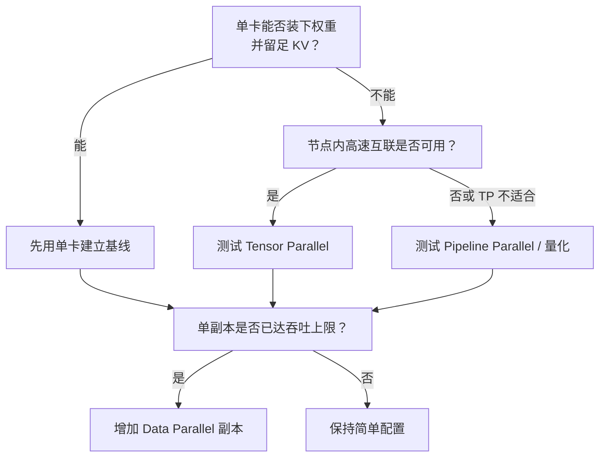

## 📑 目录
- [1. 调参前先定义问题](#1-调参前先定义问题)
- [2. 四个必须同时看的指标](#2-四个必须同时看的指标)
- [3. 先算显存账](#3-先算显存账)
- [4. gpu-memory-utilization](#4-gpu-memory-utilization)
- [5. max-model-len](#5-max-model-len)
- [6. max-num-seqs](#6-max-num-seqs)
- [7. max-num-batched-tokens](#7-max-num-batched-tokens)
- [8. block-size 与 Prefix Cache](#8-block-size-与-prefix-cache)
- [9. KV Cache 精度与量化](#9-kv-cache-精度与量化)
- [10. 并行参数怎么选](#10-并行参数怎么选)
- [11. CUDA Graph 与 eager](#11-cuda-graph-与-eager)
- [12. 一套可复现调参流程](#12-一套可复现调参流程)
- [13. 常见症状到参数的映射](#13-常见症状到参数的映射)
- [总结](#-总结)
- [自检清单](#-自检清单)
- [参考资料](#-参考资料)
---
## 1. 调参前先定义问题
“把 vLLM 调快一点”不是可执行目标。 它类似于“把高速公路变好一点”：
- 是要单车更快？
- 是要每小时通过更多车？
- 是要救护车不被货车挡住？
- 还是要同样车流少占一条车道？
推理服务至少有四种不同目标：
1. 降低首 token 延迟
2. 降低连续输出卡顿
3. 提高单位时间 token 吞吐
4. 在显存内支持更长上下文或更多并发
这些目标会冲突。 例如增大 batch 往往提高吞吐，却可能让单请求排队更久。 因此每次实验只回答一个问题：
> 在固定模型、硬件和流量分布下，参数 X 对指标 Y 有什么影响？
## 2. 四个必须同时看的指标
### 2.1 TTFT
Time To First Token：从发出请求到收到第一个流式输出。 近似拆分为：
$$
TTFT=T_{\text{queue}}+T_{\text{prefill}}+T_{\text{first-decode}}+T_{\text{network}}
$$
长 Prompt、排队和 Prefix Cache 命中都会明显影响它。
### 2.2 ITL
Inter-Token Latency：连续两个流式输出之间的间隔。 用户感受到的“打字是否顺滑”更接近 ITL。
### 2.3 TPOT
Time Per Output Token：对单请求而言，排除第一个 token 后的平均输出 token 时间。 官方 benchmark 的定义是：
$$
TPOT=\frac{T_{\text{E2E}}-TTFT}{N_{\text{output}}-1}
$$
ITL 是每个间隔的分布，TPOT 是请求级平均，二者不要混用。
### 2.4 吞吐与 goodput
吞吐可以按请求或 token 计算：
$$
Q_{\text{token}}=\frac{N_{\text{input}}+N_{\text{output}}}{T}
$$
但“处理很多超时请求”没有业务价值。 Goodput 只统计满足 SLO 的请求，更适合容量决策。 调参至少记录 P50、P95、P99，而不是只记录平均值。
## 3. 先算显存账
显存大致分成：

```text
模型权重
+ KV Cache
+ CUDA Graph / 编译产物
+ 激活与临时 workspace
+ 通信 buffer
+ 框架和 CUDA 上下文
```

### 3.1 权重大小粗算
$$
M_{\text{weight}}\approx
N_{\text{param}}\times
\frac{b_{\text{weight}}}{8}
$$
7B 模型使用 BF16：
$$
7\times10^9\times2\text{ bytes}\approx14\text{ GB}
$$
这是十进制粗算，不含量化元数据、未量化层和运行时开销。
### 3.2 KV Cache 每 token 粗算
对常见 Attention 模型：
$$
M_{\text{KV/token}}
=2\times L\times H_{\text{kv}}\times D_{\text{head}}\times S
$$
其中：
- 2 表示 Key 和 Value
- $L$ 是层数
- $H_{\text{kv}}$ 是 KV head 数
- $D_{\text{head}}$ 是每个 head 维度
- $S$ 是每元素字节数
假设：
- 28 层
- 4 个 KV heads
- head dimension = 128
- BF16，每元素 2 bytes
则：
$$
2\times28\times4\times128\times2
=57,344\text{ bytes/token}
$$
约为 56 KiB/token。 单个 32,768-token 序列理论 KV 为：
$$
56\text{ KiB}\times32,768\approx1.75\text{ GiB}
$$
这解释了为什么长上下文并发很快耗尽 KV Cache。 混合 Attention、MLA、滑动窗口和缓存对齐会改变实际结果。 最终容量以启动日志中的 KV Cache token/block 数和真实指标为准。
## 4. `gpu-memory-utilization`
### 4.1 它到底控制什么
`--gpu-memory-utilization` 是当前 vLLM 实例的模型执行器显存预算比例。
v0.27.1 默认值是 0.92。 它不是“只给 KV Cache 的比例”，也不会自动感知同卡其他进程并替它们留空间。 两实例共卡时，必须主动划分预算。
### 4.2 调高与调低
调高：
- 可能得到更多 KV Cache block
- 可承载更多并发 token
- 但留给其他进程和不可预期峰值的余量更少
调低：
- 减少当前实例预留
- 更容易与其他进程共存
- 但 KV 容量下降，可能更早抢占或拒绝配置
真实命令：

```bash
vllm serve Qwen/Qwen2.5-7B-Instruct \
  --gpu-memory-utilization 0.88
```

不要直接把 0.99 当作生产答案。 驱动、监控 agent、桌面进程和通信库都可能使用显存。
## 5. `max-model-len`
`--max-model-len` 限制模型可接受的最大序列长度。
总长度通常包括：
$$
N_{\text{prompt}}+N_{\text{generated}}
\le N_{\text{max-model-len}}
$$
如果业务最长只需要 8K，却按模型声明的 128K 部署，系统可能为极端长度保留能力并限制可行配置。 明确缩短上限能：
- 拒绝不符合产品约束的超长请求
- 减少最坏情况下的 KV 压力
- 让容量模型更可控

```bash
vllm serve Qwen/Qwen2.5-7B-Instruct \
  --max-model-len 8192
```

trade-off 是业务无法再发送超过该总长度的请求。 缩短它不是无损性能开关，而是产品能力取舍。
## 6. `max-num-seqs`
`--max-num-seqs` 限制一个迭代中可调度的最大序列数。
它更像“餐厅同时开放多少张桌子”。 调高可能：
- 增加 Decode 并发和峰值吞吐
- 增加 KV Cache 占用
- 增加 batch 管理和 CUDA Graph shape 压力
调低可能：
- 降低显存和运行时峰值
- 改善轻载下的可预测性
- 但高并发时排队更长

```bash
vllm serve Qwen/Qwen2.5-7B-Instruct \
  --max-num-seqs 64
```

不要把在线连接数与 `max-num-seqs` 画等号。 连接可以在 API 层排队，当前调度序列数只是引擎内一层限制。
## 7. `max-num-batched-tokens`
这是 V1 调度中最关键的旋钮之一。 它限制一个 step 调度的 token 总量：
$$
\sum_i n_i\le
\text{max-num-batched-tokens}
$$
### 7.1 小预算
更容易优先让 Decode 请求快速轮转。 官方调优文档给出的方向是：较小值可能带来更好的 ITL。 代价是长 Prefill 被切成更多轮，调度和 Kernel 启动次数增加。
### 7.2 大预算
单轮可处理更多 Prefill token。 可能改善 Prefill 效率和 TTFT，尤其是有足够算力时。 代价是大块 Prefill 可能占据更长的 GPU 时间，影响 Decode 的 ITL。

```bash
vllm serve Qwen/Qwen2.5-7B-Instruct \
  --max-num-batched-tokens 8192
```

官方文档建议小模型配大 GPU、目标为吞吐时测试大于 8192 的值。 这是实验起点，不是跨模型保证。
### 7.3 手算
预算为 2,048，当前有 128 个 Decode 请求，每个需要 1 token。 剩余 Prefill 预算：
$$
2048-128=1920
$$
一个 6,000-token Prompt 最多在本轮处理 1,920 token。 把预算提高到 8,192 后，它可能一次放入更多 Prompt token，但本轮执行也更重。
## 8. `block-size` 与 Prefix Cache
v0.27.1 `CacheConfig.DEFAULT_BLOCK_SIZE` 为 16 token。 不同 Attention backend 支持的 block size 集合不同。 不要在未检查兼容矩阵时随意指定。

```bash
vllm serve Qwen/Qwen2.5-7B-Instruct \
  --block-size 16
```

较小 block：
- 尾部内部碎片可能更少
- Prefix Cache 匹配边界更细
- block 元数据和映射数量更多
较大 block：
- 元数据更少
- 可能匹配特定 Kernel 的高效路径
- 短序列尾部浪费可能更明显
对请求长度 $T$、block size $B$，最简单的 block 数为：
$$
N_{\text{block}}=\left\lceil\frac{T}{B}\right\rceil
$$
尾部浪费 token 数：
$$
W=N_{\text{block}}\times B-T
$$
若 $T=37,B=16$，则需要 3 个 block，尾部最多浪费 11 个 slot。
## 9. KV Cache 精度与量化
`--kv-cache-dtype` 可在硬件和模型支持时选择 FP8 等格式。
直觉上，从 BF16 的 2 bytes 降到 FP8 的 1 byte，理论 KV 元素存储约减半。 但实际收益还受 scale、对齐、后端和模型结构影响。

```bash
vllm serve MODEL_PATH \
  --kv-cache-dtype fp8
```

trade-off：
- 容量增加
- 带宽压力可能降低
- 数值误差可能影响质量
- 并非每个平台、模型和 backend 都支持相同格式
上线前必须做任务级质量评测，不能只看困惑度或几条聊天样例。 权重量化与 KV Cache 量化是两个不同决策。 权重能装下，不代表长上下文 KV 一定装得下。
## 10. 并行参数怎么选
### 10.1 Tensor Parallel

```bash
vllm serve MODEL_PATH --tensor-parallel-size 2
```

收益：把单层权重和计算分到多卡，释放每卡部分权重显存。 代价：每层需要卡间通信，弱互联环境可能得不偿失。
### 10.2 Pipeline Parallel

```bash
vllm serve MODEL_PATH --pipeline-parallel-size 2
```

收益：按层切分，适合某些不便做 TP 的模型或拓扑。 代价：存在流水线气泡，负载与层划分影响明显。
### 10.3 Data Parallel
数据并行运行多个副本处理不同请求。 收益：请求间扩展直接，副本故障隔离更自然。 代价：每个副本通常需要自己的权重与 KV 空间。 决策顺序：



## 11. CUDA Graph 与 eager
vLLM 默认会使用编译和 CUDA Graph 等优化路径。 这些路径通常提高执行效率，但会占用额外显存，并增加首次 warmup 成本。
`--enforce-eager` 常用于调试：

```bash
vllm serve MODEL_PATH --enforce-eager
```

它不应默认作为生产优化。 如果 eager 能运行而默认模式 OOM，应进一步检查 CUDA Graph capture size 和 compilation config。 官方 Conserving Memory 文档支持通过 `compilation_config` 缩小 capture sizes。
## 12. 一套可复现调参流程
### 12.1 固定环境
记录：

```bash
python -c "import vllm, torch; print(vllm.__version__, torch.__version__)"
nvidia-smi
```

同时固定模型 revision、量化格式、GPU 时钟策略和并行拓扑。
### 12.2 固定工作负载
最可靠的是脱敏后的生产长度分布。 没有生产数据时，可先使用官方 benchmark 的随机长度参数建立机械基线：

```bash
pip install "vllm[bench]"

vllm bench serve \
  --model Qwen/Qwen2.5-7B-Instruct \
  --host 127.0.0.1 \
  --port 8000 \
  --random-input-len 1024 \
  --random-output-len 256 \
  --num-prompts 200
```

参数可用性以 v0.27.1 `vllm bench serve --help` 为准。 随机 token 负载不能代表真实 Prefix Cache、Chat Template 或输出停止分布。
### 12.3 一次只改一个变量
推荐顺序：
1. 先确定 `max-model-len`
2. 再留出稳定的 `gpu-memory-utilization`
3. 调 `max-num-seqs`
4. 扫描 `max-num-batched-tokens`
5. 最后评估 KV 精度、量化和并行
每个点至少经过 warmup，并重复多轮。 不要把模型加载和 CUDA Graph 捕获时间混入稳态请求指标。
### 12.4 保存完整结果
每轮至少保存：
- 启动命令与环境版本
- 成功/失败请求数
- 输入与输出 token 数
- 请求和 token throughput
- TTFT、TPOT、ITL 的分位数
- Prefix Cache 命中与 preemption 指标
- GPU 显存、利用率、功耗
不保存负载参数的 benchmark 数字无法比较，也不应写入容量结论。
## 13. 常见症状到参数的映射
### 启动 OOM
按顺序检查：
1. 模型权重是否单卡可放下
2. 降低 `gpu-memory-utilization`
3. 限制 `max-model-len`
4. 缩小 CUDA Graph capture 范围或调试时 eager
5. 评估量化或并行
### 运行时频繁 preemption
可能动作：
- 降低 `max-num-seqs`
- 缩短业务允许的上下文
- 增加 KV 可用显存
- 使用受验证的 KV Cache 低精度
- 做请求准入与限流
### ITL 很差

检查长 Prefill 是否干扰 Decode。 可测试更小的 `max-num-batched-tokens`，但同时观察 TTFT 和吞吐。

### TTFT 很差

拆分排队和 Prefill 时间。 可测试更大 token budget、提高 Prefix Cache 命中或扩副本。 不要在过载状态下只靠增大 batch 掩盖排队。

### 吞吐不随多卡增长

检查：

- GPU 拓扑和 NCCL
- TP 通信占比
- CPU 是否喂不满
- 请求是否太少
- 模型是否已受内存带宽限制

## 📝 总结

vLLM 调优不是寻找一组神奇参数，而是管理三份预算：

1. 显存预算：权重、KV、Graph 与 workspace 如何分配
2. 调度预算：每步多少 token、多少序列
3. 延迟预算：TTFT、ITL 和吞吐如何取舍

先算账、再建立基线、一次改一个变量，才能得到可复用结论。

## 🎯 自检清单

- [ ] 能区分 TTFT、ITL、TPOT 和吞吐
- [ ] 能用模型结构粗算每 token KV Cache
- [ ] 知道 `gpu-memory-utilization` 不只是 KV Cache 比例
- [ ] 能说明缩短 `max-model-len` 换掉了什么产品能力
- [ ] 能解释 `max-num-seqs` 与在线连接数的区别
- [ ] 能手算 token budget 的剩余量
- [ ] 知道 block size 必须匹配 Attention backend
- [ ] 能区分权重量化与 KV Cache 量化
- [ ] 能说明 TP 的显存收益与通信代价
- [ ] 会用同一负载做单变量、可重复压测
- [ ] 不会引用缺少硬件和长度分布的 benchmark 数字

## 📚 参考资料

- [vLLM Engine Arguments](https://docs.vllm.ai/en/latest/configuration/engine_args/)
- [vLLM Optimization and Tuning](https://docs.vllm.ai/en/latest/configuration/optimization/)
- [vLLM Conserving Memory](https://docs.vllm.ai/en/latest/configuration/conserving_memory/)
- [vLLM Benchmark CLI](https://docs.vllm.ai/en/latest/benchmarking/cli/)
- [vLLM Metrics](https://docs.vllm.ai/en/latest/design/metrics/)
- [vLLM Attention Backends](https://docs.vllm.ai/en/latest/design/attention_backends/)
- [vLLM Parallelism and Scaling](https://docs.vllm.ai/en/latest/serving/parallelism_scaling/)
- [vLLM v0.27.1 Release](https://github.com/vllm-project/vllm/releases/tag/v0.27.1)
