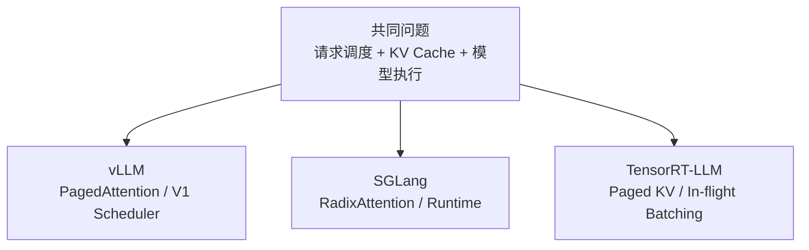
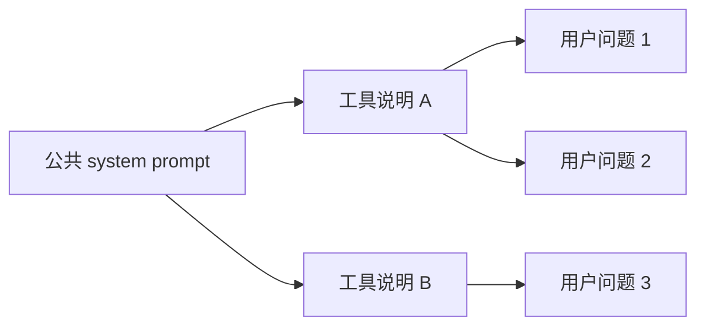
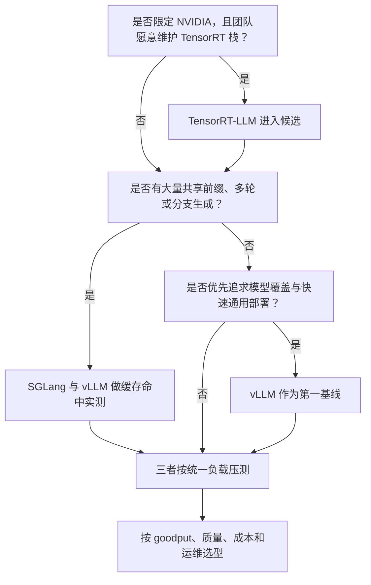

## 📑 目录
- [1. 先纠正一个误区：没有永远最快的框架](#1-先纠正一个误区没有永远最快的框架)
- [2. 三个框架分别像什么](#2-三个框架分别像什么)
- [3. 共同能力：差异没有名字看起来那么大](#3-共同能力差异没有名字看起来那么大)
- [4. vLLM：通用能力与生态优先](#4-vllm通用能力与生态优先)
- [5. SGLang：缓存与复杂生成工作流](#5-sglang缓存与复杂生成工作流)
- [6. TensorRT-LLM：NVIDIA 全栈优化](#6-tensorrt-llmnvidia-全栈优化)
- [7. 统一维度对比](#7-统一维度对比)
- [8. 三个典型场景手算](#8-三个典型场景手算)
- [9. 公平 benchmark 怎么做](#9-公平-benchmark-怎么做)
- [10. 迁移与回退成本](#10-迁移与回退成本)
- [11. 选型决策树](#11-选型决策树)
- [总结](#-总结)
- [自检清单](#-自检清单)
- [参考资料](#-参考资料)
---
## 1. 先纠正一个误区：没有永远最快的框架
团队选推理框架时，最常问：
> vLLM、SGLang、TensorRT-LLM，谁最快？
这个问题缺少至少六个条件：
- 哪个模型和 revision
- 哪种精度或量化
- 哪款 GPU、多少张、什么互联
- Prompt/Output 长度分布
- 并发和请求到达方式
- 目标是 TTFT、ITL、吞吐还是成本
同一框架在 1 个短请求和 1,000 个长请求下，瓶颈可能完全不同。 正确问题应该是：
> 在我们的模型、硬件、流量和 SLO 下，哪个框架的有效吞吐最高，运维成本可接受？
本文不引用跨版本 benchmark 数字。 所有性能结论都应在同一台机器上用同一负载复测。
## 2. 三个框架分别像什么
先用交通工具类比：
### vLLM：通用型高铁
路线多、接口熟悉、上手快。 大多数主流模型和部署需求都能找到现成路径。 适合先建立可靠基线，再逐步调优。
### SGLang：擅长路线复用的智能车队
不仅运送单次请求，还特别关注多轮、共享前缀和复杂生成程序中的缓存复用。 RadixAttention 是它最有辨识度的设计之一。
### TensorRT-LLM：NVIDIA 赛道工程车
与 NVIDIA CUDA、TensorRT 和专用 Kernel 结合紧密。 硬件和模型路径匹配时，可做更深入的全栈优化。 代价通常是构建、配置和版本矩阵更需要专业投入。 类比只用于建立第一印象，不能替代能力验证。
## 3. 共同能力：差异没有名字看起来那么大
不要把三个框架误解成三种完全不同的技术。 截至 2026-08，它们都在不同程度上具备：
- 动态或 in-flight/continuous batching
- 分页式 KV Cache
- Chunked Prefill / Context
- 多 GPU 并行
- 量化与优化 Kernel
- OpenAI 兼容服务入口
- Prefix Cache 或 KV 复用能力
- 流式输出



真正差异更多来自：
1. 默认策略与抽象方式
2. 模型和硬件覆盖速度
3. Kernel 与编译栈
4. 分布式和缓存扩展方案
5. API 完整度与运维工具
6. 团队能够掌控的复杂度
## 4. vLLM：通用能力与生态优先
### 4.1 适合什么场景
- 需要快速部署 Hugging Face 主流模型
- 希望通过 OpenAI 兼容 API 降低业务迁移成本
- NVIDIA、AMD、CPU、TPU 等环境需要较统一的上层体验
- 需要结构化输出、工具调用、推理解析器、多模态或多种并行方式
- 团队想先得到一个可维护的高性能基线
启动命令：

```bash
vllm serve Qwen/Qwen2.5-7B-Instruct \
  --host 0.0.0.0 \
  --port 8000
```

### 4.2 关键机制
vLLM 的代表性设计包括：
- PagedAttention 与分页 KV Cache
- V1 统一 token 调度
- 默认 Automatic Prefix Caching
- Worker / ModelRunner 执行抽象
- 丰富的 Attention backend 和硬件插件
v0.27.1 也支持 JSON、regex、choice、grammar 等结构化输出形式。 因此不能再简单说“结构化输出只有 SGLang 有”。
### 4.3 trade-off
覆盖面广意味着内部组合很多。 某个新模型“能启动”不等于其所有量化、并行和结构化输出组合都已成熟。 版本更新快，默认值和内部 API 会变化。 生产环境必须固定版本与模型 revision。
## 5. SGLang：缓存与复杂生成工作流
### 5.1 RadixAttention 先白话
普通 Prefix Cache 像按固定页保存公共书本开头。 RadixAttention 更像把出现过的文本路径组织成一棵前缀树：



树上的公共路径可复用 KV Cache。 早期 SGLang 论文还把缓存感知调度和 LRU eviction 与这棵树结合。 这对以下负载有自然吸引力：
- 多轮对话
- Few-shot 示例复用
- Tree-of-Thought 或分支生成
- 多 Agent 共享工具说明
- 同一文档上的重复问答
### 5.2 不止 RadixAttention
当前 SGLang 官方文档还覆盖：
- OpenAI 兼容 API
- 结构化输出与 grammar backend
- LoRA
- PD Disaggregation
- HiCache 分层 KV Cache
- 多硬件平台与多种并行
启动命令：

```bash
python -m sglang.launch_server \
  --model-path Qwen/Qwen2.5-7B-Instruct \
  --host 0.0.0.0 \
  --port 30000
```

### 5.3 trade-off
如果工作负载几乎没有共享前缀，缓存树优势可能无法充分体现。 复杂 PD 分离和分层缓存能扩展能力，也会引入网络、存储和一致性运维成本。 模型、硬件和功能组合仍要逐项核对官方支持。

本节只负责建立选型坐标系。要从安装一路学到 RadixAttention、重叠调度、结构化生成和生产部署，请继续阅读 [第 12 章：深入 SGLang](/AIInfraGuide/inference/模块四-推理优化/第12章-深入sglang/第12章-深入sglang)。

## 6. TensorRT-LLM：NVIDIA 全栈优化
### 6.1 它不是“只有静态 batch”
TensorRT-LLM 支持 in-flight batching。 它允许 context 阶段和 generation 阶段的序列进入同一执行迭代。 Paged KV Cache 和 context chunking 也用于改善调度与长上下文处理。 因此“vLLM 有 continuous batching，TensorRT-LLM 没有”是过时结论。
### 6.2 适合什么场景
- 基础设施明确锁定 NVIDIA GPU
- 有专人维护 CUDA/TensorRT 版本矩阵
- 核心模型集合相对稳定
- 愿意为特定模型和硬件做构建与深度调优
- 需要 NVIDIA 官方部署配方或与其软件栈深度集成
当前官方 Quick Start 提供 `trtllm-serve`：

```bash
trtllm-serve "TinyLlama/TinyLlama-1.1B-Chat-v1.0" \
  --host 0.0.0.0 \
  --port 8000
```

它可从模型名、Hugging Face checkpoint 或 TensorRT engine 启动，具体路径取决于模型支持。
### 6.3 trade-off
优势：
- NVIDIA 全栈 Kernel 与精度支持
- 构建期和运行期优化空间深
- 官方为部分热门模型提供部署 recipe
成本：
- 基本限定在 NVIDIA 生态
- TensorRT、CUDA、驱动和模型支持矩阵要严格匹配
- 自定义模型和新架构的接入成本可能更高
- engine 构建与部署工件管理增加流程复杂度
## 7. 统一维度对比
下面是选型起点，不是性能排名：

| 维度 | vLLM | SGLang | TensorRT-LLM |
|------|------|--------|---------------|
| 首次上手 | Python/CLI 直接，通常较低 | Python/CLI 直接，通常较低 | 容器与版本矩阵更重要 |
| 代表性抽象 | PagedAttention、V1 Scheduler | RadixAttention、生成 Runtime | TensorRT Engine、IFB |
| Prefix/KV 复用 | Block hash APC、外部 KV connector | Radix tree、HiCache | Paged KV、reuse 能力按配置/版本 |
| 结构化输出 | JSON/regex/grammar 等 | grammar backend 与生成控制 | 需按当前 API/模型路径核对 |
| 硬件广度 | 多类加速器 | 多类加速器 | 重点是 NVIDIA GPU |
| NVIDIA 深度 | 很高，支持多 backend | 很高，结合多种 Kernel | NVIDIA 官方全栈最深 |
| 新模型节奏 | 社区活跃、覆盖广 | 社区活跃，前沿模型快 | 依赖 NVIDIA 支持与 recipe |
| 分布式高级能力 | TP/PP/DP/EP/CP、P/D | TP/PP/DP/EP、PD、HiCache | TP/PP/EP、disaggregated serving |
| 运维复杂度 | 中 | 中；高级缓存/PD 后上升 | 中到高 |
| 适合作为通用基线 | 是 | 是 | NVIDIA 固定栈下是 |

表中“支持”不代表任意组合均支持。 例如某模型支持 TP，不代表它的特定量化格式也支持相同 TP 路径。 必须检查目标版本的 feature matrix。
## 8. 三个典型场景手算
### 8.1 场景 A：普通 Chat API
需求权重：

- 快速上线：40%
- 模型覆盖：30%
- 极限性能：20%
- 运维简单：10%

可以用加权分数做讨论工具：

$$
Score(f)=\sum_k w_k s_{f,k}
$$

假设团队自己的验证评分如下（1～5，仅为教学示例）：

```text
vLLM:     5, 5, 4, 4
SGLang:   4, 4, 4, 4
TRT-LLM:  3, 3, 5, 2
```

vLLM 教学分数：

$$
0.4\times5+0.3\times5+0.2\times4+0.1\times4=4.7
$$

注意：分数必须由团队实测填写，不能把这组示例当结论。

### 8.2 场景 B：多 Agent 共享长前缀

若 80% 请求共享 8K 工具说明，缓存命中价值很高。 应重点对比：

- 首次冷请求 TTFT
- 热前缀 TTFT
- Prefix Cache 命中 token
- 缓存淘汰后的尾延迟
- 多轮分支是否继续复用

SGLang RadixAttention 值得优先进入候选。 但 vLLM APC 也必须实测，不能从功能名字直接宣布胜负。

### 8.3 场景 C：固定 NVIDIA 集群和稳定模型

若模型半年不变、硬件全是同代 NVIDIA GPU，且团队熟悉 TensorRT： TensorRT-LLM 的深度优化投入更可能被摊薄。 此时重点对比：

- engine 构建时间和工件大小
- 升级驱动/CUDA 的回归成本
- 目标并发下的 goodput
- 精度与量化质量
- 故障恢复和扩缩容时间

即使吞吐更高，如果每次模型更新需要很长验证周期，整体交付速度也可能更低。

## 9. 公平 benchmark 怎么做

### 9.1 固定不变量

三个框架必须使用：

- 同一模型 revision
- 同一精度/量化方案
- 同一 GPU、功耗与时钟条件
- 同一 TP/PP/DP 资源数
- 同一 Chat Template
- 同一输入输出 token 分布
- 同一并发或 request rate
- 同一停止条件

### 9.2 先验证正确性

性能测试前先做：

1. 固定 greedy 解码参数
2. 比对 tokenization 后输入长度
3. 检查输出是否满足停止条件
4. 对任务集做质量回归
5. 确认失败请求没有被吞吐统计忽略

不同 Kernel 和动态 batch 可能产生浮点差异。 不要要求所有文本逐字符相同，但要设置可解释的质量标准。

### 9.3 冷热分开测

Prefix Cache 场景至少分：

- cold：缓存为空
- warm：前缀已存在
- churn：缓存容量不足、持续淘汰

只测 warm cache 会夸大真实线上收益。

### 9.4 不混用 benchmark 客户端

最好使用同一个外部压测器请求三个 OpenAI 兼容端点。 这样客户端序列化、到达率和指标定义一致。 每个框架自己的 benchmark 工具适合调内部参数，但不宜直接横向拼表。

## 10. 迁移与回退成本

OpenAI 兼容 API 降低了迁移成本，但没有消除差异。 仍需检查：

- `model` 名称与 served model name
- Chat Template
- tool call / reasoning parser
- structured outputs 请求字段
- logprobs 语义
- usage token 统计
- 错误码与取消行为

建议业务层只依赖经过契约测试的 API 子集。

```python
# 可运行的客户端骨架：通过环境变量切换三种后端
import os
from openai import OpenAI

client = OpenAI(
    base_url=os.environ["LLM_BASE_URL"],
    api_key=os.getenv("LLM_API_KEY", "EMPTY"),
)

response = client.chat.completions.create(
    model=os.environ["LLM_MODEL"],
    messages=[{"role": "user", "content": "用一句话解释 KV Cache"}],
    temperature=0,
    max_tokens=64,
)
print(response.choices[0].message.content)
```

保留同模型的双后端发布能力，可以降低框架升级风险。

## 11. 选型决策树



一个务实顺序是：

1. 用最容易部署且功能完整的框架建立正确性基线
2. 用生产长度分布做统一 benchmark
3. 只有收益大于迁移和运维成本时才切换
4. 为关键模型保留回退路径

## 📝 总结

三个框架解决的是相同的底层问题，但优化重心不同：

- vLLM：通用模型、硬件和服务生态覆盖
- SGLang：前缀复用、复杂生成程序与缓存扩展
- TensorRT-LLM：NVIDIA 软件硬件栈的深度协同

选型不是给框架排总榜，而是把业务权重、真实负载和团队能力带进同一实验。

## 🎯 自检清单

- [ ] 不会脱离模型、硬件和负载追问“谁最快”
- [ ] 知道三个框架都支持动态 batching 和分页 KV 思路
- [ ] 能解释 vLLM V1 的通用定位
- [ ] 能用前缀树解释 RadixAttention
- [ ] 知道 TensorRT-LLM 支持 in-flight batching
- [ ] 不会把结构化输出说成某一家独有
- [ ] 能列出公平 benchmark 的固定变量
- [ ] 会分别测试 cold、warm 和 churn 缓存
- [ ] 能把运维和迁移成本纳入加权决策
- [ ] 会保留 OpenAI API 契约测试与回退路径

## 📚 参考资料

- [vLLM 官方文档](https://docs.vllm.ai/en/latest/)
- [vLLM Structured Outputs](https://docs.vllm.ai/en/latest/features/structured_outputs/)
- [vLLM Architecture Overview](https://docs.vllm.ai/en/latest/design/arch_overview/)
- [SGLang 官方文档](https://docs.sglang.ai/)
- [SGLang Server Arguments](https://docs.sglang.ai/advanced_features/server_arguments.html)
- [SGLang PD Disaggregation](https://docs.sglang.ai/advanced_features/pd_disaggregation.html)
- [SGLang 论文：Efficiently Programming Large Language Models using SGLang](https://arxiv.org/abs/2312.07104)
- [LMSYS：RadixAttention and SGLang](https://www.lmsys.org/blog/2024-01-17-sglang/)
- [TensorRT-LLM Quick Start](https://nvidia.github.io/TensorRT-LLM/quick-start-guide.html)
- [TensorRT-LLM Paged Attention and In-flight Batching](https://nvidia.github.io/TensorRT-LLM/features/paged-attention-ifb-scheduler.html)
- [TensorRT-LLM trtllm-serve](https://nvidia.github.io/TensorRT-LLM/commands/trtllm-serve/trtllm-serve.html)
