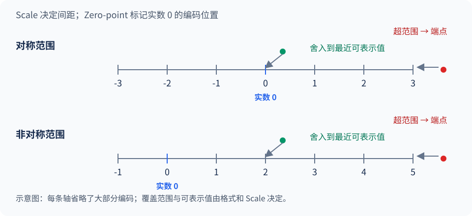

前面几章已经讲过推理的显存占用和计算流程。量化进一步改变数据的表示方式：**用更少的比特存储权重、激活或 KV Cache，并在硬件支持时使用低精度运算。** 这一节先看数值如何映射到低位宽编码，再介绍量化参数的共享方式，以及如何通过校准或训练控制误差。

<!-- more -->

## 📑 目录

- [1. 先分清量化的对象](#1-先分清量化的对象)
- [2. 数值映射、Scale 与 Zero-point](#2-数值映射scale-与-zero-point)
- [3. 张量维度与量化粒度](#3-张量维度与量化粒度)
- [4. 校准与量化参数](#4-校准与量化参数)
- [5. PTQ 与 QAT](#5-ptq-与-qat)
- [6. 动手观察离群值的影响](#6-动手观察离群值的影响)
- [总结](#-总结)
- [自我检验清单](#-自我检验清单)
- [参考资料](#-参考资料)

---

## 1. 先分清量化的对象

沿用第 1 章的显存账本，量化主要作用在三处：

| 对象 | 数据的特点 | 主要收益 |
|---|---|---|
| **权重（Weight）** | 训练完成后固定，可提前处理 | 缩小模型、减少权重读取量 |
| **激活（Activation）** | 随当前输入变化 | 为低精度矩阵乘法提供输入，减少部分中间数据开销 |
| **KV Cache** | 随请求和上下文增长 | 降低每个历史 Token 的缓存成本 |

**W4A16** 中的 W 是 Weight，A 是 Activation，后面的数字分别表示位宽：权重用 4-bit，激活用 16-bit。**W8A8** 则表示两者都用 8-bit。这里的 A 包括送入线性层的输入及网络中的中间激活；它与权重一起参与计算，也可以被量化。

W/A 记号只说明权重和激活的位宽，不能据此认为模型中的所有数据都采用同一种精度。KV Cache 的位宽也需要单独说明。

以 7B 个全部采用同一精度的参数为例，16-bit 的纯数据约为 14 GB，4-bit 约为 3.5 GB。这里使用十进制 GB；实际存储还要加上量化参数，模型运行时也需要额外显存。位宽降低能减少数据量，实际加速幅度仍取决于前文讨论的性能瓶颈。

## 2. 数值映射、Scale 与 Zero-point

### 2.1 量化与反量化

先回到计算机的数值表示：FP32、FP16 本身也只能表示有限个数。量化到更低位宽时，需要将源格式中的许多数值映射到更少的目标编码上。对均匀整数编码，可以先确定覆盖区间，再通过缩放、舍入和截断完成映射。常见的仿射量化写成：

$$
q=\operatorname{clip}\left(\operatorname{round}(x/s)+z,\ q_{\min},q_{\max}\right),
\qquad \hat{x}=s(q-z)
$$

这里 $s>0$ 是 Scale，决定相邻整数编码对应数值的间隔；$z$ 是实数 0 对应的整数零点。**量化（Quantization）得到低位宽编码 $q$；反量化（Dequantization）根据编码及量化参数得到近似值 $\hat{x}$。** 两个操作需要分别理解。资料中“模型量化”常泛指包含校准、编码、导出等步骤的完整工作流，但单个 Quantize 操作只完成前一个方向。

`clip` 把结果限制在编码范围内；具体舍入规则由实现决定，例如 ONNX 的整数 QuantizeLinear 使用最近偶数舍入。[算子定义](https://onnx.ai/onnx/operators/onnx__QuantizeLinear.html)

令 $s=0.1,z=0$，$x=0.26$ 会被记录为 $q=3$，读回来得到 $\hat{x}=0.3$。反量化恢复了计算使用的数值尺度，舍掉的 $0.04$ 已经无法从编码里找回。

这个例子看起来像保留一位小数，是因为恰好选了 $s=0.1$。若 $s=1/16$，同一个 $x=0.26$ 会编码为 4，再还原为 0.25。更一般地，一段输入区间会对应同一个编码：在 $s=0.1,z=0$ 时，0.251、0.26、0.349 都映射到 3。区间边界的归属取决于舍入规则。**舍入只是映射中的一步，位宽、格式和 Scale 共同决定哪些值能被表示。**



图中只画出少量可表示值。上面的数轴使用对称覆盖区间；下面的覆盖区间偏向正数，让更多编码对应数据实际出现的位置。绿色点映射到最近的可表示值，产生**舍入误差**；红色点超过范围后被压到端点，产生**截断误差**。这张图用于说明映射关系，没有画出 INT8 的完整编码空间。

### 2.2 对称量化

对正负比较均衡的数据，可以使用 $z=0$ 的对称量化。一种常见 INT8 约定使用 $[-127,127]$：

$$
s=\frac{\max |x|}{127},\qquad q=\operatorname{clip}(\operatorname{round}(x/s),-127,127)
$$

这样反量化只需要乘 Scale，矩阵乘法中的零点修正也更简单。INT8 存储本身能表示 $[-128,127]$；这里为了两端对称，主动不用 $-128$，不要把这项约定和数据类型的范围混在一起。

### 2.3 非对称量化

如果数据集中在 $[0,6]$，对称范围会把不少编码留给没有用到的负数。使用 UINT8 的 $[0,255]$ 时，可以令 $s=6/255,z=0$；此时零点虽然仍为 0，实数覆盖区间却是非对称的。

更一般地，先让待覆盖区间 $[a,b]$ 包含 0，再计算：

$$
s=\frac{b-a}{q_{\max}-q_{\min}},\qquad
z=\operatorname{clip}\left(\operatorname{round}\left(q_{\min}-\frac{a}{s}\right),q_{\min},q_{\max}\right)
$$

例如 $[a,b]=[-1,3]$，编码范围取 $[0,15]$，则 $s=4/15,z=4$。$x=1$ 对应 $q=8$，反量化为约 $1.067$。由于零点需要取整，两端的实际覆盖范围也会略有移动。

非对称量化能更贴合偏移分布，同时需要保存零点并处理零点修正。是否划算，要一起看误差和额外的计算成本。全零张量还需要单独处理，避免得到 $s=0$。

### 2.4 8-bit、4-bit 与 2-bit 的误差差异

$b$ 个比特最多有 $2^b$ 种位模式，8-bit、4-bit、2-bit 分别对应 256、16、4 种。具体格式还可能为特殊值保留编码。先用包含两个端点的均匀无符号量化覆盖同一个 $[0,1]$ 区间：

| 位宽 | 编码数 | 相邻重建值间隔 | 区间内最近舍入的最大绝对误差 |
|---|---|---|---|
| 8-bit | 256 | $1/255\approx0.00392$ | 约 0.00196 |
| 4-bit | 16 | $1/15\approx0.06667$ | 约 0.03333 |
| 2-bit | 4 | $1/3\approx0.33333$ | 约 0.16667 |

位宽减半时，可选编码数量按指数减少。在这个固定区间的例子中，4-bit 的间隔约为 8-bit 的 17 倍；这与“少保留几位十进制小数”是不同的表示约束。

编码越少，覆盖范围与舍入误差之间的取舍越明显：扩大范围会增大间隔，缩小范围又会让更多数据被截断。相同的参数选择在 8-bit 下可能误差很小，换成 4-bit 或 2-bit 后就未必适用。具体模型能否接受这些误差，需要实际评测。

## 3. 张量维度与量化粒度

### 3.1 先确认 Token 和通道对应哪个轴

设线性层为 $Y=XW$，其中 $X\in\mathbb{R}^{T\times C_{\text{in}}}$，$W\in\mathbb{R}^{C_{\text{in}}\times C_{\text{out}}}$。本章都沿用这个方向；PyTorch 的 `Linear.weight` 存储形状是它的转置。

这里的 $X$ 是进入某个线性层的**激活矩阵**，不直接存 Token ID。每个 Token 对应一条隐藏向量，一行放一条向量；一个通道就是向量中的一个特征维度。例如，3 个 Token、每个 Token 有 4 个输入通道时：

$$
X=\begin{bmatrix}
0.2 & 0.5 & 8.0 & -0.1\\
0.3 & 0.4 & 9.0 & -0.2\\
0.1 & 0.6 & 7.0 & -0.1
\end{bmatrix}
\quad\text{（行：Token，列：通道）}
$$

第一行是第一个 Token 的 4 维表示；第三列是在三个 Token 上观察到的同一个通道。若 $W$ 的形状为 $4\times2$，则 $Y=XW$ 为 $3\times2$：Token 数仍是 3，每个 Token 得到 2 个输出通道。元素计算为 $Y_{tk}=\sum_jX_{tj}W_{jk}$，求和沿输入通道 $j$ 进行。

真实输入还可能带 Batch 维，例如 $[B,T,C]$；这里把参与计算的 Token 合并成二维视图来解释量化轴。前文若采用列向量写成 $Wx$，只需注意转置约定，运算关系没有改变。

### 3.2 量化参数的共享范围

| 粒度 | Scale 的共享范围 | 直观影响 |
|---|---|---|
| **Per-tensor** | 整个张量一组 | 元数据少，但一个大值就可能增大整个张量的量化步长 |
| **Per-channel** | 每个通道一组 | 隔离通道间的幅值差异；权重常按输出通道设置 |
| **Per-group** | 通道内再分组，例如每 128 个权重一组 | 局部范围更贴合，Scale 和零点数量增加 |

对上面的 $W$，每个输出通道是一列；按这一方向分组，就是把每列沿输入维度切成若干小组。换成 PyTorch 的权重布局，就对应每行内分组。**写清轴的含义，比只说“按行量化”更可靠。**

激活还常用 **Per-token**：每个 Token 的隐藏向量独立求 Scale。它能隔离不同 Token 的幅值差异，但同一个 Token 内部的大值仍会影响其他通道。

对上面的 $X$，Per-token 沿每行统计，每个 Token 一个 Scale；Per-channel 则沿每列统计，每个通道一个 Scale。第三列的大值在 Per-token 下仍会影响同行的小值，在 Per-channel 下则与其他列分开。这也解释了后面为什么需要专门讨论激活离群通道。

粒度越细，通常越容易拟合局部范围，代价是需要保存更多 Scale、零点，并增加相应的读取与计算。选择粒度时，需要同时考虑误差和这些额外成本。

## 4. 校准与量化参数

如果覆盖整个最小值到最大值，少量离群值（Outlier）可能增大量化步长。若缩小覆盖区间，主体数据的舍入误差会减小，尾部数据的截断误差则会增加。**校准（Calibration）就是借助代表性数据，为这些范围和参数做选择。**

权重已经固定，统计起来容易；激活取决于输入，通常需要让一批文本经过模型，观察各层的数值范围。校准集应覆盖部署时的语言、对话模板、文本长度和主要任务，并与最终评测集分开。只有短英文文本的校准集，很难代表中文长文档问答的全部分布。

按激活 Scale 的确定时间，可以再分两类：

- **静态量化**：离线校准并固定 Scale，运行时开销小，但更依赖校准数据的代表性。
- **动态量化**：运行时根据当前输入计算 Scale，更能适应输入变化，也多了一次统计和缩放开销。

“动态”没有统一规定统计粒度。看配置时要同时确认**何时算 Scale、沿哪个轴算、覆盖哪些算子**。

## 5. PTQ 与 QAT

**PTQ（Post-Training Quantization，训练后量化）**从已训练好的模型出发，选择量化参数，并视方法调整权重以减小误差，最后导出量化模型。它不需要重新跑完整训练，适合作为部署的起点。

**QAT（Quantization-Aware Training，量化感知训练）**在训练或微调时模拟量化误差，让参数逐步适应这些误差。前向常插入“量化→反量化”的 Fake Quantization，反向用直通估计器（STE）等方法近似处理不可导的取整。训练期间通常仍保留高精度参数，最终再转换为真实低比特存储与计算。

| 维度 | PTQ | QAT |
|---|---|---|
| 需要什么 | 已有模型，视方法需要校准数据 | 可训练模型、训练数据与算力 |
| 怎样控制误差 | 校准、变换、局部重建 | 通过训练适应量化约束 |
| 适合何时尝试 | 快速部署、先建立低比特基线 | PTQ 未达到质量目标，且有训练条件 |
| 仍需验证什么 | 下游质量与实际部署收益 | 导出后的真实量化模型与部署收益 |

💡 **提示**：PTQ 不等于完全不使用数据，QAT 也不等于把整个训练过程换成整数运算。两者描述的是量化误差如何进入模型优化流程。

位宽、粒度和 PTQ/QAT 回答的是不同问题：位宽决定有多少种编码，粒度决定哪些数据共享参数，PTQ/QAT 则说明模型在训练后处理量化误差，还是在训练中适应这些误差。

## 6. 动手观察离群值的影响

下面用纯 Python 模拟一个 Token 的 INT8 量化，不需要 GPU。列表中的四个数可以理解为四个激活通道，最后一个通道的幅值特别大：

```python
def quantize(values, amax):
    scale = amax / 127 if amax > 0 else 1.0
    codes = [max(-127, min(127, round(x / scale))) for x in values]
    return codes, scale

def dequantize(codes, scale):
    return [q * scale for q in codes]

x = [0.2, 0.5, 0.8, 20.0]
for label, bound in [("覆盖全部", 20.0), ("截断到 1", 1.0)]:
    codes, scale = quantize(x, bound)
    restored = dequantize(codes, scale)
    errors = [abs(a - b) for a, b in zip(x, restored)]
    print(label, "scale =", round(scale, 6))
    print("编码:", codes)
    print("还原:", [round(v, 6) for v in restored])
    print("绝对误差:", [round(v, 6) for v in errors])
```

覆盖全部时，Scale 约为 $0.15748$，前三个数分别还原为 $0.15748,0.47244,0.78740$。截断到 1 后，它们更接近原值，但最后一个数只能还原为 1，误差达到 19。

代码分开调用量化与反量化，以便比较误差。这里的 Python 列表没有实际压缩成 INT8 存储，执行的仍是数值模拟；把两个操作连起来观察误差，也不意味着 Quantize 的定义包含了 Dequantize。

这说明只看“小值变准了”还不够。若大激活恰好携带重要信息，简单截断会损害层输出。下一节将继续讨论如何处理激活中的大值，同时尽量保留原来的计算结果。

## 📝 总结

- Scale 和零点定义数值映射，舍入与截断是两类主要误差。
- 对称、非对称解决覆盖区间的问题；粒度决定哪些数共享量化参数。
- 权重、激活和 KV Cache 可以分别选择精度，W4A16 没有规定整条推理链路的位宽。
- 校准选择量化范围和参数，PTQ 与 QAT 分别在训练后和训练中处理量化误差。

## 🎯 自我检验清单

- 能手算 $x=0.26,s=0.1,z=0$ 的量化与反量化结果
- 能解释一个离群值如何影响共享 Scale 的其他数据
- 能说明 $X$ 的一行、一个通道分别表示什么，以及 Per-token/Per-channel 的统计方向
- 能比较 Per-tensor、Per-channel、Per-group 的参数共享范围
- 能分别说明位宽、粒度和 PTQ/QAT 提供了什么信息
- 能解释 8-bit 减少到 4-bit、2-bit 后编码数量与误差约束的变化

## 📚 参考资料

- [ONNX — QuantizeLinear](https://onnx.ai/onnx/operators/onnx__QuantizeLinear.html)
- [Quantization and Training of Neural Networks for Efficient Integer-Arithmetic-Only Inference](https://arxiv.org/abs/1712.05877)
- [下一节：W8A8 量化与 SmoothQuant](./4.2-W8A8与SmoothQuant.md)
