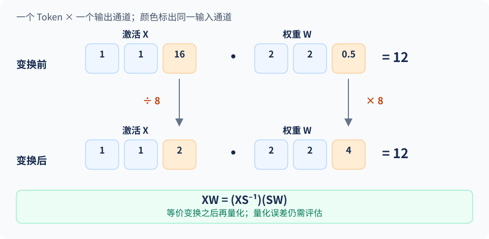
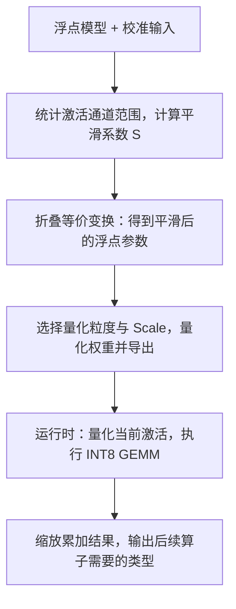

上一节的实验说明，当一组激活共用 Scale 时，少量大值会增大量化步长，影响其他元素的表示精度。直接截断又可能损失重要信息。SmoothQuant 利用线性层的等价变换调整这一分布：激活某个通道除以一个系数，对应权重乘上同一个系数，再对变换后的数据进行量化。

<!-- more -->

## 📑 目录

- [1. W8A8 难在哪里](#1-w8a8-难在哪里)
- [2. 等价缩放与通道变换](#2-等价缩放与通道变换)
- [3. 平滑系数怎么选](#3-平滑系数怎么选)
- [4. 从变换到 INT8 GEMM](#4-从变换到-int8-gemm)
- [5. 一个可以手算的例子](#5-一个可以手算的例子)
- [总结](#-总结)
- [自我检验清单](#-自我检验清单)
- [参考资料](#-参考资料)

---

## 1. W8A8 难在哪里

这里的 W8A8 特指 **INT8 权重 × INT8 激活**。当设备和 Kernel 支持这种输入组合时，线性层可以使用 INT8 矩阵乘法。与只压缩权重相比，它还要处理不断随输入变化的激活。

假设一个 Token 的隐藏向量里，大部分元素在 $[-1,1]$，某个通道却达到 80。若按整个 Token 的最大绝对值求 Scale，$s=80/127\approx0.63$，小值就集中在少量编码上。Per-token 量化隔离了 Token 之间的差异，却没有消除 Token 内的通道差异。

[SmoothQuant 论文](https://arxiv.org/abs/2211.10438)观察到，在研究的 LLM 中，一些激活离群值反复出现在特定通道；权重的分布相对更容易量化。这个现象给了我们一个操作空间：先调整两个输入的数值范围，再一起量化。

## 2. 等价缩放与通道变换

沿用上一节的矩阵方向：

$$
Y=XW,\qquad X\in\mathbb{R}^{T\times C_{\text{in}}},\quad
W\in\mathbb{R}^{C_{\text{in}}\times C_{\text{out}}}
$$

令 $S=\operatorname{diag}(s_1,\ldots,s_{C_{\text{in}}})$，且所有 $s_j>0$，有：

$$
Y=(XS^{-1})(SW)=\widetilde X\widetilde W
$$

对第 $j$ 个输入通道，$X$ 的第 $j$ 列除以 $s_j$，$W$ 的第 $j$ 行乘以 $s_j$。在精确算术下，一除一乘相互抵消。这样既能把激活中的尖峰压下来，又能保留线性层的原函数。

这里处理的是**同一个通道在所有 Token 上的取值**：$X$ 的列与 $W$ 的行通过矩阵乘法的输入维度对应。因此 $S$ 有 $C_{\text{in}}$ 个系数，与 Token 数 $T$ 无关。若改用 PyTorch 的转置权重布局，缩放的位置就表现为权重的列。



图中只展开一个 Token 和一个输出通道：原来的 $[1,1,16]$ 与 $[2,2,0.5]$ 内积为 12，把第三个激活除以 8、对应权重乘以 8 后，变成 $[1,1,2]$ 与 $[2,2,4]$，结果仍是 12。**变化的是两个输入各自的范围。** 量化要在变换之后发生，因此这次范围调整会改变舍入误差。

📌 **关键点**：此时得到的 $\widetilde X$、$\widetilde W$ 仍是浮点数据，没有生成 INT8 编码。后续量化会引入误差，平滑变换的作用是让这些误差更容易控制。完整的 SmoothQuant W8A8 方案包含平滑和后续量化，不能把两者合并为一个缩放操作。

## 3. 平滑系数怎么选

缩得太少，激活里的尖峰还在；缩得太多，权重范围会被拉大。SmoothQuant 用一个参数 $\alpha$ 调节两边承担的难度：

$$
s_j=\frac{\left(\max_t|X_{tj}|\right)^\alpha}
{\left(\max_k|W_{jk}|\right)^{1-\alpha}},\qquad 0\leq\alpha\leq1
$$

激活的最大值通过校准样本统计，权重的最大值可以直接计算。工程实现还需要对接近零的分母和 Scale 做数值保护。

- $\alpha$ 越大，通常越倾向于压平激活，把更多范围变化留给权重。
- $\alpha$ 越小，通常越倾向于保护权重的量化难度。
- $\alpha=0.5$ 可以作为理解公式的起点，最佳值要结合模型和量化配置验证。

这里有两个容易混淆的 Scale。$s_j$ 是**通道平滑系数**，用来做等价变换；INT8 的量化 Scale 则是在变换后根据范围计算，用来把数值映射到整数。它们分别参与两步操作。

## 4. 从变换到 INT8 GEMM

### 4.1 离线准备

从数据类型的变化看，完整流程如下：



图中前两次变换仍在浮点域内。权重可以离线编码；激活随输入产生，运行时才得到其编码。静态方案使用预先校准的激活 Scale，动态方案则在线计算 Scale。离线准备可以分成四步：

1. **收集激活范围**：用代表性校准文本跑前向，统计待量化线性层的输入通道。
2. **计算平滑系数**：生成 $S$，调整权重和相关的前置算子参数。
3. **确定量化配置**：选择权重与激活的粒度，确定权重 Scale，以及激活 Scale 的静态校准或动态计算方式，验证层输出和整模型质量。
4. **导出模型**：保存真实量化权重及配置，交给匹配的推理 Kernel 执行。

固定的 $S^{-1}$ 在满足计算图条件时可以折叠进前面的归一化层或线性层，避免每次额外启动一个缩放算子。若一个归一化输出同时送给 Q、K、V 等多个分支，必须一致处理这些消费者。涉及残差分支或非线性算子时，也要遵循工具支持的变换边界，不能在任意节点直接移动缩放。[官方实现](https://github.com/mit-han-lab/smoothquant)

### 4.2 运行时怎样算

为了看清数据流，暂设变换后的激活按 Token 量化、权重按输出通道量化，且零点均为 0：

$$
\widehat X_{tj}=a_t Q^X_{tj},\qquad
\widehat W_{jk}=b_k Q^W_{jk}
$$

于是：

$$
\widehat Y_{tk}=a_t b_k\sum_jQ^X_{tj}Q^W_{jk}
$$

核心求和可走 INT8 输入、INT32 累加的路径，再乘回 $a_tb_k$，转成后续算子需要的类型。这说明 **W8A8 描述的是矩阵乘法输入，累加器和层输出可以保留更高精度**。论文还讨论了不同静态、动态配置，部署时需要明确实际选用的方案。

### 4.3 额外开销与适用条件

低精度 GEMM 的收益要覆盖在线激活量化、Scale 处理及类型转换的成本。矩阵太小、算子融合不充分，或大部分时间消耗在 Attention 与调度上时，整模型提速会受限。

质量方面，应特别关注校准集未覆盖的输入：长文本、代码、特殊符号，以及与校准分布差异大的语言。必要时保留敏感层的高精度。具体 vLLM 加载方式放到 4.6 节统一处理，避免在算法介绍中重复部署命令。

## 5. 一个可以手算的例子

下面把图中的变换接上对称 INT8 量化，用纯 Python 对比同一个标量输出。`qdq` 明确表示 Quantize-Dequantize：先计算整数编码，再转回近似浮点值，用来模拟误差；这段代码没有执行真实 INT8 GEMM。

```python
def qdq(values):
    amax = max(map(abs, values))
    scale = amax / 127 if amax else 1.0
    return [max(-127, min(127, round(v / scale))) * scale for v in values]

def dot(a, b):
    return sum(x * y for x, y in zip(a, b))

x, w = [1.0, 1.0, 16.0], [2.0, 2.0, 0.5]
s = [1.0, 1.0, 8.0]  # 手工选取，便于观察；真实模型由校准统计得到
x_s = [v / scale for v, scale in zip(x, s)]
w_s = [v * scale for v, scale in zip(w, s)]

print("原始输出:", dot(x, w))
print("缩放后输出:", dot(x_s, w_s))
print("直接量化:", round(dot(qdq(x), qdq(w)), 6))
print("缩放后量化:", round(dot(qdq(x_s), qdq(w_s)), 6))
```

前两行都是 12，验证了等价变换。直接量化得到约 12.094488，缩放后再量化得到约 12.063240；这次缩放减小了输出误差。这个例子只有一个输出通道，用来观察机制；它不能替代真实模型的质量评测，也不保证任意输入都因缩放而改善。

## 📝 总结

- INT8 W8A8 同时量化权重和激活，激活中的通道离群值是主要难点之一。
- SmoothQuant 利用 $XW=(XS^{-1})(SW)$ 调整范围，再执行量化。
- $\alpha$ 平衡激活和权重两侧的难度，平滑系数与量化 Scale 承担不同作用。
- 图变换、校准和 INT8 Kernel 共同决定部署效果。

## 🎯 自我检验清单

- 能说清 Per-token 量化为何仍会受到通道离群值影响
- 能指出等价变换分别修改了 $X$ 和 $W$ 的哪个轴
- 能区分“缩放保持等价”和“量化后存在误差”
- 能说明只执行平滑变换后，为何还没有得到可部署的 INT8 权重
- 能解释为什么多个消费者共享输入时需要一起处理缩放

## 📚 参考资料

- [SmoothQuant 论文](https://arxiv.org/abs/2211.10438)
- [SmoothQuant 官方代码](https://github.com/mit-han-lab/smoothquant)
- [下一节：Weight-only INT4](./4.3-Weight-only-INT4.md)
