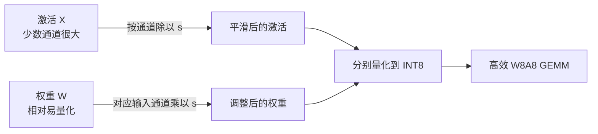

上一节把量化比作拿一把刻度有限的尺子测量数字。接下来遇到的麻烦是：**大部分激活只有零点几，少数通道却能突然到几十甚至上百。** 尺子要照顾大数，小数就挤在零附近；把大数截掉，又可能破坏模型能力。W8A8 想同时量化权重和激活，首先就得过这一关。

SmoothQuant 给了一个很巧的答案：激活难量化，权重相对容易，那就先做一次等价的通道缩放，把两边的难度重新分配。这一节从离群值讲起，逐步推导为什么“激活除一个数、权重乘同一个数”能保住浮点输出，又怎样让真正的 INT8 计算变得可用。

<!-- more -->

## 📑 目录

- [1. W8A8 想加速哪一部分](#1-w8a8-想加速哪一部分)
- [2. Activation Outlier：少数通道撑大整把尺子](#2-activation-outlier少数通道撑大整把尺子)
- [3. 为什么不直接按输入通道量化激活](#3-为什么不直接按输入通道量化激活)
- [4. SmoothQuant：一次数学等价的难度转移](#4-smoothquant一次数学等价的难度转移)
- [5. Alpha：激活和权重之间的平衡旋钮](#5-alpha激活和权重之间的平衡旋钮)
- [6. 从公式到模型：校准与离线融合](#6-从公式到模型校准与离线融合)
- [7. 动手实验：缩放前后与量化前后](#7-动手实验缩放前后与量化前后)
- [8. 工程实践：W8A8 的收益与失败信号](#8-工程实践w8a8-的收益与失败信号)
- [总结](#-总结)
- [自我检验清单](#-自我检验清单)
- [参考资料](#-参考资料)

---

## 1. W8A8 想加速哪一部分

Weight-only 把权重以低比特存储，读进来后仍可能恢复到 FP16/BF16 参与矩阵乘法。**INT8 W8A8 则把乘法的两侧都变成 INT8，让支持的硬件直接执行整数矩阵乘法。** 二者的收益路径不同。

对一个线性层，采用激活 Per-token、权重 Per-output-channel 缩放时，输出可以近似写成：

$$
Y_{tn} \approx s^X_t s^W_n \sum_j q^X_{tj}q^W_{jn}
$$

中间乘加可使用 INT8 输入和 INT32 累加，最后在 Epilogue（矩阵乘法收尾阶段）做缩放、偏置和类型转换；具体融合方式由 Kernel 决定。

大块 Prefill 和较大 Batch 的线性层通常更有机会利用低精度算力。小 Batch Decode 仍可能主要受访存和 Kernel 开销限制，所以不能只比较 GPU 规格表中的 INT8 与 FP16 峰值算力。

📌 **关键点**：W8A8 描述被量化的计算路径，**不保证 LayerNorm、Softmax、残差和所有中间结果都存成 INT8**。这些部分常保留较高精度；KV Cache 也需要单独配置。

---

## 2. Activation Outlier：少数通道撑大整把尺子

[SmoothQuant 论文](https://arxiv.org/abs/2211.10438)分析了多个 LLM 的激活，发现一些通道的幅度明显大于其他通道，而且这种现象在多个 Token 上持续出现。这就使量化难度具有明显的“通道结构”。

先用一个人为的小例子看问题。激活向量为：

$$
x = [0.1,\ -0.2,\ 0.3,\ 100]
$$

如果用对称 INT8，整行共用 Scale，则 $s=100/127\approx0.7874$。前三个值的绝对值都小于半个刻度，量化后就成了 0。

这里损失的不是最后那个大数——它反而占满了有效范围；损失的是大量普通通道的细节。就像为了让一栋百层楼完整进入镜头，你把镜头拉得很远，旁边的平房便只剩几个像素。

### 2.1 Per-token 为什么仍可能不够

Per-token 为每行分别定 Scale，能应对不同 Token 的整体幅度变化。但如果**每一行都包含同样几个很大的通道**，每行的最大值依然被它们支配，小通道仍会丢刻度。

### 2.2 直接截断为什么有风险

离群值不一定是无用噪声。把它们裁掉，确实可以给普通值更多刻度，但对应通道可能承担重要的模型计算。截断阈值需要质量评测支持，不能把“数字很大”当成“可以丢弃”的证据。

🔑 **核心概念**：SmoothQuant 利用的是**离群值常集中在固定输入通道**这一结构，而不是假设所有模型、所有输入的激活分布都一样。

---

## 3. 为什么不直接按输入通道量化激活

既然问题出在通道，那每个输入通道单独定 Scale 不就行了吗？从精度上看，这是自然的办法；从常规高效 INT8 GEMM 的计算形式看，却不那么方便。

本节统一使用以下矩阵约定：

$$
X\in\mathbb{R}^{T\times C_{\text{in}}},\qquad
W\in\mathbb{R}^{C_{\text{in}}\times C_{\text{out}}},\qquad Y=XW
$$

注意这里的 $W$ 是数学上的矩阵，和 PyTorch `Linear.weight` 的存储方向互为转置。

若激活 Scale 随输入通道 $j$ 变化，乘加就变成：

$$
Y_{tn} \approx \sum_j s^X_j q^X_{tj}\,s^W_n q^W_{jn}
$$

$s^X_j$ 在归约求和内部，不能简单地等整数 GEMM 结束后再乘一次。Kernel 要在归约过程中处理额外缩放，或把它吸收到权重中。这会影响标准 INT8 计算路径的效率。

相反，Per-token 的 $s^X_t$ 和 Per-output-channel 的 $s^W_n$ 都在归约轴之外，可以移到求和后处理。

📌 **关键点**：这里的约束针对**常规高效 INT8 GEMM**。新的 Block-scaled 硬件能支持不同的缩放方式；不能把这个讨论扩大成“任何硬件都做不了输入通道缩放”。SmoothQuant 正是在已有高效 Kernel 的约束下寻找解法。

---

## 4. SmoothQuant：一次数学等价的难度转移

### 4.1 激活除，权重乘，乘积不变

给每个输入通道选一个正数 $s_j$，组成对角矩阵 $S=\operatorname{diag}(s)$。定义：

$$
\widetilde{X}=XS^{-1}, \qquad \widetilde{W}=SW
$$

于是：

$$
\widetilde{X}\widetilde{W} = XS^{-1}SW = XW
$$

某个激活通道太大，就除以一个较大的 $s_j$；相应权重行乘以 $s_j$，确保该通道对输出的贡献没变。**难度从激活搬到权重，浮点函数保持等价。**



### 4.2 等价变换不等于量化后无损

等价关系成立在**量化之前的实数计算**中，实际浮点实现也会有舍入差异。后续分别对 $\widetilde{X}$、$\widetilde{W}$ 做 INT8 量化，仍会引入误差。

SmoothQuant 改善的是“变换后的分布更适合目标量化方案”，因此可能降低量化后的输出误差；它不保证每层每个输入都恢复到原始输出。

💡 **提示**：这个区别也是调试的顺序。先验证平滑前后的浮点模型是否一致，再验证加入量化后的误差；否则很容易把错误的通道轴、漏掉的分支补偿，误当成量化不可避免的精度下降。

---

## 5. Alpha：激活和权重之间的平衡旋钮

如果让激活幅度变得很小，却把权重放大得特别不均匀，问题只是换了个地方。SmoothQuant 用一个迁移强度 $\alpha$ 在两侧分配难度。

令校准得到的输入通道最大幅度为 $a_j=\max_t|X_{tj}|$，对应权重行最大幅度为 $w_j=\max_n|W_{jn}|$，常见形式是：

$$
s_j = \frac{a_j^{\alpha}}{w_j^{1-\alpha}},\qquad \alpha\in[0,1]
$$

实际实现会对零值加保护，避免除零。论文中的方案及融合实现可对照 [SmoothQuant 作者代码](https://github.com/mit-han-lab/smoothquant)。

| 📊 Alpha 方向 | 激活一侧 | 权重一侧 | 可能的风险 |
|---|---|---|---|
| 较小 | 迁移较少，离群通道仍较突出 | 较容易维持可量化分布 | 激活误差大 |
| 较大 | 离群通道被更强地压平 | 承担更多幅度差异 | 权重误差大 |
| 适中 | 两侧共同承担 | 两侧共同承担 | 要用验证集确定 |

看 $\alpha=0.5$ 的情况：$s_j=\sqrt{a_j/w_j}$，变换后的两侧通道最大幅度都成为 $\sqrt{a_jw_j}$。这解释了“平衡”的直觉，但没有证明 0.5 对所有网络都是最佳值。

⚠️ **注意**：Alpha 不是越大越好，也不是可以永远固定的常数。模型、层、校准分布和后续量化粒度变化，都可能改变合适的取值。应在独立验证样本上比较候选值。

---

## 6. 从公式到模型：校准与离线融合

### 6.1 一次离线处理包含什么

典型 PTQ 流程可以拆成：

1. 用模型实际的 Tokenizer 和 Chat Template 准备代表性校准输入。
2. 在待量化线性层记录输入激活的通道统计。
3. 用激活与权重统计求 $s$，验证 Alpha。
4. 改写浮点模型的参数和必要缩放，核对变换后的输出。
5. 应用选定的权重/激活量化方案，保存 Scale 和量化配置。
6. 用兼容的 Kernel 部署，单独评测质量和性能。

**平滑因子 $s$ 与最终 INT8 Scale 是两个概念。** 前者改变浮点分布，后者把改变后的分布映射到整数刻度；代码中应分清命名，避免混用。

### 6.2 为什么可以少做一次运行时乘除

如果线性层输入来自带可学习参数的 LayerNorm，原本有：

$$
x_j = \gamma_j h_j + \beta_j
$$

要输出 $x_j/s_j$，可以离线把参数改成 $\gamma_j/s_j$ 和 $\beta_j/s_j$，后面的权重再按输入通道乘 $s_j$。这样不必在每次推理额外启动一个通道缩放 Kernel。RMSNorm 的可学习缩放也能在合适的计算图中做类似处理。

但这不是拿到任意模型就能盲目修改：一个 Norm 输出可能同时送往 Q、K、V 多个投影，相关分支必须使用一致的变换；残差、非线性和其他消费者也要逐一核对。不能任意把通道缩放跨过非线性函数。

📌 **关键点**：**数学等价只描述局部线性层，模型融合必须检查完整数据流。** 工程中的平滑工具负责识别这些关系，手写修改时则必须自己证明它们成立。

---

## 7. 动手实验：缩放前后与量化前后

下面是 CPU 可运行的原理实验，使用 Per-token 激活和 Per-output-channel 权重的 Fake INT8。它不调用实际 INT8 GEMM，也不模拟模型级融合。

```python
import torch

torch.manual_seed(0)
X = torch.randn(32, 8)
X[:, 0] *= 100  # 人为造出一个持续很大的输入通道
W = torch.randn(8, 16) * 0.1  # 数学约定：[输入通道, 输出通道]

def fake_int8(tensor, dim):
    scale = tensor.abs().amax(dim=dim, keepdim=True).clamp_min(1e-8) / 127
    return (tensor / scale).round().clamp(-127, 127) * scale

def quantized_output(x, w):
    return fake_int8(x, 1) @ fake_int8(w, 0)

reference = X @ W
a = X.abs().amax(dim=0).clamp_min(1e-8)
w = W.abs().amax(dim=1).clamp_min(1e-8)

def relative_error(y):
    return ((y - reference).norm() / reference.norm()).item()

print("直接量化的相对误差:", relative_error(quantized_output(X, W)))
for alpha in [0.25, 0.5, 0.75]:
    smooth = a.pow(alpha) / w.pow(1 - alpha)
    x_s = X / smooth
    w_s = W * smooth[:, None]
    assert torch.allclose(x_s @ w_s, reference, rtol=1e-4, atol=1e-4)
    print(alpha, "平滑后量化的相对误差:", relative_error(quantized_output(x_s, w_s)))
```

先看 `assert`：它检验缩放前后的浮点函数一致性。再比较相对误差：不同 Alpha 在两侧分配的难度不同，因此量化结果也不同。

试着把离群通道换成几列、把权重某一行放大，再运行一次。你会看到“哪边原本更难”影响平衡位置。这个实验验证机制，不提供真实模型的最优 Alpha 或端到端加速结论。

---

## 8. 工程实践：W8A8 的收益与失败信号

### 8.1 在 vLLM 里怎么落地

在量化工具中完成平滑与 INT8 导出后，需要让 vLLM 读到完整的量化元数据。当前官方 [INT8 W8A8 示例](https://docs.vllm.ai/en/stable/features/quantization/llm_compressor/int8_w8a8/)使用 LLM Compressor 的 `SmoothQuantModifier` 与量化配置，导出为 `compressed-tensors`。

加载时可以使用已导出的本地目录：

```python
from vllm import LLM

# 该目录必须已有 INT8 权重、Scale 和正确的量化配置。
llm = LLM(model="./model-smoothquant-w8a8", quantization="compressed-tensors")
```

`compressed-tensors` 是保存格式，不是 SmoothQuant 算法本身；它还可以保存其他量化方案。给一个原始 BF16 目录加上这个参数，并不会自动完成 SmoothQuant 校准。

### 8.2 一张排查表

| 🔍 现象 | 优先检查 | 为什么 |
|---|---|---|
| 浮点平滑后就不一致 | 权重方向、共享分支、融合位置 | 这是变换实现问题，尚未涉及 INT8 误差 |
| 某类输入质量掉得多 | 校准是否覆盖该任务、激活是否饱和 | 静态范围可能没有代表真实业务 |
| 权重误差突然变大 | Alpha、Group/Channel 粒度 | 过多难度被搬到权重 |
| 显存降了，速度没升 | 实际 Kernel、Batch、量化融合 | 低精度存储不保证更快的计算路径 |
| 短问题正常，长生成退化 | 真实缓存生成、敏感层、独立 KV 配置 | 误差会随生成传播，需要端到端验证 |

✅ **适用机会**：INT8 Kernel 成熟、需要提高线性层计算效率、校准数据可以覆盖业务。

❌ **代价与边界**：导出与融合更复杂；动态激活缩放仍可能有运行时成本；INT8 的质量和速度都必须实测。若目标只是把权重进一步压小，下一节的 W4A16 会是另一条值得比较的路线。

---

## 📝 总结

- W8A8 让被量化的线性层使用低精度乘法，收益不只来自权重存储压缩。
- 激活离群值常有通道结构，Per-token 缩放仍可能丢掉小通道细节。
- 常规 INT8 GEMM 更容易在归约轴之外缩放；直接对输入通道缩放会增加处理难度。
- SmoothQuant 用 $XS^{-1}$ 与 $SW$ 重新分配幅度，量化前数学等价，量化后仍有误差。
- Alpha 决定难度分配，平滑因子和最终量化 Scale 要分开理解。
- 离线融合能减少额外缩放开销，但必须核对共享投影、残差和完整计算图。
- 部署要同时对齐校准数据、导出元数据、硬件 Kernel 和业务评测。

## 🎯 自我检验清单

- 能解释为何激活离群值会影响大量普通通道
- 能说明 Per-token 为什么不一定解决固定通道离群值
- 能从 $Y=XW$ 推导 $XS^{-1}SW$ 的等价性
- 能区分输入通道、输出通道和矩阵乘法归约轴
- 能解释 Alpha 过大或过小分别可能伤到哪一侧
- 能区分平滑因子与 INT8 Scale
- 能说明把缩放融合进 Norm 时需要核对哪些消费者
- 能解释 `compressed-tensors` 格式与 SmoothQuant 算法的关系

## 📚 参考资料

- [SmoothQuant: Accurate and Efficient Post-Training Quantization for Large Language Models（Xiao et al., 2023）](https://arxiv.org/abs/2211.10438)
- [MIT HAN Lab — SmoothQuant 官方实现](https://github.com/mit-han-lab/smoothquant)
- [vLLM — LLM Compressor INT8 W8A8](https://docs.vllm.ai/en/stable/features/quantization/llm_compressor/int8_w8a8/)
- [LLM Compressor — 量化工具与示例](https://github.com/vllm-project/llm-compressor)
- [vLLM — Quantization 与硬件兼容矩阵](https://docs.vllm.ai/en/stable/features/quantization/)
