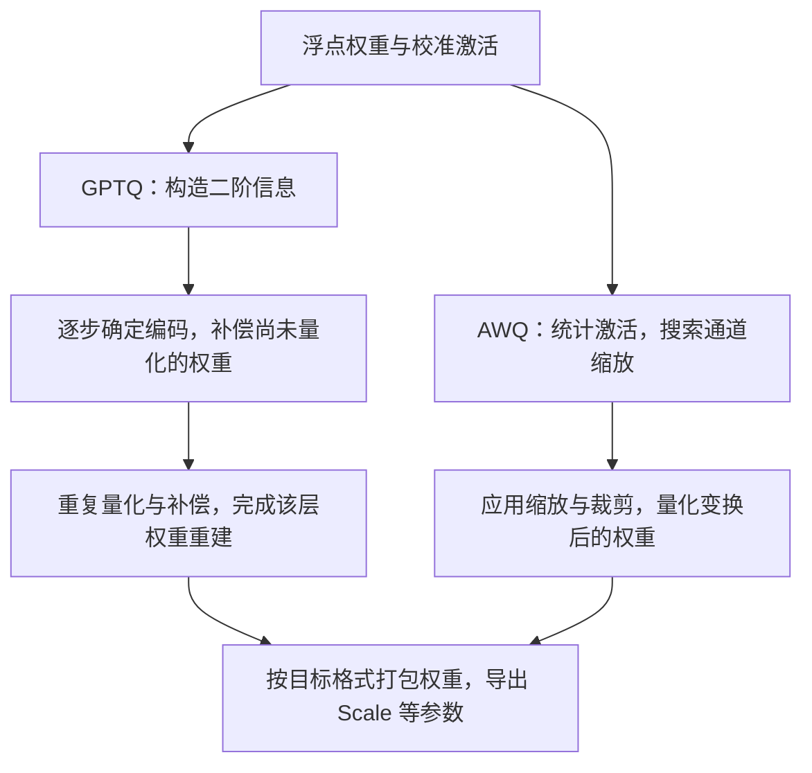
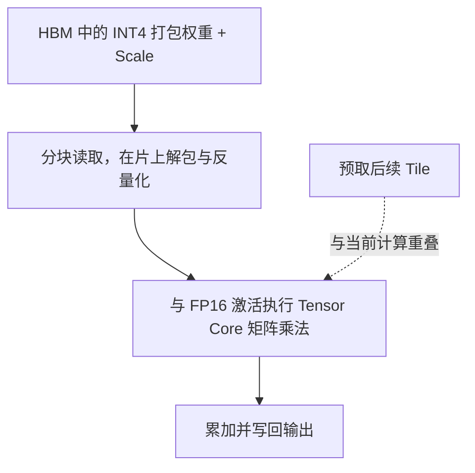

上一节介绍了平滑变换后再进行 INT8 W8A8 量化的流程。这一节采用另一种配置：**权重使用 INT4，激活保留 FP16/BF16，即 W4A16。** 4-bit 最多只有 16 种编码，相同覆盖范围下的量化步长会明显增大，对权重误差的处理更重要。GPTQ 和 AWQ 分别从误差补偿与缩放入手，Marlin 则负责高效读取和执行量化后的权重。

<!-- more -->

## 📑 目录

- [1. W4A16 的存储和计算](#1-w4a16-的存储和计算)
- [2. GPTQ：逐步量化与误差补偿](#2-gptq逐步量化与误差补偿)
- [3. AWQ：用激活找出敏感通道](#3-awq用激活找出敏感通道)
- [4. Marlin：把解包和计算衔接起来](#4-marlin把解包和计算衔接起来)
- [5. 怎样比较 GPTQ 与 AWQ](#5-怎样比较-gptq-与-awq)
- [总结](#-总结)
- [自我检验清单](#-自我检验清单)
- [参考资料](#-参考资料)

---

## 1. W4A16 的存储和计算

INT4 权重通常以打包形式保存在显存中，例如一个 32-bit 容器放 8 个 4-bit 编码，另外保存每组 Scale 和可能的零点。推理时，Kernel 读取这些编码，恢复参与乘法的近似权重。

常见的 W4A16 路径会在计算前把一个小 Tile 的 INT4 权重反量化到 FP16/BF16，再与 16-bit 激活做矩阵乘法。因此，看见“INT4 模型”时，要区分**权重的存储类型**与**乘法指令的输入类型**。后面介绍的原始 Marlin FP16×INT4 Kernel 就属于这类路径。[Marlin 官方实现](https://github.com/IST-DASLab/marlin)

权重虽然在计算前反量化，存储时仍是 4-bit，因此这条路径继续称为 W4A16。分组参数也占空间：若每 128 个 INT4 权重共用一个 FP16 Scale，单看数据与 Scale，平均每个权重是：

$$
\frac{4}{8}+\frac{2}{128}=0.515625\ \text{byte}
$$

还存在零点或对齐开销时，需要继续计入。它最直接的收益是少读权重。至于能省多少时间，要看解包与反量化能否被融合，以及算力、KV 读取和其他算子还占多少比例。

## 2. GPTQ：逐步量化与误差补偿

### 2.1 优化目标为什么要带上输入

继续使用 $Y=XW$。如果只最小化 $\|W-\widehat W\|_F^2$，所有权重误差都按同样的方式计分。但经过线性层后，输入会放大某些误差，也可能让不同通道的误差部分抵消。

GPTQ 使用校准输入，把目标写成层输出的重建误差：

$$
\min_{\widehat W}\ \|XW-X\widehat W\|_F^2
$$

取一个输出通道，其权重为列向量 $w$，记 $\delta=w-\widehat w$，则：

$$
E=\|X\delta\|_2^2=\delta^\mathsf TX^\mathsf TX\delta,
\qquad H=2X^\mathsf TX
$$

这个 Hessian 描述了误差在校准输入下的代价，以及输入通道间的相关性。它来自**局部线性层的重建目标**，无需计算整个语言模型训练损失的完整 Hessian。[GPTQ 论文](https://arxiv.org/abs/2210.17323)

### 2.2 为什么补偿有用

先看一个两维例子。若校准输入中的两列近似相同，输出主要取决于 $w_1+w_2$。假设当前量化参数让 $w_1=0.26$ 对应的重建值为 0.30，相当于多了 0.04；在 $w_2$ 还没有量化时，让它减少约 0.04，就可能抵消这次变化。输入列并不相同时，需要根据相关性决定补多少，不能固定“一加一减”。

图中两条路径都使用校准激活。GPTQ 在逐步确定量化值时补偿误差；AWQ 先搜索有利于权重量化的变换，再执行量化。两条路径最后都需要导出符合推理后端要求的检查点。

更具体地，设 $F$ 是当前尚未固定的权重索引，$H_F$ 是这一子问题的 Hessian。将 $w_i$ 固定为量化后的重建值 $\widehat w_i$ 后，二阶补偿可写为：

$$
\Delta w_F=-\frac{w_i-\widehat w_i}{[H_F^{-1}]_{ii}}[H_F^{-1}]_{:,i}
$$

其中第 $i$ 项恰好把 $w_i$ 改为 $\widehat w_i$，其他项给出剩余权重的调整方向。$\widehat w_i$ 与原权重处于同一数值尺度，不能直接替换成未反量化的整数编码。实现中还会加入阻尼保证数值稳定，并通过分块更新、Cholesky 分解等方式降低成本。以上公式只说明补偿机制。[官方代码](https://github.com/IST-DASLab/gptq)

这里的更新块决定一次处理多少权重、何时批量传播误差；量化 Group Size 决定多少权重共享 Scale。两者控制不同的行为，即使数值都设为 128，也不表示它们是同一个参数。

📌 **关键点**：GPTQ 在离线量化阶段付出更多计算，目标是得到更好的低比特权重。推理时不需要重新估计 Hessian。

## 3. AWQ：用激活找出敏感通道

### 3.1 权重大，不一定对输出影响最大

对于 $y=\sum_jx_jw_j$，某个权重的误差对输出产生 $x_j\Delta w_j$ 的扰动。若同一个通道经常出现大激活，该通道的权重量化误差就更值得关注。AWQ 因此通过激活统计寻找敏感通道，而不只按权重绝对值排序。[AWQ 论文](https://arxiv.org/abs/2306.00978)

为了保护这些通道，可以在量化前放大对应权重，同时反向缩小输入。沿用上一节的符号：

$$
Y=(XS^{-1})(SW),\qquad
\widehat Y=(XS^{-1})\,D(Q(SW))
$$

这里 $Q$ 生成低比特编码，$D$ 用相应 Scale 和零点恢复近似值；公式用 $D(Q(SW))$ 表示参与误差分析的重建权重。若放大某个通道后，所在组的整体量化步长没有同比增大，那么除回 $s_j$ 后，该通道的有效误差就可能减小。但放大过度也会拉宽同组范围，损伤其他权重，因此需要搜索合适的缩放，并结合裁剪等策略控制总体误差。

### 3.2 与 SmoothQuant 的联系

两者都能写成配对缩放，优化目标各有侧重：

| 方法 | 重点处理什么 | 典型配置 |
|---|---|---|
| SmoothQuant | 激活离群值使 INT8 激活难以量化 | INT8 W8A8 |
| AWQ | 少量敏感通道的权重误差被激活放大 | INT4 W4A16 |

AWQ 的激活仍保留 16-bit，因此可以把更多注意力放在权重量化误差上。它的“保护重要权重”主要通过缩放实现，常见部署结果仍是规则的低比特权重布局，不需要把所有重要权重单独存成 FP16。[AWQ 官方实现](https://github.com/mit-han-lab/llm-awq)

只执行 AWQ 的缩放搜索，同样得不到打包后的 INT4 模型。比较方法时，要区分“平滑/搜索的中间结果”“模拟量化后的浮点权重”和“已经编码、打包的部署权重”。SmoothQuant、AWQ 的局部变换与各自完整量化流程应分别理解。

## 4. Marlin：把解包和计算衔接起来

量化权重准备好了，接下来还有一道工程题：怎样让 GPU 读得少，同时不被解包拖慢？

一个低效实现会先把整层 INT4 权重展开成 FP16，写回显存，再启动普通 GEMM。这样既增加临时空间，又多了一次大规模写入和读取，很容易吃掉压缩收益。

Marlin 将权重加载、解包、反量化和矩阵乘法紧密衔接。可以把运行过程理解为：

预先重排权重，让运行时的读取和指令布局相适配；再用流水线尽量重叠数据搬运和计算。模块二已经讲过 Tiling 与双缓冲，这里增加的工作就是在这些阶段中安排 INT4 解包与缩放。

**GPTQ/AWQ 决定怎样得到低误差的编码，Marlin 决定兼容的编码怎样高效执行。** 后续推理框架里的 Marlin 实现支持范围可能更广，要根据具体版本检查位宽、Group Size、零点、排列方式和设备支持，不能只凭模型名字判断路径。

## 5. 怎样比较 GPTQ 与 AWQ

先把算法与部署配置分开。例如，“GPTQ、INT4 W4A16、Group Size 128、Marlin”中的几项信息可以同时成立：

| 配置维度 | 例子 | 说明什么 |
|---|---|---|
| 量化算法 | GPTQ 或 AWQ | 怎样选择变换或补偿，控制量化误差 |
| 格式与位宽 | INT4 W4A16 | 权重采用 4-bit 整数编码，激活保留 16-bit |
| 量化粒度 | Group Size 128 | 每组 128 个权重共享量化参数 |
| 执行实现 | Marlin | 兼容的编码怎样加载并参与计算 |

GPTQ 和 AWQ 都属于前文的 PTQ 路线。W4A16 没有指定使用哪一种算法，相同算法也可能采用不同分组和执行实现。在这些条件明确后，再比较两种方法：

| 维度 | GPTQ | AWQ |
|---|---|---|
| 校准数据的用途 | 构造局部重建目标和二阶信息 | 统计激活，搜索缩放等参数 |
| 主要手段 | 逐步量化并补偿剩余权重 | 改善敏感通道的量化误差 |
| 精度判断 | 看目标模型、校准集与评测结果 | 同样需要目标任务验证 |
| 推理速度 | 取决于导出布局与实际 Kernel | 同样取决于导出布局与实际 Kernel |

因此，“AWQ 一定更快”或“GPTQ 一定更准”都缺少条件。公平对比至少要固定基础模型、位宽、Group Size、输入长度和负载，并记录实际加载的 Kernel。某个方案因布局兼容而选中了更快的后端，另一方案走了普通路径，这体现的是整套部署配置的差异。

排查时可以按下面的顺序推进：

1. **确认检查点**：量化配置是否完整，基础模型与版本是否相同。
2. **看加载日志**：是否发生重排，最终使用什么 Kernel，有没有回退。
3. **先验质量**：避免只挑几条好看的输出，至少准备独立任务集。
4. **再测性能**：分别观察小 Batch Decode、大 Batch 和长 Prompt；量化省出的空间也可能用于扩大并发。

## 📝 总结

- Weight-only INT4 压缩权重，激活保持高精度；存储类型与计算类型需要分别看。
- GPTQ 根据校准输入衡量层输出误差，并利用二阶信息补偿尚未量化的权重。
- AWQ 利用激活统计选择缩放，让敏感通道得到更合适的量化表示。
- Marlin 的收益来自数据布局和执行流水线，算法名无法单独决定推理速度。

## 🎯 自我检验清单

- 能解释为什么 $\|XW-X\widehat W\|$ 比单看权重误差更贴近层输出
- 能用两个相关输入通道说明 GPTQ 的补偿思路
- 能说明 AWQ 与 SmoothQuant 使用配对缩放时的目标差异
- 能解释先把整层 INT4 展开到显存可能带来什么额外成本

## 📚 参考资料

- [GPTQ 论文](https://arxiv.org/abs/2210.17323)与[官方代码](https://github.com/IST-DASLab/gptq)
- [AWQ 论文](https://arxiv.org/abs/2306.00978)与[官方代码](https://github.com/mit-han-lab/llm-awq)
- [Marlin 论文](https://arxiv.org/abs/2408.11743)与[官方代码](https://github.com/IST-DASLab/marlin)
- [下一节：KV Cache 量化](./4.4-KV-Cache量化.md)
