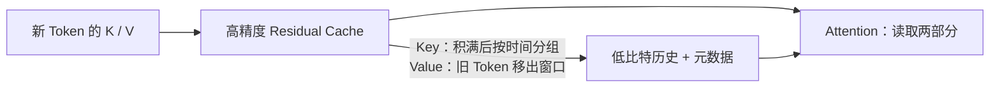

把权重压到 INT4 后，模型终于能在一张卡上启动了。你兴冲冲地把上下文拉长、并发调高，却发现显存又满了。原因是另一笔账在增长：**权重只需要放一份，KV Cache 却要随每个请求的历史长度累积。** 对长上下文服务来说，这笔账甚至会超过权重。

这一节从 KV Cache 的容量公式出发，解释为什么 Key 和 Value 未必适合用同一种量化粒度，再看 KIVI 的 2-bit 思路和 vLLM 的 FP8 KV Cache。最后把一个容易忽略的问题讲清楚：缓存压小了，Attention 是否更快、长文本质量是否还能守住，都需要分别验证。

<!-- more -->

## 📑 目录

- [1. 再算一次 KV Cache 显存账本](#1-再算一次-kv-cache-显存账本)
- [2. 缓存误差怎样影响 Attention](#2-缓存误差怎样影响-attention)
- [3. KIVI：Key 按通道，Value 按 Token](#3-kivikey-按通道value-按-token)
- [4. Residual Cache：新 Token 先保留高精度](#4-residual-cache新-token-先保留高精度)
- [5. FP8 KV Cache：用成熟路径降低缓存位宽](#5-fp8-kv-cache用成熟路径降低缓存位宽)
- [6. Scale、分页与 Attention Kernel 的配合](#6-scale分页与-attention-kernel-的配合)
- [7. vLLM 实践：启用与校准](#7-vllm-实践启用与校准)
- [8. 怎么验证长上下文质量与性能](#8-怎么验证长上下文质量与性能)
- [总结](#-总结)
- [自我检验清单](#-自我检验清单)
- [参考资料](#-参考资料)

---

## 1. 再算一次 KV Cache 显存账本

对普通全注意力的 Decoder 模型，忽略分页尾块、对齐和元数据，总 KV 数据量约为：

$$
M_{\text{KV}} = 2L\left(\sum_{i=1}^{B}T_i\right)H_{\text{KV}}D_{\text{head}}b
$$

- 2：Key 和 Value 两份。
- $L$：层数。
- $T_i$：第 $i$ 个请求当前已经缓存的 Token 数。
- $H_{\text{KV}}$：KV 头数，GQA/MQA 下可能小于 Query 头数。
- $D_{\text{head}}$：每个头的维度。
- $b$：每个缓存元素的字节数。

假设 $L=32$、$H_{\text{KV}}=8$、$D_{\text{head}}=128$，一个 Token 的 FP16 KV 数据为：

$$
2\times32\times8\times128\times2 = 131072\ \text{bytes} = 128\ \text{KiB}
$$

单请求缓存 32768 个 Token，就是 4 GiB；8 个同长度请求，就是 32 GiB。换成 FP8，纯数据部分分别变成约 2 GiB 和 16 GiB。

| 📊 精度 | 每元素数据字节 | 相对 FP16 的理想 KV 数据量 | 实际还要计入 |
|---|---|---|---|
| FP16 / BF16 | 2 | 1 | 分页与布局开销 |
| FP8 / INT8 | 1 | 1/2 | Scale、对齐等 |
| INT4 | 1/2 | 1/4 | Scale、零点、残留缓存等 |
| INT2 | 1/4 | 1/8 | Scale、零点、残留缓存等 |

⚠️ **注意**：这张表只比较 KV 的纯数据。KIVI 的 2-bit 不会把总显存压到原来的八分之一；权重和工作区没有随之缩小。滑动窗口、MLA 和混合结构的缓存布局也不能直接套用这个公式。

---

## 2. 缓存误差怎样影响 Attention

量化 KV 不只是“存完再恢复”，它会影响下一步的 Attention。省略多头索引，原本有：

$$
P=\operatorname{softmax}\left(\frac{QK^{\mathsf T}}{\sqrt{D}}\right),\qquad O=PV
$$

量化后的 $\hat{K}=K+\Delta K$、$\hat{V}=V+\Delta V$ 进入计算后，Key 的误差会先扰动注意力分数，再经过 Softmax 改变“该看哪里”；Value 的误差则改变“从那些位置取回什么”。

用一个类比：Key 像图书馆的检索索引，Value 像找到的书页。索引误差可能让你拿错书，书页误差则让你读到的内容不准。两者对结果的作用不同，适合的量化方式也可能不同。

📌 **关键点**：**缓存里的同一份误差会被后续多个 Decode 步骤反复使用。** KV 量化不能只靠短 Prompt 的单次前向结果判断质量，必须测真实缓存生成。

---

## 3. KIVI：Key 按通道，Value 按 Token

### 3.1 为什么 K 和 V 用不同的尺子

[KIVI 论文](https://arxiv.org/abs/2402.02750)观察到，在研究的模型中，Key 的大值常集中在某些通道，Value 的分布则更适合按 Token 处理。它据此采用：

- **Key：Per-channel**，固定一个通道，沿时间轴把若干 Token 分为一组。
- **Value：Per-token**，固定一个 Token，沿特征轴把若干通道分为一组。

设某一层某一头的缓存形状是 $[T,D]$，Group Size 为 $G$，可以这样画：

```text
Key：[T, D]                Value：[T, D]
按固定通道看时间窗口         按固定 Token 看特征分组

K[t:t+G, d] → 一组          V[t, d:d+G] → 一组
统计同一通道的多个 Token     统计同一 Token 的多个通道
```

同一个“Per-channel”在权重和缓存上指向的轴不同。这里是缓存的特征通道，不是线性层的输出通道。

### 3.2 2-bit 仿射量化怎样保存一组数据

对一个 Group，取最大最小值，用四个编码 $\{0,1,2,3\}$ 表示：

$$
s = \frac{x_{\max}-x_{\min}}{3},\qquad
q = \operatorname{clip}\left(\operatorname{round}\frac{x-x_{\min}}{s},0,3\right),\qquad
\hat{x}=x_{\min}+sq
$$

常量 Group 需要单独处理，避免 $s=0$。实现可以用最小值或等价的零点参数来存偏移，具体编码由 Kernel 规定。

KIVI 标题里的“Asymmetric”主要强调 **K 与 V 采用不同粒度和处理方式**；它还使用带偏移的组内量化。阅读时要把“K/V 处理不对称”和“量化刻度是否以零为中心”这两层概念分开。

🔑 **核心概念**：KIVI 的贡献不只是把位宽改成 2，而是**量化轴、流式缓存维护和 Attention 计算协同设计**。把任意 KV 张量直接转成 2-bit，不会自动得到同样的效果。

---

## 4. Residual Cache：新 Token 先保留高精度

Key 按时间轴组内统计，一个新 Token 到来时还凑不齐一组。若每步重新量化所有历史，又会引入大量读写。KIVI 因此把缓存分成两部分：已经量化的历史，以及暂时保留较高精度的 **Residual Cache（残留缓存）**。

这里的 Residual 指“尚未转入低比特历史的缓存”，和 Transformer 的残差连接没有关系。

### 4.1 Key：凑够一批再转入历史

新 Key 先加入高精度残留区。达到配置的残留长度 $R$ 后，把适合完整分组的部分量化并追加到低比特历史，再继续积累。$R$ 与 Group Size 需要满足实现的分组约束。

### 4.2 Value：保留最近的窗口

Value 按 Token 量化，不必等多个 Token 才能统计通道 Group。但 KIVI 仍保留最近 $R$ 个 Token 的高精度 Value，超过窗口的旧 Token 再被量化转入历史，以控制质量损失。



### 4.3 两个旋钮的账本

| 📊 参数 | 变小可能带来的收益 | 可能的代价 |
|---|---|---|
| Group Size | 更局部的范围，误差可能更小 | 更多 Scale/偏移，压缩率和 Kernel 效率下降 |
| Residual Length | 高精度缓存更少，显存更省 | 更多 Token 使用低比特，质量与维护开销需验证 |

KIVI 的“Tuning-free”指无需对模型参数微调，不代表无需设置这些缓存参数，更不意味着每个模型都天然满足同样的精度要求。

---

## 5. FP8 KV Cache：用成熟路径降低缓存位宽

和 2-bit 相比，FP8 只把每个缓存元素从 2-byte 降到 1-byte，压缩更温和，但在已有推理框架中更容易找到可用的加载和 Attention 路径。

FP8 有不同编码。E4M3 的有效尾数位更多，E5M2 的动态范围更大；二者都可能配合 Scale 适应实际 KV 幅度。一个简化的缩放表达是：

$$
q_K=\operatorname{FP8}(K/s_K),\qquad \hat{K}=s_Kq_K
$$

Value 也有自己的 $s_V$，不应因为都是 FP8 就假设和 Key 共用同一 Scale。具体粒度可按张量或按头，取决于模型格式和 Attention 后端。[vLLM 的 KV Cache 文档](https://docs.vllm.ai/en/stable/features/quantization/quantized_kvcache/)给出了相应支持范围与校准路径。

FP8 KV 的两个收益要分开看：

- **容量收益**：每 Token 缓存数据更小，给定缓存预算下能存更多 Token。
- **执行收益**：读取量可能下降，某些后端还可使用 FP8 Attention；是否更快取决于转换、计算与调度开销。

⚠️ **注意**：FP8 缓存不要求模型权重也为 FP8，也不能仅凭 GPU 支持 FP8 存储转换就断言支持原生 FP8 Attention。要核对完整的后端路径。

---

## 6. Scale、分页与 Attention Kernel 的配合

### 6.1 缩小数据，不保证 nvidia-smi 数字减半

vLLM 常按 `gpu_memory_utilization` 规划实例的显存预算，再把可用空间用作 KV Block 池。启用更小的缓存 dtype 后，框架可能分配**更多可缓存 Token**，而不是把省出的显存全部退回系统。

因此 `nvidia-smi` 的已用显存可能变化不大，启动日志里的 GPU KV Cache 容量和最大并发能力却提高了。要区分缓存池分配量、活跃请求使用量和单 Token 存储成本。

### 6.2 分页和量化是两个维度

第 2.1 节的 PagedAttention 决定“缓存放在哪个物理块”；量化决定“每个元素怎样编码、怎么解释”。二者可以协同，但需要 Kernel 理解量化布局与 Scale 的位置。

若把缓存整体反量化成高精度大张量再算 Attention，额外临时空间和搬运会吃掉收益。更理想的路径是在读取 Tile 后直接做转换或低精度计算，避免完整恢复缓存。

📌 **关键点**：**量化元数据也是缓存协议的一部分。** 前缀共享、缓存换出和跨进程传输，需要确保 dtype、Scale 和布局一致；相同 Token 并不意味着来自不同量化配置的物理缓存可以直接互换。

---

## 7. vLLM 实践：启用与校准

### 7.1 先跑通无校准的最小例子

下列示例用于检查 FP8 KV 路径是否能加载，运行环境应为支持对应 vLLM/GPU 后端的 Linux 或 WSL2。它使用原始模型权重，不量化权重：

```python
from vllm import LLM, SamplingParams

llm = LLM(
    model="Qwen/Qwen2.5-7B-Instruct",
    dtype="half",
    kv_cache_dtype="fp8",
    max_model_len=8192,
    gpu_memory_utilization=0.90,
)
outputs = llm.chat(
    [{"role": "user", "content": "解释 KV Cache 为什么随上下文增长。"}],
    SamplingParams(temperature=0, max_tokens=128),
)
print(outputs[0].outputs[0].text)
```

官方文档中的无校准路径使用默认 Scale。这足够帮助检查加载，却不应当作质量已经通过验证。对部署，更稳妥的做法是用代表性数据校准并保存 K/V Scale。

### 7.2 再加载带校准参数的目录

vLLM 官方文档提供了 LLM Compressor 的校准示例。选择 Per-tensor 或 Per-attention-head 配置后，保存带缓存量化元数据的 checkpoint，再加载：

```bash
# 替换为实际已经导出的目录；KV Scale 必须在支持的格式中保存。
vllm serve ./model-with-calibrated-kv-scales --kv-cache-dtype fp8
```

某些配置会同时量化 Attention 的 Query 或模型权重，比较实验时要记录这些变化。Per-head 等功能也有后端限制，不能只改参数名就认为支持。

### 7.3 KIVI 与 FP8 不能用同一个开关互换

本节的 KIVI 是理解极低比特缓存的论文与参考实现路线；上面的 `--kv-cache-dtype fp8` 是 vLLM 的 FP8 缓存路径。它不会自动变成 KIVI 2-bit。若要部署 KIVI，必须另外确认该实现和模型、分页布局及推理引擎的兼容性。

---

## 8. 怎么验证长上下文质量与性能

### 8.1 质量：让缓存真正进入计算

量化 KV 后至少覆盖：

- 不同上下文长度：例如短对话、中等文档和接近部署上限的长文档。
- 不同信息位置：关键事实放在开头、中间、末尾，检查检索能力。
- 不同生成长度：评测较长续写、多步推理和多轮对话，观察重复、遗漏和格式错误。
- 真实缓存路径：Prefill 后继续逐步生成，确保后续步骤实际读取量化缓存。

只在关闭 Cache 的单次 teacher-forcing 前向里算困惑度，可能根本没有测到缓存量化路径。评测工具的 KV 开关和前向方式也必须核对。

### 8.2 性能：固定并发与扩容并发都要测

固定请求长度和并发，比较 TTFT、TPOT、P95/P99、吞吐；再在同一显存预算下提高并发，比较系统可承载能力。第一组看执行路径，第二组看容量转化出的服务收益。

| 🔍 观察 | 可能的解释 | 下一步 |
|---|---|---|
| 缓存容量增加，低并发速度差不多 | 主要兑现容量收益 | 提高并发，观察延迟约束下的吞吐 |
| 短上下文变慢 | 量化/转换开销占比大 | 核对后端与融合路径 |
| 长文检索质量下降 | 缓存误差影响 Attention | 校准 Scale、调整精度或跳过敏感层 |
| nvidia-smi 变化不大 | 框架扩大了预分配缓存池 | 看 KV Token 容量和活跃使用量 |

💡 **提示**：缓存压缩可以缓解容量问题，但不会消除长上下文 Attention 的计算和读取需求。把最大上下文调高以后，还得重新评估服务延迟。

---

## 📝 总结

- KV Cache 随请求数与缓存长度增长，权重压小后它仍可能成为主要瓶颈。
- Key 误差改变注意力位置，Value 误差改变取回的内容，二者不必采用相同粒度。
- KIVI 结合 Key Per-channel、Value Per-token 与高精度残留缓存实现 2-bit 历史存储。
- Group Size 和 Residual Length 影响元数据、压缩率、维护开销及质量。
- FP8 KV 数据约为 FP16 的一半，但总显存、缓存池大小和吞吐不会自动减半或翻倍。
- Scale、分页布局和 Attention Kernel 必须协同，原生 FP8 计算支持要单独核对。
- 验证要走真实缓存生成，覆盖上下文长度、信息位置和长输出，再比较容量与执行收益。

## 🎯 自我检验清单

- 能用层数、KV 头数、头维度和 Token 数计算缓存数据量
- 能解释 GQA 为什么减少 KV 容量，但 Query 头数不能直接代入账本
- 能区分 Key 与 Value 量化误差对 Attention 的作用
- 能在 `[T, D]` 张量上画出 KIVI 两种 Group 的方向
- 能解释 K 和 V 的 Residual Cache 为什么采用不同维护方式
- 能说明启用 FP8 KV 后显存监控可能不明显下降的原因
- 能区分 KIVI 参考实现与 vLLM FP8 KV 参数
- 能设计一个真正读取量化缓存的长上下文质量实验

## 📚 参考资料

- [KIVI: A Tuning-Free Asymmetric 2bit Quantization for KV Cache（Liu et al., 2024）](https://arxiv.org/abs/2402.02750)
- [KIVI — 作者参考实现](https://github.com/jy-yuan/KIVI)
- [vLLM — Quantized KV Cache](https://docs.vllm.ai/en/stable/features/quantization/quantized_kvcache/)
- [vLLM — Attention Backend Feature Support](https://docs.vllm.ai/en/stable/design/attention_backends/)
- [LongBench: A Bilingual, Multitask Benchmark for Long Context Understanding（Bai et al., 2024）](https://arxiv.org/abs/2308.14508)
