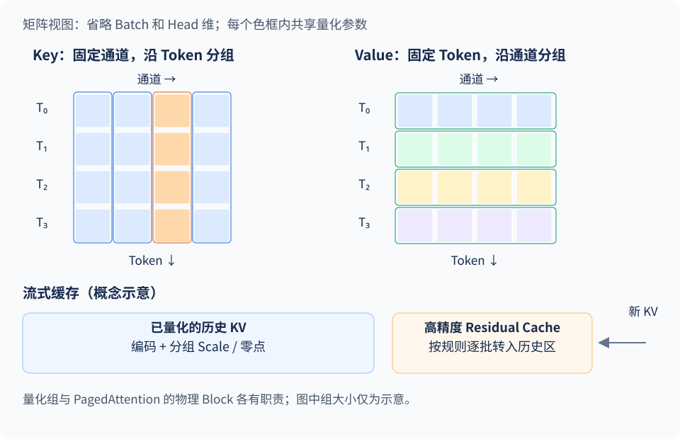

权重压到 INT4 后，模型终于装进了显存。但把上下文拉长、同时接入更多请求，显存还是会很快吃紧。第 1 章的账本已经解释过原因：权重是固定开销，**KV Cache 会随请求中的历史 Token 不断增长**。这一节只沿着量化这条线往下走，看看怎样减少每个历史 Token 的存储成本。

<!-- more -->

## 📑 目录

- [1. 先估算能省下多少缓存](#1-先估算能省下多少缓存)
- [2. KV 为什么不能照搬权重量化](#2-kv-为什么不能照搬权重量化)
- [3. KIVI：Key 按通道，Value 按 Token](#3-kivikey-按通道value-按-token)
- [4. FP8 KV Cache：格式之外还要看 Scale](#4-fp8-kv-cache格式之外还要看-scale)
- [5. 怎样验证长上下文收益](#5-怎样验证长上下文收益)
- [总结](#-总结)
- [自我检验清单](#-自我检验清单)
- [参考资料](#-参考资料)

---

## 1. 先估算能省下多少缓存

直接使用前文常规 MHA/GQA 的估算式，设层数为 $L$、请求数为 $B$、每请求缓存长度为 $T$、KV Head 数为 $H_{\text{KV}}$、每个 Head 的维度为 $d$，每个元素占 $b$ 字节：

$$
M_{\text{KV}}=2LBTH_{\text{KV}}db
$$

取一个示例配置：$L=32,H_{\text{KV}}=8,d=128$，单请求缓存 32768 个 Token。16-bit 缓存的纯数据占用为：

$$
2\times32\times32768\times8\times128\times2=4\ \text{GiB}
$$

改成 8-bit，纯数据约为 2 GiB；改成 2-bit，纯数据约为 0.5 GiB。后一个数字只是编码本身的下限，还没包含分组元数据、高精度残留区、对齐和分页开销。MLA、滑动窗口及混合架构应按实际缓存结构另算。

分页和量化可以叠加理解：PagedAttention 提高已有缓存空间的利用率，量化则进一步减小缓存元素。Weight-only 量化不会自动改变这里的 $b$，需要单独配置 KV 精度。

## 2. KV 为什么不能照搬权重量化

权重可以花较长时间离线处理，处理好后反复使用。KV Cache 则不断产生新数据，量化发生在请求执行过程中。每生成一个 Token 都运行一遍昂贵的重建算法，会直接增加生成延迟。

除了写入成本，还要考虑误差怎样进入 Attention。记 $P=\operatorname{softmax}(QK^\mathsf T/\sqrt d)$：

- **Key 的误差**先改变 $QK^\mathsf T$，再经过 Softmax，可能改变模型关注哪些位置。
- **Value 的误差**进入 $PV$，在注意力权重下影响输出；即使每个元素误差很小，也需要观察最终结果。

所以，缓存误差要放回长上下文任务中验证。几条短对话正常，并不足以说明长文档检索、跨段推理或长输出也正常。

## 3. KIVI：Key 按通道，Value 按 Token

### 3.1 两个张量采用不同分组

[KIVI 论文](https://arxiv.org/abs/2402.02750)在研究的模型中发现：Key 存在明显的通道离群值，而 Value 没有同样稳定的通道模式。相应地，它对 Key 与 Value 采用不同的分组方向：

固定一层、一个请求和一个 KV Head 后，可以将 K、V 都看成 $T\times d$ 矩阵，沿用 4.1 节“行 = Token，列 = 通道”的约定。Per-channel 表示固定某个通道，但为了支持流式追加，统计范围还会沿 Token 方向切成有限长度的组；它不意味着永远用全部历史 Token 计算一个 Scale。

- **Key Per-channel**：固定 Head 内的一个通道，沿连续 Token 分组求量化参数。
- **Value Per-token**：固定一个 Token，沿 Head 内的通道分组求量化参数。



图中的矩阵都是“行 = Token，列 = 通道”。Key 的竖向分组把大幅值通道和其他通道隔开；Value 的横向分组让单个 Token 使用自己的局部范围。彩色框表示共享参数的组，和 PagedAttention 的物理 KV Block 是两个不同概念。

这在 2-bit 下尤其重要：每组最多只有四种编码，若大小相差很远的数据混在同一组，小值容易映射到相同编码。改变分组方向会改变局部覆盖范围，从而影响误差。这种方式在相同元素位宽下更好地利用数据分布，同时需要承担分组元数据成本。

论文名称里的 **Asymmetric** 强调 K 与 V 采用不同策略；其组内数值映射也使用基于局部最小值、最大值的量化。理解时需要把“两个张量如何分组”和“组内数字如何编码”分开。

### 3.2 新 Token 还没凑满一组怎么办

Key 的分组跨越多个 Token，刚生成的数据未必能立即构成完整组。KIVI 为此保留一个高精度 **Residual Cache（残留缓存）**，与已经量化的历史缓存一起参与 Attention。随着新 Token 到来，再按算法规则把满足条件的数据批量量化；K、V 的具体搬移规则要结合各自分组方向实现。

这个残留区让流式写入更容易处理，也保留部分近期数据的高精度表示，但会占据额外空间。若上下文很短，残留区与元数据的占比更高，实际压缩比就离“16-bit 降到 2-bit 的 8 倍”更远。

📌 **关键点**：KIVI 的价值在于根据 K/V 特性设计分组和流式缓存结构。2-bit 是这套设计下验证的配置，不能脱离模型、任务和实现承诺所有场景都保持质量。论文方法也不能直接等同于 vLLM 的默认 KV 路径。

## 4. FP8 KV Cache：格式之外还要看 Scale

工程上另一条路线是将 KV 存成 FP8。相比 16-bit，编码数据量减半，精度压力通常也比 2-bit 更容易处理。具体数值格式在下一节展开，这里先关注使用时的几个环节。

### 4.1 FP8 也需要缩放

浮点编码的指数范围有限，FP8 同样需要把实际值放到适合的范围。K 和 V 可以分别持有 Scale；更细粒度的配置还可能按 Head 缩放。校准范围不合适时，仍会出现舍入或饱和问题。

本文用与前文一致的 **vLLM v0.19.0 文档**作为参数说明基线。该版本文档区分无校准、随机 Token 估计和数据集校准路径，其中 `calculate_kv_scales=True` 在预热阶段用随机 Token 批次估计后固定 Scale。它不能理解成每个真实请求都会重新动态校准。[版本文档](https://docs.vllm.ai/en/v0.19.0/features/quantization/quantized_kvcache/)

没有导出的 Scale 时，可用下面的离线示例检查 FP8 KV 路径是否能够运行；正式质量对比应采用代表性数据校准的配置：

```python
from vllm import LLM, SamplingParams

llm = LLM(
    model="Qwen/Qwen2.5-7B-Instruct",
    dtype="half",
    max_model_len=4096,
    kv_cache_dtype="fp8",
    calculate_kv_scales=True,
)
outputs = llm.chat(
    [[{"role": "user", "content": "用两句话说明 KV Cache 量化节省了什么。"}]],
    SamplingParams(temperature=0, max_tokens=128),
)
print(outputs[0].outputs[0].text)
```

这段代码只验证加载与生成，不构成长上下文精度评测。若模型已经带有校准 Scale，应按其量化配置加载，并确认日志实际使用了这些参数。

### 4.2 存储精度和 Attention 计算路径

FP8 KV 可以先减少缓存存储，再由后端读取、转换并计算；支持原生 FP8 Attention 的路径还可能量化 Query，并在低精度域执行相关操作。具体行为由 GPU、Attention 后端和版本共同决定，不能只看 `kv_cache_dtype` 就断言整段 Attention 的计算精度。

第 2 章介绍的后端选择在这里很关键：启动前检查后端支持的缓存类型与 Scale 粒度，启动后核对实际路径。不要假定所有 FlashAttention、FlashInfer 版本或 GPU 都支持同一种组合。

## 5. 怎样验证长上下文收益

先固定权重格式，只改变 KV 配置，这样更容易看出是哪部分变化带来效果：

| 要验证的收益 | 对比条件 | 应观察什么 |
|---|---|---|
| 缓存容量 | 同样的 KV 显存预算 | 可缓存 Token 数、可承载的上下文与并发 |
| 单请求延迟 | 同样的输入、输出长度和并发 | TTFT、TPOT，量化转换有无额外开销 |
| 服务吞吐 | 同样质量要求与延迟目标 | 新增容量能否转成更多有效并发 |
| 长上下文质量 | 独立的长文本任务集 | 检索正确率、引用位置、跨段推理和长输出表现 |

vLLM 通常会将剩余预算分配给 KV 池，因此两次运行在 `nvidia-smi` 上看起来可能占用相近显存。真正变化的可能是**相同预算能放下多少 KV Block/Token**。同时记录启动日志中的缓存容量和框架开销，比只截图总显存更有解释力。

组合 Weight-only 与 KV 量化时，建议先分别验证，再测组合配置。两类误差会共同进入网络，单独通过评测不能替代组合后的验证。

## 📝 总结

- KV 量化减少每个历史 Token 的存储成本，收益随上下文与并发变化。
- KIVI 对 Key 和 Value 采用不同分组，并处理在线追加与残留缓存。
- FP8 KV 的效果取决于格式、Scale 与 Attention 后端，加载成功只是第一步。
- 容量收益、单请求延迟和服务吞吐需要分别测量。

## 🎯 自我检验清单

- 能在显存公式中指出 KV 量化改变了哪一项
- 能画出 KIVI 的 Key、Value 分组轴
- 能解释 Residual Cache 为什么会影响实际压缩比
- 能说明显存占用相近时，怎样判断 KV 量化有没有增加容量

## 📚 参考资料

- [KIVI 论文](https://arxiv.org/abs/2402.02750)与[官方实现](https://github.com/jy-yuan/KIVI)
- [vLLM v0.19.0 — Quantized KV Cache](https://docs.vllm.ai/en/v0.19.0/features/quantization/quantized_kvcache/)
- [下一节：FP8 与 NVFP4/MXFP4](./4.5-FP8与NVFP4-MXFP4.md)
