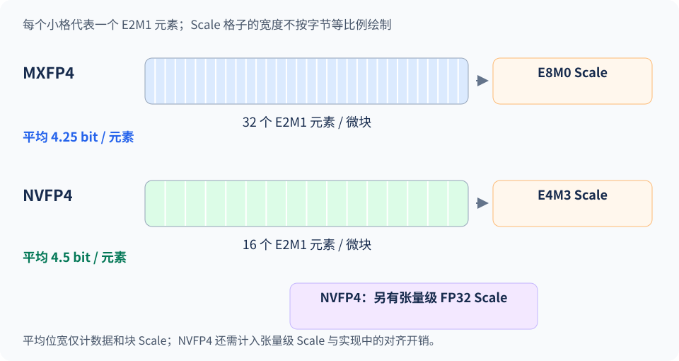

前面几节主要使用整数编码，上一节又引入了 FP8 KV Cache。两者都可以只有 8-bit，但**同一串比特按整数或浮点格式解释，会得到不同的数值；各编码对应的输入区间也会改变。** 这一节先说明从 INT 转向 FP 改变了什么，再看 Hopper 的 FP8，以及 Blackwell 上的 NVFP4、MXFP4。

<!-- more -->

## 📑 目录

- [1. FP8：范围和精度怎样分配](#1-fp8范围和精度怎样分配)
- [2. 为什么 FP8 仍然需要 Scale](#2-为什么-fp8-仍然需要-scale)
- [3. FP4 与微块缩放](#3-fp4-与微块缩放)
- [4. NVFP4 与 MXFP4 的区别](#4-nvfp4-与-mxfp4-的区别)
- [5. 硬件支持怎样变成模型收益](#5-硬件支持怎样变成模型收益)
- [总结](#-总结)
- [自我检验清单](#-自我检验清单)
- [参考资料](#-参考资料)

---

## 1. FP8：范围和精度怎样分配

### 1.1 从整数编码到浮点编码

均匀 INT8 量化中，整数 $q$ 按 $s(q-z)$ 解释，固定 Scale 后相邻重建值间距相同。FP8 则把位模式分成符号、指数和尾数，用它们共同表示数值。例如 `00111000` 按有符号 INT8 解释为 56；按常见 E4M3 格式解释时，符号为 0、指数为 `0111`、尾数为 `000`，表示 1.0。它们在缩放之前就已经不同。

这也说明，把已有 INT8 编码的类型标记改成 FP8 无法保持原数值。转换量化格式需要重新根据原值或重建值计算目标编码，并处理对应的 Scale。E4M3 的编码与特殊值定义可查阅 [ONNX 的 FP8 格式说明](https://onnx.ai/onnx/technical/float8.html)。

| 比较项 | 均匀整数量化 | 低比特浮点量化 |
|---|---|---|
| 编码的含义 | 整数及其缩放、零点 | 符号、指数、尾数及外部缩放 |
| 固定 Scale 后的间距 | 相邻重建值等距 | 间距随指数区间变化 |
| 误差特点 | 区间内的绝对舍入误差上界较统一 | 正规数通常具有近似的相对精度，接近零时另有边界 |
| 实际计算 | 需要匹配整数输入的 Kernel | 需要匹配相应浮点格式的 Kernel |

**从 INT8 换成 FP8，元素的位宽仍为 8，改变的是表示范围、可表示值的分布和计算路径。** 两者都只有有限种位模式，FP8 也无法精确表示任意小数；哪一种误差更小，要结合分布、Scale 和粒度判断。

### 1.2 E4M3 与 E5M2

浮点格式的符号位、指数位和尾数位在前置章节已经介绍过，这里只看位宽压到 8-bit 后的取舍。以下采用 NVIDIA 常见的 E4M3 与 E5M2 格式约定，其他变体的特殊值和范围需要单独核对。

| 格式 | 符号 / 指数 / 尾数位 | 最大有限值 | 取舍 |
|---|---|---|---|
| E4M3 | 1 / 4 / 3 | 448 | 同一指数区间内可表示值较密，范围较小 |
| E5M2 | 1 / 5 / 2 | 57344 | 范围更大，尾数精度较低 |

E4M3 常用于推理权重和激活；E5M2 的范围对需要覆盖更大跨度的数据有用。实际使用还取决于 Kernel 支持，不能只根据数值范围更大就选择 E5M2。[vLLM FP8 文档](https://docs.vllm.ai/en/v0.19.0/features/quantization/fp8/)

以 E4M3 的正规数为例，在 $[1,2)$ 内，相邻值的间隔为 $1/8=0.125$；在 $[8,16)$ 内，间隔扩大为 1。它更接近“保留一定相对精度”，与 INT8 缩放后的固定步长不同。接近 0 的次正规数还使用单独的表示规则。

固定外部 Scale 为 1、整数零点为 0 时，E4M3 可以精确表示 1.375，整数编码则就近映射到 1；若给 INT8 选择 $s=0.125$，它也能精确重建 1.375，但正向最大重建值随之降到 $127\times0.125=15.875$。这个例子说明，比较格式时必须同时交代 Scale 与覆盖范围，不能从一个数的误差推断整体优劣。

📌 **关键点**：把数除以 Scale 后调用 `round()`，得到的是整数网格。即使再把范围裁到 $[-448,448]$，也没有模拟出 E4M3 的浮点编码。观察 FP8 误差应使用真实类型转换或正确的编码实现。

## 2. 为什么 FP8 仍然需要 Scale

FP8 的指数范围仍然有限。合适的外部缩放可以减少数据落入次正规数区、下溢为零或超过最大值的情况。需要注意，在正规数范围内只改变二的幂次 Scale，通常不会增加相对精度；收益主要来自让分布适配有限的表示范围。

一种常见写法是：

$$
q=\operatorname{cast}_{\text{FP8}}(x/s),\qquad \hat{x}=s q
$$

当选择最大值缩放时，可取 $s=\max|x|/F_{\max}$，全零张量单独处理。这里约定 $s$ 是反量化时相乘的 Scale；有些库保存其倒数，阅读实现时要确认方向。

与整数一样，FP8 的 Scale 也可以按张量、通道、Token 或 Block 设置。粒度细一些，局部范围更贴合；与此同时，Kernel 必须知道这些 Scale 怎样参与矩阵乘法。低比特浮点没有绕开校准和布局问题。

Hopper 的原生 FP8 Tensor Core 为 W8A8 提供计算路径，Ada 上也存在原生 FP8 支持。某些较早设备可以通过专用 Kernel 加载 FP8 权重、以更高精度参与乘法，这时应区分 Weight-only 路径与原生 FP8 W8A8 路径。[vLLM 硬件说明](https://docs.vllm.ai/en/v0.19.0/features/quantization/fp8/)

## 3. FP4 与微块缩放

进一步缩到 4-bit，E2M1 留下 1 个符号位、2 个指数位、1 个尾数位。其非负可表示幅值为：

$$
0,\ 0.5,\ 1,\ 1.5,\ 2,\ 3,\ 4,\ 6
$$

4-bit 的编码数量很少。如果整层几百万个数共用一个 Scale，局部差异容易丢失。于是引入 **Micro-block Scaling（微块缩放）**：一小组元素共享 Scale，分别适配各组的数值范围。

这与前文的 Per-group 量化有相通之处：局部数据共享参数。不过，**Per-group 与 Block-wise 的命名并不完全统一**，Block 可能是一维块，也可能是二维区域，需要看具体形状。

以 PyTorch 存储方向 $W_{\text{torch}}\in\mathbb{R}^{256\times512}$ 为例，每行对应一个输出通道：

| 配置示例 | 哪些元素共用 Scale | Scale 数量 |
|---|---|---|
| Per-group，$G=128$ | 同一行内连续 128 个元素 | $256\times(512/128)=1024$ |
| 二维 Block-wise，$128\times128$ | 128 行、128 列构成的区域 | $(256/128)\times(512/128)=8$ |

一维 $1\times128$ 的 Block 可以与上面的 Per-group 表达相同分组；二维 $128\times128$ 则跨输出通道共享参数。**比较粒度时，要写出张量布局、分组轴和组形状。** GPTQ 的算法更新块、矩阵乘法的计算 Tile 则属于执行过程，不直接规定 Scale 的共享范围。

这里的 FP4 Micro-block 进一步由格式规定元素数和 Scale 类型，具体区别如下图。

图里两种格式的数据元素都采用 E2M1，区别在于分组大小和 Scale 表示。把数据格子与 Scale 格子一起看，才能理解实际存储成本，以及它们为何无法仅靠修改一个格式名相互替换。

举个局部例子：一组数据是 $[0.5,1,2,6]$，另一组是 $[5,10,20,60]$。若分别使用 1 和 10 作为缩放系数，两组都能用同一组 E2M1 值表示。实际格式对 Scale 本身也有限制，未必能精确表示 10；这正是下面两种格式需要比较的地方。

## 4. NVFP4 与 MXFP4 的区别

| 项目 | MXFP4 | NVFP4 |
|---|---|---|
| 数据元素 | E2M1，4-bit | E2M1，4-bit |
| 每个微块的元素数 | 32 | 16 |
| 微块 Scale | E8M0，主要表示 2 的幂 | E4M3，可以表示更细的缩放值 |
| 额外缩放 | 以对应 MX 格式定义为准 | 通常再配一个张量级 FP32 Scale |
| 局部适配特点 | Scale 表示规则简单 | 分组更小，Scale 选择更细 |

对 NVFP4，一个块中的近似值可以概括为：

$$
\widehat x_i=s_{\text{tensor}}\,s_{\text{block}}\,q_i
$$

其中 $q_i$ 是 E2M1 数据，$s_{\text{block}}$ 是 E4M3 Scale，张量级 Scale 帮助整个张量适配 E4M3 的范围。Blackwell 的相关 Tensor Core 指令支持微块缩放的数据参与计算，软件还需要提供匹配布局。[NVIDIA NVFP4 说明](https://developer.nvidia.com/blog/introducing-nvfp4-for-efficient-and-accurate-low-precision-inference/)

现在算一下元数据。仅计数据与块 Scale，MXFP4 每元素平均是 $4+8/32=4.25$ bit；NVFP4 是 $4+8/16=4.5$ bit，另外还有张量级 Scale。NVFP4 用更多局部参数换取更细的表示，文件压缩率与质量都需要按实际配置衡量。

这些格式只定义了表示方式。模型可能以 PTQ、QAT 或其他优化过程获得相应权重，也可能对部分层保留高精度。同为 NVFP4 检查点，激活是否量化、哪些层被跳过、Kernel 如何执行，仍需查看模型配置。

## 5. 硬件支持怎样变成模型收益

从规格表上的 FP4/FP8 算力到最终 Token 吞吐，中间至少要满足三个条件：

1. **硬件有对应执行能力**：具体 GPU 型号与计算能力满足要求，不能只看架构家族名。
2. **模型导出格式与 Kernel 匹配**：包括分组、Scale 类型、布局、线性层与 MoE 支持。
3. **负载能利用这条路径**：低精度 GEMM 节省的时间足以覆盖量化、转换和其他开销。

例如，Hopper 上可把 FP8 W8A8 列入候选；有适配的 Blackwell 设备、检查点和 Kernel 时，再把 NVFP4/MXFP4 加入对比。这里的顺序是缩小试验范围，最终仍由任务质量和目标负载决定。

如果 INT4 Weight-only 已经解决了容量问题，而实际耗时主要在长上下文 Attention，那么把线性层换成 FP4 原生计算也未必有很大端到端收益。回到前文的性能拆分，先确认时间花在哪里，再决定要优化哪一种精度。

## 📝 总结

- INT8 与 FP8 的位宽相同，但位模式的含义和可表示值分布不同。
- FP8 的数值间距随指数变化，E4M3 与 E5M2 在范围和尾数精度之间取舍。
- FP8 同样需要合适的 Scale，整数舍入无法模拟其编码误差。
- NVFP4 与 MXFP4 都使用微块缩放，但块大小、Scale 格式与元数据成本不同。
- 原生低精度能力要经过模型格式、Kernel 和实际负载，才能转化成服务收益。

## 🎯 自我检验清单

- 能解释为什么同一个 8-bit 位模式按 INT8 与 E4M3 解读会得到不同数值
- 能比较 E4M3 在 $[1,2)$ 与 $[8,16)$ 内的数值间距
- 能说明为什么 FP8 仍需校准或动态缩放
- 能算出 MXFP4 与 NVFP4 计入块 Scale 后的平均位宽
- 能根据分组轴和组形状比较 Per-group、一维 Block 与二维 Block
- 能区分 FP4 格式、量化算法与硬件计算路径

## 📚 参考资料

- [FP8 Formats for Deep Learning](https://arxiv.org/abs/2209.05433)
- [NVIDIA — Introducing NVFP4](https://developer.nvidia.com/blog/introducing-nvfp4-for-efficient-and-accurate-low-precision-inference/)
- [vLLM v0.19.0 — FP8 W8A8](https://docs.vllm.ai/en/v0.19.0/features/quantization/fp8/)
- [下一节：量化选型与 vLLM 实战](./4.6-量化选型与vLLM实战.md)
