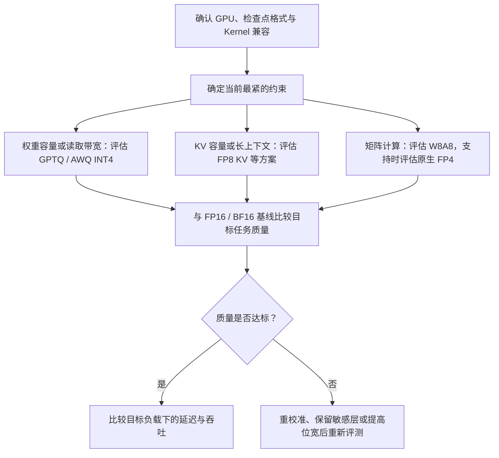

方法已经讲完了，现在把它们放回同一个部署问题：手里有一个模型和一张 GPU，应该先试哪种量化？选项可以很多，第一步却很具体——**找出当前最紧的约束，再筛掉硬件和推理后端不支持的路径。** 这一节先建立候选顺序，然后沿用第 3 章的 vLLM 环境，对比 FP16 与 AWQ INT4。

<!-- more -->

## 📑 目录

- [1. 从瓶颈出发选候选](#1-从瓶颈出发选候选)
- [2. vLLM 怎样识别量化模型](#2-vllm-怎样识别量化模型)
- [3. 启动 FP16 与 AWQ 服务](#3-启动-fp16-与-awq-服务)
- [4. 控制变量测离线吞吐](#4-控制变量测离线吞吐)
- [5. 生成质量怎样比较](#5-生成质量怎样比较)
- [6. 读懂结果与常见问题](#6-读懂结果与常见问题)
- [总结](#-总结)
- [自我检验清单](#-自我检验清单)
- [参考资料](#-参考资料)

---

## 1. 从瓶颈出发选候选



图中的分支代表优先试验的方向，可以组合使用。例如模型权重装不下、长上下文缓存也不足时，可以先验证 INT4 权重，再加入 FP8 KV Cache。硬件条件是候选的筛选项，质量门槛则是每条分支都要经过的一关。

| 首要约束 | 优先候选 | 下一步确认什么 |
|---|---|---|
| 精度退化容忍度低 | 以 FP16/BF16 为基线，先评估 INT8 或 FP8 W8A8 | 目标任务质量；8-bit 同样可能不达标 |
| 权重装不下、小 Batch 权重带宽紧 | GPTQ/AWQ INT4 | Group Size、Kernel、敏感层和容量 |
| 长上下文或并发被 KV 限制 | FP8 KV；有对应实现时评估更低位宽方案 | Attention 后端、Scale、长文本质量 |
| GEMM 计算占比高 | 设备支持的 W8A8；Blackwell 上可评估原生 FP4 | 实际算子路径及端到端收益 |

如果只是没有量化检查点，可以先通过 LLM Compressor、GPTQModel 或 NVIDIA Model Optimizer 等工具离线生成兼容格式。校准与导出本身是一段独立流程，本节主实验使用已有检查点，集中验证部署效果。

## 2. vLLM 怎样识别量化模型

### 2.1 方法、格式与 Kernel 要分开看

| 名称 | 主要处在哪一层 | 加载时看什么 |
|---|---|---|
| GPTQ、AWQ | 量化方法及其常见检查点格式 | 位宽、Group Size、零点、权重排列 |
| `compressed-tensors` | 可承载多种量化方案的格式/配置体系 | 实际方案可能是 INT8、INT4 或 FP8 等 |
| FP8、NVFP4、MXFP4 | 数值表示及对应缩放方案 | 检查点配置、硬件与后端 |
| Marlin 等 | 执行 Kernel | 是否匹配该权重布局与设备 |

vLLM 通常会读取模型配置中的量化信息，选择相应的加载与执行路径。`--quantization` 用于显式选择或确认某条支持的路径；除文档明确支持的在线量化方案外，它不会替你把任意 FP16 检查点离线转成 AWQ/GPTQ。

以 **vLLM v0.19.0 文档**为本节接口基线，下面是不同入口的含义；本地路径需要换成已导出的兼容检查点：

```bash
# 已有 AWQ 检查点
vllm serve Qwen/Qwen2.5-7B-Instruct-AWQ --quantization awq --dtype half

# 已有 compressed-tensors 检查点，由配置识别具体方案
vllm serve /path/to/compressed-tensors-model

# 已有 GPTQ 检查点，由配置及硬件选择相应路径
vllm serve /path/to/gptq-model

# 已有受支持的 NVFP4 检查点，先核对设备及导出格式
vllm serve /path/to/nvfp4-model

# 文档支持的在线 FP8 路径；激活与权重行为以该版本实现为准
vllm serve Qwen/Qwen2.5-7B-Instruct --quantization fp8
```

在线 FP8 会涉及加载时转换，峰值显存可能高于最终量化后的权重占用。若原始模型加载就会超出显存，可优先准备离线量化检查点。[FP8 说明](https://docs.vllm.ai/en/v0.19.0/features/quantization/fp8/)

上述几条命令是不同配置的入口，单次只启动一个。INT8 W8A8 的校准与导出可参考 [LLM Compressor 路径](https://docs.vllm.ai/en/v0.19.0/features/quantization/int8/)，NVFP4 的导出与加载可参考 [Model Optimizer 路径](https://docs.vllm.ai/en/v0.19.0/features/quantization/modelopt/)。版本升级后应重新检查支持矩阵及启动日志。

### 2.2 先保存实验环境

沿用第 3 章的 Linux/CUDA 环境；这里不重复安装。实验前至少记录：

```bash
python -c "import vllm, torch; print('vLLM:', vllm.__version__); print('PyTorch:', torch.__version__); print('CUDA:', torch.version.cuda)"
nvidia-smi
```

同时记录模型仓库的 revision，最好先下载固定快照，再把后面的模型参数替换为本地路径。GPU 型号、驱动、vLLM 版本、检查点配置和实际 Kernel 都是结果的一部分。下面没有预填吞吐数字，读者需要在自己的设备上测量。

## 3. 启动 FP16 与 AWQ 服务

先用原始模型跑 FP16 基线：

```bash
vllm serve Qwen/Qwen2.5-7B-Instruct \
    --served-model-name quant-demo \
    --dtype half \
    --max-model-len 4096 \
    --max-num-seqs 32 \
    --gpu-memory-utilization 0.9 \
    --generation-config vllm \
    --no-enable-prefix-caching
```

完成请求、保存日志并停止这个进程，确认显存释放后，再运行 AWQ：

```bash
vllm serve Qwen/Qwen2.5-7B-Instruct-AWQ \
    --served-model-name quant-demo \
    --quantization awq \
    --dtype half \
    --max-model-len 4096 \
    --max-num-seqs 32 \
    --gpu-memory-utilization 0.9 \
    --generation-config vllm \
    --no-enable-prefix-caching
```

两边保持相同的激活类型、上下文限制、并发上限与缓存精度。原始 Qwen 检查点以 BF16 发布，这里明确使用 FP16 作为本实验基线，便于与 AWQ 的 FP16 激活路径比较。[AWQ 模型卡](https://huggingface.co/Qwen/Qwen2.5-7B-Instruct-AWQ)

记录每次启动日志中的模型权重占用、可用 KV Token 容量和实际量化 Kernel。AWQ 权重减少后，vLLM 可能把腾出的预算用于 KV Cache，因此总显存占用未必按四分之一缩小。

## 4. 控制变量测离线吞吐

### 4.1 先回答一个有限的问题

下面的实验测量：**相同输入 Token、固定输出长度、相同引擎配置下，一批请求完成得多快？** 它不提供在线 TTFT/TPOT 的尾延迟，也不代表服务在真实到达率下的表现。在线压测的方法留给第 9 章。

关闭前面的在线服务，将下面代码保存为 `compare_quant.py`。脚本每次只加载一个模型，预热后测量三轮，保存输出 Token/s、总 Token/s 与生成样例。两种模型使用同一个 tokenizer 生成输入，吞吐阶段关闭 Prefix Cache，并忽略 EOS 以固定实际输出量。

```python
import argparse
import json
import statistics
import time
from pathlib import Path

from transformers import AutoTokenizer
from vllm import LLM, SamplingParams


def main():
    parser = argparse.ArgumentParser()
    parser.add_argument("--model", required=True)
    parser.add_argument("--tokenizer", default="Qwen/Qwen2.5-7B-Instruct")
    parser.add_argument("--quantization", default=None)
    parser.add_argument("--num-prompts", type=int, default=64)
    parser.add_argument("--input-len", type=int, default=512)
    parser.add_argument("--output-len", type=int, default=256)
    parser.add_argument("--save", required=True)
    args = parser.parse_args()
    if min(args.num_prompts, args.input_len, args.output_len) <= 0:
        parser.error("请求数和 Token 长度必须为正")
    if args.input_len + args.output_len > 4096:
        parser.error("输入与输出之和不能超过本实验的 4096 Token 上限")

    tokenizer = AutoTokenizer.from_pretrained(args.tokenizer)
    # 构造可重复的等长输入。这里只测速度，不用这批重复文本评质量。
    prompts = []
    for i in range(args.num_prompts):
        unit = tokenizer.encode(
            f"请求编号 {i}。请解释量化对推理显存和计算的影响。",
            add_special_tokens=False,
        )
        ids = (unit * (args.input_len // len(unit) + 1))[:args.input_len]
        prompts.append({"prompt_token_ids": ids})

    llm = LLM(
        model=args.model,
        tokenizer=args.tokenizer,
        quantization=args.quantization,
        dtype="half",
        max_model_len=4096,
        max_num_seqs=32,
        max_num_batched_tokens=2048,
        gpu_memory_utilization=0.9,
        kv_cache_dtype="auto",
        enable_prefix_caching=False,
        generation_config="vllm",
        seed=0,
    )
    params = SamplingParams(
        temperature=0, max_tokens=args.output_len, ignore_eos=True, seed=0
    )
    llm.generate(prompts, params, use_tqdm=False)  # 完整负载预热，不计时
    measurements = []
    for _ in range(3):
        start = time.perf_counter()
        outputs = llm.generate(prompts, params, use_tqdm=False)
        elapsed = time.perf_counter() - start
        output_tokens = sum(len(o.outputs[0].token_ids) for o in outputs)
        expected = args.num_prompts * args.output_len
        if output_tokens != expected:
            raise RuntimeError(f"实际输出 {output_tokens}，预期 {expected}")
        input_tokens = sum(len(o.prompt_token_ids) for o in outputs)
        measurements.append({
            "seconds": elapsed,
            "output_tokens_per_second": output_tokens / elapsed,
            "total_tokens_per_second": (input_tokens + output_tokens) / elapsed,
        })

    # 质量样例恢复正常 EOS，并使用一致的 Chat Template；不纳入吞吐计时。
    questions = [
        "只返回 JSON：name 为 Alice，count 为整数 3，不要 Markdown 围栏。",
        "有 17 箱货物，每箱 24 件，发出 89 件后还剩多少件？给出计算。",
        "写一个 Python 函数，判断字符串是否为回文，忽略大小写和非字母数字字符。",
    ]
    chats = [[{"role": "user", "content": q}] for q in questions]
    texts = [tokenizer.apply_chat_template(
        chat, tokenize=False, add_generation_prompt=True
    ) for chat in chats]
    examples = llm.generate(
        texts, SamplingParams(temperature=0, max_tokens=512, seed=0),
        use_tqdm=False,
    )
    result = {
        "config": vars(args),
        "runs": measurements,
        "median_output_tokens_per_second": statistics.median(
            r["output_tokens_per_second"] for r in measurements
        ),
        "examples": [
            {"question": q, "answer": o.outputs[0].text}
            for q, o in zip(questions, examples)
        ],
    }
    Path(args.save).write_text(
        json.dumps(result, ensure_ascii=False, indent=2), encoding="utf-8"
    )
    print(json.dumps(result, ensure_ascii=False, indent=2))


if __name__ == "__main__":
    main()
```

### 4.2 分别运行两个进程

```bash
python compare_quant.py \
    --model Qwen/Qwen2.5-7B-Instruct \
    --save fp16.json

python compare_quant.py \
    --model Qwen/Qwen2.5-7B-Instruct-AWQ \
    --quantization awq \
    --save awq-int4.json
```

第一条结束后再运行第二条，避免两个引擎争用显存。两边各会提交 64 个请求，每请求输入 512、输出 256 Token，引擎同时处理的序列上限为 32。可以再给两条命令都加上 `--num-prompts 1 --input-len 64`，单独观察小 Batch 场景；每组结果分别保存。

计时包围完整的阻塞式 `generate()` 调用，包含本地引擎调度和输出整理，模型下载、加载、首次预热不计入吞吐。进行严肃性能对比时，保持 GPU 空闲状态一致，交替运行两种配置并观察波动；需要分析算子时间时，再使用第 9 章的 Profiling 方法。

## 5. 生成质量怎样比较

脚本里的三条问题是冒烟检查，帮助发现明显的格式、算术和代码能力退化：

| 样例 | 检查方法 |
|---|---|
| JSON 输出 | 能解析为对象，字段和值正确，`count` 为整数 |
| 算术 | 应得到 $17\times24-89=319$，过程与答案一致 |
| 回文函数 | 检查空串、`A man, a plan, a canal: Panama`、`ab` 等输入 |

两份文本逐字不同并不等于质量退化，温度为 0 也无法保证不同数值路径输出完全相同。应按任务要求评分，统计通过率变化。

正式评测需要独立于校准集，并覆盖实际业务：中文指令、代码、数学、结构化输出、长文档问答等。固定 Prompt、Chat Template、最大生成长度与评分规则，再比较基线和量化模型。PPL 可作为语言建模损失的补充指标，但不能替代代码正确率或检索准确率。

如果某类任务退化明显，先检查模板、截断和量化配置；确认评测一致后，再考虑更细粒度、保留敏感层高精度、提高位宽，或重新校准。只有在 PTQ 仍达不到目标且具备训练条件时，再评估 QAT。

## 6. 读懂结果与常见问题

建议把两份 JSON 与启动日志整理成下面的表。没有实际运行的项目保留为空，不用论文或其他设备的数字代填：

| 指标 | FP16 基线 | AWQ INT4 |
|---|---|---|
| 模型 revision / vLLM / GPU | 待记录 | 待记录 |
| 实际量化 Kernel | 不适用或基线 GEMM | 待记录 |
| 模型权重占用 / KV Token 容量 | 待记录 | 待记录 |
| 输出 Token/s 中位数（3 轮） | 待测 | 待测 |
| 总 Token/s 与输入输出长度 | 待测 | 待测 |
| 任务通过率 / 失败样例 | 待评测 | 待评测 |

输出 Token/s 的比值可以作为这组固定负载的加速比。把输入 Token 也计入的总吞吐应另列，不能用两种不同口径互相比较。

| 现象 | 优先检查 |
|---|---|
| 指定 `awq` 后仍无法加载 | 是否使用真正的 AWQ 检查点，配置与工具版本是否匹配 |
| INT4 装得下却比 FP16 慢 | 实际 Kernel、矩阵形状、反量化开销和当前瓶颈 |
| 总显存几乎没有下降 | KV 池是否利用了省出的权重空间，查看缓存 Token 容量 |
| 小 Batch 快，大 Batch 改善不大 | 权重搬运占比是否下降，GEMM 是否转向计算受限 |
| 长文本质量下降 | KV 精度、Scale、长度截断及长文本校准/评测覆盖 |

若 FP16 基线在当前设备上无法运行，应如实记录容量限制。可以减少共同负载或在足够显存的设备上重做对照；只跑出量化模型，能够证明部署可行，还无法得出相对 FP16 的速度提升。

## 📝 总结

- 先从权重、KV 或计算瓶颈选候选，再检查硬件与后端兼容性。
- 方法、检查点格式、数值类型和执行 Kernel 共同决定部署行为。
- 对照实验需要固定模型来源、输入输出、引擎配置与测量口径。
- 量化的最终价值是满足质量和延迟要求后的资源或吞吐收益。

## 🎯 自我检验清单

- 能根据当前瓶颈说明首先尝试哪种量化及原因
- 能解释 `compressed-tensors` 为什么没有唯一的位宽
- 能区分压缩比、离线吞吐加速比与在线延迟指标
- 能指出这个实验控制了哪些变量，以及还需要哪些质量评测

## 📚 参考资料

- [vLLM 量化支持矩阵](https://docs.vllm.ai/en/stable/features/quantization/)
- [vLLM v0.19.0 — AWQ](https://docs.vllm.ai/en/v0.19.0/features/quantization/auto_awq/)
- [Qwen2.5-7B-Instruct-AWQ 模型卡](https://huggingface.co/Qwen/Qwen2.5-7B-Instruct-AWQ)
- [vLLM v0.19.0 — INT8 W8A8](https://docs.vllm.ai/en/v0.19.0/features/quantization/int8/)
- [vLLM v0.19.0 — NVIDIA Model Optimizer](https://docs.vllm.ai/en/v0.19.0/features/quantization/modelopt/)
