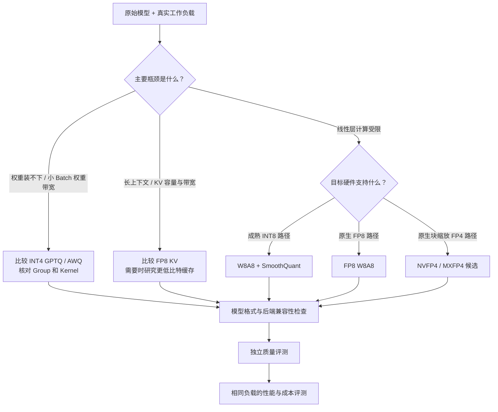

前五节已经备齐了工具箱：W8A8 用低精度计算，INT4 重点减轻权重搬运，KV 量化缓解长上下文容量，FP8 和 FP4 进一步对接硬件能力。现在轮到真正的工程问题：**我的模型、GPU 和业务，到底应该从哪种方案开始试？**

本节先给出一棵带前提的决策树，再走完一次 vLLM 对比实验：用同源的 FP16 和 AWQ-INT4 模型，在相同条件下测吞吐与延迟，再检查生成质量。目标不是得到一张漂亮的“快了几倍”截图，而是形成一套能解释结果、能复测、能据此做部署选择的方法。

<!-- more -->

## 📑 目录

- [1. 先确定瓶颈和质量门槛](#1-先确定瓶颈和质量门槛)
- [2. 量化决策树：先选候选，再做验证](#2-量化决策树先选候选再做验证)
- [3. vLLM 量化生态：算法、格式与开关](#3-vllm-量化生态算法格式与开关)
- [4. 准备对照实验：把变量钉住](#4-准备对照实验把变量钉住)
- [5. 启动 FP16 与 AWQ-INT4 服务](#5-启动-fp16-与-awq-int4-服务)
- [6. 性能对比：吞吐、TTFT 与 TPOT](#6-性能对比吞吐ttft-与-tpot)
- [7. 生成质量：同一批问题，两份结果](#7-生成质量同一批问题两份结果)
- [8. 解释结果与排查失败](#8-解释结果与排查失败)
- [总结](#-总结)
- [自我检验清单](#-自我检验清单)
- [参考资料](#-参考资料)

---

## 1. 先确定瓶颈和质量门槛

量化选型的顺序应该是：**先确认服务目标，再识别瓶颈，最后挑低比特方案。** 只问“哪种量化最快”，缺了模型、请求分布和质量约束，答案就没有落脚点。

先写下四件事：

1. 模型与能力：原模型版本、业务任务、允许的质量下降范围。
2. 工作负载：输入/输出长度分布、并发、请求到达速率、多轮与长文占比。
3. 资源：GPU 型号、显存、卡数、通信链路与推理框架版本。
4. 服务指标：TTFT、TPOT、P95/P99、吞吐以及单位合格请求的成本。

例如“P95 TTFT 不超过 1 秒、P95 TPOT 不超过 50 ms”是一组**示例服务门槛**，不是通用标准。先定好业务自己的门槛，后面的 Benchmark 才知道什么叫通过。

📌 **关键点**：质量不达标的吞吐没有部署价值；同样，只有平均吞吐提高、尾延迟却超标，也不能直接宣称方案更好。

---

## 2. 量化决策树：先选候选，再做验证

第四章总览给出的“精度优先 W8A8、省显存 INT4、长上下文 KV、Hopper FP8、Blackwell FP4”，可以当作起点，但必须加上兼容性与评测前提。



| 🎯 优先目标 | 首批候选 | 必须核对的条件 |
|---|---|---|
| 尽量守住质量 | 原始精度基线，比较 INT8/FP8 | 校准覆盖、敏感层、独立任务评测 |
| 更小的权重显存 | GPTQ/AWQ INT4 | 导出参数、兼容的融合 Kernel |
| 更长上下文/更多并发 | KV Cache 量化 | KV 结构、Scale、Attention 后端、长文质量 |
| Hopper 等原生 FP8 硬件 | FP8 W8A8 | 量化粒度、实际 GEMM、累加方式 |
| Blackwell 等块缩放低精度硬件 | NVFP4/MXFP4 | 具体型号、完整格式、Kernel 与质量 |

这棵树只产生**候选集合**。如果 CPU、通信或调度是主要瓶颈，量化也许不是第一优先级；如果质量要求十分严格，原始 FP16/BF16 应继续作为可部署方案参与比较。

---

## 3. vLLM 量化生态：算法、格式与开关

### 3.1 先区分三个名字

| 📦 层次 | 举例 | 回答的问题 |
|---|---|---|
| 量化算法 | SmoothQuant、GPTQ、AWQ、RTN | 怎样得到低比特近似 |
| 保存格式与方案元数据 | GPTQ/AWQ checkpoint、compressed-tensors、ModelOpt | 怎样保存编码、Scale、分组与配置 |
| 计算实现 | Marlin、CUTLASS、FlashInfer 等 | 目标硬件上怎样执行 |

`compressed-tensors` 可以承载多种量化配置，不是某一种位宽；同一算法也可能由不同工具导出，并采用不同 Kernel。

### 3.2 常见加载方式

下面路径均指**已按相应格式完成导出的模型**：

```bash
vllm serve ./model-awq --quantization awq
vllm serve ./model-gptq --quantization gptq
vllm serve ./model-compressed --quantization compressed-tensors
vllm serve ./model-modelopt-nvfp4 --quantization modelopt_fp4
```

模型配置正确时，框架也可能自动识别。显式指定参数有助于说明预期，却不会替原始权重现场完成 AWQ 搜索或 GPTQ 校准。

FP8 既有预量化模型，也有在线量化路径；当前官方文档对在线路径使用 `fp8_per_tensor`。旧版本可能有不同名称和行为，所以使用前先检查 `vllm serve --help` 与对应版本的文档，不应把某个开关当成长期不变的协议。

💡 **提示**：模型能启动只证明一部分兼容性。还要看启动日志中的实际 Kernel、量化方案、KV 容量，以及是否有回退或精度警告。[官方兼容矩阵](https://docs.vllm.ai/en/stable/features/quantization/)是起点，目标版本的日志与源码才说明实际执行了什么。

---

## 4. 准备对照实验：把变量钉住

本节选用同一模型家族的两个官方 checkpoint：

- 基线：`Qwen/Qwen2.5-7B-Instruct`，本实验显式以 FP16 加载。
- 量化：`Qwen/Qwen2.5-7B-Instruct-AWQ`，W4A16。

正式实验还应保存两个仓库的 revision；若量化包的源 revision 无法确认，记录这一限制。仅凭相似模型名，不能证明导出来源完全一致。

使用支持当前 vLLM 和相应 GPU Kernel 的 Linux/WSL2 环境。确认基线能够装下，同时留出 KV、激活和 CUDA Graph 空间；不要用“INT4 单卡、FP16 双卡”来声称单变量的量化加速。

```bash
# 在选定并固定版本的 vLLM 环境中记录配置。
python -c "import torch, vllm; print('torch:', torch.__version__); print('vllm:', vllm.__version__); print('cuda:', torch.version.cuda)"
nvidia-smi
vllm serve --help
vllm bench serve --help
```

两组保持 GPU、卡数、输入、Tokenizer、KV dtype、上下文上限、调度参数与采样配置相同。先比较相同并发；再单独比较各自满足服务门槛时的最大吞吐，后者允许调优，但必须说明变化了哪些参数。

⚠️ **注意**：以下命令按撰写时的官方 CLI 编写，参数名称与默认值会演进。先把版本与 `--help` 输出记入实验记录，再执行；不要把升级框架带来的变化混入量化收益。

---

## 5. 启动 FP16 与 AWQ-INT4 服务

### 5.1 先跑基线

在终端 A 启动服务：

```bash
vllm serve Qwen/Qwen2.5-7B-Instruct \
  --served-model-name quant-demo \
  --dtype half \
  --kv-cache-dtype auto \
  --max-model-len 8192 \
  --max-num-seqs 32 \
  --max-num-batched-tokens 4096 \
  --gpu-memory-utilization 0.90 \
  --no-enable-prefix-caching \
  --port 8000
```

本次关闭 Prefix Cache，是为了避免重复 Prompt 命中缓存造成对比偏差；真实业务是否开启，应在后续业务实验中另行比较。`auto` 在这组设置下随模型计算 dtype 使用高精度缓存，没有同时引入 FP8 KV 变量。

等服务完成加载、编译与 CUDA Graph 捕获，再在终端 B 检查：

```bash
curl http://localhost:8000/health
curl http://localhost:8000/v1/models
```

记录原模型权重加载量、KV Token 容量和主要后端日志。模型的启动耗时单独记录，不混入稳定服务期间的吞吐。

### 5.2 完成基线实验后，再启动量化组

先完成下两节的性能与质量采集，再在终端 A 用 `Ctrl+C` 停止基线，确认进程退出、GPU 资源释放，然后启动：

```bash
vllm serve Qwen/Qwen2.5-7B-Instruct-AWQ \
  --served-model-name quant-demo \
  --quantization awq \
  --dtype half \
  --kv-cache-dtype auto \
  --max-model-len 8192 \
  --max-num-seqs 32 \
  --max-num-batched-tokens 4096 \
  --gpu-memory-utilization 0.90 \
  --no-enable-prefix-caching \
  --port 8000
```

不要让两份模型同时挤在同一张卡上测性能。统一服务名 `quant-demo`，是为了让客户端请求完全相同；客户端使用的 Tokenizer 则明确指定为原模型的 Tokenizer。

---

## 6. 性能对比：吞吐、TTFT 与 TPOT

### 6.1 先测固定长度的合成负载

在终端 B 执行，第一轮的标签用 `fp16`，切换 AWQ 服务后用 `awq-int4` 再执行同一命令：

```bash
# Bash 示例。切换服务后仅改标签，保持请求参数相同。
LABEL=fp16
mkdir -p results

vllm bench serve \
  --backend openai \
  --base-url http://localhost:8000 \
  --endpoint /v1/completions \
  --model quant-demo \
  --tokenizer Qwen/Qwen2.5-7B-Instruct \
  --dataset-name random \
  --random-input-len 512 \
  --random-output-len 128 \
  --random-range-ratio 0 \
  --num-prompts 256 \
  --num-warmups 16 \
  --max-concurrency 32 \
  --request-rate inf \
  --ignore-eos \
  --seed 42 \
  --save-result \
  --result-dir results \
  --result-filename "${LABEL}-c32.json"
```

当前 CLI 中 `--random-range-ratio 0` 表示固定名义长度。还应检查结果里的实际输入/输出 Token 数，避免解码再分词或版本变化影响计数。`--ignore-eos` 防止提前结束让两组工作量不同；这是性能实验设置，质量测试应允许自然结束。

`--request-rate inf` 与并发上限配合，表示尽可能把固定数量的并发槽填满。这是饱和负载测试，不等同于生产流量分布。[vLLM Benchmark CLI](https://docs.vllm.ai/en/stable/cli/bench/serve/)解释了这些参数。

### 6.2 再测曲线，不只测一个点

分别把并发改为 1、8、32，并改变输入/输出长度，例如短 Prompt 长生成、长 Prompt 短生成。每组预热后至少重复几次，保留原始 JSON，再汇总稳定结果。

合成随机输入只用于控制性能变量。还需要用同一份真实业务请求做有限到达速率的测试，观察排队和尾延迟。

| 📊 指标 | 看什么 | 常见误读 |
|---|---|---|
| Output Token Throughput | 每秒实际生成 Token 数 | 把输入+输出总吞吐当输出吞吐 |
| TTFT | 排队、Prefill 与首 Token 的综合延迟 | 只看平均值，不看 P95/P99 |
| TPOT / ITL | 输出过程的 Token 延迟 | 只看吞吐，忽略单用户等待 |
| 成功请求数 | 是否所有请求完成 | 错误/OOM 后仍比较剩余请求速度 |
| KV Token 容量 | 相同预算下的缓存能力 | 把预分配显存当活跃请求显存 |

输出吞吐比可以写成：

$$
S_{\text{throughput}}=\frac{R_{\text{AWQ}}}{R_{\text{FP16}}}
$$

但只有在相同工作量、成功条件和质量门槛下，这个比值才有意义。这里不填入未经实测的性能数字。

---

## 7. 生成质量：同一批问题，两份结果

### 7.1 先做一个可复查的冒烟测试

把下面的代码保存为 `compare_quality.py`。它只使用 Python 标准库，调用刚启动的 Chat API；三个可客观检查的小问题覆盖算术、信息抽取和 JSON 格式。

```python
import json
import sys
from pathlib import Path
from urllib.request import Request, urlopen

CASES = [
    {"id": "arithmetic", "prompt": "7 台机器，每台每小时完成 3 个任务。一小时共完成多少个？只输出整数。", "expected": "21"},
    {"id": "retrieval", "prompt": "记录：gpu=H100；kv_block_size=16；max_num_seqs=32。只输出 kv_block_size 的整数值。", "expected": "16"},
    {"id": "json", "prompt": "只输出一个 JSON 对象：gpu 的值为字符串 H100，bits 的值为整数 8。不要代码块或解释。", "expected": {"gpu": "H100", "bits": 8}},
]

def request_chat(prompt):
    payload = {
        "model": "quant-demo",
        "messages": [{"role": "user", "content": prompt}],
        "temperature": 0,
        "seed": 42,
        "max_tokens": 128,
    }
    request = Request(
        "http://localhost:8000/v1/chat/completions",
        data=json.dumps(payload).encode("utf-8"),
        headers={"Content-Type": "application/json"},
    )
    with urlopen(request, timeout=120) as response:
        return json.load(response)

def matches(text, expected):
    if isinstance(expected, dict):
        try:
            return json.loads(text) == expected
        except json.JSONDecodeError:
            return False
    return text.strip() == expected

label = sys.argv[1]  # fp16 或 awq-int4
rows = []
for case in CASES:
    response = request_chat(case["prompt"])
    choice = response["choices"][0]
    text = choice["message"]["content"] or ""
    rows.append({
        **case,
        "output": text,
        "finish_reason": choice["finish_reason"],
        "usage": response.get("usage"),
        "passed": matches(text, case["expected"]),
    })

Path("results").mkdir(exist_ok=True)
Path(f"results/{label}-quality.json").write_text(
    json.dumps(rows, ensure_ascii=False, indent=2), encoding="utf-8"
)
print(label, "通过:", sum(row["passed"] for row in rows), "/", len(rows))
```

在基线服务期间运行 `python compare_quality.py fp16`，切换 AWQ 后运行 `python compare_quality.py awq-int4`，比较两份 JSON 的答案、结束原因与 Token 用量。若 `finish_reason` 为 `length`，说明达到了输出上限，应先判断是否是长度配置问题。

📌 **关键点**：三个题只检查服务与格式，**不能证明量化模型的总体质量**。它们的作用是先发现明显错误，再进入正式任务评测。

### 7.2 再扩展到独立的业务评测集

评测集应独立于校准数据，并覆盖中文/英文、数学、代码、结构化输出、长文检索、多轮和长生成。为每类任务定义客观指标，例如最终答案正确率、代码测试通过率、JSON Schema 合规率、引用准确率。

同时保留原始模型和量化模型的逐题输出。温度设为 0、使用相同输入，可以减少采样差异，但浮点 Kernel 和并发安排仍可能导致输出不完全一致；“字面上一样”不应是所有任务唯一的质量标准。

如果继续测试 FP8 KV，应在已固定的权重方案上单独加这个变量，并用真实缓存生成检查长上下文，避免把权重误差和缓存误差混在一起。

---

## 8. 解释结果与排查失败

### 8.1 用一张表交代结论

实验记录建议包含以下字段，数值全部填实测结果：

| 记录项 | FP16 基线 | AWQ-INT4 |
|---|---|---|
| 模型 revision、框架版本、GPU | 实测配置 | 实测配置 |
| 实际量化与 Kernel 路径 | 日志记录 | 日志记录 |
| 输入/输出 Token 数、并发、成功请求数 | 结果 JSON | 结果 JSON |
| 输出吞吐、P95 TTFT、P95 TPOT | 实测值 | 实测值 |
| KV Token 容量、峰值显存口径 | 日志与采集说明 | 日志与采集说明 |
| 业务任务分项质量 | 评测结果 | 评测结果 |

### 8.2 四种常见结果怎么读

- **权重省了，吞吐没升**：可能只有容量收益，也可能是大 Batch 已经 Compute Bound、Kernel 不合适或 Attention 占主导。
- **低并发更快，高并发差距缩小**：可能符合 Weight-only 的带宽逻辑；再看 Prefill 与 Decode 分项。
- **吞吐更高，P95 延迟变差**：可能更多请求进入 Batch，单请求或排队时间增加。应该在同样服务门槛下比较。
- **大多数题没变化，少数任务明显退化**：回看校准覆盖、敏感层、Group 和原始 revision；不能用平均分掩盖关键任务失败。

### 8.3 从失败回到下一轮实验

| 🔍 问题 | 优先处理 |
|---|---|
| 指定量化方法却加载报错 | 检查 checkpoint 元数据、方法名称、模型与硬件兼容性 |
| AWQ 权重装下，长请求仍 OOM | 单独计算 KV 与激活，调整上下文/并发或验证 KV 量化 |
| 启动日志有回退或不支持提示 | 检查实际 Kernel、依赖版本、Group 与布局 |
| Chat 输出异常 | 两组都核对 Tokenizer、Chat Template、特殊 Token 和结束设置 |
| 性能结果波动大 | 隔离其他 GPU 任务、预热、固定负载，保留重复测量 |

用一句话收束整套流程：**量化算法给出候选，兼容性筛掉不可部署项，质量评测设门槛，性能与成本评测决定最终选择。** 新硬件和更低位宽提供新的机会，但这套顺序始终成立。

---

## 📝 总结

- 选型从业务质量、服务指标和主要瓶颈出发，INT4、W8A8、KV、FP8/FP4 是候选路线。
- 算法、checkpoint 格式与 Kernel 是不同层次，量化开关必须与实际产物匹配。
- FP16/AWQ 对照实验要固定 GPU、模型来源、Tokenizer、KV 精度、请求长度和调度参数。
- 先同并发比较，再做满足延迟门槛的容量与成本比较，明确每组变化的条件。
- 性能测试允许固定输出长度，质量测试应使用正常结束行为与独立任务集。
- 三题冒烟测试只验证基本行为，正式结论需要任务分项质量和长上下文生成结果。
- 不预设加速倍数；通过日志、原始 JSON 和逐题输出解释实际收益与代价。

## 🎯 自我检验清单

- 能根据权重、KV、计算或调度瓶颈挑出首批量化候选
- 能区分 SmoothQuant/GPTQ/AWQ、compressed-tensors/ModelOpt 与 Marlin 等 Kernel
- 能解释为什么给原始模型加 `--quantization awq` 不等于完成 AWQ 校准
- 能用相同 GPU 与参数依次启动 FP16 和 AWQ 对照服务
- 能说明随机负载、固定并发与生产到达率测试的差别
- 能区分输出吞吐、TTFT、TPOT/ITL 与尾延迟
- 能说明性能测试中的 `ignore-eos` 为什么不应套进质量结论
- 能根据 Kernel、缓存容量和逐题质量记录判断量化是否值得部署

## 📚 参考资料

- [vLLM — Quantization 与硬件兼容矩阵](https://docs.vllm.ai/en/stable/features/quantization/)
- [vLLM — LLM Compressor](https://docs.vllm.ai/en/stable/features/quantization/llm_compressor/)
- [vLLM — NVIDIA Model Optimizer](https://docs.vllm.ai/en/stable/features/quantization/modelopt/)
- [vLLM — Benchmark CLI：bench serve](https://docs.vllm.ai/en/stable/cli/bench/serve/)
- [vLLM — OpenAI-Compatible Server](https://docs.vllm.ai/en/stable/serving/openai_compatible_server/)
- [Qwen — Qwen2.5-7B-Instruct 模型卡](https://huggingface.co/Qwen/Qwen2.5-7B-Instruct)
- [Qwen — Qwen2.5-7B-Instruct-AWQ 模型卡](https://huggingface.co/Qwen/Qwen2.5-7B-Instruct-AWQ)
- [EleutherAI — Language Model Evaluation Harness](https://github.com/EleutherAI/lm-evaluation-harness)
