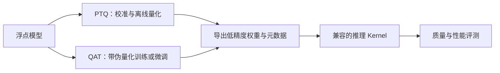

前三章一直在回答两个问题：显存怎么用得更满，GPU 怎么少等一点。但还有一个更直接的切入口——**同样一个数字，能不能用更少的字节表示？** 一个 70B 模型用 16-bit 存权重，光权重就约 140 GB；如果主要权重能压到 4-bit，理论上的数据量就降到约 35 GB。模型没变小，数字的“包装”变小了。这就是量化的出发点。

这一节先把量化的地基打牢：压缩到底发生在哪里，Scale 和 Zero-point 怎么工作，为什么粒度会影响精度，以及训练后量化和量化感知训练该怎么选。后面 SmoothQuant、GPTQ、AWQ 和 FP8，都是在这些基础问题上给出不同的答案。

阅读起点：[4.1 基础笔记](https://caomaolufei.github.io/AIInfraGuide/inference/模块四-推理优化/第4章-量化/41-量化基础/)。本篇在基础概念之上，补充显存/带宽账本、量化误差与 CPU 实验；公式布局以本篇显式约定为准。

<!-- more -->

## 📑 目录

- [1. 先算账：量化省下的是什么](#1-先算账量化省下的是什么)
- [2. 量化与反量化：Scale 和 Zero-point](#2-量化与反量化scale-和-zero-point)
- [3. 对称与非对称：零点放在哪里](#3-对称与非对称零点放在哪里)
- [4. 量化粒度：一把尺子还是多把尺子](#4-量化粒度一把尺子还是多把尺子)
- [5. 误差从哪里来：舍入与截断](#5-误差从哪里来舍入与截断)
- [6. 静态与动态：什么时候确定尺子](#6-静态与动态什么时候确定尺子)
- [7. PTQ 与 QAT：训练后压缩还是带着误差训练](#7-ptq-与-qat训练后压缩还是带着误差训练)
- [8. 动手实验：观察粒度与离群值的影响](#8-动手实验观察粒度与离群值的影响)
- [总结](#-总结)
- [自我检验清单](#-自我检验清单)
- [参考资料](#-参考资料)

---

## 1. 先算账：量化省下的是什么

### 1.1 权重、激活、KV Cache 是三笔不同的账

推理显存大致可以拆成：

$$
M_{\text{total}} = M_{\text{weights}} + M_{\text{KV}} + M_{\text{activations}} + M_{\text{workspace}}
$$

量化可以作用在不同项上，不能看到“4-bit 模型”就默认所有东西都变成 4-bit。

| 📊 量化对象 | 存的是什么 | 主要收益 | 需要解决的问题 |
|---|---|---|---|
| Weight（权重） | 模型参数，推理时基本不变 | 模型装得下，减少权重读取量 | 权重误差、打包布局、GEMM Kernel |
| Activation（激活） | 当前输入经过网络的中间结果 | 降低部分激活开销，使用低精度计算 | 输入分布变化、离群值、运行时量化开销 |
| KV Cache | 每个请求累积的历史 Key、Value | 容纳更长上下文和更多请求 | 缓存误差、Scale 存储、Attention 后端 |

常见记号 **W4A16** 表示权重用 4-bit、激活保留 16-bit；**W8A8** 表示权重和激活都用 8-bit。记号只说明位宽，INT8 还是 FP8、粒度是什么、KV Cache 是否量化，还得另外交代。

📌 **关键点**：**Weight-only INT4 不会自动把 KV Cache 变成 INT4。** 长上下文服务即便装了一个很小的权重文件，也可能被 KV Cache 挤满显存。

### 1.2 压缩比不能直接当加速比

对 $N$ 个被量化的权重，位宽为 $b$，每 $G$ 个元素存一组元数据，近似存储量是：

$$
M_{\text{weights}} \approx N\frac{b}{8} + \frac{N}{G}m_{\text{meta}}
$$

这里 $m_{\text{meta}}$ 是每组 Scale、Zero-point 等元数据的字节数。还没算未量化层、Padding 和 Kernel 所需的重排。以每组 128 个 INT4 权重加一个 2-byte Scale 为例，平均每个权重占 $0.5 + 2/128 = 0.515625$ 字节，而不是严格的 0.5 字节。

用一个类比：压缩行李能少占后备箱，但旅程能不能更快，还取决于装卸行李要多久、道路是否堵车。量化也一样——它减少搬运量，同时引入量化、解包和反量化开销。

小 Batch 的 Decode 常受权重带宽限制，Weight-only 更容易见效；大 Batch 或长 Prompt 的矩阵乘法可能更受算力限制，W8A8 的低精度计算更有发挥空间。实际瓶颈还要结合模型、上下文长度和 Kernel 判断。

---

## 2. 量化与反量化：Scale 和 Zero-point

先想象一把只能标出有限刻度的尺子。浮点数可以落在两个刻度之间，而整数编码必须选一个刻度。**Scale 决定刻度间距，Zero-point 决定实数零对应哪个整数。** [ONNX 的 QuantizeLinear 定义](https://onnx.ai/onnx/operators/onnx__QuantizeLinear.html)采用的就是这种线性映射。

对实数 $x$，一套常见的均匀仿射量化写成：

$$
q = \operatorname{clip}\left(\operatorname{round}\left(\frac{x}{s}\right) + z,\ q_{\min},\ q_{\max}\right)
$$

反量化得到近似值：

$$
\hat{x} = s(q-z)
$$

- $s > 0$：Scale，相邻整数刻度在实数域中的间隔。
- $z$：Zero-point，实数 0 对应的整数编码。
- $q_{\min}, q_{\max}$：编码的合法范围。
- `clip`：超出范围时饱和到边界。

举个小例子：$s=0.1$、$z=0$ 时，$x=0.26$ 被编码为 $q=3$，反量化后得到 $\hat{x}=0.3$，误差为 0.04。并没有无损地把 0.26 “换一种类型保存”，它已经被近似了。

🔑 **核心概念**：**量化保存的是“整数编码 + 尺子”，不是只保存整数。** 丢了 Scale，整数 3 到底代表 0.3 还是 30，就无从判断。

反量化也不意味着必须把完整矩阵恢复到显存。有的 Kernel 在读取一个 Tile 后，就在寄存器中解包、反量化并立即计算；这正是 Weight-only 量化能减少显存流量的关键。

---

## 3. 对称与非对称：零点放在哪里

### 3.1 对称量化：围绕零铺刻度

对称量化把实数范围设成 $[-a,a]$，通常令 $z=0$。本文采用常见的 signed INT8 窄范围 $[-127,127]$，于是：

$$
a = \max |x|, \qquad s = \frac{a}{127}
$$

例如范围为 $[-2,2]$，则 $s=2/127$。好处是零点处理简单；坏处是如果数据几乎都在正半轴，负半轴的编码就利用不足。具体 Kernel 也可能使用完整的 $[-128,127]$ 范围，必须和导出格式保持一致。

### 3.2 非对称量化：让刻度贴着数据范围

非对称量化允许左右边界不同。为了保证实数零可表示，先令 $x_{\min}$、$x_{\max}$ 的统计范围包含 0，再计算：

$$
s = \frac{x_{\max}-x_{\min}}{q_{\max}-q_{\min}}, \qquad
z = \operatorname{clip}\left(\operatorname{round}\left(q_{\min}-\frac{x_{\min}}{s}\right), q_{\min}, q_{\max}\right)
$$

假设数据范围为 $[0,6]$，使用 unsigned INT8 的 $[0,255]$，则 $s=6/255$、$z=0$。同样是 256 个编码，全部用在非负数上；如果用围绕零的对称量化，就会把一部分编码留给不存在的负数。

| 📊 维度 | 对称量化 | 非对称量化 |
|---|---|---|
| 实数范围 | 围绕零对称 | 可偏向一侧 |
| Zero-point | 常为 0 | 随范围确定 |
| 实现代价 | 较容易简化 | 可能需要零点修正 |
| 适用判断 | 数据近似对称，Kernel 支持良好 | 数据明显偏移，能充分利用编码 |

⚠️ **注意**：非对称不代表“一定更准且同样快”。额外元数据、整数乘法中的零点修正，以及现成 Kernel 支持，都可能影响最终收益。

---

## 4. 量化粒度：一把尺子还是多把尺子

### 4.1 不同粒度到底沿哪个轴

一整个张量共用一个 Scale，叫 **Per-tensor**；每个通道单独用一个 Scale，叫 **Per-channel**；沿指定轴每 $G$ 个元素共用一组参数，叫 **Per-group**。激活还常用 **Per-token**。

“Per-channel”不能只背名字，必须看张量形状。PyTorch `Linear` 的权重通常是 `[out_features, in_features]`，常见的 Per-output-channel 就是每一行一把尺子；INT4 常沿每行的输入维度继续切 Group。对 `[tokens, hidden]` 的激活，Per-token 则是每一行一把尺子。[PyTorch 量化文档](https://docs.pytorch.org/docs/stable/quantization.html)可以帮助对齐这些术语。

```text
权重 W：[输出通道, 输入通道]

Per-tensor：整张表 → 1 组参数
Per-channel：每个输出通道 → 1 组参数
Per-group：每个输出通道内，每 G 个输入通道 → 1 组参数

激活 X：[Token, 输入通道]
Per-token：每个 Token → 1 组参数
```

### 4.2 为什么更细往往更准

假设一行权重的范围是 $[-0.1,0.1]$，另一行是 $[-10,10]$。Per-tensor 为照顾第二行，Scale 必须很大，第一行会挤在零附近的少数刻度里；Per-channel 就能让两行各用适合自己的尺子。

| 📊 粒度 | 精度上的机会 | 工程上的代价 |
|---|---|---|
| Per-tensor | 实现简单，但易被最大值支配 | 元数据少，Kernel 容易处理 |
| Per-channel / Per-token | 适应不同通道或 Token 的范围 | Scale 数量增加，要匹配矩阵乘法布局 |
| Per-group / Block-wise | 在局部范围内减少离群值影响 | 更复杂的布局、更多元数据和缩放操作 |

📌 **关键点**：**粒度越细，并不意味着部署一定越好。** 更小的 Group 通常有更好的局部拟合能力，但也可能增加访存和计算开销；同一套参数还必须落在目标 Kernel 支持的范围内。

---

## 5. 误差从哪里来：舍入与截断

量化误差主要有两类：

- **舍入误差（Rounding Error）**：范围内的数落到最近刻度。没有饱和且采用最近舍入时，绝对误差通常不超过 $s/2$。
- **截断误差（Clipping Error）**：数超出校准范围，被压到边界。误差可以远大于 $s/2$。

如果为一个极端离群值扩大整个范围，Scale 变大，普通值的舍入误差会上升；如果缩小范围，普通值更精细，但离群值会被截断。这就是校准要做的权衡。

更重要的是，**数字误差与模型误差不是一回事**。沿用前文 PyTorch 的权重布局，令 $X\in\mathbb{R}^{T\times C_{\text{in}}}$、$W\in\mathbb{R}^{C_{\text{out}}\times C_{\text{in}}}$，线性层为 $Y=XW^\top$（省略偏置）。只量化权重，则：

$$
\Delta Y = X(\hat{W}-W)^\top
$$

同样大小的权重误差，在输入激活很大的通道上可能被放大。GPTQ 和 AWQ 会利用输入信息，正是因为只看 $\|\hat{W}-W\|$ 不够。

如果权重和激活都量化：

$$
\Delta Y = \Delta X\,W^\top + X\,\Delta W^\top + \Delta X\,\Delta W^\top
$$

💡 **提示**：单层 MSE 可以用来找敏感层，但最终还要看困惑度、业务任务正确率和长文本生成行为。一个 MSE 很小的量化配置，也可能影响某些少见但关键的输出。

---

## 6. 静态与动态：什么时候确定尺子

**静态量化**在离线阶段确定范围和 Scale。权重固定，很适合提前处理；静态激活量化则需要用代表性样本跑模型，观察各层输入，这一步叫 **Calibration（校准）**。

**动态量化**在运行时根据当前张量算范围。例如每个 Token 到达线性层时，先算这一行的最大绝对值，再生成 Scale、量化并计算。

| 📊 维度 | 静态激活量化 | 动态激活量化 |
|---|---|---|
| Scale 来源 | 离线校准数据 | 当前输入 |
| 运行时工作 | 可省去范围统计 | 需要统计与转换 |
| 分布变化 | 范围不合适时会饱和 | 更能适应当前输入幅度 |
| 工程关注点 | 校准覆盖、Scale 导出 | 归约开销、Kernel 融合 |

校准数据要覆盖真实的语言、Prompt 长度、代码/数学任务和 Chat Template；评测集则应独立保留。不能拿几个英文短句校准，再期待中文长文档服务的分布自然匹配。

---

## 7. PTQ 与 QAT：训练后压缩还是带着误差训练

### 7.1 PTQ：用已有模型做离线处理

**Post-Training Quantization（训练后量化）**从训练好的模型出发，统计分布、调整参数、生成低精度权重。基础 RTN（Round-to-Nearest）、SmoothQuant、GPTQ、AWQ 都属于这一大类，具体所需的校准信息不同。

PTQ 不需要重跑完整训练，门槛较低；但“无需训练”不等于“零成本”。采集激活、保存统计量和逐层优化，也会消耗时间、内存与 GPU 资源。

### 7.2 QAT：让模型提前适应量化噪声

**Quantization-Aware Training（量化感知训练）**在训练或微调时插入 **Fake Quantization（伪量化）**：前向把数值投影到目标刻度再恢复成浮点，让模型看到量化误差；反向常用 Straight-Through Estimator（STE）等近似传播梯度。具体机制可参照 [PyTorch 的 FakeQuantize 定义](https://docs.pytorch.org/docs/stable/generated/torch.ao.quantization.fake_quantize.FakeQuantize.html)。



| 📊 维度 | PTQ | QAT |
|---|---|---|
| 是否更新模型参数 | 不进行常规梯度训练；可有离线重构调整 | 通过训练或微调更新 |
| 数据与算力需求 | 通常较低 | 通常更高，需要训练流程 |
| 适用起点 | 已有模型快速部署 | PTQ 未达到质量要求，有训练资源 |
| 共同前提 | 导出格式必须被 Kernel 支持 | 导出格式必须被 Kernel 支持 |

🔑 **核心概念**：**QAT 是让模型适应目标量化方案，不是替你创造硬件支持。** 训练时模拟的是哪种粒度、范围与舍入规则，部署时就要尽量对齐，否则训练中学到的补偿可能失效。

---

## 8. 动手实验：观察粒度与离群值的影响

下面用 PyTorch 做一个可在 CPU 上运行的小实验。它是 **Fake Quantization 演示**：结果仍是浮点张量，用来观察误差，不代表真实 INT8 Kernel 的速度或显存。

```python
import torch

def fake_int8(x, dim=None):
    # dim=None：整张量共用 Scale；dim=1：每行各用一个 Scale。
    amax = x.abs().amax() if dim is None else x.abs().amax(dim=dim, keepdim=True)
    scale = amax.clamp_min(1e-8) / 127
    q = (x / scale).round().clamp(-127, 127)
    return q * scale

# 第一行很小，第二行含一个很大的离群值。
x = torch.tensor([[0.01, -0.03, 0.08, -0.10],
                  [0.20, -0.50, 1.00, 100.00]])

for name, dim in [("per-tensor", None), ("per-row", 1)]:
    reconstructed = fake_int8(x, dim)
    print(name)
    print(reconstructed)
    print("每行 MSE:", (x - reconstructed).square().mean(dim=1).tolist())
```

观察第一行：Per-tensor 被第二行的 100 拉大刻度，多个小数会落成 0；Per-row 给第一行单独定范围，就能保住更多细节。再观察第二行：行内的离群值依然存在，因此按行缩放也不能解决所有问题。

这就把下一节的难题引出来了：**激活离群值如果集中在某些输入通道里，怎样既保护精度，又不破坏高效矩阵乘法的布局？** SmoothQuant 的答案，是把一部分量化难度搬到权重一侧。

---

## 📝 总结

- 量化要先说明对象：**权重、激活和 KV Cache 是三笔不同的账**，W4A16/W8A8 不包含 KV Cache 的默认承诺。
- Scale 决定刻度间距，Zero-point 表示实数零的编码；反量化只能恢复近似值。
- 对称量化实现较简单，非对称量化能适应偏移分布，最终要和 Kernel 支持一起看。
- Per-tensor、Per-channel、Per-group 的区别是共享参数的范围；粒度变细通常减少局部误差，但增加元数据与处理开销。
- 舍入与截断需要权衡，单个数字的误差还会经过输入激活和网络传播。
- PTQ 适合从已有模型快速起步；QAT 用训练适应误差，两者都要对齐实际导出和计算方案。
- 压缩比、总显存降低比例和端到端加速比，是三个不同指标。

## 🎯 自我检验清单

- 能解释 W4A16、W8A8 与 KV Cache 精度之间的关系
- 能用 Scale 和 Zero-point 手算一次量化与反量化
- 能说清对称、非对称量化各自的收益和实现代价
- 能在 `[out_features, in_features]` 权重上标出 Per-channel 和 Per-group 的轴
- 能解释为什么离群值会让普通值丢失有效刻度
- 能区分静态校准与运行时动态缩放
- 能解释 Fake Quantization、PTQ 和 QAT 的不同作用
- 能说明为什么“权重压缩四倍”不等于“服务快四倍”

## 📚 参考资料

- [ONNX — QuantizeLinear 算子定义](https://onnx.ai/onnx/operators/onnx__QuantizeLinear.html)
- [PyTorch — Quantization](https://docs.pytorch.org/docs/stable/quantization.html)
- [PyTorch — FakeQuantize](https://docs.pytorch.org/docs/stable/generated/torch.ao.quantization.fake_quantize.FakeQuantize.html)
- [Quantization and Training of Neural Networks for Efficient Integer-Arithmetic-Only Inference（Jacob et al., 2018）](https://arxiv.org/abs/1712.05877)
- [vLLM — Quantization 与硬件兼容矩阵](https://docs.vllm.ai/en/stable/features/quantization/)
