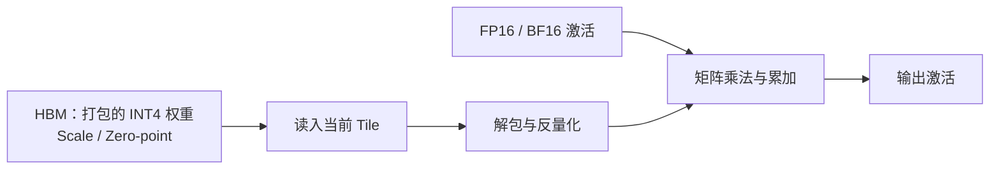

SmoothQuant 解决的是“权重和激活都要量化，怎么平衡两边误差”。如果眼前最迫切的问题是模型太大、每步 Decode 搬权重太慢，还有另一条路线：**先保留激活的 16-bit 精度，只把权重压到 4-bit。** 这就是 Weight-only INT4，常写作 W4A16。

谈到这条路线，GPTQ、AWQ、Marlin 经常一起出现，很容易让人以为是三个平行选项。实际上，GPTQ 和 AWQ 主要回答“怎样生成误差更小的低比特权重”，Marlin 回答“怎样把这些权重算得更快”。这一节把算法、文件格式和计算 Kernel 三层拆开，再把它们接起来。

阅读起点：[4.3 基础笔记](https://caomaolufei.github.io/AIInfraGuide/inference/模块四-推理优化/第4章-量化/43-weight-only-int4/)。本篇在基础概念之上，补充输出重构实验、元数据账本与 Marlin Kernel 核对；公式布局以本篇显式约定为准。

<!-- more -->

## 📑 目录

- [1. W4A16：先省搬运，再谈计算](#1-w4a16先省搬运再谈计算)
- [2. 从权重误差转向输出误差](#2-从权重误差转向输出误差)
- [3. GPTQ：量化一列，补偿剩下的列](#3-gptq量化一列补偿剩下的列)
- [4. AWQ：根据激活保护重要通道](#4-awq根据激活保护重要通道)
- [5. GPTQ 与 AWQ：怎么比较才公平](#5-gptq-与-awq怎么比较才公平)
- [6. Marlin：压缩后的权重怎样算得快](#6-marlin压缩后的权重怎样算得快)
- [7. 动手实验：最近的权重不一定给出最近的输出](#7-动手实验最近的权重不一定给出最近的输出)
- [8. 工程实践：从检查配置到验证 Kernel](#8-工程实践从检查配置到验证-kernel)
- [总结](#-总结)
- [自我检验清单](#-自我检验清单)
- [参考资料](#-参考资料)

---

## 1. W4A16：先省搬运，再谈计算

一个 4-bit 编码只有 16 个取值。实际文件通常把多个编码塞进一个整数容器，例如一个 32-bit 字中装 8 个 INT4 值，同时保存各 Group 的 Scale 和必要的 Zero-point。

模型推理的大致路径是：



W4A16 不要求整个矩阵乘法都变成 INT4 算术。典型实现先恢复当前 Tile 的权重，再和 16-bit 激活用相应 Tensor Core 指令计算。恢复可以发生在寄存器里，避免把完整的 FP16 权重写回 HBM。

### 1.1 为什么小 Batch Decode 特别适合

设线性层权重为 $K\times N$、输入 Token 数为 $M$。忽略激活、输出和元数据时，计算量约为 $2MKN$ FLOPs。

FP16 权重占 $2KN$ 字节，算术强度约为 $M$ FLOPs/byte；只计算 INT4 编码时，权重约占 $KN/2$ 字节，变为约 $4M$ FLOPs/byte。**四倍是忽略元数据的理想值，实际略低于四倍。** 例如 Group Size 为 128、每组一个 FP16 Scale 和一个打包的 4-bit Zero-point，平均位宽为 $4+(16+4)/128=4.15625$ bit/权重，对应约 $16/4.15625\approx3.85$ 倍。零点存储、对齐和未量化层不同，还应继续调整账本。

但随着 $M$ 增大，FP16 GEMM 自己也能充分复用权重，INT4 的解包和缩放开销便更难忽略。长上下文还会增加 Attention 的 KV 读取量，让权重压缩在总耗时中的占比下降。

📌 **关键点**：W4A16 的理想收益来自少搬权重，不是看到“INT4”就能直接套用 GPU 的 INT4 峰值算力。

---

## 2. 从权重误差转向输出误差

最简单的 RTN（Round-to-Nearest）把每个权重舍入到最近的刻度。它让单个数字接近原值，但线性层真正关心的是输出。

统一沿用数学约定 $Y=XW$，$X$ 为 `[样本 Token, 输入通道]`，$W$ 为 `[输入通道, 输出通道]`。量化希望降低：

$$
\mathcal{L}(\hat{W}) = \|XW-X\hat{W}\|_F^2
$$

相比 $\|W-\hat{W}\|_F^2$，这里多了校准输入 $X$。如果两个输入通道经常一起变化，它们的误差可能互相补偿；如果某个通道激活特别大，小的权重误差也可能造成大的输出误差。

用一个类比：调音台上两个音轨叠在一起播放，目标是最终声音接近原曲。每个旋钮分别调到“最接近的位置”，不一定比让一个略高、另一个略低更接近合成后的声音。

🔑 **核心概念**：**GPTQ 和 AWQ 都使用激活信息，但用法不同。** GPTQ 利用输入相关性指导误差补偿，AWQ 利用输入幅度指导通道缩放；AWQ 的 A 不表示它会把激活量化成 INT4。

---

## 3. GPTQ：量化一列，补偿剩下的列

### 3.1 Hessian 为什么会出现在这里

对一个输出通道的权重向量 $w$，重构目标为 $\|X(w-\hat{w})\|_2^2$，其 Hessian（二阶信息）是：

$$
H=2X^{\mathsf T}X
$$

这是**层输出重构误差的 Hessian**，不是对整个语言模型训练 Loss 求出的完整 Hessian。$X^{\mathsf T}X$ 刻画输入通道的幅度与相关性。原论文采用 $WX$ 的矩阵方向，公式会出现转置差别；两套约定描述同一件事。[GPTQ 论文](https://arxiv.org/abs/2210.17323)给出了推导与实现优化。

### 3.2 固定一个权重，调整其他权重

假设当前权重 $w_i$ 被固定到量化值 $q_i$，误差为 $e_i=w_i-q_i$。在当前尚未固定的变量集合上，二阶补偿的直觉形式是：

$$
\Delta w_j = -\frac{e_i}{[H^{-1}]_{ii}}[H^{-1}]_{ji}
$$

量化 $i$ 之后，让其他仍可调整的权重按输入相关性变化，尽量抵消它造成的输出误差。随着变量被固定，有效逆 Hessian 信息也要相应更新。

用一个类比：船上一侧拿掉一件货物后，不是宣布平衡无法恢复，而是把尚未固定的货物挪一挪。GPTQ 的“补偿”就发生在那些还没量化完的权重上。

### 3.3 为什么大模型上也能做

朴素逐权重处理很慢。GPTQ 在 [作者实现](https://github.com/IST-DASLab/gptq)中使用统一的列处理顺序、分块更新以及 Cholesky 分解，把大量小更新合并成更适合 GPU 的矩阵操作。实现里常还会给 Hessian 加 Damping（阻尼）来改善数值稳定性。

这里的“按列”是以 PyTorch 权重 `[out, in]` 为视角，即沿输入维度处理；在本节 $[in,out]$ 的数学约定下，对应方向会转置。

⚠️ **注意**：GPTQ 不是“每一层求到了全局最优 INT4 权重”。低比特离散搜索很难，它采用逐步量化与局部补偿的高效近似；质量依赖校准数据、位宽、Group Size、阻尼和实现。

---

## 4. AWQ：根据激活保护重要通道

### 4.1 重要不只看权重有多大

AWQ（Activation-aware Weight Quantization）关注：哪些通道的权重误差，会经过较大的输入激活放大？[AWQ 论文](https://arxiv.org/abs/2306.00978)用激活统计判断重要通道，再搜索缩放参数以降低量化后的输出差异。

它常被简述成“保护少量重要权重”，但容易产生一个误解：以为它必须把那部分权重保留成 FP16。论文提出的主要缩放方案，目的就是在**不依赖这种混合精度例外**的情况下保护重要通道，让低比特布局仍然规整。

### 4.2 先放大权重，再量化

给输入通道一个缩放矩阵 $S$，权重变成 $SW$，输入补偿成 $XS^{-1}$。如果只量化权重，输出为：

$$
\hat{Y} = XS^{-1}Q(SW)
$$

某个重要通道被放大后，它在量化刻度上占到的相对空间可能增加；输入再除以相同系数，就能在原尺度上减少该通道的误差。这里 $Q$ 表示量化后反量化的近似权重。

但如果放大过头，把整个 Group 的最大值也显著抬高，Group Scale 会变大，其他权重反而更难表示。所以 AWQ 搜索缩放并结合适当的权重截断，需要比较整体输出误差。

### 4.3 和 SmoothQuant 相似在哪里，不同在哪里

二者都能用输入通道缩放保持浮点等价，也都要检查图融合。区别在目标：

- **SmoothQuant**：同时量化权重和激活，希望两边都适合 W8A8。
- **AWQ**：典型是 W4A16，输入保持较高精度，希望量化后的权重输出误差更小。

📌 **关键点**：相同的代数工具可以服务不同的目标；不能把 SmoothQuant 的 Alpha 配置直接当成 AWQ 的通用最佳配置。

---

## 5. GPTQ 与 AWQ：怎么比较才公平

| 📊 维度 | GPTQ | AWQ |
|---|---|---|
| 使用的输入信息 | 激活相关性，近似二阶信息 | 激活幅度与输出误差 |
| 核心动作 | 逐步量化，补偿未量化权重 | 搜索通道缩放，配合截断 |
| 主要离线开销 | 统计 Hessian、分解与分块更新 | 激活采集、缩放与截断搜索 |
| 常见部署形态 | Weight-only，常见为 INT4；也支持 3/8-bit 等配置 | INT4 Weight-only |
| 质量决定因素 | 校准分布、Group、量化设置 | 校准分布、Group、搜索设置 |
| 速度决定因素 | 导出布局与实际 Kernel | 导出布局与实际 Kernel |

**没有脱离模型与实现的“GPTQ 永远更准”或“AWQ 永远更快”。** 同样写着 4-bit，Group Size、对称性、未量化层、校准方法和算子路径都可能不同。

比较时至少记录：原模型与 revision、量化工具版本、校准集、位宽、Group Size、Zero-point、保留精度的层、推理框架版本、GPU 和实际 Kernel。否则你看到的差距可能只是两个导出包用了不同的计算实现。

---

## 6. Marlin：压缩后的权重怎样算得快

### 6.1 算法的收益需要 Kernel 兑现

**Marlin 是计算 Kernel，不是和 GPTQ/AWQ 同层的量化算法。** 原始 [Marlin 项目](https://github.com/IST-DASLab/marlin)面向 FP16 × INT4 矩阵乘法，通过布局、流水线和融合尽量把权重带宽压缩变成实际速度收益。vLLM 集成的 Marlin 家族支持范围持续扩展，不能直接照搬原始版本的所有限制。

关键思路可以按硬件链路理解：

1. **提前重排权重**：文件加载时转换成 Kernel 容易读取和解包的布局，运行时少做索引转换。
2. **异步搬运与流水线**：读下一个 Tile 的时候，计算当前 Tile，减少等数据的空档。
3. **寄存器中解包和缩放**：把 INT4 转换嵌进计算路径，避免完整高精度矩阵往返 HBM。
4. **复用激活与组织归约**：配合 Shared Memory、Tensor Core 和工作划分，让多个输出复用已加载的数据。

### 6.2 为什么压缩了也可能更慢

如果 Kernel 用了单独反量化操作，把全部 FP16 权重重新写回显存，再调用普通 GEMM，那么权重压缩带来的搬运优势会被部分抵消。即使是融合 Kernel，矩阵形状、Group Size 和 Batch 不合适，也可能使解包开销占主导。

原始项目展示的接近理想加速，是特定 GPU、矩阵形状和中小 Batch 下的结果。整模型还有 Attention、Norm、通信与调度，不能把 Kernel 的成绩直接搬到服务吞吐表里。

🔑 **核心概念**：**算法决定低比特近似，格式承载权重与元数据，Kernel 决定如何执行。** 只有三者对齐，压缩收益才能落到硬件上。

---

## 7. 动手实验：最近的权重不一定给出最近的输出

下面用一个刻度只有 $\{-1,0,1\}$ 的玩具量化器，穷举两个权重的编码。它用于解释输出重构目标，**不是 GPTQ 的生产实现**。

```python
import itertools
import torch

X = torch.tensor([[1.0, 1.0], [1.0, 0.9], [1.0, 1.1]])
w = torch.tensor([0.49, 0.49])
target = X @ w

def loss(q):
    return ((X @ q - target) ** 2).mean().item()

rtn = w.round()
candidates = [torch.tensor(v, dtype=torch.float32)
              for v in itertools.product([-1, 0, 1], repeat=2)]
best = min(candidates, key=loss)

print("逐权重舍入:", rtn.tolist(), "输出 MSE:", loss(rtn))
print("最小输出误差:", best.tolist(), "输出 MSE:", loss(best))
print("输入相关性:\n", X.T @ X)
assert loss(best) < loss(rtn)
```

RTN 把两个 0.49 都变成 0，但输入两列高度相关，原输出接近 0.98。让其中一个权重变成 1、另一个变成 0，反而更接近目标输出。你会看到，权重离原值更远，合成输出却更近。

GPTQ 把这种“利用相关性分配误差”的思想推广到大矩阵，并用分块近似控制离线成本；AWQ 则主要从通道尺度入手，避免重要方向被粗刻度伤到。

---

## 8. 工程实践：从检查配置到验证 Kernel

### 8.1 先看量化元数据

以官方 [Qwen2.5-7B-Instruct-AWQ 配置](https://huggingface.co/Qwen/Qwen2.5-7B-Instruct-AWQ/blob/main/config.json)为例，可以检查 `quantization_config` 中的位宽、Group Size、Zero-point 和量化方法。

```python
import json
from pathlib import Path

# 替换为已经下载好的量化模型目录。
config = json.loads(Path("./model-awq/config.json").read_text(encoding="utf-8"))
print(json.dumps(config.get("quantization_config"), ensure_ascii=False, indent=2))
```

只有模型名里出现 `INT4` 不够；真正决定加载行为的是权重、元数据及其兼容性。

### 8.2 加载预量化模型

```bash
# AWQ：已完成量化的 checkpoint。
vllm serve Qwen/Qwen2.5-7B-Instruct-AWQ

# GPTQ：同一模型家族的已量化 checkpoint。
vllm serve Qwen/Qwen2.5-7B-Instruct-GPTQ-Int4
```

这里省略 `--quantization`，让框架从 checkpoint 配置识别格式并选择兼容实现，再检查启动日志。以 [vLLM v0.19.0 的 AWQMarlinConfig](https://github.com/vllm-project/vllm/blob/v0.19.0/vllm/model_executor/layers/quantization/awq_marlin.py)和 [GPTQMarlinConfig](https://github.com/vllm-project/vllm/blob/v0.19.0/vllm/model_executor/layers/quantization/gptq_marlin.py) 为例，满足转换条件且用户未指定量化方法时，可以自动选择 Marlin；显式写 `awq` / `gptq` 则会阻止这项自动升级。该版本也可显式选择 `awq_marlin` / `gptq_marlin`，但不是所有 GPU、层形状或导出参数都兼容。

因此，**模型格式识别不等于整模型必定走 Marlin**。保存实际量化方法、线性层 Kernel、权重重排及回退日志，结合 [兼容矩阵](https://docs.vllm.ai/en/stable/features/quantization/)核对目标版本；后续版本可能调整方法名称和选择逻辑。性能对照中，两组应使用经过核对的合理执行路径，不能把强制旧 Kernel 的结果概括为 INT4 的收益上限。

### 8.3 什么时候值得继续调

如果模型能够装下、质量达标，但吞吐仍不理想，优先比较小 Batch Decode、大 Batch Decode 和 Prefill 的曲线。若只有小 Batch 受益，可能符合 Weight-only 的带宽逻辑；若全程都慢，先排查回退实现、布局兼容和反量化是否融合。

最后把 KV Cache 单独算账。权重省出的空间可以给更多请求使用，但每个请求的历史缓存仍可能保持 16-bit。下一节就解决这部分不断增长的显存。

---

## 📝 总结

- W4A16 主要降低权重存储和搬运量，激活与 KV Cache 不会自动变成 INT4。
- 最近舍入最小化的是局部数字差异，激活感知的方法更关注层输出差异。
- GPTQ 使用层重构 Hessian 的信息，逐步量化并补偿剩余权重，属于高效近似。
- AWQ 根据激活保护重要通道，主要通过缩放与截断实现规整的低比特权重。
- GPTQ/AWQ 的质量与速度依赖模型、校准、Group 和 Kernel，没有无条件的赢家。
- Marlin 通过重排、流水线和融合兑现低比特带宽收益，不能被当作量化算法。
- 对比部署时，要分清算法、导出格式、实际计算路径和端到端服务指标。

## 🎯 自我检验清单

- 能解释 W4A16 为什么不必执行原生 INT4 × INT4 乘法
- 能从简化字节账本推导权重压缩对算术强度的影响
- 能说明 GPTQ 的 Hessian 是哪个目标的二阶信息
- 能解释量化一个权重后为什么可以调整其他权重补偿
- 能说明 AWQ 的 A 为什么不代表激活也被压成 INT4
- 能区分 AWQ 与 SmoothQuant 的缩放目标
- 能说清 GPTQ、AWQ、Marlin 三者的层次关系
- 能列出比较两个 INT4 checkpoint 时需要固定的条件

## 📚 参考资料

- [GPTQ: Accurate Post-Training Quantization for Generative Pre-trained Transformers（Frantar et al., 2023）](https://arxiv.org/abs/2210.17323)
- [IST-DASLab — GPTQ 官方实现](https://github.com/IST-DASLab/gptq)
- [AWQ: Activation-aware Weight Quantization for LLM Compression and Acceleration（Lin et al., 2024）](https://arxiv.org/abs/2306.00978)
- [MIT HAN Lab — AWQ 官方实现](https://github.com/mit-han-lab/llm-awq)
- [IST-DASLab — Marlin](https://github.com/IST-DASLab/marlin)
- [Qwen2.5-7B-Instruct-AWQ — 官方量化配置](https://huggingface.co/Qwen/Qwen2.5-7B-Instruct-AWQ/blob/main/config.json)
- [vLLM — Quantization 与硬件兼容矩阵](https://docs.vllm.ai/en/stable/features/quantization/)
