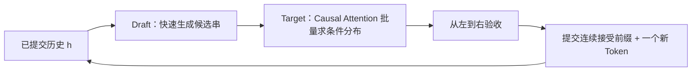

第一章说过，Decode 像接龙：大模型写完一个 Token，才能知道下一个该接什么。第二章用批处理让一次权重搬运服务更多请求，第四章用低比特减少搬运量。现在换个方向：**同一个请求，能不能一次大模型前向就确认好几个 Token？**

Speculative Decoding（投机解码）的办法是“先猜后验”：便宜的 Draft 先写草稿，昂贵的 Target 再批量核对。猜对了就多走几步，猜错了就从错误处改写。但要做到不改变 Target 的输出分布，不能只靠“看起来差不多”的验收规则。这一节把性能直觉和概率证明接起来。

<!-- more -->

## 📑 目录

- [1. 串行瓶颈：每搬一次权重只写一个 Token](#1-串行瓶颈每搬一次权重只写一个-token)
- [2. Draft + Verify：一轮里发生了什么](#2-draft--verify一轮里发生了什么)
- [3. 接受规则：贪心与随机采样要分开](#3-接受规则贪心与随机采样要分开)
- [4. 正确性证明：两条路径合起来才是 Target](#4-正确性证明两条路径合起来才是-target)
- [5. 从一个位置推广到整段序列](#5-从一个位置推广到整段序列)
- [6. KV Cache：草稿不是已经提交的历史](#6-kv-cache草稿不是已经提交的历史)
- [7. 动手实验：错误的重采样怎样改变分布](#7-动手实验错误的重采样怎样改变分布)
- [8. 工程边界：无损到底保证什么](#8-工程边界无损到底保证什么)
- [总结](#-总结)
- [自我检验清单](#-自我检验清单)
- [参考资料](#-参考资料)

---

## 1. 串行瓶颈：每搬一次权重只写一个 Token

普通自回归生成的下一步是：

$$
x_{t+1}\sim p(\cdot\mid x_{\le t})
$$

Token 尚未确定时，后面的条件分布也没有确定。不能直接让 Target 独立预测十个位置，再把十个结果拼在一起——那样丢掉了后一个 Token 对前一个 Token 的依赖。

但小 Batch Decode 经常受权重带宽限制：GPU 搬完大模型权重，只计算很少几个位置，算力还有空余。投机解码利用这个空间，把多个**已有候选 Token**作为输入，在一次前向中算出相应的条件分布。

用一个类比：主编逐字写稿很慢，让助手先写一段，主编一口气审稿。主编仍决定最终内容，只是把“自己逐字起草”变成“批量验收助手草稿”。

📌 **关键点**：投机解码减少的是**昂贵 Target 的串行调用轮数**。自回归依赖仍存在，传统独立 Draft 自己也通常逐 Token 生成；它并没有把语言生成变成无条件并行。

---

## 2. Draft + Verify：一轮里发生了什么

### 2.1 两个模型，两套条件分布

设已提交历史为 $h$，草稿长度为 $\gamma$：

- **Draft** 按 $q_i(\cdot)=q(\cdot\mid h,y_{<i})$ 提议 $y_i$。
- **Target** 计算 $p_i(\cdot)=p(\cdot\mid h,y_{<i})$，用于核验对应位置。

这里 $p$、$q$ 指**实际采样分布**，已经考虑温度、Top-k/Top-p 或其他适用的 Logits Processor。不能把用于抽样的分布与保存下来的原始 Softmax 概率混用。

### 2.2 为什么 Target 能并行验证

Draft 已经给出 $y_1,\ldots,y_\gamma$。Target 把候选串当作一段已知输入，用 Causal Attention 同时计算多个位置的隐藏状态。第 $i$ 个预测仍只看到 $h,y_{<i}$，不会偷看未来候选。

这和训练中的 Teacher Forcing 很相似：**输入已知，多个条件预测可以一起算；输出是否采用，稍后再决定。** 一轮需要 $p_1,\ldots,p_{\gamma+1}$，最后一个分布用于全部接受时再生成一个 Token。实现会复用已有 Logits，并注意预测与输入的移位关系。



假设 Draft 猜了四个 Token。前两个接受、第三个拒绝，就提交前两个，再在第三个位置补一个正确采样的 Token；第四个候选作废。如果四个全部接受，就再从 $p_5$ 采样一个额外 Token，理想情况下这一轮提交五个。

---

## 3. 接受规则：贪心与随机采样要分开

### 3.1 贪心：是否等于 Target 的选择

当 Target 使用贪心解码时，第 $i$ 个候选必须等于 Target 在该历史上的 `argmax` 才能接受。遇到首个不一致的位置，改用 Target 的 Token，并停止采用后面的候选。

这保证的是同一 Target 贪心策略的序列一致性，前提是数值计算和并列最大值处理一致。它不能直接推广成温度大于 0 时的验收规则。

### 3.2 随机采样：按概率接受

对于从 $q_i$ 抽到的候选 $y_i$，标准 Speculative Sampling 使用：

$$
a_i(y_i)=\min\left(1,\frac{p_i(y_i)}{q_i(y_i)}\right)
$$

抽取 $u\sim U(0,1)$，当 $u<a_i(y_i)$ 时接受。实际被抽到的候选有 $q_i(y_i)>0$，因此这个比值有定义。

若拒绝，不能简单再从 $p_i$ 抽一次。正确的修正分布是：

$$
r_i(x)=\frac{[p_i(x)-q_i(x)]_+}{\sum_z[p_i(z)-q_i(z)]_+},\qquad [v]_+=\max(v,0)
$$

🔑 **核心概念**：**拒绝后的残差分布，是对“已通过接受路径输出过的概率质量”做补偿。** 只核对候选概率、不核对修正采样，仍然可能改变最终分布。

---

## 4. 正确性证明：两条路径合起来才是 Target

先固定一个位置和它的历史，省略下标。推导可对照 [Leviathan 等人的 Speculative Decoding 论文](https://arxiv.org/abs/2211.17192)和 [Chen 等人的 Speculative Sampling 论文](https://arxiv.org/abs/2302.01318)。

### 4.1 接受路径贡献多少

先抽到 $x$、再接受它的联合概率为：

$$
q(x)a(x)=q(x)\min\left(1,\frac{p(x)}{q(x)}\right)=\min(p(x),q(x))
$$

令总接受概率为 $A=\sum_x\min(p(x),q(x))$，拒绝概率为 $\beta=1-A$。因为 $p$、$q$ 都归一化：

$$
\beta=\sum_x[p(x)-q(x)]_+
$$

### 4.2 拒绝路径补上缺口

拒绝后按 $r$ 采样，输出 $x$ 的联合概率为：

$$
\beta r(x)=[p(x)-q(x)]_+
$$

两条路径相加：

$$
\Pr(\text{最终输出}=x)=\min(p(x),q(x))+[p(x)-q(x)]_+=p(x)
$$

如果 $p=q$，则 $\beta=0$，永远不进入拒绝路径，也不需要计算一个分母为零的残差分布。

⚠️ **注意**：**条件在“已接受”事件上的 Token 分布，一般不是 $p$。** 它是 $\min(p,q)/A$。严格服从 Target 的是“接受与拒绝修正合起来”的最终输出分布，不能把二者混为一谈。

### 4.3 接受率为什么能反映模型匹配

利用全变差距离 $\operatorname{TV}(p,q)=\frac12\sum_x|p(x)-q(x)|$：

$$
A=1-\operatorname{TV}(p,q)
$$

这给出一个直觉：Draft 和 Target 的采样分布越重合，越少需要修正。但这只是当前历史上的单位置接受概率，不等于整个请求的速度。

---

## 5. 从一个位置推广到整段序列

每个被保留的位置都基于**实际已提交的前缀**，并用上面的规则产生正确条件分布。因此可以逐位置归纳：

$$
\Pr(x_{1:n}\mid h)=\prod_{i=1}^{n}p(x_i\mid h,x_{<i})
$$

### 5.1 为什么首个拒绝后必须停

如果 $y_3$ 被替换为 $z_3$，原先算好的 $p_4$ 条件是 $h,y_1,y_2,y_3$，不是 $h,y_1,y_2,z_3$。即便 $y_4$ 看起来“也合理”，它的验收依据已经失效。

所以提交的必须是**连续接受前缀**，不能跳过错误位置再拼后面的候选。这是后面讨论 Draft Tree 时“只保留合法路径”的基础。

### 5.2 为什么可以多一个 Token

若全部 $\gamma$ 个候选都接受，$p_{\gamma+1}$ 已经在正确历史上计算好，直接从它采样。若中途拒绝，则生成一个修正 Token。两种情况都让当前轮至少推进一个 Token。

“最多 $\gamma+1$”是未触发结束条件时的账本。EOS、Stop String、剩余输出长度和上下文上限都可能让实际提交长度更短；不能为了凑满一轮而越过停止条件。

---

## 6. KV Cache：草稿不是已经提交的历史

候选进入 Target 前向时，会暂时占用 KV 槽位。但验收前，它们只是“试算”，不能全部作为真实历史留在缓存中。

| 📦 状态 | 应怎样处理 | 常见错误 |
|---|---|---|
| 已提交历史 | 保留对应的有效 KV | 回退时误删原始 Prompt |
| 连续接受候选 | 复用已验证路径上的 KV | 再做一遍同样前向，浪费收益 |
| 被拒绝位置及后缀 | 失效并回退相应缓存状态 | 下一轮还读取错误候选的 KV |
| 修正/额外 Token | 提交后按实现推进 KV 计算 | 把“已采样”误当“已有 KV” |

最后一行很容易出现 off-by-one：一个 Token 可以已经对外提交，但它自身的 KV 要等作为下一次模型输入时才生成。引擎必须区分**已提交 Token 数**和**已计算 Token 数**。

Draft 有自己的缓存时，也要与最终提交历史同步。Target 否决了草稿，Draft 不能继续沿自己原来的错误历史往下猜。

📌 **关键点**：概率证明管“输出如何采样”，缓存与调度实现管“下一轮真的看到了什么历史”。其中任意一处不一致，理论保证都无法落地。

---

## 7. 动手实验：错误的重采样怎样改变分布

下面只用 Python 标准库，模拟**固定历史的一个位置**，不加载模型，也不测 GPU 性能。

```python
import random
from collections import Counter

p = [0.6, 0.3, 0.1]  # Target
q = [0.2, 0.5, 0.3]  # Draft
overlap = [min(a, b) for a, b in zip(p, q)]
beta = 1 - sum(overlap)
residual = [max(a - b, 0) / beta for a, b in zip(p, q)]
exact = [a + beta * b for a, b in zip(overlap, residual)]
wrong = [a + beta * b for a, b in zip(overlap, p)]
assert all(abs(a - b) < 1e-12 for a, b in zip(exact, p))
print("正确规则的精确分布:", exact)
print("拒绝后直接抽 Target 的错误分布:", wrong)

rng = random.Random(42)
counts = Counter()
accepted = 0
trials = 100_000
for _ in range(trials):
    candidate = rng.choices(range(len(q)), weights=q)[0]
    if rng.random() < min(1, p[candidate] / q[candidate]):
        token = candidate
        accepted += 1
    else:
        token = rng.choices(range(len(p)), weights=residual)[0]
    counts[token] += 1
print("最终输出的经验分布:", [counts[i] / trials for i in range(len(p))])
print("接受率:", accepted / trials)
```

这个例子里，接受路径贡献 $[0.2,0.3,0.1]$，拒绝概率为 0.4，残差全部补给第一个 Token，最终恢复 $[0.6,0.3,0.1]$。错误规则却得到 $[0.44,0.42,0.14]$。

先看精确计算，再看蒙特卡洛结果接近哪个分布。有限样本存在波动；实验帮助理解证明，不能用“这次打印差不多”替代正确性推导。

---

## 8. 工程边界：无损到底保证什么

- **保分布**：正确实现的精确投机采样，以被验证的 Target 分布为基准。
- **不保逐次相同文本**：随机采样消耗随机数的顺序可能不同，相同 Seed 不代表两条执行路径逐字相同。
- **不修复 Target 本身**：Target 如果已经量化，保证针对这个量化 Target，而不是自动恢复原始 BF16 模型。
- **不覆盖任意验收策略**：阈值放行、Typical Acceptance 等近似策略需要单独分析。

对于历史相关的惩罚、结构化输出约束等功能，验证位置也必须按对应候选前缀更新状态。额外功能是否兼容，要查所用框架版本并测试，不能只引用一条采样公式就宣称全部支持。

[vLLM 的无损保证说明](https://docs.vllm.ai/en/stable/features/speculative_decoding/#lossless-guarantees-of-speculative-decoding)还区分数学规则、算法测试与浮点数值差异。换 Batch 形状或 Kernel 可能改变接近并列的 Logits，因此工程验证仍然必要。

---

## 📝 总结

- 投机解码利用便宜草稿，把一次 Target 前向变成多个位置的批量验证。
- 并行的是已知候选的条件计算，自回归依赖没有消失。
- 随机采样按 $\min(1,p/q)$ 接受，拒绝后必须从正确残差分布补采。
- 接受路径与拒绝路径相加等于 Target；单独的“已接受 Token 分布”一般不同。
- 只提交连续接受前缀，首个拒绝后的候选全部失效。
- 全部接受时可多采一个 Token，实际提交仍受停止条件限制。
- KV 回退、Draft 同步和 Logits Processor 的历史状态，是正确性的工程部分。
- 无损以实际 Target 为基准，不等于随机文本逐字一致或无条件提速。

## 🎯 自我检验清单

- 能解释为什么候选已知后可以并行验证，而未知未来不能直接并行生成
- 能标出 $p_i$ 和 $q_i$ 分别基于哪一段历史
- 能区分贪心匹配与随机接受规则
- 能从两条输出路径推导最终分布等于 $p$
- 能说明为什么拒绝后直接从 Target 重采样会产生偏差
- 能解释首个拒绝后为什么必须放弃后缀
- 能说明额外 Token 的来源及 EOS 对提交长度的影响
- 能区分已提交 Token、已计算 KV 与临时候选
- 能解释保分布、量化基准和相同 Seed 的边界

## 📚 参考资料

- [Fast Inference from Transformers via Speculative Decoding（Leviathan et al., 2023）](https://arxiv.org/abs/2211.17192)
- [Accelerating Large Language Model Decoding with Speculative Sampling（Chen et al., 2023）](https://arxiv.org/abs/2302.01318)
- [vLLM — Speculative Decoding 与无损保证](https://docs.vllm.ai/en/stable/features/speculative_decoding/)
- [vLLM v0.31.0 — Rejection Sampler 实现](https://github.com/vllm-project/vllm/blob/v0.31.0/vllm/v1/sample/rejection_sampler.py)
