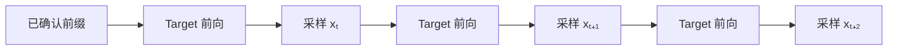

如果大模型每次前向只能产出一个 Token，那么“把 GPU 做得更快”仍绕不开一个事实：第 \(t+1\) 个 Token 的输入，要等第 \(t\) 个 Token 真正采出来后才知道。

Speculative Decoding（投机解码）解决的不是模型不会并行计算，而是**输出序列存在数据依赖，导致 Target 模型只能串行调用**。它先用便宜方法猜出一段未来，再让 Target 一次为整段候选打分。难点不在“猜”，而在两个问题：

1. 猜错后怎样修正，才能不改变 Target 的输出分布？
2. 多算候选真的比逐 Token Decode 更快吗？

本节不把答案记成公式，而是从这两个问题一步步推出来。

<!-- more -->

## 1. 瓶颈不是 Attention，而是串行步数

给定已确认前缀 \(x_{<t}\)，Target 模型定义下一个 Token 的条件分布：

$$
p_t(v)
=P_\theta(x_t=v\mid x_{<t}),
\qquad v\in\mathcal V
$$

采样得到 \(x_t\) 后，才能构造下一步条件分布：

$$
p_{t+1}(v)
=P_\theta(v\mid x_{<t},x_t)
$$

因此生成 \(N\) 个 Token 至少包含 \(N\) 条串行依赖：



KV Cache 避免了重复计算历史 Token 的 K/V，却没有消除这条依赖链。一次 Decode 仍需：

1. 读取各层权重。
2. 读取当前请求的历史 KV。
3. 为一个新位置完成 Attention、MLP 和 LM Head。
4. 采样一个 Token。
5. 更新调度状态，开始下一轮。

### 1.1 为什么低并发 Decode 常是 memory-bound

以一个简化的线性层 \(Y=XW\) 为例。

- 权重 \(W\) 很大。
- 单请求 Decode 的 \(X\) 只有一行或很少几行。
- 每次前向都要读取大部分 \(W\)。
- 每个权重元素参与的乘加次数少。

算术强度定义为：

$$
I=\frac{\text{FLOPs}}{\text{从 HBM 搬运的字节数}}
$$

当 \(I\) 低于 GPU 的 Roofline 转折点时，延迟主要受显存带宽限制。此时 Tensor Core 还有空闲，但下一 Token 没有产生，不能提前计算真实的后续位置。

这给投机解码留下了机会：如果一次读取权重时能为多个**已给定的候选位置**做计算，权重读取可被更多 FLOPs 摊薄。

### 1.2 “一次验证四个”不等于并行生成四个

假设候选序列已经有人给出：

```text
已确认前缀：The capital of France is
候选：      Paris , which is
```

Target 可以用 causal mask 一次处理这四个候选位置，并得到：

```text
P(Paris | prefix)
P(","   | prefix, Paris)
P(which | prefix, Paris, ",")
P(is    | prefix, Paris, ",", which)
```

这些分布在一次 Transformer 前向中按序列维并行计算。它们没有违反因果性，因为候选 Token 已经被放进输入；Target 只是在判断“如果前缀是这条候选路径，各位置应该是什么分布”。

真正的问题变成：候选由谁给、哪些可以提交、猜错时输出什么。

---

## 2. 一轮 Draft–Verify–Commit

记：

- \(p_i\)：Target 在候选位置 \(i\) 的分布。
- \(q_i\)：Proposer 在候选位置 \(i\) 的分布。
- \(\gamma\)：一轮最多起草的 Token 数。
- \(\tilde x_i\)：第 \(i\) 个候选 Token。

### 2.1 Draft：便宜地构造一条假设路径

Proposer 从真实前缀出发，顺序产生：

$$
\tilde x_1\sim q_1(\cdot\mid x_{<t})
$$

$$
\tilde x_2\sim q_2(\cdot\mid x_{<t},\tilde x_1)
$$

$$
\cdots
$$

$$
\tilde x_\gamma\sim
q_\gamma(\cdot\mid x_{<t},\tilde x_{<\gamma})
$$

若 Proposer 是小模型，这里仍有 \(\gamma\) 次串行前向。收益成立的前提是这些小前向总成本足够低。若 Proposer 是 N-gram、Suffix、Medusa 或 MTP，候选生成结构会不同，但最后都要交给 Target 验证。

### 2.2 Verify：Target 并行计算条件分布

Target 接收：

```text
[真实前缀] + [候选 1, 候选 2, ..., 候选 γ]
```

一次前向得到：

$$
p_i(\cdot)
=p(\cdot\mid x_{<t},\tilde x_{<i}),
\qquad i=1,\ldots,\gamma+1
$$

\(p_{\gamma+1}\) 是候选全部成立时的下一个分布，称为 bonus-token distribution。

### 2.3 Commit：只能提交连续的合法前缀

验证必须从左向右。若第 \(j\) 个候选被拒绝，则：

- \(\tilde x_1,\ldots,\tilde x_{j-1}\) 可以保留。
- 第 \(j\) 位必须由 Target 校正。
- \(\tilde x_{j+1},\ldots,\tilde x_\gamma\) 全部失效。

原因不是它们“概率低”，而是计算它们时使用了已经被否定的条件前缀：

$$
p_{j+1}(\cdot)
=p(\cdot\mid x_{<t},\tilde x_{\le j})
$$

若第 \(j\) 位被改成 \(x'_j\)，真正需要的是：

$$
p(\cdot\mid x_{<t},\tilde x_{<j},x'_j)
$$

二者不是同一个分布。

```text
Draft:   A → B → X → D
Target:  A → B → C
Commit:  A → B → C
                     X 被替换后，D 的条件前缀已不存在
```

若 \(\gamma\) 个候选全被接受，则再从 \(p_{\gamma+1}\) 采一个 bonus Token。一轮因此总能前进至少 1 个、至多 \(\gamma+1\) 个 Token。

---

## 3. 贪心验证只是严格采样的特殊情形

### 3.1 贪心基线

当 `temperature=0` 时，普通 Target Decode 选择：

$$
x_i^\star=\arg\max_v p_i(v)
$$

投机验证只需比较：

$$
\tilde x_i\stackrel{?}{=}x_i^\star
$$

相等就接受；首次不等时提交 \(x_i^\star\) 并结束本轮。若数值路径和 tie-breaking 相同，输出 Token 可以与基线逐位一致。

### 3.2 随机采样不能比较 argmax

设 Target 分布：

$$
p=(0.6,0.4)
$$

Draft 分布：

$$
q=(0.9,0.1)
$$

若“Draft 抽到什么都接受”，最终输出就是 \(q\)，不是 \(p\)。若“只接受 Target argmax”，又会把本应有 40% 概率出现的第二个 Token 压低。

随机采样的目标不是复现某一条固定文本，而是让投机算法输出的随机变量 \(Y\) 满足：

$$
P(Y=v)=p(v),\qquad \forall v\in\mathcal V
$$

下面从概率质量守恒推导接受规则。

---

## 4. 从重叠概率质量推导接受率

先看单个位置，省略位置下标。Draft 先按 \(q\) 提出 Token \(X\)。

对于某个 Token \(v\)：

- Draft 能提供的概率质量是 \(q(v)\)。
- Target 最终需要的概率质量是 \(p(v)\)。
- 通过 Draft 接受路径最多能保留二者较小值：

$$
m(v)=\min(p(v),q(v))
$$

既然候选 \(v\) 被提出的概率是 \(q(v)\)，要让接受路径留下 \(m(v)\)，条件接受概率必须满足：

$$
q(v)a(v)=m(v)
$$

因此：

$$
a(v)
=\frac{\min(p(v),q(v))}{q(v)}
=\min\left(1,\frac{p(v)}{q(v)}\right)
$$

当 \(q(v)=0\) 时，Draft 根本不会提出 \(v\)，比值无需计算。工程实现需避免零除，并在 logits 掩码后处理数值边界。

解释这个公式：

- 若 \(p(v)\ge q(v)\)，Target 至少需要 Draft 提供的全部 \(v\)，所以总是接受。
- 若 \(p(v)<q(v)\)，Draft 提出 \(v\) 太频繁，只能按 \(p(v)/q(v)\) 比例留下。

接受操作保留了 \(p\) 与 \(q\) 的重叠部分。

### 4.1 总接受概率

对所有 Token 求和：

$$
A
=\sum_v q(v)a(v)
=\sum_v\min(p(v),q(v))
$$

利用：

$$
\min(a,b)=\frac{a+b-|a-b|}{2}
$$

得到：

$$
A
=1-\frac12\sum_v|p(v)-q(v)|
=1-\operatorname{TV}(p,q)
$$

所以单步接受率与总变差距离直接相关。它衡量的是两个条件分布的重合程度，不是 Draft 的事实正确率，也不是答案质量分数。

---

## 5. 为什么拒绝后不能直接从 \(p\) 重采样

这是最常见的逻辑错误。

通过接受路径，Token \(v\) 已经获得：

$$
\min(p(v),q(v))
$$

若拒绝后再从完整 \(p\) 采样，就会给所有 Token 再加一遍概率质量。Draft 已覆盖充分的 Token 会被重复补偿。

拒绝路径只应补 Target 尚未得到的部分：

$$
r(v)=[p(v)-q(v)]_+
=\max(0,p(v)-q(v))
$$

将残差归一化：

$$
p_{\text{res}}(v)
=\frac{[p(v)-q(v)]_+}
{\sum_u[p(u)-q(u)]_+}
$$

分母正好等于拒绝概率。证明如下：

$$
\sum_v[p(v)-q(v)]_+
=\frac12\sum_v|p(v)-q(v)|
=1-A
$$

因此拒绝后从 \(p_{\text{res}}\) 采样，才会恰好补齐 Target 缺失的质量。

### 5.1 正确性完整证明

最终输出 \(Y=v\) 有两条互斥路径。

路径一：Draft 提出 \(v\) 且被接受：

$$
P(Y=v,\text{accept})
=q(v)\min\left(1,\frac{p(v)}{q(v)}\right)
=\min(p(v),q(v))
$$

路径二：某个 Draft 候选被拒绝，然后残差采出 \(v\)：

$$
P(Y=v,\text{reject})
=(1-A)p_{\text{res}}(v)
=[p(v)-q(v)]_+
$$

相加：

$$
P(Y=v)
=\min(p(v),q(v))+[p(v)-q(v)]_+
=p(v)
$$

这不是近似结论。只要 \(p,q\) 是验证时实际使用的分布，采样和数值实现正确，边缘分布就严格等于 Target。

### 5.2 从单 Token 推到整段序列

第一个位置经校正后满足：

$$
P(Y_1=y_1\mid x_{<t})=p(y_1\mid x_{<t})
$$

若第一个候选被接受，第二个位置使用的 Target 条件分布是：

$$
p(y_2\mid x_{<t},y_1)
$$

同样的单步证明可用于第二位。若某位拒绝，本轮在校正 Token 处停止，下一轮从真实已提交前缀重新开始。

按条件概率链式法则：

$$
P(Y_{1:k})
=\prod_{i=1}^{k}
p(y_i\mid x_{<t},y_{<i})
$$

因此整个输出序列服从 Target 自回归分布。

---

## 6. 离散概率手算：接受路径与残差路径

设词表只有 `A/B/C/D`：

| Token | Draft \(q\) | Target \(p\) | \(p/q\) | 接受概率 |
|---|---:|---:|---:|---:|
| A | 0.50 | 0.20 | 0.40 | 0.40 |
| B | 0.25 | 0.35 | 1.40 | 1.00 |
| C | 0.15 | 0.10 | 0.67 | 0.67 |
| D | 0.10 | 0.35 | 3.50 | 1.00 |

### 6.1 接受质量

逐 Token 的接受质量：

$$
\min(p,q)=(0.20,0.25,0.10,0.10)
$$

总接受概率：

$$
A=0.20+0.25+0.10+0.10=0.65
$$

所以拒绝概率是 \(0.35\)。

### 6.2 残差质量

$$
[p-q]_+
=(0,0.10,0,0.25)
$$

归一化：

$$
p_{\text{res}}
=\left(0,\frac{2}{7},0,\frac{5}{7}\right)
$$

注意残差只可能产生 `B` 或 `D`。`A/C` 在 Draft 中已经过量，不应在拒绝后再补。

### 6.3 验证最终分布

`A`：

$$
0.50\times0.40+0.35\times0=0.20
$$

`B`：

$$
0.25\times1+0.35\times\frac27=0.35
$$

`C`：

$$
0.15\times\frac23+0.35\times0=0.10
$$

`D`：

$$
0.10\times1+0.35\times\frac57=0.35
$$

最终正好恢复：

$$
(0.20,0.35,0.10,0.35)=p
$$

### 6.4 具体一次随机过程

假设 Draft 抽到 `A`，验收随机数 \(u=0.73\)。

$$
a(A)=0.40,\qquad 0.73>0.40
$$

因此拒绝。再从残差分布抽样：

```text
B: 2/7
D: 5/7
```

如果残差随机数落入后 \(5/7\)，本轮提交 `D`。这不是 Target 在看到 `A` 后“改主意”，而是一个联合采样过程，最终边缘分布仍为 \(p\)。

---

## 7. Logits 处理顺序决定“无损”相对于谁

真实服务不会直接从原始 logits 采样，通常还应用：

- temperature；
- top-k；
- top-p；
- min-p；
- repetition penalty；
- bad words / allowed tokens；
- grammar / structured output mask。

严格证明中的 \(p,q\) 应是**所有相关变换之后、真正用于采样的分布**。

例如 Target 原始分布为：

$$
p=(0.50,0.30,0.20)
$$

应用 top-k=2 后：

$$
\bar p=(0.625,0.375,0)
$$

若接受率仍拿原始 \(p\) 算，拒绝后却按 \(\bar p\) 采样，前述质量守恒不再成立。

工程上要核对：

1. Draft 是 greedy 还是 probabilistic sampling。
2. Draft logits 是否保留，能否构造真实 \(q\)。
3. Target 与 Draft 的 vocabulary mask 是否一致。
4. grammar mask 在哪个阶段应用。
5. 采样参数是否对两边采用相同语义。

“理论无损”不是“随便验一下都无损”。

---

## 8. 接受长度：不要把接受率当提交长度

定义第 \(i\) 个候选被检查并接受的条件概率：

$$
\alpha_i
=P(\text{第 }i\text{ 位接受}\mid
\text{前 }i-1\text{ 位全接受})
$$

第 \(i\) 个候选最终被接受，要求前 \(i\) 个都通过：

$$
P(A_i)=\prod_{j=1}^{i}\alpha_j
$$

一轮提交长度 \(L\) 包含：

- 被接受的 Draft Token 数；
- 首次拒绝后的一个校正 Token，或全接受后的一个 bonus Token。

所以：

$$
\mathbb E[L]
=1+\sum_{i=1}^{\gamma}
\prod_{j=1}^{i}\alpha_j
$$

### 8.1 常数接受率近似

若粗略假设：

$$
\alpha_i=\alpha
$$

则：

$$
\mathbb E[L]
=1+\alpha+\alpha^2+\cdots+\alpha^\gamma
=\frac{1-\alpha^{\gamma+1}}{1-\alpha}
$$

当 \(\alpha=1\) 时：

$$
\mathbb E[L]=\gamma+1
$$

### 8.2 数值例子

取 \(\gamma=4,\alpha=0.8\)：

$$
\mathbb E[L]
=1+0.8+0.64+0.512+0.4096
=3.3616
$$

“平均接受的 Draft Token 数”是：

$$
\mathbb E[L]-1=2.3616
$$

二者不要混淆。vLLM 的 mean acceptance length 按惯例包含最后那个 Target/bonus Token。

### 8.3 位置接受率通常不是常数

后部候选更容易偏离，真实数据可能是：

$$
P(A_1)=0.86,\quad
P(A_2)=0.68,\quad
P(A_3)=0.49,\quad
P(A_4)=0.31
$$

这些是**无条件的逐位置存活概率**，已经包含前面位置必须接受的条件。

于是：

$$
\mathbb E[L]
=1+0.86+0.68+0.49+0.31
=3.34
$$

逐位置向量比一个平均 AR 更能判断“深度 4 是否浪费”。若第四位存活率接近零，继续加深只会增加 Verify 成本。

---

## 9. 从接受长度到速度模型

普通 Decode 生成 \(N\) 个 Token 的时间近似：

$$
T_{\text{base}}
=N\cdot T_1(B,C)
$$

其中：

- \(B\)：当前 batch 中的活跃请求数。
- \(C\)：上下文长度。
- \(T_1\)：Target 单 Token Decode step 的时间。

投机模式每轮平均前进 \(\mathbb E[L]\)，轮数约：

$$
R\approx\frac{N}{\mathbb E[L]}
$$

一轮成本拆成：

$$
T_{\text{round}}
=D_\gamma(B,C)
+V_\gamma(B,C)
+S_\gamma(B)
+K_\gamma(B,C)
$$

其中：

- \(D_\gamma\)：Draft/Proposer 成本。
- \(V_\gamma\)：Target 验证成本。
- \(S_\gamma\)：采样、调度、metadata 成本。
- \(K_\gamma\)：候选 KV 写入、提交与回收成本。

因此：

$$
T_{\text{spec}}
\approx
\frac{N}{\mathbb E[L]}
T_{\text{round}}
$$

端到端 Decode 加速比：

$$
S_{\text{decode}}
\approx
\frac{\mathbb E[L]\cdot T_1}
{D_\gamma+V_\gamma+S_\gamma+K_\gamma}
$$

有收益的临界条件：

$$
D_\gamma+V_\gamma+S_\gamma+K_\gamma
<
\mathbb E[L]T_1
$$

这比“接受率超过 80% 就值得”更可靠。

---

## 10. Verify 成本为什么不是 \(\gamma T_1\)

可用一个简化 Roofline 模型理解。

令 Target 权重读取量为 \(W_b\) 字节，验证每个 Token 的增量 KV/激活流量为 \(m(C)\)，每 Token 计算量为 \(F\)，HBM 带宽为 \(\beta\)，算力为 \(\phi\)。

单 Token Decode：

$$
T_1
\approx
\max\left(
\frac{W_b+m(C)}{\beta},
\frac{F}{\phi}
\right)
$$

验证 \(K\) 个位置：

$$
V_K
\approx
\max\left(
\frac{W_b+K\,m(C)}{\beta},
\frac{K\,F}{\phi}
\right)
+\delta_K
$$

\(\delta_K\) 是 kernel、mask、padding 和调度额外成本。

在小 batch、权重读取占主导时：

$$
W_b\gg K\,m(C)
$$

于是 \(V_K\) 可能只比 \(T_1\) 稍大。

在大 batch 或长上下文时：

- 权重已被 batch 摊薄；
- Attention KV 读取增大；
- \(B\times K\) 让计算量迅速增加；

此时 \(V_K\) 更接近线性增长，投机优势缩小。

---

## 11. 两组完整速度手算

### 11.1 小 batch、memory-bound：明显加速

设：

```text
Target 单 Token Decode T1 = 11.0 ms
投机深度 γ = 4
逐位置存活率 = [0.84, 0.66, 0.47, 0.30]
Draft 成本 D4 = 3.2 ms
Verify 成本 V4 = 13.0 ms
采样与调度 S4 = 0.7 ms
KV 提交回收 K4 = 0.6 ms
```

期望提交长度：

$$
\mathbb E[L]
=1+0.84+0.66+0.47+0.30
=3.27
$$

一轮成本：

$$
T_{\text{round}}=3.2+13.0+0.7+0.6=17.5\text{ ms}
$$

基线生成 3.27 Token 需要：

$$
3.27\times11.0=35.97\text{ ms}
$$

加速比：

$$
S=\frac{35.97}{17.5}=2.06
$$

### 11.2 大 batch、compute-bound：高接受仍变慢

并发升高后，设：

```text
T1 = 3.0 ms
D4 = 2.5 ms
V4 = 8.0 ms
S4 + K4 = 1.0 ms
E[L] 仍为 3.27
```

$$
S
=\frac{3.27\times3.0}{2.5+8.0+1.0}
=0.85
$$

接受分布完全没变，但系统从 2.06 倍加速变成 15% 降速。原因是基线 batch 已经高效利用 GPU，额外候选只增加计算和 Token Budget 压力。

---

## 12. 投机深度的最优点

增加 \(\gamma\) 会同时改变：

1. \(\mathbb E[L]\) 增长，但边际收益递减。
2. Draft 成本增长。
3. Verify Token 数增长。
4. 临时候选 KV 增长。
5. 后部候选被拒绝的浪费增长。

从 \(\gamma\) 增到 \(\gamma+1\) 时，期望长度新增：

$$
\Delta L_{\gamma+1}
=P(A_{\gamma+1})
=\prod_{j=1}^{\gamma+1}\alpha_j
$$

若新增候选带来的轮次成本是 \(\Delta T\)，只有当它改善单位 Token 成本时才值得：

$$
\frac{T_{\text{round}}+\Delta T}
{\mathbb E[L]+\Delta L}
<
\frac{T_{\text{round}}}
{\mathbb E[L]}
$$

整理得：

$$
\frac{\Delta T}{\Delta L}
<
\frac{T_{\text{round}}}{\mathbb E[L]}
$$

即“新候选每新增一个期望提交 Token 的边际成本”必须低于当前平均成本。

这说明最优 \(\gamma\) 必须通过逐位置接受率和实测成本共同确定，不能只按模型大小拍脑袋。

---

## 13. 实现伪代码：严格采样版

下面省略 batch、树结构、KV block 和 EOS 处理，只保留概率语义：

```python
def speculative_round(prefix, gamma, draft, target, sampler):
    proposals = []
    q_dists = []
    draft_prefix = list(prefix)

    # 1. Draft 沿一条假设路径串行起草
    for _ in range(gamma):
        q = sampler.transform(draft.next_logits(draft_prefix))
        token = sampler.sample(q)
        proposals.append(token)
        q_dists.append(q)
        draft_prefix.append(token)

    # 2. Target 一次为 γ 个候选和一个 bonus 位置打分
    target_logits = target.score(prefix, proposals)
    p_dists = [
        sampler.transform(logits)
        for logits in target_logits
    ]

    committed = []

    # 3. 从左到右验证
    for i, token in enumerate(proposals):
        p = p_dists[i]
        q = q_dists[i]
        accept_prob = min(1.0, p[token] / q[token])

        if sampler.uniform() <= accept_prob:
            committed.append(token)
            continue

        residual = positive_part(p - q)
        residual /= residual.sum()
        committed.append(sampler.sample(residual))
        return committed

    # 4. 全接受时提交额外 Target Token
    committed.append(sampler.sample(p_dists[gamma]))
    return committed
```

真实引擎还必须处理：

- 某些请求提前 EOS；
- batch 内 Draft 长度不同；
- structured output 导致每个请求词表 mask 不同；
- 未接受候选的 KV slot 回收；
- Target 与 Draft 的 TP/DP 通信；
- CUDA Graph shape；
- 每请求 RNG 状态和随机数消费顺序。

---

## 14. 为什么固定 seed 仍可能输出不同文本

“分布无损”不等于“逐 Token、逐比特复现”。

投机模式会改变：

- batch 形状；
- kernel 调用顺序；
- 浮点归约次序；
- 随机数消费数量；
- logits 的微小数值误差；
- 并发请求交错方式。

若两个接近的 logits 在数值误差后交换顺序，贪心输出也可能变化。随机采样更不要求同 seed 下每次消耗完全相同的随机数。

因此正确性测试应分两层：

### 14.1 贪心回归

在可确定配置下比较 baseline 与 speculative 的 Token IDs。它适合发现：

- mask 错误；
- position 错误；
- KV 回滚错误；
- 模型不匹配；
- EOS 处理错误。

### 14.2 采样分布检验

对同一 Prompt 重复大量采样，比较：

- 第一 Token 频率；
- 常见 n-gram 频率；
- 输出长度分布；
- EOS 比例；
- KL/JS/TV 或卡方统计量；
- 置信区间。

不能拿一次随机输出不同就断言算法有错，也不能拿一次输出相同就证明分布正确。

---

## 15. 本节实验：用一个微型分布验证公式

先写一个不依赖大模型的实验，验证残差采样恢复 Target 分布：

```python
import numpy as np

rng = np.random.default_rng(42)
p = np.array([0.20, 0.35, 0.10, 0.35])
q = np.array([0.50, 0.25, 0.15, 0.10])

def one_sample():
    proposal = rng.choice(len(q), p=q)
    accept = min(1.0, p[proposal] / q[proposal])
    if rng.random() <= accept:
        return proposal

    residual = np.maximum(p - q, 0)
    residual /= residual.sum()
    return rng.choice(len(p), p=residual)

n = 1_000_000
counts = np.bincount(
    [one_sample() for _ in range(n)],
    minlength=len(p),
)
observed = counts / n
print("target:  ", p)
print("observed:", observed)
print("max error:", np.abs(observed - p).max())
```

期望结果是观测频率在统计误差内接近 \(p\)。若把残差采样错误地改成 `rng.choice(..., p=p)`，输出会系统性偏离 Target。

这个小实验比直接跑 LLM 更适合验证概率逻辑，因为它排除了浮点 kernel、Tokenizer、调度和模型误差。

---

## 16. 边界：本节证明没有覆盖什么

### 16.1 树式候选

Medusa/EAGLE 常给出候选树，而不是单链。树上每个节点的 Target logits 必须对应“历史前缀 + 根到该节点的祖先”。验证 mask 和路径选择比本节单链更复杂，5.3 会展开。

### 16.2 非概率 Proposer

N-gram 或 Suffix 可能只给一条确定候选，不显式提供完整 \(q\)。工程实现可把 greedy 候选视为 one-hot \(q\)，或采用与引擎实现一致的验证规则。不能在不知道 \(q\) 的情况下机械套 \(p/q\)。

### 16.3 近似验收

Typical acceptance、阈值验收、synthetic acceptance 等策略可能换取速度或研究便利，但不自动继承本节的严格证明。使用时必须明确：

- 输出质量目标是什么；
- 是否允许分布变化；
- 变化如何测量；
- 能否快速回退严格路径。

### 16.4 Prefill 不会消失

投机减少的是 Decode 串行 Target step。对“超长 Prompt + 很短输出”：

$$
T_{\text{total}}
=T_{\text{queue}}+T_{\text{prefill}}+T_{\text{decode}}
$$

即使 \(T_{\text{decode}}\) 加速两倍，总时延改善也可能很小。

---

## 17. 从原理到工程的闭环

本节的闭环可以压缩为四步：

### 原理

自回归依赖迫使 Target 逐 Token 串行；便宜 Proposer 先给定未来路径，Target 才能按序列维并行验证。

### 实现

随机采样必须：

$$
a(v)=\min(1,p(v)/q(v))
$$

拒绝后必须从：

$$
p_{\text{res}}(v)
\propto[p(v)-q(v)]_+
$$

采样，并在首次拒绝后丢弃后续候选。

### 实验

同时记录：

- 逐位置接受率；
- mean acceptance length；
- Draft/Verify/系统耗时；
- 低并发与高并发 TPOT；
- 采样输出分布。

### 边界

只有：

$$
T_{\text{round}}<\mathbb E[L]T_1
$$

才有速度收益；理论分布正确也不代表固定 seed 文本一致，更不代表所有 batch、上下文和硬件都加速。

---

## 📝 总结

- 投机解码利用“候选已知后可并行评分”，减少昂贵 Target 的串行调用次数。
- 接受路径只能保留 \(p,q\) 的重叠质量，因此接受概率必然是 \(\min(1,p/q)\)。
- 拒绝后必须从 \([p-q]_+\) 的归一化残差采样；两条路径相加才严格恢复 \(p\)。
- 期望提交长度是 \(1+\sum_iP(A_i)\)，不等于简单平均接受率。
- 加速由接受长度、Draft、Verify、调度、KV 和 batch 共同决定。
- 小 batch、memory-bound Decode 最有利；大 batch、compute-bound 时即使高接受也可能变慢。

## 🎯 自我检验清单

- 能从串行依赖解释投机解码的机会，而不是只说“一次生成多个 Token”。
- 能从概率质量重叠推导接受公式。
- 能解释为什么拒绝后直接从 \(p\) 采样是错的。
- 能独立完成四 Token 离散分布手算。
- 能区分 acceptance rate、逐位置存活率与 mean acceptance length。
- 能写出含 Draft、Verify、调度和 KV 成本的速度模型。
- 能解释同样接受率为何在 batch=1 和饱和 batch 下结论相反。
- 能区分分布无损、贪心一致和固定 seed 逐比特复现。

## 📚 参考资料

1. Leviathan, Kalman, Matias, [Fast Inference from Transformers via Speculative Decoding](https://proceedings.mlr.press/v202/leviathan23a.html), ICML 2023.
2. Chen et al., [Accelerating Large Language Model Decoding with Speculative Sampling](https://arxiv.org/abs/2302.01318), 2023.
3. Liu et al., [How Speculative Can Speculative Decoding Be?](https://arxiv.org/abs/2401.07851), 2024.
4. vLLM v0.27.1, [Speculative Decoding](https://docs.vllm.ai/en/v0.27.1/features/speculative_decoding/), 严格采样与无损性说明。
