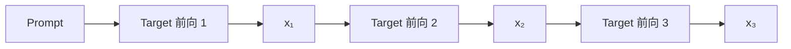
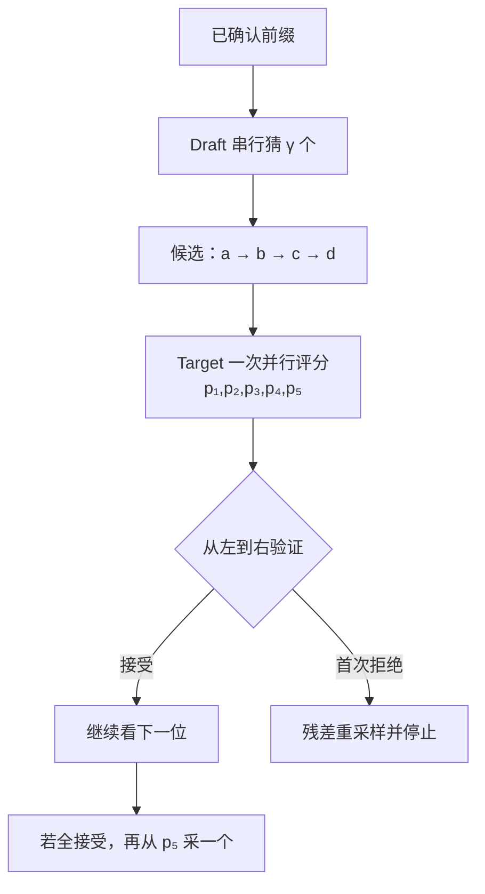

假设你是一位主编，每审一个字都要翻完一本厚重的规范手册。实习编辑翻的是薄手册，虽然偶尔会猜错，却能很快写出一小段。最省时间的办法不是把出版权交给实习生，而是让他先写四个字，主编把四个位置**一起检查**。

这就是 Speculative Decoding 的直觉：**便宜地提案，昂贵地并行验证，最后只提交 Target 模型认可的前缀。**

<!-- more -->

## 1. 自回归解码卡在哪里

给定前缀 \(x_{<t}\)，Target 模型给出下一个 Token 的分布：

$$
p_t(x)=P_{\text{target}}(x_t=x\mid x_{<t})
$$

采出 \(x_t\) 后，才能计算 \(p_{t+1}\)。因此生成 \(K\) 个 Token 至少有 \(K\) 个依赖串联的 Target 前向：



Decode 时每步通常只有很少的新 Token，GPU 难以把大矩阵乘法“铺满”；与此同时，模型权重仍要从 HBM 读取。于是单请求 Decode 常是 **memory-bound**：主要时间花在搬权重，而不是算术单元不够。

📌 **关键机会**：Target 一次处理 4 个已知候选 Token，通常远没有连续做 4 次单 Token 前向那么慢。投机解码就是用额外计算换更少的串行 Target step。

---

## 2. Draft-and-Verify 一轮做什么

记：

- Target 模型分布为 \(p\)，慢但拥有最终决定权。
- Draft 模型分布为 \(q\)，快但只负责提案。
- 投机深度为 \(\gamma\)，表示一轮最多起草 \(\gamma\) 个 Token。

一轮分成三段。

### 2.1 Draft：串行起草

Draft 从当前已确认前缀出发，自回归地产生：

$$
\tilde{x}_1,\tilde{x}_2,\ldots,\tilde{x}_\gamma
$$

每个候选的 Draft 条件分布分别是：

$$
q_i(\cdot)=q(\cdot\mid x_{<t},\tilde{x}_{<i})
$$

Draft 也要串行，但它足够小，或只是一组轻量 Head，因此 \(\gamma\) 步应明显便宜于一次 Target Decode。

### 2.2 Verify：一次并行评分

把“已确认前缀 + 整段候选”交给 Target。借助 causal mask，Target 一次前向可同时得到各候选位置的分布：

$$
p_i(\cdot)=p(\cdot\mid x_{<t},\tilde{x}_{<i})
$$

还会多得到候选段之后一个位置的 Target 分布 \(p_{\gamma+1}\)。



### 2.3 Commit：只提交连续前缀

验证必须从左到右。一旦第 \(i\) 个候选被拒绝，后续候选的条件前缀已经不成立，全部丢弃。

这与代码审查很像：第二行依赖第一行的变量名；第一行被改掉后，不能再说“第二行单独看是对的”。

若 \(\gamma\) 个候选全部接受，还能从 \(p_{\gamma+1}\) 采一个额外 Token。因此一轮可提交 \(1\) 到 \(\gamma+1\) 个 Token，而不是最多只有 \(\gamma\) 个。

---

## 3. 贪心验证与采样验证

“Target 验证”有两种容易混淆的语义。

### 3.1 贪心解码：比较 argmax

当 `temperature=0` 时，基线本来就是确定性的：

$$
x_i^\star=\arg\max_x p_i(x)
$$

候选 \(\tilde{x}_i=x_i^\star\) 就接受，否则在这一位提交 \(x_i^\star\) 并停止。

这能保证投机版本与同设置的 Target 贪心输出一致。

```text
Draft:   A  B  X  D
Target:  A  B  C  ?
Commit:  A  B  C        # X 首次不一致，D 作废
```

### 3.2 随机采样：不能只比较 argmax

若基线使用 `temperature=0.8, top_p=0.95`，Target 的输出本来就是随机变量。简单规则“Draft Token 只要概率够高就收下”通常会改变分布。

例如 Target 对 `A/B` 的概率是 `0.6/0.4`，Draft 是 `0.9/0.1`。若总是接受 Draft 抽到的 Token，最终 `A` 就会过多。

要保持 Target 分布，必须使用**修正后的拒绝采样**：

$$
a(x)=\min\left(1,\frac{p(x)}{q(x)}\right)
$$

先从 \(q\) 采出候选 \(x\)，再抽 \(u\sim U(0,1)\)。当 \(u\le a(x)\) 时接受。

若拒绝，不能直接从原始 \(p\) 重采样，而要从残差分布采样：

$$
p'(x)=\operatorname{norm}\left(\max(0,p(x)-q(x))\right)
$$

🔑 **核心概念**：接受步骤保留 \(p\) 与 \(q\) 重叠的概率质量；残差步骤补回 Target 有而 Draft 不足的质量。

---

## 4. 严格拒绝采样为何正确

我们只证明单个位置；逐位置条件化后，结论可递推到整段序列。

候选 \(x\) 通过接受路径输出的概率为：

$$
q(x)\cdot \min\left(1,\frac{p(x)}{q(x)}\right)
=\min(p(x),q(x))
$$

所有 Token 的总接受概率是：

$$
A=\sum_y\min(p(y),q(y))
$$

总拒绝概率：

$$
1-A
=\sum_y \max(0,p(y)-q(y))
$$

拒绝后，残差分布对 \(x\) 的条件概率：

$$
p'(x)=
\frac{\max(0,p(x)-q(x))}
{\sum_y\max(0,p(y)-q(y))}
$$

因此通过“拒绝后修正”路径输出 \(x\) 的无条件概率为：

$$
(1-A)p'(x)=\max(0,p(x)-q(x))
$$

两条路径相加：

$$
\min(p(x),q(x))+\max(0,p(x)-q(x))=p(x)
$$

所以最终样本严格服从 \(p\)。

还有一个很有用的等式：

$$
A=\sum_x\min(p(x),q(x))
=1-\operatorname{TV}(p,q)
$$

其中 \(\operatorname{TV}\) 是总变差距离。Draft 与 Target 越接近，单步平均接受概率越高。

⚠️ **注意**：“严格无损”指算法在相同采样变换下保持分布；浮点误差、不同 kernel、随机数消费顺序、top-k/top-p 实现差异，仍可能让固定 seed 的逐 Token 文本不完全相同。应区分**分布等价**和**逐比特复现**。

---

## 5. 一次完整手算

| Token | Draft \(q\) | Target \(p\) | 接受率 \(a=\min(1,p/q)\) |
|---|---:|---:|---:|
| A | 0.50 | 0.30 | 0.60 |
| B | 0.40 | 0.50 | 1.00 |
| C | 0.10 | 0.20 | 1.00 |

Draft 抽到 `A`，且 \(u=0.72>0.60\)，所以拒绝。残差为：

$$
\max(0,p-q)=(0,\ 0.10,\ 0.10)
$$

归一化得到 \(p'=(0,0.5,0.5)\)，只在 `B/C` 间重采样。最终边缘概率分别是：

- `A`：\(0.5\times0.6=0.3\)。
- `B`：接受 \(0.4\) + 残差 \(0.2\times0.5=0.1\)，合计 \(0.5\)。
- `C`：接受 \(0.1\) + 残差 \(0.2\times0.5=0.1\)，合计 \(0.2\)。

结果正好恢复 Target 的 `(0.3, 0.5, 0.2)`。

---

## 6. 接受长度与加速比手算

设每个候选位置独立地以概率 \(\alpha\) 被接受，投机深度为 \(\gamma\)。

一轮提交 Token 数 \(L\) 的期望为：

$$
\mathbb{E}[L]
=1+\alpha+\alpha^2+\cdots+\alpha^\gamma
=\frac{1-\alpha^{\gamma+1}}{1-\alpha}
$$

为什么有开头的 1？因为即使第一个候选拒绝，也会从 Target 残差分布提交一个 Token。

取 \(\alpha=0.8,\gamma=4\)：

$$
\mathbb{E}[L]=1+0.8+0.64+0.512+0.4096=3.3616
$$

也就是说，一轮平均前进约 3.36 个 Token。

但这**不等于 3.36 倍加速**。设：

- 普通单 Token Target Decode 时间为 \(T\)。
- Draft 一轮起草成本为 \(D_\gamma\)。
- Target 验证整段成本为 \(V_\gamma\)。
- 调度、采样和数据搬运开销为 \(O\)。

端到端近似加速比：

$$
S\approx
\frac{\mathbb{E}[L]\cdot T}
{D_\gamma+V_\gamma+O}
$$

手算一组数据：\(T=10\text{ ms}\)，\(D_4=4\text{ ms}\)，\(V_4=13\text{ ms}\)，\(O=1\text{ ms}\)。

$$
S\approx\frac{3.3616\times10}{4+13+1}=1.87
$$

再看接受率降到 \(\alpha=0.4\)：

$$
\mathbb{E}[L]=1+0.4+0.16+0.064+0.0256=1.6496
$$

$$
S\approx\frac{1.6496\times10}{18}=0.92
$$

此时投机反而慢了。

📌 **结论**：接受率决定“每轮走多远”，Draft/Verify/系统开销决定“每轮花多久”；两边必须同时好。

---

## 7. 明确伪代码

下面是严格采样版的核心流程，省略 KV Cache 管理和批调度：

```python
def speculative_step(prefix, gamma, draft, target):
    proposals = []
    q_dist = []
    # 1) Draft 串行提出 gamma 个候选
    draft_prefix = prefix.copy()
    for _ in range(gamma):
        q = draft.next_distribution(draft_prefix)
        token = sample(q)
        proposals.append(token)
        q_dist.append(q)
        draft_prefix.append(token)
    # 2) Target 一次评分 proposals 的每个位置，并多算一个位置
    p_dist = target.score_candidate_sequence(prefix, proposals)
    committed = []
    # 3) 从左到右验证；首次拒绝后立即停止
    for i, token in enumerate(proposals):
        accept_prob = min(1.0, p_dist[i][token] / q_dist[i][token])
        if uniform_0_1() <= accept_prob:
            committed.append(token)
            continue
        residual = normalize(positive_part(p_dist[i] - q_dist[i]))
        committed.append(sample(residual))
        return committed
    # 4) 全部接受：用 Target 多算出的分布再提交一个
    committed.append(sample(p_dist[gamma]))
    return committed
```

真实引擎还要处理 KV 回收、变长 batch、EOS/停止条件、logits 变换一致性和分布式通信。

## 8. 正确性与性能的边界

- Verify 只在候选前缀仍成立时有效，首次拒绝后的分布不能继续使用。
- 接受率衡量分布吻合，不衡量答案事实正确性。
- 更深的 \(\gamma\) 同时增加 Draft、Verify、临时 KV 和拒绝浪费，最优值依赖负载。
- 严格无损要求 \(p,q\) 经历一致的 top-k/top-p 等采样变换；近似接受规则不能套用本节证明。
- 投机主要减少 Decode 串行步，不消除 Prefill；长 Prompt、短输出通常收益有限。

## 📝 总结

- Proposer 猜 \(\gamma\) 个，Target 并行评分并从左到右提交连续前缀。
- 随机采样用 \(\min(1,p/q)\) 与残差分布保持 Target 分布。
- 期望长度约为 \(\sum_{i=0}^{\gamma}\alpha^i\)，真实加速还取决于 Draft、Verify 与系统开销。

## 🎯 自我检验清单

- 能画出 Draft、Verify、Commit 三阶段流程。
- 能解释为什么首次拒绝后必须丢弃后续候选。
- 能区分贪心一致与分布一致。
- 能写出接受概率与残差分布。
- 能用两条概率路径证明最终分布等于 \(p\)。
- 能手算期望提交长度并用实际耗时估算加速比。

## 📚 参考资料

1. Leviathan, Kalman, Matias, [Fast Inference from Transformers via Speculative Decoding](https://proceedings.mlr.press/v202/leviathan23a.html), ICML 2023.
2. Chen et al., [Accelerating Large Language Model Decoding with Speculative Sampling](https://arxiv.org/abs/2302.01318), 2023.
3. vLLM, [Speculative Decoding](https://docs.vllm.ai/en/latest/features/speculative_decoding/), 官方文档。
