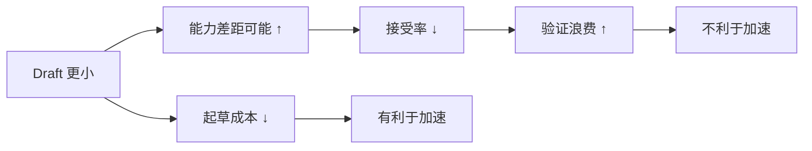
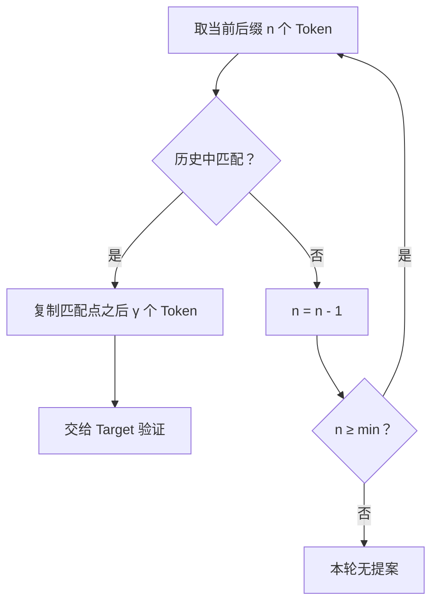

上一节把 Proposer 简化成了分布 \(q\)。工程上真正困难的问题是：**谁来提供这个 \(q\)，并且要便宜到足以抵消验证开销？**

最直观的答案是另找一个小模型；最“抠门”的答案则是不运行模型，直接从上下文里找已经出现过的片段。前者是独立 Draft Model，后者是 N-gram / Prompt Lookup。

<!-- more -->

## 1. 好 Draft 的三个条件

可以把 Proposer 看成给主编配的助理。好助理需要同时满足三件事：

1. **猜得像**：候选与 Target 分布接近，接受率高。
2. **写得快**：生成候选的成本远低于 Target 单步。
3. **接得上**：Tokenizer、词表、上下文和服务框架能够兼容。

只满足任意两个都不够。

| Proposer | 猜得像 | 写得快 | 接得上 | 结果 |
|---|---|---|---|---|
| 同规模 Target 副本 | 高 | 低 | 高 | Draft 太贵 |
| 极小但不同领域模型 | 低 | 高 | 可能 | 大量拒绝 |
| 同家族小模型 | 较高 | 较高 | 高 | 常见起点 |
| N-gram | 场景相关 | 极高 | 高 | 重复文本很划算 |

Draft 质量最终应通过**接受长度与端到端指标**判断，而不是只看参数量或通用 Benchmark。

---

## 2. 独立 Draft 模型如何工作

独立 Draft Model 是一套完整的自回归语言模型。它读取与 Target 相同的已确认前缀，连续生成 \(\gamma\) 个候选，并保存每一步的 Draft 概率 \(q_i\)。


它的优势是通用：只要 Draft 学过类似任务，就能对开放式文本提出新 Token，不依赖上下文中已经出现相同片段。

它的代价也直接：

- 额外模型权重占用显存。
- Draft 自己维护 KV Cache。
- 每轮 Draft 仍是串行自回归。
- Target 使用 TP 时，Draft 的放置和通信可能变复杂。
- 两套模型版本、Tokenizer 和 chat template 需要一起维护。

### 2.1 常见匹配策略

最稳妥的起点通常是**同一模型家族的小尺寸版本**，例如同代 Qwen 的小模型为大模型起草。

原因不是品牌一致，而是以下统计属性更可能一致：

- 词表与 Token ID 映射相同。
- Chat template 和特殊 Token 约定相同。
- 训练语料、语言偏好和格式风格相近。
- 对代码、数学或特定语言的条件分布更相似。

vLLM 的真实配置会在 5.5 节给出；模型名只说明接口形式，不代表所有硬件与负载都必然加速。

---

## 3. Draft 不是越小越好

设 Draft 大小继续缩小，通常会出现两条反向曲线：

- Draft 单步延迟下降。
- 与 Target 的分布差异增大，接受率下降。



真正要最小化的是每个**已提交 Token**的平均时间：

$$
C_{\text{token}}
=\frac{D_\gamma+V_\gamma+O}{\mathbb{E}[L]}
$$

假设三种 Draft 的一轮数据如下：

| Draft | Draft 成本 | Verify+开销 | 期望提交长度 | 每 Token 成本 |
|---|---:|---:|---:|---:|
| 1.5B | 7 ms | 14 ms | 3.8 | 5.53 ms |
| 0.6B | 4 ms | 14 ms | 3.3 | 5.45 ms |
| 0.1B | 2 ms | 14 ms | 2.0 | 8.00 ms |

最小的 0.1B 反而最慢，因为接受长度跌得太多。

### 3.1 领域与深度要匹配

小型代码模型可能比更大的通用聊天模型更适合作代码 Draft。评估应按代码/自然语言、语言、输出长度、采样方式和上下文长度分桶，避免平均值掩盖慢请求。Draft 越准越可尝试较大 \(\gamma\)；较弱 Draft 的后部候选更易浪费，建议从 2、3、5 扫描。

---

## 4. 词表与分词器约束

严格投机采样在 **Token 空间**比较 \(p(x)\) 和 \(q(x)\)。如果同一个 Token ID 在两边表示不同字符串，接受概率就失去意义。

传统实现通常要求：

- 相同 Tokenizer。
- 相同词表大小。
- 相同 Token ID 到文本片段的映射。
- 相同 BOS/EOS 与特殊 Token 语义。

例如 Draft 的 Token `42` 是 `"ing"`，Target 的 Token `42` 是 `"北京"`，仅凭 ID 相等显然不能接受。

### 4.1 异构词表不是自动免费

当前 vLLM 可用 `use_heterogeneous_vocab: true` 通过 Token-Level Intersection 把提案约束到共享 Token。官方文档要求该路径使用默认 greedy Draft sampling，尚不支持概率式 Draft sampling。共享集合、映射成本和切分差异都会降低收益；有同词表 Draft 时优先走简单路径。

---

## 5. N-gram：从上下文复制未来

N-gram Proposer 不运行第二个模型。它利用一个常见现象：生成内容经常会复述 Prompt 或历史输出。

例如 Prompt 已包含：

```text
user_id, product_id, event_time, event_type
```

模型后来开始输出：

```text
SELECT user_id, product_id, ...
```

当当前后缀是 `user_id, product_id` 时，可以在已有上下文中找到相同片段，并把它后面的 `event_time, event_type` 当作候选。

这像写代码时的“从上文复制粘贴”：不理解语义，但遇到重复模板非常准。

### 5.1 基本查找过程

给定当前 Token 序列 \(s\)，从长度较大的后缀开始：

1. 取末尾 \(n\) 个 Token 作为查询 n-gram。
2. 在更早的 Prompt 或上下文中寻找相同 n-gram。
3. 若匹配，复制匹配位置后面的最多 \(\gamma\) 个 Token。
4. 若不匹配，逐步减小 \(n\)。
5. 所有窗口都不匹配，就不给候选或退回普通 Decode。



### 5.2 为什么代码和文档处理常受益

- 代码里变量名、缩进、函数签名重复。
- 摘要和改写会复用原文实体与短语。
- RAG 回答常引用检索文档。
- JSON、SQL、日志和表格有强模板。
- 多轮编辑会重现先前生成片段。

开放式创作、短 Prompt 闲聊则较少出现足够长的精确匹配。

---

## 6. N-gram 手工演练

已有上下文 `[the, request, id, is, 42, and, ...]`，当前末尾为 `[please, log, the, request, id]`。设 \(n=2..4,\gamma=4\)：

- 4-gram `[log, the, request, id]`：历史无匹配。
- 3-gram `[the, request, id]`：历史开头匹配。
- 匹配位置之后是 `[is, 42, and, the, ...]`。

于是提案 `[is, 42, and, the]`。若 Target 要的是 `[is, 42, before, sending]`，只接受前两个。窗口过短会因 `id` 多次出现而歧义，过长又会因标点差异无法命中，所以 min/max 是召回率与精确率的权衡。

---

## 7. 明确伪代码与复杂度

下面是便于理解的 CPU 版伪代码：

```python
def ngram_propose(tokens, min_n, max_n, gamma):
    # 不允许匹配区域越过当前尾部，避免“拿未来匹配自己”
    history_end = len(tokens)

    for n in range(min(max_n, len(tokens)), min_n - 1, -1):
        suffix = tokens[-n:]

        # 从较近位置往前找；具体实现也可用哈希索引
        for start in range(history_end - n - 1, -1, -1):
            if tokens[start:start + n] != suffix:
                continue

            proposal_start = start + n
            proposal_end = min(proposal_start + gamma, history_end)
            proposal = tokens[proposal_start:proposal_end]
            if proposal:
                return proposal

    return []
```

朴素扫描最坏复杂度近似为 \(O(N\cdot W)\)，其中 \(N\) 是历史长度，\(W\) 是窗口比较成本。

工程实现可用：

- rolling hash 或 n-gram 哈希表。
- suffix array / suffix tree。
- GPU 上批量匹配。
- 请求内缓存与跨请求全局后缀缓存。

但索引也有成本：构建时间、内存、更新同步和 cache eviction。N-gram 的卖点是轻量，不应把检索结构做得比 Draft 模型还重。

### 7.1 vLLM 的最小配置

```bash
vllm serve Qwen/Qwen3-8B \
  --speculative-config '{
    "method": "ngram",
    "num_speculative_tokens": 4,
    "prompt_lookup_min": 2,
    "prompt_lookup_max": 5
  }'
```

CLI 中整个值必须是合法 JSON；外层单引号用于避免 shell 拆分，JSON 键和值仍用双引号。

---

## 8. 两条路线的选择

| 维度 | 独立 Draft Model | N-gram / Prompt Lookup |
|---|---|---|
| 额外权重 | 需要 | 不需要 |
| 额外 KV Cache | 通常需要 | 不需要模型 KV |
| 开放文本提案 | 可以 | 依赖历史重复 |
| 重复模板 | 好 | 常常很好 |
| 显存压力 | 较高 | 很低 |
| 运维复杂度 | 两套模型 | 查找参数与索引 |
| 高并发成本 | Draft 计算可能抢资源 | 查找较轻，但验证仍增加 Token |
| 最适场景 | 同家族、长输出、低延迟 | 代码/RAG/文档复述/结构化模板 |

### 8.1 一个实用决策顺序

1. **显存紧张且文本重复多**：先测 N-gram。
2. **文本开放但有同家族小模型**：测独立 Draft。
3. **没有匹配 Draft，重复也少**：保持基线，或考虑下一节的 Self-Draft。
4. **高并发吞吐优先**：先确认 Target 已能形成大 batch；投机未必是第一优先级。

### 8.2 必须做 A/B

固定请求，比较基线、N-gram、一到两个 Draft 尺寸和多个深度；记录接受率、平均接受长度、TTFT、TPOT、tokens/s、P95/P99 与显存，排除 warmup、Prefix Cache 和随机输出长度差异。

---

## 📝 总结

- 好 Draft 要同时满足高接受率、低提案成本和系统兼容。
- 同家族小模型通常更容易对齐词表、风格和条件分布，但仍要以端到端压测为准。
- Draft 不是越小越好；过小会用接受率损失抵消延迟收益。
- 传统 Draft 最好共享 Tokenizer 与 Token ID 语义；异构词表需要专门映射且有采样限制。
- N-gram 不运行额外模型，而是从 Prompt 或历史输出的匹配片段后复制候选。
- 查找窗口小则歧义大，窗口大则难命中；它最适合代码、RAG 和模板化文本。
- 两条路线都只负责提案，Target 验证仍是输出正确性的最终关口。

## 🎯 自我检验清单

- 能列出好 Draft 的三个必要条件。
- 能解释为什么最小 Draft 不一定最快。
- 能说明同家族小模型的工程优势。
- 能解释 Token ID 语义不一致为何破坏验证。
- 能手工执行一次从长 n-gram 到短 n-gram 的回退查找。
- 能说出 N-gram 最适合与最不适合的负载。
- 能写出 vLLM 当前 `method: ngram` 的配置。
- 能设计独立 Draft 与 N-gram 的公平 A/B 实验。

## 📚 参考资料

1. Leviathan et al., [Fast Inference from Transformers via Speculative Decoding](https://proceedings.mlr.press/v202/leviathan23a.html), ICML 2023.
2. Saxena, [Prompt Lookup Decoding](https://arxiv.org/abs/2311.04934), 2023.
3. vLLM, [Draft Models](https://docs.vllm.ai/en/latest/features/speculative_decoding/draft_model/), 官方文档。
4. vLLM, [N-Gram Speculation](https://docs.vllm.ai/en/latest/features/speculative_decoding/n_gram/), 官方文档。
