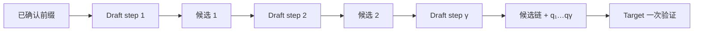

上一节把 Proposer 抽象成分布 \(q\)，但工程上最难的问题恰恰是：**怎样以足够低的成本构造一个与 Target 足够接近的 \(q\)**。

一个更强的 Draft 往往更准，却更慢、更占显存；一个极小 Draft 很快，却可能让大部分候选在第一二位就被拒绝。N-gram 和 Suffix 干脆不运行第二个模型，而是从上下文或历史请求中复制未来；它们几乎没有模型计算，却只能覆盖重复性强的文本。

本节不按“方案名录”介绍，而是围绕同一个目标函数比较三条路线：

$$
C_{\text{commit}}
=\frac{T_{\text{propose}}+T_{\text{verify}}+T_{\text{system}}}
{\mathbb E[L]}
$$

真正好的 Proposer，是让每个已提交 Token 的总成本最低。

<!-- more -->

## 1. Proposer 的四个硬条件

### 1.1 分布接近

对独立 Draft Model，单位置平均接受概率满足：

$$
A=1-\operatorname{TV}(p,q)
$$

Draft 不需要和 Target 一样聪明，但必须在**生产请求的条件分布**上接近。通用 Benchmark 分数接近，不代表代码补全、中文客服或工具调用中的 Token 分布接近。

### 1.2 提案便宜

若起草 \(\gamma\) 个 Token 的成本接近一次 Target Decode，投机已很难盈利：

$$
D_\gamma+V_\gamma+O
<
\mathbb E[L]T_1
$$

因此 Draft 参数量只是代理指标。真正要测的是：

- 单轮 Draft 延迟；
- 与 Target 是否争抢同一 GPU；
- Draft TP 通信；
- Draft KV 读写；
- logits 保存和采样成本。

### 1.3 Token 空间兼容

严格验收在 Token 空间比较 \(p(v)\) 和 \(q(v)\)。最简单的路径要求：

- 词表大小相同；
- Token ID 到字节串的映射相同；
- BOS/EOS/PAD 等特殊 Token 语义相同；
- chat template 和 added tokens 一致。

“Tokenizer 名称相似”不够。若 Draft 的 ID 42 是 `"ing"`，Target 的 ID 42 是 `"北京"`，ID 相等没有任何概率意义。

### 1.4 系统可组合

一个理论上优秀的 Draft 还要能与以下配置一起工作：

- Target 的 TP/DP/PP；
- 量化权重与 KV Cache dtype；
- structured output；
- LoRA；
- multimodal 输入；
- CUDA Graph；
- continuous batching。

支持矩阵随引擎版本变化，不能把论文实现直接当成生产框架能力。

---

## 2. 独立 Draft Model：第二条自回归链

独立 Draft 是一套完整的小语言模型。它从已确认前缀出发，自回归产生一条候选链：



Draft 需要维护自己的 KV Cache：

```text
Target KV: 真实已提交前缀 + 本轮待验证候选
Draft KV:  真实已提交前缀 + Draft 自己滚动的候选
```

若候选被拒绝，两边都要回到最终已提交长度。Draft 不能保留建立在错误候选上的后部 KV。

### 2.1 一轮实现流程

```python
def draft_model_propose(req, gamma):
    tokens = []
    distributions = []

    for _ in range(gamma):
        hidden = draft.forward_one_token(
            input_token=req.draft_last_token,
            kv_cache=req.draft_kv,
        )
        q = apply_draft_sampling_transforms(hidden.logits, req)
        token = sample(q)
        tokens.append(token)
        distributions.append(q)
        req.draft_kv.append(hidden.kv)
        req.draft_last_token = token

    return tokens, distributions
```

真实实现不会按 Python 请求逐个循环，而会把活跃请求组成 Draft batch。但每个请求内部的第 \(i+1\) 个候选仍依赖第 \(i\) 个，除非 Draft 本身是专门训练的 parallel drafter。

### 2.2 Draft 成本从哪里来

Draft 不是只有权重前向：

$$
D_\gamma
=D_{\text{forward}}
+D_{\text{sample}}
+D_{\text{KV}}
+D_{\text{sync}}
$$

- `forward`：\(\gamma\) 个串行小模型 step。
- `sample`：softmax、top-k/top-p、随机数。
- `KV`：Draft KV Cache 分配、写入和回滚。
- `sync`：Draft/Target 或不同 TP rank 间同步。

如果 Draft 很小，框架和 kernel launch 开销反而可能占较大比例。

---

## 3. 为什么同家族小模型常是起点

例如用同一代模型的 0.6B 给 8B 起草，优势不来自“名字相同”，而来自更可能满足：

1. 相同 vocabulary 和 Token ID。
2. 相同 chat template。
3. 相近训练语料与语言偏好。
4. 相近代码、数学和格式习惯。
5. 相近的特殊 Token 处理。

但同家族也不保证高接受。

Target 若做过：

- instruction tuning；
- RLHF/DPO；
- 领域 SFT；
- 安全对齐；
- 长上下文继续训练；

它的局部条件分布可能已明显偏离基础小模型。

### 3.1 Draft 不是越小越好

设三个候选 Draft 的一轮测量如下：

| Draft | \(D_4\) | \(V_4+O\) | \(\mathbb E[L]\) | 每提交 Token 成本 |
|---|---:|---:|---:|---:|
| 1.5B | 7.0 ms | 14.0 ms | 3.9 | 5.38 ms |
| 0.6B | 3.8 ms | 14.0 ms | 3.2 | 5.56 ms |
| 0.1B | 1.7 ms | 14.0 ms | 1.8 | 8.72 ms |

1.5B 虽然 Draft 最慢，却因接受长度更高而略胜 0.6B；0.1B 便宜，但大部分 Verify 工作被浪费。

选择目标不是最小化：

$$
D_\gamma
$$

而是最小化：

$$
\frac{D_\gamma+V_\gamma+O}{\mathbb E[L]}
$$

### 3.2 领域匹配可能胜过参数量

在代码服务中：

- 0.5B 代码 Draft 可能比 1.5B 通用 Draft 更准。
- 低温代码补全可能有长接受链。
- 自然语言注释和开放问答又可能迅速拒绝。

因此至少按以下维度分桶：

```text
语言 × 任务 × temperature × Prompt 长度 × Output 长度 × 并发
```

只报全数据平均接受率会掩盖某些请求类别的严重退化。

---

## 4. Greedy Draft 与 Probabilistic Draft

Target 可以做随机采样，但 Draft 不一定也要随机。

### 4.1 Greedy Draft

Draft 总是提出：

$$
\tilde x=\arg\max_v q(v)
$$

可把 Draft 分布视为 one-hot：

$$
\hat q(\tilde x)=1
$$

优点：

- 不必保存完整 Draft logits。
- 候选稳定。
- 显存和通信较小。
- 对低温/贪心负载常有效。

缺点：

- 不探索 Draft 的次高概率 Token。
- 随机 Target 分布较平时，匹配可能变差。

### 4.2 Probabilistic Draft

Draft 真正从 \(q\) 采样，并保留概率供 \(p/q\) 验收。

优点：

- 与 5.1 的标准推导直接对应。
- 在随机生成场景能覆盖更多 Target 概率质量。

代价：

- 需要完整或可重建的 Draft 分布。
- vocab logits 占显存和带宽。
- 分布式 vocab parallel 下通信更重。
- RNG 与 logits transform 更复杂。

在 vLLM v0.27.1 中，`draft_sample_method` 可选 `greedy` 和 `probabilistic`；异构词表 TLI 路径只支持默认的 greedy Draft。

---

## 5. 异构词表：TLI 解决了什么

vLLM v0.27.1 的 `use_heterogeneous_vocab: true` 使用 Token-Level Intersection（TLI）：

1. 初始化时规范化两边 Token 字符串。
2. 计算共享 Token 集合。
3. 把 Draft logits 限制在共享集合。
4. 采样后将 Draft Token ID 映射到 Target ID。
5. 再进入验收。

概念上：

$$
\mathcal V_\cap
=\mathcal V_d\cap\mathcal V_t
$$

Draft 实际分布变成：

$$
q_\cap(v)
=\frac{q(v)\mathbf 1[v\in\mathcal V_\cap]}
{\sum_{u\in\mathcal V_\cap}q(u)}
$$

这让跨家族 Draft 成为可能，但不是免费兼容：

- 共享词表小会损失表达能力。
- 同一字符串的切分粒度可能不同。
- 映射和 logits mask 有额外成本。
- Draft 分布经截断后可能更偏离 Target。
- v0.27.1 不支持该路径的 probabilistic Draft sampling。

有同词表、统计匹配的 Draft 时，仍优先简单路径。

---

## 6. Draft Model 的显存与放置

独立 Draft 至少消耗：

```text
Draft 权重
+ Draft KV Cache
+ Draft logits / sampling buffer
+ CUDA Graph / workspace
+ 候选与映射 metadata
```

### 6.1 与 Target 同卡

优点：

- 候选传递简单。
- 避免跨设备通信。

缺点：

- 与 Target 争抢 HBM 和算力。
- 挤压 Target KV Cache。
- 可服务并发可能下降。

### 6.2 Draft 独占 GPU

优点：

- Draft 与 Target 可部分重叠。
- 不挤占 Target 权重和 KV 空间。

缺点：

- 增加硬件成本。
- Token、状态和采样信息要跨设备传递。
- 负载不平衡时 Draft GPU 可能空闲。

### 6.3 Tensor Parallel

vLLM v0.27.1 中：

```text
draft_tensor_parallel_size = 1
或
draft_tensor_parallel_size = Target TP
```

Draft 很小时，TP 通信可能比计算更贵。Target 用 TP=8 不意味着 Draft 也该 TP=8；但具体可选范围受实现约束，需要按版本 schema 验证。

---

## 7. N-gram：把“预测”降成字符串续写

N-gram / Prompt Lookup 不运行语言模型。它观察到许多输出会复制上下文：

- 代码中的变量名和函数体模式；
- RAG 回答中的原文片段；
- 摘要中的实体和短语；
- SQL 列名；
- JSON schema；
- agent 日志和工具参数。

假设历史中出现：

```text
SELECT user_id, event_time, event_type FROM events
```

当前输出到：

```text
SELECT user_id, event_time
```

当前后缀 `[SELECT, user_id, ",", event_time]` 在历史中匹配，后面的：

```text
, event_type FROM events
```

可直接作为候选。

这里没有语义理解。候选之所以准，是“相同局部模式后常跟相同片段”。

---

## 8. N-gram 查找算法

给定当前 Token 序列：

$$
s=(s_1,\ldots,s_n)
$$

配置：

- 最小窗口 \(m\)；
- 最大窗口 \(M\)；
- 最大候选长度 \(\gamma\)。

从最长窗口开始尝试：

1. 取当前后缀 \(s_{n-k+1:n}\)。
2. 在允许的历史区域查找相同 k-gram。
3. 找到后复制匹配点之后最多 \(\gamma\) 个 Token。
4. 找不到则减小 \(k\)。

```python
def ngram_propose(tokens, min_n, max_n, gamma):
    history_end = len(tokens)

    for n in range(min(max_n, history_end), min_n - 1, -1):
        suffix = tokens[history_end - n:history_end]

        # 从近到远查；策略也可改成按频率或后继长度选
        for start in range(history_end - n - 1, -1, -1):
            if tokens[start:start + n] != suffix:
                continue

            continuation_start = start + n
            continuation_end = min(
                continuation_start + gamma,
                history_end,
            )
            proposal = tokens[continuation_start:continuation_end]
            if proposal:
                return proposal

    return []
```

### 8.1 为什么不能匹配“自己”

若搜索区域包含当前尾部，后缀总能匹配自己，但它后面没有已知 Token。更糟的实现可能发生重叠复制，构造出虚假的周期候选。

应明确：

- 匹配起点必须在当前后缀之前；
- continuation 只能来自已存在的 Token；
- 不能越过当前已知序列尾部。

### 8.2 多个匹配选哪个

相同 n-gram 可能出现多次：

```text
error code is 42
error code is 17
...
error code is
```

可选策略：

- 最近匹配；
- 最长可复制后继；
- 出现频率最高的后继；
- 按后继经验概率构树；
- 只用 Prompt，不使用已生成历史。

不同策略会改变提案质量和查找成本。N-gram 不是只有一个标准实现。

---

## 9. 窗口长度的精确率–召回率权衡

窗口太短：

- 很容易命中；
- 但歧义大；
- 后继不稳定；
- 第一位就可能拒绝。

窗口太长：

- 匹配后通常更准；
- 但标点、空格或一个 Token 差异就无法命中；
- 短上下文中没有候选。

手工例子：

```text
历史：
[the, request, id, is, 42, and, should, be, logged]

当前：
[please, log, the, request, id]
```

设 `min_n=2, max_n=4, γ=4`。

```text
4-gram [log, the, request, id]：无匹配
3-gram [the, request, id]：匹配历史开头
候选：[is, 42, and, should]
```

若 Target 真正要生成：

```text
[is, 42, before, returning]
```

则前两位接受，后两位丢弃。一轮仍可能前进 3 个 Token：两个 Draft + 一个校正 Token。

### 9.1 Tokenizer 会改变“重复”

字符串看似相同，不代表 Token n-gram 相同：

- 前导空格可能进入 Token；
- 大小写和 Unicode 规范化不同；
- 代码缩进可能被不同方式切分；
- chat template 会插入特殊 Token。

N-gram 在 Token ID 上匹配，因此必须用服务实际 Tokenizer 和模板评估。

---

## 10. N-gram 数据结构与复杂度

朴素扫描每轮最坏约为：

$$
O(N\cdot M^2)
$$

\(N\) 是历史长度，\(M\) 是窗口比较上限。所示切片实现会对每个窗口长度扫描历史，
每次切片比较还需 \(O(M)\)，因此最坏为 \(O(NM^2)\)。长上下文、多请求时，CPU 扫描可能成为瓶颈。

### 10.1 Rolling Hash

对固定 n-gram 建哈希：

$$
h(s_i,\ldots,s_{i+n-1})
$$

查找可接近 \(O(1)\)，但需：

- 为不同 \(n\) 维护索引；
- 增量更新；
- 处理哈希冲突；
- 存储多个匹配位置。

若为各窗口长度维护 rolling hash，扫描所有长度的总体复杂度可降为 \(O(NM)\)。

### 10.2 Suffix Array / Suffix Tree

可支持更灵活的最长后缀匹配，但：

- 构建和更新复杂；
- 动态生成序列持续增长；
- 跨请求缓存需要淘汰；
- 并发访问要同步。

### 10.3 GPU 匹配

将多个请求的 Token 序列批量匹配可减少 CPU 控制开销，但又引入：

- Token 数据上 GPU；
- kernel 启动；
- 变长序列；
- 索引显存。

N-gram 的价值在轻量。若索引系统比 Verify 还贵，就失去方案本意。

---

## 11. Suffix Decoding：从单次匹配到频率后缀树

vLLM v0.27.1 还支持 `method: suffix`。它与简单 N-gram 的共同点是都从重复片段提案，但有三个关键扩展：

1. 可匹配 Prompt 和过去生成。
2. 使用频率计数估计后继概率。
3. 每个请求、每一轮动态决定投机长度。

### 11.1 后缀树中的路径

假设历史后继统计为：

```text
[tool, call] →
├── [arguments, "{"]       count=70
├── [failed, because]      count=20
└── [completed, in]        count=10
```

经验条件概率：

$$
\hat P(\text{arguments}\mid\text{tool call})
=\frac{70}{100}=0.7
$$

若最小概率阈值为 0.1，这三条第一步都可保留；继续向下时，低频分支可能被剪枝。

### 11.2 自适应深度

v0.27.1 的最大候选深度受：

$$
K_{\max}
\le
\text{max\_spec\_factor}
\times
\text{prefix\_match\_length}
$$

并受全局 `num_speculative_tokens` 上限控制。

长而高置信的匹配可多猜，短而模糊的匹配少猜或不猜。它比固定 N-gram 更接近“按上下文难度分配 Verify 预算”。

### 11.3 跨请求全局缓存

Suffix 可以缓存过去请求，适合：

- agentic loop；
- RL rollout；
- 大量共享模板；
- 代码编辑。

但它引入新的生产问题：

- 跨租户数据泄漏；
- 敏感 Token 留存；
- 缓存污染；
- 热点模板偏置；
- FIFO/LRU 淘汰；
- 版本切换后的失效。

多租户服务应默认隔离缓存，或将全局缓存关闭，只使用请求内 Prompt tree。

---

## 12. 三条路线的成本模型

### 12.1 独立 Draft

$$
T_{\text{prop}}
\approx
\gamma T_{\text{small-decode}}
+T_{\text{draft-sample}}
$$

特点：

- 开放文本也能提案；
- 成本随 \(\gamma\) 增长；
- 需要权重和 KV。

### 12.2 N-gram

$$
T_{\text{prop}}
\approx
T_{\text{lookup}}(N,m,M)
$$

特点：

- 无额外模型权重；
- 命中时可能很准；
- 不命中时提案长度为 0；
- 对重复负载高度敏感。

### 12.3 Suffix

$$
T_{\text{prop}}
\approx
T_{\text{tree-lookup}}
+T_{\text{freq-rank}}
+T_{\text{cache}}
$$

特点：

- 动态深度；
- 可利用跨请求统计；
- 依赖额外库和缓存治理；
- 适合重复强、请求模式稳定的场景。

---

## 13. 与 Continuous Batching 的交互

### 13.1 Draft Model 扩大执行工作

对 batch \(B\)，Draft 串行 \(\gamma\) 步，Target 再验证约 \(B\gamma\) 个候选。高并发时：

- Draft 模型自身形成 batch，可能变为 compute-bound。
- Verify 候选挤占 Target Token Budget。
- 两套模型调度增加同步。

### 13.2 N-gram/Suffix 的高负载优势

它们不增加第二个模型前向，因此峰值流量下提案成本更稳定。但 Verify 仍然增加 Token 数，不代表高并发一定加速。

### 13.3 变长候选

N-gram 不命中时可能返回 0 个；Suffix 动态返回不同深度。batch 内候选长度不一会影响：

- padding；
- attention metadata；
- CUDA Graph shape；
- Token Budget 利用率。

轻量 Proposer 也需要引擎对变长 batch 有高效实现。

---

## 14. 与量化、长上下文和并行的交互

### 14.1 量化

Target 权重量化降低 HBM 流量，使基线 \(T_1\) 变小。投机收益不能与量化倍数直接相乘：

$$
S_{\text{combined}}
\ne
S_{\text{quant}}\times S_{\text{spec}}
$$

Draft 也可量化，但量化误差可能改变其分布和接受率。应重新测逐位置接受率，而不是假设只影响速度。

### 14.2 长上下文

Draft Model 也要维护长上下文 KV；N-gram/Suffix 的搜索空间也随历史增长。长上下文下：

- Attention KV 读取上升；
- Draft KV 占用上升；
- 查找索引变大；
- Verify 候选的临时 KV 更贵。

“N-gram 不占模型显存”不等于“上下文长度免费”。

### 14.3 并行

Target TP 越大，每轮可能有更多 collective。Draft 若 TP=1：

- Draft 计算便宜；
- 但候选要广播给 Target ranks。

Draft 若跟随 Target TP：

- 每步都有 TP 通信；
- 小模型计算可能被通信吞没。

PP、DP 与动态投机的兼容性应按具体 vLLM 版本核对，5.5 给出 v0.27.1 结论。

---

## 15. 实验：先测提案器，不要先追求峰值

建议准备三类固定数据：

### 15.1 重复型

```text
代码编辑、RAG 引用、JSON、SQL、日志模板
```

用于验证 N-gram/Suffix 的上限。

### 15.2 开放型

```text
聊天、创意写作、跨语言回答
```

用于识别检索式 Proposer 的失效区。

### 15.3 领域型

```text
真实业务 Prompt，按语言和任务分桶
```

用于比较同家族 Draft 与领域 Draft。

实验矩阵：

| 方法 | 关键扫描参数 |
|---|---|
| Draft Model | Draft 尺寸、\(\gamma=1/2/3/5\)、greedy/probabilistic |
| N-gram | min=2/3/4、max=4/5/8、\(\gamma=2/4/8\) |
| Suffix | 最大深度、缓存大小、spec factor、最小概率 |

每组记录：

- proposal hit rate；
- 平均提出 Token 数；
- 逐位置接受率；
- mean acceptance length；
- Proposer 时间；
- Verify 时间；
- TPOT/goodput；
- 显存或索引内存。

### 15.4 两个容易遗漏的对照

1. N-gram 未命中请求必须计入平均，不可只看命中样本。
2. Draft Model 必须把其额外显存导致的最大并发下降计入容量评估。

---

## 16. 选择实例

### 场景 A：IDE 代码补全

特征：

- 低并发或交互式；
- 大量局部重复；
- 输出中等长度；
- TPOT 敏感。

顺序：

1. 先测 N-gram。
2. 再测 Suffix 的请求内树。
3. 若开放式代码生成占比高，再测代码小模型 Draft。

### 场景 B：通用聊天 API

特征：

- 表达分支大；
- 高峰并发高；
- 多语言；
- Prompt 模板固定但答案不重复。

N-gram 可能只能复制少量模板。优先测试匹配的同家族 Draft 或 Self-Draft，并在高并发自动降深。

### 场景 C：RAG 摘要

答案常引用 Prompt，N-gram/Suffix 可能表现很好。但若 Prompt 32K、输出仅 50 Token，端到端仍由 Prefill 主导；必须看总时延，不只看 Decode TPOT。

### 场景 D：多租户 Agent

Suffix 全局缓存可能命中工具调用模板，但要先解决租户隔离与敏感数据留存。无法隔离时，应关闭跨请求缓存。

---

## 17. 原理—实现—实验—边界闭环

### 原理

Proposer 的价值不是“预测能力强”，而是以低成本产生与 Target 高重叠的候选，使：

$$
\frac{T_{\text{round}}}{\mathbb E[L]}
<
T_1
$$

### 实现

- 独立 Draft 维护第二套自回归 KV 和分布。
- N-gram 从当前后缀查历史精确匹配。
- Suffix 用频率树、动态深度和可选跨请求缓存提案。

### 实验

按真实任务分桶，同时测命中率、逐位置接受、提案时间、Verify 时间、TPOT、goodput 和容量。

### 边界

- 最小 Draft 不一定最快。
- 异构词表映射会改变 Draft 分布。
- N-gram/Suffix 只在重复型文本中有“知识”。
- 无模型提案也会增加 Target Verify 工作。
- 全局后缀缓存有数据隔离风险。

---

## 📝 总结

- 独立 Draft Model 的优势是通用，代价是第二套权重、KV、采样与调度。
- 选择 Draft 要最小化每提交 Token 成本，而不是参数量或 Draft 单步延迟。
- 同家族模型更可能共享词表和统计习惯，但仍要按真实领域测接受分布。
- N-gram 从上下文精确复制后继，窗口长度决定命中率与歧义。
- Suffix 通过频率后缀树、动态深度和跨请求缓存增强重复型提案。
- TLI 允许异构词表 Draft，但有共享集合、映射和 greedy-only 限制。
- 任何 Proposer 都要放进 continuous batching、量化、并行和长上下文的完整系统中评估。

## 🎯 自我检验清单

- 能解释 Draft Model 的权重、KV、logits 和同步四类成本。
- 能用每提交 Token 成本比较不同尺寸 Draft。
- 能区分 greedy Draft 与 probabilistic Draft。
- 能说明 TLI 改变了哪个分布、为什么不免费。
- 能手工执行一次最长 n-gram 回退查找。
- 能解释 N-gram 多匹配位置的选择策略。
- 能区分 N-gram 与 Suffix 的动态深度、频率和全局缓存。
- 能为代码补全、聊天、RAG 和多租户 Agent 选择实验顺序。

## 📚 参考资料

1. Leviathan et al., [Fast Inference from Transformers via Speculative Decoding](https://proceedings.mlr.press/v202/leviathan23a.html), ICML 2023.
2. Saxena, [Prompt Lookup Decoding](https://arxiv.org/abs/2311.04934), 2023.
3. SuffixDecoding, [SuffixDecoding: Extreme Speculative Decoding for Emerging AI Applications](https://arxiv.org/abs/2411.04975), 2024.
4. vLLM v0.27.1, [Draft Models](https://docs.vllm.ai/en/v0.27.1/features/speculative_decoding/draft_model/).
5. vLLM v0.27.1, [N-Gram](https://docs.vllm.ai/en/v0.27.1/features/speculative_decoding/n_gram/).
6. vLLM v0.27.1, [Suffix Decoding](https://docs.vllm.ai/en/v0.27.1/features/speculative_decoding/suffix/).
