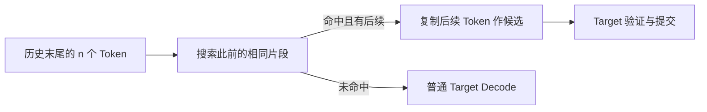

上一节证明，只要验收与修正正确，Draft 猜得不好也不会把最终分布带偏。可从性能上看，草稿写得越慢、被否决得越多，投机就越像白忙一场。接下来的问题是：**怎样让“猜一段”的成本，低于“少调用几次大模型”省下的时间？**

不一定非要再加载一个神经网络。输出会复制 Prompt、代码会重复标识符、Agent 会反复走相似步骤，这些历史模式本身就能生成候选。本节把独立小模型、N-gram 和 Suffix Decoding 放在同一张账本上比较。

<!-- more -->

## 📑 目录

- [1. 好 Draft 的标准：快、准、能接上](#1-好-draft-的标准快准能接上)
- [2. 独立小模型：不是越小越好](#2-独立小模型不是越小越好)
- [3. Tokenizer 与上下文：两个模型要说同一种语言](#3-tokenizer-与上下文两个模型要说同一种语言)
- [4. N-gram：在历史里找已经写过的下一段](#4-n-gram在历史里找已经写过的下一段)
- [5. Suffix Decoding：从一次匹配到历史统计](#5-suffix-decoding从一次匹配到历史统计)
- [6. 动手实验：匹配窗口与候选覆盖](#6-动手实验匹配窗口与候选覆盖)
- [7. 接受率：先把分母说清楚](#7-接受率先把分母说清楚)
- [8. 工程选型：按业务和资源挑候选](#8-工程选型按业务和资源挑候选)
- [总结](#-总结)
- [自我检验清单](#-自我检验清单)
- [参考资料](#-参考资料)

---

## 1. 好 Draft 的标准：快、准、能接上

草稿生成器（Proposer）负责提议，Target 负责最终验收。一个实用 Proposer 同时满足三件事：

1. **便宜**：生成候选的耗时、显存和通信成本低。
2. **匹配**：在真实业务历史上，候选经常与 Target 的选择相容。
3. **可集成**：Token ID、上下文、缓存和采样规则能与引擎接起来。

用一个类比：找助手不是只看工资低，还要看修改稿件的成本，以及他提交的文件能不能在主编的软件里打开。

| 📊 路线 | 候选来源 | 新增模型权重 | 主要机会 |
|---|---|---|---|
| 独立 Draft 模型 | 小模型的条件预测 | 有 | 能提议历史中没有出现的新内容 |
| N-gram / Prompt Lookup | 历史中的相同 Token 片段 | 无 | 复制、抽取、重复文本 |
| Suffix Decoding | 后缀匹配与续写频次 | 无 | 重复轨迹、代码编辑、相似请求 |

📌 **关键点**：“无模型”只表示没有额外神经网络权重。搜索索引、历史存储、CPU/GPU 数据传递和 Target 验证都不是零成本。

---

## 2. 独立小模型：不是越小越好

### 2.1 小模型为什么可能够用

一段生成里并非每个位置都同样难。标点、常见连接词、语法结构、已有变量名等，较小模型也可能预测得很好。Target 不用把这些容易位置全部重新逐步生成。

但参数更少，只说明一个粗略的容量指标。实际 Draft 延迟还受层数、Attention、KV 长度、Kernel、Batch 与部署卡数影响。不能只拿“0.5B 对 7B”推断时间比。

### 2.2 能力匹配比通用分数更直接

挑选时关注**与 Target 在目标业务上的一致程度**：

- Target 擅长代码，Draft 却没有相应训练，语法之后的算法选择可能频繁被拒绝。
- 两个模型训练版本、对齐方式或语言分布不同，常用续写也可能错开。
- Draft 更大可能提高接受长度，但多出来的 Draft 时间可能吃掉收益。

因此应比较多组候选的“Draft 耗时 + 验证耗时 / 已提交 Token 数”，而不是直接按排行榜给小模型选型。

### 2.3 额外模型会挤占服务容量

独立 Draft 除权重外，还可能有自己的 KV Cache、激活和工作空间。同一 GPU 显存预算下，Target 能留给请求缓存的空间可能减少。

单请求变快、最大并发却变小，是可能同时发生的两件事。5.5 节实战会把低并发延迟与服务容量分别测量。

---

## 3. Tokenizer 与上下文：两个模型要说同一种语言

### 3.1 文本相似，不代表 Token ID 相同

第 5.1 节的 $p(x)$、$q(x)$ 默认在同一个 Token 空间上。两个 Tokenizer 都能编码“hello”，不表示它们用同样的切分或整数编号。

基本路线应核对词表映射、特殊 Token、BOS/EOS 以及 Target 实际使用的 Chat Template。相同 `vocab_size` 只是数量相同，**不能证明每个 ID 含义相同**。

下面是离线检查思路，需要 `transformers` 和对应模型文件；它不运行推理：

```python
from transformers import AutoTokenizer

target = AutoTokenizer.from_pretrained("Qwen/Qwen3-8B")
draft = AutoTokenizer.from_pretrained("Qwen/Qwen3-0.6B")
assert target.get_vocab() == draft.get_vocab(), "词表的 Token → ID 映射不同"
print("Target 特殊 Token:", target.special_tokens_map)
print("Draft 特殊 Token:", draft.special_tokens_map)
print("Target EOS ID:", target.eos_token_id)
print("Draft EOS ID:", draft.eos_token_id)
```

这只能完成部分检查，还要看模型配置、引擎支持和真实输入的编码。若两个 Chat Template 不同，应以 Target 的实际历史为准，不能分别格式化两份语义相近、Token 却不同的对话再直接验收。

### 3.2 跨词表是单独的工程路线

有些框架支持 Token 对齐或词表交集方法；它们有额外映射与采样限制。[vLLM 的 Draft Model 文档](https://docs.vllm.ai/en/stable/features/speculative_decoding/draft_model/)单独描述了异构词表支持。不能因为看到这个选项，就忽略所用版本与 Draft 采样方式的约束。

### 3.3 Draft 的上下文不能悄悄变短

Draft 应能处理实际历史与候选长度。不同最大上下文、RoPE 配置、长文能力和缓存预算，都可能使长请求失败或接受率下降。

若某方案有意让 Draft 只看部分历史，Target 仍可按完整历史验证；但这会改变 $q$ 与接受率，必须作为明确设计记录，不能当成两个模型完全一致的条件。

---

## 4. N-gram：在历史里找已经写过的下一段

### 4.1 先匹配尾巴，再复制后续

假设当前历史末尾是 `[A, B, C]`，此前出现过 `[A, B, C, D, E, F]`。搜索器找到相同尾部后，提议 `[D, E, F]`，交给 Target 核验。



这里是在 **Token ID 序列**上匹配，不是按中文词语或字符数匹配。“N-gram”里的 $n$ 是查找窗口长度，`num_speculative_tokens` 是提议长度，两者不是同一个旋钮。

### 4.2 为什么匹配长短存在权衡

- 窗口较长：上下文约束更强，候选可能更相关，但命中更少。
- 窗口较短：命中更容易，却可能只匹配了常见标点或连接词，续写分歧很大。
- 提议更长：可能少调用几次 Target，也可能很快拒绝、白算后半段。

Prompt Lookup 尤其适合输出复用输入片段。不同实现究竟只查 Prompt，还是查包含已生成内容的整个请求历史，应看源码；不能只凭方法名断言搜索范围。

### 4.3 不需要神经网络概率，为什么还能验证

确定性复制可以视作在所提议 Token 上集中的分布：$q(y)=1$、其他 Token 的 $q$ 为 0。Target 仍能做正确的验收与修正；实际框架也可能采用等价的采样实现。

所以“没有语言模型产生 Logits”和“不能保分布”并不是一回事。真正要核对的是提议与验证算法是否匹配，而不是搜索器有没有叫作模型。

---

## 5. Suffix Decoding：从一次匹配到历史统计

N-gram 的直觉是“以前写过同样的尾巴，那后面可能还能照抄”。[SuffixDecoding 论文](https://arxiv.org/abs/2411.04975)进一步利用后缀索引与历史续写统计，寻找更有把握的候选。

### 5.1 频次提供便宜的置信度

若某个后缀之后，`return` 出现 20 次、`raise` 出现 2 次，统计可以帮助排序。匹配越弱、续写越分散，就越不适合继续扩展很长的候选。

这类经验频次只是 Proposer 的线索，不是 Target 的真实条件概率。不能跳过验证，直接把“历史最常见”作为最终答案。

### 5.2 历史范围与动态长度

框架可以利用当前 Prompt、此前生成片段或缓存的请求历史。vLLM 的 Suffix 路径还会按请求与迭代动态调整提议长度，因此配置的投机 Token 数是**上限**，不是每轮固定长度。

对高重复业务，这可能比固定长度查找更合适；对缺少可复用模式的新颖生成，历史索引再大也不一定有效。

### 5.3 接入成本在哪里

| 🔍 成本 | 需要核对的内容 |
|---|---|
| 搜索与更新 | 构建索引、更新频次、提议是否拖慢循环 |
| 历史存储 | 最大缓存请求数、内存上限、淘汰策略 |
| 统计作用域 | 当前请求与跨请求历史是否符合业务隔离要求 |
| 引擎依赖 | 实现包、方法名称、可用的验证后端 |

[vLLM 的 Suffix 文档](https://docs.vllm.ai/en/stable/features/speculative_decoding/suffix/)说明该路径依赖 Arctic Inference。部署时要记录依赖版本，而不是只复制一个 `method="suffix"` 字符串。

📌 **关键点**：Prefix Cache 复用的是已计算 KV，Suffix/N-gram 提议的是可能生成的 Token。前者减少重复 Prefill，后者仍需 Target 验证，不能混为一项缓存命中率。

---

## 6. 动手实验：匹配窗口与候选覆盖

下面用整数代替 Token ID。搜索器从长窗口到短窗口查找，选择最近的、完整位于当前尾部之前的匹配；只演示查找机制，不代表 vLLM 的完整实现。

```python
def propose(history, min_n=2, max_n=4, max_tokens=3):
    for n in range(min(max_n, len(history)), min_n - 1, -1):
        suffix_start = len(history) - n
        suffix = history[suffix_start:]
        # 排除当前尾部和与它重叠的片段；至少留一个后续 Token。
        for start in range(suffix_start - n, -1, -1):
            if history[start:start + n] != suffix:
                continue
            continuation = history[start + n:suffix_start]
            if continuation:
                return n, continuation[:max_tokens]
    return None, []

history = [10, 11, 12, 20, 21, 99, 10, 11, 12]
n, draft = propose(history)
print("命中窗口:", n, "候选:", draft)
assert (n, draft) == (3, [20, 21, 99])
print("只允许 4-gram:", propose(history, min_n=4, max_n=4))
print("没有重复:", propose([1, 2, 3, 4, 5]))
```

这个历史能命中 3-gram，限制成 4-gram 就没有候选。但命中本身不代表接受：如果 Target 下一步决定写 30，复制出来的 20 仍然会被否决。

试着改成多个相同后缀、不同续写，再想一想“最近匹配”和“最常见续写”会选出怎样不同的草稿。这正是简单查找与统计式后缀提议的区别。

---

## 7. 接受率：先把分母说清楚

### 7.1 三个相关但不同的量

设观测区间内提出 $D$ 个 Draft Token，接受其中 $C$ 个，共有 $R$ 次验收轮：

$$
\text{Draft Acceptance Rate}=\frac{C}{D}
$$

理想完整轮中，每轮还会提交一个修正或额外 Token，因此常见的平均接受长度口径是：

$$
\text{Mean Acceptance Length}=1+\frac{C}{R}
$$

另一个量是**候选覆盖**：多少次生成机会实际上有候选。若查找大部分时间未命中，仅统计有候选部分的高接受率，容易夸大总体收益。

### 7.2 固定长度和动态长度不能直接换算

只有每轮都提出同样的 $\gamma$ 个 Token 时，才有 $D=\gamma R$，于是平均长度为 $1+\gamma C/D$。动态长度方案必须使用实际 $D$ 和 $R$。

还要区分“第 $i$ 位条件接受率”和“从第一位一直接受到第 $i$ 位的概率”。越靠后的位置，前面一处拒绝就让它失去提交资格。

⚠️ **注意**：接受率 90% 不代表提速 90%。候选生成、验证长度、显存容量与调度负载都在分母里的时间账本上。下一节之后，我们会专门推导收益边界。

---

## 8. 工程选型：按业务和资源挑候选

| 🎯 业务现象 | 优先比较 | 验证重点 |
|---|---|---|
| 输出大量复用 Prompt | N-gram | 命中覆盖、查找窗口、接受前缀 |
| 重复编辑、相似轨迹多 | Suffix | 历史作用域、动态长度、索引成本 |
| 新内容多、历史复制少 | 独立 Draft | 能力匹配、耗时、额外显存 |
| 模型有适配的辅助头 | Medusa / EAGLE 等 | 训练与模型版本匹配、验收策略 |

先用真实 Prompt 与采样配置收集候选覆盖、平均接受长度和端到端延迟，再决定是否引入更复杂路线。代码、对话只是任务标签；真正起作用的是分布匹配、重复程度与系统成本。

✅ **收益机会**：便宜且容易命中的候选，能降低 Target 调用频率。

❌ **代价与边界**：独立模型增加显存；无模型路线依赖可复用历史；二者都需要框架验证与缓存维护。

---

## 📝 总结

- Draft 的目标是便宜、匹配、可集成，不是单纯参数最少。
- 独立小模型能猜新内容，但需要权重、KV 和能力匹配的完整账本。
- 相同词表大小不等于相同 Token ID；模板、特殊 Token 和上下文也要核对。
- N-gram 用历史尾部匹配提议后续，查找长度与投机长度是不同参数。
- Suffix 利用历史统计与动态提议，额外成本主要在索引、缓存与依赖。
- 确定性候选也能与正确采样规则配合，无模型不等于近似放行。
- 接受率、平均接受长度和候选覆盖要分开报告。
- 比较路线最终看端到端时间、容量与业务条件。

## 🎯 自我检验清单

- 能说明为什么更大的 Draft 可能更准却更慢
- 能列出独立 Draft 的额外显存项
- 能解释词表大小相同为什么还不足以证明兼容
- 能区分 N-gram 匹配窗口与候选长度
- 能描述未命中时怎样回到普通 Decode
- 能说明 Suffix 的频次线索为什么仍需 Target 验证
- 能区分 Prefix Cache 与历史 Token 提议
- 能计算接受率与平均接受长度，并指出动态长度下的分母差异
- 能根据候选覆盖与真实负载选择第一批实验路线

## 📚 参考资料

- [Fast Inference from Transformers via Speculative Decoding（Leviathan et al., 2023）](https://arxiv.org/abs/2211.17192)
- [Transformers — Assisted Decoding 与 Prompt Lookup](https://huggingface.co/docs/transformers/assisted_decoding)
- [SuffixDecoding: Extreme Speculative Decoding for Emerging AI Applications（Oliaro et al., NeurIPS 2025；arXiv v1 于 2024-11 以旧标题发布）](https://arxiv.org/abs/2411.04975)
- [Snowflake — Arctic Inference 官方实现](https://github.com/snowflakedb/ArcticInference)
- [vLLM — Draft Models](https://docs.vllm.ai/en/stable/features/speculative_decoding/draft_model/)
- [vLLM — N-Gram Speculation](https://docs.vllm.ai/en/stable/features/speculative_decoding/n_gram/)
- [vLLM — Suffix Decoding](https://docs.vllm.ai/en/stable/features/speculative_decoding/suffix/)
